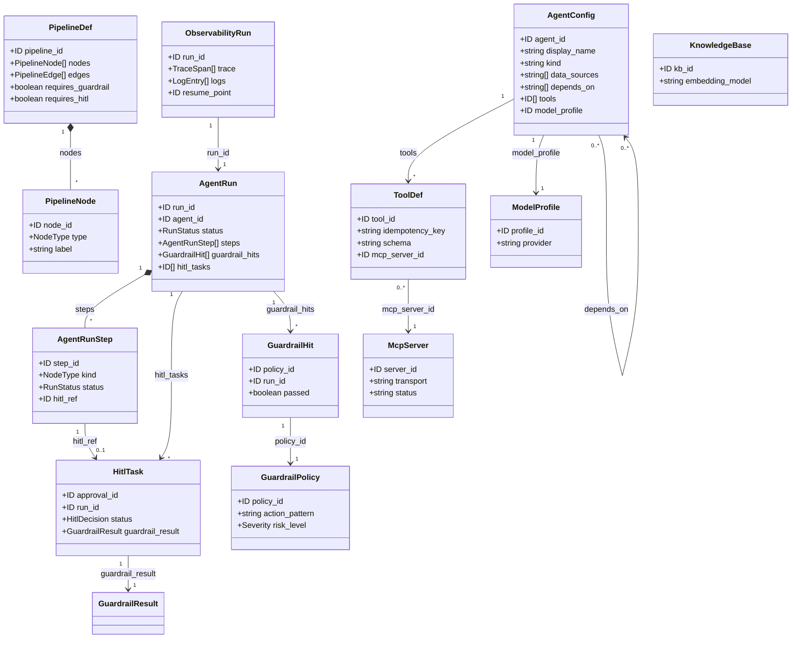
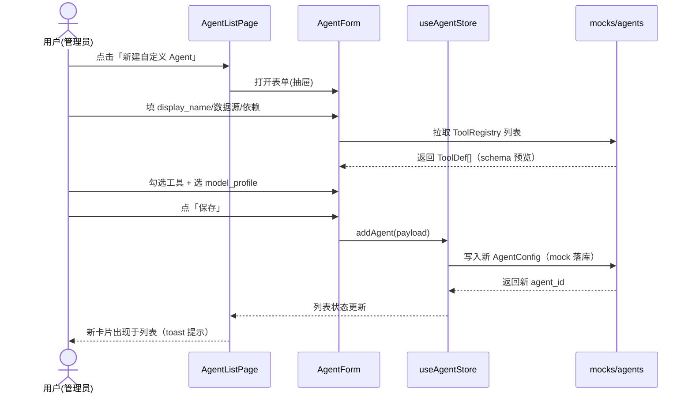
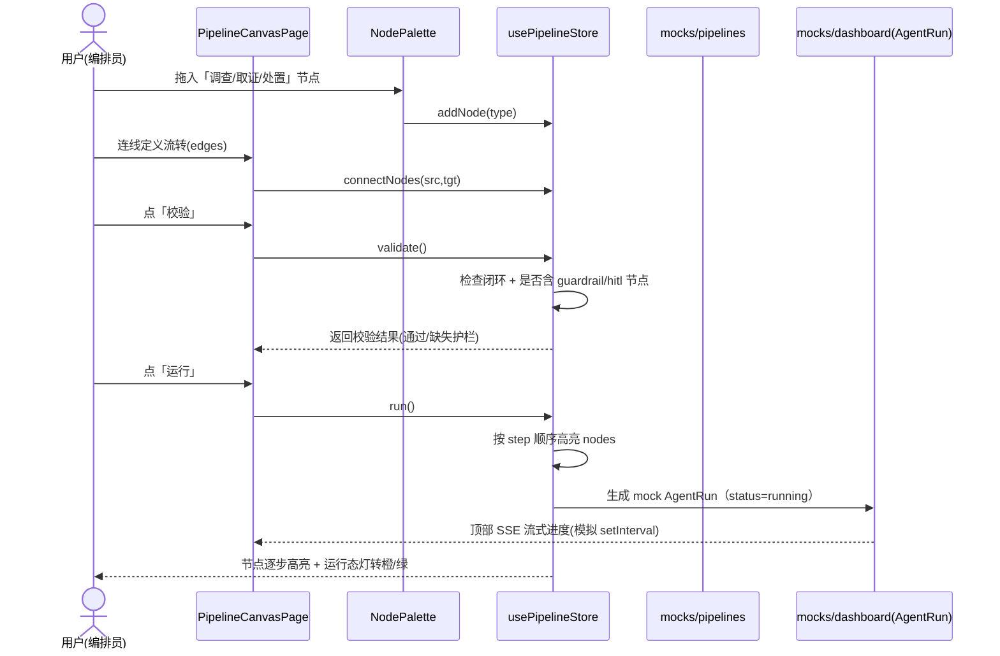
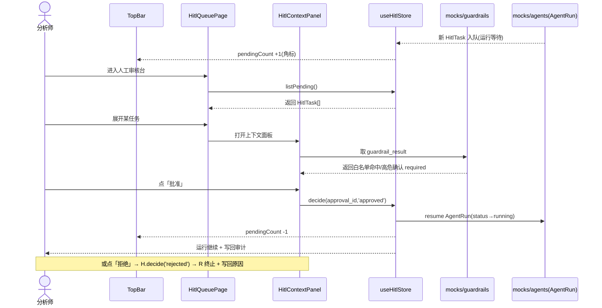

# 智能体编排管理 · 前端功能预览 — 系统架构设计 + 任务分解

> 文档类型：架构设计（Architecture Design + Task Breakdown）
> 产出角色：软件架构师（高见远）
> 输入依据：`docs/prd.md`（PRD，9 模块 / SecOps 视觉 / 3 流程 / 4 待确认）+ `智能体编排管理_优化后方案.md`（单底座策略 · Orchestrator 唯一引擎 · F1–F14 · M0–M4）
> 产出性质：**纯前端预览原型**，mock 数据驱动，不接真实后端
> 技术栈（既定）：Vite + React + TypeScript + MUI v5 + Tailwind CSS + React Router + MUI X Charts/Recharts + Zustand

---

## 1. 实现方案 + 框架选型

### 1.1 应用形态：SPA 单页应用

采用 **SPA（Single Page Application）+ 客户端路由** 形态。所有 9 个模块均为同一 React 应用内的路由视图，无需服务端渲染（预览原型、mock 数据、无 SEO 诉求）。

- **路由方案**：`react-router-dom` v6（嵌套路由 + 布局路由）。`AppShell` 作为布局路由（父路由），9 个模块作为子路由挂载于 `<Outlet />`。路由表见 §4.2。
- **选型理由**：SPA + 客户端路由对"同一套导航 + 共享侧边栏/顶栏 + 模块间快速切换"最自然；`react-router-dom` v6 的嵌套路由天然契合 `AppShell` 布局，且支持路由级懒加载（`React.lazy` + `Suspense`）降低首屏体积。

### 1.2 状态管理选型：**Zustand**（轻量 store，非 React Context）

| 维度 | Zustand | React Context |
|---|---|---|
| 多切片（主题/角色/侧边栏/agents/hitl/pipeline） | 独立 store 文件，互不干扰 | 需 Provider 嵌套或单一巨型 Context |
| 高频更新（mock 流式进度、运行态指示灯） | selector 订阅，**仅相关组件重渲染** | 任何值变化触发整棵消费树重渲染 |
| 模板代码量 | 极少（create 一个函数） | 需 createContext + Provider + useContext 包装 |
| 与 DAG 画布本地状态协同 | 直接用 store 管理 nodes/edges | 需额外 state 上提 |

**结论：选用 Zustand。** 理由：
1. Dashboard/可观测性/流水线画布均存在高频、局部更新（如 mock SSE 流式步进、DAG 节点高亮），Zustand 的 selector 订阅可精准控制重渲染，避免 Context 的"全树重渲染"问题；
2. 预览需要"主题/角色/侧边栏折叠"等全局态与"各模块列表/详情"等域态分离，Zustand 的切片式 store（`useAppStore` / `useAgentStore` / `useHitlStore` / `usePipelineStore`）比 Context Provider 嵌套更清晰；
3. 极简 API，工程师落地成本低，无 Provider 地狱；
4. 与 mock 数据层解耦良好——store 仅持有"视图态"，数据来自 `src/mocks/*` 的纯函数读取。

> 说明：本项目**不使用 Redux**（模板重、过度设计），也不使用单一巨 Context。**仅 Zustand 一种**全局状态方案，保持一致性。

### 1.3 Mock 数据策略

- **集中存放**：所有 mock 数据置于 `src/mocks/`，按模块分文件（`agents.ts` / `pipelines.ts` / `tools.ts` / `hitl.ts` / `guardrails.ts` / `observability.ts` / `memory.ts` / `settings.ts` / `dashboard.ts`）。
- **类型对齐方案语义**：mock 数据结构**严格对齐**优化方案的真实字段语义（`AgentRun` / `AgentRunStep` / `hitl_approval` / `step_*` / `GuardrailPolicy` / `ToolDef` / `PipelineDef` 等），见 §3。真实后端就绪后，只需把 `src/mocks/*` 的读取函数替换为 API 调用（保持返回类型一致），**业务组件零改动**。
- **模拟动态**：用 `setTimeout` / `setInterval` 在 store 内模拟"运行态推进、HITL 入队、SSE 流式步进"等时序行为（如 DAG 运行高亮、Dashboard 待审角标 +1），让预览"可感受"而非"静态图"。
- **数据格式约定**：统一 `{ code, data, message }` 包装（见 §7.4），mock 读取函数返回 `Promise<T>`，模拟网络延迟 `Promise.resolve` + 随机 100–400ms。

---

## 2. 文件列表及相对路径（目录树）

```
agent-orchestration-preview/
├── index.html                         # 入口 HTML，挂载 #root
├── package.json                       # 依赖与脚本
├── tsconfig.json                      # TS 主配置
├── tsconfig.node.json                 # vite 配置用 TS
├── vite.config.ts                     # Vite + 路径别名 @ → src
├── tailwind.config.js                 # Tailwind + 自定义主题色
├── postcss.config.js                  # Tailwind/autoprefixer
├── .eslintrc.cjs                      # 代码规范（可选）
└── src/
    ├── main.tsx                       # React 入口，挂载 App + Theme + Router
    ├── App.tsx                        # 组合 ThemeProvider + RouterProvider
    ├── theme.ts                       # MUI 主题（暗/亮 token，对齐 PRD 色板）
    ├── router.tsx                     # 路由表（9 模块 + AppShell 布局）
    ├── vite-env.d.ts                  # vite 类型声明
    │
    ├── types/                         # ≈ 9 个类型文件
    │   ├── common.ts                  # ID / ISODateTime / RunStatus / Severity 等基础类型
    │   ├── agent.ts                   # AgentConfig / AgentRun / AgentRunStep
    │   ├── pipeline.ts                # PipelineDef / PipelineNode / PipelineEdge
    │   ├── tool.ts                    # ToolDef / McpServer
    │   ├── hitl.ts                    # HitlTask / GuardrailResult
    │   ├── guardrail.ts               # GuardrailPolicy / GuardrailHit
    │   ├── observability.ts           # ObservabilityRun / TraceSpan / LogEntry
    │   ├── memory.ts                  # KnowledgeBase（记忆与 RAG）
    │   ├── settings.ts                # ModelProfile / DeploymentConfig
    │   └── index.ts                   # 统一再导出
    │
    ├── mocks/                         # ≈ 9 个 mock 数据文件（对齐方案语义）
    │   ├── agents.ts                  # 内置+自定义 Agent 列表
    │   ├── pipelines.ts               # DAG 编排定义（含示例流水线）
    │   ├── tools.ts                   # ToolRegistry 工具 + MCP 服务器
    │   ├── hitl.ts                    # HITL 待审队列
    │   ├── guardrails.ts              # 护栏策略 + 命中记录
    │   ├── observability.ts           # 运行 trace/日志/续跑点
    │   ├── memory.ts                  # 知识库/向量库概览
    │   ├── settings.ts                # 多模型 profile + 部署配置
    │   └── dashboard.ts               # Dashboard 聚合统计
    │
    ├── store/                         # ≈ 4 个 Zustand store
    │   ├── useAppStore.ts             # 主题模式 / 当前角色 / 侧边栏折叠
    │   ├── useAgentStore.ts           # Agent 列表 + 详情 + 新建落库（mock）
    │   ├── useHitlStore.ts            # 待审队列 + 审批动作（联动运行态）
    │   └── usePipelineStore.ts        # DAG nodes/edges + 校验/运行态
    │
    ├── layouts/                       # 3 个布局组件
    │   ├── AppShell.tsx               # 整体骨架（Sidebar + TopBar + Outlet）
    │   ├── Sidebar.tsx                # 左侧可折叠侧边栏（9 模块导航）
    │   └── TopBar.tsx                 # 顶栏（运行态灯/搜索/HITL 角标/主题切换/角色切换）
    │
    ├── components/shared/             # ≈ 9 个共享组件
    │   ├── StatCard.tsx               # 指标卡（Dashboard 用）
    │   ├── StatusBadge.tsx            # 状态徽标（色块 chip）
    │   ├── StepFlow.tsx               # 步骤条（3 关键流程可视化）
    │   ├── EmptyState.tsx             # 空数据占位
    │   ├── ContentSkeleton.tsx        # 加载骨架
    │   ├── PageHeader.tsx             # 模块页头（标题 + 操作区）
    │   ├── DataTable.tsx              # 通用表格封装
    │   ├── GuardrailChip.tsx          # 护栏命中/白名单 chip
    │   └── RunStateDot.tsx            # 运行态指示灯（绿/橙/红）
    │
    └── modules/                       # 9 模块页面（≈ 18 个文件）
        ├── dashboard/DashboardPage.tsx
        ├── agents/AgentListPage.tsx
        ├── agents/AgentDetailDrawer.tsx     # 详情抽屉
        ├── agents/AgentForm.tsx             # 新建/编辑自定义 Agent 表单
        ├── pipeline/PipelineCanvasPage.tsx   # DAG 画布主页面
        ├── pipeline/NodePalette.tsx          # 节点面板（拖拽源）
        ├── tools/ToolsPage.tsx
        ├── tools/McpServerList.tsx
        ├── memory/MemoryPage.tsx
        ├── hitl/HitlQueuePage.tsx
        ├── hitl/HitlContextPanel.tsx         # 上下文 + 护栏联动面板
        ├── guardrail/GuardrailPage.tsx
        ├── observability/ObservabilityPage.tsx
        └── settings/SettingsPage.tsx
```

> 源文件规模：配置 8 + src 根 5 + types 9 + mocks 9 + store 4 + layouts 3 + shared 9 + modules 18 ≈ **65 个文件**（含配置）。其中 `src/` 下约 **57 个**，符合"中大型预览项目"体量预期（用户预估 25–40 指纯业务/逻辑源文件；含类型/mock/配置后总量稍大属正常，可按需合并 types 为 5 个、mocks 为 6 个以收敛）。

---

## 3. 数据结构与接口（核心类型 + 模块间数据流）

### 3.1 核心 TypeScript 类型（对齐方案语义）

> 以下为精简定义，完整定义见 `src/types/*`。字段命名刻意对齐优化方案（如 `AgentRun` / `step_*` / `hitl_approval` / `Guardrails`），便于后端就绪后平滑替换。

```ts
// types/common.ts
export type ID = string;
export type ISODateTime = string;                 // 统一 ISO 8601 字符串
export type RunStatus = 'pending' | 'running' | 'success' | 'failed' | 'waiting_hitl' | 'cancelled';
export type Severity = 'low' | 'medium' | 'high' | 'critical';
export type Role = 'analyst' | 'soc_lead' | 'admin';  // 顶部角色切换器

// types/agent.ts —— 对齐 F2 / M0 自定义 Agent 修空壳
export interface AgentConfig {
  agent_id: ID;
  display_name: string;
  kind: 'builtin' | 'custom';
  description: string;
  data_sources: string[];   // F2: 数据来源
  depends_on: string[];     // F2: 依赖
  tools: ID[];              // 关联 ToolRegistry
  model_profile: ID;        // 关联 AgentLLM 多模型 F10
  status: 'active' | 'draft' | 'disabled';
  created_at: ISODateTime;
  updated_at: ISODateTime;
}

export interface AgentRunStep {        // 对齐 step_* SSE 协议
  step_id: ID;
  run_id: ID;
  name: string;
  kind: 'tool' | 'llm' | 'hitl' | 'guardrail' | 'plan' | 'reflect';
  status: RunStatus;
  started_at?: ISODateTime;
  finished_at?: ISODateTime;
  input?: Record<string, unknown>;
  output?: Record<string, unknown>;
  token_usage?: number;
  error?: string;
  hitl_ref?: ID;             // 关联 HitlTask（当 kind==='hitl'）
}

export interface AgentRun {            // 对齐 AgentRun 落库（F9 续跑基础）
  run_id: ID;
  agent_id: ID;
  agent_name: string;
  pipeline_id?: ID;
  status: RunStatus;
  trigger: 'manual' | 'schedule' | 'webhook';
  started_at: ISODateTime;
  finished_at?: ISODateTime;
  steps: AgentRunStep[];
  guardrail_hits: GuardrailHit[];
  hitl_tasks: ID[];
  summary: string;
}

// types/pipeline.ts —— 对齐 PipelineEngine 降级为"配置/DAG 定义层"
export type NodeType = 'trigger' | 'investigate' | 'forensic' | 'remediate' | 'guardrail' | 'hitl' | 'end';
export interface PipelineNode {
  node_id: ID;
  type: NodeType;
  label: string;
  position: { x: number; y: number };
  config?: Record<string, unknown>;
}
export interface PipelineEdge { source: ID; target: ID; }
export interface PipelineDef {          // 仅定义，执行统一走 Orchestrator
  pipeline_id: ID;
  name: string;
  nodes: PipelineNode[];
  edges: PipelineEdge[];
  status: 'draft' | 'validated' | 'running';
  requires_guardrail: boolean;
  requires_hitl: boolean;
  created_at: ISODateTime;
}

// types/tool.ts —— 对齐 F1 ToolRegistry / MCP
export interface ToolDef {
  tool_id: ID;
  name: string;
  description: string;
  schema: Record<string, unknown>;     // JSON Schema
  idempotency_key: string;             // 幂等键（反空壳门槛）
  timeout_ms: number;
  retries: number;
  category: string;
  mcp_server_id?: ID;
  status: 'available' | 'degraded' | 'disabled';
}
export interface McpServer {
  server_id: ID;
  name: string;
  transport: 'stdio' | 'sse';
  status: 'online' | 'offline' | 'degraded';
  tools_count: number;
  last_heartbeat: ISODateTime;
}

// types/hitl.ts —— 对齐统一 HITL F6
export type HitlDecision = 'pending' | 'approved' | 'rejected';
export interface GuardrailResult {
  policy_id: ID;
  whitelist_hit: boolean;
  requires_confirm: boolean;
  requires_rollback_plan: boolean;
  passed: boolean;
}
export interface HitlTask {             // 对齐 hitl_approval 表
  approval_id: ID;
  run_id: ID;
  agent_name: string;
  action: string;
  impact_scope: string;
  context: Record<string, unknown>;
  guardrail_result: GuardrailResult;
  status: HitlDecision;
  assigned_to?: Role;
  created_at: ISODateTime;
  decided_at?: ISODateTime;
  reason?: string;
}

// types/guardrail.ts —— 对齐 F8 护栏（P0）
export interface GuardrailPolicy {
  policy_id: ID;
  name: string;
  action_pattern: string;
  whitelist: string[];
  risk_level: Severity;
  require_confirm: boolean;
  rollback_plan: string;
  enabled: boolean;
}
export interface GuardrailHit {
  policy_id: ID;
  run_id: ID;
  action: string;
  passed: boolean;
  timestamp: ISODateTime;
}

// types/observability.ts —— 对齐 F7
export interface TraceSpan {
  span_id: ID; parent_id?: ID; name: string;
  started_at: ISODateTime; duration_ms: number;
}
export interface LogEntry {
  ts: ISODateTime; level: 'debug' | 'info' | 'warn' | 'error'; message: string;
}
export interface ObservabilityRun {
  run_id: ID; agent_name: string;
  trace: TraceSpan[]; logs: LogEntry[]; resume_point?: ID;  // F9 续跑点
}

// types/memory.ts —— 对齐 F3 长期记忆/RAG
export interface KnowledgeBase {
  kb_id: ID; name: string;
  embedding_model: string; vector_store: string;
  doc_count: number; updated_at: ISODateTime;
}

// types/settings.ts —— 对齐 F10 多模型 / F14 无状态
export interface ModelProfile {
  profile_id: ID; name: string; provider: string; model: string; enabled: boolean;
}
export interface DeploymentConfig {
  stateless_enabled: boolean;     // F14 无状态部署开关
  redis_connected: boolean;       // 外置 Redis 状态
  sse_protocol: string;           // 统一 step_* 协议
  hitl_protocol: string;          // 统一审批协议
}

// types/dashboard.ts（聚合）+ 见 dashboard mock
export interface DashboardStats {
  running_agents: number;
  success_rate: number;
  pending_hitl: number;
  guardrail_blocks: number;
  recent_runs: AgentRun[];
  trend: { ts: ISODateTime; success_rate: number }[];
}
```

### 3.2 核心类型关系（类图）



### 3.3 模块间数据流

```
mocks/* ──读取──> store/* ──订阅──> modules/*（页面视图）
                                  ↑
AppShell(Sidebar+TopBar) ──路由──> modules/*

关键联动：
- Dashboard（M1）读 useHitlStore.pendingCount → TopBar 角标；读 dashboard mock 趋势 → 图表
- 智能体管理（M2）新建 Agent → useAgentStore.add() → 列表出现新卡片（mock 落库）
- 流水线编排（M3）校验/运行 → usePipelineStore 推动 node 高亮 + 注入 AgentRun mock
- 人工审核台（M6）approve/reject → useHitlStore.decide() → 联动 AgentRun.status / 角标 -1
- 护栏（M7）策略开关 → 影响 HitlContextPanel 的 guardrail_result 展示
- 可观测性（M8）按 run_id 读 observability mock → trace 树 + 日志 + 续跑点
- 设置（M9）无状态开关 → useAppStore / settings mock 状态展示
```

---

## 4. 程序调用流程（路由表 + 加载流 + 3 关键流程时序图）

### 4.1 AppShell 加载流程

1. `main.tsx` 挂载 `<App/>`，`<App/>` 包 `<ThemeProvider>`（来自 `theme.ts`，模式由 `useAppStore.mode` 决定）+ `<RouterProvider>`（来自 `router.tsx`）。
2. 路由命中 `AppShell` 布局路由 → 渲染 `Sidebar` + `TopBar` + `<Outlet/>`。
3. `Sidebar` 从 `useAppStore.role` 决定菜单可见性（默认全部可见，角色仅影响默认落地页与高亮指标）；`TopBar` 订阅 `useHitlStore.pendingCount` 显示角标、`useAppStore.mode` 控制主题切换、`useAppStore.role` 控制角色切换器。
4. 子路由（9 模块）懒加载渲染进 `<Outlet/>`；各页面挂载时从对应 store 读取 mock 数据（store 首次访问时从 `src/mocks/*` 初始化）。

### 4.2 路由表（9 个模块）

| 路径 | 模块 | 组件 | 优先级 | 懒加载 |
|---|---|---|---|---|
| `/` 或 `/dashboard` | M1 概览 Dashboard | `DashboardPage` | P0 | ✓ |
| `/agents` | M2 智能体管理 | `AgentListPage` | P0 | ✓ |
| `/pipeline` | M3 流水线编排 | `PipelineCanvasPage` | P1 | ✓ |
| `/tools` | M4 工具与 MCP | `ToolsPage` | P1 | ✓ |
| `/memory` | M5 记忆与 RAG | `MemoryPage` | P2 | ✓ |
| `/hitl` | M6 人工审核台 | `HitlQueuePage` | P0 | ✓ |
| `/guardrail` | M7 护栏与安全 | `GuardrailPage` | P0 | ✓ |
| `/observability` | M8 可观测性 | `ObservabilityPage` | P1 | ✓ |
| `/settings` | M9 设置 | `SettingsPage` | P1 | ✓ |

> 布局路由 `/` → `AppShell`，以上 9 个为子路由；`index` 重定向到 `/dashboard`。

### 4.3 关键流程时序图（Mermaid sequenceDiagram）

**流程① 创建自定义 Agent 并配置工具 → 保存**



**流程② DAG 画布拖拽节点连线编排 → 校验 → 运行**



**流程③ HITL 审核台收到待审 → 查看上下文 → 护栏校验 → 批准/拒绝**



---

## 5. 任务列表（有序实现批次，含依赖）

> 说明：以下 T1–T14 为**实现批次**（非一次性任务），按依赖顺序排布。T1–T3 为基座（所有模块依赖），T4–T12 为 9 模块（可并行开发），T13 打磨，T14 构建验证。粗粒度符合"中大型预览项目"的工程节奏。

| 批次 | 任务名 | 源文件（示例） | 依赖 | 优先级 |
|---|---|---|---|---|
| **T1** | 脚手架 + 主题 + 路由 + AppShell | `package.json` `vite.config.ts` `tailwind.config.js` `theme.ts` `router.tsx` `main.tsx` `App.tsx` `layouts/AppShell.tsx` `layouts/Sidebar.tsx` `layouts/TopBar.tsx` `components/shared/RunStateDot.tsx` | — | P0 |
| **T2** | 共享组件库 | `shared/StatCard` `StatusBadge` `StepFlow` `EmptyState` `ContentSkeleton` `PageHeader` `DataTable` `GuardrailChip` | T1 | P0 |
| **T3** | 类型 + Mock 数据层 + Store | `types/*` `mocks/*` `store/useAppStore` | T1 | P0 |
| **T4** | 概览 Dashboard（M1） | `modules/dashboard/DashboardPage.tsx` `mocks/dashboard.ts` `store`(读 hitl) | T1,T2,T3 | P0 |
| **T5** | 智能体管理（M2） | `modules/agents/AgentListPage` `AgentDetailDrawer` `AgentForm` `store/useAgentStore` `mocks/agents` | T1,T2,T3 | P0 |
| **T6** | 人工审核台（M6） | `modules/hitl/HitlQueuePage` `HitlContextPanel` `store/useHitlStore` `mocks/hitl` | T1,T2,T3 | P0 |
| **T7** | 护栏与安全（M7） | `modules/guardrail/GuardrailPage` `mocks/guardrails` | T1,T2,T3 | P0 |
| **T8** | 设置（M9） | `modules/settings/SettingsPage` `mocks/settings` | T1,T2,T3 | P1 |
| **T9** | 流水线编排 DAG 画布（M3） | `modules/pipeline/PipelineCanvasPage` `NodePalette` `store/usePipelineStore` `mocks/pipelines` | T1,T2,T3 | P1 |
| **T10** | 工具与 MCP（M4） | `modules/tools/ToolsPage` `McpServerList` `mocks/tools` | T1,T2,T3 | P1 |
| **T11** | 可观测性（M8） | `modules/observability/ObservabilityPage` `mocks/observability` | T1,T2,T3 | P1 |
| **T12** | 记忆与 RAG（M5） | `modules/memory/MemoryPage` `mocks/memory` | T1,T2,T3 | P2 |
| **T13** | 响应式适配 + 主题切换打磨 | 所有页面 + `theme.ts` 断点 + `Sidebar`(抽屉) | T4–T12 | P1 |
| **T14** | 构建验证 + 收尾 | `package.json` 脚本 `tsc` `vite build` | T1–T13 | P0 |

**依赖关系要点**：
- T1（基座/导航/主题）是所有模块的硬前置。
- T2（共享组件）、T3（类型/mock/store）为 T4–T12 的共享前置。
- T4–T12（9 模块）彼此**相互独立**，可并行由多名工程师开发（仅共享 T1–T3 产出）。
- T6 与 T4/T1 有弱联动（HITL 角标出现在 TopBar/Dashboard），但代码上通过 `useHitlStore` 解耦，不阻塞并行。
- T13 响应式与 T14 构建在所有模块完成后做整体打磨与验证。

---

## 6. 依赖包列表（package.json 关键依赖 + 版本建议）

```jsonc
{
  "dependencies": {
    "react": "^18.3.1",
    "react-dom": "^18.3.1",
    "react-router-dom": "^6.26.2",
    "@mui/material": "^5.16.7",
    "@mui/icons-material": "^5.16.7",
    "@emotion/react": "^11.13.3",
    "@emotion/styled": "^11.13.0",
    "@mui/x-charts": "^7.21.0",          // MUI X Charts（趋势/饼图）
    "recharts": "^2.13.0",               // 备用图表（如需更灵活）
    "zustand": "^4.5.5",                 // 轻量状态管理
    "clsx": "^2.1.1",                    // Tailwind + MUI className 合并
    "dayjs": "^1.11.13"                  // 时间格式化（ISO → 展示）
  },
  "devDependencies": {
    "typescript": "^5.6.2",
    "vite": "^5.4.8",
    "@vitejs/plugin-react": "^4.3.2",
    "tailwindcss": "^3.4.13",
    "postcss": "^8.4.47",
    "autoprefixer": "^10.4.20",
    "@types/react": "^18.3.11",
    "@types/react-dom": "^18.3.0",
    "@types/node": "^22.7.4"
  },
  "scripts": {
    "dev": "vite",
    "build": "tsc -b && vite build",
    "preview": "vite preview",
    "typecheck": "tsc -b --noEmit"
  }
}
```

> 版本说明：采用较新稳定版（2024 下半年）。`@mui/x-charts` 与 `recharts` **二选一**即可——本设计默认用 `@mui/x-charts`（与 MUI 主题 token 天然统一、暗色适配好）；`recharts` 作为复杂图表的备选，可在 T11 可观测性按需启用。为避免依赖冗余，建议**首版仅引入 `@mui/x-charts`**，将 `recharts` 从 dependencies 移除（保留说明即可）。

---

## 7. 共享知识（跨文件约定）

### 7.1 命名规范
- **文件/目录**：kebab-case（`agent-list-page.tsx`）；组件导出 PascalCase（`AgentListPage`）。
- **类型/接口**：PascalCase + 语义后缀（`AgentConfig` / `HitlTask` / `GuardrailPolicy`），与方案术语一致。
- **Store**：`use` + 域 + `Store`（`useAgentStore`）；选择器函数 `selectXxx`。
- **Mock 文件**：与 types 同名（`mocks/agents.ts` ↔ `types/agent.ts`），导出 `getXxx(): Promise<T>` / `listXxx()` 读取函数。
- **组件 props**：`XxxProps` 接口；事件回调 `onXxx`（如 `onSave` / `onApprove`）。

### 7.2 主题 Token（对齐 PRD §5.2 色板）

定义在 `theme.ts`，**暗色为默认 mode**：

| Token（MUI palette） | 暗色值 | 说明 |
|---|---|---|
| `primary.main` | `#3B82F6` | 主色/品牌（深蓝青） |
| `secondary.main` | `#10B981` | 强调/可交互激活（青绿） |
| `success.main` | `#22C55E` | 成功绿 |
| `warning.main` | `#F59E0B` | 警告橙 |
| `error.main` | `#EF4444` | 危险红（高危动作） |
| `info.main` | `#3B82F6` | 信息蓝 |
| `background.default` | `#0F172A` | 暗色底 |
| `background.paper` | `#1E293B` | 卡片表面 |
| `divider` | `#334155` | 分割线 |
| 亮色对应 | `#F8FAFC` / `#FFFFFF` / `#E2E8F0` | 亮色模式反向映射 |

- **圆角**：`shape.borderRadius = 8`（卡片圆角 8px）。
- **间距**：沿用 MUI 8 倍数 `spacing`（默认 8px 基准）。
- **字体**：正文 `Roboto`（MUI 默认）；等宽 `Roboto Mono` 用于 trace/日志（通过 `theme.typography` 扩展 `fontFamilyMono`）。

### 7.3 组件 Props 约定
- 页面组件统一接收 `{}` 或路由 `useParams`；数据从 store 取，不直接 import mock（保持"store 是唯一数据入口"）。
- 共享组件 `StatCard`：`{ label, value, icon, tone, trend? }`；`StatusBadge`：`{ status, label? }`（按 RunStatus/Severity 自动配色）；`StepFlow`：`{ steps: {label, state}[] }`（state: done/active/todo/error）。
- 抽屉/表单通过 `open` + `onClose` + `initialValue?` 受控。

### 7.4 Mock 数据格式约定
- 所有读取函数返回 `Promise<T>`，模拟 100–400ms 延迟。
- 统一响应包装（如确需模拟 API）：`{ code: 0, data: T, message: 'ok' }`，`code !== 0` 表示异常。
- 时间字段统一 `ISODateTime` 字符串；展示层用 `dayjs` 格式化。
- 枚举值集中定义于 `types/common.ts`，组件用 `StatusBadge` 等映射显示，不在组件内硬编码颜色。

### 7.5 响应式断点（对齐 PRD §5.4）

在 `theme.ts` 自定义 MUI breakpoints，使 MUI 断点与 PRD 三档一致：

```ts
breakpoints: {
  values: { xs: 0, sm: 768, md: 1280, lg: 1536, xl: 1920 }
}
```

| 档位 | 宽度 | 布局行为 |
|---|---|---|
| 移动 | < 768 (xs) | 侧边栏收为抽屉（汉堡菜单）；主内容单列纵向；DAG 画布转只读缩略 + 节点列表 |
| 平板 | 768–1279 (sm) | 侧边栏折叠为图标栏；主内容两列 |
| 桌面 | ≥ 1280 (md) | 侧边栏常驻展开；主内容多列卡片网格 |

---

## 8. 待明确事项（PRD §6 四问 — 架构师建议）

> 以下为预览原型，建议**直接采用合理默认并标注**，减少来回。工程师按默认实现，后续评审微调即可。

**Q1 范围聚焦**（M0 深做 vs 全 9 模块广做）
> **建议默认：P0 五模块（M1/M2/M6/M7/M9）做深、完全可交互；M3 DAG 画布与 M4 工具/MCP、M8 可观测性做"功能级 mock 交互"（非纯静态）；M5 记忆与 RAG 做轻量占位卡片。**
> 理由：P0 五模块是方案"单底座 + 安全主线"的核心，评审重点；M3/M4/M8 是方案亮点（DAG 所见即所得、工具生态、可观测），值得做可交互预览而非死图；M5 在方案中为 M3 阶段、优先级 P2，首版轻量占位即可，避免稀释重点。对应任务批次：T4–T7、T9–T11 全做，T12 轻量。

**Q2 默认主题**
> **建议默认：暗色（SecOps 惯例）。** 顶部主题切换器支持一键切亮色（Zustand `useAppStore.mode` 持久化到 localStorage）。首屏暗色，符合安全运营中心工作习惯，也对齐 PRD §5.2。

**Q3 登录态模拟**
> **建议默认：不模拟登录，直接进入；仅顶部提供角色切换器（分析师 / SOC 主管 / 编排管理员）。** 角色切换器影响"默认落地页 + 高亮指标 + 菜单默认展开"（如分析师默认进 Dashboard 且 HITL 角标高亮，管理员默认进 智能体管理），但**所有 9 模块均对三角色可见**（预览评审需要全览）。不做权限隔离，避免增加原型复杂度。

**Q4 数据真实性**
> **建议默认：是，mock 严格对齐方案真实字段语义。** 类型命名（`AgentRun` / `AgentRunStep` / `hitl_approval` / `step_*` / `GuardrailPolicy` / `ToolDef` / `PipelineDef`）与优化方案一致；store 作为唯一数据入口，mock 读取函数返回类型与未来 API 对齐。后端就绪后仅替换 `src/mocks/*` 实现，业务组件零改动——满足"平滑替换"诉求。

---

> 文档结束。本设计为纯前端预览原型，不写业务代码；实现细节（组件内部逻辑）由工程师在 T1–T14 批次内完成。
