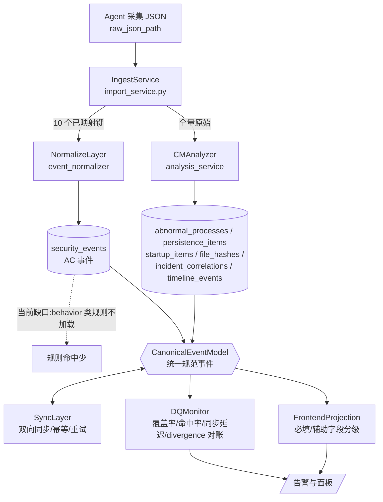

# 分析中心（AC）优化设计方案（v2）

> 主理人齐活林（Qi）直接交付。背景：本环境未注册 `software-architect` 子代理，原定架构师产出改为主理人基于已核实代码事实直接整理。
> 适用范围：分析中心（AC = `security_events` + `rule_matcher`）与案例管理（CM = `AnalysisService` + 专用结果表）的事件一致性对齐、全量覆盖，以及**前端事件字段的应急响应视角展示方案**。
> **v2 变更**：在 v1（全量覆盖 + 规范模型 + 双向同步 + 质量监控）基础上，新增 §10 前端事件字段展示方案（应急专家视角），并在 §2/§3 增加前端字段投影的边界与关联说明。
> **v2.1 变更**：在 §10 新增「摘要」必填字段（必填项由 13 → 14），并将「证据详情」拆分为「范式化视图」与「完整原始数据」双视图。

## 0. 现状结论（一句话）
AC 当前**既未完整覆盖业务数据源**（仅 10/20 个原始区块入表），也**未与 CM 做任何事件对齐/同步**（两端 schema 独立、无回写、无对账），且**前端展示字段未从应急研判角度分级**；本方案用「全量接入 + 规范事件模型 + 双向同步 + 质量监控 + 前端字段分级」五件套解决。

## 1. 架构总览



新增四个模块：**CanonicalEventModel（规范事件模型）**、**SyncLayer（同步层）**、**DQMonitor（数据质量监控）**、**FrontendProjection（前端字段投影）**。

## 2. 模块职责边界

| 模块 | 职责 | 明确不做 |
|------|------|----------|
| IngestService (`import_service.py`) | 采集接入、触发归一化、触发 CM 分析、写 `agent_imports` | 不做事规则匹配、不做同步、不做字段补全决策 |
| NormalizeLayer (`event_normalizer.py`) | 原始→规范事件、**字段校验与补全**、写入 `security_events` | 不做跨事件关联、不调 CM |
| RuleMatcher (`rule_matcher.py`) | 对规范事件做规则匹配，产出 `matched_rules`（单事件） | 不跨事件关联、不读原始 JSON |
| CMAnalyzer (`analysis_service.py`) | 对原始 JSON 做行为/语义分析，产出 CM 专用表与融合告警 | 不写 `security_events`（经 SyncLayer 回写） |
| **CanonicalEventModel（新）** | 定义统一事件 schema，两端事件都映射到它 | 不持有业务逻辑 |
| **SyncLayer（新）** | AC↔CM 事件同步，幂等 upsert、重试、补偿、冲突解决 | 不做规则匹配 / 分析 |
| **DQMonitor（新）** | 覆盖率/命中率/同步延迟/divergence 监控与周期性对账 | 不修改业务数据（只读比对 + 告警） |
| **FrontendProjection（新）** | 从 `CanonicalEvent` 派生**必填/辅助**展示字段分级，供 AC 前端消费（详见 §10） | 不做数据加工，只做展示裁剪与分级 |

## 3. 接口定义（关键签名）

```python
# ── NormalizeLayer 扩展点 ──
def normalize_batch(raw_events: list[dict], validate: bool = True) -> list[SecurityEvent]:
    """新增 validate 参数；校验失败字段标记为 None + 置 quality_flags。"""

# ── CanonicalEventModel ──
@dataclass
class CanonicalEvent:
    event_uid: str          # 全局唯一 = f"{source}:{source_event_id}"
    source: str             # "ac" | "cm"
    source_event_id: str    # security_events.id 或 CM 表主键
    host_id: int
    case_id: int | None
    event_type: str
    category: str           # 统一枚举，含 behavior
    severity: str
    risk_score: int
    status: str             # pending/triaging/investigating/resolved/rejected
    assignee: str | None
    timestamp: str
    evidence: dict
    attack_stage: str | None
    lifecycle_state: str
    version: int            # 乐观锁
    updated_at: str
    # 以下为前端展示派生字段（映射规则见 §10）
    display: "CanonicalEventDisplay"   # 必填/辅助分级后的展示视图

# ── SyncLayer ──
class SyncService:
    def sync_cm_to_ac(self, host_id: int) -> SyncResult:
        """CM 分析完成后调用：把 CM 告警映射为 CanonicalEvent 并 upsert 进 security_events。"""
    def sync_ac_to_cm(self, event_uid: str) -> SyncResult:
        """AC 侧状态/处置变更回写 CM，保持处置一致。"""
    def backfill(self, host_id: int, source: str) -> SyncResult:
        """全量补同步（首次接入或修复后）。"""

# ── DQMonitor ──
class DQReconciler:
    def check_coverage(self, host_id: int) -> CoverageReport:   # 入表区块 / 总区块
    def check_divergence(self, host_id: int) -> DivergenceReport:  # 两端 canonical 数/字段差
    def check_field_fill(self, host_id: int) -> FieldFillReport:  # 必填展示字段填充率（§10）
    def metrics(self) -> dict:  # coverage_rate / match_rate / sync_lag_p95 / divergence_count / field_fill_rate

# ── FrontendProjection ──
class FrontendProjection:
    def project(self, ev: CanonicalEvent) -> CanonicalEventDisplay:
        """从 CanonicalEvent 派生必填/辅助分级的展示视图，供前端直接渲染。"""
```

HTTP 接口（挂在现有 router 上）：
- `POST /api/sync/host/{host_id}` — 触发同步
- `GET  /api/dq/metrics` — 质量指标（含必填字段填充率）
- `GET  /api/dq/reconcile?host_id=` — 触发对账
- `GET  /api/events/{id}/display` — 返回分级后的展示视图（必填+辅助）

## 4. 全量数据完整性保障机制

### 4.1 数据源接入范围（扩展 `EVENT_TYPE_MAP`）
当前仅映射 10 个键。需把以下**当前未入表区块**纳入（新增 mapper + event_type）：

| 原始区块 | 新 event_type | 说明 |
|----------|---------------|------|
| `files` | `file_event` | 当前 `file_hashes`→`file_create` 只覆盖哈希，漏掉文件实体 |
| `logs` | `log_event` | 系统/安全日志目前完全未入 AC |
| `security` | `security_event` | 安全配置/策略事件 |
| `browser` | `browser_event` | 浏览器痕迹 |
| `usb` | `usb_event` | USB 设备记录 |
| `remote_control` | `remote_control_event` | 远程工具记录 |
| `ioc` | `ioc_event` | 情报命中（当前仅在 CM `ioc_hits`） |
| `timeline` | （不单列，作为证据关联） | 时间线由 DQ/关联层聚合，不重复建事件 |

同时修正口径差异：`network` 原始区块与 `network_connections` 对齐；`persistence` 原始区块并入 `persistence_register` 映射。

### 4.2 数据校验与补全策略
1. **Schema 校验**：归一化时对每层 mapper 输出做 schema 校验（字段类型/必填），失败字段置 `None` 并打 `quality_flags`，不整条丢弃。
2. **缺失补全/标记**：`case_id` 经 `hosts.case_id` 反查补全；无法补全的标记 `case_id=null` 并告警。
3. **数量对账**：`ImportRecord` 记录 `expected`（原始各区块计数）vs `inserted`（归一化后），不一致写入 `import_anomalies`。
4. **失败隔离**：解析/校验彻底失败的原始记录进 `raw_failed` 死信表，可后续人工/重试修复，不影响主链路。

## 5. 字段映射与一致性对齐方案

### 5.1 统一规范事件模型
见 §3 `CanonicalEvent`。两端所有事件先映射为 `CanonicalEvent`，再决定落库/展示，确保**字段、状态、分类、生命周期**四统一。

### 5.2 AC 已匹配事件 → Canonical
`security_events` 行直接映射：`id→source_event_id(source="ac")`、`matched_rules→evidence.rule_hits`、`severity`/`status`/`attack_stage` 原样带入；`category` 由 `matched_rules[].category` 推导（多条取最高危）。

### 5.3 CM 告警 → Canonical
| CM 表 | 映射来源 | category |
|-------|----------|----------|
| `abnormal_processes` | 异常进程（含 orphan/short-lived/unsigned） | `behavior` / `process` |
| `persistence_items` | 可疑持久化 | `persistence` |
| `suspicious_startup_items` | 中高危启动项 | `startup` |
| `file_hashes` | 文件哈希命中 | `ioc` / `execution` |
| `incident_correlations` | 融合检测告警 | 按场景类型（lateral/persistence/c2…） |
| `timeline_events` | 时间线节点 | 按 event_type |

`risk_score` 取自 CM 的 `risk_score`/`risk_level`（解决 AC 全 `medium` 的平铺问题）。

### 5.4 状态机 / 分类 / 生命周期对齐
- **状态机**：两端统一 `pending→triaging→investigating→resolved/rejected`，状态变更经 SyncLayer 双向传播，冲突以 `version`/`updated_at` 较大者为准。
- **分类**：统一 `category` 枚举（process / network / persistence / startup / behavior / ioc / credential / discovery …），**把 `behavior` 正式纳入**，从根本上修复 AC 行为检测缺失。
- **生命周期**：`lifecycle_state` 记录 采集→归一化→匹配→分析→同步→处置 全阶段，两端共享同一 `event_uid` 的时间线。

## 6. 事件同步机制

| 维度 | 设计 |
|------|------|
| **频率** | CM 分析完成→异步事件触发 `SyncService.sync_cm_to_ac`（准实时）；AC 状态变更→同步回写 CM（实时）；**定时对账兜底**（每 5 分钟 `DQReconciler.check_divergence`） |
| **方向** | **CM→AC 为主**（把行为告警补进 AC，直接补上 behavior 缺口）；**AC→CM 为辅**（处置结论回写 CM，保证两端处置一致）。主从分明、避免回环 |
| **幂等** | `event_uid = source:source_event_id` 唯一键，`upsert` 语义，重复同步不产生重复事件 |
| **重试** | 同步失败指数退避，最多 3 次；仍失败进 `sync_dead_letter` |
| **冲突解决** | `version`/`updated_at` 大者胜；状态机取更靠后的合法状态 |
| **补偿** | 对账发现 divergence → 自动触发 `backfill` 修复，超阈值人工介入 |

## 7. 数据质量监控与一致性校验

- **覆盖率** `coverage_rate = 入表区块数 / 原始区块数`，目标 100%；<100% 即告警。
- **命中率** `match_rate = 有 matched_rules 的事件 / 总事件`，监控规则有效性。
- **同步延迟** `sync_lag_p95`：CM 产出到 AC 可见的 p95 延迟，超阈值告警。
- **分歧计数** `divergence_count`：两端 canonical 事件数差、关键字段差。
- **必填字段填充率** `field_fill_rate`：前端必填展示字段（§10 标注「必填」者）非空比例，低于阈值说明数据缺失影响研判。
- **对账任务**：`DQReconciler` 周期性比对 `security_events` 与 CM 表（经 CanonicalEvent 桥接），输出 divergence 报告。
- **可视化**：`GET /api/dq/metrics` 供面板展示；异常写入告警通道。

## 8. 落地步骤与风险

**分阶段：**
1. **全量接入**：扩展 `EVENT_TYPE_MAP` + 新增 mapper（§4.1）+ 校验/补全框架（§4.2）。
2. **规范模型**：定义 `CanonicalEvent` + 双端映射（§5）。
3. **同步层**：实现 `SyncService`（CM→AC 回写行为告警，顺带修 `orphan_process` 的 `parent_name=None→"none"` bug）。
4. **质量监控**：`DQReconciler` + `/api/dq/*` 接口 + 面板。
5. **前端字段分级**：实现 `FrontendProjection`（§10），前端按必填/辅助渲染。

**关键风险：**
- 归一化性能：批量插入需分批 + 索引优化。
- 同步延迟：CM 分析是重计算，需异步化，避免阻塞采集。
- 字段映射歧义：CM 多表结构差异大，映射需逐表评审（建议先 abnormal_processes / incident_correlations 两类试点）。
- **前置依赖**：`behavior` 类规则要能在 AC 生效，须先修 `rule_matcher` 的 category-map 缺口与 `orphan_process` 误判——这是 §5.3/§6 能跑通的前提。
- **前端过载**：必填字段控制在 14 项以内（§10，含「摘要」），避免一屏信息过载稀释研判效率。

## 9. 涉及文件
- `backend/app/services/import_service.py`（`EVENT_TYPE_MAP`、`read_raw_json`）
- `backend/app/services/event_normalizer.py`（mapper、`normalize_batch`、`_enrich_with_matched_rules`）
- `backend/app/services/rule_matcher.py`（`_EVENT_TYPE_CATEGORY_MAP`、`match_event`、`_match_behavior`、orphan_process bug）
- `backend/app/services/analysis_service.py`（`AnalysisService.analyze`）
- `backend/app/database.py`（`SecurityEvent` 及 CM 各表）
- `backend/app/api/events.py` / `backend/app/api/analysis.py`（接口挂载点）
- **新增**：`backend/app/services/canonical_event.py`、`sync_service.py`、`dq_monitor.py`、`frontend_projection.py`
- **前端**：`src/views/AnalysisCenter/EventList.vue`、`EventDetail.vue`（按 §10 分级渲染）

## 10. 前端事件字段展示方案（应急响应视角）

### 10.1 设计原则
- **秒级研判优先**：应急指挥要求"一眼定性、快速决策"，首屏只给决策必需信息，详情按需展开，避免信息过载。
- **两级分级**：**必填展示**（列表/卡片默认可见，控制在 **14 项以内**，含「摘要」）+ **辅助展示**（详情抽屉/侧栏按需加载）。
- **视觉编码减负**：用颜色/图标编码 `severity` 与 `category`，时间统一"相对时间 + 绝对时间"双显，减少文字密度。
- **关联优先**：单条告警默认带出关联攻击链与融合场景入口，避免"只见树木不见森林"。

### 10.2 字段清单（IR 专家视角）

| 字段名称 | 数据类型 | 展示优先级 | 字段说明（展示目的与应急决策价值） |
|----------|----------|------------|--------------------------------------|
| 事件 ID | string | 必填 | 全局唯一引用（`source:source_event_id`）。**目的**：跨模块关联锚点。**价值**：工单/通报引用、去重、串联同源事件。 |
| 案件 | string(int) | 必填 | 所属案件名称/编号。**目的**：归属上下文。**价值**：定位应急指挥上下文，判断是否为已知战役的一部分。 |
| 主机(资产) | string | 必填 | `hostname` + `ip`。**目的**：受影响资产标识。**价值**：判定资产重要性，决定**隔离优先级**（先断哪个）。 |
| 事件类型 | enum | 必填 | `process_start` / `persistence_register` / `network_outbound` …。**目的**：一秒定性"发生了什么"。**价值**：决定初步排查方向。 |
| 事件分类 | enum | 必填 | `process` / `network` / `persistence` / `behavior` …。**目的**：战术归类。**价值**：映射 ATT&CK 战术，直接选**处置剧本**。 |
| 攻击阶段 | enum | 必填 | 杀伤链阶段（recon / initial_access / execution / persistence / lateral / c2 / exfil …）。**目的**：入侵位置。**价值**：判断**入侵深度**，决定"立即遏制"还是"静默取证"。 |
| 摘要 | string | 必填 | 人话一句话摘要（如"主机 WIN-29 的 explorer.exe 派生可疑 powershell 下载脚本"）。**目的**：免点开详情即可定性。**价值**：**降低研判门槛**、快速分诊、列表首屏即可读懂"发生了什么"，是应急指挥的"标题"。由投影层生成（模板或模型摘要）；无法生成时降级取 `event_type`+`host` 拼接。 |
| 严重程度 | enum | 必填 | `critical` / `high` / `medium` / `low`（颜色编码）。**目的**：紧急度。**价值**：排序与**升级依据**。 |
| 风险评分 | int(0-100) | 必填 | 量化风险分。**目的**：与 severity 互补。**价值**：交叉确定**处置优先级**（高分未必高 severity）。 |
| 命中规则 | list[json] | 必填 | 触发的规则名 + 置信度 + 命中字段。**目的**：可解释性。**价值**：**误报初判**——低置信/已知白名单可快速放行，避免打断。 |
| 发生时间 | datetime | 必填 | 事件时间（相对+绝对）。**目的**：时序。**价值**：重建**时间线**、排序、确定关联窗口。 |
| 状态 | enum | 必填 | `pending→triaging→investigating→resolved/rejected`。**目的**：工作流状态。**价值**：避免**重复处置**、看清进度。 |
| 关联攻击链 | string/list | 必填 | `attack_chain_id` / `related_events`。**目的**：链条聚合。**价值**：单点告警→**完整链条**，避免只见树木。 |
| 情报命中 | bool/enum | 必填（若存在） | 是否命中威胁情报（IOC）。**目的**：外部确证。**价值**：快速**确证恶意**，可触发"一票否决式"升级。 |
| 进程主体 | json | 辅助 | `name` / `pid` / `path` / `command_line` / `parent`（进程事件默认展开）。**目的**：行为细节。**价值**：定位恶意样本、**命令行即意图**、父进程判孤儿进程。 |
| 网络主体 | json | 辅助 | `src/dst ip:port` / `protocol`（网络事件默认展开）。**目的**：连接细节。**价值**：识别 **C2 / 横向移动**。 |
| 持久化落点 | string | 辅助 | `registry_key` / `service_path` / `startup_path`。**目的**：驻留位置。**价值**：**清理与加固依据**。 |
| 证据详情 | json（双视图） | 辅助 | 取证支撑，提供**两种视图**切换（见下）。**目的**：深度取证。**价值**：报告取证支撑、复盘依据；既能快速看懂又能追溯原始。 |
| ↳ 视图A·范式化视图 | json | 辅助 | 原始数据经 §3 归一化投影出的**结构化字段**（如进程事件的 `name`/`pid`/`command_line`/`parent`，网络事件的 `src/dst`/`port`/`protocol`）。**目的**：人可快速读懂的"干净版"。**价值**：日常研判主力视图，避免被原始 JSON 噪声淹没。 |
| ↳ 视图B·完整原始数据 | json | 辅助 | 采集端上报的**全量原始 JSON**（含归一化过程中被裁剪/投影掉的字段）。**目的**：零丢失溯源。**价值**：高级取证、规则误报复盘、确认归一化未丢关键证据时的**唯一真相源**。 |
| 处置人 | string | 辅助 | `assignee`。**目的**：责任人。**价值**：协同与**升级对接**。 |
| 融合场景 | string | 辅助 | `incident_correlations` 场景名（如"持久化驻留"）。**目的**：战役级视角。**价值**：识别**协同攻击**，高价值但默认折叠防过载。 |
| 数据来源 | string | 辅助 | `source_collector`。**目的**：溯源。**价值**：数据**信任度**判定。 |
| 生命周期阶段 | enum | 辅助 | `lifecycle_state`。**目的**：管道位置。**价值**：同步/处理**状态排障**。 |
| 时间线引用 | ref | 辅助 | `timeline_ref`。**目的**：跨主机时间线锚点。**价值**：多主机**时间线对比**。 |

> 注：必填 **14** 项 + 辅助 **9** 项 = **23** 项字段（辅助中「证据详情」以双视图呈现，表格展开为 11 行）。必填项封顶 14，是为防止单屏过载、稀释研判效率；「摘要」作为首屏"标题"已计入必填，因其是应急分诊的最高性价比字段。进程/网络主体对相应事件类型默认展开，但不计入"必填"计数（属上下文自适应）。

### 10.3 展示布局建议
- **列表视图**：仅渲染 14 个必填字段为列（「摘要」列紧跟「攻击阶段」，以人话标题呈现）；点击行 → 右侧/下方详情抽屉加载辅助字段 + 证据（默认「范式化视图」，可一键切「完整原始数据」）+ 关联链。
- **详情视图（决策条）**：顶部固定"决策条" = `severity`(色) + `risk_score` + `category`(图标) + `attack_stage` + `status` + **一键处置按钮**（隔离/标记误报/升级）；中部按事件类型自适应展开进程/网络/持久化主体；底部关联攻击链 + 时间线。
- **高亮机制**：`ioc_hit=true` 或 `incident_correlations` 命中时，列表行加红色徽标，强制进入研判视野。

### 10.4 与 CanonicalEvent / SyncLayer / DQMonitor 的关系
- 前端展示字段**直接派生自 `CanonicalEvent`（§3/§5）**；`FrontendProjection.project()` 负责分级，前端不各自解析 `evidence`。
- **必填字段在所有来源（AC/CM）映射后必须非空**；其中「摘要」由投影层（`FrontendProjection`）生成（模板或模型摘要），无法生成时降级为 `event_type`+`host` 拼接，确保首屏必有可读标题。辅助字段允许按需从 `evidence` 解析。
- **「证据详情」双视图来源**：视图A（范式化视图）取自 `CanonicalEvent` 经 §3 各 mapper 投影出的结构化字段；视图B（完整原始数据）取自采集端上报的全量原始 JSON（建议保留 `raw_json_path` 引用，避免冗余存储）。两视图由 `FrontendProjection` 统一提供切换入口，前端不做二次解析。
- `DQMonitor.check_field_fill()`（§7）监控**必填字段填充率**，填充率不足即告警——这保障了"前端首屏必有决策信息"这一应急底线。
