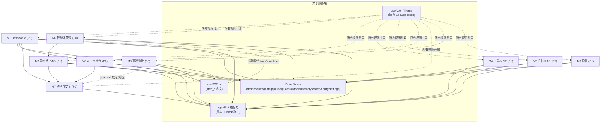
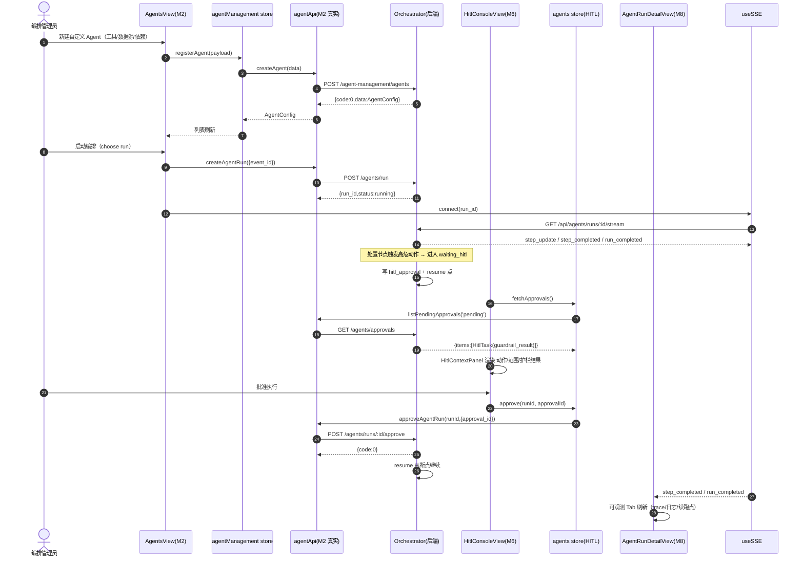
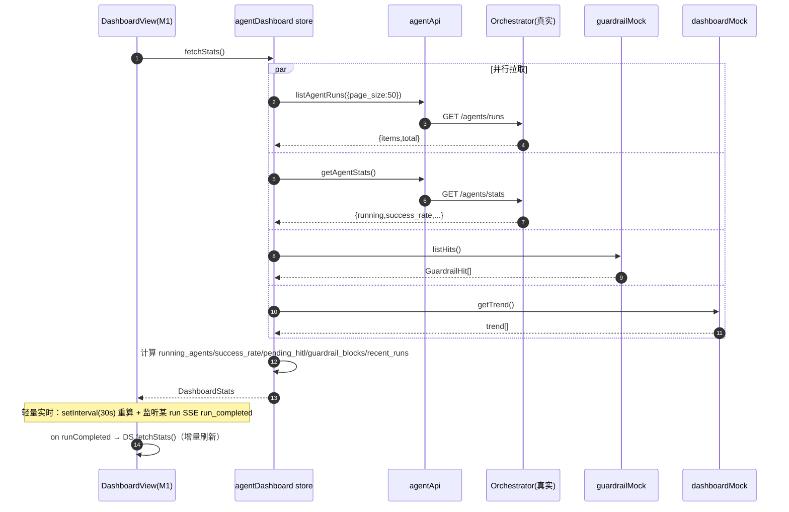
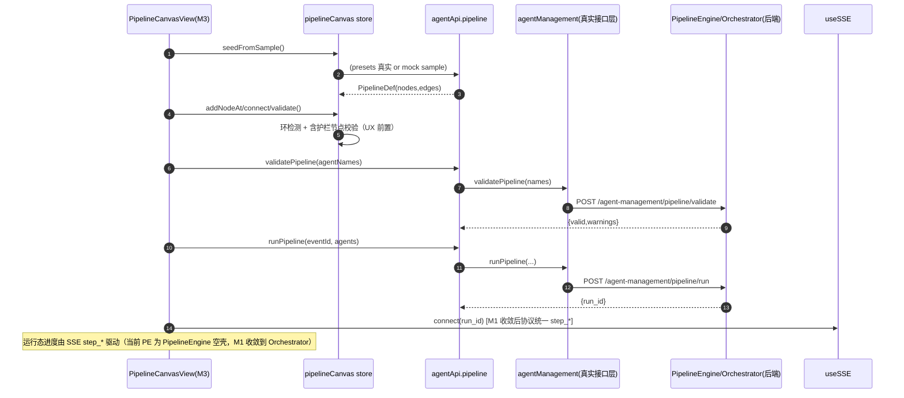
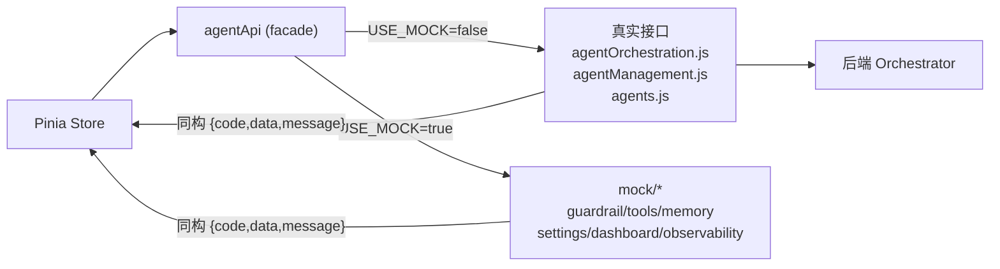

# 智能体编排管理 · 系统架构设计文档（集成基线）

> 产出角色：架构师（高见远 / Gao）
> 输入依据：`01-design-report.md`（集成 PRD）、`智能体编排管理_优化后方案.md`（单底座策略）、`frontend/` 现有代码、`agent-orchestration-preview/`（React+MUI+Zustand 9 模块目标态原型）及其 `src/store/*.ts`、`src/mocks/*.ts`、`src/types/*.ts`。
> 范围：仅架构设计与集成方案；接口契约见 `01-api-spec.md`，任务分解见 `01-tasks.md`。

---

## 1. 集成总体方案

### 1.1 集成策略（已确认）

原生移植到 Vue3 + Element Plus + Pinia：复用既有 `AgentRunView` / `AgentRunDetailView` / `AgentManagementView` / `settings/AgentManagement.vue` 可用实现，移植 demo 的 9 模块信息架构（IA）与 SecOps 暗色视觉，优先接真实后端（`agentOrchestration.js` / `agentManagement.js` / `agents.js`），缺失能力（guardrail / tools / memory / settings / dashboard 趋势）以 **Mock 适配器占位**，契约严格对齐方案字段语义，后端就绪后仅替换数据层、业务组件零改动。

### 1.2 目标目录树

```
frontend/src/
├── api/
│   ├── index.js                     # [现有] 挂载 ir_token 的 axios 实例
│   ├── agentOrchestration.js        # [现有] 真实接口：run/runs/approve/reject/approvals/SSE
│   ├── agentManagement.js           # [现有] 真实接口：agents CRUD / pipeline / presets / cache
│   ├── agents.js                    # [现有] 真实接口：GET /agents、GET /agents/stats
│   └── agent/                       # 【新增】统一适配层 facade
│       ├── index.js                 # agentApi 统一出口（store 只调这里）
│       ├── mock-config.js           # 切换开关 USE_MOCK（按模块粒度）
│       ├── mock/
│       │   ├── util.js              # ok()/delay()/clone() 镜像 demo util.ts
│       │   ├── guardrail.js         # M7 policy CRUD + evaluate（GuardrailResult）
│       │   ├── tools.js             # M4 ToolDef + McpServer
│       │   ├── memory.js            # M5 KnowledgeBase
│       │   ├── settings.js          # M9 ModelProfile + DeploymentConfig
│       │   ├── dashboard.js         # M1 trend + guardrail_blocks
│       │   └── observability.js     # M8 trace / logs / resume_point
│       └── (real.js 可选：集中转发现有真实接口，便于 M1 收敛替换)
├── stores/
│   ├── agents.js                    # [现有] 编排 store（M6 HITL + M8 复用）→ 扩展
│   ├── agentManagement.js           # [现有] agent/pipeline store（M2/M3 复用）
│   ├── agentDashboard.js            # 【新增】M1 聚合
│   ├── pipelineCanvas.js            # 【新增】M3 DAG 画布运行态（port usePipelineStore）
│   ├── guardrail.js                 # 【新增】M7
│   ├── tools.js                     # 【新增】M4
│   ├── memory.js                    # 【新增】M5
│   ├── observability.js             # 【新增】M8 增强
│   └── agentSettings.js             # 【新增】M9
├── composables/
│   ├── useSSE.js                    # [现有] step_* SSE（Orchestrator 已对齐）
│   └── useAgentTheme.js             # 【新增】暗色 SecOps token（primary/paper/divider）
├── components/agents/
│   ├── GraphPanel.vue               # [现有] M3 DAG 画布内核复用
│   ├── HitlApprovalPanel.vue        # [现有] M6 复用为共享卡片组件
│   ├── AgentLibraryPanel.vue        # [现有] M2 复用
│   ├── StepCard.vue / GraphLegend.vue / ForceLayout.js  # [现有]
│   ├── StatusBadge.vue              # 【新增】移植 demo（运行态/严重度/角色）
│   ├── StatCard.vue                 # 【新增】M1 指标卡
│   ├── StepFlow.vue                 # 【新增】移植 demo（step 状态条）
│   ├── GuardrailChip.vue            # 【新增】M7/HITL 护栏结果 chip
│   ├── HitlContextPanel.vue         # 【新增】M6 上下文面板（动作/范围/护栏联动）
│   ├── PipelineCanvas.vue           # 【新增】M3 画布外壳（包裹 GraphPanel + NodePalette）
│   ├── NodePalette.vue              # 【新增】M3 节点面板（拖拽/连线）
│   ├── ToolSchemaCard.vue           # 【新增】M4 schema/幂等键/超时
│   ├── KnowledgeBaseCard.vue        # 【新增】M5
│   ├── TraceTree.vue                # 【新增】M8 trace 树
│   └── LogTimeline.vue              # 【新增】M8 结构化日志
├── views/
│   ├── AgentRunView.vue             # [现有] 增强：M8 运行列表 + 内嵌 HITL 快捷入口
│   ├── AgentRunDetailView.vue       # [现有] 增强：M8 + 新增「可观测性」Tab
│   ├── AgentManagementView.vue      # [现有] 增强：M2 新增「智能体库」Tab
│   ├── settings/AgentManagement.vue # [现有] 增强：M9 入口（复用布局）
│   └── agent-orchestration/        # 【新增】9 模块视图目录
│       ├── DashboardView.vue        # M1
│       ├── AgentsView.vue           # M2（包裹增强后的 AgentManagementView）
│       ├── PipelineCanvasView.vue   # M3
│       ├── ToolMcpView.vue          # M4
│       ├── MemoryRagView.vue        # M5
│       ├── HitlConsoleView.vue      # M6
│       ├── GuardrailView.vue        # M7
│       ├── SettingsView.vue         # M9
│       └── (runs / runs/:runId 复用 AgentRunView / AgentRunDetailView)
└── router/index.js                  # [现有] 扩展子路由（见 §1.4）
```

### 1.3 复用增强 / 新增 / 移植 三类清单

| 模块 | ① 复用现有 Vue 实现 | ② 移植 demo IA/交互 | ③ 新增 |
|---|---|---|---|
| M1 Dashboard | — | 指标卡/趋势/近期运行 结构、暗色视觉 | `DashboardView.vue`、`agentDashboard.js`、`StatCard.vue`、SSE 轻量刷新 |
| M2 智能体管理 | `AgentManagementView` + `agentManagement.js` | 卡片列表/详情抽屉/新建表单（工具/数据源/依赖勾选） | 新「智能体库」Tab 容器、`AgentsView.vue` |
| M3 流水线 DAG | `GraphPanel.vue` + `agentManagement.js` pipeline 接口 | DAG 拖拽/连线/校验/运行 流程 | `PipelineCanvasView.vue`、`pipelineCanvas.js`、`PipelineCanvas.vue`、`NodePalette.vue` |
| M4 工具/MCP | — | 工具列表卡、MCP 状态卡、schema 预览 | `ToolMcpView.vue`、`tools.js`、`ToolSchemaCard.vue`、`toolsMock` |
| M5 记忆/RAG | （可选）`knowledge.js` 种子 | 知识库/向量库概览、检索增强示意 | `MemoryRagView.vue`、`memory.js`、`KnowledgeBaseCard.vue`、`memoryMock` |
| M6 人工审核台 | `AgentRunView` 内嵌 `HitlApprovalPanel` + `agentOrchestration.js` | HITL 队列+上下文面板+护栏联动+approve/reject | `HitlConsoleView.vue`、`HitlContextPanel.vue`（抽取独立页面，组件复用） |
| M7 护栏与安全 | — | 策略列表/白名单/高危确认/回滚预案展示 | `GuardrailView.vue`、`guardrail.js`、`guardrailMock`、`GuardrailChip.vue` |
| M8 可观测性 | `AgentRunView`+`AgentRunDetailView`+`agentOrchestration.js` | observability IA（trace 树/日志/续跑点/时间线） | 详情页「可观测性」Tab、`observability.js`、`TraceTree.vue`、`LogTimeline.vue`、`observabilityMock` |
| M9 设置 | `settings/AgentManagement.vue` 布局 | 多模型 profile/无状态开关/协议状态 | `SettingsView.vue`、`agentSettings.js`、`settingsMock` |

### 1.4 目标路由表（扩展 `/agent-orchestration` 为 9 模块父路由）

| Route | View | Module | 来源 |
|---|---|---|---|
| `/agent-orchestration`（index） | `DashboardView.vue` | M1 | 新增 |
| `/agent-orchestration/agents` | `AgentsView.vue`（包 `AgentManagementView`） | M2 | 新增容器 + 复用 |
| `/agent-orchestration/pipeline` | `PipelineCanvasView.vue` | M3 | 新增 |
| `/agent-orchestration/tools` | `ToolMcpView.vue` | M4 | 新增 |
| `/agent-orchestration/memory` | `MemoryRagView.vue` | M5 | 新增 |
| `/agent-orchestration/hitl` | `HitlConsoleView.vue` | M6 | 新增（独立页面） |
| `/agent-orchestration/guardrail` | `GuardrailView.vue` | M7 | 新增 |
| `/agent-orchestration/runs` | `AgentRunView.vue`（增强） | M8 列表 | 复用增强 |
| `/agent-orchestration/runs/:runId` | `AgentRunDetailView.vue`（增强 + 可观测 Tab） | M8 详情 | 复用增强 |
| `/agent-orchestration/settings` | `SettingsView.vue` | M9 | 新增 |
| `/agent-management` | → 重定向到 `/agent-orchestration/agents` | M2 | 兼容别名 |
| `/settings/agents` | 保留为快捷入口（复用 `settings/AgentManagement.vue`） | M9 入口 | 兼容保留 |

> 侧边栏以 9 模块为单一信息架构；现有 `/agent-orchestration` 与 `/agent-orchestration/:runId` 两个路由名（`AgentOrchestration` / `AgentRunDetail`）重映射为 `runs` 与 `runs/:runId`，保持组件不变、仅调整路由 path/name。

---

## 2. 模块依赖图



**依赖要点**：
- `agentApi` 适配层是所有模块的唯一数据出入口；真实模块直连现有接口，Mock 模块走 `mock/*`。
- M7（护栏）是**被消费方**：M6 HITL 上下文面板渲染 `guardrail_result`、M3 DAG 校验要求含护栏节点、M1 Dashboard 展示护栏拦截数。
- M8（可观测性）依赖 `useSSE` 实时流；M3 运行态复用同一 SSE 协议。
- M9 为纯配置入口，无强依赖。

---

## 3. 调用链路（核心时序）

### 3.1 链路一：创建智能体 → 编排执行 → HITL 审批 → 可观测观测



### 3.2 链路二：Dashboard 聚合刷新（前端组合 + 轻量实时）



### 3.3 链路三：DAG 画布提交（M3，经适配层隔离协议）



---

## 4. 数据流：Mock 适配器与真实 API 的切换机制

### 4.1 统一适配层 `agentApi`（核心设计）

所有 Pinia store **只调用 `agentApi`，不直接调用现有 `*.js` 接口，也不直接调用 `mock/*`**。适配层内部按 `USE_MOCK` 开关路由：

- 真实模块（M2/M6/M8/M3 接口层/M1 runs+stats）：直接转发到现有 `agentOrchestration.js` / `agentManagement.js` / `agents.js`。
- Mock 模块（M7/M4/M5/M9/M1 trend+guardrail_blocks/M8 trace）：调用 `mock/*` 实现。
- **关键对称性**：demo `src/mocks/*.ts` 统一返回 `ApiResponse<T> = {code,data,message}`，与后端 `{code,data,message}` 信封**完全一致** → Mock 与真实返回同构，store 无分支。

### 4.2 切换开关 `src/api/agent/mock-config.js`

```js
// 按模块粒度；后端就绪后改 false 并补 real.js 对应实现即可，业务组件零改动
export const USE_MOCK = {
  guardrail: true,        // F8 后端未建 → 全 Mock
  tools: true,            // F1 后端未建
  memory: true,           // F3 后端未建
  settings: true,         // F10/F14 后端未建
  dashboardTrend: true,   // 趋势/护栏拦截数无聚合端点
  observability: true,    // trace/log/resume_point 待 F7
  pipeline: false,        // 接口层真实；执行空壳走 M1 收敛
  hitl: false,            // 真实
  agents: false,          // 真实
  runs: false,            // 真实
}
```

### 4.3 Mock 适配层统一约定（详见 `01-api-spec.md` §3）

- 每个 `mock/*.js` 导出 async 函数，返回 `{ code: 0, data, message: 'ok' }`（`ok()` 由 `mock/util.js` 提供，镜像 demo `util.ts`）。
- 延迟 `delay(100,400)` 模拟网络（镜像 demo）。
- CRUD 类 Mock（guardrail policy、agent 自定义）在模块内维护**可变内存数组**，会话内变更即时反映（镜像 demo store 层 mutation）。
- 错误模拟：提供可选 `THROW_ON` 钩子（默认关闭），用于 Vitest 异常路径测试。



---

## 5. 逐条决策（5 个待确认问题）

### Q1：agents / HITL 模块与现有视图是合并增强还是新增独立路由？

**决策**：
- **M2 智能体管理 → 合并增强，不新增 `/agents` 路由。** 复用现有 `AgentManagementView`，将 demo 的卡片列表/详情抽屉/新建表单 IA 移植为其新增「智能体库」Tab（现有三 Tab：Pipeline Builder + Agent Library + Execution History 保留）。理由：避免与既有可用实现重复建设；`agentManagement.js` 接口与 store 已就绪，仅增强 UI 层。
- **M6 人工审核台 → 新增独立 `/agent-orchestration/hitl` 路由 + 保留内嵌嵌入。** 从 `AgentRunView` 抽取 `HitlConsoleView.vue` 作为独立审核工作台（队列 + 上下文面板）；原 `HitlApprovalPanel.vue` 提升为**共享组件**，继续在 `AgentRunView` 内嵌作快捷入口，并在 `/hitl` 页面复用。理由：HITL 是 P0 安全主线，需独立工作台 + 全局待审角标；但不废弃内嵌面板的运行视图场景价值。

### Q2：guardrail 缺失后端的 Mock 契约形态？HITL 上下文面板护栏联动接口位如何预留？

**决策**：
- `guardrailMock` 暴露：`listPolicies()` / `createPolicy()` / `updatePolicy()` / `deletePolicy()` / `evaluate(action, context)`。其中 `evaluate()` 严格返回 `GuardrailResult`（`policy_id / whitelist_hit / requires_confirm / requires_rollback_plan / passed`），对齐 demo `types/hitl.ts` 的 `guardrail_result` 字段与 `mocks/hitl.ts` 数据形态。
- HITL 上下文面板**直接渲染 `hitlTask.guardrail_result`**（demo 既有契约已含 4 个字段）。接口位预留：`useGuardrail().evaluate(task)` 方法——当前用 Mock 计算，后端 F8 就绪后切换为真实评估服务，**面板渲染层不变**。即"数据契约已落位，计算方法可热插拔"。

### Q3：pipeline DAG 画布收敛节奏？是否需要接口适配抽象层？

**决策**：
- **需要适配抽象层（强制）**。前端 DAG 画布（M3）**暂走现有 `agentManagement.js` 的 pipeline 接口**（`validatePipeline` / `runPipeline` / `getRunStatus` / `cancelRun` / `resumeRun` / `getPipelineSSEUrl`），**全部经 `agentApi.pipeline.*` 调用**，不直接引用 `agentManagement.js`。M1 后端收敛到 Orchestrator 时，仅修改 `agentApi` 内 `pipeline.*` 的实现（或切换目标路径），前端组件零改动。
- 前端额外做**图级校验**（环检测 + 必须含护栏/审核节点）作为 UX 前置（镜像 demo `usePipelineStore.validate`），接口层 `validatePipeline` 作为后端二次校验。运行态用 `runPipeline` 返回的 `run_id` 接 SSE + `getRunStatus`。

### Q4：observability 路由形态？增强 Tab 还是新增独立路由？

**决策**：
- **作为 `AgentRunDetailView`（/agent-orchestration/runs/:runId）的增强「可观测性」Tab**，不新增独立 `/observability` 路由。理由：observability 本质是某次 run 的 trace/log/续跑点，天然从属于运行详情；复用现有详情页与 `getAgentRun` 接口、`useSSE` 实时刷新；新增独立路由会割裂 run 上下文且重复拉取。
- 运行列表入口复用现有 `AgentRunView`（即 `/agent-orchestration/runs`）。trace/log/resume_point 当前由 `observabilityMock` 占位，后端 F7 就绪经 `agentApi.observability.getRun(runId)` 切换。

### Q5：dashboard 聚合来源？SSE 实时刷新如何对接？

**决策**：
- **前端组合聚合，不新增后端端点**。`agentDashboard.fetchStats()` 并行调 `listAgentRuns()` + `getAgentStats()`（真实）+ `dashboardMock.getTrend()` + `guardrailMock.listHits()`（Mock），在 store 内计算 `running_agents / success_rate / pending_hitl / guardrail_blocks / recent_runs / trend`。理由：M0 重点是修空心化与无状态化，不应提前建聚合端点；前端聚合零后端依赖、可立即出 Dashboard。
- **SSE 实时刷新 = 轻量轮询 + 事件驱动**：Dashboard 加载后 `setInterval(30s)` 重算；同时监听 `useSSE` 的 `runCompleted` 事件（打开某 run 的 SSE 时）触发增量 `fetchStats()`。复用 `getSSEUrl(runId)` + `useSSE`（step_* 协议已对齐 Orchestrator）。后端新增聚合 SSE（`/api/agents/dashboard/stream`）时，经 `agentApi.dashboard.subscribe()` 切换，store 接口不变。

---

## 6. 共享知识 / 约定

### 6.1 命名约定
- 适配层目录 `src/api/agent/`；统一出口 `agentApi`。
- 新增 store 命名：`useXxxStore`（Pinia setup 风格，与现有 `agents.js`/`agentManagement.js` 一致）。
- 组件 PascalCase；移植 demo 共享组件保持语义同名（`StatusBadge`/`StatCard`/`StepFlow`/`GuardrailChip`）。
- Mock 文件置于 `src/api/agent/mock/`，文件名与模块对应（`guardrail.js`/`tools.js`/...）。

### 6.2 Pinia store 形态对齐
- 采用 setup function 风格（`ref` + `computed` + `actions` 返回对象），与现有 `agentManagement.js` 一致。
- 统一 `loading` / `submitting` 状态字段；异步 action 统一 `try/catch`，失败不吞错（axios 拦截器已提示），但 store 内 `catch` 仅做日志与状态重置。
- 跨 store 联动（如 M6 approve 后 M1 角标 −1）：通过 store 间直接调用（镜像 demo `useHitlStore.approve` → `useAgentStore.resumeRun`），不引入事件总线。

### 6.3 错误码 / 响应信封
- 全平台统一 `{ code: number, data: T, message: string }`；`code === 0` 视为成功。
- 错误由 `api/index.js` axios 拦截器统一 `ElMessage` 提示；store 不重复提示。

### 6.4 SSE 协议（step_* 复用）
- 复用现有 `useSSE.js`：`step_update` / `step_completed` / `run_completed` 三类事件，已与 Orchestrator 路径匹配。
- 事件字段兼容 `evidence` 与历史 `evidence_json`；图谱节点归一化类型（host/url/action/file/process/log/security）已在 `useSSE.js` 内实现。
- **严禁**前端硬编码 PipelineEngine 的 `batch_*` 协议——M3 运行态统一以 `step_*` 为预期（M1 后端收敛后天然一致）。

### 6.5 暗色 SecOps 主题 token
- 默认暗色（SecOps 惯例），可切亮色并持久化（镜像 demo `useAppStore`）。
- Token 对齐平台既有 CSS 变量（`--color-*`，`GraphPanel.vue` 已使用），新增组件统一引用，不写死色值：
  - primary `#3B82F6`、success `#22C55E`、warning `#F59E0B`、error `#EF4444`
  - 暗底 `background.default #0F172A`、卡片 `background.paper #1E293B`、分割线 `divider #334155`
  - 圆角 8px、8 倍数间距、trace/日志用等宽字体。
- 由 `useAgentTheme.js` 提供 `mode` / `toggleMode`（持久化到 `aop:app-prefs`，键名与 demo 一致便于数据迁移）。

### 6.6 时间 / 状态枚举
- 所有时间字段 ISO 8601 UTC 字符串；前端展示时本地化（复用现有日期格式化工具）。
- 运行态 `RunStatus`、严重度 `Severity`、角色 `Role`、HITL 决策 `HitlDecision` 的中文标签映射直接复用 demo `types/common.ts` / `types/hitl.ts` 的 `LABELS` 常量（移植为 `src/constants/agentLabels.js`）。
