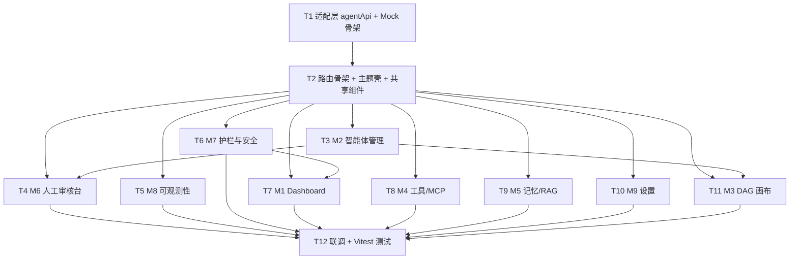

# 智能体编排管理 · 任务分解（集成基线）

> 产出角色：架构师（高见远 / Gao）
> 配套文档：`01-arch-design.md`、`01-api-spec.md`。
> 实施顺序：**先建适配层 + Pinia stores + 路由骨架 + 布局壳 → 逐模块实现（真实优先 / Mock 占位）→ 联调与测试**。
> 每条任务的"真实/Mock"列指该任务所接数据来源。

---

## 任务总览表（T1–T12，按实现顺序）

| ID | 任务名 | 对应模块 | 真实/Mock | 依赖 | 优先级 |
|---|---|---|---|---|---|
| **T1** | 适配层 `agentApi` + 切换开关 + Mock 适配器骨架 | 全部（基座） | Mock 骨架 + 真实转发 | — | P0 |
| **T2** | 路由骨架 + 暗色 SecOps 主题壳 + 共享组件移植 | 全部（基座） | — | T1 | P0 |
| **T3** | M2 智能体管理（增强 AgentManagementView） | M2 | 真实 | T1,T2 | P0 |
| **T4** | M6 人工审核台（独立页面 + 上下文面板） | M6 | 真实 | T1,T2 | P0 |
| **T5** | M8 可观测性（详情页增强 Tab） | M8 | 真实 + Mock(trace) | T1,T2 | P0 |
| **T6** | M7 护栏与安全（策略 CRUD + evaluate） | M7 | Mock | T1,T2 | P0 |
| **T7** | M1 Dashboard（聚合 + 轻量实时） | M1 | 真实 + Mock(trend) | T1,T2 | P0 |
| **T8** | M4 工具与 MCP | M4 | Mock | T1,T2 | P1 |
| **T9** | M5 记忆与 RAG | M5 | Mock | T1,T2 | P2 |
| **T10** | M9 设置（多模型 + 无状态） | M9 | Mock | T1,T2 | P1 |
| **T11** | M3 流水线 DAG 画布（经适配层接真实接口） | M3 | 真实(接口) + Mock(种子) | T1,T2,T3 | P1 |
| **T12** | 联调 + Vitest 测试 + 反空壳验收准备 | 全部 | 混合 | T3–T11 | P0 |

---

## 详细任务

### T1 — 适配层 `agentApi` + 切换开关 + Mock 适配器骨架
- **产出文件**：
  - `frontend/src/api/agent/index.js`（agentApi facade）
  - `frontend/src/api/agent/mock-config.js`（USE_MOCK 开关）
  - `frontend/src/api/agent/mock/util.js`（ok/delay/clone）
  - `frontend/src/api/agent/mock/guardrail.js`、`tools.js`、`memory.js`、`settings.js`、`dashboard.js`、`observability.js`
  - （可选）`frontend/src/api/agent/real.js`（集中转发现有真实接口）
- **内容**：建立 `agentApi` 统一出口，store 只调此层；真实方法转发 `agentOrchestration.js`/`agentManagement.js`/`agents.js`；Mock 模块返回 `{code,data,message}` 同构信封。
- **依赖**：无。
- **真实/Mock**：基座（真实转发 + Mock 占位）。
- **验收**：`agentApi.listAgents()` 走真实、`agentApi.guardrail.listPolicies()` 走 Mock，均返回同构信封。

### T2 — 路由骨架 + 暗色 SecOps 主题壳 + 共享组件移植
- **产出文件**：
  - `frontend/src/router/index.js`（扩展 `/agent-orchestration/*` 子路由 + 重定向）
  - `frontend/src/composables/useAgentTheme.js`（暗色 token + 持久化）
  - `frontend/src/components/agents/StatusBadge.vue`、`StatCard.vue`、`StepFlow.vue`、`GuardrailChip.vue`
  - `frontend/src/constants/agentLabels.js`（RunStatus/Severity/Role/HitlDecision 中文标签）
- **内容**：9 模块路由表（见架构文档 §1.4）；主题默认暗色、对齐 `--color-*`；移植 demo 共享组件；标签常量集中。
- **依赖**：T1。
- **真实/Mock**：无（基础设施）。
- **验收**：侧边栏出现 9 模块导航；暗色主题生效且可切换持久化；StatusBadge 等组件可独立渲染。

### T3 — M2 智能体管理（增强 AgentManagementView）
- **产出文件**：
  - `frontend/src/views/agent-orchestration/AgentsView.vue`（容器，包 `AgentManagementView`）
  - `frontend/src/views/AgentManagementView.vue`（增强：新增「智能体库」Tab：卡片列表/详情抽屉/新建表单）
  - `frontend/src/components/agents/AgentForm.vue`（新建/编辑表单：工具/数据源/依赖勾选）
  - 复用 `frontend/src/stores/agentManagement.js`（不改形态，仅确认字段对齐）
- **内容**：移植 demo agents IA；复用 `agentManagement.js` 真实 CRUD；表单提交经 `agentApi.createAgent/updateAgent`。
- **依赖**：T1,T2。
- **真实/Mock**：真实（M2）。
- **验收**：卡片列表（内置+自定义）、详情抽屉、新建自定义 Agent 走真实接口并即时刷新。

### T4 — M6 人工审核台（独立页面 + 上下文面板）
- **产出文件**：
  - `frontend/src/views/agent-orchestration/HitlConsoleView.vue`（独立页面）
  - `frontend/src/components/agents/HitlContextPanel.vue`（上下文面板：动作/影响范围/护栏联动/approve/reject）
  - 复用 `frontend/src/components/agents/HitlApprovalPanel.vue`（共享卡片组件，继续在 `AgentRunView` 内嵌）
  - 复用 `frontend/src/stores/agents.js`（扩展 `fetchApprovals/approve/reject` 联动静默）
- **内容**：从 `AgentRunView` 抽取独立 `/hitl` 页面；`HitlContextPanel` 渲染 `guardrail_result`（Q2 接口位）；approve 后联动 M1 角标 −1。
- **依赖**：T1,T2。
- **真实/Mock**：真实（M6）。
- **验收**：队列加载、上下文面板展示护栏结果、批准/拒绝走真实接口并刷新运行态。

### T5 — M8 可观测性（详情页增强 Tab）
- **产出文件**：
  - `frontend/src/views/AgentRunDetailView.vue`（增强：新增「可观测性」Tab）
  - `frontend/src/components/agents/TraceTree.vue`、`LogTimeline.vue`
  - `frontend/src/stores/observability.js`（fetchRun → `agentApi.observability.getRun`）
  - `frontend/src/api/agent/mock/observability.js`（trace/log/resume_point 占位）
- **内容**：复用 `getAgentRun` + `useSSE`；可观测 Tab 展示 trace 树/结构化日志/续跑点；数据经 `agentApi`。
- **依赖**：T1,T2。
- **真实/Mock**：真实(run) + Mock(trace/log)。
- **验收**：详情页出现可观测 Tab，trace 树与日志渲染；SSE step_* 事件驱动实时刷新。

### T6 — M7 护栏与安全（策略 CRUD + evaluate）
- **产出文件**：
  - `frontend/src/views/agent-orchestration/GuardrailView.vue`
  - `frontend/src/stores/guardrail.js`
  - `frontend/src/components/agents/GuardrailChip.vue`（已建，本任务接线）
  - `frontend/src/api/agent/mock/guardrail.js`（list/create/update/delete/evaluate/listHits）
- **内容**：策略列表/白名单/高危确认/回滚预案配置；`evaluate()` 返回 `GuardrailResult`（算法见 API 规范 §7.3）；M1 护栏拦截数取自 `listHits`。
- **依赖**：T1,T2。
- **真实/Mock**：Mock（M7，F8 后端未建）。
- **验收**：策略 CRUD 在会话内即时生效；`evaluate('host:isolate:WIN-EXP-01')` 返回与 demo `guardrail_result` 同构结果。

### T7 — M1 Dashboard（聚合 + 轻量实时）
- **产出文件**：
  - `frontend/src/views/agent-orchestration/DashboardView.vue`
  - `frontend/src/stores/agentDashboard.js`
  - `frontend/src/components/agents/StatCard.vue`（已建，本任务接线）
  - 复用 `frontend/src/api/agent/mock/dashboard.js`（trend/guardrailBlocks）
- **内容**：`fetchStats()` 并行 `listAgentRuns`+`getAgentStats`(真实)+`dashboardMock.getTrend`+`guardrailMock.listHits` 计算 `DashboardStats`；`setInterval(30s)` + 监听 `runCompleted` 增量刷新。
- **依赖**：T1,T2,T6（护栏拦截数）。
- **真实/Mock**：真实(runs/stats) + Mock(trend/guardrailBlocks)。
- **验收**：指标卡/近期运行/趋势图渲染；30s 轮询刷新；某 run 完成时角标更新。

### T8 — M4 工具与 MCP
- **产出文件**：
  - `frontend/src/views/agent-orchestration/ToolMcpView.vue`
  - `frontend/src/stores/tools.js`
  - `frontend/src/components/agents/ToolSchemaCard.vue`
  - `frontend/src/api/agent/mock/tools.js`（listTools/listMcpServers）
- **内容**：工具列表（schema/幂等键/超时/重试）+ MCP 服务器状态卡。
- **依赖**：T1,T2。
- **真实/Mock**：Mock（M4，F1 后端未建）。
- **验收**：工具卡展示 JSON Schema 预览与幂等键；MCP 服务器在线/降级/离线状态正确着色。

### T9 — M5 记忆与 RAG
- **产出文件**：
  - `frontend/src/views/agent-orchestration/MemoryRagView.vue`
  - `frontend/src/stores/memory.js`
  - `frontend/src/components/agents/KnowledgeBaseCard.vue`
  - `frontend/src/api/agent/mock/memory.js`（listKnowledgeBases）
- **内容**：知识库/向量库概览、嵌入模型、检索增强示意（可选复用 `knowledge.js` 种子）。
- **依赖**：T1,T2。
- **真实/Mock**：Mock（M5，F3 后端未建）。
- **验收**：知识库卡片展示 doc_count/向量库/嵌入模型；列表渲染。

### T10 — M9 设置（多模型 + 无状态）
- **产出文件**：
  - `frontend/src/views/agent-orchestration/SettingsView.vue`
  - `frontend/src/stores/agentSettings.js`
  - 复用 `frontend/src/views/settings/AgentManagement.vue`（入口）
  - `frontend/src/api/agent/mock/settings.js`（listModelProfiles/getDeploymentConfig）
- **内容**：多模型 profile 配置、无状态部署开关、SSE/HITL 协议对齐状态展示。
- **依赖**：T1,T2。
- **真实/Mock**：Mock（M9，F10/F14 后端未建）。
- **验收**：多模型列表渲染；部署配置展示 `stateless_enabled/redis_connected/sse_protocol/hitl_protocol`。

### T11 — M3 流水线 DAG 画布（经适配层接真实接口）
- **产出文件**：
  - `frontend/src/views/agent-orchestration/PipelineCanvasView.vue`
  - `frontend/src/components/agents/PipelineCanvas.vue`、`NodePalette.vue`
  - `frontend/src/stores/pipelineCanvas.js`（port demo `usePipelineStore`：nodes/edges/环检测/含护栏校验/run 模拟）
  - 复用 `frontend/src/components/agents/GraphPanel.vue`（画布内核）
- **内容**：拖拽/连线建模 DAG；图级校验（环 + 含护栏节点）；`agentApi.pipeline.validate/run` 接真实接口层；运行态用 `run_id` + SSE（`useSSE`，M1 收敛后协议统一 step_*）；种子 DAG 来自 `pipelineMock.getSample`。
- **依赖**：T1,T2,T3（依赖 M2 agent 列表作节点候选）。
- **真实/Mock**：真实(接口层，执行空壳) + Mock(种子)。
- **验收**：画布可建模 DAG 并校验；提交走真实 `runPipeline` 返回 `run_id`；进度由 SSE 驱动（当前 PipelineEngine 空壳，M1 收敛后无缝切换 Orchestrator）。

### T12 — 联调 + Vitest 测试 + 反空壳验收准备
- **产出文件**：
  - `frontend/src/api/agent/__tests__/agentApi.spec.js`（Mock/真实路由切换）
  - `frontend/src/stores/__tests__/*.spec.js`（各 store 行为）
  - `frontend/src/components/agents/__tests__/*.spec.js`（StatusBadge/GuardrailChip 等）
  - 联调检查清单文档（Markdown，附于本目录）
- **内容**：验证 `USE_MOCK` 开关切换零改动；`useSSE` step_* 协议联调；HITL approve→运行态联动；DAG 校验规则；Vitest 覆盖基座与关键组件。
- **依赖**：T3–T11。
- **真实/Mock**：混合。
- **验收**：所有 Mock 模块可一键切真实（开关 false + 补 real 实现）；关键 store/组件测试通过；反空壳验收清单就绪。

---

## 任务依赖图

> 说明：T3–T11 彼此相对独立（仅 T6→T7、T3→T11 有弱依赖），可并行开发以提速；T12 收口联调与测试。

---

## 关键风险与待明确事项

### 风险
1. **M3 执行空壳（R1，高）**：当前 `agentManagement.js` pipeline 接口后端执行路径为 PipelineEngine 空壳，M1 后端未收敛前，DAG 运行态只能模拟，无法真实执行。缓解：T11 严格经 `agentApi.pipeline` 隔离，M1 收敛时仅改适配层。
2. **SSE 协议对齐（R2，中）**：仅 Orchestrator 路径 step_* 对齐；PipelineEngine 路径 batch_* 错位。缓解：前端统一以 step_* 为预期，M3 运行态复用 `useSSE`，不硬编码 batch_*。
3. **Mock 内存态会话丢失（R3，低）**：Mock CRUD 刷新即重置（预览态可接受）；后端就绪即替换，无生产影响。
4. **暗色主题与平台既有 `--color-*` 冲突（R4，低）**：需确认 `GraphPanel.vue` 等已用变量在新增视图一致；`useAgentTheme` 仅补充缺失 token。

### 待明确事项（需后端/产品确认）
- **U1**：M1 是否后续需要后端聚合端点 `/api/agents/dashboard`？当前前端组合，约定不新增。
- **U2**：`GET /agents/approvals` 返回的 `HitlTask` 是否已携带 `guardrail_result`？若否，前端调 `agentApi.guardrail.evaluate`（当前 Mock）计算——字段契约已预留。
- **U3**：M8 trace/log/resume_point 的后端字段名是否与 demo `ObservabilityRun` 一致？当前 Mock 对齐，待 F7 明确。
- **U4**：M3 DAG 节点候选是否直接复用 M2 的 `AgentConfig`（`agent_id` 作为节点）？T11 按此假设实现，待确认节点粒度（agent 级 vs 步骤级）。
- **U5**：M7 `evaluate()` 的"通过"判定阈值（高危未配回滚预案即拦截）是否需产品细化规则？当前按方案语义实现，可调整。
