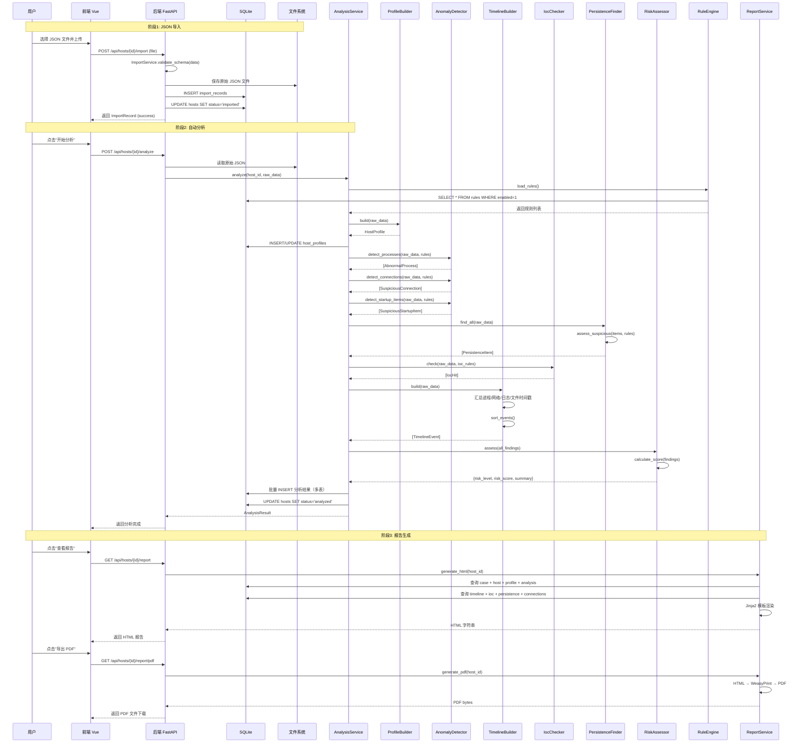
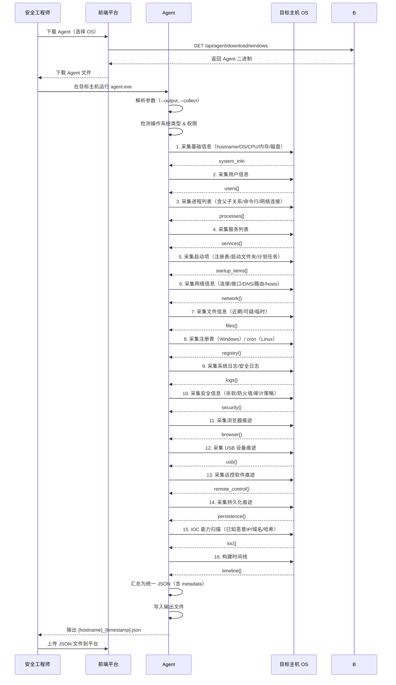
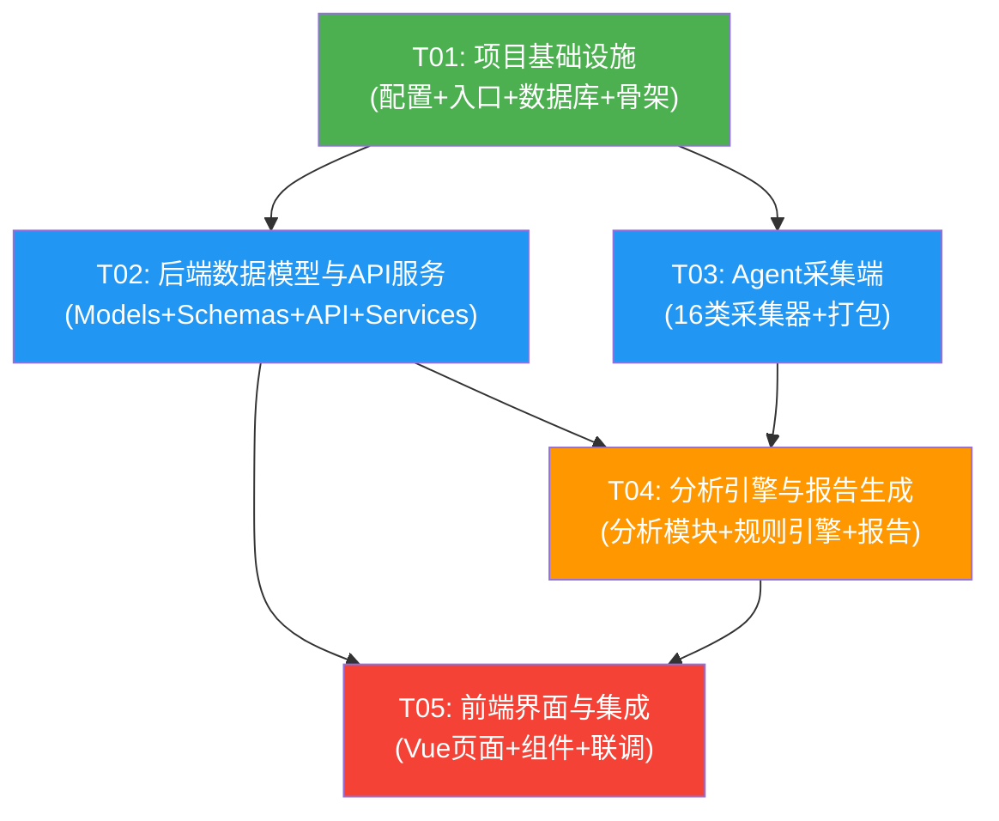

# 个人应急响应平台 — 系统架构设计与任务分解

> **架构师**: 高见远 (Gao)  
> **版本**: v1.0  
> **日期**: 2025-07-06  
> **状态**: 交付工程师执行

---

## 目录

- [Part A: 系统设计](#part-a-系统设计)
  - [1. 实现方案与框架选型](#1-实现方案与框架选型)
  - [2. 文件列表](#2-文件列表)
  - [3. 数据结构与接口设计](#3-数据结构与接口设计)
  - [4. 程序调用流程](#4-程序调用流程)
  - [5. 待明确事项](#5-待明确事项)
- [Part B: 任务分解](#part-b-任务分解)
  - [6. 依赖包列表](#6-依赖包列表)
  - [7. 任务列表](#7-任务列表)
  - [8. 共享知识](#8-共享知识)
  - [9. 任务依赖图](#9-任务依赖图)

---

# Part A: 系统设计

## 1. 实现方案与框架选型

### 1.1 整体架构

系统采用 **三端分离** 架构，分为平台后端（FastAPI）、前端界面（Vue 3）、采集端 Agent（Python 单文件），数据全部留存在本地。

```
┌─────────────────────────────────────────────────────────┐
│                    安全工程师工作流                        │
│  下载Agent → 目标主机运行 → 生成JSON → 导入平台 → 分析报告   │
└───────┬──────────┬──────────────────────┬───────────────┘
        │          │                      │
   ┌────▼────┐ ┌───▼───┐           ┌──────▼──────┐
   │  Agent  │ │ Agent │           │   前端 Vue3  │
   │(Windows)│ │(Linux)│           │ Element Plus │
   └────┬────┘ └───┬───┘           └──────┬──────┘
        │          │                      │ HTTP/REST
        │     JSON文件                    │
        │          │           ┌──────────▼──────────┐
        │          │           │   后端 FastAPI       │
        │          │           │  ┌──────────────┐   │
        │          └──────────►│  │  导入服务     │   │
        │                      │  ├──────────────┤   │
        │                      │  │  分析引擎     │   │
        │                      │  ├──────────────┤   │
        │                      │  │  报告生成     │   │
        │                      │  ├──────────────┤   │
        │                      │  │  规则引擎     │   │
        │                      │  └──────────────┘   │
        │                      └──────────┬──────────┘
        │                                 │
        │                      ┌──────────▼──────────┐
        │                      │    本地存储层        │
        │                      │  SQLite + JSON文件   │
        │                      └─────────────────────┘
```

### 1.2 后端框架选型：FastAPI

| 对比项 | Flask | **FastAPI (选用)** |
|--------|-------|-------------------|
| 异步支持 | 需扩展 | 原生 async/await |
| 自动文档 | 需扩展 | 内置 Swagger / ReDoc |
| 类型校验 | 手动 | Pydantic 自动校验 |
| 性能 | 中等 | 接近 Go/Node 水平 |
| 学习曲线 | 低 | 低（与 Flask 相似） |

**选择理由**：
1. Pydantic 模型天然适配 Agent JSON 数据的 Schema 校验需求
2. 自动生成的 Swagger 文档便于前端联调
3. 异步特性在后续扩展（如实时分析进度推送）时有余量
4. 项目体量不大，FastAPI 的轻量性完全够用

### 1.3 前端框架选型：Vue 3 + Element Plus

- **Vue 3**：Composition API 逻辑复用好，`<script setup>` 语法简洁
- **Element Plus**：组件丰富（表格、对话框、上传、步骤条等），开箱即用
- **Vite**：开发热更新快，构建产物小
- **Pinia**：Vue 3 官方推荐状态管理，比 Vuex 简洁
- **ECharts**：时间线可视化（时间轴图表）

### 1.4 Agent 技术选型：Python + PyInstaller

| 对比项 | Go 编译 | **Python + PyInstaller (选用)** |
|--------|---------|-------------------------------|
| 单文件输出 | 原生支持 | PyInstaller `--onefile` |
| 文件大小 | ~8MB | ~15MB（可接受） |
| 采集生态 | 需手写 | psutil/wmi/python-registry 等成熟库 |
| 注册表操作 | 需第三方库 | python-registry / winreg 原生 |
| 开发效率 | 中等 | 高（快速迭代） |
| 跨平台 | 优秀 | 优秀（条件导入区分平台） |

**选择理由**：
1. 16 大类采集中涉及大量系统 API 调用，Python 生态（psutil、wmi、python-registry）最成熟
2. PyInstaller `--onefile` 模式可打包为单文件，满足"一键采集"需求
3. Windows / Linux 分别打包，通过条件导入 (`import platform`) 区分采集逻辑
4. 团队 Python 技能栈统一，后端与 Agent 共享部分数据模型代码

### 1.5 报告生成方案：Jinja2 + WeasyPrint

- **Jinja2**：Python 模板引擎，渲染 HTML 报告
- **WeasyPrint**：HTML/CSS → PDF，支持中文、表格分页、页眉页脚
- **备选**：如果 WeasyPrint 在目标环境安装困难，降级为 `pdfkit + wkhtmltopdf`

**报告流程**：
```
分析结果数据 → Jinja2 模板渲染 → HTML 报告 → WeasyPrint → PDF
```

### 1.6 数据库设计方案

采用 **SQLite** 作为结构化存储，**JSON 文件** 作为原始采集数据归档。

| 存储层 | 用途 | 示例 |
|--------|------|------|
| SQLite | 案件/主机/分析结果/规则等结构化数据 | `ir_platform.db` |
| JSON 文件 | Agent 原始输出归档（完整保留） | `data/imports/host_{id}_{timestamp}.json` |
| SQLite JSON 列 | 分析详情等半结构化数据（用 TEXT 存 JSON） | `analysis_results.details` |

**设计原则**：
- 原始 JSON 完整保留到文件系统，确保可追溯、可重新分析
- 分析结果结构化入库，支持前端查询和报告渲染
- 规则配置以 JSON 格式存储在 `default_rules.json` + SQLite `rules` 表中

---

## 2. 文件列表

```
ir_platform/
├── backend/
│   ├── app/
│   │   ├── __init__.py
│   │   ├── main.py                          # FastAPI 应用入口，路由注册，CORS
│   │   ├── config.py                        # 配置管理（数据库路径、密钥、上传目录）
│   │   ├── database.py                      # SQLite 连接管理 + DDL 建表
│   │   ├── models/
│   │   │   ├── __init__.py
│   │   │   ├── case.py                      # Case 数据模型
│   │   │   ├── host.py                      # Host 数据模型
│   │   │   ├── import_record.py             # ImportRecord 数据模型
│   │   │   ├── analysis.py                  # 分析结果相关模型（5个表）
│   │   │   ├── rule.py                      # Rule 数据模型
│   │   │   └── user.py                      # User 数据模型（登录）
│   │   ├── schemas/
│   │   │   ├── __init__.py
│   │   │   ├── case.py                      # Case Pydantic 模型
│   │   │   ├── host.py                      # Host Pydantic 模型
│   │   │   ├── analysis.py                  # 分析结果 Pydantic 模型
│   │   │   └── agent_data.py                # Agent JSON Schema 定义（Pydantic）
│   │   ├── api/
│   │   │   ├── __init__.py
│   │   │   ├── auth.py                      # 认证接口
│   │   │   ├── cases.py                     # 案件 CRUD
│   │   │   ├── hosts.py                     # 主机 CRUD
│   │   │   ├── import_data.py               # JSON 导入
│   │   │   ├── analysis.py                  # 分析触发与查询
│   │   │   ├── report.py                    # 报告生成与导出
│   │   │   ├── agent.py                     # Agent 下载
│   │   │   └── rules.py                     # 规则管理
│   │   ├── services/
│   │   │   ├── __init__.py
│   │   │   ├── auth_service.py              # JWT 认证逻辑
│   │   │   ├── case_service.py              # 案件业务逻辑
│   │   │   ├── host_service.py              # 主机业务逻辑
│   │   │   ├── import_service.py            # JSON 解析、校验、存储
│   │   │   ├── analysis_service.py          # 分析编排（调用各分析模块）
│   │   │   ├── report_service.py            # 报告生成逻辑
│   │   │   └── agent_service.py             # Agent 文件服务
│   │   ├── analysis/
│   │   │   ├── __init__.py
│   │   │   ├── profile_builder.py           # 主机画像构建
│   │   │   ├── anomaly_detector.py          # 异常检测（进程/外连/启动项）
│   │   │   ├── timeline_builder.py          # 时间线构建
│   │   │   ├── ioc_checker.py               # IOC 匹配
│   │   │   ├── persistence_finder.py        # 持久化痕迹查找
│   │   │   └── risk_assessor.py             # 风险等级评估
│   │   ├── rules/
│   │   │   ├── __init__.py
│   │   │   ├── rule_engine.py               # 规则引擎核心
│   │   │   └── default_rules.json           # 默认规则集
│   │   ├── templates/
│   │   │   ├── report.html                  # Jinja2 报告模板
│   │   │   └── report_style.css             # 报告内联样式
│   │   └── utils/
│   │       ├── __init__.py
│   │       └── pdf_converter.py             # HTML → PDF 转换
│   ├── requirements.txt
│   └── run.py                               # 启动脚本（uvicorn）
├── frontend/
│   ├── src/
│   │   ├── main.js                          # Vue 应用入口
│   │   ├── App.vue                          # 根组件
│   │   ├── router/
│   │   │   └── index.js                     # Vue Router 路由配置
│   │   ├── stores/
│   │   │   ├── auth.js                      # 认证状态（Pinia）
│   │   │   └── app.js                       # 全局状态（当前案件等）
│   │   ├── api/
│   │   │   ├── index.js                     # Axios 实例 + 拦截器
│   │   │   ├── auth.js                      # 认证 API
│   │   │   ├── cases.js                     # 案件 API
│   │   │   ├── hosts.js                     # 主机 API
│   │   │   ├── analysis.js                  # 分析 API
│   │   │   └── report.js                    # 报告 API
│   │   ├── views/
│   │   │   ├── LoginView.vue                # 登录页
│   │   │   ├── CaseListView.vue             # 案件列表页
│   │   │   ├── CaseDetailView.vue           # 案件详情页（含主机列表）
│   │   │   ├── HostDetailView.vue           # 主机详情页（画像+分析结果）
│   │   │   ├── ReportView.vue               # 报告查看页
│   │   │   └── RulesView.vue                # 规则管理页
│   │   ├── components/
│   │   │   ├── AppLayout.vue                # 主布局（侧栏+顶栏）
│   │   │   ├── HostImportDialog.vue         # JSON 导入对话框
│   │   │   ├── AgentDownloadDialog.vue      # Agent 下载对话框
│   │   │   ├── ProfileCard.vue              # 主机画像卡片
│   │   │   ├── TimelineChart.vue            # 时间线图表（ECharts）
│   │   │   ├── IocTable.vue                 # IOC 命中表格
│   │   │   ├── PersistenceTable.vue         # 持久化痕迹表格
│   │   │   ├── SuspiciousConnTable.vue      # 可疑外连表格
│   │   │   ├── AbnormalProcessTable.vue     # 异常进程表格
│   │   │   └── RiskBadge.vue               # 风险等级标签
│   │   └── assets/
│   │       └── styles/
│   │           └── main.css                 # 全局样式
│   ├── index.html
│   ├── package.json
│   └── vite.config.js
├── agent/
│   ├── agent.py                             # Agent 主入口（参数解析 + 调度）
│   ├── collectors/
│   │   ├── __init__.py
│   │   ├── base_collector.py                # 采集器基类
│   │   ├── system_info.py                   # 1. 基础信息
│   │   ├── users.py                         # 2. 用户信息
│   │   ├── processes.py                     # 3. 进程信息
│   │   ├── services.py                      # 4. 服务信息
│   │   ├── startup_items.py                 # 5. 启动项
│   │   ├── network.py                       # 6. 网络信息
│   │   ├── files.py                         # 7. 文件信息
│   │   ├── registry.py                      # 8. 注册表（Windows）
│   │   ├── logs.py                          # 9. 日志
│   │   ├── security.py                      # 10. 安全信息
│   │   ├── browser.py                       # 11. 浏览器痕迹
│   │   ├── usb.py                           # 12. USB 痕迹
│   │   ├── remote_control.py                # 13. 远控痕迹
│   │   ├── persistence.py                   # 14. 持久化痕迹
│   │   ├── ioc.py                           # 15. IOC 能力
│   │   └── timeline.py                      # 16. 时间线
│   ├── utils/
│   │   ├── __init__.py
│   │   ├── platform.py                      # 平台检测与工具函数
│   │   └── output.py                        # JSON 输出格式化
│   ├── build.py                             # PyInstaller 打包脚本
│   └── agent.spec                           # PyInstaller spec 配置
└── README.md                                # 项目说明文档
```

---

## 3. 数据结构与接口设计

### 3.1 SQLite 数据库表结构

#### 3.1.1 users — 平台用户表

```sql
CREATE TABLE users (
    id              INTEGER PRIMARY KEY AUTOINCREMENT,
    username        TEXT    NOT NULL UNIQUE,
    password_hash   TEXT    NOT NULL,
    role            TEXT    DEFAULT 'admin',
    created_at      TEXT    NOT NULL DEFAULT (datetime('now'))
);
```

#### 3.1.2 cases — 案件表

```sql
CREATE TABLE cases (
    id              INTEGER PRIMARY KEY AUTOINCREMENT,
    name            TEXT    NOT NULL,
    case_number     TEXT    UNIQUE,
    description     TEXT,
    status          TEXT    DEFAULT 'open',   -- open / closed
    created_at      TEXT    NOT NULL DEFAULT (datetime('now')),
    updated_at      TEXT    NOT NULL DEFAULT (datetime('now'))
);
```

#### 3.1.3 hosts — 主机表

```sql
CREATE TABLE hosts (
    id              INTEGER PRIMARY KEY AUTOINCREMENT,
    case_id         INTEGER NOT NULL REFERENCES cases(id) ON DELETE CASCADE,
    hostname        TEXT    NOT NULL,
    ip_address      TEXT,
    os_type         TEXT,                      -- windows / linux
    os_version      TEXT,
    status          TEXT    DEFAULT 'pending', -- pending / imported / analyzed
    agent_version   TEXT,
    collection_time TEXT,
    raw_json_path   TEXT,                      -- 原始 JSON 文件路径
    created_at      TEXT    NOT NULL DEFAULT (datetime('now')),
    updated_at      TEXT    NOT NULL DEFAULT (datetime('now'))
);
```

#### 3.1.4 import_records — 导入记录表

```sql
CREATE TABLE import_records (
    id              INTEGER PRIMARY KEY AUTOINCREMENT,
    host_id         INTEGER NOT NULL REFERENCES hosts(id) ON DELETE CASCADE,
    file_name       TEXT,
    file_path       TEXT,
    status          TEXT,                      -- success / failed
    error_message   TEXT,
    data_summary    TEXT,                      -- JSON：各类数据条数统计
    imported_at     TEXT    NOT NULL DEFAULT (datetime('now'))
);
```

#### 3.1.5 host_profiles — 主机画像表

```sql
CREATE TABLE host_profiles (
    id              INTEGER PRIMARY KEY AUTOINCREMENT,
    host_id         INTEGER NOT NULL UNIQUE REFERENCES hosts(id) ON DELETE CASCADE,
    cpu_info        TEXT,                      -- JSON
    memory_info     TEXT,                      -- JSON
    disk_info       TEXT,                      -- JSON array
    network_info    TEXT,                      -- JSON array
    installed_software TEXT,                   -- JSON array
    user_accounts   TEXT,                      -- JSON array
    security_products TEXT,                    -- JSON array
    system_summary  TEXT,                      -- JSON：OS、运行时间、时区等
    created_at      TEXT    NOT NULL DEFAULT (datetime('now'))
);
```

#### 3.1.6 analysis_results — 分析结果汇总表

```sql
CREATE TABLE analysis_results (
    id              INTEGER PRIMARY KEY AUTOINCREMENT,
    host_id         INTEGER NOT NULL REFERENCES hosts(id) ON DELETE CASCADE,
    risk_level      TEXT,                      -- critical / high / medium / low / info
    risk_score      INTEGER DEFAULT 0,         -- 0-100
    total_findings  INTEGER DEFAULT 0,
    summary         TEXT,                      -- 文字摘要
    details         TEXT,                      -- JSON：分类统计
    analyzed_at     TEXT    NOT NULL DEFAULT (datetime('now'))
);
```

#### 3.1.7 abnormal_processes — 异常进程表

```sql
CREATE TABLE abnormal_processes (
    id              INTEGER PRIMARY KEY AUTOINCREMENT,
    host_id         INTEGER NOT NULL REFERENCES hosts(id) ON DELETE CASCADE,
    pid             INTEGER,
    process_name    TEXT,
    process_path    TEXT,
    command_line    TEXT,
    parent_pid      INTEGER,
    parent_name     TEXT,
    reason          TEXT,                      -- 命中规则说明
    rule_name       TEXT,                      -- 命中的规则名
    severity        TEXT,                      -- critical / high / medium / low
    details         TEXT                       -- JSON
);
```

#### 3.1.8 suspicious_connections — 可疑外连表

```sql
CREATE TABLE suspicious_connections (
    id              INTEGER PRIMARY KEY AUTOINCREMENT,
    host_id         INTEGER NOT NULL REFERENCES hosts(id) ON DELETE CASCADE,
    protocol        TEXT,
    local_address   TEXT,
    local_port      INTEGER,
    remote_address  TEXT,
    remote_port     INTEGER,
    state           TEXT,
    process_name    TEXT,
    pid             INTEGER,
    reason          TEXT,
    rule_name       TEXT,
    severity        TEXT
);
```

#### 3.1.9 suspicious_startup_items — 可疑启动项表

```sql
CREATE TABLE suspicious_startup_items (
    id              INTEGER PRIMARY KEY AUTOINCREMENT,
    host_id         INTEGER NOT NULL REFERENCES hosts(id) ON DELETE CASCADE,
    name            TEXT,
    command         TEXT,
    location        TEXT,
    type            TEXT,                      -- registry / startup_folder / scheduled_task / systemd / cron
    user            TEXT,
    reason          TEXT,
    rule_name       TEXT,
    severity        TEXT
);
```

#### 3.1.10 persistence_items — 持久化痕迹表

```sql
CREATE TABLE persistence_items (
    id              INTEGER PRIMARY KEY AUTOINCREMENT,
    host_id         INTEGER NOT NULL REFERENCES hosts(id) ON DELETE CASCADE,
    type            TEXT,                      -- run_key / scheduled_task / service / startup_folder / wmi / cron / systemd / rc_local
    name            TEXT,
    command         TEXT,
    location        TEXT,
    user            TEXT,
    is_suspicious   INTEGER DEFAULT 0,         -- 0=正常 1=可疑
    reason          TEXT,
    details         TEXT                       -- JSON
);
```

#### 3.1.11 timeline_events — 时间线事件表

```sql
CREATE TABLE timeline_events (
    id              INTEGER PRIMARY KEY AUTOINCREMENT,
    host_id         INTEGER NOT NULL REFERENCES hosts(id) ON DELETE CASCADE,
    timestamp       TEXT    NOT NULL,          -- ISO 8601 格式
    event_type      TEXT,                      -- process / network / file / log / persistence / system / other
    source          TEXT,                      -- 采集器名称
    description     TEXT,
    severity        TEXT,                      -- info / low / medium / high / critical
    details         TEXT                       -- JSON
);
```

#### 3.1.12 ioc_hits — IOC 命中表

```sql
CREATE TABLE ioc_hits (
    id              INTEGER PRIMARY KEY AUTOINCREMENT,
    host_id         INTEGER NOT NULL REFERENCES hosts(id) ON DELETE CASCADE,
    ioc_type        TEXT,                      -- ip / domain / hash / file_path / registry / mutex
    ioc_value       TEXT,
    matched_in      TEXT,                      -- 在哪个数据源中命中
    context         TEXT,                      -- 命中上下文信息
    severity        TEXT
);
```

#### 3.1.13 rules — 分析规则表

```sql
CREATE TABLE rules (
    id              INTEGER PRIMARY KEY AUTOINCREMENT,
    name            TEXT    NOT NULL,
    description     TEXT,
    category        TEXT,                      -- process / network / persistence / startup / ioc / timeline / behavior
    rule_type       TEXT,                      -- regex / threshold / list / behavior
    condition       TEXT,                      -- JSON：规则条件定义
    severity        TEXT    DEFAULT 'medium',  -- critical / high / medium / low
    enabled         INTEGER DEFAULT 1,
    created_at      TEXT    NOT NULL DEFAULT (datetime('now')),
    updated_at      TEXT    NOT NULL DEFAULT (datetime('now'))
);
```

### 3.2 核心 JSON Schema — Agent 输出格式规范

Agent 采集后输出的 JSON 文件统一遵循以下 Schema：

```json
{
  "$schema": "agent_output_v1",
  "metadata": {
    "agent_version": "1.0.0",
    "collection_time": "2025-07-06T17:00:58+08:00",
    "platform": "windows",
    "hostname": "DESKTOP-ABC123",
    "operator": "admin"
  },
  "system_info": {
    "hostname": "DESKTOP-ABC123",
    "os": "Windows 10 Pro",
    "os_version": "10.0.19045",
    "architecture": "x86_64",
    "install_date": "2023-01-15",
    "uptime_seconds": 86400,
    "timezone": "Asia/Shanghai",
    "cpu": {"model": "Intel i7-10700", "cores": 8, "logical_cores": 16},
    "memory": {"total_gb": 32, "available_gb": 16},
    "disks": [{"device": "C:", "total_gb": 500, "free_gb": 200, "fs_type": "NTFS"}]
  },
  "users": [
    {"username": "admin", "uid": 500, "home_dir": "C:\\Users\\admin", "last_logon": "2025-07-06T10:00:00", "is_admin": true, "is_disabled": false}
  ],
  "processes": [
    {"pid": 1234, "ppid": 567, "name": "cmd.exe", "path": "C:\\Windows\\System32\\cmd.exe", "command_line": "cmd.exe /c whoami", "user": "admin", "start_time": "2025-07-06T10:00:00", "threads": 1, "connections": []}
  ],
  "services": [
    {"name": "Spooler", "display_name": "Print Spooler", "status": "running", "start_type": "auto", "binary_path": "C:\\Windows\\System32\\spoolsv.exe", "account": "LocalSystem"}
  ],
  "startup_items": [
    {"name": "SecurityHealth", "command": "C:\\Windows\\System32\\SecurityHealthSystray.exe", "location": "HKLM\\Software\\Microsoft\\Windows\\CurrentVersion\\Run", "user": "all", "type": "registry"}
  ],
  "network": {
    "connections": [
      {"protocol": "TCP", "local_address": "0.0.0.0", "local_port": 445, "remote_address": "192.168.1.100", "remote_port": 443, "state": "ESTABLISHED", "pid": 1234, "process_name": "chrome.exe"}
    ],
    "interfaces": [
      {"name": "Ethernet0", "ip": "192.168.1.50", "mac": "00:11:22:33:44:55", "netmask": "255.255.255.0", "gateway": "192.168.1.1"}
    ],
    "dns_cache": [
      {"domain": "example.com", "type": "A", "value": "1.2.3.4", "ttl": 300}
    ],
    "hosts_file": "127.0.0.1 localhost",
    "routing_table": [
      {"destination": "0.0.0.0", "gateway": "192.168.1.1", "interface": "Ethernet0", "metric": 25}
    ]
  },
  "files": {
    "recent_files": [],
    "suspicious_files": [],
    "temp_files": []
  },
  "registry": {
    "run_keys": [],
    "services": [],
    "scheduled_tasks": [],
    "shell_extensions": []
  },
  "logs": {
    "system": [],
    "security": [],
    "application": [],
    "syslog": []
  },
  "security": {
    "antivirus": [],
    "firewall_rules": [],
    "audit_policy": {},
    "event_ids_summary": {}
  },
  "browser": {
    "chrome": {"history": [], "downloads": [], "extensions": []},
    "firefox": {"history": [], "downloads": [], "extensions": []},
    "edge": {"history": [], "downloads": [], "extensions": []},
    "ie": {"history": [], "downloads": []}
  },
  "usb": {
    "devices": [],
    "mount_history": []
  },
  "remote_control": {
    "teamviewer": {},
    "anydesk": {},
    "vnc": {},
    "rustdesk": {},
    "sunlogin": {}
  },
  "persistence": {
    "run_keys": [],
    "scheduled_tasks": [],
    "services": [],
    "startup_folder": [],
    "wmi_subscriptions": [],
    "cron_jobs": [],
    "systemd_units": [],
    "rc_local": []
  },
  "ioc": {
    "known_bad_ips": [],
    "known_bad_domains": [],
    "known_bad_hashes": [],
    "matched_items": []
  },
  "timeline": [
    {"timestamp": "2025-07-06T10:00:00+08:00", "event_type": "process", "source": "processes", "description": "cmd.exe started", "details": {}}
  ]
}
```

### 3.3 后端 API 接口列表

所有 API 统一响应格式：
```json
{
  "code": 0,
  "data": {},
  "message": "success"
}
```

#### 3.3.1 认证接口

| 方法 | 路径 | 功能 | 入参 | 出参 |
|------|------|------|------|------|
| POST | `/api/auth/login` | 用户登录 | `{username, password}` | `{token, user: {id, username, role}}` |
| GET | `/api/auth/me` | 获取当前用户 | Header: `Authorization: Bearer <token>` | `{id, username, role}` |

#### 3.3.2 案件接口

| 方法 | 路径 | 功能 | 入参 | 出参 |
|------|------|------|------|------|
| GET | `/api/cases` | 案件列表 | Query: `page, size, search` | `{items: [Case], total}` |
| POST | `/api/cases` | 创建案件 | `{name, case_number, description}` | `Case` |
| GET | `/api/cases/{id}` | 案件详情 | - | `Case` |
| PUT | `/api/cases/{id}` | 更新案件 | `{name, description, status}` | `Case` |
| DELETE | `/api/cases/{id}` | 删除案件 | - | `{success: true}` |

#### 3.3.3 主机接口

| 方法 | 路径 | 功能 | 入参 | 出参 |
|------|------|------|------|------|
| GET | `/api/cases/{case_id}/hosts` | 案件下主机列表 | - | `[Host]` |
| POST | `/api/cases/{case_id}/hosts` | 添加主机 | `{hostname, ip_address, os_type}` | `Host` |
| GET | `/api/hosts/{id}` | 主机详情 | - | `Host` |
| DELETE | `/api/hosts/{id}` | 删除主机 | - | `{success: true}` |

#### 3.3.4 导入接口

| 方法 | 路径 | 功能 | 入参 | 出参 |
|------|------|------|------|------|
| POST | `/api/hosts/{id}/import` | 导入 Agent JSON | `multipart/form-data: file` | `ImportRecord` |
| GET | `/api/hosts/{id}/import-records` | 导入记录列表 | - | `[ImportRecord]` |

#### 3.3.5 分析接口

| 方法 | 路径 | 功能 | 入参 | 出参 |
|------|------|------|------|------|
| POST | `/api/hosts/{id}/analyze` | 触发分析 | - | `AnalysisResult` |
| GET | `/api/hosts/{id}/analysis` | 分析结果汇总 | - | `AnalysisResult` |
| GET | `/api/hosts/{id}/profile` | 主机画像 | - | `HostProfile` |
| GET | `/api/hosts/{id}/timeline` | 时间线事件 | Query: `start, end, event_type` | `[TimelineEvent]` |
| GET | `/api/hosts/{id}/ioc-hits` | IOC 命中列表 | - | `[IocHit]` |
| GET | `/api/hosts/{id}/persistence` | 持久化痕迹 | - | `[PersistenceItem]` |
| GET | `/api/hosts/{id}/suspicious-connections` | 可疑外连 | - | `[SuspiciousConnection]` |
| GET | `/api/hosts/{id}/abnormal-processes` | 异常进程 | - | `[AbnormalProcess]` |
| GET | `/api/hosts/{id}/startup-items` | 可疑启动项 | - | `[SuspiciousStartupItem]` |

#### 3.3.6 报告接口

| 方法 | 路径 | 功能 | 入参 | 出参 |
|------|------|------|------|------|
| GET | `/api/hosts/{id}/report` | 获取 HTML 报告 | - | HTML 内容 |
| GET | `/api/hosts/{id}/report/pdf` | 下载 PDF 报告 | - | `application/pdf` 文件 |

#### 3.3.7 Agent 接口

| 方法 | 路径 | 功能 | 入参 | 出参 |
|------|------|------|------|------|
| GET | `/api/agent/download/{os}` | 下载 Agent | Path: `os=windows\|linux` | 二进制文件 |

#### 3.3.8 规则接口

| 方法 | 路径 | 功能 | 入参 | 出参 |
|------|------|------|------|------|
| GET | `/api/rules` | 规则列表 | Query: `category, enabled` | `[Rule]` |
| PUT | `/api/rules/{id}` | 更新规则 | `{enabled, condition, severity}` | `Rule` |
| POST | `/api/rules` | 新增规则 | `{name, category, rule_type, condition, severity}` | `Rule` |

### 3.4 类图（数据模型与服务类关系）

```mermaid
classDiagram
    class Case {
        +int id
        +str name
        +str case_number
        +str description
        +str status
        +str created_at
        +str updated_at
    }

    class Host {
        +int id
        +int case_id
        +str hostname
        +str ip_address
        +str os_type
        +str status
        +str raw_json_path
    }

    class ImportRecord {
        +int id
        +int host_id
        +str file_name
        +str status
        +str data_summary
    }

    class HostProfile {
        +int id
        +int host_id
        +str cpu_info
        +str memory_info
        +str installed_software
        +str user_accounts
    }

    class AnalysisResult {
        +int id
        +int host_id
        +str risk_level
        +int risk_score
        +int total_findings
        +str summary
    }

    class AbnormalProcess {
        +int id
        +int host_id
        +int pid
        +str process_name
        +str reason
        +str severity
    }

    class SuspiciousConnection {
        +int id
        +int host_id
        +str remote_address
        +int remote_port
        +str reason
        +str severity
    }

    class TimelineEvent {
        +int id
        +int host_id
        +str timestamp
        +str event_type
        +str description
        +str severity
    }

    class IocHit {
        +int id
        +int host_id
        +str ioc_type
        +str ioc_value
        +str matched_in
    }

    class PersistenceItem {
        +int id
        +int host_id
        +str type
        +str name
        +str command
        +bool is_suspicious
    }

    class Rule {
        +int id
        +str name
        +str category
        +str rule_type
        +str condition
        +str severity
        +bool enabled
    }

    class CaseService {
        +create_case(data) Case
        +get_case(id) Case
        +list_cases(page, size, search) list
        +update_case(id, data) Case
        +delete_case(id) void
    }

    class HostService {
        +create_host(case_id, data) Host
        +get_host(id) Host
        +list_hosts(case_id) list
        +delete_host(id) void
    }

    class ImportService {
        +import_json(host_id, file) ImportRecord
        +validate_schema(data) bool
        +save_raw_json(host_id, data) str
    }

    class AnalysisService {
        +analyze(host_id) AnalysisResult
        +get_analysis(host_id) dict
    }

    class ReportService {
        +generate_html(host_id) str
        +generate_pdf(host_id) bytes
    }

    class RuleEngine {
        +load_rules() list
        +evaluate(data, rules) list
        +match_rule(data_item, rule) bool
    }

    class ProfileBuilder {
        +build(raw_data) HostProfile
    }

    class AnomalyDetector {
        +detect_processes(data, rules) list
        +detect_connections(data, rules) list
        +detect_startup_items(data, rules) list
    }

    class TimelineBuilder {
        +build(raw_data) list
        +sort_events(events) list
    }

    class IocChecker {
        +check(data, ioc_list) list
    }

    class PersistenceFinder {
        +find_all(raw_data) list
        +assess_suspicious(items, rules) list
    }

    class RiskAssessor {
        +assess(findings) dict
        +calculate_score(findings) int
    }

    Case "1" --> "*" Host : contains
    Host "1" --> "*" ImportRecord : has
    Host "1" --> "1" HostProfile : has
    Host "1" --> "1" AnalysisResult : has
    Host "1" --> "*" AbnormalProcess : has
    Host "1" --> "*" SuspiciousConnection : has
    Host "1" --> "*" TimelineEvent : has
    Host "1" --> "*" IocHit : has
    Host "1" --> "*" PersistenceItem : has

    CaseService --> Case
    HostService --> Host
    ImportService --> ImportRecord
    AnalysisService --> AnalysisResult
    AnalysisService --> ProfileBuilder
    AnalysisService --> AnomalyDetector
    AnalysisService --> TimelineBuilder
    AnalysisService --> IocChecker
    AnalysisService --> PersistenceFinder
    AnalysisService --> RiskAssessor
    AnalysisService --> RuleEngine
    ReportService --> AnalysisResult
    ReportService --> HostProfile
    RuleEngine --> Rule
    AnomalyDetector --> Rule
```



---

## 4. 程序调用流程

### 4.1 核心流程：JSON 导入 → 分析 → 报告生成



### 4.2 Agent 采集流程



---

## 5. 待明确事项

| # | 待明确事项 | 当前假设 | 影响范围 |
|---|-----------|---------|---------|
| 1 | 初始管理员账号密码 | 首次启动自动创建 admin/admin123，提示修改 | `auth_service.py` |
| 2 | Agent 是否需要管理员/root 权限运行 | 假设需要（采集注册表、安全日志等需提权），Agent 启动时检测并提示 | `agent.py` |
| 3 | WeasyPrint 在 Windows 上的 GTK 依赖是否可接受 | 假设可接受；若环境受限，降级为 pdfkit + wkhtmltopdf | `pdf_converter.py` |
| 4 | IOC 库来源 | 内置默认 IOC 列表（`default_rules.json`），支持手动导入自定义 IOC | `ioc_checker.py` |
| 5 | 分析是否支持重新分析（覆盖上次结果） | 支持重新分析，先清除旧分析结果再重新分析 | `analysis_service.py` |
| 6 | Agent 输出 JSON 文件大小限制 | 假设单文件不超过 100MB（进程/日志较多时可能较大），导入时做大小检查 | `import_service.py` |
| 7 | 前端是否需要实时分析进度反馈 | 首版采用同步等待（分析完成后返回），后续可升级为 WebSocket | `analysis.py` API |
| 8 | 多用户并发操作同一案件 | 假设单用户使用为主，不做并发锁；数据库操作使用事务保证一致性 | 全局 |

---

# Part B: 任务分解

## 6. 依赖包列表

### 6.1 Python 依赖（requirements.txt）

```
# Web 框架
fastapi==0.111.0
uvicorn[standard]==0.30.1
python-multipart==0.0.9

# 数据校验
pydantic==2.7.4

# 数据库
# (SQLite 为 Python 内置，无需额外依赖)

# 认证
python-jose[cryptography]==3.3.0
passlib[bcrypt]==1.7.4

# 模板与报告
jinja2==3.1.4
weasyprint==62.1

# Agent 采集
psutil==5.9.8
wmi==1.5.1; platform_system == "Windows"
pywin32-ctypes; platform_system == "Windows"

# 工具
python-dateutil==2.9.0
```

### 6.2 前端依赖（package.json 关键依赖）

```json
{
  "dependencies": {
    "vue": "^3.4.31",
    "vue-router": "^4.4.0",
    "pinia": "^2.1.7",
    "element-plus": "^2.7.6",
    "@element-plus/icons-vue": "^2.3.1",
    "axios": "^1.7.2",
    "echarts": "^5.5.1",
    "vue-echarts": "^7.0.3",
    "dayjs": "^1.11.11"
  },
  "devDependencies": {
    "@vitejs/plugin-vue": "^5.0.5",
    "vite": "^5.3.3"
  }
}
```

### 6.3 Agent 打包依赖

```
pyinstaller==6.8.0
# Agent 运行时依赖与后端共享（psutil, wmi 等）
```

---

## 7. 任务列表

### T01: 项目基础设施

| 项目 | 内容 |
|------|------|
| **任务编号** | T01 |
| **任务名称** | 项目基础设施（配置 + 入口 + 数据库 + 项目骨架） |
| **优先级** | P0 |
| **依赖** | 无 |

**涉及文件** (14 个)：

```
backend/requirements.txt
backend/run.py
backend/app/__init__.py
backend/app/main.py
backend/app/config.py
backend/app/database.py
backend/app/models/__init__.py
frontend/package.json
frontend/vite.config.js
frontend/index.html
frontend/src/main.js
frontend/src/App.vue
agent/agent.py
README.md
```

**任务说明**：

1. **backend/requirements.txt**：写入 6.1 节所有 Python 依赖
2. **backend/run.py**：uvicorn 启动入口，`uvicorn app.main:app --host 0.0.0.0 --port 8000 --reload`
3. **backend/app/config.py**：配置类 `Settings`，包含 `DB_PATH`（默认 `data/ir_platform.db`）、`SECRET_KEY`、`UPLOAD_DIR`（默认 `data/imports`）、`AGENT_DIR`（默认 `data/agents`）、`TOKEN_EXPIRE_HOURS=24`、`DEFAULT_ADMIN_USER="admin"`、`DEFAULT_ADMIN_PASSWORD="admin123"`
4. **backend/app/database.py**：
   - `get_connection()`：返回 SQLite 连接（`check_same_thread=False`，`row_factory=Row`）
   - `init_db()`：执行 3.1 节所有 DDL 建表语句 + 创建默认 admin 用户 + 导入 `default_rules.json` 中的规则
   - 使用 `contextmanager` 实现连接管理
5. **backend/app/main.py**：
   - 创建 FastAPI 实例，配置 CORS（允许 `localhost:5173`）
   - 注册所有路由模块的 APIRouter（auth, cases, hosts, import_data, analysis, report, agent, rules）
   - `@app.on_event("startup")` 调用 `init_db()`
   - 挂载静态文件目录（`/static` → `frontend/dist`）
6. **frontend/package.json**：写入 6.2 节依赖
7. **frontend/vite.config.js**：配置 Vue 插件、代理 `/api` → `http://localhost:8000`、别名 `@` → `src`
8. **frontend/index.html**：基础 HTML 模板
9. **frontend/src/main.js**：创建 Vue 实例，注册 Element Plus、Pinia、Router
10. **frontend/src/App.vue**：`<router-view />` 根组件
11. **agent/agent.py**：Agent 骨架 — argparse 参数解析（`--output`, `--collect`），平台检测，采集器调度框架（空实现），JSON 输出框架
12. **README.md**：项目说明、目录结构、启动方式

---

### T02: 后端数据模型与 API 服务

| 项目 | 内容 |
|------|------|
| **任务编号** | T02 |
| **任务名称** | 后端数据模型 + Pydantic Schema + API 路由 + 基础服务层 |
| **优先级** | P0 |
| **依赖** | T01 |

**涉及文件** (18 个)：

```
backend/app/models/case.py
backend/app/models/host.py
backend/app/models/import_record.py
backend/app/models/analysis.py
backend/app/models/rule.py
backend/app/models/user.py
backend/app/schemas/__init__.py
backend/app/schemas/case.py
backend/app/schemas/host.py
backend/app/schemas/analysis.py
backend/app/schemas/agent_data.py
backend/app/api/__init__.py
backend/app/api/auth.py
backend/app/api/cases.py
backend/app/api/hosts.py
backend/app/api/import_data.py
backend/app/api/agent.py
backend/app/services/__init__.py
backend/app/services/auth_service.py
backend/app/services/case_service.py
backend/app/services/host_service.py
backend/app/services/import_service.py
backend/app/services/agent_service.py
```

**任务说明**：

1. **models/** — 数据访问层（每张表一个文件）：
   - 每个模型类封装 CRUD 方法：`create()`, `get_by_id()`, `list()`, `update()`, `delete()`
   - 使用 `database.get_connection()` 执行 SQL
   - `analysis.py` 包含 `AnalysisResult`, `AbnormalProcess`, `SuspiciousConnection`, `SuspiciousStartupItem`, `PersistenceItem`, `TimelineEvent`, `IocHit` 七个模型的 CRUD

2. **schemas/** — Pydantic 数据模型：
   - `case.py`：`CaseCreate`, `CaseUpdate`, `CaseResponse`
   - `host.py`：`HostCreate`, `HostResponse`
   - `analysis.py`：`AnalysisResultResponse`, `TimelineEventResponse` 等
   - `agent_data.py`：`AgentData` — 完整的 Agent JSON Schema Pydantic 模型，包含 3.2 节所有字段，用于导入校验

3. **api/** — FastAPI 路由（实现 3.3 节所有接口）：
   - `auth.py`：`POST /api/auth/login`（验证用户名密码，返回 JWT）、`GET /api/auth/me`
   - `cases.py`：案件 CRUD 五个接口
   - `hosts.py`：主机 CRUD 四个接口
   - `import_data.py`：`POST /api/hosts/{id}/import`（接收上传文件，调用 ImportService 校验并保存）、`GET /api/hosts/{id}/import-records`
   - `agent.py`：`GET /api/agent/download/{os}`（返回对应平台的 Agent 二进制文件）
   - 每个 API 路由依赖 JWT 依赖注入（`Depends(get_current_user)`）

4. **services/** — 业务逻辑层：
   - `auth_service.py`：`create_token(user)`, `verify_token(token)`, `hash_password(pw)`, `verify_password(pw, hash)`, `get_current_user(token)` 依赖注入函数
   - `case_service.py`：案件业务逻辑，含搜索、分页
   - `host_service.py`：主机业务逻辑
   - `import_service.py`：
     - `validate_schema(data: dict) -> AgentData`：用 Pydantic 校验 JSON
     - `save_raw_json(host_id, data) -> str`：保存原始 JSON 到文件系统
     - `import_json(host_id, file) -> ImportRecord`：完整导入流程
   - `agent_service.py`：`get_agent_file(os_type) -> str`，返回 Agent 文件路径

5. **统一响应**：所有 API 返回 `{code: 0, data: ..., message: "success"}`，异常返回 `{code: 非0, data: null, message: "错误描述"}`

---

### T03: Agent 采集端

| 项目 | 内容 |
|------|------|
| **任务编号** | T03 |
| **任务名称** | Agent 采集端（16 大类采集器 + 打包脚本） |
| **优先级** | P0 |
| **依赖** | T01 |

**涉及文件** (21 个)：

```
agent/agent.py
agent/collectors/__init__.py
agent/collectors/base_collector.py
agent/collectors/system_info.py
agent/collectors/users.py
agent/collectors/processes.py
agent/collectors/services.py
agent/collectors/startup_items.py
agent/collectors/network.py
agent/collectors/files.py
agent/collectors/registry.py
agent/collectors/logs.py
agent/collectors/security.py
agent/collectors/browser.py
agent/collectors/usb.py
agent/collectors/remote_control.py
agent/collectors/persistence.py
agent/collectors/ioc.py
agent/collectors/timeline.py
agent/utils/__init__.py
agent/utils/platform.py
agent/utils/output.py
agent/build.py
agent/agent.spec
```

**任务说明**：

1. **base_collector.py**：
   - `BaseCollector` 抽象基类
   - 属性：`name`（采集器名称）、`platform`（支持的平台列表）
   - 方法：`collect() -> list/dict`（抽象方法，子类实现）、`is_supported() -> bool`
   - 统一异常处理：采集失败时返回 `{"error": "...", "collector": self.name}` 而非崩溃

2. **16 个采集器**（每个继承 BaseCollector）：
   - `system_info.py`：hostname、OS 版本、架构、安装日期、运行时间、CPU、内存、磁盘
   - `users.py`：用户列表、UID、主目录、最后登录时间、管理员权限、禁用状态
   - `processes.py`：PID、PPID、进程名、路径、命令行、用户、启动时间、线程数、网络连接
   - `services.py`：服务名、显示名、状态、启动类型、二进制路径、运行账户
   - `startup_items.py`：注册表 Run 键、启动文件夹、计划任务（Windows）；systemd/cron/rc.local（Linux）
   - `network.py`：网络连接、网卡接口、DNS 缓存、hosts 文件、路由表
   - `files.py`：近期文件、可疑路径文件、临时目录文件
   - `registry.py`（Windows 专用）：Run 键、服务、计划任务、Shell 扩展、AMT 配置
   - `logs.py`：系统日志、安全日志、应用日志（Windows EventLog / Linux syslog/journalctl）
   - `security.py`：杀毒软件、防火墙规则、审计策略、安全事件 ID 统计
   - `browser.py`：Chrome/Firefox/Edge/IE 历史记录、下载记录、扩展
   - `usb.py`：USB 设备历史、挂载记录（Windows 注册表 USBSTOR / Linux /var/log）
   - `remote_control.py`：TeamViewer/AnyDesk/VNC/RustDesk/向日葵 安装与连接痕迹
   - `persistence.py`：综合持久化痕迹（Run 键、计划任务、服务、启动文件夹、WMI、cron、systemd）
   - `ioc.py`：扫描已知恶意 IP/域名/文件哈希（内置默认 IOC 列表）
   - `timeline.py`：从各采集器结果中提取时间戳，构建统一时间线

3. **utils/platform.py**：
   - `is_windows()`, `is_linux()` 平台检测
   - `run_command(cmd)` 安全执行系统命令并返回输出
   - `read_file_safe(path)` 安全读取文件
   - `get_timestamp()` 返回 ISO 8601 时间戳

4. **utils/output.py**：
   - `build_output(all_data) -> dict`：组装 3.2 节 JSON Schema 格式
   - `write_output(data, output_path)`：写入 JSON 文件
   - `print_summary(data)`：控制台打印采集摘要

5. **agent.py**（完整实现）：
   - argparse 参数：`--output`（输出路径，默认当前目录）、`--collect`（指定采集类别，默认全部）
   - 检测操作系统，加载对应采集器
   - 依次执行 16 个采集器，捕获异常不中断
   - 汇总为统一 JSON 并输出
   - 打印采集摘要

6. **build.py + agent.spec**：
   - PyInstaller 打包脚本，`--onefile` 模式
   - 分别构建 Windows 和 Linux 版本
   - 包含 psutil 等依赖的 hidden imports 配置

---

### T04: 分析引擎与报告生成

| 项目 | 内容 |
|------|------|
| **任务编号** | T04 |
| **任务名称** | 分析引擎（画像/异常检测/时间线/IOC/持久化/风险评级）+ 规则引擎 + 报告生成 |
| **优先级** | P0 |
| **依赖** | T02, T03 |

**涉及文件** (16 个)：

```
backend/app/analysis/__init__.py
backend/app/analysis/profile_builder.py
backend/app/analysis/anomaly_detector.py
backend/app/analysis/timeline_builder.py
backend/app/analysis/ioc_checker.py
backend/app/analysis/persistence_finder.py
backend/app/analysis/risk_assessor.py
backend/app/rules/__init__.py
backend/app/rules/rule_engine.py
backend/app/rules/default_rules.json
backend/app/services/analysis_service.py
backend/app/services/report_service.py
backend/app/api/analysis.py
backend/app/api/report.py
backend/app/api/rules.py
backend/app/templates/report.html
backend/app/templates/report_style.css
backend/app/utils/__init__.py
backend/app/utils/pdf_converter.py
```

**任务说明**：

1. **rule_engine.py** — 规则引擎核心：
   - `RuleEngine` 类
   - `load_rules(category=None)`：从 SQLite 加载启用的规则
   - `evaluate(data_items, rules)`：对数据项列表执行规则匹配
   - 支持四种规则类型：
     - `regex`：正则匹配（进程名、命令行、路径等字段）
     - `list`：黑名单匹配（IP/域名/哈希列表）
     - `threshold`：阈值检测（如连接数超过 N）
     - `behavior`：行为模式检测（如进程树异常、无父进程等）
   - 规则条件格式示例：
     ```json
     {"field": "command_line", "pattern": "powershell.*-enc", "flags": "ignorecase"}
     ```

2. **default_rules.json** — 默认规则集（约 30+ 条），覆盖：
   - 进程类：可疑命令行（powershell -enc、certutil、bitsadmin 等）、无签名进程、异常父进程
   - 网络类：外连高危端口（4444、6667 等）、可疑 C2 域名、异常 DNS 查询
   - 启动项类：可疑 Run 键、异常计划任务
   - 持久化类：WMI 事件订阅、异常服务、cron 隐藏任务
   - IOC 类：内置已知恶意 IP/域名/哈希

3. **profile_builder.py**：
   - `build(raw_data) -> dict`：从采集数据提取主机画像
   - 包含：CPU/内存/磁盘信息、已安装软件、用户账户、安全产品、系统摘要

4. **anomaly_detector.py**：
   - `detect_processes(raw_data, rules) -> list`：检测异常进程
   - `detect_connections(raw_data, rules) -> list`：检测可疑外连
   - `detect_startup_items(raw_data, rules) -> list`：检测可疑启动项
   - 每个检测方法调用 `RuleEngine.evaluate()` 执行规则匹配

5. **timeline_builder.py**：
   - `build(raw_data) -> list`：从进程启动时间、网络连接时间、日志事件时间、文件创建时间等提取时间线事件
   - `sort_events(events)`：按时间戳排序
   - 为每个事件标注 `event_type`、`source`、`severity`

6. **ioc_checker.py**：
   - `check(raw_data, ioc_rules) -> list`：在采集数据中搜索 IOC
   - 支持类型：IP 地址、域名、文件哈希、文件路径、注册表路径
   - 在进程、网络连接、文件、注册表等数据源中匹配

7. **persistence_finder.py**：
   - `find_all(raw_data) -> list`：汇总所有持久化痕迹（Run 键、计划任务、服务、启动文件夹、WMI、cron、systemd）
   - `assess_suspicious(items, rules)`：评估每项是否可疑，标注原因

8. **risk_assessor.py**：
   - `assess(findings) -> dict`：根据所有分析结果评估整体风险
   - `calculate_score(findings) -> int`：按严重程度加权计算 0-100 分数
   - 风险等级映射：`critical (80-100)`, `high (60-79)`, `medium (40-59)`, `low (20-39)`, `info (0-19)`

9. **analysis_service.py** — 分析编排：
   - `analyze(host_id) -> AnalysisResult`：完整分析流程
     1. 读取原始 JSON
     2. 加载规则
     3. 调用 ProfileBuilder → 存 host_profiles
     4. 调用 AnomalyDetector → 存 abnormal_processes, suspicious_connections, suspicious_startup_items
     5. 调用 PersistenceFinder → 存 persistence_items
     6. 调用 IocChecker → 存 ioc_hits
     7. 调用 TimelineBuilder → 存 timeline_events
     8. 调用 RiskAssessor → 存 analysis_results
     9. 更新 hosts.status = 'analyzed'
   - `get_analysis(host_id) -> dict`：聚合返回所有分析结果

10. **api/analysis.py** — 实现 3.3.5 节所有分析接口
11. **api/rules.py** — 实现 3.3.8 节规则管理接口

12. **report_service.py**：
    - `generate_html(host_id) -> str`：查询所有数据，用 Jinja2 渲染 `report.html`
    - `generate_pdf(host_id) -> bytes`：先生成 HTML，再调用 `pdf_converter` 转 PDF
    - 报告内容包含：案件信息、主机信息、风险等级、异常汇总、IOC 命中、时间线、持久化清单、可疑外联、结论、处置建议

13. **templates/report.html** — Jinja2 报告模板：
    - 使用 `report_style.css` 内联样式
    - 包含：封面（案件名/主机名/时间）、目录、各章节
    - 表格分页支持（WeasyPrint `page-break-inside: avoid`）

14. **utils/pdf_converter.py**：
    - `html_to_pdf(html_str) -> bytes`：WeasyPrint 转换
    - 异常处理：WeasyPrint 不可用时降级提示

15. **api/report.py** — 实现 3.3.6 节报告接口

---

### T05: 前端界面与集成

| 项目 | 内容 |
|------|------|
| **任务编号** | T05 |
| **任务名称** | 前端界面（全部页面 + 组件 + 路由 + API 封装）+ 集成调试 |
| **优先级** | P0 |
| **依赖** | T02, T04 |

**涉及文件** (24 个)：

```
frontend/src/router/index.js
frontend/src/stores/auth.js
frontend/src/stores/app.js
frontend/src/api/index.js
frontend/src/api/auth.js
frontend/src/api/cases.js
frontend/src/api/hosts.js
frontend/src/api/analysis.js
frontend/src/api/report.js
frontend/src/views/LoginView.vue
frontend/src/views/CaseListView.vue
frontend/src/views/CaseDetailView.vue
frontend/src/views/HostDetailView.vue
frontend/src/views/ReportView.vue
frontend/src/views/RulesView.vue
frontend/src/components/AppLayout.vue
frontend/src/components/HostImportDialog.vue
frontend/src/components/AgentDownloadDialog.vue
frontend/src/components/ProfileCard.vue
frontend/src/components/TimelineChart.vue
frontend/src/components/IocTable.vue
frontend/src/components/PersistenceTable.vue
frontend/src/components/SuspiciousConnTable.vue
frontend/src/components/AbnormalProcessTable.vue
frontend/src/components/RiskBadge.vue
frontend/src/assets/styles/main.css
```

**任务说明**：

1. **router/index.js**：
   - 路由守卫：未登录跳转 `/login`
   - 路由配置：
     - `/login` → LoginView
     - `/` → CaseListView
     - `/cases/:id` → CaseDetailView
     - `/hosts/:id` → HostDetailView
     - `/hosts/:id/report` → ReportView
     - `/rules` → RulesView

2. **stores/auth.js**（Pinia）：
   - state: `token`, `user`
   - actions: `login()`, `logout()`, `fetchUser()`
   - token 持久化到 localStorage

3. **stores/app.js**：
   - state: `currentCase`
   - 全局通知/加载状态

4. **api/index.js**：
   - Axios 实例，baseURL `/api`
   - 请求拦截器：添加 `Authorization: Bearer <token>`
   - 响应拦截器：统一处理 `{code, data, message}`，code≠0 时 ElMessage.error

5. **api/*.js**：封装 3.3 节所有 API 调用

6. **views/**：
   - **LoginView.vue**：登录表单（用户名+密码），调用 auth API
   - **CaseListView.vue**：案件列表（ElTable + 搜索 + 分页 + 新建对话框），操作列：查看/删除
   - **CaseDetailView.vue**：案件信息卡片 + 主机列表 + 添加主机对话框 + Agent 下载入口
   - **HostDetailView.vue**：核心页面，包含：
     - 主机信息卡片
     - Agent 下载按钮 + JSON 导入按钮
     - 分析按钮（触发 POST /analyze）
     - 风险等级标签（RiskBadge）
     - Tab 页签：主机画像 | 异常进程 | 可疑外连 | 持久化痕迹 | IOC 命中 | 时间线
     - 各 Tab 内嵌对应组件
     - "查看报告"按钮跳转 ReportView
   - **ReportView.vue**：iframe 渲染 HTML 报告 + PDF 下载按钮
   - **RulesView.vue**：规则列表（启用/禁用切换 + 查看条件 + 新增）

7. **components/**：
   - **AppLayout.vue**：侧栏导航（案件管理、规则管理）+ 顶栏（用户名/退出）+ `<router-view />`
   - **HostImportDialog.vue**：ElUpload 上传 JSON 文件，调用 import API
   - **AgentDownloadDialog.vue**：选择 OS → 下载 Agent
   - **ProfileCard.vue**：展示主机画像（CPU/内存/磁盘/用户/软件等）
   - **TimelineChart.vue**：ECharts 时间轴图表，按时间展示事件
   - **IocTable.vue**：IOC 命中表格（类型/值/命中位置/严重程度）
   - **PersistenceTable.vue**：持久化痕迹表格（类型/名称/命令/位置/是否可疑）
   - **SuspiciousConnTable.vue**：可疑外连表格（协议/本地/远程/进程/原因）
   - **AbnormalProcessTable.vue**：异常进程表格（PID/名称/路径/命令行/原因）
   - **RiskBadge.vue**：风险等级彩色标签（critical=红/high=橙/medium=黄/low=蓝/info=灰）

8. **集成调试**：
   - 前后端联调所有 API
   - 验证完整流程：登录 → 创建案件 → 添加主机 → 下载 Agent → 导入 JSON → 分析 → 查看结果 → 查看报告 → 导出 PDF
   - 修复跨域、认证、数据格式等集成问题

---

## 8. 共享知识

### 8.1 JSON Schema 规范

- Agent 输出 JSON 顶层固定 17 个 key：`metadata` + 16 个采集类别
- 所有时间字段使用 ISO 8601 格式：`2025-07-06T17:00:58+08:00`
- 每个采集类别可以为空数组 `[]` 或空对象 `{}`，但 key 必须存在
- `metadata.agent_version` 用于版本兼容判断
- 导入时用 Pydantic (`schemas/agent_data.py`) 校验，校验失败返回明确错误信息

### 8.2 命名约定

| 类型 | 约定 | 示例 |
|------|------|------|
| Python 文件 | snake_case | `profile_builder.py` |
| Python 类 | PascalCase | `AnalysisService` |
| Python 函数/变量 | snake_case | `detect_processes` |
| Vue 文件 | PascalCase | `HostDetailView.vue` |
| Vue 组件名 | PascalCase | `<HostImportDialog />` |
| JS 函数/变量 | camelCase | `fetchHostDetail` |
| API 路径 | kebab-case | `/api/hosts/{id}/ioc-hits` |
| 数据库表 | snake_case 复数 | `abnormal_processes` |
| 数据库字段 | snake_case | `risk_level` |

### 8.3 错误码规范

| code | 含义 | HTTP Status |
|------|------|-------------|
| 0 | 成功 | 200 |
| 1001 | 参数校验失败 | 422 |
| 1002 | 未认证 / Token 过期 | 401 |
| 1003 | 权限不足 | 403 |
| 2001 | 资源不存在 | 404 |
| 2002 | 资源已存在（如案件编号重复） | 409 |
| 3001 | JSON Schema 校验失败 | 400 |
| 3002 | 文件大小超限 | 400 |
| 4001 | 分析失败 | 500 |
| 4002 | 报告生成失败 | 500 |
| 5000 | 服务器内部错误 | 500 |

### 8.4 分析规则配置格式

规则存储在 `rules` 表的 `condition` 字段（JSON 字符串），格式因 `rule_type` 而异：

**regex 类型**：
```json
{
  "field": "command_line",
  "pattern": "powershell.*-enc",
  "flags": "ignorecase"
}
```

**list 类型**：
```json
{
  "field": "remote_address",
  "values": ["1.2.3.4", "5.6.7.8"],
  "match_mode": "exact"
}
```

**threshold 类型**：
```json
{
  "field": "connection_count",
  "operator": ">",
  "value": 50
}
```

**behavior 类型**：
```json
{
  "pattern": "orphan_process",
  "description": "进程无父进程或父进程已退出"
}
```

### 8.5 文件存储路径约定

```
data/
├── ir_platform.db                        # SQLite 数据库
├── imports/
│   └── host_{id}_{timestamp}.json        # Agent 原始输出
└── agents/
    ├── agent_windows.exe                 # Windows Agent
    └── agent_linux                       # Linux Agent
```

### 8.6 JWT 认证约定

- Token 格式：`Bearer <jwt_token>`
- Token 有效期：24 小时
- Token Payload：`{user_id, username, role, exp}`
- 前端在 Axios 请求拦截器中自动添加 `Authorization` Header
- 前端在响应拦截器中遇到 401 时自动跳转登录页

---

## 9. 任务依赖图



**依赖关系说明**：

| 任务 | 依赖 | 原因 |
|------|------|------|
| T01 | 无 | 基础设施，一切的前提 |
| T02 | T01 | 需要 config、database、main.py 框架 |
| T03 | T01 | 需要 agent.py 骨架和项目结构 |
| T04 | T02, T03 | 需要 T02 的模型/服务层；需要 T03 的 JSON 格式定义来编写分析逻辑 |
| T05 | T02, T04 | 需要 T02 的 API 接口；需要 T04 的分析/报告 API |

**并行执行建议**：
- T02 和 T03 可并行开发（仅共同依赖 T01）
- T05 在 T02 完成后可先开发登录/案件/主机等基础页面，T04 完成后再开发分析/报告页面

---

> **架构师注**：本设计严格遵循"本地部署、轻量化、无云依赖"原则。所有数据留存在 SQLite + 本地 JSON 文件中。Agent 单文件打包确保一键采集。分析引擎基于可配置规则，默认规则集覆盖常见应急响应场景，支持后续扩展。报告生成采用 Jinja2 + WeasyPrint 方案，HTML 与 PDF 双格式输出。任务分解为 5 个模块化任务，T02/T03 可并行，整体开发路径清晰可执行。
