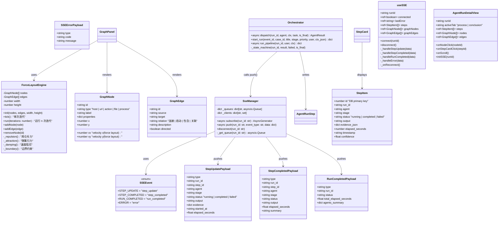
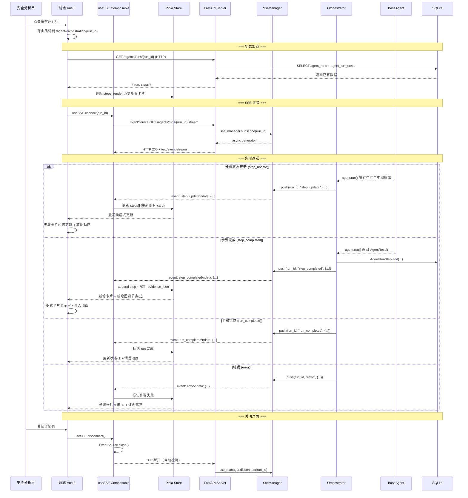
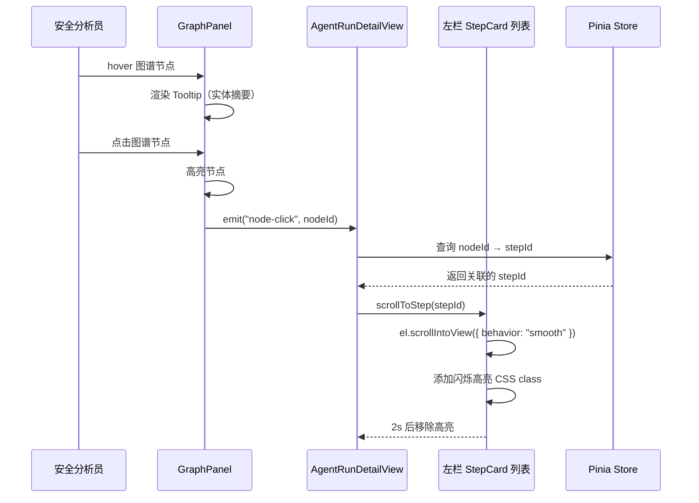
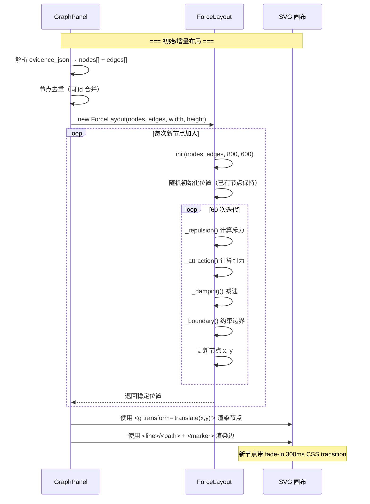
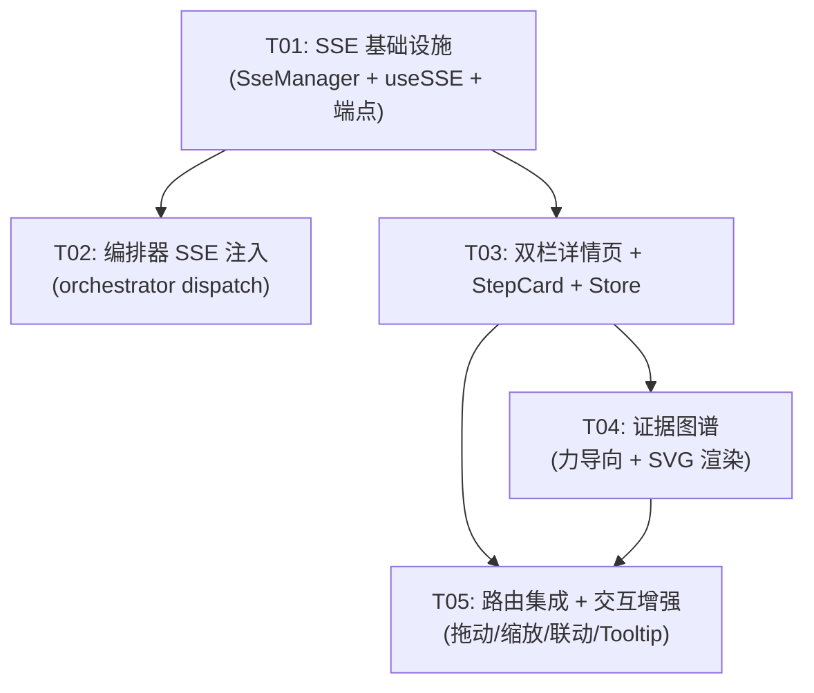

# 智能体编排详情页 — 系统架构方案

> **项目**: IR 安全事件响应平台  
> **版本**: v1.0  
> **文档状态**: 初稿  
> **编程语言**: Vue 3 + Element Plus（前端）/ FastAPI + SQLite（后端）  
> **架构师**: Bob

---

## Part A: System Design

---

### 1. Implementation Approach

#### 1.1 整体架构

```
┌─────────────────────────────────────────────────────────────┐
│                      FastAPI Backend                        │
│  ┌──────────┐   ┌──────────────┐   ┌────────────────────┐  │
│  │  Router   │──▶│ Orchestrator │──▶│    SSE Manager     │  │
│  │ (agents) │   │  .dispatch() │   │ (per-run channels) │  │
│  └──────────┘   └──────┬───────┘   └─────────┬──────────┘  │
│                         │                     │             │
│                  ┌──────▼───────┐             │             │
│                  │ AgentRunStep │             │             │
│                  │   (DB 写入)  │             │             │
│                  └──────────────┘             │             │
└──────────────────────────────────────────────┼─────────────┘
                                               │ SSE (text/event-stream)
                                               ▼
┌─────────────────────────────────────────────────────────────┐
│                      Vue 3 Frontend                         │
│  ┌──────────────────────────────────────────────────────┐   │
│  │         AgentRunDetailView (双栏全屏页面)              │   │
│  │  ┌─────── 左栏 55~60% ───────┐┌── 右栏 40~45% ───┐  │   │
│  │  │  StepCard 流                ││  GraphPanel        │  │   │
│  │  │  [Tabs: 调查过程/结论]      ││  [ForceLayout]     │  │   │
│  │  │  [SSE 状态栏]              ││  [GraphLegend]     │  │   │
│  │  └────────────────────────────┘└────────────────────┘  │   │
│  └──────────────────────────────────────────────────────┘   │
└─────────────────────────────────────────────────────────────┘
```

#### 1.2 核心技术挑战与选型

| 挑战 | 方案 | 说明 |
|------|------|------|
| **SSE 增量推送** | 新建 `SseManager` 管理每个 run_id 的队列，FastAPI `StreamingResponse` 输出 | 不引入新依赖；与现有 WebSocket `alert_ws_manager` 独立，各司其职 |
| **Dispatch 注入推送** | 改造 `dispatch()` 方法，在每次 agent.run() 完成后调用 `SseManager.push()` | 改动最小，不改变编排器核心逻辑 |
| **力导向布局** | 自实现简易 Force Layout（斥力+引力+阻尼） | 不引入第三方图库，满足约束 |
| **原生 SVG 渲染** | Vue `<template>` 内嵌 SVG，v-for 渲染节点/边 | 无额外依赖 |
| **节点拖动/Pan-Zoom** | SVG 原生 mouse 事件 + transform/translate | 原生实现 |
| **SSE 前端订阅** | `EventSource` + Composables 封装 | 浏览器原生 API，无需额外库 |
| **打字机效果** | 定时器逐字 append + 打断机制 | 轻量实现 |

#### 1.3 架构模式

- **前端**: 组件化 + Composables（`useSSE`） + Pinia Store
- **后端**: 路由层 + Service 层（编排器）+ SSE 推送层
- **通信**: SSE（单向实时推送）+ HTTP REST（初始数据加载）

#### 1.4 SSE vs WebSocket 设计取舍

| 因素 | 选择 SSE 的理由 |
|------|----------------|
| 通信方向 | 本场景仅需服务端→客户端的单向推送，SSE 天然适合 |
| 浏览器 API | EventSource 原生支持，自动重连 |
| 协议开销 | 比 WebSocket 轻量，基于 HTTP 长连接 |
| 复用策略 | **不**复用 `alert_ws_manager`（它是 WebSocket 管理器），新建 `SseManager` 专门管理 |

---

### 2. File List

#### 后端（新建 + 修改）

| 相对路径 | 操作 | 说明 |
|----------|------|------|
| `backend/app/services/sse_manager.py` | **新建** | SSE 连接管理器（按 run_id 维护异步队列 + 客户端流） |
| `backend/app/api/agent_sse.py` | **新建** | SSE 流端点 `GET /agents/runs/{run_id}/stream` |
| `backend/app/services/agents/orchestrator.py` | **修改** | 在 `dispatch()` 成功后调用 `SseManager.push()` |
| `backend/app/api/agents.py` | **修改** | 注册 `agent_sse` 路由 |
| `backend/app/services/notification_service.py` | **修改** | 可选：新增 SSE 通知辅助函数 |

#### 前端（新建 + 修改）

| 相对路径 | 操作 | 说明 |
|----------|------|------|
| `frontend/src/composables/useSSE.js` | **新建** | SSE 事件订阅 composable（EventSource 封装，含重连逻辑） |
| `frontend/src/views/AgentRunDetailView.vue` | **新建** | 双栏全屏详情页（Tab: 调查过程/调查结论） |
| `frontend/src/components/agents/StepCard.vue` | **新建** | 步骤卡片组件（状态动画 + 错误标记 + Markdown 渲染） |
| `frontend/src/components/agents/GraphPanel.vue` | **新建** | 证据图谱面板（SVG 容器 + 节点/边渲染 + Pan/Zoom） |
| `frontend/src/components/agents/ForceLayout.vue` | **新建** | 自定义力导向布局引擎（纯 JS，无第三方依赖） |
| `frontend/src/components/agents/GraphLegend.vue` | **新建** | 图谱图例（5 种颜色编码） |
| `frontend/src/components/agents/GraphNodeTooltip.vue` | **新建** | 节点 Hover Tooltip 组件 |
| `frontend/src/stores/agents.js` | **修改** | 新增 SSE 相关 state（steps, graphNodes, graphEdges）与 actions |
| `frontend/src/api/agentOrchestration.js` | **修改** | 新增 SSE URL 常量导出（EventSource 不使用 axios） |
| `frontend/src/views/AgentRunView.vue` | **修改** | 行点击从打开抽屉改为跳转路由 |
| `frontend/src/router/index.js` | **修改** | 注册新路由 `agent-orchestration/:runId` |

---

### 3. Data Structures and Interfaces



---

### 4. Program Call Flow

#### 4.1 SSE 订阅 + 实时推送流程



#### 4.2 证据图谱节点联动左栏



#### 4.3 力导向布局初始化流程



---

### 5. Anything UNCLEAR

| # | 问题 | 决策/假设 |
|---|------|-----------|
| Q1 | 现有 `dispatch()` 是否已有 step 完成回调机制？ | **无**。需要在 `dispatch()` 的 try 块中，`agent.run()` 返回后、`AgentRunStep.add()` 之前/之后，注入 `SseManager.push()` 调用 |
| Q2 | 中间输出（streaming output）如何推送？ | 假设 Agent 的 `run()` 方法暂不支持逐步输出（当前是完整返回），仅推 `step_completed` 事件。后续可扩展 `step_update` —— Agent 子类可调用 `yield` 中间结果 |
| Q3 | `evidence_json` 字段的结构是否已规范化为 `{data_sources, evidence}` 格式？ | **当前 `AgentResult.evidence` 是 `list[dict]`**，非 `{data_sources, evidence}` 格式。需要在推送前转换，或要求 Agent 子类按新格式输出 |
| Q4 | 力导向布局首次渲染的节点数量预估？ | 通常 5-30 个。60 次迭代作为默认值，后续可根据节点数动态调整 |
| Q5 | SSE 断连后是否需要断点续传？ | **P2** 能力。一期以简单重连 + 重新拉取全量 steps（`GET /agents/runs/{id}`）兜底 |

---

## Part B: Task Decomposition

---

### 6. Required Packages

**零新依赖。** 所有技术方案均使用现有栈 + 浏览器原生 API。

| 包名 | 用途 | 必要性论证 |
|------|------|-----------|
| — | SSE 后端 | FastAPI `StreamingResponse` + `text/event-stream`，框架原生支持 |
| — | SSE 前端 | 浏览器 `EventSource` API，无额外依赖 |
| — | 力导向布局 | 纯 JS 实现（~200 行），不引入第三方图库 |
| — | SVG 渲染 | Vue 模板内联 SVG，Element Plus `el-tooltip` 复用 |

---

### 7. Task List (Ordered by Dependency)

#### T01: 项目基础设施 — SSE 管理器 + 前端 Composable + API 端点

| 字段 | 值 |
|------|-----|
| **Task ID** | T01 |
| **Task Name** | SSE 基础设施（后端 SseManager + 前端 useSSE + 路由注册） |
| **Priority** | **P0** |
| **Dependencies** | 无（基础设施任务，无前置依赖） |
| **Source Files** | • `backend/app/services/sse_manager.py` (NEW)<br>• `backend/app/api/agent_sse.py` (NEW)<br>• `frontend/src/composables/useSSE.js` (NEW) |

**验收标准**：
- `SseManager` 支持按 `run_id` 订阅（异步生成器）和推送事件
- `GET /agents/runs/{run_id}/stream` 返回 `text/event-stream`，curl 可验证
- `useSSE` composable 封装 `EventSource`，暴露 `connect()` / `disconnect()` / `steps` / `connected` 响应式状态
- SSE 断连实现指数退避重连（1s→2s→4s→8s→上限30s）

---

#### T02: 后端编排器 SSE 推送集成

| 字段 | 值 |
|------|-----|
| **Task ID** | T02 |
| **Task Name** | 编排器 dispatch() SSE 事件注入 |
| **Priority** | **P0** |
| **Dependencies** | T01（需要 SseManager） |
| **Source Files** | • `backend/app/services/agents/orchestrator.py` (MODIFY)<br>• `backend/app/api/agents.py` (MODIFY)<br>• `backend/app/services/notification_service.py` (MODIFY) |

**验收标准**：
- `dispatch()` 成功完成一个步骤后，自动调用 `SseManager.push()` 推送 `step_completed` 事件
- 错误捕获分支推送 `step_update`（status=failed）事件
- `run_pipeline()` 所有阶段完成后推送 `run_completed` 事件
- `AgentRunStep.add()` 写入的 `evidence_json` 被包含在 SSE 事件 payload 中
- 新路由 `agent_sse.router` 已注册到主 app

---

#### T03: 前端双栏详情页 + SSE 订阅集成

| 字段 | 值 |
|------|-----|
| **Task ID** | T03 |
| **Task Name** | 双栏详情页 + 步骤卡片组件 + Store 集成 |
| **Priority** | **P0** |
| **Dependencies** | T01（需要 useSSE） |
| **Source Files** | • `frontend/src/views/AgentRunDetailView.vue` (NEW)<br>• `frontend/src/components/agents/StepCard.vue` (NEW)<br>• `frontend/src/stores/agents.js` (MODIFY)<br>• `frontend/src/api/agentOrchestration.js` (MODIFY) |

**验收标准**：
- `AgentRunDetailView.vue` 实现双栏布局（左栏 55~60%，右栏 40~45%），顶部 Tab 切换"调查过程"/"调查结论"
- 左栏收到 SSE `step_completed` 事件后 append 一个 `StepCard` 组件
- `StepCard` 显示：Agent 名称、阶段、耗时、状态图标（✓/⏳/✗）、输出内容（Markdown 渲染）
- 运行中的 Agent 显示转圈动画；错误步骤显示 ✗ + 红色边框
- "调查结论" Tab 显示最终报告 + Agent 执行摘要
- SSE 连接状态栏显示 🟢 SSE 连接中 / 🔴 SSE 已断开 + 手动重连按钮
- 响应式：<1024px 切换上下布局，右栏折叠为可展开面板
- 自动滚动跟随（用户手动上滚时暂停，回到底部恢复）
- Store 新增 `steps` / `sseConnected` / `sseError` 响应式 state

---

#### T04: 证据图谱 — 力导向布局 + SVG 渲染

| 字段 | 值 |
|------|-----|
| **Task ID** | T04 |
| **Task Name** | 证据图谱（原生 SVG + 力导向布局 + 节点/边渲染） |
| **Priority** | **P1** |
| **Dependencies** | T03（需要 GraphPanel 在详情页面中出现） |
| **Source Files** | • `frontend/src/components/agents/GraphPanel.vue` (NEW)<br>• `frontend/src/components/agents/ForceLayout.vue` (NEW)<br>• `frontend/src/components/agents/GraphLegend.vue` (NEW) |

**验收标准**：
- `ForceLayout.vue` 实现简易力导向算法：库仑斥力 + 弹簧引力 + 速度阻尼 + 边界约束
- `GraphPanel.vue` 使用 `<svg>` 原生元素渲染节点（`<circle>`/`<rect>`）和边（`<line>` + `<marker>` 箭头）
- 5 种节点颜色严格按规范：主机 `#E74C3C`、资源 `#3498DB`、动作 `#F39C12`、文件 `#2ECC71`、进程 `#9B59B6`
- 4 种边类型标注："连接"、"启动"、"包含"、"关联"（hover 显示关系文本）
- 节点随 SSE 事件实时新增（300ms 淡入动画 + 位置微移）
- 数据源从 `evidence_json` 解析：`data_sources` → 节点，`evidence` → 边；自动去重合并
- `GraphLegend.vue` 显示颜色编码图例

---

#### T05: 路由集成 + 交互增强（节点拖动/缩放/联动/Tooltip）

| 字段 | 值 |
|------|-----|
| **Task ID** | T05 |
| **Task Name** | 路由集成 + 图谱交互增强（联动/拖动/缩放/Tooltip） |
| **Priority** | **P2** |
| **Dependencies** | T03（需要路由和详情页）、T04（需要图谱组件） |
| **Source Files** | • `frontend/src/router/index.js` (MODIFY)<br>• `frontend/src/views/AgentRunView.vue` (MODIFY)<br>• `frontend/src/components/agents/GraphNodeTooltip.vue` (NEW) |

**验收标准**：
- 路由注册：`/agent-orchestration/:runId` 渲染 `AgentRunDetailView`
- `AgentRunView` 行点击从 `el-drawer` 改为 `router.push({ name: 'AgentRunDetail', params: { runId: row.run_id } })`
- **节点拖动**：SVG 节点拖拽（mousedown + mousemove + mouseup），位置实时更新
- **缩放/Pan**：鼠标滚轮缩放（0.5x~3x）+ 中键平移，使用 SVG `transform`
- **节点联动左栏**：点击节点 → emit 事件 → 左栏 `scrollToStep()` → 对应卡片闪烁高亮 2s
- **Hover Tooltip**：`GraphNodeTooltip` 显示实体摘要信息，跟随鼠标，2s 后自动消失
- **LLM 打字机效果**：`StepCard` 中 LLM 输出逐字呈现（30-50 字/秒），新事件到来时立即完成当前文本

---

### 8. Task Dependency Graph



**说明**：
- T01（基础设施）是所有后续任务的前置依赖
- T02（后端注入）和 T03（前端详情页）可**并行**开发（均依赖 T01）
- T04（证据图谱）依赖 T03（需要在详情页中嵌入）
- T05（交互增强）依赖 T03 + T04（在已有组件上叠加交互能力）

---

### 9. Shared Knowledge（跨文件约定）

#### 9.1 命名约定

| 领域 | 约定 |
|------|------|
| 后端类名 | `SseManager`, `Orchestrator` — PascalCase |
| 后端函数 | `push()`, `subscribe()`, `disconnect()` — camelCase |
| 前端组件 | `StepCard.vue`, `GraphPanel.vue`, `ForceLayout.vue` — PascalCase |
| 前端文件 | `useSSE.js`, `agentOrchestration.js` — camelCase |
| SSE 事件类型 | `step_update`, `step_completed`, `run_completed`, `error` — snake_case |
| 图谱节点类型 | `host`, `url`, `action`, `file`, `process` — snake_case lowercase |
| 图谱边关系 | `连接`, `启动`, `包含`, `关联` — 中文常量（与现有 UI 语言一致） |

#### 9.2 图谱颜色规范（严格）

| 节点类型 | Hex 色值 | CSS 变量引用 |
|----------|----------|-------------|
| host | `#E74C3C` | `var(--graph-color-host)` |
| url/resource | `#3498DB` | `var(--graph-color-url)` |
| action | `#F39C12` | `var(--graph-color-action)` |
| file | `#2ECC71` | `var(--graph-color-file)` |
| process | `#9B59B6` | `var(--graph-color-process)` |

#### 9.3 SSE 数据格式

- 后端 `SseManager.push()` 接收 `event_type: str` 和 `data: dict`
- 序列化：`f"event: {event_type}\ndata: {json.dumps(data)}\n\n"`
- 所有时间字段使用 ISO 8601 UTC 格式
- `evidence_json` 在推送前规范化为 `{"data_sources": [...], "evidence": [...]}`

#### 9.4 响应式布局断点

| 宽度范围 | 布局 |
|----------|------|
| ≥ 1440px | 双栏并排，55:45 |
| 1024~1439px | 双栏并排，50:50 |
| < 1024px | 上下布局，右栏折叠为可展开面板 |

#### 9.5 SSE 重连策略

| 重试次数 | 等待时间 |
|----------|---------|
| 1 | 1s |
| 2 | 2s |
| 3 | 4s |
| 4 | 8s |
| 5+ | 16s（上限 30s） |

#### 9.6 力导向布局参数

| 参数 | 默认值 | 说明 |
|------|--------|------|
| 库仑常量 (repulsion) | 5000 | 节点间斥力系数 |
| 弹簧常量 (attraction) | 0.01 | 边两端引力系数 |
| 阻尼系数 (damping) | 0.9 | 速度衰减 |
| 初始迭代次数 | 60 | 新节点加入后迭代 |
| 增量迭代次数 | 20 | 仅新加入节点影响时的迭代 |
| 节点最小距离 | 30px | 防重叠 |
| 画布边距 | 50px | 边界约束 |

---

### 10. 待明确事项

| # | 事项 | 建议方案 |
|---|------|----------|
| 1 | `agent_run_steps.evidence_json` 当前存储格式为 `list[dict]`（AgentResult.evidence），与新 SSE 事件格式 `{data_sources, evidence}` 不兼容 | — 在 `orchestrator.dispatch()` 中做一次格式转换<br>— 或要求各 Agent 子类统一输出新格式<br>**建议**：在 `SseManager.push()` 中转换，Agent 侧保持兼容 |
| 2 | Agent 中间输出（`step_update`）的触发时机不明确 | 当前 Agent 的 `run()` 是完整执行的，没有逐步输出。一期仅推 `step_completed` 和 `step_update`（status=running 的初始状态） |
| 3 | 节点去重时，同一实体从不同 Agent 步骤中出现的属性不一致如何处理 | **策略**：后出现的属性覆盖先出现的；`properties` 字段做深度 merge |
| 4 | SSE 断连后，后端是否保留队列中未发送的事件 | **一期策略**：不保留。断开后丢弃队列。前端重连后调用 `GET /agents/runs/{id}` 拉取全量 steps 做状态同步 |
