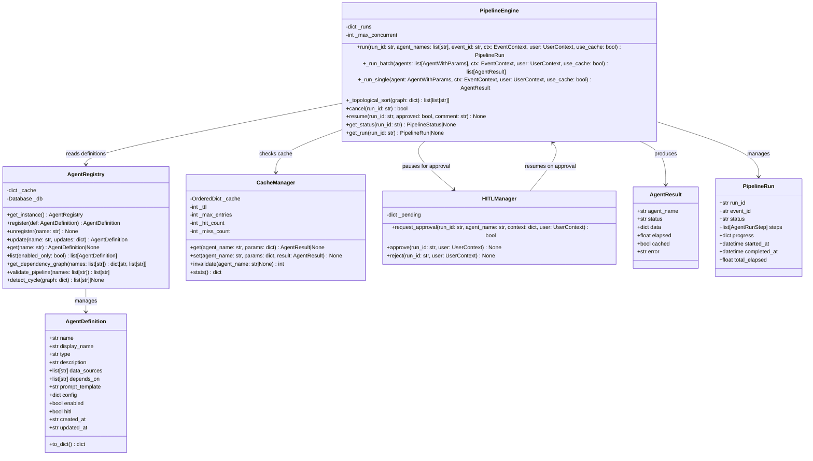
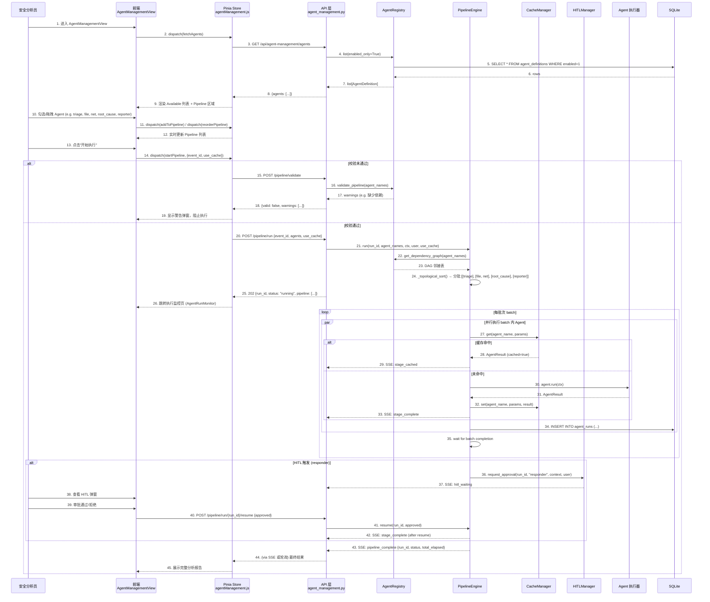
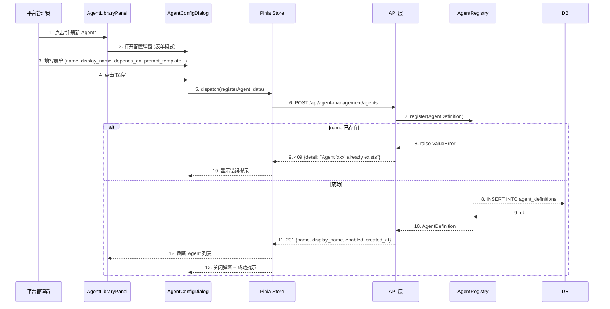
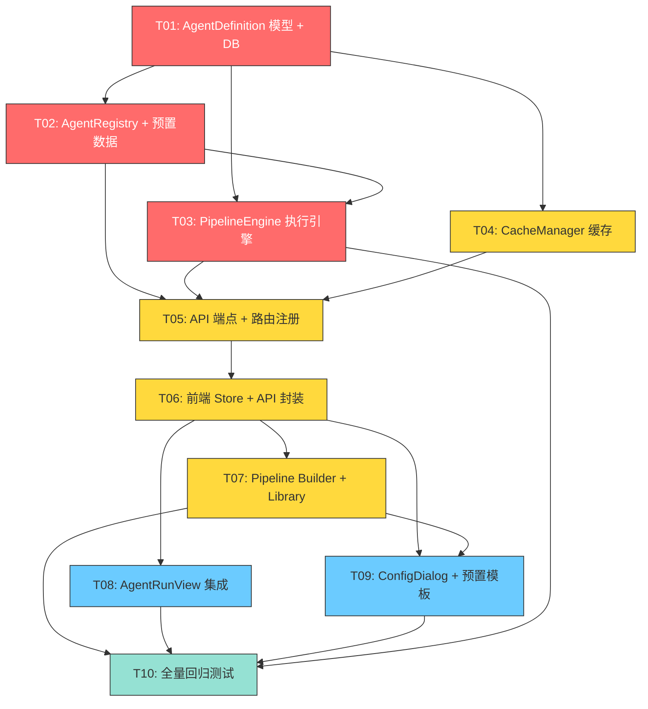

# IR 安全事件响应平台 — Agent 管理 Phase 2 架构设计与任务分解

> **作者**: Bob (Architect)  
> **版本**: v1.0  
> **日期**: 2025-07-16  
> **基于**: `docs/agent_management_phase2_design_report.md` (Alice's PRD)

---

## Part A: 系统设计方案

---

### 1. 实现方案

#### 1.1 整体架构

采用**分层架构 + 模块化服务**模式，在现有 IR 平台基础上横向扩展 Agent 管理子域：

```
┌─────────────────────────────────────────────────────────┐
│                    前端层 (Vue 3 + Element Plus)          │
│  AgentManagementView   AgentPipelineCanvas               │
│  AgentLibraryPanel     AgentConfigDialog                  │
│  agentManagement.js (Pinia Store)                        │
├─────────────────────────────────────────────────────────┤
│                    API 网关层 (FastAPI)                    │
│  /api/agent-management/agents/*     (CRUD)               │
│  /api/agent-management/pipeline/*   (执行/校验/预置)      │
├─────────────────────────────────────────────────────────┤
│                     服务层 (Python)                       │
│  AgentRegistry (单例) → PipelineEngine → CacheManager    │
│  HITLManager (人工审批)   preset_data (种子数据)          │
├─────────────────────────────────────────────────────────┤
│                     数据层 (SQLite)                       │
│  agent_definitions   pipeline_presets   agent_runs        │
│  + 内存 Cache (LRU+TTL)                                  │
└─────────────────────────────────────────────────────────┘
```

#### 1.2 模块间调用流程

| 调用方 | 被调用方 | 用途 | 协议 |
|--------|---------|------|------|
| AgentManagementView | agentManagement Store | UI 交互 | Pinia |
| agentManagement Store | API layer | HTTP 请求 | fetch/axios |
| API router | AgentRegistry | Agent CRUD + 依赖校验 | 直接调用 |
| API router | PipelineEngine | 管道执行 | asyncio.create_task |
| PipelineEngine | AgentRegistry | 获取依赖图 + AgentDefinition | 直接调用 |
| PipelineEngine | CacheManager | 缓存查询/写入 | 直接调用 |
| PipelineEngine | SSE stream | 实时状态推送 | StreamingResponse |
| API router | pipeline_presets table | 预置模板 CRUD | SQLAlchemy |

#### 1.3 数据流（完整链路）

```
事件选择 → 管道构建 → DAG 解析 → 分批执行 → 结果聚合 → 报告展示

1. 用户在 AgentRunView 选择事件 → 点击"选择智能体"
2. 跳转 AgentManagementView → GET /agents → 渲染 Available 列表
3. 用户拖拽/勾选 Agent 组合 → 前端调用 validate 实时校验依赖
4. 校验通过 → 用户点击"开始执行"
5. POST /pipeline/run → PipelineEngine.run() 启动后台任务
6. 后端返回 run_id + pipeline 结构（含分批信息）
7. PipelineEngine 逐批执行 → 每步通过 SSE 推送实时状态
8. 全部完成 → 结果写入 agent_runs 表
9. 前端轮询或通过 SSE 接收最终结果 → 展示分析报告
10. 用户可手动保存当前组合为预置模板
```

---

### 2. 框架选型

#### 2.1 技术栈确认

| 技术 | 版本 | 状态 | 用途 |
|------|------|------|------|
| Vue 3 | 3.4+ | ✅ 已有 | 前端框架 |
| Element Plus | 2.5+ | ✅ 已有 | UI 组件库（表格/弹窗/表单/下拉菜单） |
| Pinia | 2.1+ | ✅ 已有 | 状态管理 |
| HTML5 Drag and Drop API | 原生 | ✅ 零新依赖 | 拖拽排序 |
| FastAPI | 0.104+ | ✅ 已有 | 后端框架 + SSE |
| SQLAlchemy | 2.0+ | ✅ 已有 | ORM |
| SQLite | 3.x | ✅ 已有 | 数据库 |
| asyncio | Python 3.11+ | ✅ 标准库 | 异步并行执行 |
| hashlib | 标准库 | ✅ 标准库 | 缓存 key 生成 |
| json | 标准库 | ✅ 标准库 | JSON 序列化 |
| uuid | 标准库 | ✅ 标准库 | run_id 生成 |
| collections.OrderedDict | 标准库 | ✅ 标准库 | LRU 缓存实现 |

**结论：零新增外部依赖。** 所有功能均基于现有技术栈或语言标准库实现。

#### 2.2 为什么选原生 HTML5 Drag and Drop

| 方案 | 优点 | 缺点 | 结论 |
|------|------|------|------|
| **原生 HTML5 DnD** | 零依赖；与 Element Plus 无冲突；移动端 fallback 用箭头按钮 | 无动画；无触摸支持 | ✅ **选择** |
| vuedraggable (SortableJS) | 流畅动画；触摸支持 | 新增依赖；与 Element Plus 可能存在拖拽冲突 | ❌ 不引入 |
| @vueuse/gesture | 手势支持 | 学习成本；复杂度过高 | ❌ 过度设计 |

原生 HTML5 Drag and Drop 足以满足简单的列表拖拽排序需求，配合移动端上下箭头按钮作为 fallback。

---

### 3. 文件列表及路径

#### 3.1 后端文件

| 文件 | 状态 | 说明 |
|------|------|------|
| `backend/app/models/agent_definition.py` | **NEW** | SQLAlchemy 模型: `AgentDefinition` + `PipelinePreset` + `AgentRun` |
| `backend/app/services/agents/agent_registry.py` | **NEW** | 注册表单例: CRUD + 依赖图构建 + 环检测 |
| `backend/app/services/agents/agent_definition.py` | **NEW** | `AgentDefinition` dataclass (API 层数据模型) |
| `backend/app/services/agents/pipeline_engine.py` | **NEW** | 并行管道引擎: 拓扑排序 + 分批执行 + HITL |
| `backend/app/services/agents/cache_manager.py` | **NEW** | 内存缓存: LRU + TTL + stats |
| `backend/app/services/agents/hitl_manager.py` | **NEW** | 人工审批管理器 |
| `backend/app/services/agents/preset_data.py` | **NEW** | 10 个预置 Agent 种子数据 |
| `backend/app/api/agent_management.py` | **NEW** | API 路由: Agent CRUD + 管道执行 + 预置模板 |
| `backend/app/main.py` | **MODIFY** | 注册 `agent_management` 路由 |
| `backend/app/services/agents/orchestrator.py` | **MODIFY** | 新增 `run_custom_pipeline()` 方法 |

#### 3.2 前端文件

| 文件 | 状态 | 说明 |
|------|------|------|
| `frontend/src/views/AgentManagementView.vue` | **NEW** | 主视图: Tab 切换 (Pipeline / Agent Library / History) |
| `frontend/src/components/agents/AgentPipelineCanvas.vue` | **NEW** | 拖拽排序管道画布 + Available 列表 + 工具栏 |
| `frontend/src/components/agents/AgentLibraryPanel.vue` | **NEW** | Agent 库管理表格 (CRUD 操作入口) |
| `frontend/src/components/agents/AgentConfigDialog.vue` | **NEW** | 注册/编辑 Agent 表单弹窗 |
| `frontend/src/components/agents/AgentRunMonitor.vue` | **NEW** | 执行状态实时监控面板 |
| `frontend/src/components/agents/HITLDialog.vue` | **NEW** | 人工审批弹窗 |
| `frontend/src/stores/agentManagement.js` | **NEW** | Pinia Store: 状态管理 + API 封装 |
| `frontend/src/views/AgentRunView.vue` | **MODIFY** | "启动闭环"按钮旁增加"选择智能体"入口按钮 |
| `frontend/src/router/index.js` | **MODIFY** | 注册 `/agent-management` 路由 |

---

### 4. 数据结构和接口

#### 4.1 数据模型



#### 4.2 API 接口定义

##### 4.2.1 Agent 管理

| 方法 | 路径 | 说明 | 请求体 | 响应 |
|------|------|------|--------|------|
| GET | `/api/agent-management/agents` | 列出 Agent | `?enabled_only=true` | `{agents: AgentDefinition[]}` |
| POST | `/api/agent-management/agents` | 注册 Agent | `AgentCreate` | `201: AgentDefinition` |
| PUT | `/api/agent-management/agents/{name}` | 更新 Agent | `AgentUpdate` (partial) | `200: AgentDefinition` |
| DELETE | `/api/agent-management/agents/{name}` | 注销 Agent | — | `200: {detail}` 或 `409: {detail}` |
| GET | `/api/agent-management/agents/deps` | 依赖图查询 | `?agents=a,b,c` | `{graph, topological_order}` |

**Pydantic 模型**:

```python
class AgentCreate(BaseModel):
    name: str                    # 字母数字下划线，唯一
    display_name: str
    type: str = "custom"         # "built-in" | "custom"
    description: str = ""
    data_sources: list[str] = []
    depends_on: list[str] = []
    prompt_template: str = ""
    config: dict = {}

class AgentUpdate(BaseModel):
    display_name: Optional[str] = None
    description: Optional[str] = None
    data_sources: Optional[list[str]] = None
    depends_on: Optional[list[str]] = None
    prompt_template: Optional[str] = None
    config: Optional[dict] = None
    enabled: Optional[bool] = None
```

##### 4.2.2 管道执行

| 方法 | 路径 | 说明 | 请求体 | 响应 |
|------|------|------|--------|------|
| POST | `/api/agent-management/pipeline/validate` | 校验管道 | `{agents: string[]}` | `{valid, warnings, batches}` |
| POST | `/api/agent-management/pipeline/run` | 执行管道 | `{event_id, agents, use_cache}` | `202: {run_id, status, pipeline}` |
| GET | `/api/agent-management/pipeline/run/{run_id}` | 查询状态 | — | `{run_id, status, progress, results}` |
| POST | `/api/agent-management/pipeline/run/{run_id}/cancel` | 取消执行 | — | `200: {run_id, status}` |
| POST | `/api/agent-management/pipeline/run/{run_id}/resume` | 恢复执行 | `{approved, comment}` | `200: {run_id, status}` |
| GET | `/api/agent-management/pipeline/run/{run_id}/stream` | SSE 推送 | — | `text/event-stream` |

##### 4.2.3 预置模板

| 方法 | 路径 | 说明 | 请求体 | 响应 |
|------|------|------|--------|------|
| GET | `/api/agent-management/pipeline/presets` | 列表 | — | `{presets: Preset[]}` |
| POST | `/api/agent-management/pipeline/presets` | 保存 | `{name, description, agents}` | `201: Preset` |
| DELETE | `/api/agent-management/pipeline/presets/{id}` | 删除 | — | `200: {detail}` |

##### 4.2.4 SSE 事件格式

```
event: stage_start
data: {"name": "file_analysis", "stage": 2, "status": "running"}

event: stage_complete
data: {"name": "file_analysis", "stage": 2, "status": "completed", "elapsed": 4.2, "cached": false}

event: stage_cached
data: {"name": "network_analysis", "stage": 2, "status": "completed", "elapsed": 0.8, "cached": true}

event: hitl_waiting
data: {"name": "responder", "message": "等待审批处置建议", "timeout": 300}

event: pipeline_complete
data: {"run_id": "run_custom_a1b2c3d4", "status": "completed", "total_elapsed": 42.5}
```

#### 4.3 关键算法

##### 拓扑排序 (Kahn 算法)

```python
def _topological_sort(self, graph: dict[str, list[str]]) -> list[list[str]]:
    """Kahn 算法: 分层拓扑排序
    
    返回: list[list[str]] — 每层为可并行执行的 Agent 列表
    例: [["triage"], ["file_analysis", "network_analysis"], ["root_cause"]]
    """
    in_degree = {node: 0 for node in graph}
    for node, deps in graph.items():
        for dep in deps:
            in_degree[node] += 1
    
    queue = deque([n for n, d in in_degree.items() if d == 0])
    batches = []
    
    while queue:
        batch = []
        for _ in range(len(queue)):
            node = queue.popleft()
            batch.append(node)
            # 更新下游入度（需全局图信息）
        batches.append(batch)
    
    return batches
```

##### DFS 环检测 (三色标记)

```python
def detect_cycle(self, graph: dict[str, list[str]]) -> Optional[list[str]]:
    """DFS 三色标记环检测
    WHITE=0 (未访问), GRAY=1 (正在访问), BLACK=2 (已结束)
    返回环路径或 None
    """
    WHITE, GRAY, BLACK = 0, 1, 2
    color = {node: WHITE for node in graph}
    parent = {}
    
    def dfs(node, path):
        color[node] = GRAY
        path.append(node)
        for neighbor in graph.get(node, []):
            if neighbor not in color:
                continue
            if color[neighbor] == GRAY:
                # 发现环: 从 neighbor 到 node 的路径
                cycle_start = path.index(neighbor)
                return path[cycle_start:] + [neighbor]
            if color[neighbor] == WHITE:
                result = dfs(neighbor, path)
                if result:
                    return result
        path.pop()
        color[node] = BLACK
        return None
    
    for node in graph:
        if color[node] == WHITE:
            result = dfs(node, [])
            if result:
                return result
    return None
```

##### LRU 缓存淘汰

```python
def set(self, agent_name: str, params: dict, result: AgentResult) -> None:
    key = self._make_key(agent_name, params)
    # 淘汰过期条目
    now = time.time()
    expired = [k for k, v in self._cache.items()
               if now - v.created_at > self._ttl]
    for k in expired:
        del self._cache[k]
    # 淘汰 LRU
    while len(self._cache) >= self._max_entries:
        self._cache.popitem(last=False)
    # 写入
    self._cache[key] = CacheEntry(key=key, result=result, created_at=now)
```

---

### 5. 程序调用流程

#### 5.1 核心路径: 管道执行



#### 5.2 管理路径: Agent CRUD



---

### 6. 依赖包列表

**无新依赖。** 全部使用已有技术栈或语言标准库：

| 依赖 | 来源 | 用途 |
|------|------|------|
| `fastapi` | ✅ 已有 | API 路由 + SSE |
| `sqlalchemy` | ✅ 已有 | SQLite ORM |
| `pydantic` | ✅ 已有 | 请求/响应模型 |
| `asyncio` | ✅ Python 标准库 | 异步并行 |
| `hashlib` | ✅ Python 标准库 | 缓存 key 哈希 |
| `json` | ✅ Python 标准库 | JSON 序列化 |
| `uuid` | ✅ Python 标准库 | run_id 生成 |
| `collections.OrderedDict` | ✅ Python 标准库 | LRU 缓存 |
| `time` | ✅ Python 标准库 | TTL 判断 |
| `vue` | ✅ 已有 | 前端框架 |
| `element-plus` | ✅ 已有 | UI 组件 |
| `pinia` | ✅ 已有 | 状态管理 |
| HTML5 Drag and Drop | ✅ 浏览器原生 | 拖拽排序 |

---

### 7. 共享知识

#### 7.1 命名约定

- **Agent name**: 统一使用 `snake_case`（如 `file_analysis`, `root_cause`）
- **run_id**: 格式 `run_custom_{uuid4 hex[:8]}`（如 `run_custom_a1b2c3d4`）
- **数据库字段**: `snake_case`（如 `display_name`, `data_sources`）
- **API 字段**: `snake_case`（与 Python 保持一致，FastAPI 自动转换）

#### 7.2 数据源引用

格式: `表名.字段名`
- `security_events.file_create`
- `process_events`
- `network_connection`
- `security_events.registry_modify`
- `ioc_matches`

#### 7.3 SSE 事件复用现有格式

与现有管道 SSE 保持一致的事件命名:

| 事件名 | 说明 | data 示例 |
|--------|------|-----------|
| `stage_start` | Agent 开始执行 | `{"name":"file_analysis","stage":2,"status":"running"}` |
| `stage_complete` | Agent 执行完成 | `{"name":"file_analysis","stage":2,"status":"completed","elapsed":4.2,"cached":false}` |
| `stage_cached` | 缓存命中 | `{"name":"network_analysis","stage":2,"status":"completed","elapsed":0.8,"cached":true}` |
| `hitl_waiting` | HITL 暂停等待 | `{"name":"responder","message":"等待审批","timeout":300}` |
| `pipeline_complete` | 管道全部完成 | `{"run_id":"...","status":"completed","total_elapsed":42.5}` |

#### 7.4 数据库 JSON 字段序列化规则

| 字段 | 序列化 | 反序列化 | 示例 |
|------|--------|---------|------|
| `data_sources` | `json.dumps(list)` | `json.loads(str)` | `["security_events"]` |
| `depends_on` | `json.dumps(list)` | `json.loads(str)` | `["triage"]` |
| `config` | `json.dumps(dict)` | `json.loads(str)` | `{"timeout": 30}` |
| `agents` (presets) | `json.dumps(list)` | `json.loads(str)` | `["triage","reporter"]` |

#### 7.5 错误处理约定

```python
# API 层统一错误响应格式
{
    "detail": "错误描述信息"  # 字符串
}

# HTTP 状态码
409: name 已存在 / Agent 被引用无法删除
404: Agent 未找到
202: 管道执行异步启动成功
```

#### 7.6 预置 Agent 种子数据

10 个预置 Agent 在首次启动时通过 `preset_data.py` 注入：

| name | display_name | type | depends_on | hitl |
|------|-------------|------|------------|------|
| triage | 分诊智能体 | built-in | [] | false |
| file_analysis | 文件分析 | custom | [triage] | false |
| process_analysis | 进程分析 | custom | [triage] | false |
| network_analysis | 网络分析 | custom | [triage] | false |
| registry_analysis | 注册表分析 | custom | [triage] | false |
| threat_intel | 威胁情报 | custom | [triage] | false |
| timeline | 时间线重建 | custom | [triage] | false |
| root_cause | 根因定位 | custom | [file_analysis, process_analysis, network_analysis] | false |
| responder | 处置建议 | built-in | [root_cause] | true |
| reporter | 报告输出 | built-in | [responder] | false |

---

## Part B: 任务分解

---

### 8. 任务列表（按依赖顺序）

#### T01: AgentDefinition 数据模型 + DB 迁移

| 字段 | 值 |
|------|-----|
| **ID** | T01 |
| **名称** | AgentDefinition 数据模型 + DB 表创建 |
| **优先级** | **P0** |
| **前置依赖** | 无 |
| **涉及文件** | `backend/app/models/agent_definition.py` (NEW), `backend/app/services/agents/agent_definition.py` (NEW) |
| **预估行数** | ~120 行 |
| **关键产出** | SQLAlchemy 模型 + Pydantic dataclass |

**详细描述**:

1. **`backend/app/models/agent_definition.py`** (~80 行):
   - 定义 `AgentDefinitionModel` (SQLAlchemy `declarative_base`):
     - 字段: `id`, `name` (UNIQUE), `display_name`, `type`, `description`, `data_sources` (TEXT JSON), `depends_on` (TEXT JSON), `prompt_template`, `config` (TEXT JSON), `enabled`, `created_at`, `updated_at`
     - Helper 方法: `to_dict()`, `from_dict()` — JSON 字段自动序列化/反序列化
   - 定义 `PipelinePresetModel`:
     - 字段: `id`, `name`, `description`, `agents` (TEXT JSON), `created_at`
   - 定义 `AgentRunModel`:
     - 字段: `id`, `run_id`, `event_id`, `agent_name`, `status`, `stage`, `elapsed`, `cached`, `input_hash`, `result` (TEXT), `error`, `started_at`, `completed_at`

2. **`backend/app/services/agents/agent_definition.py`** (~40 行):
   - `AgentDefinition` dataclass:
     - `name: str`, `display_name: str`, `type: str = "custom"`, `description: str = ""`, `data_sources: list[str] = field(default_factory=list)`, `depends_on: list[str] = field(default_factory=list)`, `prompt_template: str = ""`, `config: dict = field(default_factory=dict)`, `enabled: bool = True`, `hitl: bool = False`, `created_at: str = ""`, `updated_at: str = ""`
     - `to_dict() -> dict`
     - `from_dict(data: dict) -> AgentDefinition`

3. **数据库初始化**:
   - 确保 `create_all` 包含新表
   - 首次启动自动创建表

---

#### T02: AgentRegistry 注册表 + 预置种子数据

| 字段 | 值 |
|------|-----|
| **ID** | T02 |
| **名称** | AgentRegistry 注册表 CRUD + 依赖图解析 + 环检测 + 预置数据 |
| **优先级** | **P0** |
| **前置依赖** | T01 |
| **涉及文件** | `backend/app/services/agents/agent_registry.py` (NEW), `backend/app/services/agents/preset_data.py` (NEW), `backend/app/services/agents/__init__.py` (NEW) |
| **预估行数** | ~200 行 |
| **关键产出** | AgentRegistry 单例 + 依赖校验 + 10 个预置 Agent |

**函数签名**:

```python
# agent_registry.py
class AgentRegistry:
    @classmethod
    def get_instance(cls) -> AgentRegistry: ...
    def register(self, agent_def: AgentDefinition) -> AgentDefinition: ...
    def unregister(self, name: str) -> None: ...
    def update(self, name: str, updates: dict) -> AgentDefinition: ...
    def get(self, name: str) -> Optional[AgentDefinition]: ...
    def list(self, enabled_only: bool = True) -> list[AgentDefinition]: ...
    def get_dependency_graph(self, agent_names: list[str]) -> dict[str, list[str]]: ...
    def validate_pipeline(self, agent_names: list[str]) -> list[str]: ...
    def detect_cycle(self, graph: dict[str, list[str]]) -> Optional[list[str]]: ...

# preset_data.py
PRESET_AGENTS: list[dict] = [
    {"name": "triage", "display_name": "分诊智能体", "type": "built-in", ...},
    # ... 共 10 个预置 Agent
]

def seed_preset_agents(registry: AgentRegistry) -> int: ...
```

---

#### T03: PipelineEngine 并行执行引擎

| 字段 | 值 |
|------|-----|
| **ID** | T03 |
| **名称** | PipelineEngine 并行执行引擎 + 拓扑排序 + 分批并行 + SSE 推送 |
| **优先级** | **P0** |
| **前置依赖** | T01, T02 |
| **涉及文件** | `backend/app/services/agents/pipeline_engine.py` (NEW), `backend/app/services/agents/hitl_manager.py` (NEW), `backend/app/services/agents/orchestrator.py` (MODIFY) |
| **预估行数** | ~300 行 |
| **关键产出** | 可执行的 DAG 管道引擎 + HITL 机制 + 旧 orchestrator 兼容 |

**函数签名**:

```python
# pipeline_engine.py
class PipelineEngine:
    def __init__(self, max_concurrent: int = 5): ...
    async def run(self, run_id: str, agent_names: list[str], event_id: str,
                  ctx: EventContext, user: UserContext, use_cache: bool = True) -> PipelineRun: ...
    async def _run_batch(self, agents: list[AgentWithParams], ctx: EventContext,
                         user: UserContext, use_cache: bool) -> list[AgentResult]: ...
    async def _run_single(self, agent: AgentWithParams, ctx: EventContext,
                          user: UserContext, use_cache: bool) -> AgentResult: ...
    def _topological_sort(self, graph: dict[str, list[str]]) -> list[list[str]]: ...
    def cancel(self, run_id: str) -> bool: ...
    async def resume(self, run_id: str, approved: bool, comment: str = "") -> None: ...
    def get_status(self, run_id: str) -> Optional[PipelineStatus]: ...
    def get_run(self, run_id: str) -> Optional[PipelineRun]: ...

# hitl_manager.py
class HITLManager:
    async def request_approval(self, run_id: str, agent_name: str,
                                context: dict, user: UserContext) -> bool: ...
    def approve(self, run_id: str, user: UserContext) -> None: ...
    def reject(self, run_id: str, user: UserContext) -> None: ...

# orchestrator.py (MODIFY)
# 新增方法:
async def run_custom_pipeline(self, run_id: str, agent_names: list[str],
                               event_id: str, user: UserContext) -> dict: ...
```

**实现要点**:
- Kahn 拓扑排序（分层分批）
- `asyncio.gather` 并行执行 batch 内 Agent
- SSE 回调: 每步 start/complete/cached 通过回调函数推送
- agent_runs 表写入（每步完成后记录）
- HITL 暂停: `asyncio.Event().wait()` + 超时机制

---

#### T04: CacheManager 缓存管理

| 字段 | 值 |
|------|-----|
| **ID** | T04 |
| **名称** | CacheManager 内存 LRU 缓存 + TTL 过期 |
| **优先级** | **P1** |
| **前置依赖** | T01 |
| **涉及文件** | `backend/app/services/agents/cache_manager.py` (NEW) |
| **预估行数** | ~100 行 |
| **关键产出** | 可注入 PipelineEngine 的缓存管理器 |

**函数签名**:

```python
class CacheManager:
    def __init__(self, ttl: int = 3600, max_entries: int = 1000): ...
    def _make_key(self, agent_name: str, params: dict) -> str: ...
    def get(self, agent_name: str, params: dict) -> Optional[AgentResult]: ...
    def set(self, agent_name: str, params: dict, result: AgentResult) -> None: ...
    def invalidate(self, agent_name: Optional[str] = None) -> int: ...
    def stats(self) -> dict: ...
```

**实现要点**:
- key = `f"{agent_name}:{sha256(json.dumps(params, sort_keys=True).hexdigest())}"`
- `OrderedDict` 实现 LRU
- get 时: `move_to_end(key)` 更新访问顺序
- set 时: `popitem(last=False)` 淘汰最久未访问
- 线程安全: `threading.Lock`

---

#### T05: API 端点 + 路由注册

| 字段 | 值 |
|------|-----|
| **ID** | T05 |
| **名称** | Agent 管理 API 端点 + 路由注册 |
| **优先级** | **P1** |
| **前置依赖** | T01, T02, T03, T04 |
| **涉及文件** | `backend/app/api/agent_management.py` (NEW), `backend/app/main.py` (MODIFY) |
| **预估行数** | ~200 行 |
| **关键产出** | 完整可调用的 REST API |

**API 端点清单**:

| 方法 | 路径 | 处理器 |
|------|------|--------|
| GET | `/api/agent-management/agents` | `list_agents(enabled_only)` |
| POST | `/api/agent-management/agents` | `create_agent(data: AgentCreate)` |
| PUT | `/api/agent-management/agents/{name}` | `update_agent(name, data: AgentUpdate)` |
| DELETE | `/api/agent-management/agents/{name}` | `delete_agent(name)` |
| GET | `/api/agent-management/agents/deps` | `get_dependency_graph(agents: str)` |
| POST | `/api/agent-management/pipeline/validate` | `validate_pipeline(data: PipelineValidateRequest)` |
| POST | `/api/agent-management/pipeline/run` | `run_pipeline(data: PipelineRunRequest)` |
| GET | `/api/agent-management/pipeline/run/{run_id}` | `get_run_status(run_id)` |
| POST | `/api/agent-management/pipeline/run/{run_id}/cancel` | `cancel_run(run_id)` |
| POST | `/api/agent-management/pipeline/run/{run_id}/resume` | `resume_run(run_id, data: ResumeRequest)` |
| GET | `/api/agent-management/pipeline/run/{run_id}/stream` | `stream_run_status(run_id)` |
| GET | `/api/agent-management/pipeline/presets` | `list_presets()` |
| POST | `/api/agent-management/pipeline/presets` | `create_preset(data: PresetCreate)` |
| DELETE | `/api/agent-management/pipeline/presets/{preset_id}` | `delete_preset(preset_id)` |

**`main.py` MODIFY**:
```python
from backend.app.api.agent_management import router as agent_router
app.include_router(agent_router)  # prefix="/api/agent-management"
```

---

#### T06: 前端 Store + API 封装

| 字段 | 值 |
|------|-----|
| **ID** | T06 |
| **名称** | 前端 Pinia Store + API 调用封装 |
| **优先级** | **P1** |
| **前置依赖** | T05 (API 端点就绪) |
| **涉及文件** | `frontend/src/stores/agentManagement.js` (NEW), `frontend/src/router/index.js` (MODIFY) |
| **预估行数** | ~150 行 |
| **关键产出** | 可被 Vue 组件调用的 Store 实例 |

**Store 结构**:

```javascript
// stores/agentManagement.js
export const useAgentManagementStore = defineStore('agentManagement', {
  state: () => ({
    agents: [],                    // AgentDefinition[]
    loading: false,
    pipeline: [],                  // { name, display_name, ... }[]
    selectedPreset: null,
    validationMessages: [],
    isPipelineValid: false,
    currentRun: null,              // { run_id, status, progress }
    runHistory: [],
  }),

  getters: {
    availableAgents: (state) => state.agents.filter(a => a.enabled),
    pipelineDependencyInfo: (state) => { /* 计算并行批次/预估耗时 */ },
  },

  actions: {
    // Agent CRUD
    async fetchAgents() { /* GET /agents */ },
    async registerAgent(data) { /* POST /agents */ },
    async updateAgent(name, data) { /* PUT /agents/{name} */ },
    async deleteAgent(name) { /* DELETE /agents/{name} */ },

    // Pipeline 构建
    addToPipeline(agentName) { /* 添加到 pipeline 数组尾部 */ },
    removeFromPipeline(agentName) { /* 从 pipeline 移除 */ },
    reorderPipeline(fromIdx, toIdx) { /* 交换位置 */ },
    async validatePipeline() { /* POST /pipeline/validate */ },

    // 执行
    async startPipeline(eventId, useCache) { /* POST /pipeline/run */ },
    async fetchRunStatus(runId) { /* GET /pipeline/run/{runId} */ },
    async cancelRun(runId) { /* POST /pipeline/run/{runId}/cancel */ },
    async resumeRun(runId, approved, comment) { /* POST resume */ },

    // 预置模板
    async fetchPresets() { /* GET /pipeline/presets */ },
    async savePreset(name, description) { /* POST /pipeline/presets */ },
    async deletePreset(presetId) { /* DELETE /pipeline/presets/{id} */ },
  },
});
```

**`router/index.js` MODIFY**:
```javascript
{
  path: '/agent-management',
  name: 'AgentManagement',
  component: () => import('@/views/AgentManagementView.vue'),
  meta: { requiresAuth: true, title: 'Agent 编排管理' },
}
```

---

#### T07: 前端 Pipeline Builder + Agent Library 主视图

| 字段 | 值 |
|------|-----|
| **ID** | T07 |
| **名称** | 前端 Pipeline Builder 拖拽画布 + Agent Library 表格管理 |
| **优先级** | **P1** |
| **前置依赖** | T06 |
| **涉及文件** | `frontend/src/views/AgentManagementView.vue` (NEW), `frontend/src/components/agents/AgentPipelineCanvas.vue` (NEW), `frontend/src/components/agents/AgentLibraryPanel.vue` (NEW) |
| **预估行数** | ~450 行 |
| **关键产出** | 可视化 Pipeline 构建器 + Agent 管理表格 |

**组件职责**:

1. **`AgentManagementView.vue`** (~80 行):
   - 顶部 Tabs: Pipeline Builder | Agent Library | History
   - 根据当前 Tab 展示不同子组件
   - 布局: Element Plus `el-tabs` + 左右分栏

2. **`AgentPipelineCanvas.vue`** (~250 行):
   - 左栏: Available Agents 列表 (checkbox 勾选)
   - 右栏: Pipeline 拖拽排序区域
   - HTML5 Drag and Drop: `@dragstart`, `@dragover`, `@drop`, `@dragend`
   - 每个 Agent 卡片显示: 序号, display_name, 依赖标签, 缓存标记
   - 工具栏: 预置模板下拉, 保存按钮, 校验按钮, 启动按钮
   - 依赖校验结果实时显示（红色警告 / 绿色通过）
   - 拖拽排序后自动调用 `store.reorderPipeline()`
   - 移动端 fallback: 上下箭头按钮

3. **`AgentLibraryPanel.vue`** (~120 行):
   - Element Plus `el-table`
   - 列: name, display_name, type, enabled, created_at, 操作
   - 操作: 编辑 (弹 ConfigDialog), 启用/禁用开关, 删除
   - 搜索过滤: 按 name/display_name 搜索
   - 按 type 分组展示 (built-in / custom)

---

#### T08: AgentRunView 集成 + 路由注册

| 字段 | 值 |
|------|-----|
| **ID** | T08 |
| **名称** | AgentRunView 集成 "选择智能体" 入口 + 路由注册 |
| **优先级** | **P2** |
| **前置依赖** | T06 |
| **涉及文件** | `frontend/src/views/AgentRunView.vue` (MODIFY), `frontend/src/router/index.js` (MODIFY) |
| **预估行数** | ~60 行 |
| **关键产出** | 从事件详情页可跳转到 Agent 管理 |

**MODIFY `AgentRunView.vue`**:
- 在"启动闭环"按钮旁新增"选择智能体" 按钮 (`el-button type="primary"`)
- 点击后跳转: `router.push({ name: 'AgentManagement', query: { eventId } })`
- 传递当前事件 ID 作为 query param
- 样式与现有按钮保持一致

**MODIFY `router/index.js`**:
- 已包含在 T06 中，此任务确认路由正确注册
- 确保 `/agent-management` 路由已添加 meta 守卫

---

#### T09: AgentConfigDialog 配置弹窗 + 预置管道模板

| 字段 | 值 |
|------|-----|
| **ID** | T09 |
| **名称** | AgentConfigDialog 注册/编辑弹窗 + 预置管道模板保存/载入 |
| **优先级** | **P2** |
| **前置依赖** | T06, T07 |
| **涉及文件** | `frontend/src/components/agents/AgentConfigDialog.vue` (NEW), `frontend/src/components/agents/AgentRunMonitor.vue` (NEW), `frontend/src/components/agents/HITLDialog.vue` (NEW) |
| **预估行数** | ~250 行 |
| **关键产出** | Agent 配置弹窗 + 执行监控 + HITL 审批 |

**组件职责**:

1. **`AgentConfigDialog.vue`** (~120 行):
   - Element Plus `el-dialog` + `el-form`
   - 两种模式: 创建 (空白表单) / 编辑 (预填值)
   - 表单字段: name (创建模式只读), display_name, type (select), description (textarea), data_sources (tag input), depends_on (tag input, 动态加载所有已注册 Agent), prompt_template (textarea, 代码编辑器风格), config (JSON editor 或 key-value 输入)
   - 校验: name 格式 (字母数字下划线), type 必选, custom 类型必填 prompt_template
   - 保存回调: `store.registerAgent()` 或 `store.updateAgent()`
   - 关闭确认: 表单有未保存修改时弹确认

2. **`AgentRunMonitor.vue`** (~80 行):
   - Pipeline 执行实时状态卡片列表
   - 每个 Agent 卡片: 名称, 状态 (running/completed/failed/cached), 耗时
   - 进度条: `el-progress` 显示整体进度
   - SSE 连接: `EventSource` 接收实时推送
   - HITL 暂停时: 突出显示等待审批的 Agent

3. **`HITLDialog.vue`** (~50 行):
   - HITL 触发时自动弹出
   - 显示: Agent 名称, 上下文摘要, 审批问题
   - 操作: 批准 / 拒绝 + 备注输入框
   - 调用: `store.resumeRun(runId, approved, comment)`

---

#### T10: 全量回归测试

| 字段 | 值 |
|------|-----|
| **ID** | T10 |
| **名称** | 全量回归测试（单元 + 集成 + 端到端） |
| **优先级** | **—** (QA 验证) |
| **前置依赖** | T01~T09 |
| **涉及文件** | 所有新建文件 + pyproject.toml / package.json |
| **预估行数** | ~200 行 |
| **关键产出** | 测试覆盖 + 质量报告 |

**测试内容**:

**后端测试**:
- `test_agent_registry.py`:
  - 注册/注销/更新 Agent
  - name 唯一性校验
  - 注销时被引用拒绝
  - `detect_cycle()`: 有环/无环图
  - `validate_pipeline()`: 完整/缺失依赖
- `test_pipeline_engine.py`:
  - 拓扑排序: 简单/复杂/单节点
  - 空列表处理
  - `validate_pipeline` 缺依赖检测
- `test_cache_manager.py`:
  - get/set 基础功能
  - TTL 过期
  - LRU 淘汰
  - invalidate 清除
  - stats 统计
- `test_api_agent_management.py`:
  - CRUD 端点
  - 管道执行流程
  - SSE 推送
  - 错误响应 (409, 404, 202)

**前端测试**:
- Store action 单元测试 (Vitest)
- 组件渲染测试 (Vue Test Utils)
  - PipelineCanvas 拖拽行为
  - AgentConfigDialog 表单校验
  - AgentLibraryPanel 表格操作

---

### 9. 任务依赖图



---

### 10. 优先级总结

| 优先级 | 任务 | 说明 |
|--------|------|------|
| **P0** | T01, T02, T03 | **MVP 核心**: 无此三项无法运行任何管道 |
| **P1** | T04, T05, T06, T07 | **体验增强**: 缓存 + API + 前端界面 |
| **P2** | T08, T09 | **优化迭代**: 集成入口 + 配置弹窗 + 预置模板 |
| **QA** | T10 | **质量保障**: 全量回归测试 |

---

> **交付检查清单**:
> - [x] Part A: 系统设计方案 (实现方案 / 框架选型 / 文件列表 / 数据结构 / 调用流程)
> - [x] Part B: 任务分解 (10 个任务, 含依赖 / 优先级 / 文件 / 行数 / 函数签名)
> - [x] 独立文件: `docs/class-diagram.mermaid`
> - [x] 独立文件: `docs/sequence-diagram.mermaid`
