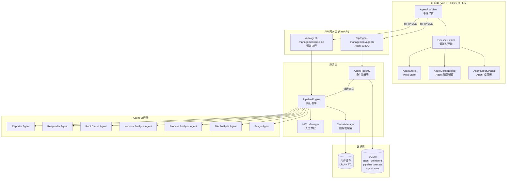
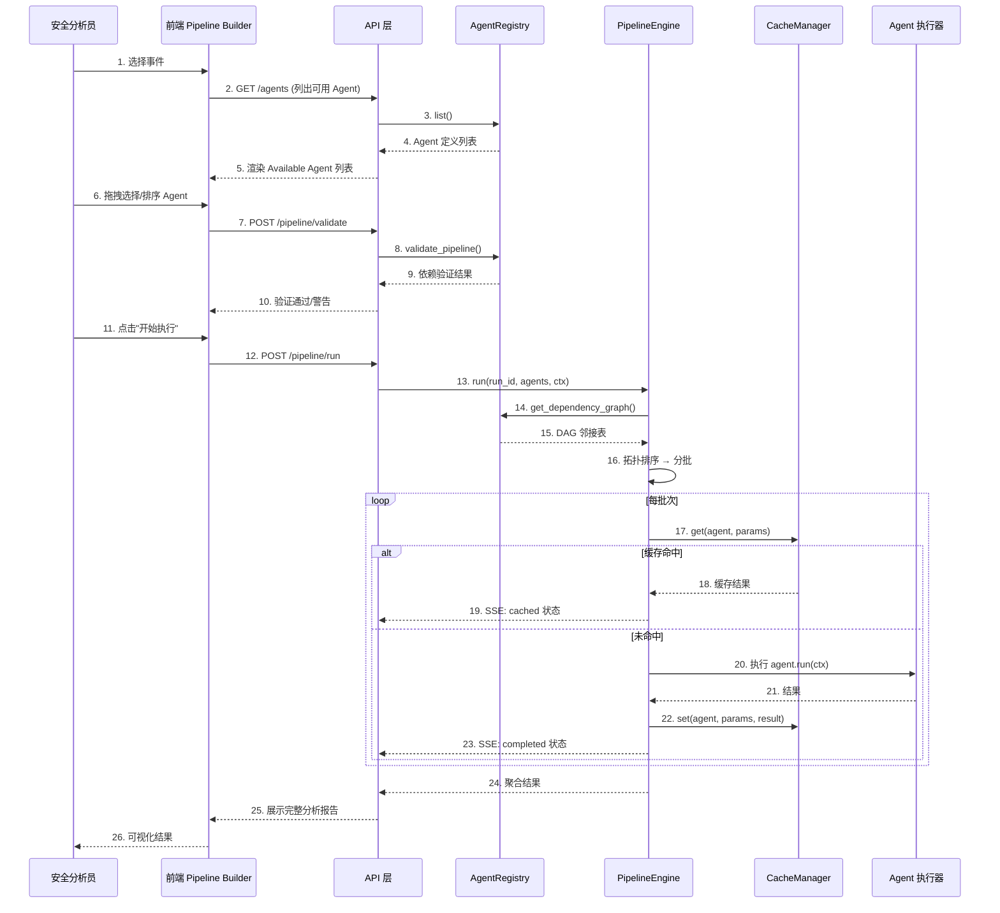
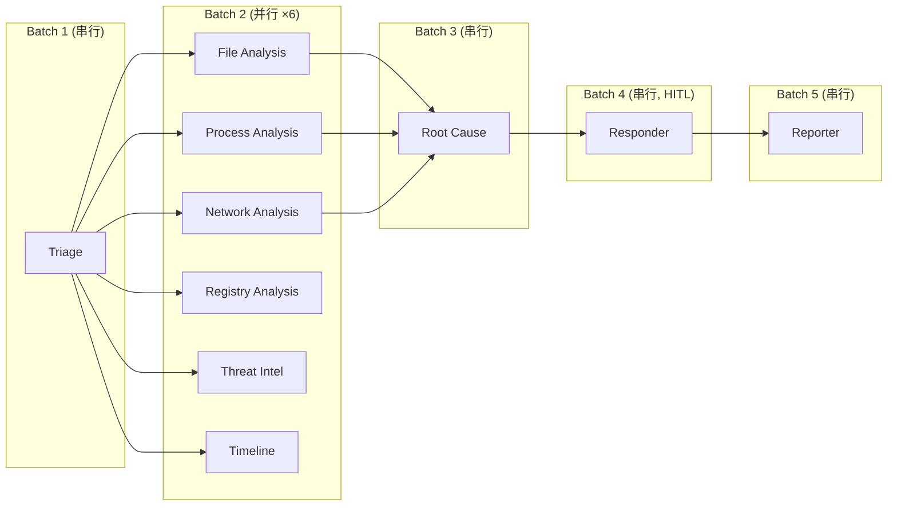
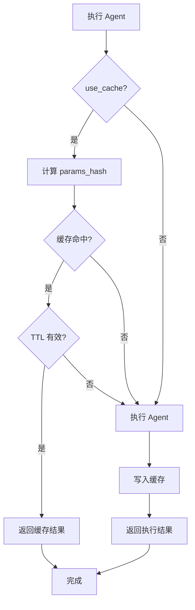
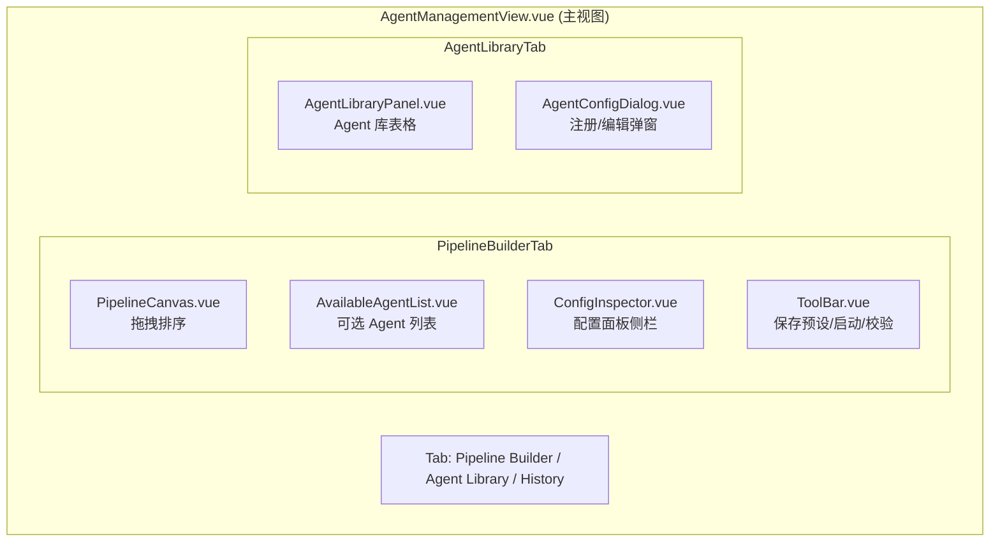
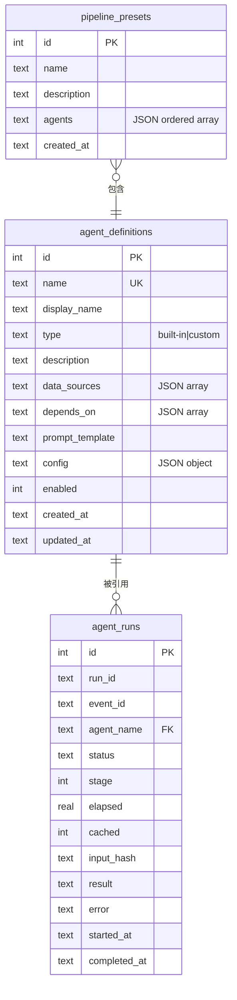
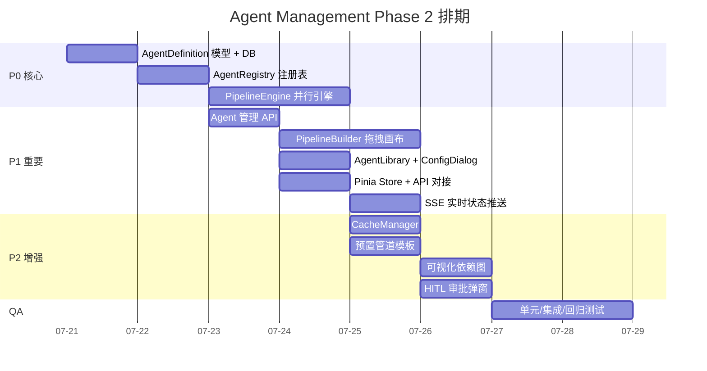

# 智能体管理模块 Phase 2 — 正式设计报告

> **项目**: IR 安全事件响应平台  
> **状态**: 正式设计评审稿 v1.0  
> **日期**: 2025-07-16  
> **版本**: 1.0

---

## 目录

1. [产品目标](#1-产品目标)
2. [用户故事](#2-用户故事)
3. [系统架构](#3-系统架构)
4. [模块详细设计](#4-模块详细设计)
5. [API 接口定义](#5-api-接口定义)
6. [预置 Agent 列表](#6-预置-agent-列表)
7. [数据库设计](#7-数据库设计)
8. [技术选型](#8-技术选型)
9. [工时估算与排期](#9-工时估算与排期)
10. [风险与应对](#10-风险与应对)

---

## 1. 产品目标

### 1.1 为什么需要 Agent 管理模块

当前 IR 平台的智能体编排是**硬编码的 4 阶段串行管道**：

```
Triage → Investigation → Responder → Reporter
```

这种架构在持续运营中暴露出以下痛点：

| 痛点 | 描述 | 影响 |
|------|------|------|
| **不可编排** | 所有事件必须走完固定 4 阶段，无法按需增删 | 简单事件流程冗余，复杂事件深度不足 |
| **串行执行** | 即使多个 Agent 间无依赖关系也必须排队执行 | Investigation 阶段平均耗时 40s+，总管道延迟约 85s |
| **无缓存复用** | 相同事件参数每次重新调用 LLM | 同事件回看或重跑时浪费 API 费用和等待时间 |
| **硬编码扩展** | 新增 Agent 需修改后端源代码并重新部署 | 安全团队无法自行注册自定义分析工具 |
| **无可视化反馈** | 执行中看不到中间步骤状态 | 分析员无法判断是"正在运行"还是"卡住" |

### 1.2 解决目标

1. **插件化注册** — 管理员可通过页面注册/启用/禁用 Agent，无需修改代码
2. **可视化编排** — 安全分析员通过拖拽自由组合 Agent 管道，依赖自动解析
3. **并行加速** — 无依赖 Agent 自动并行执行，管道总耗时降低 30%+
4. **缓存复用** — 相同参数结果缓存 1 小时，避免重复 LLM 调用

### 1.3 核心指标

| 指标 | 当前值 | 目标值 |
|------|--------|--------|
| 管道平均执行耗时 | ~85s | ≤55s（含缓存命中） |
| 新 Agent 接入周期 | 2-3 天（代码+部署） | ≤30 分钟（页面配置） |
| 重复事件重跑耗时 | ~85s（全量重跑） | ≤5s（缓存命中） |
| 管道可视化反馈 | 无 | 实时 SSE 状态推送 |

---

## 2. 用户故事

### 2.1 用户角色定义

| 角色 | 职责 |
|------|------|
| **安全分析员 (Analyst)** | 日常事件调查、选择 Agent 组合、查看分析结果 |
| **平台管理员 (Admin)** | 管理 Agent 注册/配置、维护系统稳定性 |

### 2.2 用户故事清单

#### US-01: 按需选择 Agent 组合

> **As a** 安全分析员  
> **I want** 针对不同事件类型选择不同的 Agent 组合（而非固定 4 阶段）  
> **So that** 简单事件快速响应，复杂事件深入调查

**验收标准**:

- 勾选/取消勾选后自动更新依赖图
- 不完整依赖关系前端给出警告
- 支持保存常用组合为预置模板

#### US-02: 注册/注销自定义 Agent

> **As a** 平台管理员  
> **I want** 通过页面表单注册新的分析 Agent（名称/数据源/依赖/prompt 模板）  
> **So that** 新增安全分析能力无需后端开发部署

**验收标准**:

- 注册表单包含 name / display_name / data_sources / depends_on / prompt_template
- name 唯一性校验 + SQL 注入防护
- 注册后立即在 Agent Library 列表中可见且可启用
- 注销时检查是否有管道引用该 Agent

#### US-03: 拖拽排序管道

> **As a** 安全分析员  
> **I want** 通过拖拽调整管道中 Agent 的执行顺序  
> **So that** 灵活控制分析流程的先后逻辑

**验收标准**:

- 从 Available 列表拖入 Pipeline 区域按插入位置添加
- Pipeline 内部拖拽实时重排序号
- 违反依赖关系时给出提示并阻止提交

#### US-04: 保存常用管道为预置模板

> **As a** 安全分析员  
> **I want** 将当前选中的 Agent 组合保存为带有名称描述的模板  
> **So that** 下次同类事件一键调取，减少重复配置

**验收标准**:

- 支持命名模板并添加描述
- 模板保存为 `pipeline_presets` 记录
- 从预置列表载入时自动勾选对应 Agent

#### US-05: 缓存复用避免重复等待

> **As a** 安全分析员  
> **I want** 多次查看同一事件时命中缓存结果  
> **So that** 不需要等待 Agent 重复执行，节省时间

**验收标准**:

- 缓存 key = `{agent_name}:{params_hash}`
- 缓存 TTL = 3600s，超时自动失效
- Agent 定义更新时主动清除相关缓存
- 用户可手动选择"强制刷新"绕过缓存

---

## 3. 系统架构

### 3.1 整体架构图



### 3.2 模块划分

| 模块 | 职责 | 关键类/文件 |
|------|------|------------|
| **AgentRegistry** | Agent 插件注册、注销、查询、依赖图校验 | `agent_registry.py`, `agent_definition.py` |
| **PipelineEngine** | DAG 解析、分批并行执行、HITL 暂停恢复 | `pipeline_engine.py` |
| **CacheManager** | 执行结果缓存与失效管理 | `cache_manager.py` |
| **Agent UI** | 前端拖拽画布、Agent 库面板、配置弹窗 | 4 个 Vue 组件 + Pinia Store |

### 3.3 数据流图



### 3.4 DAG 执行分组示例



---

## 4. 模块详细设计

### 4.1 AgentRegistry（插件注册表）

#### 4.1.1 功能定义

```python
class AgentRegistry:
    """Agent 插件注册表 — 应用级单例。

    职责：
    - 管理 Agent 定义的注册/注销/查询（DB 持久化 + 内存缓存）
    - 管道依赖图构建与环检测
    - 管道配置完整性校验
    """

    @classmethod
    def get_instance(cls) -> AgentRegistry: ...

    # ── CRUD ──
    def register(self, agent_def: AgentDefinition) -> AgentDefinition:
        """注册新 Agent（写入 DB + 更新缓存）。

        Raises:
            ValueError: name 已存在
        """

    def unregister(self, name: str) -> None:
        """注销 Agent。

        Raises:
            ValueError: 不存在
            ReferenceError: 被其他已注册 Agent 的 depends_on 引用
        """

    def update(self, name: str, updates: dict) -> AgentDefinition:
        """更新 Agent 定义（同步清除 CacheManager 中相关缓存）。"""

    def get(self, name: str) -> Optional[AgentDefinition]: ...

    def list(self, enabled_only: bool = True) -> list[AgentDefinition]:
        """按 display_name 排序返回全部。"""

    # ── 依赖校验 ──
    def get_dependency_graph(self, agent_names: list[str]) -> dict[str, list[str]]:
        """返回邻接表: {agent_name: [依赖的 agent 名称]}。"""

    def validate_pipeline(self, agent_names: list[str]) -> list[str]:
        """验证管道配置。

        校验项：
        1. 所有 agent_name 必须已注册且 enabled = 1
        2. 依赖完整性：所选集合中若 A 依赖 B，B 必须在集合中
        3. 环检测：DFS 检测依赖环

        Returns:
            list[str]: 警告/错误信息列表，空列表 = 完全合法
        """

    def detect_cycle(self, graph: dict[str, list[str]]) -> Optional[list[str]]:
        """DFS 环检测，返回环路径（如有）。"""
```

#### 4.1.2 环检测算法

```
输入: 邻接表 graph = {"A": ["B"], "B": ["C"], "C": ["A"]}

DFS 三色标记:
  WHITE=0 (未访问), GRAY=1 (正在访问), BLACK=2 (已结束)

  1. 从 A 开始: A → GRAY
  2. A 的邻居 B → GRAY
  3. B 的邻居 C → GRAY
  4. C 的邻居 A → 发现 A 是 GRAY → 检测到环!
  5. 返回环路径: [C → B → A → C]

  时间复杂度: O(V + E)
  空间复杂度: O(V)
```

#### 4.1.3 依赖完整性校验示例

```
用户选择: [file_analysis, root_cause, reporter]

校验过程:
  1. file_analysis.depends_on = ["triage"]
     → triage 不在所选集合中 → 警告: "file_analysis 依赖 triage，但 triage 未选择"
  2. root_cause.depends_on = ["file_analysis", "process_analysis", "network_analysis"]
     → process_analysis 不在所选集合中 → 警告
     → network_analysis 不在所选集合中 → 警告
  3. reporter.depends_on = ["responder"]
     → responder 不在所选集合中 → 警告

结论: 4 条警告，禁止执行
```

---

### 4.2 PipelineEngine（并行执行引擎）

#### 4.2.1 功能定义

```python
class PipelineEngine:
    """管道执行引擎：DAG 解析 → 分批并行 → 缓存命中 → HITL 暂停 → 结果聚合。

    生命周期:
        pending → running → (hitl_waiting)* → completed | failed | cancelled
    """

    def __init__(self, max_concurrent: int = 5):
        self._runs: dict[str, PipelineRun] = {}      # run_id → run 上下文
        self._max_concurrent = max_concurrent          # 最大并行数

    async def run(
        self,
        run_id: str,
        agent_names: list[str],
        ctx: EventContext,
        user: UserContext,
        use_cache: bool = True,
    ) -> PipelineRun:
        """执行管道主入口。

        步骤:
        1. 从 AgentRegistry 获取所有 agent_names 的 AgentDefinition
        2. 构建依赖 DAG（邻接表）
        3. 拓扑排序（Kahn 算法），按层级分组
        4. 逐批次 asyncio.gather 并行执行
        5. 批次间 await 等待前置批次完成为止
        6. 每步执行结果写入 ctx，供下游 Agent 读取
        7. 遇到 HITL 标记则暂停，等待用户审批后 resume()
        8. 整体耗时记录到 agent_runs 表
        """

    async def run_batch(
        self,
        agents: list[AgentWithParams],
        ctx: EventContext,
        user: UserContext,
        use_cache: bool,
    ) -> list[AgentResult]:
        """并行执行一批无依赖 Agent。

        实现:
          tasks = [self._run_single(a, ctx, user, use_cache) for a in agents]
          return await asyncio.gather(*tasks)
        """

    async def _run_single(
        self,
        agent: AgentWithParams,
        ctx: EventContext,
        user: UserContext,
        use_cache: bool,
    ) -> AgentResult:
        """执行单个 Agent（含缓存逻辑）。"""

    def cancel(self, run_id: str) -> bool:
        """取消正在执行的管道。"""

    async def resume(self, run_id: str, approved: bool) -> None:
        """恢复 HITL 暂停的管道（审批通过/拒绝）。"""

    def get_status(self, run_id: str) -> Optional[PipelineStatus]: ...

    def get_run(self, run_id: str) -> Optional[PipelineRun]: ...
```

#### 4.2.2 拓扑排序与分批算法

```
输入: agent_names = ["triage", "file_analysis", "network_analysis", "root_cause", "reporter"]
      依赖关系:
        triage          → []
        file_analysis   → ["triage"]
        network_analysis → ["triage"]
        root_cause      → ["file_analysis", "network_analysis"]
        reporter        → ["root_cause"]

Kahn 算法步骤:
  1. 计算入度:
        triage: 0, file_analysis: 1, network_analysis: 1, root_cause: 2, reporter: 1
  2. Batch 1: 入度=0 → [triage]
     执行 triage, 更新下游入度:
        file_analysis: 0, network_analysis: 0
  3. Batch 2: 入度=0 → [file_analysis, network_analysis]
     并行执行, 更新下游入度:
        root_cause: 0
  4. Batch 3: 入度=0 → [root_cause]
     执行 root_cause, 更新入度:
        reporter: 0
  5. Batch 4: 入度=0 → [reporter]

输出: [[triage], [file_analysis, network_analysis], [root_cause], [reporter]]
```

#### 4.2.3 HITL（人工介入）暂停机制

```python
class HITLManager:
    """人工审批管理器。"""

    def __init__(self):
        self._pending: dict[str, HITLRequest] = {}

    async def request_approval(
        self,
        run_id: str,
        agent_name: str,
        context: dict,
        user: UserContext,
    ) -> bool:
        """触发 HITL 暂停。

        1. 向用户推送 HITL 通知（SSE）
        2. 等待用户审批（异步 event.wait()）
        3. 超时（默认 300s）自动标记为 rejected
        """

    def approve(self, run_id: str, user: UserContext) -> None:
        """审批通过，释放等待。"""

    def reject(self, run_id: str, user: UserContext) -> None:
        """审批拒绝，设置标志。"""
```

---

### 4.3 CacheManager（缓存复用）

#### 4.3.1 功能定义

```python
class CacheManager:
    """执行结果缓存管理器。

    缓存策略:
        - key = f"{agent_name}:{hashlib.sha256(json.dumps(params, sort_keys=True).encode()).hexdigest()}"
        - TTL = 3600 秒
        - 存储: 应用级内存字典 (生产环境可替换为 Redis)
        - 最大条目: 1000 (LRU 淘汰)
    """

    def __init__(self, ttl: int = 3600, max_entries: int = 1000):
        self._cache: OrderedDict[str, CacheEntry] = OrderedDict()
        self._ttl = ttl
        self._max_entries = max_entries

    def get(self, agent_name: str, params: dict) -> Optional[AgentResult]:
        """查询缓存。

        流程:
          1. 计算 params_hash
          2. key = f"{agent_name}:{params_hash}"
          3. 查找缓存条目
          4. 检查 TTL (entry.created_at + ttl > now)
          5. 有效则返回 + 移动到 LRU 尾部
          6. 无效/不存在 → return None
        """

    def set(self, agent_name: str, params: dict, result: AgentResult) -> None:
        """写入缓存。

        流程:
          1. 计算 hash
          2. 若达到 max_entries → 淘汰 LRU 头部条目
          3. 写入缓存条目 (created_at=now)
        """

    def invalidate(self, agent_name: Optional[str] = None) -> int:
        """主动失效缓存。

        - agent_name=None → 清除全部缓存
        - agent_name=指定 → 清除该 Agent 所有缓存前缀匹配
        Returns: 失效条目数
        """

    def stats(self) -> dict:
        """返回缓存统计: hit_count, miss_count, size, hit_rate"""
```

#### 4.3.2 缓存命中流程图



---

### 4.4 前端 Pipeline Builder

#### 4.4.1 功能结构



#### 4.4.2 UI 布局草图

```
┌─────────────────────────────────────────────────────────────────────┐
│  Agent Orchestration Management                                     │
│  ┌──────────────┬──────────────────────────────────────────────────┐│
│  │ [Pipeline] [Agent Lib] [History]                                 ││
│  ├──────────────┴──────────────────────────────────────────────────┤│
│  │                                                                  ││
│  │  ┌──────────────┐    ┌──────────────┐    ┌──────────────────┐   ││
│  │  │ Available    │    │  Pipeline     │    │  Agent Config    │   ││
│  │  │ Agents       │    │  (拖拽区域)   │    │                  │   ││
│  │  │              │    │               │    │  点击 Agent 后   │   ││
│  │  │  ☐ Triage    │    │  1. Triage    │    │  显示配置详情    │   ││
│  │  │  ☐ File      │──→ │  2. File      │    │                  │   ││
│  │  │  ☐ Process   │    │  3. Process   │    │  名称: triage    │   ││
│  │  │  ☐ Network   │    │  4. Network   │    │  类型: built-in  │   ││
│  │  │  ☐ Registry  │    │               │    │  数据源: events  │   ││
│  │  │  ☐ Intel     │    │  [拖拽排序]    │    │  前置依赖: -     │   ││
│  │  │  ☐ Timeline  │    │               │    │                  │   ││
│  │  │  ☐ RootCause │    │               │    │  [编辑配置]      │   ││
│  │  │  ☐ Responder │    │               │    │                  │   ││
│  │  │  ☐ Reporter  │    │               │    │                  │   ││
│  │  └──────────────┘    └──────────────┘    └──────────────────┘   ││
│  │                                                                  ││
│  │  依赖状态: ✅ 完整  |  预计并行 batch: 3  |  预计节省: ~30s    ││
│  │  [▼ 预置模板]  [💾 保存]  [✅ 校验]  [▶ 开始执行]              ││
│  └──────────────────────────────────────────────────────────────────┘│
└─────────────────────────────────────────────────────────────────────┘
```

#### 4.4.3 交互行为

| 操作 | 触发 | 效果 |
|------|------|------|
| **勾选 Available** | `@change` | Agent 卡片从 Available 复制到 Pipeline 列表底部 |
| **取消勾选** | `@change` | 从 Pipeline 列表移除；若被其他 Agent 依赖 → 弹确认警告 |
| **Pipeline 内拖拽** | `dragstart/dragend` | 交换位置 → 实时重排序号 → 自动调用 validate |
| **点击 Agent 卡片** | `@click` | 右侧 ConfigInspector 更新为该 Agent 详情 |
| **拖拽越界指示** | `dragenter/dragleave` | 显示/隐藏插入位置占位线（虚线） |
| **Save Preset** | 按钮 | 弹命名对话框 → POST /pipeline/presets |
| **Load Preset** | 下拉选择 | 填充勾选状态 → 自动校验 |
| **Start Pipeline** | 按钮 | 校验通过 → POST /pipeline/run → 跳转执行详情页 |
| **Register Agent** | 按钮 | 弹 AgentConfigDialog（表单模式） |
| **Edit Agent** | Library 表格行操作 | 弹 AgentConfigDialog（编辑模式，预填值） |

#### 4.4.4 拖拽实现策略

```
技术选型: 浏览器原生 HTML5 Drag and Drop API

原因:
  - 零额外依赖，与现有 Element Plus 组件无冲突
  - Pipeline 列表为简单的 div 列表 + draggable 属性
  - 无需动画/复杂交互，原生 API 满足需求

实现:
  <div
    v-for="(agent, index) in pipelineAgents"
    :key="agent.name"
    draggable="true"
    @dragstart="onDragStart(index)"
    @dragover.prevent="onDragOver(index)"
    @dragenter="onDragEnter(index)"
    @dragleave="onDragLeave(index)"
    @drop="onDrop(index)"
    @dragend="onDragEnd"
    :class="{ 'drag-over': dragOverIndex === index }"
  >
    {{ agent.display_name }}
  </div>

Fallback: 移动端不可拖拽时，显示上下箭头按钮进行排序
```

#### 4.4.5 状态管理 (Pinia Store)

```javascript
// stores/agentManagement.js
export const useAgentManagementStore = defineStore('agentManagement', {
  state: () => ({
    // Agent 库
    agents: [],             // AgentDefinition[]
    loading: false,

    // 当前管道
    pipeline: [],            // { name, display_name, type, depends_on, enabled, cached? }
    selectedPreset: null,    // 当前选中的预置模板 ID

    // 依赖校验
    validationMessages: [],  // string[]
    isPipelineValid: false,

    // 执行状态
    currentRun: null,        // { run_id, status, progress }
    runHistory: [],          // PipelineRun[]
  }),

  getters: {
    availableAgents: (state) => state.agents.filter(a => a.enabled),
    pipelineDependencyInfo: (state) => {
      // 计算并行 batch 数/预计耗时
    },
  },

  actions: {
    async fetchAgents() { ... },
    async registerAgent(data) { ... },
    async updateAgent(name, data) { ... },
    async deleteAgent(name) { ... },
    addToPipeline(agentName) { ... },
    removeFromPipeline(agentName) { ... },
    reorderPipeline(fromIdx, toIdx) { ... },
    async validatePipeline() { ... },
    async startPipeline(eventId, useCache) { ... },
    async savePreset(name, description) { ... },
    async loadPreset(presetId) { ... },
  },
});
```

---

## 5. API 接口定义

### 5.1 Agent 管理 API

#### GET `/api/agent-management/agents` — 列出所有 Agent

```
Response 200:
{
  "agents": [
    {
      "name": "triage",
      "display_name": "分诊智能体",
      "type": "built-in",
      "description": "事件分诊分析",
      "data_sources": ["security_events"],
      "depends_on": [],
      "prompt_template": "",
      "config": {},
      "enabled": true,
      "created_at": "2025-07-16T10:00:00",
      "updated_at": "2025-07-16T10:00:00"
    }
  ]
}
```

#### POST `/api/agent-management/agents` — 注册新 Agent

```
Request Body (JSON):
{
  "name": "memory_analysis",           // required, 唯一, 字母数字下划线
  "display_name": "内存分析",          // required
  "type": "custom",                    // required, "built-in" | "custom"
  "description": "分析进程内存转储",   // optional
  "data_sources": ["process_events"],  // optional, JSON array
  "depends_on": ["triage"],            // optional, JSON array
  "prompt_template": "分析以下进程...", // optional
  "config": { "timeout": 30 }          // optional, JSON object
}

Response 201:
{
  "name": "memory_analysis",
  "display_name": "内存分析",
  "type": "custom",
  "enabled": true,
  "created_at": "2025-07-16T10:30:00"
}

Error 409:
{
  "detail": "Agent 'memory_analysis' already exists"
}
```

#### PUT `/api/agent-management/agents/{name}` — 更新 Agent

```
Request Body (JSON): 同 POST，所有字段可选
{
  "display_name": "内存分析 v2",
  "enabled": false
}

Response 200: { "name": "memory_analysis", "updated_at": "..." }
Error 404: { "detail": "Agent not found" }
```

#### DELETE `/api/agent-management/agents/{name}` — 注销 Agent

```
Response 200: { "detail": "Agent 'memory_analysis' deleted" }
Error 409: { "detail": "Agent is referenced by: [root_cause, responder]" }
```

#### GET `/api/agent-management/agents/deps` — 查询依赖图

```
Query Params: ?agents=triage,file_analysis,root_cause

Response 200:
{
  "graph": {
    "triage": [],
    "file_analysis": ["triage"],
    "root_cause": ["file_analysis"]
  },
  "topological_order": [["triage"], ["file_analysis"], ["root_cause"]]
}
```

### 5.2 管道执行 API

#### POST `/api/agent-management/pipeline/validate` — 验证管道

```
Request Body:
{
  "agents": ["triage", "file_analysis", "root_cause", "reporter"]
}

Response 200:
{
  "valid": false,
  "warnings": [
    "file_analysis 依赖 triage ✅",
    "root_cause 依赖 file_analysis ✅",
    "reporter 依赖 responder ❌ — responder 未在所选集合中"
  ],
  "batches": [["triage"], ["file_analysis"], ["root_cause"]],
  "estimated_savings": "3 个并行 batch, 预计节省 ~20s"
}
```

#### POST `/api/agent-management/pipeline/run` — 执行管道

```
Request Body:
{
  "event_id": "cm:file_hashes:95",
  "agents": ["triage", "file_analysis", "network_analysis", "root_cause", "reporter"],
  "use_cache": true
}

Response 202:
{
  "run_id": "run_custom_a1b2c3d4",
  "status": "running",
  "pipeline": [
    {"name": "triage", "stage": 1, "parallel": false, "status": "running"},
    {"name": "file_analysis", "stage": 2, "parallel": true, "status": "pending"},
    {"name": "network_analysis", "stage": 2, "parallel": true, "status": "pending"},
    {"name": "root_cause", "stage": 3, "parallel": false, "status": "pending"},
    {"name": "reporter", "stage": 4, "parallel": false, "status": "pending"}
  ]
}
```

#### GET `/api/agent-management/pipeline/run/{run_id}` — 查询执行状态

```
Response 200:
{
  "run_id": "run_custom_a1b2c3d4",
  "status": "running",           // running | completed | failed | cancelled | hitl_waiting
  "progress": {
    "total": 5,
    "completed": 2,
    "running": 1,
    "pending": 2
  },
  "pipeline": [ /* 同上，状态实时更新 */ ],
  "results": {
    "triage": { "status": "completed", "data": { ... }, "elapsed": 5.2, "cached": false },
    "file_analysis": { "status": "running", "elapsed": 3.1, "cached": false },
    "network_analysis": { "status": "pending" }
  },
  "started_at": "2025-07-16T10:30:00",
  "estimated_remaining": 25
}
```

#### POST `/api/agent-management/pipeline/run/{run_id}/cancel` — 取消执行

```
Response 200:
{
  "run_id": "run_custom_a1b2c3d4",
  "status": "cancelled"
}
```

#### POST `/api/agent-management/pipeline/run/{run_id}/resume` — 恢复执行（HITL 审批）

```
Request Body:
{
  "approved": true,
  "comment": "确认处置建议合理，继续执行"
}

Response 200:
{
  "run_id": "run_custom_a1b2c3d4",
  "status": "running"
}
```

### 5.3 预置管道 API

#### GET `/api/agent-management/pipeline/presets` — 列出预置模板

```
Response 200:
{
  "presets": [
    {
      "id": 1,
      "name": "快速分诊",
      "description": "仅分诊+报告，用于已知告警快速确认",
      "agents": ["triage", "reporter"],
      "created_at": "2025-07-16T10:00:00"
    },
    {
      "id": 2,
      "name": "全量调查",
      "description": "所有 Agent 全开，用于深度事件分析",
      "agents": ["triage", "file_analysis", "process_analysis", "network_analysis",
                 "registry_analysis", "threat_intel", "timeline", "root_cause",
                 "responder", "reporter"],
      "created_at": "2025-07-16T10:00:00"
    }
  ]
}
```

#### POST `/api/agent-management/pipeline/presets` — 保存预置模板

```
Request Body:
{
  "name": "应急响应组合",
  "description": "针对正在进行的攻击事件快速响应",
  "agents": ["triage", "file_analysis", "network_analysis", "root_cause", "responder", "reporter"]
}

Response 201:
{
  "id": 3,
  "name": "应急响应组合",
  "created_at": "2025-07-16T10:30:00"
}
```

#### DELETE `/api/agent-management/pipeline/presets/{id}` — 删除预置模板

```
Response 200: { "detail": "Preset '3' deleted" }
```

### 5.4 SSE 实时状态推送

```
Endpoint: GET /api/agent-management/pipeline/run/{run_id}/stream

Event Stream:
  event: stage_start
  data: {"name": "file_analysis", "stage": 2, "status": "running"}

  event: stage_complete
  data: {"name": "file_analysis", "stage": 2, "status": "completed", "elapsed": 4.2, "cached": false}

  event: stage_cached
  data: {"name": "network_analysis", "stage": 2, "status": "completed", "elapsed": 0.8, "cached": true}

  event: hitl_waiting
  data: {"name": "responder", "message": "等待审批处置建议", "timeout": 300}

  event: pipeline_complete
  data: {"run_id": "...", "status": "completed", "total_elapsed": 42.5}
```

---

## 6. 预置 Agent 列表

### 6.1 完整清单

| # | 名称 | 显示名 | 类型 | 数据源 | 前置依赖 | HITL |
|---|------|--------|------|--------|----------|------|
| 1 | `triage` | 分诊智能体 | built-in | `security_events` | — | — |
| 2 | `file_analysis` | 文件分析 | custom | `security_events.file_create` | `triage` | — |
| 3 | `process_analysis` | 进程分析 | custom | `process_events` | `triage` | — |
| 4 | `network_analysis` | 网络分析 | custom | `network_connection` | `triage` | — |
| 5 | `registry_analysis` | 注册表分析 | custom | `security_events.registry_modify` | `triage` | — |
| 6 | `threat_intel` | 威胁情报 | custom | `ioc_matches` | `triage` | — |
| 7 | `timeline` | 时间线重建 | custom | `process_events`, `security_events` | `triage` | — |
| 8 | `root_cause` | 根因定位 | custom | — | `file_analysis`, `process_analysis`, `network_analysis` | — |
| 9 | `responder` | 处置建议 | built-in | — | `root_cause` | ✅ |
| 10 | `reporter` | 报告输出 | built-in | — | `responder` | — |

### 6.2 依赖关系矩阵

```
           triage  file  proc  net  reg  intel  time  root  resp  report
triage       -     dep   dep   dep  dep   dep   dep    -     -      -
file         -      -     -    -    -     -     -     dep    -      -
proc         -      -     -    -    -     -     -     dep    -      -
net          -      -     -    -    -     -     -     dep    -      -
reg          -      -     -    -    -     -     -      -     -      -
intel        -      -     -    -    -     -     -      -     -      -
time         -      -     -    -    -     -     -      -     -      -
root         -      -     -    -    -     -     -      -     dep    -
resp         -      -     -    -    -     -     -      -     -      dep
report       -      -     -    -    -     -     -      -     -      -
```

### 6.3 预置模板推荐

| 模板名 | 包含 Agent | 适用场景 |
|--------|-----------|----------|
| **快速分诊** | triage, reporter | 已知告警快速确认，30s 出报告 |
| **标准调查** | triage, file, process, network, root_cause, responder, reporter | 常规事件全链路分析 |
| **深度取证** | triage, file, registry, timeline, root_cause, responder, reporter | 恶意软件/持久化攻击事件 |
| **网络威胁** | triage, network, threat_intel, root_cause, responder, reporter | 外部攻击/横向移动事件 |
| **全量调查** | 全部 10 个 Agent | 重大安全事件全面调查 |

---

## 7. 数据库设计

### 7.1 `agent_definitions` — Agent 定义表

```sql
CREATE TABLE IF NOT EXISTS agent_definitions (
    id              INTEGER PRIMARY KEY AUTOINCREMENT,
    name            TEXT    NOT NULL UNIQUE,           -- 唯一标识名（如 file_analysis）
    display_name    TEXT    NOT NULL,                  -- UI 显示名（如"文件分析智能体"）
    type            TEXT    NOT NULL DEFAULT 'custom', -- 类型: 'built-in' | 'custom'
    description     TEXT    DEFAULT '',                -- 功能描述
    data_sources    TEXT    DEFAULT '[]',              -- JSON 数组: 依赖的数据源表名列表
    depends_on      TEXT    DEFAULT '[]',              -- JSON 数组: 前置 Agent 名称列表
    prompt_template TEXT    DEFAULT '',                -- LLM 提示词模板（custom 类型必填）
    config          TEXT    DEFAULT '{}',              -- JSON 对象: 扩展配置参数
    enabled         INTEGER NOT NULL DEFAULT 1,        -- 启用状态: 1=启用, 0=禁用
    created_at      TEXT    DEFAULT (datetime('now')), -- 创建时间 ISO 8601
    updated_at      TEXT    DEFAULT (datetime('now'))  -- 更新时间 ISO 8601
);

CREATE INDEX idx_agent_definitions_enabled ON agent_definitions(enabled);
CREATE INDEX idx_agent_definitions_type ON agent_definitions(type);
```

**字段说明**

| 字段 | 类型 | 说明 | 示例 |
|------|------|------|------|
| `id` | INTEGER | 自增主键 | 1 |
| `name` | TEXT | 唯一标识，字母数字下划线 | `file_analysis` |
| `display_name` | TEXT | 前端展示名 | `文件分析智能体` |
| `type` | TEXT | `built-in` 系统内置不可删除；`custom` 用户自定义可删除 | `custom` |
| `data_sources` | TEXT | JSON 序列化的数据源列表 | `["security_events.file_create"]` |
| `depends_on` | TEXT | JSON 序列化的前置 Agent 列表 | `["triage"]` |
| `prompt_template` | TEXT | LLM 调用的提示词模板 | `分析以下文件创建事件...` |
| `config` | TEXT | JSON 扩展配置 | `{"timeout": 30, "max_retries": 3}` |
| `enabled` | INTEGER | 0=禁用（不可用于管道构建）, 1=启用 | 1 |

### 7.2 `pipeline_presets` — 预置管道模板表

```sql
CREATE TABLE IF NOT EXISTS pipeline_presets (
    id          INTEGER PRIMARY KEY AUTOINCREMENT,
    name        TEXT    NOT NULL,                     -- 模板名称
    description TEXT    DEFAULT '',                   -- 模板描述
    agents      TEXT    NOT NULL,                     -- JSON 数组: 有序 Agent 名称列表
    created_at  TEXT    DEFAULT (datetime('now'))     -- 创建时间
);

CREATE INDEX idx_pipeline_presets_name ON pipeline_presets(name);
```

**字段说明**

| 字段 | 类型 | 说明 | 示例 |
|------|------|------|------|
| `id` | INTEGER | 自增主键 | 1 |
| `name` | TEXT | 模板名称 | `标准调查` |
| `description` | TEXT | 模板用途描述 | `常规事件全链路分析` |
| `agents` | TEXT | JSON 有序数组 | `["triage","file_analysis","reporter"]` |
| `created_at` | TEXT | 创建时间 | `2025-07-16 10:00:00` |

### 7.3 `agent_runs` — Agent 执行记录表（新增）

```sql
CREATE TABLE IF NOT EXISTS agent_runs (
    id          INTEGER PRIMARY KEY AUTOINCREMENT,
    run_id      TEXT    NOT NULL,                     -- 管道执行唯一 ID（UUID）
    event_id    TEXT    NOT NULL,                     -- 关联事件 ID
    agent_name  TEXT    NOT NULL,                     -- 执行的 Agent 名称
    status      TEXT    NOT NULL DEFAULT 'pending',   -- pending | running | completed | failed | skipped
    stage       INTEGER DEFAULT 0,                    -- 执行批次序号
    elapsed     REAL    DEFAULT 0,                    -- 耗时（秒）
    cached      INTEGER DEFAULT 0,                    -- 是否缓存命中
    input_hash  TEXT    DEFAULT '',                   -- 输入参数 hash
    result      TEXT    DEFAULT '',                   -- JSON: 执行结果摘要
    error       TEXT    DEFAULT '',                   -- 错误信息
    started_at  TEXT    DEFAULT (datetime('now')),
    completed_at TEXT   DEFAULT ''
);

CREATE INDEX idx_agent_runs_run_id ON agent_runs(run_id);
CREATE INDEX idx_agent_runs_event_id ON agent_runs(event_id);
CREATE INDEX idx_agent_runs_status ON agent_runs(status);
```

**字段说明**

| 字段 | 类型 | 说明 | 示例 |
|------|------|------|------|
| `run_id` | TEXT | 管道级运行 ID，同一管道执行共享 | `run_custom_a1b2c3d4` |
| `event_id` | TEXT | 被分析的事件 ID | `cm:file_hashes:95` |
| `agent_name` | TEXT | 执行的 Agent | `file_analysis` |
| `status` | TEXT | 执行状态 | `completed` |
| `stage` | INTEGER | 批次号 | 2 |
| `elapsed` | REAL | 执行耗时秒数 | 4.25 |
| `cached` | INTEGER | 是否命中缓存 | 1 |
| `input_hash` | TEXT | 输入参数 SHA256 | `a1b2c3d4...` |
| `result` | TEXT | 结果摘要 | `{"findings": 3}` |
| `error` | TEXT | 错误详情 | `LLM API timeout` |

### 7.4 ER 关系图



---

## 8. 技术选型

### 8.1 技术栈清单

| 层次 | 技术 | 版本 | 说明 |
|------|------|------|------|
| **后端框架** | FastAPI | 0.104+ | 已有，提供异步 HTTP + SSE 支持 |
| **数据库** | SQLite | 3.x | 已有，嵌入式计算 |
| **ORM** | SQLAlchemy | 2.0+ | 已有，核心模型扩展 |
| **异步执行** | asyncio | Python 3.11+ | 原生并行控制 |
| **缓存** | 内存 dict + LRU | — | 内建实现，无需额外依赖 |
| **前端框架** | Vue 3 | 3.4+ | 已有 + Composition API |
| **UI 组件库** | Element Plus | 2.5+ | 已有（表格/弹窗/表单） |
| **状态管理** | Pinia | 2.1+ | 已有 |
| **拖拽** | HTML5 Drag and Drop API | 原生 | **不引入新依赖** |
| **实时推送** | Server-Sent Events (SSE) | — | FastAPI StreamingResponse |
| **哈希** | hashlib.sha256 | Python 标准库 | 缓存 key 生成 |

### 8.2 架构设计原则

```
1. ✅ 零新增外部依赖 — 所有功能均基于现有技术栈或 Python/Vue 原生 API
2. ✅ Agent 执行进程内隔离 — 每个 Agent run() 是独立协程，共享 ctx 上下文
3. ✅ 缓存层可替换 — CacheManager 实现 CacheInterface，未来可替换为 Redis
4. ✅ DAG 执行可观测 — 每个 Agent 执行状态通过 SSE 实时推送到前端
5. ✅ 降级友好 — 缓存不可用不影响主流程，仅降级为无缓存模式
```

### 8.3 DAG 解析实现策略

```
无需引入 networkx 等第三方库，自实现：

1. Kahn 拓扑排序: 队列 + 入度统计 → 分层分批
    - 时间复杂度: O(V + E)
    - 空间复杂度: O(V)

2. DFS 环检测: 三色标记法 (WHITE/GRAY/BLACK)
    - 时间复杂度: O(V + E)
    - 空间复杂度: O(V)

3. 异步分批执行: itertools.groupby + asyncio.gather
    - 每批次限制 max_concurrent=5 防止过度并发
```

### 8.4 缓存实现策略

```python
class CacheEntry:
    key: str              # agent_name:sha256_hex
    result: AgentResult   # 序列化执行结果
    created_at: float     # time.time()
    access_count: int     # 访问计数

class LRUCache:
    """基于 OrderedDict 的 LRU 缓存，线程安全（需加锁）。"""
    max_entries: int = 1000
    ttl: int = 3600  # 秒

    # 写入时: 若满则 popitem(last=False) 淘汰最久未访问条目
    # 读取时: move_to_end(key) 更新访问顺序
    # 淘汰时: 优先淘汰过期条目，其次 LRU 条目
```

---

## 9. 工时估算与排期

### 9.1 优先级定义

| 优先级 | 定义 | 影响 |
|--------|------|------|
| **P0** | 核心功能，缺失则无法完成迭代目标 | MVP 交付 |
| **P1** | 重要功能，缺失影响用户体验但可绕行 | 增强体验 |
| **P2** | 锦上添花，可在后续迭代补齐 | 优化迭代 |

### 9.2 详细排期

| 优先级 | 任务 | 后端(h) | 前端(h) | 预估工时 | 依赖 |
|--------|------|---------|---------|---------|------|
| **P0** | AgentDefinition 数据模型 + DB 迁移 | 4h | — | **0.5 天** | — |
| **P0** | AgentRegistry 注册表（CRUD + 依赖图解析 + 环检测） | 8h | — | **1 天** | 上一步 |
| **P0** | PipelineEngine 并行执行引擎（DAG 拓扑排序 + 分批并行） | 12h | — | **1.5 天** | 上一步 |
| **P1** | Agent 管理 API（CRUD + validate + presets 端点） | 8h | — | **1 天** | P0 后端 |
| **P1** | 前端 PipelineBuilder 拖拽画布 | — | 12h | **1.5 天** | API 就绪 |
| **P1** | 前端 AgentLibraryPanel + ConfigDialog | — | 8h | **1 天** | API 就绪 |
| **P1** | 前端 Pinia Store + API 对接 | — | 6h | **0.75 天** | API 就绪 |
| **P1** | SSE 实时状态推送 + 前端状态展示 | 6h | 4h | **1.25 天** | PipelineEngine |
| **P2** | CacheManager 缓存管理 | 4h | — | **0.5 天** | PipelineEngine |
| **P2** | 预置管道模板保存/载入 | 2h | 3h | **0.625 天** | API 就绪 |
| **P2** | 可视化依赖图增强（Mermaid 渲染 DAG） | — | 6h | **0.75 天** | PipelineBuilder |
| **P2** | HITL 审批弹窗 + 暂停恢复 | 3h | 4h | **0.875 天** | PipelineEngine |
| **QA** | 单元测试 + 集成测试 + 回归测试 | 8h | 4h | **1.5 天** | 全部完成 |
| | **合计** | **~55h** | **~47h** | **~12.75 天** | |

### 9.3 甘特图



### 9.4 关键里程碑

| 里程碑 | 时间 | 交付物 |
|--------|------|--------|
| M1: 后端核心就绪 | Day 3 EOD | AgentRegistry + PipelineEngine 可独立运行 |
| M2: API 可调用 | Day 4 EOD | 所有 API 端点可用，Postman 测试通过 |
| M3: 前端 MVP | Day 6 EOD | 可拖拽选择 Agent 并启动执行 |
| M4: 全功能交付 | Day 10 EOD | 缓存 + HITL + 预置模板全部完成 |
| M5: QA 通过 | Day 12 EOD | 全量回归测试通过，可上线 |

---

## 10. 风险与应对

| 风险 | 等级 | 概率 | 影响 | 应对策略 |
|------|------|------|------|---------|
| Agent 依赖环导致死循环 | **高** | 中 | 管道阻塞 | DFS 环检测 + 前端实时验证 + API 层二次校验 |
| 并发过高导致 SQLite 锁冲突 | **中** | 中 | 写入失败 | max_concurrent=5 限制 + 写入操作走队列 |
| 缓存 key 碰撞 | **低** | 低 | 返回错误缓存 | SHA256 全字段 hash + 相同 params 才命中 |
| 自定义 Agent prompt 模板注入 | **中** | 低 | 安全风险 | 限制模板字段长度 + 变量白名单 + 输入转义 |
| 前端拖拽兼容性 | **低** | 低 | 移动端不可用 | 添加上下箭头按钮作为拖拽 fallback |
| 长管道执行中断（浏览器关闭） | **低** | 中 | 结果丢失 | 后端持续写入 agent_runs，支持结果查询 |
| HITL 超时未响应 | **低** | 中 | 管道卡住 | 默认 300s 超时自动拒绝 + 通知提醒 |
| 大量 Agent 注册导致 UI 拥挤 | **低** | 低 | 体验下降 | 按类型分组 + 搜索过滤 + 分页 |

---

## 附录

### A. 文件清单

```
# 后端
backend/app/models/agent_definition.py      # SQLAlchemy 模型 (NEW)
backend/app/services/agents/__init__.py      # 模块入口 (NEW)
backend/app/services/agents/agent_registry.py # 注册表 CRUD + 依赖校验 (NEW)
backend/app/services/agents/pipeline_engine.py # DAG 解析 + 分批执行 (NEW)
backend/app/services/agents/cache_manager.py   # 缓存管理 (NEW)
backend/app/services/agents/hitl_manager.py    # 人工审批管理 (NEW)
backend/app/api/agent_management.py            # API 路由 (NEW)
backend/app/services/agents/preset_data.py     # 预置 Agent 种子数据 (NEW)

# 前端
frontend/src/views/AgentManagementView.vue              # 主视图 (NEW)
frontend/src/components/agents/AgentPipelineCanvas.vue   # 拖拽画布 (NEW)
frontend/src/components/agents/AgentLibraryPanel.vue     # Agent 库表格 (NEW)
frontend/src/components/agents/AgentConfigDialog.vue     # 配置弹窗 (NEW)
frontend/src/components/agents/AgentRunMonitor.vue       # 执行监控面板 (NEW)
frontend/src/components/agents/HITLDialog.vue            # 审批弹窗 (NEW)
frontend/src/stores/agentManagement.js                   # Pinia Store (NEW)
frontend/src/views/AgentRunView.vue                      # 修改: 添加 Agent 选择入口 (MODIFY)
frontend/src/router/index.js                             # 修改: 注册新路由 (MODIFY)
```

### B. 后端 API 路由注册示例

```python
# backend/app/api/agent_management.py
from fastapi import APIRouter, HTTPException
from pydantic import BaseModel

router = APIRouter(prefix="/api/agent-management", tags=["agent-management"])

class AgentCreate(BaseModel):
    name: str
    display_name: str
    type: str = "custom"
    description: str = ""
    data_sources: list[str] = []
    depends_on: list[str] = []
    prompt_template: str = ""
    config: dict = {}

class PipelineRunRequest(BaseModel):
    event_id: str
    agents: list[str]
    use_cache: bool = True

@router.get("/agents")
async def list_agents(enabled_only: bool = True):
    registry = AgentRegistry.get_instance()
    return {"agents": registry.list(enabled_only=enabled_only)}

@router.post("/agents", status_code=201)
async def create_agent(data: AgentCreate):
    registry = AgentRegistry.get_instance()
    try:
        agent = registry.register(AgentDefinition(**data.model_dump()))
        return agent
    except ValueError as e:
        raise HTTPException(409, detail=str(e))

@router.post("/pipeline/run", status_code=202)
async def run_pipeline(data: PipelineRunRequest):
    engine = PipelineEngine()
    run_id = f"run_custom_{uuid4().hex[:8]}"
    # 启动后台任务
    asyncio.create_task(engine.run(run_id, data.agents, data.event_id, data.use_cache))
    return {"run_id": run_id, "status": "running"}
```

### C. JSON Schema 汇总

所有 JSON 字段在 SQLite 中以 TEXT 存储，序列化规则：

| 字段 | 序列化 | 反序列化 | 示例 |
|------|--------|---------|------|
| `data_sources` | `json.dumps(list)` | `json.loads(str)` | `["security_events"]` |
| `depends_on` | `json.dumps(list)` | `json.loads(str)` | `["triage"]` |
| `config` | `json.dumps(dict)` | `json.loads(str)` | `{"timeout": 30}` |
| `agents` (presets) | `json.dumps(list)` | `json.loads(str)` | `["triage","reporter"]` |

### D. 术语表

| 术语 | 说明 |
|------|------|
| **Agent** | 智能体，执行单一安全分析任务的 LLM 驱动单元 |
| **Pipeline** | 管道，有序的 Agent 组合，构成完整事件分析流程 |
| **DAG** | 有向无环图，描述 Agent 间的依赖关系 |
| **拓扑排序** | 将 DAG 节点按依赖关系排序为线性序列 |
| **HITL** | Human-In-The-Loop，人工介入审批节点 |
| **SSE** | Server-Sent Events，服务端向客户端推送实时事件 |
| **LRU** | Least Recently Used，缓存淘汰策略 |
| **Batch** | 无依赖可并行执行的 Agent 分组 |
| **Preset** | 预置管道模板，保存的 Agent 组合快照 |
