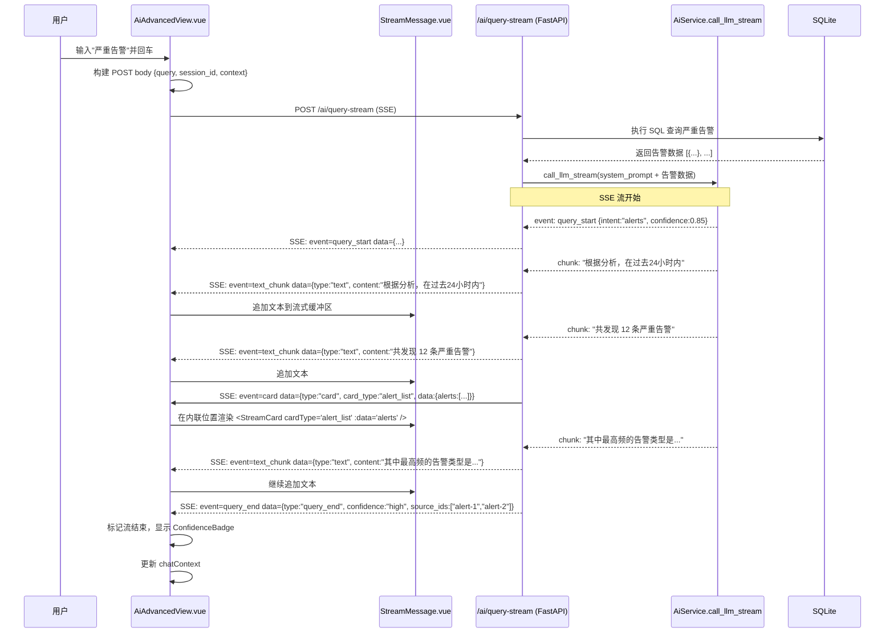
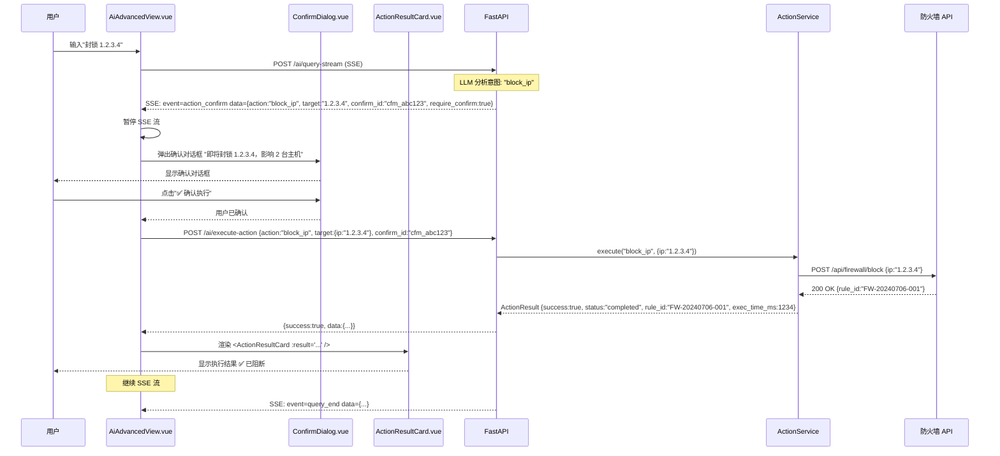
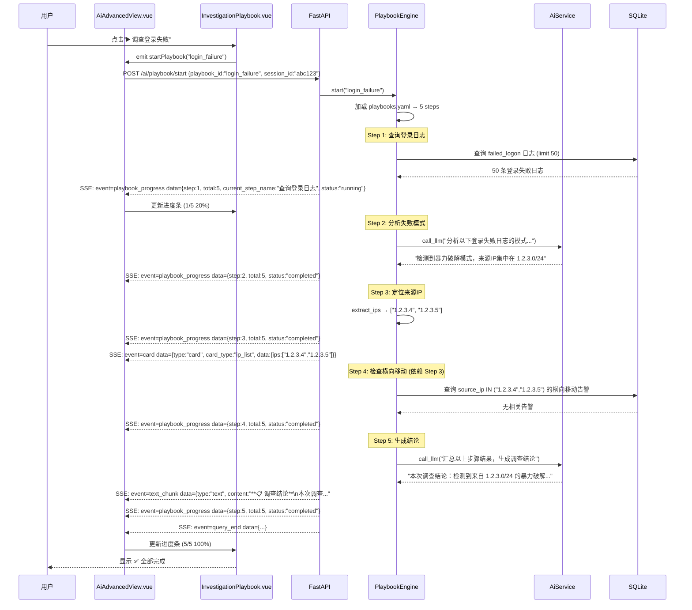
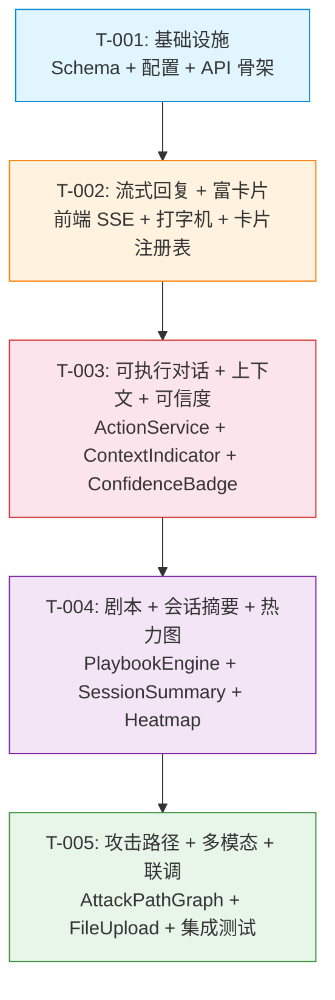

# AI 实验室 v2.0 — 系统架构设计与任务分解

> 文档版本：v1.0 | 编写：Bob (Architect) | 基于 PRD: `docs/ai-lab-v2-prd.md`

---

## 一、实现方案 + 框架选型

### 1.1 整体架构分层

```
┌─────────────────────────────────────────────────────────────┐
│                    前端视图层 (Vue 3)                        │
│  AiAdvancedView (重构)  │  StreamMessage  │  RichCard 注册表 │
│  ContextIndicator       │  ActionResultCard│ AttackPathGraph │
│  InvestigationPlaybook  │  HeatmapTimeline │  ConfidenceBadge │
├─────────────────────────────────────────────────────────────┤
│                     API 网关层 (FastAPI)                      │
│  POST /ai/query-stream (SSE)  │  POST /ai/execute-action     │
│  POST /ai/playbook/*          │  POST /ai/session-summary    │
│  POST /ai/parse-file          │  GET  /ai/context-hosts      │
├─────────────────────────────────────────────────────────────┤
│                     服务层 (Service)                         │
│  AiService (流式LLM调用)      │  ActionService (操作执行器)   │
│  PlaybookEngine (剧本引擎)    │  FileParser (文件解析)        │
│  ConfidenceService (可信度)   │  AttackPathBuilder (路径生成)│
├─────────────────────────────────────────────────────────────┤
│                     数据层 (SQLite + localStorage)            │
│  sessions (localStorage)      │  playbooks (YAML配置)        │
│  action_map (内存注册表)      │  alert/log/host (DB)         │
└─────────────────────────────────────────────────────────────┘
```

### 1.2 流式方案：SSE（选择理由）

| 方案 | 对比 | 结论 |
|------|------|------|
| **SSE** | 服务端→客户端单向流，浏览器原生 `EventSource` 支持，也可用 `fetch` + `ReadableStream` 兜底 | **推荐** ✅ |
| WebSocket | 全双工，适用于双向高频通信（如游戏、实时协作） | 当前场景仅需服务端推送，WS 过重 |

选择 SSE 而非 WebSocket 的原因：
1. 指挥台场景是 **单向流**（服务端→客户端），无需客户端→服务端的流式通道
2. 后端 `httpx` 已支持 `AsyncClient.stream()`，与 SSE 天然契合
3. 前端 `fetch` + `ReadableStream` 处理 SSE 可完美实现打字机效果 + 富卡片穿插
4. 无需额外引入 websocket 库，零新增依赖

### 1.3 富卡片方案：预定义组件注册表

```
<StreamCard cardType="alert_list"   :data="..." />
<StreamCard cardType="stats_chart"  :data="..." />
<StreamCard cardType="attack_path"  :data="..." />
<StreamCard cardType="action_result" :data="..." />
```

**策略**：预定义组件注册表（`cardRegistry`）
- 每种 `cardType` 对应一个 Vue 组件
- 新增卡片类型只需注册新组件，无需改消息流逻辑
- 渲染出错时降级为纯文本 JSON 显示

### 1.4 可执行对话：Action 调度器设计

```
用户输入 → LLM 意图识别 → ActionIntent(action, params, confirm_required)
  ├─ 不需确认 → ActionService.execute(action, params) → ActionResult
  └─ 需确认 → SSE event: action_confirm → 用户点确认 → ActionService.execute(action, params, confirm_id)
```

- Action 映射表存放在后端 `app/config/action_map.py`（内存注册表）
- 高危操作（封锁/隔离）标记 `confirm_required: true`
- 执行结果通过 SSE `action_result` 事件实时返回前端

### 1.5 攻击路径图：SVG

- 节点数通常 ≤ 10，SVG 交互性好（可点击、hover、嵌入消息流）
- 无需引入 D3.js 或 Canvas，纯 Vue template + SVG 元素渲染
- 节点点击跳转主机详情页，边标注 MITRE ATT&CK 编号 + 时间

### 1.6 多模态：HTML5 Drag & Drop + base64

- 输入区使用原生 HTML5 Drag & Drop API
- 文件读取为 base64（小文件 < 10MB），随查询一起发送
- `.evtx` 解析在后端用 `python-evtx`（项目已有 `log_importer.py` 可复用）
- 无需新增前端库

---

## 二、文件列表及相对路径

### 前端（12 个文件）

| # | 文件路径 | 操作 | 说明 |
|---|---------|------|------|
| 1 | `frontend/src/views/AiAdvancedView.vue` | **MODIFY** | 重构 `sendQuery` → SSE 流式；新增 `chatMsgs` 混合内容类型；新增右侧面板区域（剧本+热力图）；输入区新增拖拽上传；集成所有新组件 |
| 2 | `frontend/src/components/StreamMessage.vue` | **NEW** | 流式消息渲染：打字机效果逐字输出 text_chunk + 内联渲染富卡片 |
| 3 | `frontend/src/components/ActionResultCard.vue` | **NEW** | 操作结果状态卡片（成功/失败/待确认） |
| 4 | `frontend/src/components/ContextIndicator.vue` | **NEW** | 上下文指示器组件（显示当前主机、切换、固定、清空） |
| 5 | `frontend/src/components/InvestigationPlaybook.vue` | **NEW** | 右侧面板调查剧本组件（剧本列表 + 进度 + 暂停/跳过） |
| 6 | `frontend/src/components/HeatmapTimeline.vue` | **NEW** | 会话侧边栏热力图+时间轴（CSS Grid 渲染） |
| 7 | `frontend/src/components/AttackPathGraph.vue` | **NEW** | 攻击路径 SVG 图组件 |
| 8 | `frontend/src/components/ConfidenceBadge.vue` | **NEW** | 可信度标签组件（🟢🟡🔴） |
| 9 | `frontend/src/components/SessionSummaryCard.vue` | **NEW** | 会话摘要卡片组件（含 5 字段） |
| 10 | `frontend/src/components/FileUploadZone.vue` | **NEW** | 输入区拖拽上传组件 |
| 11 | `frontend/src/components/ConfirmDialog.vue` | **NEW** | 高危操作二次确认弹窗 |
| 12 | `frontend/src/api/ai_advanced.js` | **MODIFY** | 新增 `aiQueryStream()`, `executeAction()`, `startPlaybook()`, `getPlaybookStatus()`, `controlPlaybook()`, `parseFile()`, `getSessionSummary()`, `getContextHosts()` |

### 后端（8 个文件）

| # | 文件路径 | 操作 | 说明 |
|---|---------|------|------|
| 13 | `backend/app/api/ai_advanced.py` | **MODIFY** | 新增 SSE 流式端点 `/ai/query-stream`；新增 Action API `/ai/execute-action`；新增剧本 API `/ai/playbook/*`；新增 `/ai/session-summary`；新增 `/ai/parse-file`；新增 `/ai/context-hosts` |
| 14 | `backend/app/schemas/ai_advanced.py` | **NEW** | StreamingEvent, ActionIntent, ActionResult, PlaybookStatus 等 Pydantic schema |
| 15 | `backend/app/services/action_service.py` | **NEW** | Action 执行器：`block_ip`, `isolate_host`, `export_report`, `mark_false_positive`, `add_whitelist`, `create_case`, `add_note` |
| 16 | `backend/app/services/playbook_engine.py` | **NEW** | 剧本执行引擎：按步骤执行，每步调用 LLM/API，支持暂停/继续/跳过 |
| 17 | `backend/app/services/file_parser.py` | **NEW** | 文件解析服务：.evtx / .csv / .json / .png / .jpg → 结构化数据 |
| 18 | `backend/app/services/confidence_service.py` | **NEW** | 可信度评估服务：基于数据源数量/推理链长度/证据充分性判断高/中/低 |
| 19 | `backend/app/config/playbooks.yaml` | **NEW** | 3 个预置剧本的 YAML 配置文件（登录失败/异常进程/横向移动） |
| 20 | `backend/app/config/action_map.py` | **NEW** | Action 映射表注册表：用户意图 → Action 名称 → 后端 API → 高危标记 |

---

## 三、数据结构和接口

### 3.1 Class Diagram

```mermaid
classDiagram
    %% ===== SSE Event Model =====
    class StreamingEvent {
        +str event_name
        +str session_id
        +str intent
        +float confidence
    }
    class TextChunkEvent {
        +str type: "text"
        +str content
    }
    class CardEvent {
        +str type: "card"
        +str card_type
        +dict data
        +list~str~ action_hints
    }
    class ActionConfirmEvent {
        +str type: "action_confirm"
        +str action
        +str target
        +str reason
        +str confirm_id
        +bool require_confirm
    }
    class ActionResultEvent {
        +str type: "action_result"
        +str action
        +str status
        +dict result
        +int exec_time_ms
        +str error
    }
    class PlaybookProgressEvent {
        +str type: "playbook_progress"
        +int step
        +int total
        +str current_step_name
        +str status
    }
    class QueryEndEvent {
        +str type: "query_end"
        +str session_id
        +dict usage
        +str confidence
        +list~str~ source_ids
        +dict attack_path
    }

    %% ===== Action Model =====
    class ActionIntent {
        +str action
        +dict target
        +str reason
        +bool confirm_required
        +str confirm_id
    }
    class ActionResult {
        +bool success
        +str action
        +str status
        +dict result
        +str error
        +str rule_id
        +int exec_time_ms
        +list~str~ affected_hosts
    }
    class ActionMapEntry {
        +str user_intent
        +str action_name
        +str backend_api
        +bool high_risk
        +str confirm_text
        +callable executor
    }

    %% ===== Playbook Model =====
    class PlaybookDef {
        +str id
        +str name
        +str description
        +list~PlaybookStep~ steps
    }
    class PlaybookStep {
        +str name
        +str action
        +dict params
        +str prompt
        +list~str~ depends_on
    }
    class PlaybookStatus {
        +str playbook_id
        +str playbook_name
        +str status
        +int current_step
        +int total_steps
        +float progress_pct
        +list~StepResult~ step_results
    }
    class StepResult {
        +str step_name
        +str status
        +str output
        +str error
        +float duration_ms
    }

    %% ===== Context Model =====
    class ContextState {
        +int host_id
        +str host_name
        +str host_ip
        +int alert_count
        +int risk_score
        +str last_active
        +bool pinned
    }
    class HostOption {
        +int id
        +str hostname
        +str ip_address
        +str status
        +int alert_count
    }

    %% ===== Attack Path Model =====
    class AttackPathNode {
        +str id
        +str label
        +str type
        +str ip
        +str severity
        +int risk_score
        +str detail_url
    }
    class AttackPathEdge {
        +str source
        +str target
        +str technique_id
        +str technique_name
        +str time
        +str confidence
        +list~str~ evidence_ids
    }
    class AttackPathData {
        +list~AttackPathNode~ nodes
        +list~AttackPathEdge~ edges
        +str summary
        +int total_alerts
        +int total_hosts
    }

    %% ===== Session Summary Model =====
    class SessionSummary {
        +str session_id
        +str purpose
        +dict coverage
        +list~str~ key_findings
        +list~dict~ actions_taken
        +str status
        +str generated_at
    }

    %% ===== File Upload Model =====
    class FileUpload {
        +str name
        +str type
        +str content_base64
        +int size_bytes
    }
    class FileParseResult {
        +bool success
        +str file_type
        +str parsed_text
        +str intent
        +str error
    }

    %% ===== Relationships =====
    StreamingEvent <|-- TextChunkEvent
    StreamingEvent <|-- CardEvent
    StreamingEvent <|-- ActionConfirmEvent
    StreamingEvent <|-- ActionResultEvent
    StreamingEvent <|-- PlaybookProgressEvent
    StreamingEvent <|-- QueryEndEvent
    ActionIntent --> ActionResult : executes to
    ActionMapEntry --> ActionIntent : maps to
    PlaybookDef *-- PlaybookStep : contains
    PlaybookStatus *-- StepResult : contains
    PlaybookDef --> PlaybookStatus : produces
    AttackPathData *-- AttackPathNode : contains
    AttackPathData *-- AttackPathEdge : contains
```



### 3.2 SSE 事件格式规范

所有流式事件遵循 SSE 协议格式：

```
event: {event_name}
data: {JSON 对象}\n\n
```

| 事件名称 | 事件类型 | 用途 |
|----------|---------|------|
| `query_start` | `{session_id, intent, confidence}` | 流开始，携带元信息 |
| `text_chunk` | `{type:"text", content}` | 文本内容块 |
| `card` | `{type:"card", card_type, data, action_hints}` | 富卡片内容 |
| `action_confirm` | `{type:"action_confirm", action, target, reason, confirm_id}` | 操作确认请求 |
| `action_result` | `{type:"action_result", action, status, result, exec_time_ms, error}` | 操作执行结果 |
| `playbook_progress` | `{type:"playbook_progress", step, total, current_step_name, status}` | 剧本执行进度 |
| `query_end` | `{type:"query_end", session_id, usage, confidence, source_ids, attack_path}` | 流结束，携带汇总信息 |

---

## 四、程序调用流程

### 4.1 流程 1：用户问"严重告警" → 流式回复 + 内嵌富卡片



### 4.2 流程 2：用户说"封锁 1.2.3.4" → 确认 → 执行 → 返回结果



### 4.3 流程 3：用户点"调查登录失败"剧本 → AI 多步执行



---

## 五、任务列表

### 任务总览

| ID | 任务名称 | 涉及文件 | 前置依赖 | 工作量 | 功能覆盖 |
|----|---------|---------|---------|--------|---------|
| T-001 | 项目基础设施：SSE 数据模型 + API 基础改造 | 后端 4 文件 | 无 | 中 | P0-❶ |
| T-002 | 流式回复 + 富卡片前端渲染（含打字机效果） | 前端 4 文件 | T-001 | 大 | P0-❶ |
| T-003 | 可执行对话 + 上下文指示器 + 可信度溯源 | 前后端 8 文件 | T-002 | 大 | P0-❷, P0-❸, P1-❾ |
| T-004 | 调查剧本 + 会话摘要 + 热力图 | 前后端 7 文件 | T-003 | 大 | P1-❹, P1-❺, P2-❸ |
| T-005 | 攻击路径图 + 多模态输入 + 集成联调 | 前后端 6 文件 | T-004 | 中 | P2-❼, P2-❽ |

### 详细任务分解

#### T-001：项目基础设施 — SSE 数据模型 + API 基础改造

**前置依赖**：无
**工作量**：中（约 2 日）

| # | 具体工作 | 文件 |
|---|---------|------|
| 1 | 定义 StreamingEvent, TextChunkEvent, CardEvent 等 Pydantic schema | `backend/app/schemas/ai_advanced.py` — **NEW** |
| 2 | 定义 ActionIntent, ActionResult, ActionMapEntry 数据模型 | `backend/app/schemas/ai_advanced.py` — **NEW** |
| 3 | 定义 PlaybookDef, PlaybookStep, PlaybookStatus 数据模型 | `backend/app/schemas/ai_advanced.py` — **NEW** |
| 4 | 定义 AttackPathNode/Edge, SessionSummary, FileUpload 等模型 | `backend/app/schemas/ai_advanced.py` — **NEW** |
| 5 | 新增 Action 映射表注册表（内存级，7 种操作） | `backend/app/config/action_map.py` — **NEW** |
| 6 | 新增 3 个预置剧本的 YAML 配置（登录失败/异常进程/横向移动） | `backend/app/config/playbooks.yaml` — **NEW** |
| 7 | 后端 `/ai/query` 保留兼容，新增 SSE 端点 `/ai/query-stream` 骨架 | `backend/app/api/ai_advanced.py` — **MODIFY** |

#### T-002：流式回复 + 富卡片前端渲染

**前置依赖**：T-001
**工作量**：大（约 3 日）

| # | 具体工作 | 文件 |
|---|---------|------|
| 1 | 前端 API 层新增 `aiQueryStream()`：fetch + ReadableStream 处理 SSE | `frontend/src/api/ai_advanced.js` — **MODIFY** |
| 2 | 重构 `AiAdvancedView.sendQuery()`：从 POST JSON → SSE 流式处理 | `frontend/src/views/AiAdvancedView.vue` — **MODIFY** |
| 3 | `chatMsgs` 数据结构重构：支持 `streaming` 状态 + 混合内容类型数组 | `frontend/src/views/AiAdvancedView.vue` — **MODIFY** |
| 4 | 新增 `<StreamMessage>` 组件：打字机逐字渲染 + 内联富卡片插槽 | `frontend/src/components/StreamMessage.vue` — **NEW** |
| 5 | 新增富卡片注册表 `cardRegistry`（`alert_list`, `stats_chart` 等） | `frontend/src/views/AiAdvancedView.vue` — **MODIFY** |
| 6 | 打字机光标动画（闪烁 "|" + 进度指示） | `frontend/src/components/StreamMessage.vue` — **NEW** |
| 7 | SSE 自动重连逻辑（断开后重试 3 次，已有内容不丢失） | `frontend/src/api/ai_advanced.js` — **MODIFY** |

#### T-003：可执行对话 + 上下文指示器 + 可信度溯源

**前置依赖**：T-002
**工作量**：大（约 3 日）

| # | 具体工作 | 文件 |
|---|---------|------|
| 1 | 后端实现 ActionService 执行器（`block_ip`, `isolate_host`, `export_report` 等 7 种） | `backend/app/services/action_service.py` — **NEW** |
| 2 | 后端 `/ai/execute-action` API（接收确认 + 执行 + 返回结果） | `backend/app/api/ai_advanced.py` — **MODIFY** |
| 3 | 后端 Action 确认流程：高危操作 `action_confirm` SSE 事件 | `backend/app/api/ai_advanced.py` — **MODIFY** |
| 4 | 后端 `/ai/context-hosts` API（返回可选主机列表 + 状态） | `backend/app/api/ai_advanced.py` — **MODIFY** |
| 5 | 后端可信度评估服务 ConfidenceService | `backend/app/services/confidence_service.py` — **NEW** |
| 6 | 前端 `/ai/query-stream` 增加 action_confirm 事件处理 | `frontend/src/views/AiAdvancedView.vue` — **MODIFY** |
| 7 | 前端 `<ActionResultCard>` 组件 | `frontend/src/components/ActionResultCard.vue` — **NEW** |
| 8 | 前端 `<ConfirmDialog>` 组件 | `frontend/src/components/ConfirmDialog.vue` — **NEW** |
| 9 | 前端 `<ContextIndicator>` 组件（显示/切换/固定/清空上下文） | `frontend/src/components/ContextIndicator.vue` — **NEW** |
| 10 | 前端 `<ConfidenceBadge>` 组件（🟢🟡🔴 标签 + 低可信提示） | `frontend/src/components/ConfidenceBadge.vue` — **NEW** |
| 11 | 前端 `chatContext` 扩展（手动设置/切换/固定/清空） | `frontend/src/views/AiAdvancedView.vue` — **MODIFY** |
| 12 | 前端 API 新增 `executeAction()`, `getContextHosts()` | `frontend/src/api/ai_advanced.js` — **MODIFY** |

#### T-004：调查剧本 + 会话摘要 + 热力图

**前置依赖**：T-003
**工作量**：大（约 3 日）

| # | 具体工作 | 文件 |
|---|---------|------|
| 1 | 后端 PlaybookEngine 剧本执行引擎（加载 YAML → 按步骤执行） | `backend/app/services/playbook_engine.py` — **NEW** |
| 2 | 后端 `/ai/playbook/start`, `/ai/playbook/status`, `/ai/playbook/control` | `backend/app/api/ai_advanced.py` — **MODIFY** |
| 3 | 后端 `/ai/session-summary` API（基于消息列表生成结构化摘要） | `backend/app/api/ai_advanced.py` — **MODIFY** |
| 4 | 前端 `<InvestigationPlaybook>` 组件（剧本列表 + 进度 + 暂停/跳过） | `frontend/src/components/InvestigationPlaybook.vue` — **NEW** |
| 5 | 前端 `<SessionSummaryCard>` 组件（5 字段摘要卡片） | `frontend/src/components/SessionSummaryCard.vue` — **NEW** |
| 6 | 前端 `<HeatmapTimeline>` 组件（CSS Grid + 点击跳转消息） | `frontend/src/components/HeatmapTimeline.vue` — **NEW** |
| 7 | 前端会话切换时自动调用摘要生成 + 侧边栏预览 | `frontend/src/views/AiAdvancedView.vue` — **MODIFY** |
| 8 | 前端 API 新增 `startPlaybook()`, `getPlaybookStatus()`, `controlPlaybook()`, `getSessionSummary()` | `frontend/src/api/ai_advanced.js` — **MODIFY** |
| 9 | 热力图时间范围切换（今天/近7天/全部） | `frontend/src/components/HeatmapTimeline.vue` — **NEW** |

#### T-005：攻击路径图 + 多模态输入 + 集成联调

**前置依赖**：T-004
**工作量**：中（约 2 日）

| # | 具体工作 | 文件 |
|---|---------|------|
| 1 | 后端 `/ai/parse-file` API（文件解析 + 意图识别） | `backend/app/api/ai_advanced.py` — **MODIFY** |
| 2 | 后端 FileParser 服务（.evtx / .csv / .json / 图片解析） | `backend/app/services/file_parser.py` — **NEW** |
| 3 | 前端 `<AttackPathGraph>` 组件（SVG 渲染 + 节点点击跳转） | `frontend/src/components/AttackPathGraph.vue` — **NEW** |
| 4 | 前端 `<FileUploadZone>` 组件（拖拽上传 + 预览 + 格式校验） | `frontend/src/components/FileUploadZone.vue` — **NEW** |
| 5 | 前端 SSE `query_end` 事件中提取 `attack_path` 数据并渲染攻击路径 | `frontend/src/views/AiAdvancedView.vue` — **MODIFY** |
| 6 | 前端 API 新增 `parseFile()` | `frontend/src/api/ai_advanced.js` — **MODIFY** |
| 7 | 集成联调：会话摘要 + 攻击路径 + 多模态串联测试 | 全局 |
| 8 | 空状态处理：无告警时热力图显示"暂无异常事件"等降级文案 | 全局 |
| 9 | 错误边界：每个卡片组件独立 try-catch，渲染失败降级显示 | 全局 |

---

## 六、依赖包列表

### 现有依赖（无需新增）

| 包名 | 用途 | 已有 |
|------|------|------|
| `fastapi` | API 框架 | ✅ |
| `uvicorn` | ASGI 服务器 | ✅ |
| `httpx` | LLM 调用（同步 + 流式） | ✅ |
| `vue@3` | 前端框架 | ✅ |
| `element-plus` | UI 组件库 | ✅ |
| `echarts` | 图表（攻击路径不使用，保留已有引用） | ✅ |
| `vite` | 构建工具 | ✅ |

### 新增依赖

**无需新增任何第三方依赖**。所有功能均使用项目现有基础设施实现：

| 功能 | 实现方式 |
|------|---------|
| SSE 流式 | FastAPI `StreamingResponse` + `httpx.AsyncClient.stream()` |
| 富卡片 | Vue 动态组件 `<component :is="cardRegistry[cardType]">` |
| 打字机效果 | CSS `@keyframes blink` + `setInterval` 逐字符追加 |
| 攻击路径图 | Vue template 内嵌 SVG 元素 |
| 热力图 | CSS Grid + `background-color` 色阶 |
| 拖拽上传 | HTML5 Drag & Drop API |
| 文件解析 | 内置 `python-evtx`（项目已有 `log_importer.py`）+ Python 标准库 |
| 剧本配置 | YAML 文件（`pyyaml` 项目已有） |

---

## 七、共享知识

### 7.1 SSE 流式事件 JSON 格式约定

```
event: {event_name}
data: {"type":"{data_type}", ...}\n\n
```

- 所有事件第一行固定 `event:` 标识事件名称
- 第二行固定 `data:` 后跟 JSON 对象，**必须**双换行结尾
- 前端解析器按 `\n\n` 分割事件，按 `\n` 分割行
- 前端统一在 `handleStreamEvent(data)` 中按 `data.type` 分发

### 7.2 富卡片注册表约定

```javascript
// frontend/src/components/registry/cardRegistry.js
export const cardRegistry = {
  alert_list:    defineAsyncComponent(() => import('@/components/cards/AlertListCard.vue')),
  stats_chart:   defineAsyncComponent(() => import('@/components/cards/StatsChartCard.vue')),
  attack_path:   defineAsyncComponent(() => import('@/components/AttackPathGraph.vue')),
  action_result: defineAsyncComponent(() => import('@/components/ActionResultCard.vue')),
  ip_list:       defineAsyncComponent(() => import('@/components/cards/IpListCard.vue')),
}

// 使用方式
// <component :is="cardRegistry[cardType]" :data="cardData" />
```

- 新增卡片类型只需在 `cardRegistry` 中注册新组件
- 渲染异常时 `onError` 兜底为显示原始 JSON 数据

### 7.3 Action 映射表格式

```python
# backend/app/config/action_map.py
ACTION_MAP = {
    "block_ip": {
        "backend_api": "POST /api/firewall/block",
        "high_risk": True,
        "confirm_text": "即将封锁 {ip}，影响 {count} 台主机",
        "executor": "block_ip",
    },
    "isolate_host": {
        "backend_api": "POST /api/hosts/{id}/isolate",
        "high_risk": True,
        "confirm_text": "即将隔离 {hostname}，所有网络将被阻断",
        "executor": "isolate_host",
    },
    # ... 共 7 种操作
}
```

### 7.4 颜色规范

- 统一使用项目 CSS 变量：`var(--color-*)`
- 严重/高危/中危/低危对应：`danger` / `warning` / `accent` / `subtle`
- 可信度颜色：🟢 `var(--color-success-fg)` / 🟡 `var(--color-warning-fg)` / 🔴 `var(--color-danger-fg)`

### 7.5 文件命名规范

- 所有新组件放在 `frontend/src/components/` 下
- 卡片子组件放在 `frontend/src/components/cards/` 下（按需）
- 后端新服务放在 `backend/app/services/` 下
- 配置文件放在 `backend/app/config/` 下

### 7.6 API 响应格式

- 所有 API 响应使用 `{success: bool, data: dict, message: str}` 格式
- 错误时返回 `{success: false, error: str}`
- SSE 流中启用 `query_end` 事件携带最终结果，不在 HTTP 响应体重复返回

---

## 八、待明确事项

| # | 问题 | 建议决策 | 影响范围 |
|---|------|---------|---------|
| Q1 | **Action 执行的安全鉴权**：v2.0 中是否所有登录用户都能执行高危操作（封锁/隔离）？还是需要特定角色（如 admin）？ | 建议 v2.0 暂不区分角色，所有分析师均可执行（与 PRD Q10 一致） | 后端 `action_service.py` |
| Q2 | **攻击路径数据结构来源**：攻击路径数据由 LLM 直接生成 JSON，还是后端规则引擎处理后生成？ | 建议 LLM 分析为主 + 后端规则兜底（与 PRD Q11 一致） | 后端 `ai_advanced.py` 的 `query_end` |
| Q3 | **会话摘要生成时机**：切换会话时是同步等待 LLM 响应（最长 2s），还是先返回本地摘要再异步更新？ | 建议同步调用轻量 LLM + 本地结构化兜底，保证即时可见（与 PRD Q6 一致） | 前端 `AiAdvancedView.vue` |
| Q4 | **多模态文件大小上限**：base64 编码后传输，10MB 文件的 base64 约 14MB，是否需要在后端限制上传大小？ | 建议前端限制 10MB（原始文件），后端同时也做校验（与 PRD 一致） | 前后端文件上传逻辑 |
| Q5 | **SSE 重连策略细节**：自动重连时，已渲染的文本和卡片是否保留？重连后是续传还是重新请求？ | 建议保留已有内容，重新发起 SSE 请求并从上一个 `query_end` 之前的缓存恢复 | 前端 `ai_advanced.js` |

---

## 九、任务依赖关系图



---

*文档版本：v1.0 | 编写：Bob (Architect) | 2026-07-06*
