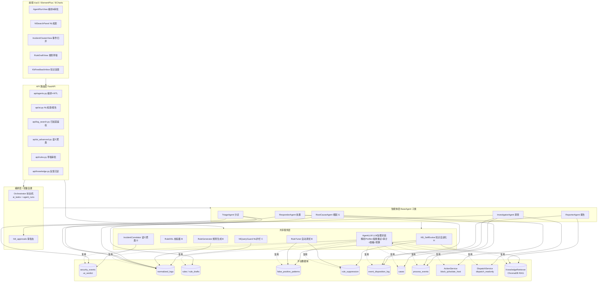
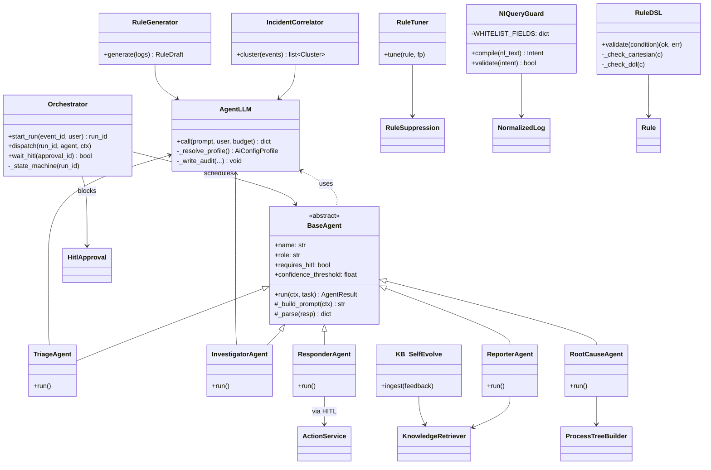
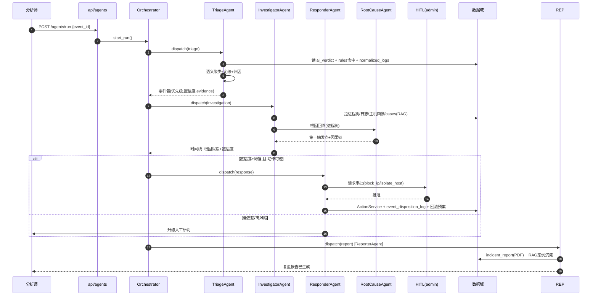
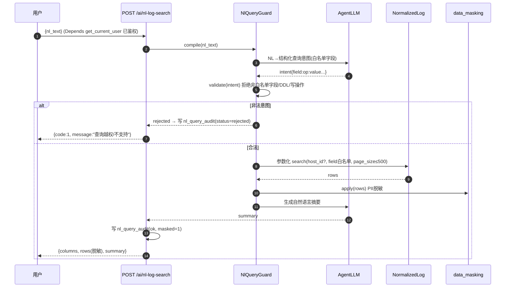
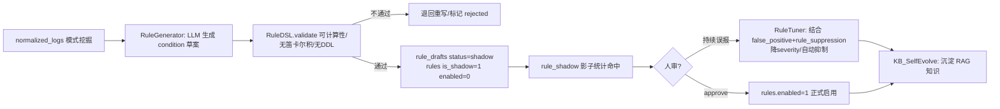
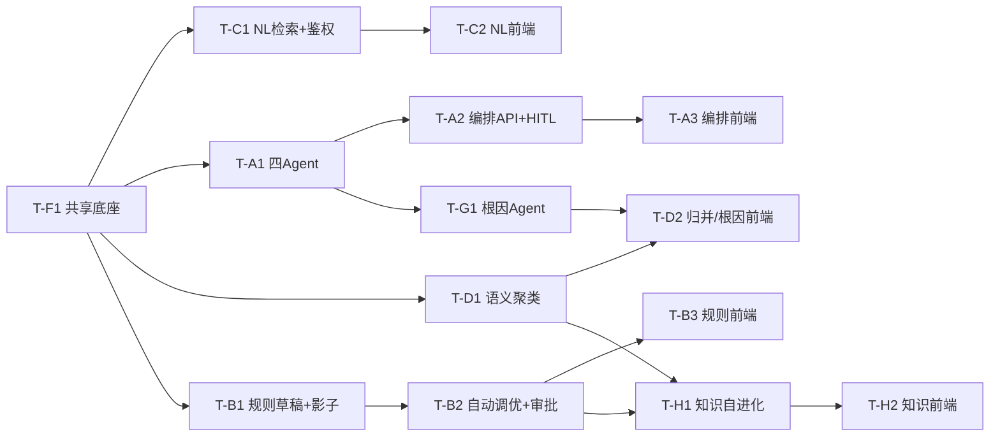

# IR 平台 · 6 大 AI / AI 智能体功能 — 系统架构设计 + 任务分解

> 文档作者：高见远（架构师 / software-architect）
> 适用范围：IR 安全事件响应平台（FastAPI + SQLite / Vue 3 + Element Plus + ECharts）
> 落地功能：P0-A 多智能体闭环、P0-B 规则自生成、P0-C NL 日志检索(鉴权护栏)、P1-D 语义降噪 2.0、P1-G 根因归因智能体、P2-H 知识库自进化
> 输入依据：`docs/ai_innovation_proposal.md` + 真实代码对齐（见各节"代码现状"注释）

---

## 0. 代码现状对齐（设计前提，避免凭空假设）

| 现状项 | 真实代码 | 本设计如何复用 |
|---|---|---|
| LLM 调用治理 | `AiService.call_llm` / `call_llm_stream`（已包裹 `CircuitBreaker`+`with_retry`），`AiConfigProfile.get_active()` 取配置，`AiService.decrypt_api_key` 解密 | 新增 `agent_llm.py` 仅做"解析+审计+脱敏+预算"薄封装，不直接调用 httpx |
| 多模型配置 | `ai_config.py`：`AiConfigProfile`（provider/api_base_url/api_key/model_name/max_tokens/temperature） | Agent 复用同一 Profile，新增 `provider='ollama'` 走本地模型（可选） |
| 异步任务态 | `ai_task.py`：`AiTask`（host_id/profile_id/status/progress/mode…） | 编排器复用其状态机语义，新增 `agent_runs` 记录跨 Agent 的运行链路 |
| AI 审计 | `ai_audit_log.py`：`AiAuditLog`（host_id/model_name/prompt_tokens/…/user_id） | 每次 Agent LLM 调用自动写审计（含 user_id） |
| 脱敏引擎 | `services/data_masking.py`：`apply()`、`mask_username/ip/path/domain` | NL 检索 + Agent 输出统一脱敏 |
| 治理常量 | `config.py`：`AI_MASKING_DEFAULT`/`AI_CIRCUIT_BREAKER_TIMEOUT`/`AI_MAX_RETRIES`/`AI_INPUT_BUDGET`/`AI_CONTEXT_WINDOW`；`ai_constants.py`：`TaskStatus`/`AIMode`/`RISK_SCORE_THRESHOLD_*` | 直接引用，不新增治理项 |
| 处置底座 | `services/action_service.py`：`ActionService.block_ip/isolate_host/export_report`；`disposition_service.py` 写 `event_disposition_log` | Responder Agent 经 HITL 后调用 |
| 只读取证 | `services/dispatch_service.py`：`dispatch_readonly`（红线关键字拦截） | Investigator 派发只读取证复用 |
| RAG 知识 | `services/knowledge_retriever.py`（ChromaDB+sentence-transformers，自动降级关键词）；`models/knowledge_draft.py` | H 阶段写 `KnowledgeDraft`(approved) 后 `rebuild_seed_index()` |
| 进程树 | `analysis/process_tree_builder.py` + `process_events` 表 | G 阶段根因回溯复用 |
| 事件研判 | `security_events.ai_verdict`（JSON，形如 `{"label":"suspicious|false_positive", ...}`） | A/D 直接读取聚合；`ai_noise_reduce.py` 负责逐事件初判 |
| **鉴权风险点（PRD 重点）** | `api/log_search.py`（v2 `/api/log-search`，如 `POST /import`、`GET /search`）**未**加 `Depends(get_current_user)`；而 `api/logs.py` 已鉴权 | **C 必须全模块加固 `log_search.py` + 新增 NL 端点继承 `get_current_user`** |
| 现有关联能力 | `api/ai_advanced.py`：`correlate_incidents`（关键词式）、`risk_ranking` | D 在 `correlate_incidents` 上**升级**语义聚类模式，不重写 |

---

## 1. 总体架构

### 1.1 设计原则

1. **最小改动 + 复用**：不推翻 `ai.py`/`ai_advanced.py`/`ai_noise_reduce.py`/`knowledge_retriever.py`，在其上叠加"编排层 + Agent 基类 + 护栏层"。
2. **统一底座共享**：6 功能共用 ① LLM 治理封装 ② Agent 基类 ③ 编排器（状态机）④ 审计/任务态 ⑤ 知识层。
3. **人在回路（HITL）**：处置/高风险动作强制审批；仅"低危+可逆+高置信"可走可选免审批开关（默认关）。
4. **可审计、可回滚**：任何 Agent 动作写 `ai_audit_log`、`agent_run_steps`、`event_disposition_log`，Responder 生成自动回滚预案。

### 1.2 整体架构图（Mermaid）



---

## 2. 实现方案 + 框架选型

### 2.1 编排框架：自建轻量编排（结论：**不引入 LangGraph / AutoGen**）

| 维度 | 自建轻量（采用） | LangGraph / AutoGen |
|---|---|---|
| 依赖 | 0 新增（复用 `ai_tasks`/`asyncio`/`CircuitBreaker`） | 重依赖，与 SQLite 轻量定位冲突 |
| 审计/HITL | 直接复用 `ai_audit_log`/`agent_runs`/`hitl_approvals` | 需额外适配，引入框架自有状态 |
| 可控性 | 完全掌控状态机、超时、熔断、回滚 | 黑盒图执行，HITL 注入点需绕框架 |
| 学习/维护 | 团队已熟悉 `ai_tasks` 模式 | 新范式，培训成本高 |
| 风险 | 需自己写状态机（~200 行） | 版本漂移、与既有 `ai_tasks` 重复 |

**结论**：采用**自建轻量编排器**（`Orchestrator` + `asyncio` + `ai_tasks`/`agent_runs` 状态机），每个 Agent 是 `BaseAgent` 子类，由 Orchestrator 按阶段串行/并行调度，HITL 作为"阻塞网关"插入 Responder 之前。

### 2.2 关键技术难点与对策

| 难点 | 对策 |
|---|---|
| LLM 幻觉编造进程/攻击链 | 所有结论锚定真实数据域；Agent 输出带 `evidence_refs`（指向 normalized_logs/process_events 真实行）；高影响动作强制 HITL |
| NL→SQL 注入/越权 | `NlQueryGuard`：白名单字段映射 + 参数化 + 强制只读 + 拒 DDL；LLM 只产结构化"查询意图 JSON"，绝不拼原始 SQL |
| 规则不可计算/性能爆炸 | `RuleDSL` 校验器 + 影子运行（`enabled=False` / `is_shadow=True`）+ 人审启用，绝不直启 |
| 多 Agent 成本/延迟 | 复用 `AI_INPUT_BUDGET`/`AI_CONTEXT_WINDOW`；先 `ai_verdict` 降噪再深研；`ai_audit_log` 计成本 |
| 处置误判业务中断 | Responder 默认零自主（仅建议）；仅"低危+可逆"可走置信度门控免审批（默认关）；执行写 `event_disposition_log` + 自动回滚预案 |

---

## 3. 文件清单（标注 新增 / 修改）

### 3.1 后端

| 功能 | 路径 | 类型 | 说明 |
|---|---|---|---|
| 底座 | `backend/app/services/agent_llm.py` | **新增** | LLM 治理封装：解析 Profile→解密→熔断重试→审计→脱敏→预算 |
| 底座 | `backend/app/services/agents/__init__.py` | **新增** | 包初始化 |
| 底座 | `backend/app/services/agents/base_agent.py` | **新增** | `BaseAgent` 抽象基类 |
| 底座 | `backend/app/services/agents/orchestrator.py` | **新增** | 轻量编排器（状态机 + ai_tasks + agent_runs） |
| 底座 | `backend/app/services/agents/prompts.py` | **新增** | 各 Agent system/user prompt 模板 |
| 底座 | `backend/app/models/agent_run.py` | **新增** | `AgentRun` / `AgentRunStep` CRUD |
| 底座 | `backend/app/models/hitl_approval.py` | **新增** | `HitlApproval` CRUD |
| 底座 | `backend/app/database.py` | **修改** | 新增 5 张表迁移（见 §4.1） |
| A | `backend/app/services/agents/triage_agent.py` | **新增** | 分诊 Agent |
| A | `backend/app/services/agents/investigator_agent.py` | **新增** | 调查 Agent（含调用 RootCauseAgent） |
| A | `backend/app/services/agents/responder_agent.py` | **新增** | 处置 Agent（HITL 网关） |
| A | `backend/app/services/agents/reporter_agent.py` | **新增** | 报告 Agent（PDF + RAG 沉淀） |
| A | `backend/app/api/agents.py` | **新增** | 编排 + HITL 审批路由 |
| A | `backend/app/schemas/agent_run.py` | **新增** | 请求/响应 schema |
| A | `backend/app/main.py` | **修改** | 注册 `agents.router` |
| C | `backend/app/services/nl_query_guard.py` | **新增** | NL 护栏：白名单字段映射 + 参数化 + 拒 DDL |
| C | `backend/app/services/nl_log_search.py` | **新增** | NL→安全查询→执行→脱敏→摘要 |
| C | `backend/app/models/nl_query_audit.py` | **新增** | `NlQueryAudit` CRUD |
| C | `backend/app/api/log_search.py` | **修改** | **全模块加 `Depends(get_current_user)`**（修复未鉴权） |
| C | `backend/app/api/ai.py` | **修改** | 加 `POST /ai/nl-log-search` |
| D | `backend/app/services/incident_correlator.py` | **新增** | 语义聚类（升级 correlate_incidents） |
| D | `backend/app/models/incident_cluster.py` | **新增** | `IncidentCluster` CRUD |
| D | `backend/app/api/ai_advanced.py` | **修改** | `correlate_incidents` 加 `?mode=semantic`；加 clusters 端点 |
| G | `backend/app/services/agents/root_cause_agent.py` | **新增** | 根因归因（进程树回溯） |
| G | `backend/app/api/events.py` 或 `analysis.py` | **修改** | 加 `POST /analysis/root-cause` |
| B | `backend/app/services/rule_dsl.py` | **新增** | DSL 校验器（可计算性/笛卡尔积/DDL 检查） |
| B | `backend/app/services/rule_generator.py` | **新增** | LLM 规则草案生成 |
| B | `backend/app/services/rule_shadow.py` | **新增** | 影子运行命中统计 |
| B | `backend/app/services/rule_tuner.py` | **新增** | 自动调优（误报→抑制/降严重度） |
| B | `backend/app/models/rule_draft.py` | **新增** | `RuleDraft` CRUD |
| B | `backend/app/rules/rule_engine.py` | **修改** | 影子模式命中计数（`shadow_hit_count`） |
| B | `backend/app/api/rules.py` | **修改** | 加草稿生成/审批端点 |
| B | `backend/app/schemas/rule_draft.py` | **新增** | 草稿 schema |
| H | `backend/app/services/kb_self_evolve.py` | **新增** | 误报→抑制→RAG 沉淀管线 |
| H | `backend/app/models/kb_feedback.py` | **新增** | `KbFeedback` CRUD |
| H | `backend/app/api/knowledge.py` | **修改** | 加 `POST /knowledge/ingest-feedback` |

### 3.2 前端

| 功能 | 路径 | 类型 | 说明 |
|---|---|---|---|
| A | `frontend/src/api/agents.js` | **新增** | 编排/审批 API 封装 |
| A | `frontend/src/stores/agents.js` | **新增** | 运行态 store |
| A | `frontend/src/views/AgentRunView.vue` | **新增** | 智能体编排看板 |
| A | `frontend/src/components/agents/HitlApprovalPanel.vue` | **新增** | HITL 审批面板 |
| C | `frontend/src/api/logSearch.js` | **修改** | 加 `nlLogSearch` |
| C | `frontend/src/components/logs/NlSearchPanel.vue` | **新增** | NL 检索输入+结果卡片 |
| C | `frontend/src/views/LogSearchView.vue` | **修改** | 嵌入 NL 面板 |
| D/G | `frontend/src/api/incidents.js` | **新增** | 事件归并/根因 API |
| D/G | `frontend/src/views/IncidentClusterView.vue` | **新增** | 真实事件归并视图 |
| D/G | `frontend/src/components/analysis/RootCausePanel.vue` | **新增** | 根因链路面板 |
| B | `frontend/src/api/ruleDrafts.js` | **新增** | 规则草稿 API |
| B | `frontend/src/views/RuleDraftView.vue` | **新增** | 草稿管理+影子统计+审批 |
| H | `frontend/src/api/kb.js` | **新增** | 知识反馈 API |
| H | `frontend/src/components/kb/FeedbackInbox.vue` | **新增** | 反馈收件箱 |
| 全局 | `frontend/src/router/index.js` | **修改** | 新增菜单入口 |

---

## 4. 数据结构与接口

### 4.1 核心新增表（建表 DDL，并入 `database.py` 迁移段）

```sql
-- ① 多智能体运行主表（一条 security_event / 一批事件 = 一次 run）
CREATE TABLE IF NOT EXISTS agent_runs (
    id            INTEGER PRIMARY KEY AUTOINCREMENT,
    run_id        TEXT    NOT NULL UNIQUE,
    event_id      TEXT,                      -- security_events.id（批量分诊可空）
    case_id       INTEGER,
    title         TEXT,
    stage         TEXT    NOT NULL DEFAULT 'triage',  -- triage|investigation|response|report
    status        TEXT    NOT NULL DEFAULT 'pending', -- pending|running|waiting_hitl|completed|failed|cancelled
    current_agent TEXT,                       -- triage_agent|investigator_agent|...
    priority      TEXT    DEFAULT 'P2',       -- P0..P3
    confidence    REAL    DEFAULT 0.0,
    result_json   TEXT    DEFAULT '{}',
    user_id       INTEGER,
    created_at    TEXT NOT NULL DEFAULT (datetime('now')),
    updated_at    TEXT NOT NULL DEFAULT (datetime('now'))
);
CREATE INDEX IF NOT EXISTS idx_agent_runs_status ON agent_runs(status);
CREATE INDEX IF NOT EXISTS idx_agent_runs_event ON agent_runs(event_id);

-- ② 单步执行审计（每 Agent 一步一行，evidence 可溯源）
CREATE TABLE IF NOT EXISTS agent_run_steps (
    id            INTEGER PRIMARY KEY AUTOINCREMENT,
    run_id        TEXT    NOT NULL,
    stage         TEXT,
    agent         TEXT,
    status        TEXT,
    input_json    TEXT    DEFAULT '{}',
    output_json   TEXT    DEFAULT '{}',
    confidence    REAL    DEFAULT 0.0,
    evidence_json TEXT    DEFAULT '[]',   -- [{type, ref}] 指向真实数据域
    audit_log_id  INTEGER,                -- 关联 ai_audit_log.id
    created_at    TEXT NOT NULL DEFAULT (datetime('now'))
);
CREATE INDEX IF NOT EXISTS idx_agent_run_steps_run ON agent_run_steps(run_id);

-- ③ 人在回路审批表
CREATE TABLE IF NOT EXISTS hitl_approvals (
    id                  INTEGER PRIMARY KEY AUTOINCREMENT,
    run_id              TEXT    NOT NULL,
    step_id             INTEGER,
    action              TEXT    NOT NULL,  -- block_ip|isolate_host|export_report|custom
    target_json         TEXT    DEFAULT '{}', -- {host_id, ip, ...}
    requested_by        INTEGER,
    status              TEXT    NOT NULL DEFAULT 'pending', -- pending|approved|rejected|expired
    decided_by          INTEGER,
    decided_at          TEXT,
    auto_rollback_plan  TEXT    DEFAULT '{}',  -- 自动回滚预案 JSON
    reason              TEXT,
    created_at          TEXT NOT NULL DEFAULT (datetime('now')),
    updated_at          TEXT NOT NULL DEFAULT (datetime('now'))
);
CREATE INDEX IF NOT EXISTS idx_hitl_status ON hitl_approvals(status);

-- ④ NL 查询审计（C，护栏留痕）
CREATE TABLE IF NOT EXISTS nl_query_audit (
    id              INTEGER PRIMARY KEY AUTOINCREMENT,
    user_id         INTEGER,
    nl_text         TEXT,
    intent_json     TEXT    DEFAULT '{}',  -- 白名单字段映射后的结构化查询意图
    executed_sql_json TEXT  DEFAULT '{}',  -- 实际执行的参数化查询结构
    row_count       INTEGER DEFAULT 0,
    masked          INTEGER DEFAULT 1,     -- 0/1 是否脱敏
    status          TEXT    DEFAULT 'ok',  -- ok|rejected|error
    error_message   TEXT,
    created_at      TEXT NOT NULL DEFAULT (datetime('now'))
);
CREATE INDEX IF NOT EXISTS idx_nl_audit_user ON nl_query_audit(user_id);

-- ⑤ 语义归并后的"真实事件"簇（D）
CREATE TABLE IF NOT EXISTS incident_clusters (
    id                INTEGER PRIMARY KEY AUTOINCREMENT,
    cluster_id        TEXT    NOT NULL UNIQUE,
    title             TEXT,
    severity          TEXT    DEFAULT 'medium',
    confidence        REAL    DEFAULT 0.0,
    member_event_ids  TEXT    DEFAULT '[]',  -- security_events.id 数组
    host_ids          TEXT    DEFAULT '[]',
    summary           TEXT,
    ai_verdict_agg    TEXT    DEFAULT '{}',
    created_at        TEXT NOT NULL DEFAULT (datetime('now')),
    updated_at        TEXT NOT NULL DEFAULT (datetime('now'))
);
CREATE INDEX IF NOT EXISTS idx_incident_clusters_sev ON incident_clusters(severity);

-- ⑥ 规则草稿表（B）；另给 rules 表加 2 列
CREATE TABLE IF NOT EXISTS rule_drafts (
    id                INTEGER PRIMARY KEY AUTOINCREMENT,
    name              TEXT    NOT NULL UNIQUE,
    category          TEXT,
    rule_type         TEXT,
    condition_json    TEXT    DEFAULT '{}',
    severity          TEXT    DEFAULT 'medium',
    label             TEXT,
    status            TEXT    NOT NULL DEFAULT 'draft', -- draft|shadow|pending_review|enabled|rejected
    shadow_hit_count  INTEGER DEFAULT 0,
    source            TEXT    DEFAULT 'ai',
    generated_by      INTEGER,
    reviewed_by       INTEGER,
    reject_reason     TEXT,
    created_at        TEXT NOT NULL DEFAULT (datetime('now')),
    updated_at        TEXT NOT NULL DEFAULT (datetime('now'))
);
-- rules 表 ALTER（复用 Rule 模型，加影子运行支持）：
-- ALTER TABLE rules ADD COLUMN is_shadow INTEGER DEFAULT 0;
-- ALTER TABLE rules ADD COLUMN shadow_hit_count INTEGER DEFAULT 0;

-- ⑦ 知识自进化反馈表（H）
CREATE TABLE IF NOT EXISTS kb_feedback (
    id                INTEGER PRIMARY KEY AUTOINCREMENT,
    source_event_id   TEXT,
    is_false_positive INTEGER DEFAULT 0,
    rule_name         TEXT,
    suppression_id    INTEGER,
    knowledge_draft_id INTEGER,
    entry_ref         TEXT,     -- ChromaDB entry_ref
    summary           TEXT,
    ingested          INTEGER DEFAULT 0,
    created_at        TEXT NOT NULL DEFAULT (datetime('now'))
);
```

### 4.2 核心类 / 接口（Mermaid classDiagram）



### 4.3 新增 API 端点清单（路径 / 方法 / 入参 / 出参）

> 统一响应：后端既有 `{code:0, data, message}` 风格（见 `api/ai.py`）。下表只列核心字段。

#### A · 多智能体编排 + HITL
| 方法 | 路径 | 入参 | 出参 |
|---|---|---|---|
| POST | `/api/agents/run` | `{event_id?|event_ids?:[], case_id?}`, `current_user` | `{run_id, status}` |
| GET | `/api/agents/runs` | `status?, priority?, page, page_size`, `current_user` | `{items:[AgentRun], total}` |
| GET | `/api/agents/runs/{run_id}` | `current_user` | `AgentRun + steps[]` |
| POST | `/api/agents/runs/{run_id}/approve` | `{approval_id, decided_by}`, `current_user`(admin) | `{status:"approved", executed}` |
| POST | `/api/agents/runs/{run_id}/reject` | `{approval_id, reason}` | `{status:"rejected"}` |
| GET | `/api/agents/approvals` | `status=pending`, `current_user`(admin) | `{items:[HitlApproval]}` |

#### C · NL 日志检索（带鉴权护栏）
| 方法 | 路径 | 入参 | 出参 |
|---|---|---|---|
| POST | `/api/ai/nl-log-search` | `{nl_text, host_id?, time_range?}`, `current_user` | `{columns, rows(masked), summary, audit_id}` |
| — | `api/log_search.py` 全部端点 | **新增 `current_user=Depends(get_current_user)`** | 同原结构（已鉴权） |

#### D · 语义归并
| 方法 | 路径 | 入参 | 出参 |
|---|---|---|---|
| POST | `/api/ai/correlate` | `mode=semantic|keyword`, `time_range?`, `current_user` | `{clusters:[IncidentCluster]}` |
| GET | `/api/ai/incidents/clusters` | `severity?, page`, `current_user` | `{items, total}` |

#### G · 根因归因
| 方法 | 路径 | 入参 | 出参 |
|---|---|---|---|
| POST | `/api/analysis/root-cause` | `{host_id, event_id?}`, `current_user` | `{root_node, causal_chain[], confidence, evidence[]}` |

#### B · 规则自生成 + 调优
| 方法 | 路径 | 入参 | 出参 |
|---|---|---|---|
| POST | `/api/rules/generate` | `{sample_log_ids?:[], category?, current_user}` | `{draft_id, condition, severity, label}` |
| GET | `/api/rules/drafts` | `status?, page`, `current_user` | `{items, total}` |
| GET | `/api/rules/drafts/{id}/shadow-stats` | `current_user` | `{hit_count, sample_hits[]}` |
| POST | `/api/rules/drafts/{id}/enable` | `current_user`(admin) | `{rule_id, enabled:true}` |
| POST | `/api/rules/drafts/{id}/reject` | `{reason}`, `current_user`(admin) | `{status:"rejected"}` |

#### H · 知识自进化
| 方法 | 路径 | 入参 | 出参 |
|---|---|---|---|
| POST | `/api/knowledge/ingest-feedback` | `{source_event_id, is_false_positive, rule_name?}`, `current_user` | `{feedback_id, suppression_id?, draft_id?, ingested}` |
| GET | `/api/knowledge/feedback` | `ingested?, page`, `current_user` | `{items, total}` |

---

## 5. 程序调用流程（Mermaid）

### 5.1 多智能体协同闭环（A）



### 5.2 NL 检索调用流程（C，含护栏）



### 5.3 规则自生成 + 影子运行（B）



---

## 6. 任务列表（按实现顺序，细到可批量实现）

> 推荐实现顺序：**先 C 修鉴权 + 共享底座 → A 编排 → D/G → B → H**（与 PRD §5 路线一致）。
> 标注：所属功能 / 内容 / 涉及文件 / 依赖前置 / 是否新增表·端点。

### T-F1 · 共享底座（LLM 治理封装 + Agent 基类 + 编排器骨架 + 新表）  【功能：A 共享】
- **内容**：实现 `AgentLLM`（解析 `AiConfigProfile`→解密→`with_retry`/`CircuitBreaker`→自动写 `ai_audit_log`→脱敏→`AI_INPUT_BUDGET` 预算校验）；`BaseAgent` 抽象类（`name/role/requires_hitl/confidence_threshold/run()` + `_build_prompt/_parse`）；`Orchestrator` 轻量状态机（`ai_tasks`+`agent_runs` 驱动，支持 `waiting_hitl` 阻塞网关）；`models/agent_run.py`、`models/hitl_approval.py`；`database.py` 迁移新增 `agent_runs`/`agent_run_steps`/`hitl_approvals`。
- **涉及文件**：`services/agent_llm.py`(新)、`services/agents/__init__.py`(新)、`base_agent.py`(新)、`orchestrator.py`(新)、`prompts.py`(新)、`models/agent_run.py`(新)、`models/hitl_approval.py`(新)、`database.py`(改)
- **依赖**：无
- **新增表/端点**：表 ✅ `agent_runs`/`agent_run_steps`/`hitl_approvals`；端点 ❌（仅建表 + 类，路由在 T-A2）

### T-C1 · NL 检索 + 鉴权加固（护栏层 + 端点 + 审计表）  【功能：C】
- **内容**：`NlQueryGuard`（白名单字段映射 normalized_logs 列 + 参数化 + 拒 DDL/写）；`nl_log_search.py`（NL→意图→执行→脱敏→摘要，复用 `NormalizedLog.search` + `data_masking.apply` + `AgentLLM`）；`models/nl_query_audit.py`；`api/log_search.py` **全模块加 `Depends(get_current_user)`**（修复未鉴权）；`api/ai.py` 加 `POST /ai/nl-log-search`。
- **涉及文件**：`services/nl_query_guard.py`(新)、`services/nl_log_search.py`(新)、`models/nl_query_audit.py`(新)、`api/log_search.py`(改)、`api/ai.py`(改)、`database.py`(改)
- **依赖**：T-F1
- **新增表/端点**：表 ✅ `nl_query_audit`；端点 ✅ `POST /api/ai/nl-log-search` + log_search 全模块鉴权

### T-C2 · 前端 NL 检索面板（鉴权接线）  【功能：C】
- **内容**：`NlSearchPanel.vue`（输入+结果卡片+摘要）、`api/logSearch.js` 加 `nlLogSearch`、`LogSearchView.vue` 嵌入面板；确保前端请求自动带 `ir_token`（既有 axios 拦截器）。
- **涉及文件**：`components/logs/NlSearchPanel.vue`(新)、`api/logSearch.js`(改)、`views/LogSearchView.vue`(改)
- **依赖**：T-C1

### T-A1 · 四个专职 Agent 实现（分诊/调查/处置/报告）  【功能：A】
- **内容**：`triage_agent.py`（读 ai_verdict+rules 命中+normalized_logs → 事件包）、`investigator_agent.py`（拉进程树/日志/主机画像/cases(RAG) → 时间线+根因假设，调用 RootCauseAgent）、`responder_agent.py`（生成处置建议 + HitlApproval 申请 + 执行后写 event_disposition_log + 回滚预案）、`reporter_agent.py`（汇聚报告→PDF→RAG 沉淀）、`prompts.py`（各 Agent prompt 模板）；均继承 `BaseAgent`，输出带 `evidence_refs`。
- **涉及文件**：`services/agents/triage_agent.py`(新)、`investigator_agent.py`(新)、`responder_agent.py`(新)、`reporter_agent.py`(新)、`prompts.py`(新)
- **依赖**：T-F1
- **新增表/端点**：❌

### T-A2 · 编排 API + HITL 审批流 + 路由注册  【功能：A】
- **内容**：`api/agents.py`（run/runs/{id}/approve/reject/approvals）；`schemas/agent_run.py`；`main.py` 注册 `agents.router`；HITL 审批逻辑（admin 才可决议；批准后由 Responder 经 ActionService 执行）。
- **涉及文件**：`api/agents.py`(新)、`schemas/agent_run.py`(新)、`main.py`(改)
- **依赖**：T-F1、T-A1
- **新增表/端点**：端点 ✅ `POST /api/agents/run`、`GET /api/agents/runs`、`GET /api/agents/runs/{id}`、`POST /api/agents/runs/{id}/approve`、`POST /api/agents/runs/{id}/reject`、`GET /api/agents/approvals`

### T-A3 · 前端智能体编排视图 + 审批面板  【功能：A】
- **内容**：`AgentRunView.vue`（运行看板/阶段进度）、`HitlApprovalPanel.vue`（审批卡片）、`stores/agents.js`、`api/agents.js`、`router/index.js` 加菜单。
- **涉及文件**：`views/AgentRunView.vue`(新)、`components/agents/HitlApprovalPanel.vue`(新)、`stores/agents.js`(新)、`api/agents.js`(新)、`router/index.js`(改)
- **依赖**：T-A2

### T-D1 · 语义聚类升级 correlate_incidents + incident_clusters 表  【功能：D】
- **内容**：`incident_correlator.py`（LLM 语义聚类跨主机 security_events，复用 `ai_verdict.label` 过滤 suspicious）；`api/ai_advanced.py` 的 `correlate_incidents` 加 `?mode=semantic` 分支（保留 keyword 旧路径）；`models/incident_cluster.py`；`database.py` 加 `incident_clusters`；加 `GET /api/ai/incidents/clusters`。
- **涉及文件**：`services/incident_correlator.py`(新)、`api/ai_advanced.py`(改)、`models/incident_cluster.py`(新)、`database.py`(改)
- **依赖**：T-F1
- **新增表/端点**：表 ✅ `incident_clusters`；端点 ✅ `POST /api/ai/correlate?mode=semantic`、`GET /api/ai/incidents/clusters`

### T-G1 · 根因归因智能体（进程树回溯）  【功能：G】
- **内容**：`root_cause_agent.py`（沿 parent_process→child 回溯第一触发点；复用 `analysis/process_tree_builder.py` + `process_events` + `normalized_logs`；输出 root_node + causal_chain + confidence + evidence）；`api/events.py` 或 `analysis.py` 加 `POST /api/analysis/root-cause`；作为 Investigator 子智能体被调用。
- **涉及文件**：`services/agents/root_cause_agent.py`(新)、`api/events.py`(改) 或 `analysis.py`(改)
- **依赖**：T-F1、T-A1
- **新增表/端点**：端点 ✅ `POST /api/analysis/root-cause`

### T-D2 · 前端事件归并 + 根因视图  【功能：D/G】
- **内容**：`IncidentClusterView.vue`（真实事件簇列表/详情）、`RootCausePanel.vue`（根因因果链）、`api/incidents.js`。
- **涉及文件**：`views/IncidentClusterView.vue`(新)、`components/analysis/RootCausePanel.vue`(新)、`api/incidents.js`(新)
- **依赖**：T-D1、T-G1

### T-B1 · DSL 校验器 + 规则草稿表 + 影子运行  【功能：B】
- **内容**：`rule_dsl.py`（校验 condition 可计算性、拒绝笛卡尔积/全表扫描/DDL）；`rule_generator.py`（LLM 从 normalized_logs 归纳草案，复用 Rule 的 name/category/severity/condition schema）；`rule_shadow.py`（影子命中统计）；`models/rule_draft.py`；`rules` 表 ALTER 加 `is_shadow`/`shadow_hit_count`；`rule_engine.py` 加影子计数；`api/rules.py` 加 `POST /api/rules/generate`、`GET /api/rules/drafts`、`GET /api/rules/drafts/{id}/shadow-stats`。
- **涉及文件**：`services/rule_dsl.py`(新)、`rule_generator.py`(新)、`rule_shadow.py`(新)、`models/rule_draft.py`(新)、`rules/rule_engine.py`(改)、`api/rules.py`(改)、`database.py`(改)、`schemas/rule_draft.py`(新)
- **依赖**：T-F1
- **新增表/端点**：表 ✅ `rule_drafts` + `rules` 加列；端点 ✅ `POST /api/rules/generate`、`GET /api/rules/drafts`、`GET /api/rules/drafts/{id}/shadow-stats`

### T-B2 · 自动调优闭环（误报→抑制/降严重度）+ 人审启用  【功能：B】
- **内容**：`rule_tuner.py`（结合 `false_positive_patterns` + `rule_suppression`：持续误报→降 severity / 自动抑制；抑制可自动、改 severity 需人审）；`api/rules.py` 加 `POST /api/rules/drafts/{id}/enable`(admin)、`/reject`(admin)。
- **涉及文件**：`services/rule_tuner.py`(新)、`api/rules.py`(改)、`schemas/rule_draft.py`(新)
- **依赖**：T-B1
- **新增表/端点**：端点 ✅ `POST /api/rules/drafts/{id}/enable`、`POST /api/rules/drafts/{id}/reject`

### T-B3 · 前端规则草稿管理视图  【功能：B】
- **内容**：`RuleDraftView.vue`（草稿列表/影子统计/审批）、`api/ruleDrafts.js`。
- **涉及文件**：`views/RuleDraftView.vue`(新)、`api/ruleDrafts.js`(新)
- **依赖**：T-B2

### T-H1 · 知识库自进化闭环（误报→抑制→RAG 沉淀）+ kb_feedback 表  【功能：H】
- **内容**：`kb_self_evolve.py`（误报→`rule_suppression`→写 `KnowledgeDraft`(approved)→`KnowledgeRetriever.rebuild_seed_index()` 入向量库；串联 B/D 产出）；`models/kb_feedback.py`；`api/knowledge.py` 加 `POST /api/knowledge/ingest-feedback`、`GET /api/knowledge/feedback`；`database.py` 加 `kb_feedback`。
- **涉及文件**：`services/kb_self_evolve.py`(新)、`models/kb_feedback.py`(新)、`api/knowledge.py`(改)、`database.py`(改)
- **依赖**：T-B2、T-D1
- **新增表/端点**：表 ✅ `kb_feedback`；端点 ✅ `POST /api/knowledge/ingest-feedback`、`GET /api/knowledge/feedback`

### T-H2 · 前端知识反馈视图  【功能：H】
- **内容**：`FeedbackInbox.vue`（反馈收件箱/沉淀状态）、`api/kb.js`。
- **涉及文件**：`components/kb/FeedbackInbox.vue`(新)、`api/kb.js`(新)
- **依赖**：T-H1

### 任务依赖关系（Mermaid）



---

## 7. 依赖包列表（尽量最小，优先复用）

### 后端（Python）
| 包 | 现状 | 本设计 | 说明 |
|---|---|---|---|
| fastapi / pydantic / httpx | 已用 | 复用 | 路由/schema/LLM HTTP |
| chromadb / sentence-transformers | 已用（可选降级） | 复用 | D 语义聚类、H RAG 索引复用既有模型 |
| apscheduler | 已用 | 复用 | 可选：B 影子运行定时统计 |
| **新增** | — | **无强制新增** | 自建编排/护栏/DSL 均用标准库 |
| networkx（可选） | 未用 | 可选 | 仅 G 进程树 DAG 遍历更优雅，可用递归替代，不强制 |

### 前端（Vue3）
| 包 | 现状 | 本设计 |
|---|---|---|
| vue / element-plus / echarts / axios | 已用 | 复用，无新增依赖 |

> 结论：**本期不引入 LangGraph/AutoGen/新 LLM 框架**，零强制新增依赖。

---

## 8. 共享知识（跨文件约定）

### 8.1 Agent 基类接口约定
```python
class BaseAgent(ABC):
    name: str            # triage_agent / investigator_agent / responder_agent / reporter_agent / root_cause_agent
    role: str
    requires_hitl: bool = False
    confidence_threshold: float = 0.7

    @abstractmethod
    async def run(self, ctx: AgentContext, task: dict) -> AgentResult: ...
    # AgentResult: {stage, output, confidence, evidence:[{type, ref}], hitl:Optional[HitlSpec]}
    # 所有输出必须带 evidence（指向 normalized_logs/process_events/security_events 真实行），禁止纯 LLM 编造
```

### 8.2 LLM 调用封装约定（`AgentLLM.call`）
- 入参：`prompt`、调用方 `user`（写 `ai_audit_log.user_id`）、`budget`（默认 `AI_INPUT_BUDGET`）。
- 流程：解析 `AiConfigProfile.get_active()` → `decrypt_api_key` → `AiService.call_llm`（已含 `CircuitBreaker`+`with_retry`）→ 自动 `AiAuditLog.create`（含 token/latency/user_id）→ 返回 `{content, usage}`。
- 降级：`CircuitBreaker` 熔断时返回 `degraded=True`，上游转人工。

### 8.3 审计写入约定
- 每次 LLM 调用 → 一行 `ai_audit_log`（成本/延迟/状态）。
- 每个 Agent 步骤 → 一行 `agent_run_steps`（input/output/confidence/evidence/audit_log_id）。
- 每次 NL 查询 → 一行 `nl_query_audit`（意图/行数/脱敏标志/状态）。

### 8.4 HITL 审批接口约定
- 触发：Agent `requires_hitl=True` 且动作可逆性/置信度未达免审批阈值 → `Orchestrator` 写 `hitl_approvals(status=pending)` 并置 run `status=waiting_hitl`。
- 决议：`approve` 仅 admin；`reject` 转人工研判。
- 执行：批准后由 Responder 调 `ActionService`，并写 `event_disposition_log` + `auto_rollback_plan`。

### 8.5 错误 / 熔断约定
- 复用 `shared/ai_error_mapping.map_http_error` 统一错误文案。
- `CircuitBreaker`（阈值 5，`AI_CIRCUIT_BREAKER_TIMEOUT=300s` 冷却）在 `AiService` 层已包裹；Agent 层捕获 `RuntimeError("断路器已熔断")` → 返回 degraded。
- 所有 Agent 异常捕获后写 `agent_runs.status=failed` + 日志，不向上抛 500 阻断链路。

### 8.6 脱敏约定
- NL 检索结果、Agent 输出中的 PII（用户名/命令行/IP/路径）统一经 `data_masking.apply` / `ai_constants.apply_masking`，遵循 `AI_MASKING_DEFAULT=True`。

---

## 9. 待明确事项（需主理人/用户拍板，附推荐默认值）

| # | 待拍板点 | 推荐默认值 |
|---|---|---|
| 1 | **HITL 免审批边界**：哪些动作允许"置信度门控免审批自动执行"？ | 默认**全部 HITL**；仅低风险 `block_ip`（置信度≥0.9、动作可逆、目标非核心资产）可走免审批开关，**默认关闭**，由 admin 在配置中开启 |
| 2 | **本地模型 Ollama 是否强制**（敏感数据出域合规） | 默认不强制；`AiConfigProfile.provider` 支持 `'ollama'`，**建议**命令行/用户名等敏感数据走本地模型；需确认 Ollama 接入方式（base_url 指向本地） |
| 3 | **`log_search` 鉴权重做范围** | **全模块加固**（C 内完成 `api/log_search.py` 全部端点加 `get_current_user`），作为 P0 安全硬约束 |
| 4 | **RAG 知识库现状**：`event_disposition_log`/`cases` 是否已入向量库 | 现状：RAG 已索引 `rules`+`seed`（见 `knowledge_retriever.py`）；`event_disposition_log`/`cases` **未**入向量库。H 阶段先将处置经验沉淀为 `KnowledgeDraft(approved)` → `rebuild_seed_index()`，不改检索器主路径 |
| 5 | **误报闭环所有权**：B 自动调优（写 `rule_suppression`、改 `rules.severity`）是否需 admin 二次确认 | **抑制可自动**；**改 severity 需人审**（T-B2 实现） |
| 6 | **量化基线**：当前 MTTR/日均待研判量/误报率真实值 | 暂无真实基线，先用行业基准占位（PRD §3），上线后回填校准 |
| 7 | **多智能体框架选型** | **自建轻量编排**（本设计采用），不引入 LangGraph/AutoGen |

> 以上默认值可直接作为 MVP 实现基线；若主理人对任一项有不同决策，请回传，我将据此微调 §3/§6 文件清单与任务边界。

---

## 附：落地路径总览（与 PRD §5 对齐）

| 阶段 | 任务 | 交付 |
|---|---|---|
| MVP（0–1 月） | T-F1 → T-C1/T-C2（鉴权+NL）→ T-A1/T-A2/T-A3（分诊单点+编排骨架） | 鉴权全覆盖、NL 检索、多智能体可跑通分诊→报告 |
| 增强（1–3 月） | T-D1/T-D2（语义降噪）→ T-G1（根因）→ T-B1/T-B2/T-B3（规则自生成+调优） | 跨资产归并、根因归因、规则影子运行+人审 |
| 自主化（3–6 月） | T-H1/T-H2（知识自进化） | 误报→抑制→RAG 沉淀闭环，越用越聪明 |
