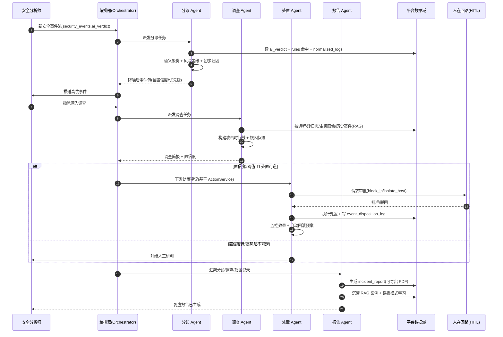
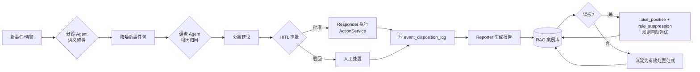

# IR 安全事件响应平台 · AI 与 AI 智能体创新方案

> 文档定位：创新调研 / 机会图谱 + 落地建议（非完整 PRD）
> 负责人：许清楚（产品经理）
> 适用范围：IR 安全事件响应平台（FastAPI + SQLite / Vue 3 + Element Plus + ECharts）
> 版本：v1.0（创新机会初版）

---

## 1. 一句话定位（核心差异化机会）

**不做"又一个安全聊天机器人"，而是把 AI 做成平台原生的「事件响应副驾（Response Co-Pilot）」：让智能体直接在我们的真实数据域上闭环执行「分诊 → 调查 → 处置 → 复盘」，把平台从"看板/工单系统"升级为"人在回路的自主响应引擎"，精准打击分析师的三大瓶颈——告警疲劳、调查耗时（MTTR）、复盘拖沓。**

差异化支点来自平台已具备、但彼此尚未打通的能力：
- `security_events.ai_verdict`（已有的逐事件 AI 研判）尚未被聚类成"事件级"决策；
- `normalized_logs`（进程树/命令行/IP/用户等富字段）尚未被挖掘用于"规则自生成"与"根因归因"；
- `event_disposition_log`（处置经验）与 `cases`（案件）尚未被复用为"案例推理"知识；
- `ActionService`（`block_ip` / `isolate_host` / `export_report`）与 `ai_audit_log` 已具备"受控处置 + 全程审计"底座，缺的是一个编排层。

---

## 2. 创新功能点清单（核心交付物）

> 优先级：P0 = 必须做（构成差异化核心）｜ P1 = 应该做（显著增益）｜ P2 = 增强项（时机成熟再做）
> 技术能力标签：LLM（大模型推理）/ RAG（检索增强）/ Agent（自主智能体）/ ML（机器学习）

| # | 功能名 | 一句话价值 | 用户场景（谁/情境） | 结合的平台模块/数据 | 技术可行性初判 | 优先级 |
|---|--------|-----------|---------------------|----------------------|----------------|--------|
| A | **多智能体协同处置闭环**（分诊/调查/处置/报告 Agent） | 用一组专职 Agent 把一次事件响应从"人盯全流程"变成"人在回路的自动流水线" | SOC 分析师面对批量安全事件流，需要自动分诊并把高优事件推送到人 | `security_events.ai_verdict`、`normalized_logs`、`cases`、`ActionService`、`ai_audit_log`、现有 RAG KB | Agent（ReAct/Plan-Execute，复用 `ai_tasks` 异步任务 + `AiConfigProfile` 多模型）；新依赖：轻量 Agent 编排层 | **P0** |
| B | **AI 检测工程：规则自生成与自动调优** | 从日志中"长"出新检测规则，并基于误报学习自动调优/抑制，破解规则维护靠人堆的困局 | 检测工程/安全运营工程师想补检测盲区、又苦于误报淹没 | `normalized_logs`、`rules`（condition/severity/source）、`false_positive` 模式、`rule_suppression` | LLM（从日志归纳条件）+ RAG（命中历史规则）+ 闭环写 `rules`/`rule_suppression`；新依赖：规则 DSL 校验器 | **P0** |
| C | **自然语言日志检索（带鉴权护栏）** | 用自然语言查日志，并**直接修复 `log_search` 未鉴权**风险 | 分析师/审计员想"查一下这台机器昨天的异常外连"，无需写 SQL | `normalized_logs`、`log_search`（需补鉴权）、`get_current_user` | LLM（NL→安全查询）+ 护栏（只读/行数上限/PII 脱敏）；**必须继承 `get_current_user` 鉴权** | **P0** |
| D | **语义级告警降噪与跨资产事件归并 2.0** | 把跨主机的零散告警聚成"一个真实事件"，量化降低告警疲劳 | 值夜分析师被上千条告警淹没，需要"今日真正值得看的 20 件事" | `security_events.ai_verdict`、`alerts`、`hosts`、现有 `ai_noise_reduce` | LLM 语义聚类（升级现有关键词式 `correlate_incidents`）；复用 `ai_verdict` | P1 |
| E | **处置经验复用 / 案例推理（CBR）** | 新事件自动召回相似历史处置，给出"别人怎么处置的"建议 | 初级分析师遇到陌生告警，需要参考既往同类事件的处置动作 | `event_disposition_log`、`cases`、现有 RAG KB | RAG（检索 `event_disposition_log`/`cases`）+ LLM 生成处置建议 | P1 |
| F | **预测性威胁狩猎 / 攻击预判** | 在"已被告警"之前预判哪些主机正在沦陷，把响应前移 | 威胁狩猎人员/值班主管希望看到"未来 24h 高危主机 Top N" | `normalized_logs`（序列）、现有 `risk_ranking` 启发式、`hosts` | LLM（序列异常叙述）+ 可选 ML（时序/序列模型）；复用 `risk_ranking` 评分 | P1 |
| G | **根因归因智能体（基于进程树/血缘）** | 自动沿进程父子关系回溯"第一触发点"，把调查从小时级压到分钟级 | 调查 Agent 在深挖阶段需要快速定位恶意起点 | `process_events`、进程树构建、`normalized_logs` | LLM（遍历进程树 + 日志做因果推断）；复用进程树服务 | P1 |
| H | **知识库自进化闭环**（误报→抑制→沉淀） | 让平台"越用越聪明"：误报自动反哺规则与知识库 | 安全运营团队希望减少重复误报、沉淀组织知识 | `false_positive`、`rule_suppression`、RAG KB、`ai_prompt_versions` | Agent 编排 + RAG 写入；复用现有误报自学习 | P2 |
| I | **合规与隐私 AI 自检**（联动数据遗忘） | 用 AI 持续审计"谁、何时、查了什么/谁的数据"，对接清空案件合规 | 合规官/管理员需要持续合规态势，特别是 `purge`（数据遗忘）后 | `purge_service`（清空案件）、`audit_logs`、`ai_audit_log`、`users`（admin/普通） | LLM（合规检查单生成与比对）+ 既有审计数据 | P2 |

> 说明：A/B/C 为 P0（构成差异化核心并直接复用/修复现有底座）；D–G 为 P1（显著增益，部分升级现有能力）；H/I 为 P2（自进化与合规增强）。

---

## 3. 重点深挖 3 个 P0 功能

### 3.1 A · 多智能体协同处置闭环

**交互流程（端到端）**
1. **触发**：`security_events` 新事件流入（已带 `ai_verdict` 初判）→ 分诊 Agent 拉取 `ai_verdict` + `rules` 命中 + 相关 `normalized_logs`。
2. **分诊（Triage Agent）**：语义聚类 + 风险定级 + 初步归因 → 输出"降噪后事件包"（含置信度、建议优先级）。
3. **调查（Investigator Agent）**：对高优事件拉取进程树/日志/主机画像，并 RAG 召回历史 `cases`/`event_disposition_log` → 产出攻击时间线 + 根因假设 + 置信度。
4. **处置（Responder Agent）**：当置信度 ≥ 阈值且动作可逆时，经 **人在回路（HITL）审批** 后调用 `ActionService`（`block_ip` / `isolate_host` / `export_report`），执行后写 `event_disposition_log`，并挂"自动回滚预案"。
5. **报告（Reporter Agent）**：汇聚分诊/调查/处置记录 → 复用现有 `incident_report` 映射生成结构化报告（可导出 PDF）→ 沉淀为 RAG 案例 + 误报模式学习。

**数据流转**
```
security_events.ai_verdict
   → Triage Agent → 事件包
       → Investigator Agent → 时间线/根因 (查 normalized_logs / process_events / cases[RAG])
           → Responder Agent → ActionService + event_disposition_log (+ HITL 审批)
               → Reporter Agent → incident_report (PDF) + RAG 案例沉淀
                    → 反哺 false_positive / rules 调优 (闭环)
全程：ai_tasks 异步跟踪 + ai_audit_log 审计 + AiConfigProfile 多模型
```

**量化收益预期（目标值，需上线后实测校准）**
| 指标 | 现状痛点 | 目标收益 |
|------|---------|---------|
| 告警疲劳（日均待研判量） | 千级告警/人/天 | 降噪后聚焦 **Top 20–50 真实事件**（降噪率 90%+ 目标） |
| MTTR（平均响应时长） | 小时级 | 高优事件 **≤15 分钟** 进入处置（分诊自动化） |
| 处置一致性 | 依赖个人经验 | 同类事件处置建议 **复用率 ≥70%**（案例推理） |
| 复盘耗时 | 手动撰写 | 报告自动生成 **≤5 分钟/事件** |

---

### 3.2 B · AI 检测工程：规则自生成与自动调优

**交互流程**
1. **盲区发现**：LLM 读取 `normalized_logs`（按 `event_type`/`mitre_attack`/进程/命令行聚类），对比现有 `rules`，标出"高频但未命中任何规则"的异常模式。
2. **规则草案生成**：对候选模式生成 `rules.condition` JSON（复用现有规则 schema：name/category/severity/condition）+ 中文 `label` + 建议严重度。
3. **安全校验**：规则 DSL 校验器验证可计算性、避免笛卡尔积/全表扫描；默认 `source='user'`、`enabled=False`（需人审）。
4. **影子运行（Shadow Mode）**：新规则以"仅统计不告警"方式在 `rules` 上试运行，回写命中情况。
5. **自动调优闭环**：结合 `false_positive` 模式与 `rule_suppression`，对持续误报的规则自动降级严重度/临时抑制，并沉淀到 RAG KB。

**数据流转**
```
normalized_logs (模式挖掘)
   → LLM 生成 rules.condition 草案
       → DSL 校验 → rules(source='user', enabled=False)
           → 影子运行统计命中
               → 人审启用 OR 误报→ rule_suppression + false_positive 学习
                    → 知识沉淀 RAG KB
```

**量化收益预期**
- 检测覆盖率：新增盲区规则 **≥ 1–2 条/周（影子运行阶段）**，经人审后入库。
- 误报治理：误报规则经自动调优后，**误报率下降 30–50%**（目标，基于 `false_positive` 闭环）。
- 工程师效率：规则编写从"数小时/条"降至"分钟级草案 + 人审"。

**风险点**：LLM 生成的规则可能不可计算或产生性能问题 → 必须强制 DSL 校验 + 影子运行，**禁止直接 enabled**。

---

### 3.3 C · 自然语言日志检索（带鉴权护栏）

**交互流程**
1. 用户在日志分析中心输入自然语言（如"查 10.0.0.5 昨天到今天的所有对外 445 连接"）。
2. LLM 把 NL 转成**限定域安全查询**（映射到 `normalized_logs` 的 `source_ip`/`target_ip`/`event_type`/`timestamp` 等字段），**仅生成白名单内的查询结构**。
3. **护栏执行**：① 必须继承 `get_current_user` 鉴权（**直接修复 `log_search` 未鉴权风险**）；② 强制只读、行数上限（如 500）、敏感字段（用户名/命令行）按 `AI_MASKING_DEFAULT` 脱敏；③ 拒绝任何写/DDL。
4. 返回结果 + LLM 自然语言摘要（复用 `_llm_summary` 风格），可一键转为调查线索或派发只读采集（`dispatch_readonly`）。

**数据流转**
```
用户输入 NL → LLM(NL→安全查询) → 护栏层(鉴权+只读+限行+脱敏) → normalized_logs
   → 结果 + LLM 摘要 → 前端卡片 / 转 dispatch_readonly 取证
```

**量化收益预期**
- 安全：彻底消除 `log_search` 未鉴权暴露面（合规/等保刚性需求）。
- 效率：非 SQL 用户查询日志的门槛下降，查询自助率提升。

**风险点**：NL→查询的注入与越权 → 护栏层必须"白名单字段 + 参数化 + 强制鉴权"，LLM 只产出结构化查询意图，绝不拼接原始 SQL。

---

## 4. AI 智能体编排设想（多智能体协同闭环）

### 4.1 角色分工

| 智能体 | 职责 | 主要读写 | 自主度 |
|--------|------|----------|--------|
| **分诊 Agent（Triage）** | 事件聚类、风险定级、优先级排序 | 读 `security_events.ai_verdict`/`alerts`/`normalized_logs` | 高（只读+定级） |
| **调查 Agent（Investigator）** | 时间线重建、根因假设、证据采集 | 读 `normalized_logs`/`process_events`/`cases`(RAG)；可派发 `dispatch_readonly` | 中（取证可自动，结论待人） |
| **处置 Agent（Responder）** | 执行/建议处置动作 | 调 `ActionService`；写 `event_disposition_log` | 低（**强制 HITL 审批**） |
| **报告 Agent（Reporter）** | 汇聚生成复盘报告、知识沉淀 | 写 `incident_report`/PDF；写 RAG 案例 | 中（生成可自动，发布待人） |
| **（编排器 Orchestrator）** | 任务路由、状态机、超时/熔断 | 用 `ai_tasks` 跟踪；`ai_audit_log` 留痕 | — |

### 4.2 协同闭环时序图（Mermaid）



### 4.3 自进化学习闭环（Mermaid 流程图）



> 编排底座复用：所有 Agent 调用走 `AiConfigProfile`（多 Provider、密钥 Fernet 加密、`AI_MASKING_DEFAULT` 脱敏、`AI_CIRCUIT_BREAKER_TIMEOUT` 熔断、`AI_MAX_RETRIES` 重试），任务态用 `ai_tasks`，行为用 `ai_audit_log` 全留痕——**任何自主动作都可审计、可回滚**。

---

## 5. 落地路线建议

> 原则：**先复用、后新建；先人在回路、后自主化**；每个阶段都依赖已上线能力。

| 阶段 | 目标 | 落地内容 | 依赖的现有能力 |
|------|------|----------|----------------|
| **MVP（0–1 月）** | 把已有 AI 能力"串成线" | C（NL 日志检索+鉴权修复）、D（跨资产语义降噪 2.0，升级 `correlate_incidents`）、A 的分诊 Agent 单点 | `security_events.ai_verdict`、`ai_noise_reduce`、`normalized_logs`、`get_current_user`、RAG KB |
| **增强（1–3 月）** | 调查与处置半自主 | A 完整闭环（调查/处置/报告 Agent + HITL）、B（规则影子运行+人审）、E（案例推理）、G（根因归因 Agent） | `ActionService`、`event_disposition_log`、`cases`、进程树服务、`rule_suppression`、`false_positive` |
| **自主化（3–6 月）** | 闭环自进化 | F（预测性狩猎）、H（误报→抑制→知识自进化）、I（合规 AI 自检）、置信度门控的自动处置（低危可逆动作免审批） | `risk_ranking`、`purge_service`、`audit_logs`、`AiConfigProfile` 多模型 |

**阶段闸门（Go/No-Go 建议）**
- MVP 闸门：降噪率、NL 检索鉴权覆盖率（必须 100% 覆盖 `log_search`）、误报率不上升。
- 增强闸门：处置建议采纳率、HITL 审批通过率、MTTR 下降幅度。
- 自主化闸门：自动处置的"误处置率"接近 0、可一键回滚成功率 100%。

---

## 6. 风险与待确认问题

### 6.1 主要风险

| 风险 | 说明 | 缓解 |
|------|------|------|
| **幻觉（Hallucination）** | LLM 可能编造不存在的进程/攻击链/处置动作 | 所有结论**锚定真实数据域**（只引用 `normalized_logs`/`process_events` 实际记录）；Agent 输出带"证据引用"；高影响动作强制 HITL |
| **误报/误处置** | 自动处置（隔离/封 IP）若错判，可能业务中断 | 处置 Agent 默认**零自主**：仅建议；仅"低危+可逆"动作可走置信度门控免审批；所有执行写 `event_disposition_log` + 自动回滚预案 |
| **数据安全/隐私** | 日志含 PII（用户名/命令行）；`log_search` 当前**未鉴权** | C 功能强制继承 `get_current_user`；PII 按 `AI_MASKING_DEFAULT` 脱敏；`purge`（数据遗忘）链路需 AI 自检覆盖 |
| **成本** | 多 Agent 多轮调用 LLM，token 成本与延迟 | 复用 `AI_INPUT_BUDGET`/`AI_CONTEXT_WINDOW` 预算；降噪后再调用（先 `ai_verdict` 后深研）；`ai_audit_log` 计成本；支持本地模型（Ollama）走敏感数据 |
| **规则安全** | B 自动生成规则可能不可计算/性能爆炸 | DSL 校验 + 影子运行（`enabled=False`）+ 人审启用，绝不直启 |
| **权限越权** | 智能体若绕过 admin/普通用户边界 | 所有 Agent 调用沿用 `get_current_user`；`purge`/隔离等高危动作限定 admin |

### 6.2 需要用户/主理人拍板的问题（Open Questions）

1. **自主度边界**：哪些动作允许"置信度门控免审批自动执行"（如仅 `block_ip` 低风险？还是含 `isolate_host`）？默认建议**全部 HITL**，仅低风险 `block_ip` 可考虑免审批。
2. **模型策略**：敏感数据（日志/命令行）是否强制走**本地模型（Ollama）**？还是允许公有云模型（需确认数据出域合规）。
3. **`log_search` 鉴权重做范围**：是仅在 C 功能内补鉴权，还是对整个 `log_search` 模块统一加固（建议后者，作为 P0 安全硬约束）。
4. **RAG 知识库现状**：现有 RAG（见 `docs/RAG全模块接入与优化方案_v2.md`）是否已索引 `event_disposition_log` 与 `cases`？若未索引，E（案例推理）需先补索引。
5. **误报闭环所有权**：B 的自动调优（写 `rule_suppression`、改 `rules.severity`）是否需要 admin 二次确认？建议"抑制可自动、改严重度需人审"。
6. **量化基线**：当前 MTTR、日均待研判告警量、误报率的**真实基线数据**是否有？用于校准第 3 节的收益目标（否则先用行业基准占位）。
7. **多智能体框架选型**：是自建轻量编排（基于现有 `ai_tasks`/`asyncio`），还是引入框架（如 LangGraph/AutoGen）？建议**先自建轻量**，避免重依赖。

---

## 附：与现有 AI 能力的边界说明（避免重复建设）

| 已有能力（不重复造） | 本方案的新增价值 |
|----------------------|------------------|
| `ai.py`：主机 AI 分析/报告/多轮对话/提示词优化 | 向上聚合为"报告 Agent"，不再单点调用 |
| `ai_advanced.py`：`correlate_incidents`（关键词式归并）、`risk_ranking`（启发式）、NL 指挥台 | 升级为**语义聚类**（D）、**序列预测**（F） |
| `ai_noise_reduce.py` + `security_events.ai_verdict`（逐事件研判） | 向上聚成"事件级"分诊（A）与跨资产归并（D） |
| RAG 知识库、`false_positive` 自学习、`rule_suppression` | 串联成自进化闭环（H、E、B） |
| `ActionService` / `DispatchService` / `ai_audit_log` | 作为"处置 Agent"与"取证"的执行与审计底座 |
| `AiConfigProfile`（多 Provider、加密密钥、脱敏、熔断） | 作为所有 Agent 的统一 LLM 调用与治理底座 |

> 结论：本方案**不新建孤立的 AI 功能**，而是把已零散存在的 AI 能力，用"多智能体编排 + 数据域贯通"串成一条可审计、可回滚、人在回路的事件响应闭环。
