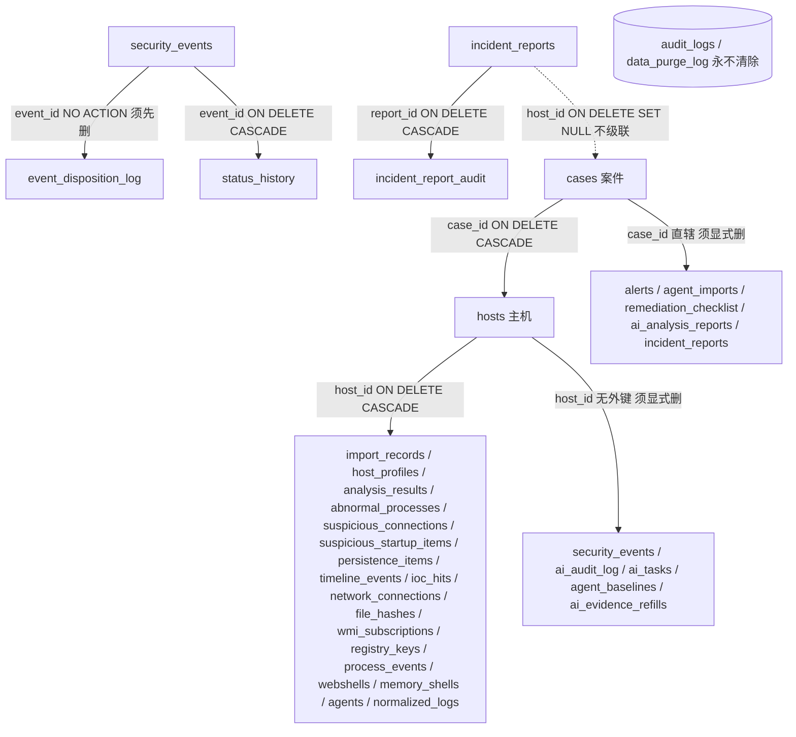
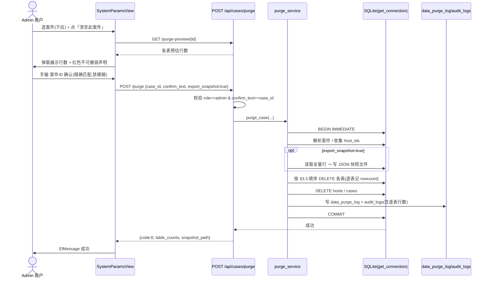

# 「清空某个案件」功能设计方案（IR 平台 · 仅设计稿）

> 范围：在「系统管理 → 系统参数」页增加一行「清空某个案件」操作，面向隐私合规 / 被遗忘权。
> 技术栈：后端 FastAPI + SQLite（`backend/app/`），前端 Vue 3 + Element Plus + Vite（`frontend/src/`）。
> 本文档所有定位均带 `文件:行号` 证据，全部基于实际读码。未确认的关联已显式标注「待核实」。

---

## 0. 读码结论速览（先讲重点）

1. **前端入口已定位**：`frontend/src/views/settings/SystemParamsView.vue`（路由 `/settings/params`，见 `router/index.js:143`）。当前是一个 **key/value/value_type/description** 的 `el-table`（:7-40），由 `getSystemSettings()` 驱动 —— 它是「配置表单」，不是「操作行」。新增清案操作需单独成块（见 §3.1）。
2. **案件主关系不是 `case_hosts` 中间表**：`hosts` 表直接持有 `case_id` 列（`database.py:43`，`REFERENCES cases(id) ON DELETE CASCADE`）。全仓 `case_hosts` 仅出现在 `main.py:201/217/236`（一个 API 模块名），**数据库里没有 `case_hosts` 表**。团队主理人初步取向中提到的「hosts 经 case_hosts 间接关联」与本代码不符，应以本读码为准。
3. **`PRAGMA foreign_keys = ON` 已全局开启**（`database.py:850`）。因此删除 `cases` 行会级联删 `hosts` → 所有 `host_id REFERENCES hosts(id) ON DELETE CASCADE` 的表。但仍有 **5 张 host 维表没有外键**、`incident_reports.host_id` 是 `ON DELETE SET NULL`，这些**不会被级联清掉**——这正是需要显式清除的范围。
4. **现有 `DELETE /api/cases/{id}` 是不完整的**：`api/cases.py:83-93` 的 `delete_case` 仅调 `Case.delete()`（`models/case.py:124-128`，只 `DELETE FROM cases`），靠 FK 级联清掉了 hosts 及其外键子树，但**漏掉** `security_events / ai_audit_log / ai_tasks / agent_baselines / ai_evidence_refills / incident_reports / event_disposition_log / status_history`。本次新功能应做成**完整、显式、可审计**的清除，本轮旧 `delete_case` 不改动（决策点 6，见 §6）。
5. **权限模型已确认**：现有 admin 校验统一用 `current_user.get("role") != "admin"`（如 `api/settings_api.py:42`），而非 `is_admin` 字段（经 Grep 全 `api/` 目录，`is_admin` 无任何命中）。`get_current_user` 返回的用户字典含 `id / username / role`（`auth_service.py:100-126`，JWT payload 见 `:57-61`）。

---

## 1. 前端入口现状确认

### 1.1 页面与路由
- 入口组件：`frontend/src/views/settings/SystemParamsView.vue`
- 路由注册：`frontend/src/router/index.js:143-144`，path = `/settings/params`，父布局 `SettingsLayout.vue`（`frontend/src/views/settings/SettingsLayout.vue:27-34` 侧边栏第六项「🔧 系统参数」）。
- 该页为「系统管理」模块下子页，左侧菜单含 用户与权限 / 审计日志 / Agent 管理 / 数据与存储 / 系统参数 / 主题与外观。

### 1.2 当前渲染形态（`SystemParamsView.vue`）
- `:7` 用 `<el-table :data="paramList">` 渲染系统参数，列：参数名(:8-12) / 当前值(:13-38，按 `value_type` 切 switch/input-number/input) / 说明(:39)。
- `:44-80` 脚本：`onMounted` 调 `fetchParams()` → `getSystemSettings()`（`@/api/settings`，见 `:47`）；`handleChange()` → `updateSystemSetting(row.key, {value})`。
- `api/settings.js:3-9`：`getSystemSettings()` → `GET /settings`；`updateSystemSetting(key,data)` → `PUT /settings/:key`。
- **结论**：当前页是纯配置表单，没有任何「操作按钮行」。要把「清空案件」做成「带确认弹窗的操作行」，**最干净的做法是在 `el-table` 下方新增一个独立的「数据遗忘操作」卡片**（含案件选择 + 危险按钮 + 弹窗），视觉上即「一行操作 + 确认弹窗」，且不与配置表耦合。也可在 `paramList` 注入一条虚拟 action 行，但会污染配置数据模型，不推荐。

---

## 2. 案件数据模型与级联清除范围（基于 `database.py` 真实 DDL）

### 2.1 案件主表
- `cases`：`database.py:29-37`，主键 `id`（自增），字段 `name / case_number(UNIQUE) / description / status / priority / created_at / updated_at`。
- `hosts`：`database.py:41-54`，`case_id INTEGER NOT NULL REFERENCES cases(id) ON DELETE CASCADE`（:43）——**案件与主机为一对多，直接外键**。

### 2.2 全量表 × 案件关联方式清单

判定方法：Grep `case_id` 与 `host_id` 于 `database.py`。`case_id` 直接出现在 **6 张表**（`hosts / ai_analysis_reports / remediation_checklist / alerts / agent_imports / incident_reports`）；其余表通过 `host_id`（指向 `hosts.id`）间接关联。

| # | 表名 | 关联字段 | 关联方式 | 是否随案件删除自动级联 | 清除方式 |
|---|------|---------|---------|----------------------|---------|
| 1 | `hosts` | `case_id` | 直接外键 `ON DELETE CASCADE` | 是（删 cases 触发） | `DELETE WHERE case_id=?` |
| 2 | `ai_analysis_reports` | `case_id` + `host_id` | 直接外键 `ON DELETE CASCADE`（:297/296） | 是 | `DELETE WHERE case_id=?` |
| 3 | `remediation_checklist` | `case_id`（:494）+ `host_id`(:493 级联) | `case_id` 仅普通列，**无外键约束** | 否（host 级联只清 host 级行） | `DELETE WHERE case_id=?` |
| 4 | `alerts` | `case_id`（:535，仅 REFERENCES 无 ON DELETE）+ `host_id`(:534 级联) | `host_id` 级联（alerts.host_id NOT NULL） | 是（经 host） | `DELETE WHERE case_id=?`（兜底） |
| 5 | `agent_imports` | `case_id`（:728）+ `host_id`（:729，**无外键**） | 无外键 | 否 | `DELETE WHERE case_id=?` 或 `host_id IN` |
| 6 | `incident_reports` | `case_id`（:1595）+ `host_id`（:1594 **ON DELETE SET NULL**） | host 删除后 host_id 置 NULL、**残留** | 否（关键孤儿表） | `DELETE WHERE case_id=?` |
| 7 | `incident_report_audit` | `report_id` | `REFERENCES incident_reports(id) ON DELETE CASCADE`（:1728） | 是（随 incident_reports） | 隐式级联，可显式 `WHERE report_id IN` |
| — | **host 维表（间接）** | `host_id` | 见下表 | 取决于是否级联 | — |
| 8 | `import_records` | `host_id`（:60 级联） | 级联 | 是 | `DELETE WHERE host_id IN` |
| 9 | `host_profiles` | `host_id`（:73 级联，UNIQUE） | 级联 | 是 | `DELETE WHERE host_id IN` |
| 10 | `analysis_results` | `host_id`（:89 级联） | 级联 | 是 | `DELETE WHERE host_id IN` |
| 11 | `abnormal_processes` | `host_id`（:102 级联） | 级联 | 是 | `DELETE WHERE host_id IN` |
| 12 | `suspicious_connections` | `host_id`（:122 级联） | 级联 | 是 | `DELETE WHERE host_id IN` |
| 13 | `suspicious_startup_items` | `host_id`（:140 级联） | 级联 | 是 | `DELETE WHERE host_id IN` |
| 14 | `persistence_items` | `host_id`（:155 级联） | 级联 | 是 | `DELETE WHERE host_id IN` |
| 15 | `timeline_events` | `host_id`（:170 级联） | 级联 | 是 | `DELETE WHERE host_id IN` |
| 16 | `ioc_hits` | `host_id`（:183 级联） | 级联 | 是 | `DELETE WHERE host_id IN` |
| 17 | `network_connections` | `host_id`（:382 级联） | 级联 | 是 | `DELETE WHERE host_id IN` |
| 18 | `file_hashes` | `host_id`（:398 级联） | 级联 | 是 | `DELETE WHERE host_id IN` |
| 19 | `wmi_subscriptions` | `host_id`（:414 级联） | 级联 | 是 | `DELETE WHERE host_id IN` |
| 20 | `registry_keys` | `host_id`（:427 级联） | 级联 | 是 | `DELETE WHERE host_id IN` |
| 21 | `process_events` | `host_id`（:440 级联） | 级联 | 是 | `DELETE WHERE host_id IN` |
| 22 | `webshells` | `host_id`（:459 级联） | 级联 | 是 | `DELETE WHERE host_id IN` |
| 23 | `memory_shells` | `host_id`（:477 级联） | 级联 | 是 | `DELETE WHERE host_id IN` |
| 24 | `agents` | `host_id`（:559 级联，UNIQUE） | 级联 | 是 | `DELETE WHERE host_id IN` |
| 25 | `normalized_logs` | `host_id`（:574 级联） | 级联 | 是 | `DELETE WHERE host_id IN` |
| 26 | `import_results` | `import_id` | `REFERENCES import_records(id) ON DELETE CASCADE`（:817） | 是（随 import_records） | 隐式级联 |
| — | **host 维表（无外键，必须显式清）** | | | | |
| 27 | `security_events` | `host_id`（:648，**无外键**） | 不级联 | 否（关键残留表） | `DELETE WHERE host_id IN` |
| 28 | `event_disposition_log` | `event_id` | `REFERENCES security_events(id)` **无 ON DELETE**（:1238，默认 NO ACTION） | 否，且会**阻塞** security_events 删除 | **必须先删**：`DELETE WHERE event_id IN (SELECT id FROM security_events WHERE host_id IN ...)` |
| 29 | `status_history` | `event_id` | `REFERENCES security_events(id) ON DELETE CASCADE`（:694） | 是（随 security_events） | 隐式级联，可显式 |
| 30 | `ai_audit_log` | `host_id`（:255，**无外键**） | 不级联 | 否 | `DELETE WHERE host_id IN` |
| 31 | `ai_tasks` | `host_id`（:278，**无外键**） | 不级联 | 否 | `DELETE WHERE host_id IN` |
| 32 | `agent_baselines` | `host_id`（:1270，**无外键**） | 不级联 | 否 | `DELETE WHERE host_id IN` |
| 33 | `ai_evidence_refills` | `host_id`（:1289，**无外键**） | 不级联 | 否 | `DELETE WHERE host_id IN` |

### 2.3 明确「不清除 / 待核实」的表
- **全局表，永不清除**：`users / system_settings / audit_logs / iocs / threat_intel / rules / whitelist / ai_config / ai_config_profiles / ai_prompt_versions / detection_policies / policy_rules / rule_audit_log / ai_feedback / playbook_presets`。`audit_logs`（:782）是系统审计基座，**清案操作本身还要往里写记录**。
- **待核实（默认不纳入清除范围，需用户拍板）**：
  - `knowledge_drafts`（:502）：仅有 `host_id TEXT`（:504），**无 `case_id` 字段**，且 host_id 为 TEXT 非外键，数据归属不明确 → **暂不清**，待确认。
  - `incident_correlations`（:707）：`host_ids TEXT` 自由文本列表，非外键，非案件直辖 → **暂不清**。
  - `false_positive_patterns`（:631）、`rule_suppression`（:521，`host_id DEFAULT 0`）：规则/抑制项，偏全局 → **暂不清**。

---

## 3. 完整方案设计

### 3.1 功能定位与入口
- **位置**：`SystemParamsView.vue` 的 `el-table`（:40 之后、`:41` 之前）下方，新增一个 `el-card`「数据遗忘操作 / 清空案件」。
- **交互形态**（操作行 + 确认弹窗，非无声开关）：
  1. 案件选择：下拉框，数据源复用现有 `GET /api/cases/with-hosts`（`api/case_hosts.py:11-12`，返回每个案件的主机数 / 日志数 / 事件数）——让用户看清影响面。
  2. 危险按钮「清空此案件（不可撤销）」，**仅 `authStore.user?.role === 'admin'` 时显示**（参考 `RulesView.vue:334`）。
  3. 点击 → 弹 `el-dialog` 二次确认：展示该案件预估删除行数（调 `GET /api/cases/purge-preview/{id}`，见 §3.7）+ 醒目红色「不可撤销」声明 + 要求**手输案件 ID（数字主键）**作为确认（与 `confirm_text` 比对，前后端双重校验，精确匹配，禁模糊）。下拉框仅用于选择目标案件，确认环节以手输 ID 为准（决策点 3，见 §6）。

### 3.2 删除策略：硬删 + 强审计（推荐）
- **硬删（真实 DELETE）**：被遗忘权要求数据真正消失，且「软删」会在所有上述表里留 `deleted_at`，等于没忘。推荐硬删。
- **删前先写审计**：在事务内、执行 DELETE **之前**，先把操作人 / 时间 / 案件ID / 各表删除行数写入审计表；审计表自身永不被清。
- **快照导出（决策点见 §6）**：删除前**默认**导出该案件全量数据为 JSON 落盘（`backend/app/data/purge_snapshots/{case_id}_{timestamp}.json`），作为合规留底；由 UI 勾选「导出快照后再删除」控制，**默认开启**（用户可在弹窗取消勾选以关闭，见 §6 决策点 5）。
- 软删不在本次推荐范围（若未来需要「回收站」，另立项）。

### 3.3 级联清除范围清单（落地版，按删除顺序）
执行顺序必须满足外键约束（`event_disposition_log` 默认 NO ACTION 会阻塞父表删除）：

1. **事件/安全子树**：`event_disposition_log`（先于 security_events）→ `status_history` → `security_events`（均按 `host_id IN (案件主机)`）。
2. **AI 非外键 host 表**：`ai_audit_log` → `ai_tasks` → `agent_baselines` → `ai_evidence_refills`（按 `host_id IN`）。
3. **host 外键级联表（显式删，主要为计数 + 兼容 FK 关闭场景）**：`import_records / host_profiles / analysis_results / abnormal_processes / suspicious_connections / suspicious_startup_items / persistence_items / timeline_events / ioc_hits / network_connections / file_hashes / wmi_subscriptions / registry_keys / process_events / webshells / memory_shells / agents / normalized_logs`（按 `host_id IN`）。
4. **案件直辖表（按 `case_id`）**：`alerts` → `agent_imports` → `remediation_checklist` → `ai_analysis_reports` → `incident_reports`（顺带 `incident_report_audit` 随级联）→ `hosts` → `cases`。

> 注：步骤 3 在 `PRAGMA foreign_keys=ON` 下其实已被 `hosts` 删除级联覆盖；显式再删是为了**拿到每张表的 `rowcount` 写审计**，并保证即便将来 FK 被关也不漏清。

### 3.4 权限模型
- **端点级**：新端点 `POST /api/cases/purge` 与 `GET /api/cases/purge-preview/{id}` 均加 `current_user: dict = Depends(get_current_user)`，并在函数体首行写：
  ```python
  if current_user.get("role") != "admin":
      raise HTTPException(status_code=403, detail="仅管理员可执行清空案件操作")
  ```
  写法与 `api/settings_api.py:42` 完全一致；不要用 `is_admin`（该字段在当前 API 层无校验点）。
- **前端级**：非 admin 直接隐藏按钮（§3.1）。
- **建议（决策点 6）**：现有 `DELETE /api/cases/{id}`（`api/cases.py:83`）无任何权限校验，仅登录即可删案件——但**本轮不改动**（`delete_case` 保持原状，见 §6 决策点 6）。

### 3.5 确认交互（防误触）
- 二次确认弹窗（`el-dialog`，非 `ElMessageBox` 简单确认，以承载行数预览与手输框）。
- 手输案件标识：以**案件 ID（数字主键）**作为删除标识，**精确匹配、不做模糊检索**；要求用户输入该案件的 `id` 数值，**前端比对 + 后端 `confirm_text` 校验必须等于该数值 ID**，否则 400 拒绝。下拉框仅用于选择目标案件，确认环节仍以手输 ID 为准（决策点 3，见 §6）。
- 不可撤销声明文案（红色）：「此操作将**永久删除**该案件及其全部主机、日志、告警、安全事件、AI 分析、报告与审计痕迹（清案审计除外），**不可恢复**。请确认已获得合规授权。」

### 3.6 审计埋点（删前记录）
- 复用现有 `audit_logs`（`database.py:782`，写入函数 `create_audit_log` 见 `services/audit_service.py:102-129`）写一条摘要：`action_type='case_purge'`，`detail` 含案件ID/编号/操作人/总影响行数。
- **新增专用表 `data_purge_log`**（建议，因 `audit_logs.detail` 是文本，不便存结构化逐表行数）：
  ```sql
  CREATE TABLE IF NOT EXISTS data_purge_log (
    id            INTEGER PRIMARY KEY AUTOINCREMENT,
    case_id       INTEGER NOT NULL,
    case_number   TEXT,
    case_name     TEXT,
    operator_id   INTEGER,
    operator_name TEXT,
    purged_at     TEXT NOT NULL DEFAULT (datetime('now')),
    total_rows    INTEGER,
    table_counts  TEXT,        -- JSON: {"hosts":N,"security_events":N,...}
    snapshot_path TEXT,
    client_ip     TEXT,
    status        TEXT DEFAULT 'done'
  )
  ```
  该表**永不参与清除**，构成被遗忘权的「操作留痕」（证明已依规执行）。

### 3.7 后端 API 设计
- **预览（可选但强烈建议）**：
  - `GET /api/cases/purge-preview/{case_id}`
  - 鉴权：`Depends(get_current_user)` + admin（仅 admin 可看影响面）。
  - 返回：各表预估行数（`SELECT COUNT(*) ... WHERE case_id=? / host_id IN (...)`），用于弹窗展示。
- **执行**：
  - `POST /api/cases/purge`
  - 请求体：`{ "case_id": 12, "confirm_text": "12", "export_snapshot": true }`
  - 鉴权：`Depends(get_current_user)` + admin 校验（§3.4）。
  - 解析：`case_id` 为数字主键，按 `id` **精确匹配**（**不做模糊匹配、不接受编号**，防误清，决策点见 §6）。前端下拉框选定后回填该数值 ID，确认文本须等于该 ID。
  - **事务处理伪代码**（单连接、原子提交/回滚，复用 `get_connection` 的自动 commit/rollback，`database.py:836-858`）：
    ```python
    def purge_case(case_id: int, confirm_text: str, operator: dict, export_snapshot: bool = True):
        with get_connection() as conn:            # 自动 commit / 异常 rollback
            conn.execute("BEGIN IMMEDIATE")        # 立即拿写锁，串行化并发清案
            case = _resolve_case(conn, case_id)    # 仅按 id 精确查（决策点 3：不模糊）
            if not case:
                raise HTTPException(404, "案件不存在或已清除")   # 重复清同一案件天然幂等
            cid = case["id"]
            if confirm_text != str(cid):
                raise HTTPException(400, "确认文本与案件 ID 不一致")
            # （可选安全闸门）若存在 running/pending 的 ai_tasks 则 409 拒绝
            host_ids = [r["id"] for r in conn.execute(
                "SELECT id FROM hosts WHERE case_id=?", (cid,)).fetchall()]
            ph = ",".join("?" for _ in host_ids) or "NULL"
            counts = {}
            # 1. 事件子树（顺序关键：event_disposition_log 默认 NO ACTION 必须先于 security_events）
            counts["event_disposition_log"] = _del(conn,
                f"DELETE FROM event_disposition_log WHERE event_id IN (SELECT id FROM security_events WHERE host_id IN ({ph}))", host_ids)
            counts["status_history"] = _del(conn,
                f"DELETE FROM status_history WHERE event_id IN (SELECT id FROM security_events WHERE host_id IN ({ph}))", host_ids)
            counts["security_events"] = _del(conn,
                f"DELETE FROM security_events WHERE host_id IN ({ph})", host_ids)
            # 2. AI 非外键 host 表
            for t in ("ai_audit_log","ai_tasks","agent_baselines","ai_evidence_refills"):
                counts[t] = _del(conn, f"DELETE FROM {t} WHERE host_id IN ({ph})", host_ids)
            # 3. host 外键级联表（显式，主要为了计数 + FK 关闭场景兼容）
            for t in ("import_records","host_profiles","analysis_results","abnormal_processes",
                      "suspicious_connections","suspicious_startup_items","persistence_items",
                      "timeline_events","ioc_hits","network_connections","file_hashes",
                      "wmi_subscriptions","registry_keys","process_events","webshells",
                      "memory_shells","agents","normalized_logs"):
                counts[t] = _del(conn, f"DELETE FROM {t} WHERE host_id IN ({ph})", host_ids)
            # 4. 案件直辖表
            for t in ("alerts","agent_imports","remediation_checklist","ai_analysis_reports"):
                counts[t] = _del(conn, f"DELETE FROM {t} WHERE case_id=?", (cid,))
            counts["incident_reports"] = _del(conn,
                "DELETE FROM incident_reports WHERE case_id=?", (cid,))
            # 5. 根
            counts["hosts"] = _del(conn, "DELETE FROM hosts WHERE case_id=?", (cid,))
            counts["cases"] = _del(conn, "DELETE FROM cases WHERE id=?", (cid,))
            # 6. 快照（默认开启，UI 可关）+ 审计（事务内写入）
            snapshot_path = _snapshot(conn, cid, host_ids) if export_snapshot else None
            _write_data_purge_log(conn, case, operator, counts, snapshot_path)
            _write_audit_log(conn, operator, cid, case["case_number"], counts)
        # with 退出即 commit；异常则 rollback（get_connection 兜底）—— 保证原子性
        return {"purged_case_id": cid, "table_counts": counts, "snapshot_path": snapshot_path}

    def _resolve_case(conn, case_id: int) -> dict | None:
        return conn.execute("SELECT * FROM cases WHERE id=?", (case_id,)).fetchone()

    def _del(conn, sql, params):
        cur = conn.execute(sql, params)
        return cur.rowcount
    ```
  - 返回：`{ code:0, data:{ purged_case_id, case_number, total_rows, table_counts, snapshot_path }, message:"案件已清空" }`。
  - **路由注册顺序注意**：`api/cases.py` 已有 `/{case_id}` 路由（`cases.py:48/60/83`）。新增 `POST /purge` 必须写在 `/{case_id}` 路由**之前**，避免被 `case_id="purge"` 命中（且 `case_id` 类型声明为 `int`，字符串 "purge" 本就会 422，但顺序前置更稳妥）。`main.py:218` 已 `include_router(cases.router, prefix="/api/cases")`，无需改 main。

### 3.8 前端改动点
- **`frontend/src/views/settings/SystemParamsView.vue`**
  - 在 `:40` 的 `</el-table>` 之后、`:41` 的 `</div>` 之前，新增「数据遗忘操作」`el-card` + 案件 `el-select`（选项来自 `GET /api/cases/with-hosts`）+ 危险按钮 + `el-dialog` 确认框（含行数预览 + 手输 `case_number`）。
  - 脚本内 `import { useAuthStore } from '@/stores/auth'`（同 `RulesView.vue:334`），`const isAdmin = computed(()=>authStore.user?.role==='admin')`；按钮 `v-if="isAdmin"`。
  - 调接口：`purgePreview(id)`、`purgeCase(...)`（见下）；用 `ElMessage` 反馈，成功后 `router` 跳转或提示「案件已清空」。
- **`frontend/src/api/cases.js`** 新增：
  ```js
  purgePreview(id) { return request.get(`/cases/purge-preview/${id}`) },
  purge(data)     { return request.post('/cases/purge', data) },           // data: {case_id, confirm_text, export_snapshot}
  getCasesWithHosts() { return request.get('/cases/with-hosts') },        // 复用 case_hosts 路由
  ```
  复用现有 `request` 实例（`api/cases.js:1`），基类路径 `/api`（见 `api/index`）。
- 不改动 `SystemParamsView.vue` 原有 `el-table` 逻辑，保持配置表纯粹。

### 3.9 事务与一致性保证
- **单事务原子性**：全部 DELETE + 审计写在**同一个 `with get_connection()`** 内（`database.py:852` 退出时 `conn.commit()`，`:854-856` 异常 `rollback()`），要么全清要么全不清。
- **写锁防并发**：事务首行 `BEGIN IMMEDIATE`（`database.py:850` 已开 FK），立即获取 SQLite 写锁，使同一时刻仅一个清案事务进行；并发清同一案件时后者阻塞至前者提交。
- **重复清同一案件**：第二次进入时 `_resolve_case` 返回 None → 404「案件不存在或已清除」，天然幂等。
- **外键顺序**：因 `event_disposition_log.event_id` 默认 NO ACTION，必须先删它再删 `security_events`（§3.3 步骤 1），否则报外键冲突。
- **可选安全闸门**：清前检查案件主机上是否有 `status IN ('running','pending')` 的 `ai_tasks`，有则 409 拒绝，避免清掉正在分析的数据（建议，可配置）。

### 3.10 风险与不可恢复性说明
- **硬删除不可恢复**：执行后数据从 SQLite 物理消失，仅留 `data_purge_log` + `audit_logs` 的操作痕迹；除非事先导出快照（§3.2/§4），否则任何人都无法还原。
- **操作员自担风险**：按钮以红色 + 手输确认 + 双重后端校验最大限度防误触，但**无法替代人工复核**。建议仅由经过合规授权的 admin 操作，且操作前在 `data_purge_log` 留痕即视为已授权证据。
- **影响面大**：一次清案会波及 §2.2 中约 30 张表，务必在弹窗展示预估行数并等待显式输入确认。
- **与现有 `delete_case` 的关系**：旧接口不完整（§0-4），与本次 purge 并存，但**本轮不改动** `delete_case`（见 §6 决策点 6）；后续如需统一可另立项。

### 3.11 已定决策点（用户已拍板，决策点闭环）

以下 6 项均已由用户拍板，方案正文（§3.1–§3.10）已据此收敛，实现阶段以此为准：

1. **连主机及全部级联数据一起清（被遗忘权语义完整）**：`purge_case` 一并清除 `hosts` 及其全部 host 维表、案件直辖表（含 `security_events / ai_* / incident_reports / event_disposition_log / status_history` 等约 30 张表），不保留任何案件相关数据。
2. **单次 admin 确认即可执行，不要超级管理员复核**：仅 `role == 'admin'` 校验一次（端点级 + 前端显隐），不设冷却期 / 二次审批 / 超级管理员复核。
3. **用案件 ID（数字主键）作为删除标识，精确匹配，禁模糊**：请求体以 `case_id`（数值）标识目标案件，`_resolve_case` 仅按 `id` 精确查；`confirm_text` 须等于该数值 ID。前端下拉框仅用于选择，确认环节以手输 ID 为准；不做编号/名称模糊匹配（防误清）。
4. **审计日志永久保留，永不被清**：`data_purge_log` 与 `audit_logs` 永不参与任何清除，构成被遗忘权的「操作留痕」（证明已依规执行）。不接受定期清理配置。
5. **JSON 快照导出默认开启（UI 可关闭）**：删除前默认导出该案件全量数据到 `backend/app/data/purge_snapshots/{case_id}_{timestamp}.json`；弹窗提供「导出快照后再删除」勾选，默认勾选，用户可取消以关闭。
6. **现有 `DELETE /api/cases/{id}` 本轮不动**：旧 `delete_case` 保持原状（不补 admin 校验、不复用 purge 服务）。本轮仅在 `cases.py` 新增 `POST /purge` 与 `GET /purge-preview/{id}`，不改动既有路由逻辑。

---

## 4. 架构示意图（Mermaid）

### 4.1 案件级联清除关系


### 4.2 清案执行时序


---

## 5. 落地文件清单（仅设计，待实现时参考）

**后端（新增/修改）**
- 新增 `backend/app/services/purge_service.py`（核心清除 + 快照 + 审计逻辑，含 `_resolve_case / _del / _snapshot / _write_data_purge_log`）。
- 修改 `backend/app/api/cases.py`：新增 `POST /purge`、`GET /purge-preview/{case_id}`（置于 `/{case_id}` 路由前），admin 校验。
- 修改 `backend/app/database.py`：在 `init_db` 中新增 `data_purge_log` 建表（参考 DDL 风格 `:253` 起）。
- （决策点 6）现有 `backend/app/api/cases.py` 的 `delete_case` **本轮不改动**；仅新增上述 purge / purge-preview 路由。

**前端（修改）**
- 修改 `frontend/src/views/settings/SystemParamsView.vue`：新增清案卡片 + `el-dialog` 确认弹窗 + admin 显隐。
- 修改 `frontend/src/api/cases.js`：新增 `purgePreview / purge / getCasesWithHosts`。

> 本稿为纯设计，未改动任何源码。所有表名、字段、`文件:行号` 均来自实际读码；标注「待核实」者请在实现前二次确认。

---

## 6. 任务分解清单（实现阶段，按依赖与实现顺序排列）

> 说明：本清单为依据已定决策点（§3.11）拆解的**实现任务**，供工程师（#3）与 QA（#4）执行。共 5 个任务，依赖关系：**T1 → T2 → T3 → T5**；**T4 与后端并行**（联调需 T3）。前端页面 T5 依赖 T3+T4。

### T1 — 数据库层：新增 `data_purge_log` 表
- **文件**：`backend/app/database.py`
- **改动点**：在 `init_db()` 末尾新增
  ```sql
  CREATE TABLE IF NOT EXISTS data_purge_log (
    id INTEGER PRIMARY KEY AUTOINCREMENT,
    case_id INTEGER NOT NULL,
    case_number TEXT, case_name TEXT,
    operator_id INTEGER, operator_name TEXT,
    purged_at TEXT NOT NULL DEFAULT (datetime('now')),
    total_rows INTEGER,
    table_counts TEXT,        -- JSON: {"hosts":N,"security_events":N,...}
    snapshot_path TEXT,
    client_ip TEXT,
    status TEXT DEFAULT 'done'
  )
  ```
  （DDL 详见 §3.6；建表风格对齐 `database.py:253` 起现有表）。
- **验收标准**：
  1. 服务启动后 SQLite 中 `data_purge_log` 表存在且字段齐全；
  2. 不影响既有表结构与其他 `init_db` 逻辑；
  3. 该表**永不参与清除**（任何 purge 逻辑都不删它）。
- **依赖**：无。

### T2 — 核心清除服务 `purge_service.py`
- **文件**：`backend/app/services/purge_service.py`（**新增**）
- **改动点**：实现主函数 `purge_case(case_id: int, confirm_text: str, operator: dict, export_snapshot: bool = True)` 及辅助函数 `_resolve_case / _del / _snapshot / _write_data_purge_log / _write_audit_log`。严格遵循：
  - §3.3 删除顺序（`event_disposition_log` **先于** `security_events`）；
  - §3.9 事务与一致性（单连接 `with get_connection()` + `BEGIN IMMEDIATE` 写锁）；
  - §3.11 决策点 3（按 `id` 精确解析）、5（默认导出快照）。
- **验收标准**：
  1. 按 `id` 精确解析案件；`confirm_text != str(case_id)` → `400`；案件不存在 → `404`（重复清同一案件天然幂等）；
  2. 逐表 DELETE 并累计 `rowcount` 写入 `table_counts`；覆盖 §2.2 全部约 30 张表；
  3. 默认 `export_snapshot=True`，落盘 `backend/app/data/purge_snapshots/{case_id}_{timestamp}.json`；
  4. 事务内写入 `data_purge_log` + `audit_logs`；异常自动回滚，数据完整保留。
- **依赖**：T1。

### T3 — 后端 API：`cases.py` 新增 purge / purge-preview 路由
- **文件**：`backend/app/api/cases.py`
- **改动点**：
  - 新增 `GET /purge-preview/{case_id}`（返回各表预估行数）与 `POST /purge`（调 `purge_service.purge_case`）；
  - **两路由必须注册在 `/{case_id}` 路由之前**（见 §3.7 路由顺序注意，避免 `case_id="purge"` 命中）；
  - 两端点均加 `Depends(get_current_user)` + `if current_user.get("role") != "admin": raise HTTPException(403, ...)`（写法与 `api/settings_api.py:42` 一致）。
- **验收标准**：
  1. 路由顺序正确：`/purge-preview/{id}` 与 `/purge` 不被 `/{case_id}` 拦截；
  2. admin 调 → 正常返回；非 admin → `403`；
  3. preview 返回各表 `COUNT`；purge 返回 `{code:0, data:{purged_case_id, case_number, total_rows, table_counts, snapshot_path}}`；
  4. **不改动** 既有 `list_cases / create_case / get_case / update_case / delete_case`（决策点 6）。
- **依赖**：T2。

### T4 — 前端 API 封装：`cases.js` 新增接口
- **文件**：`frontend/src/api/cases.js`
- **改动点**：新增
  ```js
  purgePreview(id)      { return request.get(`/cases/purge-preview/${id}`) },
  purge(data)           { return request.post('/cases/purge', data) },          // data: {case_id, confirm_text, export_snapshot}
  getCasesWithHosts()  { return request.get('/cases/with-hosts') },             // 复用 case_hosts 路由
  ```
  复用现有 `request` 实例（`api/cases.js:1`，base path `/api`）。
- **验收标准**：
  1. 三接口正确导出、base path `/api` 拼接无误；
  2. 请求/响应结构与后端 T3 一致（`case_id` 为数值、`export_snapshot` 默认 true）。
- **依赖**：无（联调需 T3）。

### T5 — 前端页面：`SystemParamsView.vue` 清案卡片 + 确认弹窗
- **文件**：`frontend/src/views/settings/SystemParamsView.vue`
- **改动点**：在 `el-table` 下方新增「数据遗忘操作」`el-card`：
  - 案件 `el-select`（选项来自 `getCasesWithHosts()`，展示案件名+主机/事件数）；
  - 危险按钮「清空此案件（不可撤销）」，`v-if="isAdmin"`（`isAdmin = computed(()=>authStore.user?.role==='admin')`，参考 `RulesView.vue:334`）；
  - `el-dialog` 确认框：调 `purgePreview` 展示预估行数 + 红色不可撤销声明 + **手输案件 ID** 确认（`confirm_text` 须等于选中案件数值 ID）+ 「导出快照后再删除」勾选（**默认勾选**）；
  - 确认后调 `purge`，`ElMessage` 反馈成功/失败。
- **验收标准**：
  1. 非 admin 看不到按钮；admin 可见；
  2. 下拉正确加载案件列表；点击弹窗显示预估行数；
  3. 手输 ID 与选中案件 ID 一致才放行，不一致前端拦截 + 后端 `400`；
  4. 不破坏原有 `el-table` 配置逻辑（决策点 1/2/3/5 已落地）。
- **依赖**：T3、T4。

**任务依赖图**：
```
T1 ──▶ T2 ──▶ T3 ──▶ T5
                  │
T4 ──────────────┘  (T4 与 T3 并行，T5 需两者就绪)
```

---

## 7. QA 验收要点与测试场景清单

> 范围：覆盖《已定决策点》（§3.11）与《事务一致性》（§3.9）。以下场景均假设已准备一个含主机、日志、安全事件、AI 任务、报告、审计的正常案件作为测试样本。

### 7.1 功能正确性
- **场景 1 — 正常清案（所有表归零）**
  - *Given* 一个存在的案件（含若干 hosts 及 §2.2 各表数据），admin 登录；
  - *When* 调 `POST /purge`：先 `GET /purge-preview/{id}` 记下各表行数，再手输正确 `case_id` 确认；
  - *Then* 返回 `code:0`；直接查库验证 §2.2 中约 30 张表该案件相关行**全部为 0**；`data_purge_log`、`audit_logs` 已写入；`table_counts` 与实际删除行数一致。
- **场景 2 — 重复清同一案件（幂等 404）**
  - *When* 场景 1 成功后再对**同一 `case_id`** 调 `POST /purge`（确认文本正确）；
  - *Then* 返回 `404「案件不存在或已清除」`；`data_purge_log` 仅 1 条（不重复写）；库内确无残留。
- **场景 3 — 非 admin 调用（403）**
  - *When* 用 `role != 'admin'` 的令牌调 `GET /purge-preview/{id}` 与 `POST /purge`；
  - *Then* 均返回 `403`；无数据被删。
- **场景 4 — 确认文本不一致（400）**
  - *When* 选案件 A（`id=12`）但 `confirm_text` 填 `"13"` 或其他值；
  - *Then* 返回 `400「确认文本与案件 ID 不一致」`；库内数据不变。
- **场景 5 — 外键删除顺序（event_disposition_log 先于 security_events）**
  - *When* 对含 `security_events` + `event_disposition_log` 的案件执行 purge；
  - *Then* 过程**不报外键冲突**（`event_disposition_log.event_id` 默认 NO ACTION，必须先于父表删除）；`table_counts` 中两表均被正确计数。
- **场景 6 — 事务回滚（中途异常 → 全不删）**
  - *When* 在单测/调试中令 purge 在「删到一半（如删完 host 维表、尚未删 cases）」时主动抛异常；
  - *Then* 整个事务 `ROLLBACK`，案件及全部相关数据**原样保留**（未被部分删除）；`data_purge_log` 无该次记录。

### 7.2 审计与留痕
- **场景 7 — 审计表写入（data_purge_log + audit_logs）**
  - *When* 正常 purge 成功后；
  - *Then* `data_purge_log` 新增 1 条：`case_id / case_number / operator_id / operator_name / total_rows / table_counts(JSON) / snapshot_path / client_ip / status='done'` 齐全；
  - *And* `audit_logs` 新增 1 条：`action_type='case_purge'`，`detail` 含案件 ID / 编号 / 总行数 / 操作人；两表**永不被后续任何 purge 清除**。

### 7.3 快照导出
- **场景 8 — 快照文件生成（默认开启）**
  - *Given* `export_snapshot` 取默认值 `true`（前端勾选默认勾选）；
  - *When* 正常 purge；
  - *Then* 文件 `backend/app/data/purge_snapshots/{case_id}_{timestamp}.json` 已生成，内容为该案件全量行（主机 + 各表导出摘要），且路径回写在 `data_purge_log.snapshot_path` 与返回 `snapshot_path`。
  - *补充*：取消勾选（传 `export_snapshot:false`）时**不生成**快照文件，`snapshot_path` 为 `null`。

### 7.4 附加边界（建议纳入）
- **边界 A — 不存在的 ID**：`POST /purge` 传未存在的 `case_id` → `404`。
- **边界 B — 非数值/模糊 ID**：`case_id` 非整数或尝试编号模糊匹配 → 后端按 `id` 精确查，`422`/`400`（不误清）。
- **边界 C — UI 不破坏配置表**：`SystemParamsView` 原有 `el-table` 系统参数功能不受影响；非 admin 不显示清案卡片。
- **边界 D — 路由顺序**：`GET /api/cases/purge-preview/{id}`、`POST /api/cases/purge` 不被 `/{case_id}` 路由吞掉（回归 `list_cases` 等既有接口正常）。
- **边界 E — 旧接口不变**：既有 `DELETE /api/cases/{id}` 行为、权限与返回**完全不变**（决策点 6）。
