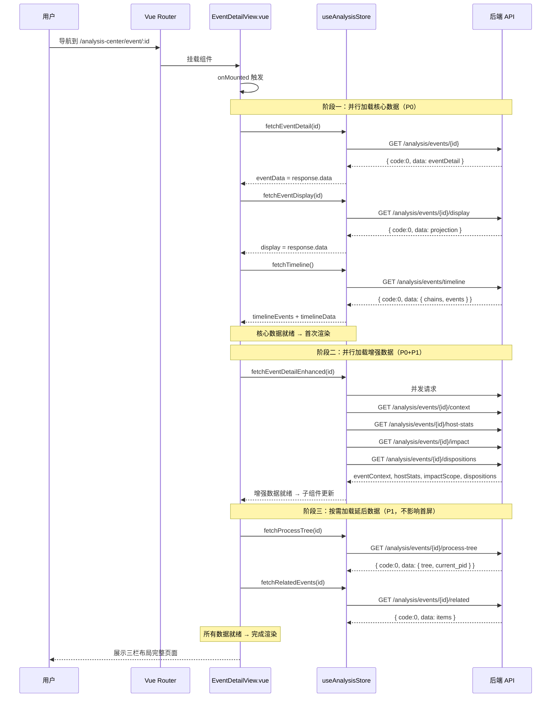
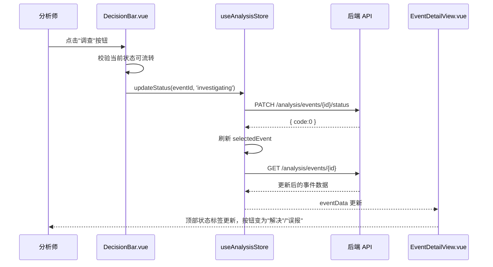
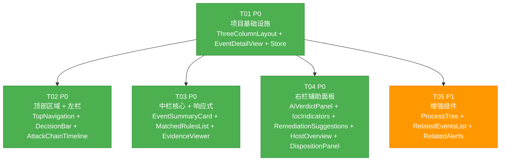

# 分析中心事件详情页三栏布局重构 — 架构设计文档

> **版本**: v1.0  
> **架构师**: 高见远（Bob）  
> **日期**: 2026-07  
> **状态**: 已评审  

---

## Part A：系统设计

---

### 1. 实现方案概述

#### 1.1 改造策略：继承式渐进替换（Inherit & Replace）

| 原则 | 说明 |
|------|------|
| **继承而非重写** | 保留现有 `EventDetailView.vue` 的 route entry、onMounted 数据加载骨架和 loading/error 状态管理，将 `<template>` 中的两列网格内容替换为新三栏组件 |
| **渐进替换** | 先用 `ThreeColumnLayout.vue` 容器包裹，然后逐个填充子组件；每个子组件可独立开发、独立测试 |
| **复用现有逻辑** | `EventDetailPanel.vue` 中已有大量成熟的数据渲染逻辑（IOC 展示、处置记录、进程树、AI 研判、主机概览等），新组件直接复用这些计算方式和 UI 模式，不重复造轮子 |
| **Store 优先** | 子组件通过 `useAnalysisStore()` 直接访问数据，而非层层 props 穿透；`EventDetailView.vue` 统一负责数据加载编排 |

#### 1.2 技术选型确认

| 技术 | 状态 | 说明 |
|------|------|------|
| Vue 3 Composition API | ✅ 已有 | 保持 `<script setup>` 模式 |
| Element Plus | ✅ 已有 | 仅用于少量基础组件（按钮、标签），不新增依赖 |
| Pinia | ✅ 已有 | `useAnalysisStore` 已完备，仅需新增少量 action |
| CSS Grid / Flexbox | ✅ 已有 | 三栏布局使用 CSS Grid + `overflow:hidden` 实现 |
| CSS Variables | ✅ 已有 | 复用现有 IR 设计系统的 color/font 变量 |
| 响应式设计 | ✅ 新增 | 使用 `@media (max-width: 1200px)` 降级为可展开侧边面板 |

#### 1.3 核心架构决策

| 决策 | 选项 | 选择理由 |
|------|------|---------|
| 数据加载模式 | 集中 vs 分散 | **集中**：`EventDetailView.vue` 统一管理所有 API 调用，子组件只负责渲染 |
| 组件通信 | Props vs Store | **Store 优先**：子组件通过 store 读取数据，减少 props 穿透 |
| 三栏滚动 | 整体 vs 独立 | **独立滚动**：左栏 `overflow-y:auto`、中栏 `overflow-y:auto`、右栏 `overflow-y:auto`，各自独立 |
| 响应式降级 | CSS 媒体查询 | 窄屏(<1200px)自动折叠左右栏为可展开 overlay 面板 |

---

### 2. 文件清单

#### 2.1 新建组件（15 个）

所有新建组件均放在 `frontend/src/components/analysis/` 目录下，与现有 `EventDetailPanel.vue` 平级。

```
frontend/src/components/analysis/
├── ThreeColumnLayout.vue           # 三栏布局容器（核心容器）
├── TopNavigation.vue               # 顶部导航栏
├── DecisionBar.vue                 # 决策操作栏
├── AttackChainTimeline.vue         # 左栏：攻击链时间线
├── EventSummaryCard.vue            # 中栏①：事件概要卡片
├── MatchedRulesList.vue            # 中栏②：命中规则列表
├── ProcessTree.vue                 # 中栏③：进程链树（P1）
├── EvidenceViewer.vue              # 中栏④：证据详情
├── RelatedEventsList.vue           # 中栏⑤：关联事件列表（P1）
├── AiVerdictPanel.vue             # 右栏①：AI 研判面板
├── IocIndicators.vue              # 右栏②：IOC 威胁指标
├── RelatedAlerts.vue              # 右栏③：关联告警（P1，待确认数据源）
├── RemediationSuggestions.vue      # 右栏④：处置建议
├── HostOverview.vue                # 右栏⑤：主机概况统计
└── DispositionPanel.vue            # 右栏⑥：处置记录（复用 EventDetailPanel 逻辑）
```

#### 2.2 修改文件（3 个）

```
frontend/src/views/EventDetailView.vue    # 入口改造：替换内容为三栏布局
frontend/src/stores/analysis.js           # 新增 action/getter（如有需要）
frontend/src/router/index.js              # 确认路由兼容（无需改动）
```

#### 2.3 文件总量

- 新建：15 个组件文件
- 修改：2 个（EventDetailView.vue + stores/analysis.js）
- 无需改动：router/index.js（现有路由 `analysis-center/event/:id` 完全兼容）
- **无需新增后端 API**：13 个现有端点完全满足需求

---

### 3. 数据结构与接口

#### 3.1 组件 Props / Emits 定义

```mermaid
classDiagram
    class ThreeColumnLayout {
        <<container>>
        +slots: left, center, right
        +responsiveBreakpoint: number = 1200
    }

    class TopNavigation {
        <<props>>
        +event: Object
        +caseInfo: Object
        <<emits>>
        +back()
        +viewCase(caseId)
    }

    class DecisionBar {
        <<props>>
        +event: Object
        +riskScore: number
        <<emits>>
        +updateStatus(status: string)
        +deepInvestigation()
    }

    class AttackChainTimeline {
        <<props>>
        +timelineEvents: Array
        +currentEventId: string
        +currentStage: string
        <<emits>>
        +selectEvent(eventId: string)
        +toggleStage(stage: string)
    }

    class EventSummaryCard {
        <<props>>
        +event: Object
        +frequency: Object
        <<emits>>
        +filterByHost(hostId: number)
    }

    class MatchedRulesList {
        <<props>>
        +rules: Array
    }

    class EvidenceViewer {
        <<props>>
        +evidenceViews: Object
        +eventType: string
        +processSubject: Object
        +networkSubject: Object
        +persistenceTarget: string
    }

    class ProcessTree {
        <<props>>
        +tree: Array
        +currentPid: number
        +loading: boolean
    }

    class RelatedEventsList {
        <<props>>
        +relatedIds: Array
        <<emits>>
        +viewEvent(eventId: string)
    }

    class AiVerdictPanel {
        <<props>>
        +aiVerdict: Object
        +aiAnalysis: string
    }

    class IocIndicators {
        <<props>>
        +iocs: Object
    }

    class RelatedAlerts {
        <<props>>
        +alerts: Array
    }

    class RemediationSuggestions {
        <<props>>
        +severity: string
    }

    class HostOverview {
        <<props>>
        +hostStats: Object
        +hostname: string
    }

    class DispositionPanel {
        <<props>>
        +dispositions: Array
        +eventId: string
        <<emits>>
        +addDisposition(comment: string)
    }

    TopNavigation --* ThreeColumnLayout : slot=top
    DecisionBar --* ThreeColumnLayout : slot=decision
    AttackChainTimeline --* ThreeColumnLayout : slot=left
    EventSummaryCard --* ThreeColumnLayout : slot=center-top
    MatchedRulesList --* ThreeColumnLayout : slot=center-mid
    ProcessTree --* ThreeColumnLayout : slot=center-mid2
    EvidenceViewer --* ThreeColumnLayout : slot=center-bottom
    RelatedEventsList --* ThreeColumnLayout : slot=center-bottom2
    AiVerdictPanel --* ThreeColumnLayout : slot=right-top
    IocIndicators --* ThreeColumnLayout : slot=right-mid
    RelatedAlerts --* ThreeColumnLayout : slot=right-mid2
    RemediationSuggestions --* ThreeColumnLayout : slot=right-mid3
    HostOverview --* ThreeColumnLayout : slot=right-mid4
    DispositionPanel --* ThreeColumnLayout : slot=right-bottom
```



**注意**：以上 Mermaid 类图展示逻辑归属关系。实际实现时，`EventDetailView.vue` 作为编排层，直接引用以上所有子组件，`ThreeColumnLayout.vue` 仅提供三栏 CSS 容器（通过具名 slot 分发内容）。`EventDetailView.vue` 承担组装的职责。

#### 3.2 Store 新增 Action / Getter

| 类型 | 名称 | 说明 | 优先级 |
|------|------|------|--------|
| Action | `fetchTimeline()` | **已有**（行 317），按需传入筛选参数获取攻击链时间线 | P0 |
| Action | `fetchRelatedEvents(eventId)` | **新增**：从 API 获取关联事件列表并存入 `relatedEvents` | P1 |
| Action | `fetchProcessTree(eventId)` | **新增**：封装 `process-tree` API 调用，存入 `processTree` | P1 |
| Getter | `timelineByStage` | **新增**：将 `timelineEvents` 按 `attack_stage` 字段聚合为 `{stage: events[]}` 结构 | P0 |
| Getter | `currentStageEvents` | **新增**：返回当前事件所在阶段的时间线事件列表 | P0 |
| State | `relatedEvents` | **新增**：关联事件列表（数组） | P1 |
| State | `processTree` | **新增**：进程树数据（数组） | P1 |
| State | `processTreeLoading` | **新增**：进程树加载状态 | P1 |

#### 3.3 关键数据流接口

```typescript
// 攻击链时间线聚合结构（前端计算）
interface TimelineByStage {
  [stage: string]: {
    stage: string
    stageLabel: string
    events: Array<{
      id: string
      event_type: string
      severity: string
      timestamp: string
      summary?: string
      attack_chain_id?: string
    }>
    count: number
    isCurrent: boolean  // 当前事件所在阶段
  }
}

// AI 研判数据结构（已有，确认标准化）
interface AiVerdict {
  label: 'recommended' | 'suspicious' | 'false_positive' | 'benign' | 'unknown'
  confidence: number     // 0-100
  action: 'isolate' | 'kill_process' | 'block_ip' | 'review'
  reason: string
  attack_type?: string
  t_code?: string
}

// 事件基础数据关键字段（getEventDetail 返回值）
interface EventDetail {
  id: string
  timestamp: string
  host_id: number
  hostname: string
  ip_address: string
  event_type: string
  severity: string
  source_collector: string
  attack_chain_id: string
  attack_stage: string
  status: string
  assignee: string
  case_id?: number
  case_name?: string
  case_number?: string
  ai_verdict?: AiVerdict | string
  ai_analysis?: string
  iocs?: IocCollection
  matched_rules?: MatchedRule[]
  frequency?: EventFrequency
  related_events?: string[]
  evidence?: object
}
```

---

### 4. 组件调用关系

#### 4.1 组件树

```
EventDetailView.vue                    ← 全屏详情页入口（数据加载编排）
├── TopNavigation.vue                  ← 导航栏
├── DecisionBar.vue                    ← 决策操作栏
└── ThreeColumnLayout.vue              ← 三栏 CSS 容器
    ├── [left] AttackChainTimeline.vue       ← 左栏：攻击链时间线
    ├── [center]                          ← 中栏（flex: 1，独立滚动）
    │   ├── EventSummaryCard.vue            ← ① 事件概要卡片
    │   ├── MatchedRulesList.vue            ← ② 命中规则列表
    │   ├── ProcessTree.vue                 ← ③ 进程链树 [P1]
    │   ├── EvidenceViewer.vue              ← ④ 证据详情
    │   └── RelatedEventsList.vue           ← ⑤ 关联事件列表 [P1]
    └── [right]                           ← 右栏（320px，独立滚动）
        ├── AiVerdictPanel.vue              ← ① AI 研判面板
        ├── IocIndicators.vue               ← ② IOC 威胁指标
        ├── RelatedAlerts.vue               ← ③ 关联告警 [P1/待确认]
        ├── RemediationSuggestions.vue       ← ④ 处置建议
        ├── HostOverview.vue                 ← ⑤ 主机概况统计
        └── DispositionPanel.vue             ← ⑥ 处置记录
```

#### 4.2 组件职责矩阵

| 组件 | 数据来源 | 计算逻辑 | 交互行为 |
|------|---------|---------|---------|
| TopNavigation | eventData (store) | 格式化 ID/时间 | 返回、跳转案件 |
| DecisionBar | eventData (store) | riskScore 颜色、状态标签 | 状态流转、深度调查 |
| AttackChainTimeline | timelineData (store) | 按 stage 聚合、高亮当前 | 展开/折叠、跳转事件 |
| EventSummaryCard | eventData, frequency (store) | 字段格式化 | 按主机筛选 |
| MatchedRulesList | matched_rules (store) | 规则排序 | 展开更多 |
| EvidenceViewer | display.evidence_views (store) | 范式化/原始视图切换 | 切换模式 |
| ProcessTree | processTree (store) | 树形缩进、当前高亮 | — |
| RelatedEventsList | related_events (store) | ID 截断 | 点击跳转 |
| AiVerdictPanel | event.ai_verdict (store) | JSON 解析、标签映射 | 展开分析原文 |
| IocIndicators | event.iocs (store) | 按类型分组 | 复制、VT 打开 |
| RelatedAlerts | alerts (store/待确认) | — | 点击查看 |
| RemediationSuggestions | event.severity (store) | 严重度映射为建议文案 | — |
| HostOverview | hostStats (store) | 数字格式化 | — |
| DispositionPanel | dispositions (store) | 时间格式化 | 添加备注 |

---

### 5. 数据加载流程

#### 5.1 页面加载时序



#### 5.2 三阶段加载策略

| 阶段 | 加载内容 | 优先级 | 影响面 |
|------|---------|--------|--------|
| **阶段一**（核心） | `getEventDetail` + `getEventDisplay` + `getTimeline` | P0 | 左栏 + 中栏 + 顶部全部就绪 |
| **阶段二**（增强） | `fetchEventDetailEnhanced`（context+hostStats+impact+dispositions） | P0 | 右栏 AI/主机/处置就绪 |
| **阶段三**（延后） | `getProcessTree` + `getRelatedEvents` | P1 | 进程树 + 关联事件，不阻塞首屏 |

#### 5.3 状态流转流程



---

### 6. 待明确事项

| # | 问题 | 影响范围 | 建议/假设 |
|---|------|---------|----------|
| Q1 | **关联告警数据源**：`related_events` 字段是否已包含告警 ID？ | 右栏③ RelatedAlerts | **假设**：当前 `related_events` 仅含事件 ID，不含告警。RelatedAlerts 在数据不可用时降级隐藏，不影响 MVP |
| Q2 | **AI 研判数据结构**：`ai_verdict` 是标准化 JSON 还是字符串？ | 右栏① AiVerdictPanel | **已确认**：从 `EventDetailPanel.vue` 代码可见（行 596-601），`ai_verdict` 兼容 JSON 对象和 JSON 字符串两种格式，新组件照此处理 |
| Q3 | **窄屏断点值**：1200px 是否合理？ | 整体响应式 | **假设**：采用 1200px 作为断点，低于此宽度时左右栏折叠为可展开 overlay |
| Q4 | **状态流转权限**：是否需要根据角色控制按钮显示？ | DecisionBar | **假设**：当前不做权限控制，所有状态流转按钮直接显示。后续可通过 `event.assignee` 或角色判断 |
| Q5 | **攻击链时间线数据范围**：时间线数据是全局还是针对当前案件？ | 左栏 AttackChainTimeline | **假设**：`getTimeline` 已根据 `buildParams()` 中的筛选参数（案件/主机）过滤数据，新组件直接复用 |
| Q6 | **ProcessTree 组件**：EventDetailPanel 中有进程树逻辑，是提取为新组件还是保持内联？ | 中栏③ | **方案**：提取为独立 `ProcessTree.vue` 组件，复用 EventDetailPanel 中的渲染逻辑 |
| Q7 | **事件详情侧边面板是否也需改造**：EventDetailPanel.vue 是否同步改三栏？ | 实施范围 | **结论**：本次仅改造全屏详情页 `EventDetailView.vue`，侧边面板 `EventDetailPanel.vue` 保持现有逻辑不变 |

---

## Part B：任务分解

---

### 7. 依赖包列表

**无需新增任何第三方依赖。** 现有技术栈完全满足：

| 包名 | 用途 | 来源 |
|------|------|------|
| `vue@^3` | 框架 | 已有 |
| `element-plus` | UI 组件库（按钮、标签、消息提示） | 已有 |
| `pinia` | 状态管理 | 已有 |
| `vue-router` | 路由 | 已有 |
| `axios` | HTTP 请求（封装于 `@/api/index`） | 已有 |

---

### 8. 任务列表

#### T01：项目基础设施 — 三栏布局容器 + 数据加载 + 入口改造 【P0】

| 属性 | 值 |
|------|-----|
| **任务 ID** | T01 |
| **任务名称** | 项目基础设施 — 三栏布局容器 + EventDetailView 入口改造 |
| **源文件** | `ThreeColumnLayout.vue`（新建）、`EventDetailView.vue`（修改）、`stores/analysis.js`（修改） |
| **依赖** | 无（基础任务） |
| **优先级** | P0 |

**实施内容**：

1. **`ThreeColumnLayout.vue`**（新建）
   - 实现 CSS Grid 三栏布局：左栏 280px + 中栏 flex:1 + 右栏 320px
   - 提供三个具名 slot：`left`、`center`、`right`
   - 实现独立滚动：左右中各自 `overflow-y: auto`
   - 实现响应式降级：`@media (max-width: 1200px)` 时左右栏隐藏为 overlay 面板
   - 左右栏各有折叠/展开按钮
   - 遵循现有 IR 设计系统（CSS 变量、间距、圆角）

2. **`EventDetailView.vue`**（修改）
   - 保留路由入口 `route.params.id` 获取
   - 保留 `onMounted` 数据加载编排
   - 保留 loading/error 状态管理
   - **删除**：现有两列网格模板（`.edv-grid`）、AI 研判区块内联模板
   - **替换为**：`TopNavigation` + `DecisionBar` + `ThreeColumnLayout`
   - 实现三阶段数据加载（见第 5 节时序图）

3. **`stores/analysis.js`**（修改）
   - 新增 getter：`timelineByStage`（按 `attack_stage` 聚合时间线数据）
   - 新增 getter：`currentStageEvents`（当前事件所在阶段的事件列表）
   - 新增 state：`relatedEvents`、`processTree`、`processTreeLoading`
   - 新增 action：`fetchRelatedEvents(eventId)`、`fetchProcessTree(eventId)`

---

#### T02：顶部区域 + 左栏攻击链时间线 【P0】

| 属性 | 值 |
|------|-----|
| **任务 ID** | T02 |
| **任务名称** | 顶部导航栏 + 决策操作栏 + 左栏攻击链时间线 |
| **源文件** | `TopNavigation.vue`（新建）、`DecisionBar.vue`（新建）、`AttackChainTimeline.vue`（新建） |
| **依赖** | T01 |
| **优先级** | P0 |

**实施内容**：

1. **`TopNavigation.vue`**（新建）
   - 返回按钮（`← 返回分析中心`）
   - 案件信息（案件名称/编号，可点击跳转）
   - 事件元信息（ID 简写、时间戳、主机名、采集器来源）
   - 复用现有 `EventDetailView.vue` 中 `edv-topbar` 的样式模式

2. **`DecisionBar.vue`**（新建）
   - 严重度徽章（critical/high/medium/low/info 颜色映射）
   - 风险评分（0-100，颜色分段：>=70 红, >=50 橙, >=30 蓝）
   - ATT&CK 阶段标签
   - 状态标签（待处理/分诊中/调查中/已解决/已误报）
   - 状态流转按钮（根据当前状态动态显示）
   - 深度调查按钮
   - 从现有 `EventDetailPanel.vue` 和 `EventDetailView.vue` 中提取样式和逻辑

3. **`AttackChainTimeline.vue`**（新建）
   - 标题"攻击链时间线"
   - 按 MITRE ATT&CK 阶段（12 阶段）从上到下展示
   - 每阶段显示：图标 + 中文标签 + 事件数量徽章 + 关键活动摘要
   - 当前事件所在阶段高亮
   - 使用 store getter `timelineByStage` 聚合数据
   - 基础交互：点击阶段展开/折叠（P0 版本默认展开当前阶段，其他阶段折叠）
   - 事件列表中的事件点击通过 emit 通知父组件跳转

---

#### T03：中栏核心组件 + 响应式降级 【P0】

| 属性 | 值 |
|------|-----|
| **任务 ID** | T03 |
| **任务名称** | 中栏核心组件 — 事件概要 + 命中规则 + 证据详情 + 响应式降级 |
| **源文件** | `EventSummaryCard.vue`（新建）、`MatchedRulesList.vue`（新建）、`EvidenceViewer.vue`（新建）、`ThreeColumnLayout.vue`（修改-响应式） |
| **依赖** | T01 |
| **优先级** | P0 |

**实施内容**：

1. **`EventSummaryCard.vue`**（新建）
   - 事件类型（中文标签）、时间戳、主机名（可点击筛选）、采集器来源
   - 攻击链 ID
   - 同类事件频率统计（首次/最近/总次数/影响主机数）
   - 父进程、文件哈希（含复制/VT 打开）、签名状态（按事件类型条件显示）
   - 从 `EventDetailPanel.vue` 的"基本信息"区块提取渲染逻辑

2. **`MatchedRulesList.vue`**（新建）
   - 规则列表：名称、严重度徽章、描述、置信度
   - 无匹配规则时显示"无匹配规则（基于模型推断）"
   - 超过 3 条规则时显示"查看更多"折叠展开
   - 复用 `EventDetailView.vue` 中 `.edv-rule-item` 的样式模式

3. **`EvidenceViewer.vue`**（新建）
   - 范式化视图与原始数据视图切换按钮
   - 范式化视图：按字段名-值网格展示
   - 原始视图：JSON 展示 + 数据来源标记
   - 自适应主体：按事件类型显示进程主体/网络主体/持久化落点
   - 复用 `EventDetailPanel.vue` 的证据双视图逻辑（`toggleEvidenceView`）
   - 复用自适应主体的条件渲染逻辑（`processSubject`/`networkSubject`/`persistenceTarget`）

4. **`ThreeColumnLayout.vue`**（修改 - 响应式降级）
   - 实现 `< 1200px` 断点的响应式降级
   - 左右栏折叠为侧边抽屉（overlay 面板）
   - 添加折叠/展开按钮的交互
   - 确保降级后内容可用

---

#### T04：右栏 AI 研判 + 辅助信息面板 【P0】

| 属性 | 值 |
|------|-----|
| **任务 ID** | T04 |
| **任务名称** | 右栏 AI 研判 + IOC 指标 + 处置建议 + 主机概况 + 处置记录 |
| **源文件** | `AiVerdictPanel.vue`（新建）、`IocIndicators.vue`（新建）、`RemediationSuggestions.vue`（新建）、`HostOverview.vue`（新建）、`DispositionPanel.vue`（新建） |
| **依赖** | T01 |
| **优先级** | P0 |

**实施内容**：

1. **`AiVerdictPanel.vue`**（新建）
   - AI 结论标签（推荐/待复核/误报/良性 颜色徽章）
   - 置信度百分比（>=80% 红色高置信，>=60% 橙色中等）
   - MITRE 技术标签（T-code 紫色样式）
   - 攻击类型标签
   - 建议动作标签（隔离主机/结束进程/封锁IP/人工复核）
   - 研判理由文字
   - AI 分析原文（可展开/折叠）
   - 从 `EventDetailView.vue` 的 AI 区块和 `EventDetailPanel.vue` 的 AI 区块提取合并

2. **`IocIndicators.vue`**（新建）
   - 按类型分组展示：IP 地址、SHA256、域名、MD5、文件路径
   - 每个 IOC 可点击复制
   - 哈希值显示 VT 打开按钮
   - 复用 `EventDetailPanel.vue` 的 IOC 展示逻辑（`ioc-chip` 样式 + `copyText` + `openVT`）

3. **`RemediationSuggestions.vue`**（新建）
   - 根据严重度动态生成建议文案
   - Critical/High：隔离主机、终止进程、取证
   - Medium：确认业务操作
   - Low/Info：归档记录
   - 复用 `EventDetailPanel.vue` 的 `suggestion-text` 模板

4. **`HostOverview.vue`**（新建）
   - 24h 事件总数
   - 规则命中数
   - 活跃告警数
   - 上次处置记录（时间、操作人、备注）
   - 复用 `EventDetailPanel.vue` 的 `host-stat-grid` 和 `last_disposition` 渲染逻辑

5. **`DispositionPanel.vue`**（新建）
   - 处置记录列表（操作人、动作、备注、时间）
   - 快速添加备注输入框 + 发送按钮
   - 复用 `EventDetailPanel.vue` 的处置记录逻辑（`disp-list` + `disp-input-wrap`）
   - 通过 emit 通知父组件调用 store `addDispositionForEvent`

---

#### T05：P1 增强组件 — 进程树 + 关联事件 + 关联告警 【P1】

| 属性 | 值 |
|------|-----|
| **任务 ID** | T05 |
| **任务名称** | P1 增强组件 — 进程链树 + 关联事件列表 + 关联告警 |
| **源文件** | `ProcessTree.vue`（新建）、`RelatedEventsList.vue`（新建）、`RelatedAlerts.vue`（新建） |
| **依赖** | T01 |
| **优先级** | P1 |

**实施内容**：

1. **`ProcessTree.vue`**（新建）
   - 树形结构展示进程父子关系（深度缩进）
   - 当前进程高亮
   - 每个节点：进程名、PID、命令行（截断）
   - loading 状态
   - 复用 `EventDetailPanel.vue` 的 `proc-tree` 渲染逻辑

2. **`RelatedEventsList.vue`**（新建）
   - 关联事件 ID 列表（简写）
   - 事件类型、时间、严重度
   - 点击触发 `viewEvent` emit 跳转到该事件

3. **`RelatedAlerts.vue`**（新建）
   - 关联告警列表（如数据可用）
   - 告警名称、时间、严重度
   - 数据不可用时显示"暂无关联告警"或完全隐藏
   - **注意**：此组件依赖 Q1 待确认（数据源是否存在），可降级为占位符

---

### 9. 任务依赖关系图



**依赖说明**：
- T01 是所有任务的基础，必须先完成
- T02/T03/T04/T05 均仅依赖 T01，彼此之间无顺序依赖关系
- 实施时建议按 **T01 → T02/T03/T04 并行 → T05** 的顺序进行
- 每个任务完成后即可独立验证该区域功能

---

### 10. 共享知识

#### 10.1 命名规范

| 规范 | 规则 |
|------|------|
| 组件名 | PascalCase（如 `ThreeColumnLayout.vue`） |
| 组件引用 | kebab-case 在模板中（`<three-column-layout>`） |
| 文件路径 | 全部小写 + 连字符（如 `event-summary-card.vue`） |
| Props | camelCase |
| Emits | kebab-case（如 `@update-status`） |
| CSS 类名 | 组件前缀 + kebab-case（如 `attack-timeline__stage`） |
| Store 状态 | camelCase |
| Store 动作 | fetch + 名词（如 `fetchEventDetailEnhanced`） |
| CSS 变量 | 复用现有 `var(--color-*)` 系统，不引入新颜色变量 |

#### 10.2 CSS 约定

- **布局**：使用 CSS Grid 实现三栏，左栏 280px / 中栏 1fr / 右栏 320px
- **间距**：遵循 8px 基数（8/12/16/20/24px）
- **圆角**：卡片 10px，按钮 6px，标签 4px，使用 `var(--r-btn)` 等现有变量
- **颜色**：完全复用现有 IR 设计系统的 CSS 变量，不新增硬编码颜色
- **滚动**：左右中三栏独立滚动，容器本身 `overflow: hidden`
- **响应式**：`@media (max-width: 1200px)` 断点，左右栏折叠为 overlay

#### 10.3 API 约定

- 所有 API 响应格式：`{ code: 0, data: {...} }`
- 错误时：`{ code: -1, message: "..." }`
- 认证方式：Bearer token（通过 `window.__token` 或 request 拦截器注入）
- 所有时间戳使用 ISO 8601 格式（后端返回已是该格式）

#### 10.4 数据加载约定

- **三阶段加载**：阶段一（核心数据，阻塞渲染）→ 阶段二（增强数据，不影响首屏）→ 阶段三（延后数据，P1 功能）
- **错误容错**：每个 API 调用独立 try-catch，单个接口失败不影响其他区域
- **加载状态**：`EventDetailView.vue` 管理顶层 loading/error，子组件只负责显示 store 内的数据
- **空状态**：每个列表类组件需处理空数据场景（显示"暂无数据"占位符）

#### 10.5 现有逻辑复用清单

| 现有代码位置 | 可复用逻辑 | 目标组件 |
|-------------|-----------|---------|
| `EventDetailView.vue` | AI 研判解析（`aiVerdict` computed、`aiVerdictLabel` 等） | `AiVerdictPanel.vue` |
| `EventDetailView.vue` | `stageLabel()`、`statusLabel()`、`riskScoreColor()` | `DecisionBar.vue`、`AttackChainTimeline.vue` |
| `EventDetailView.vue` | 证据双视图切换（`toggleEvidence`） | `EvidenceViewer.vue` |
| `EventDetailPanel.vue` | IOC 展示（`ioc-chip`、`copyText`、`openVT`） | `IocIndicators.vue` |
| `EventDetailPanel.vue` | 进程树渲染（`proc-tree` 模板） | `ProcessTree.vue` |
| `EventDetailPanel.vue` | 处置建议文案 | `RemediationSuggestions.vue` |
| `EventDetailPanel.vue` | 主机概览 `host-stat-grid` | `HostOverview.vue` |
| `EventDetailPanel.vue` | 处置记录 `disp-list` + `disp-input-wrap` | `DispositionPanel.vue` |
| `EventDetailPanel.vue` | 规则列表渲染 | `MatchedRulesList.vue` |

#### 10.6 响应式设计行为

| 屏幕宽度 | 布局行为 |
|----------|---------|
| `>= 1200px` | 三栏完整展示（左 280px + 中 flex:1 + 右 320px） |
| `< 1200px` | 左右栏隐藏，中栏占满；顶部出现"显示左栏"/"显示右栏"按钮 |
| `< 1200px` 点击左栏按钮 | 左栏以 overlay 形式从左侧滑入（半透明遮罩 + 280px 面板） |
| `< 1200px` 点击右栏按钮 | 右栏以 overlay 形式从右侧滑入（半透明遮罩 + 320px 面板） |

---

### 11. 实施建议

1. **开发顺序**：T01 → T02/T03/T04 可并行开发 → T05（各任务间无顺序依赖，仅依赖 T01）
2. **验证方法**：每个任务完成后，在浏览器中打开 `/analysis-center/event/:id` 验证对应区域
3. **测试要点**：
   - 三栏布局在不同屏幕宽度下的表现（1200px+ / <1200px）
   - 左右栏独立滚动
   - 状态流转交互流程（待处理→分诊→调查→解决/误报→重开）
   - 数据加载异常处理（mock 接口超时/返回空数据）
   - 攻击链时间线高亮准确度
   - AI 研判数据兼容 JSON 对象和字符串两种格式
4. **无需后端改造**：全部为前端改造，13 个现有 API 端点完全复用
5. **存量兼容**：`EventDetailPanel.vue` 侧边面板保持原样，不影响分析中心列表页功能
