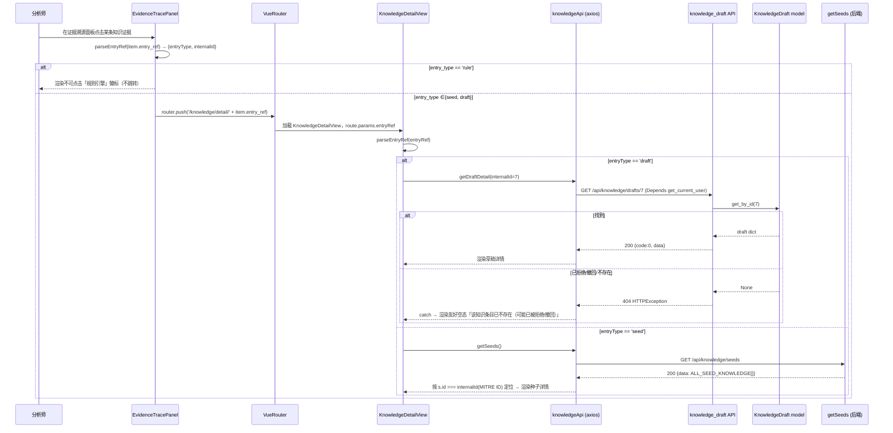

# 增量架构设计：AI 分析证据可点击溯源（knowledge_evidence → 知识库详情）

> 范围：IR Platform 知识库子系统「AI 分析证据可点击溯源」增量功能。
> 目标：证据溯源面板每条 `knowledge_evidence` 携带唯一 `entry_ref`，前端点击跳转到该知识条目详情，打通「AI 分析 → 知识库」可解释闭环，区分「内置种子 / AI 建议草稿 / 规则引擎」。
> 原则：**最小变更、沿用现有范式、不动 chroma 文档 ID 约定与鉴权/索引逻辑、不写代码只出设计**。

---

## 0. 实现方案 + 框架选型

- **技术栈完全沿用**：后端 FastAPI + 现有 SQLite 数据访问层；前端 Vue3 + Element Plus + Pinia + Vue Router + Axios + ECharts。**无新增第三方依赖**。
- **核心改动是「字段透传 + 两个前端页面」**，不涉及新算法、新存储、新鉴权。
- **`explainability_service.build_evidence_trace` 经确认【无需修改】**：该函数（explainability_service.py L370-372）对每条 knowledge item 仅做 `dict(item)` 浅拷贝后追加进 `knowledge_evidence`，因此只要 `_vector_retrieve` / `_keyword_retrieve` 产出的结构化 dict 里带上 `entry_ref` / `entry_type`，字段会自动透传至前端，前后端只需对齐字段名即可。
- **不新增种子详情接口**：种子详情复用现有 `GET /api/knowledge/seeds`（返回 `ALL_SEED_KNOWLEDGE` 数组，每项含 `id` = MITRE ID），前端按 `entry_ref` 解析出的 MITRE id 在客户端 `seedList` 中定位。
- **新增草稿详情接口**：`GET /api/knowledge/drafts/{draft_id}`，底层 `KnowledgeDraft.get_by_id(id)` 已存在，纯透传封装 + 404 处理，成本低。

---

## 1. 文件列表（新建 + 修改，区分）

### 新建
| 文件 | 说明 |
|---|---|
| `frontend/src/views/KnowledgeDetailView.vue` | 新建知识条目详情页（承接 `knowledge/detail/:entryRef` 路由） |

> 注：前端 api 封装 **不新建文件**，在现有 `frontend/src/api/knowledge.js` 内新增 `getDraftDetail(id)`（与既有 `getSeeds` / `approveDraft` 同一文件，符合同范式）。

### 修改
| 文件 | 行号锚点 | 改动 |
|---|---|---|
| `backend/app/services/knowledge_retriever.py` | `_vector_retrieve` L849-888；`_keyword_retrieve` L938-1069 | 两检索分支的结构化 dict 增量追加 `entry_ref` / `entry_type` |
| `backend/app/api/knowledge_draft.py` | 紧接 `list_seeds` L114-124 之后 | 新增 `GET /api/knowledge/drafts/{draft_id}` |
| `frontend/src/components/ai/EvidenceTracePanel.vue` | template L7-17；script L27-40 | 证据卡片可点击化；`rule` 渲染不可点击徽标 |
| `frontend/src/router/index.js` | children 数组 L15-66，紧接 `knowledge` 路由 L61-65 之后 | 新增 `knowledge/detail/:entryRef` 路由（sibling，复用 AppLayout） |
| `frontend/src/api/knowledge.js` | 紧接 `getSeeds` L10-12 之后 | 新增 `getDraftDetail(id)` |

---

## 2. 数据结构与接口（JSON schema / 约定）

### 2.1 `knowledge_evidence` 单条结构（完整字段，标注来源）

由 `KnowledgeRetriever._vector_retrieve` / `_keyword_retrieve` 在 `structured=True` 时产出，经 `ExplainabilityService.build_evidence_trace` 浅拷贝透传。

| 字段 | 类型 | 来源 / 说明 |
|---|---|---|
| `source` | string | `"vector"`（向量分支）或 `"keyword"`（关键词分支），retriever 现有产出 |
| `rule_name` | string | retriever 现有产出 |
| `title` | string | = `rule_name`，现有产出 |
| `severity` | string | retriever 现有产出（low/medium/high/critical） |
| `category` | string | retriever 现有产出 |
| `description` | string | retriever 现有产出 |
| `summary` | string | = `description`，现有产出 |
| `formatted_text` | string | 形如 `[cat/sev] name: desc`，现有产出 |
| `score` | float | retriever 现有产出 |
| `confidence` | string | `"high"` / `"medium"`，现有产出 |
| `match_reason` | string | `"语义相似检索命中"` / `"关键词匹配回退命中"`，现有产出（P1 hover 展示） |
| `tags` | string[] | `[category, severity]`，现有产出 |
| `evidence_text` | string | = `formatted_text`，现有产出 |
| **`entry_ref`** | **string** | **【新增】唯一标识，沿用 chroma 文档 ID 约定**：`seed_{i}_{mitre_id}`（例 `seed_4_T1071`）、`draft_{numeric_id}`（例 `draft_7`）、`rule_{i}_{name}`（例 `rule_3_T1059`）。向量分支直接取 `ids_list[i]`；关键词分支按分支拼装。 |
| **`entry_type`** | **enum["seed","draft","rule"]** | **【新增】由 `entry_ref` 前缀派生**：`seed_`→`seed`、`draft_`→`draft`、`rule_`→`rule`。 |

> `entry_ref` / `entry_type` 缺失（旧数据或未命中三分支的 C2 签名项）时，前端按「不可点击纯文本」降级渲染，保证向后兼容。

### 2.2 `GET /api/knowledge/drafts/{draft_id}`

**请求**
- Method / Path：`GET /api/knowledge/drafts/{draft_id}`
- Path param：`draft_id: int`（即 `entry_ref` 解析出的数字 id，如 `draft_7` → `7`）
- Auth：`Depends(get_current_user)`（与 knowledge_draft.py 现有 8 个路由一致）

**响应 200**
```json
{
  "code": 0,
  "data": {
    "id": 7,
    "host_id": "..." ,
    "analysis_report_id": 12,
    "title": "新增恶意软件 XYZ",
    "description": "该样本通过...",
    "category": "malware_behavior",
    "severity": "high",
    "mitre_attack": "T1059",
    "pattern": "beacon,...",
    "status": "approved",
    "source": "ai_suggest",
    "raw_ioc": null,
    "created_at": "2026-07-06 10:00:00",
    "reviewed_at": "2026-07-06 11:00:00"
  },
  "message": "success"
}
```

**响应 404**（注意：这是 FastAPI `HTTPException(status_code=404)`，axios 以 HTTP 错误（非 `{code,data,message}` 包裹）返回，前端需走 `catch` 分支）
```
HTTP 404
{ "detail": "知识草稿 7 不存在" }
```

### 2.3 前端路由 `knowledge/detail/:entryRef` props 解析约定

- 路由参数：`route.params.entryRef`（完整字符串，如 `seed_4_T1071` / `draft_7` / `rule_3_T1059`）。
- 解析函数（前端实现，前后端双写需一致）：
  ```js
  // entryRef → { entryType, internalId }
  // seed_4_T1071  → { entryType:'seed',  internalId:'T1071' }   // 内部 id = MITRE ID
  // draft_7        → { entryType:'draft', internalId:'7' }        // 内部 id = 数字
  // rule_3_T1059  → { entryType:'rule',  internalId:'3_T1059' }// 不可点击，仅展示徽标
  const [prefix, ...rest] = entryRef.split('_')
  if (prefix === 'seed')  return { entryType:'seed',  internalId: rest.slice(1).join('_') }
  if (prefix === 'draft') return { entryType:'draft', internalId: rest.join('_') }
  if (prefix === 'rule')  return { entryType:'rule',  internalId: rest.join('_') }
  return { entryType:'unknown', internalId:'' }
  ```
- `seed` → 调 `getSeeds()` 后按 `seedList.find(s => s.id === internalId)` 定位（MITRE ID 匹配）。
- `draft` → 调 `getDraftDetail(internalId)`（数字）。
- `rule` → 不请求，渲染「规则引擎」徽标 + 跳转 `/rules` 入口。

---

## 3. 调用流程（时序图 Mermaid）

见 `docs/incremental_sequence.mermaid`（同时下面内联一份）。



---

## 4. 任务列表（有序、含依赖、按实现顺序）

> 以下任务编号与团队主理人拍板的顺序一致；依赖前驱均为「字段契约 / 接口契约」层面的依赖，可并行开发但联调需前驱就绪。

| 任务 | 名称 | 主要文件 | 依赖前驱 | 优先级 |
|---|---|---|---|---|
| **T1** | 后端 `entry_ref`/`entry_type` 透传（knowledge_retriever 两分支） | `knowledge_retriever.py` | 无 | P0 |
| **T2** | 后端新增草稿详情接口 `GET /api/knowledge/drafts/{draft_id}` | `knowledge_draft.py` | 无（`get_by_id` 已存在） | P0 |
| **T3** | 前端 api 封装 `getDraftDetail(id)` | `knowledge.js` | T2（接口契约） | P0 |
| **T4** | 前端 `EvidenceTracePanel` 可点击化（点击跳转 + rule 徽标） | `EvidenceTracePanel.vue` | T1（需 `entry_ref`/`entry_type` 字段） | P0 |
| **T5** | 前端路由 + `KnowledgeDetailView` 详情页 | `router/index.js`、`KnowledgeDetailView.vue` | T3 | P0 |
| **T6** | 前后端字段联调（entry_ref 一致性校验 + 404 空态验证 + P1 来源徽标/hover） | 上述全部 | T1,T2,T3,T4,T5 | P0（P1 部分可后置） |

**T1 具体改动点（供工程师直接落地）**
- `_vector_retrieve`（L849-888，`if structured:` 块内）：在循环体取 `entry_ref = ids_list[i]`、`entry_type` 按前缀 `seed_`/`draft_`/`rule_` 派生，写进结构化 dict（与现有 `source/rule_name/...` 同层）。
- `_keyword_retrieve`（L938-1069）：把 `scored.append((score, text))` 的三处（rule L974 / seed L1022 / C2 L1029）改为四元组 `(score, text, src_type, entry_ref)`，并在末尾结构化构造处（L1035-1069）按 `entry_ref` 非空注入 `entry_ref`/`entry_type`。其中：
  - **rule 分支**：`f"rule_{i}_{rule_name}"`（i 为 `enumerate(rules)` 索引，须与 `_build_index` L265 一致）。
  - **seed 分支**：`seed.get("id")` 若是 `draft_` 前缀 → `entry_ref = seed["id"]`、`entry_type="draft"`；否则 `entry_ref = f"seed_{i}_{seed_id}"`、`entry_type="seed"`（i 为 `enumerate(seeds)` 索引，前 10 项与 chroma `seed_0..9` 对齐）。
  - **C2 签名分支**：`entry_ref=None`（不进入知识库，前端按不可点击纯文本渲染）。

**T2 具体改动点**
- 紧接 `list_seeds`（L114-124）之后新增：
  ```python
  @router.get("/drafts/{draft_id}")
  def get_draft_detail(draft_id: int, current_user: dict = Depends(get_current_user)):
      draft = KnowledgeDraft.get_by_id(draft_id)
      if not draft:
          raise HTTPException(status_code=404, detail=f"知识草稿 {draft_id} 不存在")
      return {"code": 0, "data": draft, "message": "success"}
  ```
- 路由 `GET /drafts/{draft_id}` 与既有 `POST /drafts/{draft_id}/approve` 路径不冲突，无需调整路由顺序。

**T3 具体改动点**
- 紧接 `getSeeds`（L10-12）之后新增：
  ```js
  /** 获取单条知识草稿详情（供证据溯源跳转） */
  getDraftDetail(id) {
    return request.get(`/knowledge/drafts/${id}`)
  },
  ```

**T4 具体改动点**
- `EvidenceTracePanel.vue`：引入 `useRouter`；`knowledge_evidence` 卡片根据 `item.entry_type`：
  - `seed`/`draft` → 可点击，`@click="goDetail(item)"`，`goDetail` 内 `router.push('/knowledge/detail/' + item.entry_ref)`。
  - `rule` → 不可点击，渲染「规则引擎」徽标。
  - `entry_ref` 缺失 → 兼容旧数据，按不可点击纯文本渲染。

**T5 具体改动点**
- `router/index.js`：在 AppLayout `children` 数组（L15-66）中、`knowledge` 路由（L61-65）之后新增 sibling 路由：
  ```js
  {
    path: 'knowledge/detail/:entryRef',
    name: 'KnowledgeDetail',
    component: () => import('@/views/KnowledgeDetailView.vue')
  },
  ```
- `KnowledgeDetailView.vue`（新建）：`route.params.entryRef` → `parseEntryRef` → 按 `entryType` 走 draft / seed / rule 三分支；404 / 未命中渲染友好空态（文案见 §2.2 / §3）。

---

## 5. 依赖包列表

**无新增依赖。** 后端沿用 FastAPI / pydantic / chromadb / sentence-transformers；前端沿用 Vue3 / Element Plus / Pinia / Vue Router / Axios / ECharts。所有改动在现有范式内完成。

---

## 6. 共享知识（跨文件约定，关键）

1. **`entry_ref` 生成规则（后端两分支必须与 chroma 文档 ID 完全一致，这是前端能定位种子的前提）**
   - `_vector_retrieve`：**直接** `entry_ref = ids_list[i]`（chroma 返回的文档 ID 本身即 `seed_*`/`draft_*`/`rule_*`）。
   - `_keyword_retrieve`：
     - rule 分支：`f"rule_{i}_{rule_name}"`（i 与 `_build_index` L265 同序）。
     - seed 分支（纯种子）：`f"seed_{i}_{seed_id}"`（seed_id = `seed.get("id")` = MITRE ID）。
     - draft 分支（来自 `get_as_seed_entries`，其 `id` 形如 `draft_7`）：`entry_ref = draft["id"]`。
   - 已批准草稿进入 chroma 时 doc_id 取 `draft_{numeric_id}`（knowledge_draft.get_as_seed_entries L322），与关键词分支 draft 分支一致。

2. **`entry_type` 解析规则（后端按前缀派生，前端从 `entry_ref` 前缀同样派生，双写须一致）**
   - `seed_` → `seed`；`draft_` → `draft`；`rule_` → `rule`；其它/缺失 → `unknown`（不可点击）。

3. **前端 `entry_ref → 内部 id` 解析（§2.3）**
   - `draft_7` → `7`（调 `GET /drafts/7`）。
   - `seed_4_T1071` → `T1071`（在 `seedList` 中按 `s.id === 'T1071'` 定位；`seedList` 来自 `getSeeds()`，每项 `id` = MITRE ID，详见 KnowledgeView.vue L158 `prop="id" label="MITRE ID"`）。
   - `rule_*` → 不可点击，仅展示「规则引擎」徽标（规则非知识库条目，保持溯源语义纯净）。
   - 注意 `T1059.001` 含点号、无下划线，`seed_0_T1059.001` 解析时 `rest.slice(1).join('_')` 仍能正确得到 `T1059.001`。

4. **404 约定**：`GET /drafts/{id}` 返回 404 时，详情页展示友好空态「该知识条目已不存在（可能已被拒绝/撤回）」，**不抛错、不崩溃**。

5. **鉴权**：新增接口与现有 8 个路由一致，统一 `Depends(get_current_user)`；前端 axios 拦截器自动附带 token。

---

## 7. 待明确事项（仅列无法从代码确认、需工程师实现时注意的点）

1. **种子详情前端定位字段已确认**：`seedList` 数据结构字段名为 `id`（= MITRE ID），证据来自 `knowledge_seed.py` L17 `{"id": "T1059.001", ...}` 与 `KnowledgeView.vue` L158 `prop="id" label="MITRE ID"`。**无歧义，直接按 `s.id` 定位即可。**
2. **路由「child of /knowledge」的实现取舍（已决策）**：采用 **sibling 路由**（`knowledge/detail/:entryRef` 与 `knowledge` 同处 AppLayout `children` 数组），而非把 `/knowledge` 改为带 `<router-view>` 的布局路由。原因：`KnowledgeView.vue` 是带 4 个 Tab 的表格页、本身无 `<router-view>`，若改为嵌套布局会破坏现有审核页结构，且详情页作为独立整页（类比 `ReportView`）体验更清晰。sibling 方案同样**复用 AppLayout**、满足「独立可分享路由」诉求，是最小变更。若团队坚持严格嵌套，则需给 `KnowledgeView` 加 `<router-view>` 并调整布局，建议不作为 P0。
3. **P1 来源徽标与 hover**：`entry_type`/`source` 已可区分「内置种子 / AI 建议 / 规则引擎」；hover 展示 `match_reason` 可直接复用现有 `item.match_reason`（EvidenceTracePanel.vue L15 已渲染 `match_reason`）。P1 仅为样式增强，不影响 P0 跳转链路。
4. **P2 反向跳转**：详情页「引用本报告的分析」为可选后续，本期不实现，但 `knowledge/detail/:entryRef` 独立路由已为 P2 预留可分享链接基础。

---

## 8. 附录：结论速览（给工程师）

- 改 1 个后端文件（`knowledge_retriever.py`）做字段透传；改 1 个后端文件（`knowledge_draft.py`）加 1 个 GET 接口。
- 改 2 个前端文件（`EvidenceTracePanel.vue`、`router/index.js`、`knowledge.js` 各加一处）；新建 1 个前端页面（`KnowledgeDetailView.vue`）。
- `explainability_service.py` **不改**。
- 不新增依赖、不动 chroma 索引/文档 ID 约定、不动鉴权。
- 核心契约：`entry_ref`（chroma 文档 ID）与 `entry_type`（前缀派生）前后端双写一致。
