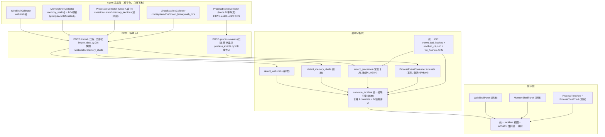
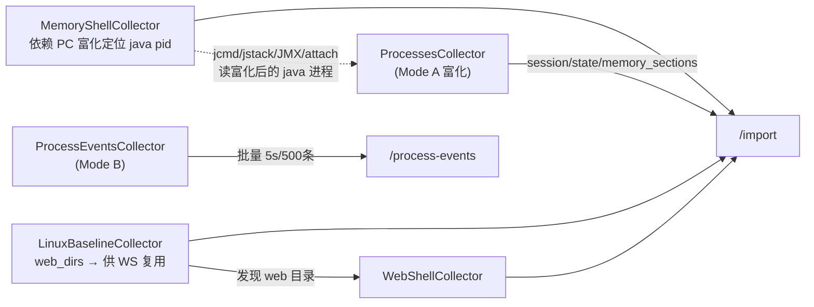
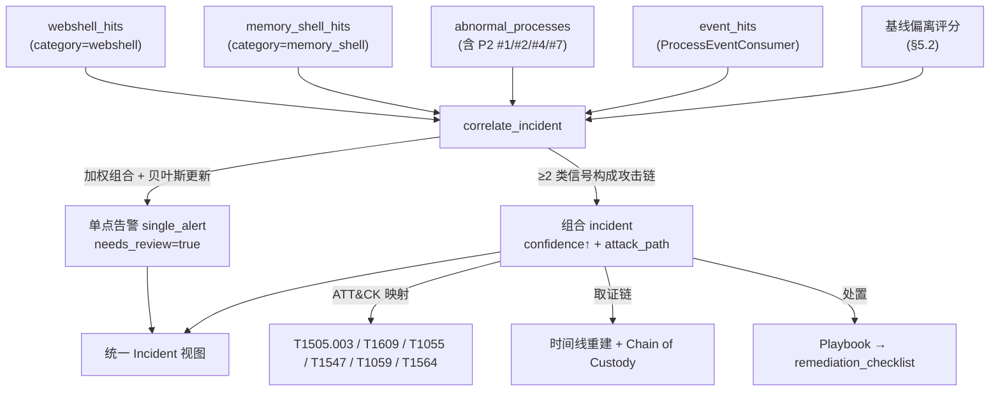
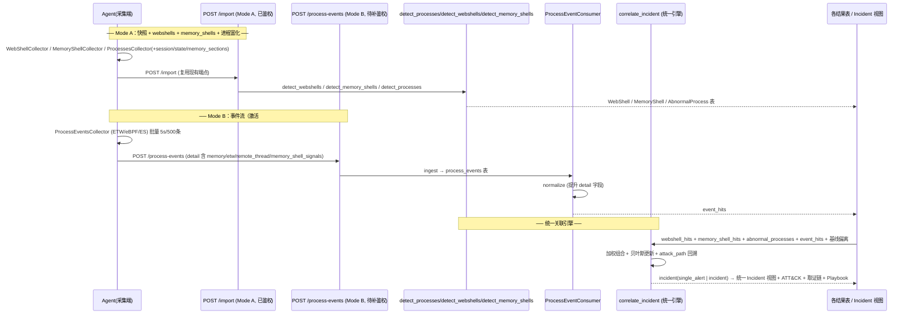

# 应急响应平台 — WebShell 与内存码（Memory Shell）检测能力融合扩充方案（统一版）

> 架构师交付物（SOP「架构设计 + 分析」阶段）。**纯设计文档，不修改任何业务代码**；仅新建 `docs/` 下 md + mermaid。
> 融合对象：
> - **A** — `应急响应平台_WebShell与内存码检测扩充方案.md`（WebShell 文件型 + Java/PHP 内存马，设计级未落地，核心思想「只增不改」向后兼容）
> - **B** — `process_p2_agent_plan.md`（P2 进程加强规则 Agent 采集方案；7 条后端规则已就绪待激活，已被工程师 PoC 验证后端半链路可行）
>
> 全部结论基于逐行读真实代码，引用 `file:line`。统一目标：**消除重复采集与重复引擎，统一数据契约、采集编排、关联引擎、IOC 供给与应急升级能力**，全程贯彻「只增不改」向后兼容。

---

## 一、融合优化总论

### 1.1 两份方案的定位

| 维度 | A（WebShell + 内存码扩充） | B（P2 进程加强规则 Agent 采集） |
|---|---|---|
| 关注面 | 文件型 WebShell（落盘持久化）+ 内存码（Java Filter/Agent 型、PHP 扩展/opcache） | 进程行为：内存注入/无文件反射、ETW/AMSI 旁路、跨会话、远线程注入窗口、快照间消失、吊销签名 |
| 现状 | 设计级未落地，采集器/规则/表均未实现 | 后端 7 条规则 `_match_*` 全就绪（`rule_engine.py:2036-2187`），PoC 17 passed 已验证后端半链路可行 |
| 数据缺口 | 缺 `webshells[]` / `memory_shells[]` 采集维度 + 后端 `detect_*` 接入点 | 缺 Agent 端 `memory_sections/session/state` + 事件流供给（`processes.py:18-19,59-69` 未采集） |
| 核心资产 | 顶层键 `webshells`/`memory_shells` + JVM 探针语义 | 已落地 `ProcessInfo` 富化（`:80-86`）+ `process_events` 表（DDL `database.py:437-452`）+ `ProcessEventConsumer`（已建） |

### 1.2 融合的必要性（避免重复与割裂）

主理人已识别 6 个融合点，本方案据以深化。最关键的是**内存数据同源**：

- **B 的 `memory_sections`（注入/PE 痕迹）** 与 **A 的进程内存映射（§4.3 RWX 匿名段）** 是同一数据源（`/proc/PID/maps`、`VirtualQueryEx`、PE-in-memory）。→ 合并为**单一进程内存区段采集**，同时供 B 的 `#1/#2` 规则与 A 的 Java 内存马检测消费。A §4.3 折叠进 B 的 `memory_sections` 统一契约，**删除重复实现**。
- **进程 enrichment 统一**：B Mode A 给 `processes[]` 补 `session/state/memory_sections`；A 的内存马检测（定位 java pid、读 `/proc/pid/cmdline`、`jcmd/jstack/JMX/attach`）依赖富化后的进程。→ 统一为一个进程富化采集器，`memory_sections` 既含区段属性也含内存 PE/注入/JVM 痕迹（见 §二）。
- **事件流共用**：B Mode B 事件流（`process_start/exit/remote_thread/etw/amsi`）既激活 P2 `#3/#5/#6`，又可作为 A 内存马关联（进程生成→注入→可疑外连）的输入。→ 统一事件管线，消费端双路由（快照检测 + 统一关联引擎）。
- **IOC 统一**：A 要把 `webshells[].sha256` 接入 `ioc_checker` 的 `known_bad_hashes`（`ioc_checker.py:86-104`）；B 的 `#7` 用 `revoked_ca.json` 吊销库（`revoked_ca.json:1-4`）；B 的 `malicious_hash_process` 用 `file_hashes` JOIN（`analysis_service.py:141-145`）。→ 统一「文件哈希 + 签名吊销」供给链。
- **关联引擎统一**：A 的 `correlate_webshell_memory` 与 B 的 `behavior_chain_scoring`/祖先链评分（见 `anomaly_detector.py:99-124` ancestor_map 回溯）应合成**一个多维关联引擎** `correlate_incident`，跨「webshell 文件 + 内存马 + 进程注入 + 可疑外连 + 异常线程」生成统一 `attack_path` 与 incident 置信度。
- **平台优先级协调**：B 原排 Windows > macOS > Linux；A 提 Windows/Linux 对等 + Linux 基础采集器。融合后采用主理人建议：**Windows 优先（B 的 ETW + A 的 IIS/PHPStudy/宝塔）、Linux 次（A 的 Java 内存马 + LAMP webshell + auditd 事件）、macOS 末位（ES 生命周期）**。

> ⚠️ **与主理人协调点**：B 原文 §3.4 平台优先级为 Windows > macOS > Linux，融合版调整为 **Windows > Linux > macOS**。理由：A 的核心价值（Java 内存马、LAMP webshell、Linux 基础维度）大量落在 Linux，Linux 的 WebShell + 内存码产出在本平台最高；macOS 当前无 collector（`processes.py:19` 仅 `["windows","linux"]`），仅 ES 生命周期事件价值明确，内存深度弱，故末位。该调整是对 B 的**修正**，已在 §四/§七标注。

### 1.3 融合后的统一目标与「只增不改」原则

- **统一目标**：在同一 Agent + 同一后端分析层上，一次性交付「WebShell 文件检测 + 进程内存注入检测 + 内存马检测 + 进程事件流关联 + 统一关联引擎 + 应急专家升级」六位一体能力。
- **「只增不改」原则**：现有 102 条规则、`anomaly_detector`、`persistence_finder`、`ioc_checker`、数据库旧表结构、采集产物旧键（`processes`/`network`/`files`）、`COLLECTOR_MAP` 既有条目**一律不动**；新能力通过**新增顶层采集键**（`webshells`/`memory_shells`）+ **新增 `ProcessInfo` 富化字段**（已就绪，仅 Agent 端填充）+ **新增规则 category**（`webshell`/`memory_shell`）+ **新增 `detect_*` 接入函数** + **新增 `correlate_incident`** 落地。
- **向后兼容硬保障**：`ProcessInfo.extra="allow"`（`agent_data.py:86`）+ `AgentData.processes: list[Any]`（`agent_data.py:154`）+ 各 `_match_*` 缺字段 `return False`（`rule_engine.py:1370-1383` 调度）已保证老 Agent 无新字段时照常入库、规则优雅降级。

### 1.4 融合架构一图流



---

## 二、统一数据契约（消除重复）

### 2.1 进程富化统一 schema（Mode A 快照增强）

复用已落地的 `ProcessInfo`（`agent_data.py:69-86`），**仅 Agent 端填充**新增字段，schema 不变、向后兼容：

| 字段 | 类型 | 来源现状 | 说明 |
|---|---|---|---|
| `pid/ppid/name/path/command_line/user/start_time/threads/connections` | 现有 | `processes.py:59-69` | **不改** |
| `session` | int\|null | 现状未采集 | `agent_data.py:81` 已定义；跨会话父子 `#4` 用 |
| `state` | str\|null | 现状未采集 | `agent_data.py:83` 已定义；僵尸/Suspended 判定 |
| `memory_sections` | list[MemorySection]\|null | 现状未采集 | `agent_data.py:82` 已定义；**统一区段契约见下** |

**`memory_sections` 统一子结构（合并 B 注入/PE 痕迹 + A 内存马/JVM 语义，B 的 `_match_memory_injection` 读取键 `rule_engine.py:2051-2094` 已对齐）：**

```json
{
  "base_address": "0x00007ff...",
  "end_address":   "0x00007ff...",
  "size":          4096,
  "protection":    "RWX",                       // R / RW / RX / RWX / ...
  "type":          "mem_image | image | heap | stack | mapped | pe | jvm_generated",
  "is_non_image":  false,                       // 非镜像映射（无文件背景）
  "pe_in_memory":  true,                        // B #1: 内存中 PE（无文件落盘）
  "injection":     true,                        // B #1/#2: 注入标志（RWX 匿名/反射加载）
  "is_anonymous_rwx": true,                     // A §4.3: 匿名可执行映射（shellcode 启发式）
  "mapped_path":   "/usr/lib/jvm/...",          // 有文件背景时；匿名时为 null
  "jvm": {                                       // A 内存马: JVM 层语义（与通用区段互补）
    "class_signals":   ["com.xxx.MemShell"],     // GC.class_histogram 异常类
    "agent_signals":   ["-javaagent:/tmp/agent.jar"],
    "filter_signals":  ["evilFilter@priority=1 (no web.xml)"],
    "thread_signals":  ["non-daemon ClassFileTransformer"]
  },
  "evidence": "anonymous RWX region, no backing file; suspicious string 'ClassLoader'",
  "confidence": 0.9
}
```

> **去重说明**：A §4.3「进程内存映射」完全折叠进本 `memory_sections`；A 的 JVM 语义不另起字段，而是作为 `jvm` 子对象挂在同一区段上——既满足 B `#1/#2` 的 `pe_in_memory`/`injection` 匹配，又承载 A 的 Java 内存马证据，避免两段重复实现。

### 2.2 新增顶层键 `webshells` / `memory_shells`

与 `processes`/`network`/`files` 平级（Agent 输出 `build_output` 仅做键聚合，`agent.py:207`）。沿用 A 的字段设计，命名对齐 B 的 snake_case 风格：

**`webshells[]`（文件型 WebShell 证据，A §3.3 扩展）：**

```json
{
  "path": "/var/www/html/x.php",
  "name": "x.php",
  "size": 4821,
  "mtime": "2026-07-10T03:14:00",
  "ctime": "2026-07-09T...",
  "owner": "www-data",
  "perms": "0644",
  "sha256": "ab12...",
  "web_root": "/var/www/html",
  "middleware": "apache",
  "suspicious_funcs": ["eval","base64_decode","system"],
  "obfuscation_score": 0.82,
  "behinder_godzilla_signal": false,
  "risk_score": 0.9,
  "scan_engine": "static"
}
```

**`memory_shells[]`（内存码证据，A §4.5 扩展；`pid` 为与进程富化的关联锚点）：**

```json
{
  "pid": 8842,
  "process_name": "java",
  "type": "java_filter | java_agent | php | unknown",
  "evidence": "Filter 'evilFilter' registered via StandardContext.addFilter, no web.xml match; priority=1",
  "class_signals":   ["com.xxx.MemShell"],
  "agent_signals":   ["-javaagent:/tmp/agent.jar"],
  "conn_signals":    ["185.220.101.1:4444"],
  "thread_signals":  ["non-daemon ClassFileTransformer"],
  "confidence": 0.95,
  "detect_method": "jmx_filter_maps | jcmd_class_histogram | jstack | attach | proc_maps"
}
```

### 2.3 事件流统一 schema（Mode B）

映射到已建 `ProcessEvent` 模型（`process_event.py:20-73`）。`event_type` ∈ `process_start/process_exit/remote_thread/etw/amsi`；`detail` JSON 承载高级字段（与 `process_event_consumer.py:26-31` 的 `_DETAIL_PROMOTE_KEYS` 对齐）：

```json
{
  "event_type": "process_start",
  "pid": 8842, "ppid": 1, "process_name": "java", "process_path": "/usr/bin/java",
  "command_line": "...", "parent_name": "systemd", "session": 0,
  "start_time": "2026-07-10T03:14:00", "event_time": "2026-07-10T03:14:00",
  "detail": {
    "memory_sections": [ { "base_address":"0x...", "injection":true, "pe_in_memory":true } ],
    "etw_events": [ {"event_type":"etw","detail":"provider disable"} ],
    "remote_thread_events": [ {"timestamp":"...","target_pid":999} ],
    "memory_shell_signals": [ {"pid":8842,"type":"java_filter","evidence":"...","confidence":0.9} ]
  }
}
```

> `detail.memory_shell_signals` 为融合新增的**可选**路由键：让 A 的内存马关联可由事件流直接驱动（进程生成→注入→可疑外连），与 B `#3/#5/#6` 共享同一事件管线。

### 2.4 契约复用关系（消除重复，复用既有资产）

| 契约资产 | 代码位置 | 融合复用方式 |
|---|---|---|
| `ProcessInfo.extra="allow"` | `agent_data.py:86` | 富化字段缺失时老 Agent 不报错 |
| `process_events` 表 | `database.py:437-452` | Mode B 事件落库，DDL 零 diff |
| `ProcessEventConsumer` | `process_event_consumer.py` | `ingest/normalize/evaluate` 复用；`normalize` 已把 `memory_sections/etw_events/remote_thread_events/session` 提升为顶层供规则命中 |
| `ProcessEvent` 模型 | `process_event.py:20-108` | `create/batch_create/list_process_starts` 直接复用 |
| A 新增 `WebShell`/`MemoryShell` 表 | 拟新增（无冲突） | 复用 `AnalysisResult` 模式，`database.py` 追加 `CREATE TABLE` |
| `known_bad_hashes` | `ioc_checker.py:86-104` | 现仅查 `files.suspicious_files`；**一行扩展**纳入 `webshells[].sha256` |
| `revoked_ca.json` | `revoked_ca.json:1-4` | 离线填充吊销库即激活 `#7`，零 Agent 改造 |
| `file_hashes` JOIN | `analysis_service.py:141-145` | `exe_sha256/exe_is_signed/exe_signer` 已注入进程，供 `malicious_hash_process`/`#7` 用 |

---

## 三、融合后的采集器与后端接入设计

### 3.1 统一 Agent 采集器编排

**`COLLECTOR_MAP` 注册扩展**（实际注册名为 `COLLECTOR_MAP`，见 `agent/agent.py:30-47`；A 文档误作 `COLLECTOR_REGISTRY`，此处纠正）。新增条目**仅追加 2 行 + 1 组 Linux 基础 + 1 个事件采集器**，既有 16 个采集器与流程不变：

```python
# agent/agent.py  COLLECTOR_MAP 追加（不改既有条目）
"webshells":        "collectors.webshell.WebShellCollector",        # 新增 A
"memory_shells":    "collectors.memory.MemoryShellCollector",       # 新增 A（含 JVM 探针）
"linux_baseline":   "collectors.linux.LinuxBaselineCollector",       # 新增 A 聚合 cron/systemd/ssh/bash_history/web_dirs
"process_events":   "collectors.process_events.ProcessEventsCollector", # 新增 B Mode B 事件流
# ProcessesCollector 就地增强 Mode A（追加 session/state/memory_sections），不新增 key
```

**最终 registry 与依赖关系（Mermaid）：**



**采集器清单与职责：**

| 采集器 | 平台 | 产出 | 依赖/说明 |
|---|---|---|---|
| `ProcessesCollector`（增强） | win/linux | `processes[]` + `session/state/memory_sections` | 复用 `processes.py`；Windows `VirtualQueryEx`、Linux `/proc/PID/maps` 启发式；macOS 末位 `proc_pidinfo` |
| `WebShellCollector` | 跨平台 | `webshells[]` | 复用了 `LinuxBaselineCollector.web_dirs` + Windows IIS/Tomcat 目录发现；支持 `--web-dirs`/`agent_config.json.extra_web_dirs` |
| `MemoryShellCollector` | linux(Java 主)/win(PHP/IIS) | `memory_shells[]` | 依赖 PC 富化定位 java pid；`jcmd/jstack/JMX/attach`（Java）+ `/proc/PID/maps` 字符串（PHP） |
| `LinuxBaselineCollector` | linux | cron/systemd/ssh/bash_history/web_dirs | 补齐 Linux 与 Windows 对等的基础维度 |
| `ProcessEventsCollector` | win(ETW 优先)/linux(auditd+eBPF)/mac(ES 末位) | 事件流 → `/process-events` | RingBuffer 5s/500 条批量；选择性订阅 provider |

> **Windows 专属 Web 目录发现**（`collectors/windows/`）：IIS `applicationHost.config`、Tomcat `webapps`；**Linux 专属**：Nginx/Apache/Tomcat/宝塔/PHPStudy/1Panel 配置解析。两者均向 `WebShellCollector` 暴露 `discover_web_roots()`，避免 webshell 采集器直接耦合平台细节。

### 3.2 后端分析层接入

**统一 detect 接入（`analysis_service.analyze` 仅新增分支，现有 `detect_processes`/`detect_connections` 调用链 `analysis_service.py:146,150` 原样保留）：**

```python
# 现有（不动）
abnormal_processes = AnomalyDetector.detect_processes(raw_data, rules, whitelist_service=...)  # :146
suspicious_connections = AnomalyDetector.detect_connections(raw_data, rules)                    # :150

# 新增（A，只增不改）—— 与 detect_processes 同构
webshell_hits   = detect_webshells(raw_data, rules)       # category=webshell
memory_shell_hits = detect_memory_shells(raw_data, rules) # category=memory_shell

# 事件流（B，已建）—— 与快照并行
event_hits = ProcessEventConsumer.evaluate(host_id, rules, raw_data.get("processes"))

# 新增：统一关联引擎（合并 A correlate_webshell_memory + B 链路评分/ancestor_map）
incidents = correlate_incident(raw_data, webshell_hits, memory_shell_hits,
                               abnormal_processes, event_hits)
```

- `detect_webshells` / `detect_memory_shells`：新增于 `anomaly_detector.py`，沿用 `RuleEngine.evaluate(items, rules_of_category)` 同构（`anomaly_detector.py:149` 模式）。
- `correlate_incident`（新增）：消费 `web_shell_hits` + `memory_shell_hits` + `abnormal_processes`（含 P2 `#1/#2/#4/#7`）+ `event_hits`，输出 incident 级 `confidence` + `attack_path`（详见 §五.1）。合并 A 的 `correlate_webshell_memory` 与 B 的祖先链评分（`anomaly_detector.py:99-124` `ancestor_map` 回溯逻辑复用）。
- **统一 IOC 接入**：`ioc_checker.check` 扩展 `known_bad_hashes` 纳入 `webshells[].sha256`（`ioc_checker.py:86-104` 一行改造）；`#7 revoked_expired_signature` 经 `revoked_ca.json` 离线填充激活；`malicious_hash_process` 经 `file_hashes` JOIN（`analysis_service.py:141-145`）已具备。

### 3.3 前端展示

- 新增 `WebShellPanel.vue` / `MemoryShellPanel.vue`（参照 `IocTable.vue` / `AbnormalProcessTable.vue` 风格），在 `CaseDetailView.vue` 聚合。
- 复用现有 `ProcessTreeView.vue` / `ProcessTreeChart.vue` 展示富化后的进程（含 `memory_sections` 注入标记）。
- 新增**统一 Incident 视图** + **ATT&CK 矩阵统一映射节点**（复用 `ai/AttckMatrix.vue` 组件，合并 A 的 `T1505.003/T1609` 与 B 的 `T1055/T1547/T1059/T1564`，见 §五.3）。

---

## 四、可行性评估（四维度，详尽）

> 结论先行：**技术可行性已在后端半链路被 PoC 实证（17 passed），前端/采集端设计级成立；资源可行性可控但需采纳量化预算；时间可行性取决于 Agent 端排期（后端逻辑多已就绪）；风险总体中高但均可通过降级/白名单/鉴权闭环缓解。**

### 4.1 技术可行性

| 子项 | 结论 | 依据（真实代码） | 风险 | 缓解 |
|---|---|---|---|---|
| **后端半链路** | ✅ 成立 | B 7 条 `_match_*` 全就绪（`rule_engine.py:2036-2187`），`_match_behavior` 统一调度（`:1370-1383`）；工程师 PoC `test_p2_agent_poc.py` **17 passed** 证实「数据到位即命中」 | 无 | — |
| **A 架构兼容** | ✅ 成立 | `COLLECTOR_MAP` 追加即注册（`agent.py:30-47`）；`is_supported()`/`safe_collect()` 已具备（`base_collector.py:42-67`）；`extra="allow"` 保证兼容（`:86`） | 无 | — |
| **Java 内存马检测** | ⚠️ 受限可行 | 依赖 `jcmd/jstack/JMX/attach` 与 JVM 同用户或提权；容器化需进容器 | 权限不足/容器隔离导致 JVM 探针失败 | Agent 以提权运行；失败标 `confidence: low` 优雅降级（`safe_collect` 保护）；容器场景提供 `kubectl exec` 适配层 |
| **Windows ETW** | ✅ 可行 | ETW Consumer Session 订阅指定 provider（`B §3.1`） | ETW 消费者 session 全局仅 1 个/provider，与 Sysmon 冲突 | 独占式订阅 + 与 Sysmon 共存协商（同 provider 共享或错峰） |
| **Linux auditd+eBPF** | ⚠️ 受限 | `auditd` 规则 + eBPF（`memfd_create`/`mprotect`/`ptrace`）可检测注入；`/proc/PID/maps` 启发式 | eBPF 需内核 ≥4.9 + CAP_BPF；内存 PE 检测精度低于 Windows | 先 auditd 起止 + eBPF 注入检测；内存区段语义自研启发式，标注 `confidence` |
| **macOS ES** | ⚠️ 受限 | ES `EXEC/FORK/EXIT/MMAP` 清晰（生命周期优先） | 内存注入 PE 检测弱；需 entitlement + 全磁盘访问；ES 给 responsible PID 非 ppid | 进程生命周期优先于内存深度；pid 映射层补偿父子关系 |
| **统一关联引擎** | ✅ 可行 | `ancestor_map` 回溯已验证（`anomaly_detector.py:99-124`）；`ProcessEventConsumer.evaluate` 已构建 `process_map/ancestor_map/global_context`（`:160-197`） | 多源加权模型需调参 | 采用加权组合 + 贝叶斯更新（§五.1），先规则驱动再机器学习 |

**技术可行性总评**：后端逻辑（A+B）已实质上就绪或设计级成立，最大不确定性在 **Agent 端跨平台采集的权限/内核约束（尤其 eBPF 与 ETW 独占）**，均可通过降级与能力协商缓解。

### 4.2 资源可行性

**Agent 侧开销（量化预算建议，需用户拍板采纳）**

| 资源 | 预算建议 | 依据 |
|---|---|---|
| ETW 批量上报 | 每 **5s** 或满 **500 条** flush 一次到 `/process-events` | B §2.3；避免 HTTP 洪流 |
| 内存降采样 | 仅对「解释器 / 年轻进程(<60s) / 无签名进程」采集 `memory_sections`；单进程区段上限 **≤64** | B §2.3；控 ReadProcessMemory 开销 |
| Web 目录扫描 | 文件 ≤ **5MB** 读全文；更大读头尾各 **64KB** + 均匀采样；多线程受 `safe_collect` 保护；文件数阈值采样 | A §3.2/§3.4 |
| JVM 探针开销 | `jcmd/jstack` 瞬时快照（秒级），非持续；容器场景 `kubectl exec` 一次 | A §4.1 |
| 单 Agent 上报体量 | 建议上限 **≤ X MB/轮**（建议默认 8–16 MB，按主机规模配置） | 待拍板；含快照 + webshells + memory_shells |
| 带宽 | 事件流经 RingBuffer 批量压缩上报；快照 5–10 min 一次（现状不改） | B §2.3 |

**后端存储与计算**

| 项 | 预算 | 说明 |
|---|---|---|
| `process_events` 表增长 | 高频主机每日可达 **10^4–10^5** 条 | DDL `database.py:437-452`；需 TTL/分区 + `seen_in_events` 去重落库 |
| 关联引擎计算 | 每案 `O(进程数 × 命中规则)`，已有 `ancestor_map` 回溯（深度≤10，`anomaly_detector.py:111-116`） | 增量评估，非全量重算 |
| 双源告警去重 | 快照(Mode A) + 事件(Mode B) 同一进程可能双源告警 | 需事件流增量去重 + 与快照结果合并去重（建议） |

**资源可行性总评**：开销可控且已有降采样/批量/采样设计，关键是**带宽与存储上限需用户确认采纳预算**（见 §七待明确项 3）。

### 4.3 时间可行性（融合后统一分阶段路线图）

合并 A 的 P0/P1/P2 与 B 的 P0 快照激活 / P1 事件 / P2 macOS。区分**后端已就绪** vs **需 Agent 排期**。

| 阶段 | 内容 | 后端/现状 | Agent 排期 | 依赖 | 建议人日/周期（设计估算） |
|---|---|---|---|---|---|
| **统一 P0**<br/>基础 + 快照激活 + WebShell 文件级 | ① Linux 基础采集器(cron/systemd/ssh/bash_history/web_dirs)<br/>② `WebShellCollector` 跨平台 + 修复 2 条失效 webshell 规则(`default_rules.json:1479,1545`) + 新增 webshell 规则集<br/>③ `detect_webshells` 接入 `analysis_service`<br/>④ Mode A 快照富化（`ProcessesCollector` + `session/state/memory_sections`）激活 P2 `#1/#2/#4`<br/>⑤ 修复 `/process-events` 鉴权缺失(`process_events.py:43`) + 填充 `revoked_ca.json` 激活 `#7`（零 Agent 改造）<br/>⑥ `WebShell` 表 + `WebShellPanel`<br/>⑦ 统一 `correlate_incident` 初版（webshell↔进程注入基础关联） | 后端多已就绪：PoC 17 passed；`#1/#2/#4/#7` 规则就绪；`#7` 仅填库 | Linux baseline + WebShellCollector + ProcessesCollector 增强 | 无（可并行） | 后端 5–8 人日 + Agent 8–12 人日 ≈ **13–20 人日 / 2–3 周** |
| **统一 P1**<br/>事件流 + 内存码 + IOC 关联 | ① Mode B 事件流：`ProcessEventsCollector`（Windows ETW 优先）→ 批量 `/process-events` 激活 `#3/#5/#6`<br/>② `MemoryShellCollector`（Linux Java 主 + Windows PHP/IIS）<br/>③ `detect_memory_shells` 接入 + `MemoryShell` 表 + `MemoryShellPanel`<br/>④ 异常网络/线程关联（A §4.4）+ `correlate_incident` 增强（合并 A `correlate_webshell_memory` + B 链路评分）<br/>⑤ 统一 IOC（文件哈希 `webshells[].sha256` + 签名吊销）+ Linux auditd/eBPF 事件<br/>⑥ macOS ES collector 末位起步（生命周期事件先覆盖 `#4/#5/#6/#3`） | `ProcessEventConsumer` 已建；事件端点已建（补鉴权） | Windows ETW 事件采集器（最高优先）+ Linux 事件 + macOS ES | P0 完成 | 后端 5–8 人日 + Agent 10–15（Win ETW）+ 8–10（MemShell）+ 5（macOS）≈ **28–38 人日 / 3–4 周** |
| **统一 P2**<br/>深度 + 关联引擎完备 + 应急升级 | ① JVM 深度：JMX Filter 链 + `attach` transformer 检测（A §4.1-6）<br/>② PHP 扩展/opcache 深度（A §4.2）<br/>③ 关联引擎完备：多维加权置信度 + 基线偏离 + ATT&CK 统一映射 + 时间线重建/取证链（§五）<br/>④ ATT&CK 矩阵可视化（统一节点）<br/>⑤ 误报白名单机制（A §7 + §五.6）<br/>⑥ 应急处置剧本 playbook（§五.5）<br/>⑦ macOS 内存深度（`#1/#2` 弱，末位） | 分析层扩展为主 | 深度探针 + macOS 内存 | P1 完成 | 后端 15–20 人日 + Agent 8–10（深度）+ 8–10（macOS）≈ **31–40 人日 / 4–6 周** |

> 总计约 **72–98 人日 / 9–13 周**（设计级估算，区分后端已就绪与 Agent 排期）。**建议先交付 P0**（后端逻辑已验证，收益最高、风险最低），再滚动 P1/P2。

### 4.4 风险评估（风险矩阵：可能性 × 影响）

| # | 风险 | 可能性 | 影响 | 缓解措施 | Owner |
|---|---|---|---|---|---|
| R1 | 权限不足降级（ETW 需 Admin/SeDebug；eBPF 需 CAP_BPF；jcmd 需同用户） | 高 | 中 | 提权运行；受限环境降级为「仅快照 Mode A」；标 `confidence: low` | Agent 团队 |
| R2 | 误报（框架正常 eval/混淆、良性 .so） | 高 | 中 | 单规则不直接定级，关联加权；白名单（§五.6）；人工复核关卡 | 后端 + 应急专家 |
| R3 | PHP 内存码检测弱（无 JVM） | 中 | 中 | 务实降级：扩展异常 + opcache 异常 + 进程内存字符串；不夸大 | Agent 团队 |
| R4 | 容器/云原生场景（Java 在容器内） | 中 | 高 | `kubectl/docker exec` 适配层；Sidecar 采集；共享 PID namespace | Agent 团队 + 运维 |
| R5 | ETW 消费者 session 独占冲突（Sysmon） | 中 | 高 | 独占式订阅 + 与 Sysmon 共存协商；provider 共享 | Agent 团队 |
| R6 | eBPF 内核版本约束（<4.9 无 BPF） | 中 | 中 | 内核探测回退 auditd/process connector；标注能力降级 | Agent 团队 |
| R7 | 老 Agent 兼容（无新字段） | 低 | 低 | `extra="allow"` + matcher 缺字段降级已保证（`agent_data.py:86`, `rule_engine.py:1370-1383`） | 后端 |
| R8 | 端点鉴权缺失（`/process-events` 无 `Depends(get_current_user)`，`process_events.py:43`） | 高 | 高 | **本期补鉴权**（与 `/import` 对齐 `import_data.py:20`）；统一双端点鉴权 | 后端 |
| R9 | 数据隐私/合规（进程命令行/内存/webshell 内容含敏感信息） | 中 | 高 | 采集端脱敏/最小化；传输 TLS；落库权限隔离；审计链（§五.4） | 运维 + 后端 |
| R10 | macOS collector 缺失（现状 `processes.py:19` 无 macOS） | 高 | 低 | 末位纳入，先生命周期事件；不影响 Win/Linux 主线 | Agent 团队 |
| R11 | 双源告警去重（Mode A+Mode B 同进程双源） | 中 | 中 | 事件流增量去重 + 与快照合并去重 | 后端 |
| R12 | IOC 供给时延（`revoked_ca.json` 为空库 `:1-4` → `#7` 不触发） | 中 | 中 | 运维周期任务离线生成 CRL/OCSP（T-P2-8），签名校验 | 运维/后端 |

---

## 五、应急专家视角升级

以应急响应专家身份，在融合方案基础上做能力升级。下面 6 点均为**新增设计层交付物**，不改动既有业务代码。

### 5.1 多维关联与置信度加权

跨 **webshell 文件 + 内存马 + 进程注入 + 可疑外连 + 异常线程** 的加权关联模型，输出 incident 级置信度与 `attack_path`，明确区分「单点告警」与「组合 incident」。

**加权组合 + 贝叶斯更新（设计）：**

```
单点信号 s_i 有其基础严重度 w_i（critical=40/high=25/medium=10/low=5，沿用 anomaly_detector.py:178 累加档位）
组合 incident 置信度：
  C = 1 - Π(1 - p_i)                      # 独立证据并联（朴素贝叶斯下限）
  其中 p_i = sigmoid(k * (w_i - θ))        # 严重度→概率
关联增益（非独立证据链）：
  if webshell 落盘 AND 同主机 java 进程命中 ms_anomaly_class AND 该进程异常外连:
      C_boost = min(100, C + 25)           # 组合 incident 提权到 critical
attack_path = 链式回溯（复用 ancestor_map, anomaly_detector.py:99-124）
```

- **单点告警**：仅 1 类信号（如孤立 webshell 文件名命中）→ 标 `single_alert`，置信度取该信号档位，进人工复核。
- **组合 incident**：≥2 类信号构成攻击链（如 webshell 落盘 + 内存马驻留 + 可疑外连）→ 标 `incident`，置信度加权提升并生成 `attack_path`。
- `correlate_incident` 是 A `correlate_webshell_memory` 与 B 链路评分的**统一合成**（见 §三.2），输出结构：
  ```json
  { "incident_id":"INC-...", "confidence":0.97, "type":"webshell+memory_shell",
    "attack_path":["web_upload(x.php)","java_memFilter(evilFilter@pid8842)","C2(185.220.101.1:4444)"],
    "related_findings":["WS-...","MS-...","PROC-..."], "severity":"critical" }
  ```

### 5.2 基线偏离检测

- **进程基线**：golden image / 首次快照构建「预期进程集 + 签名白名单 + 父子关系基线」；后续快照偏离（新增无签名解释器、异常父子的 java 子进程）即提升权重。
- **Web 目录基线**：首扫建立「合法脚本清单 + 哈希基线」；新增/篡改脚本（mtime 与部署不符）偏离即加权，而非仅特征匹配。
- **网络连接基线**：主机级外连画像；偏离（新 C2、非常规端口）提升 `conn_signals` 权重。
- 实现：复用 `agent_baselines` 表（`database.py:850`）或新增 `baseline_snapshot`；偏离评分注入 `correlate_incident` 增益项。

### 5.3 统一 MITRE ATT&CK 映射

合并 A 与 B 的战术节点，统一可视化（复用 `ai/AttckMatrix.vue`）：

| 融合节点 | 来源 | 触发信号 |
|---|---|---|
| T1505.003（Web Shell） | A §5.2 | `webshells[]` 命中 ws_* 规则 |
| T1609（Container Administration Command / 此处映射内存马代码执行） | A §5.2 | `memory_shells[]` java_filter/agent 命中 |
| T1055（Process Injection） | B #1/#2 | `memory_sections.injection/pe_in_memory` |
| T1547（Boot/Logon Autostart） | B | 持久化关联 |
| T1059（Command/Scripting Interpreter） | B + A | 解释器内存 PE / webshell 危险函数 |
| T1564（Hide Artifacts） | B | 匿名 RWX / 内存无文件驻留 |

> 注：ATT&CK 节点语义以官方为准；T1609 在内存马语境下作「内存代码执行」近似映射，报告中注明映射依据。可视化新增 `WebShell`/`MemoryShell`/统一 `Incident` 三类节点，与现有进程/IOC 节点并图。

### 5.4 事件时间线重建与取证链

基于 `process_events`（DDL `database.py:437-452`）+ `webshells`/`memory_shells` 证据 + 现有 `timeline_events`（`database.py:168`）重建攻击时间线：

```
时间线 = sort( process_start/exist/remote_thread/etw + webshell mtime + memory_shell detect_time )
       → 关联同一 pid/外连 IP → 输出 attack_path 时序版
```

- 输出**可直接用于取证/汇报的证据链**：每条证据带 `source`（采集器/规则）、`host_id`、`timestamp`、`raw_evidence` 引用。
- **Chain of Custody 提示**：采集时间、Agent 版本、传输端点（含鉴权主体 `get_current_user`）、落库表行 id 全程可追溯；建议报告导出含 `collected_by/collected_at/verified_by` 字段，满足合规取证。

### 5.5 应急处置剧本（Playbook）

针对每类 finding 的平台侧建议处置动作（应急专家交付物，供平台「处置闭环」`remediation_checklist` 表 `database.py:456` 联动）：

| Finding 类型 | 隔离 | 进程终止 | 内存 dump | 样本提取 | 规则加固 |
|---|---|---|---|---|---|
| WebShell 落盘 | 断外连/下线站点 | — | — | 提取脚本 + sha256 入库 | 加 known_bad_hashes；web 目录写保护 |
| Java 内存马 | 隔离主机 | 终止可疑 java 子进程/重启服务 | `jstack`/`heap dump` 取证 | 提取 Filter 类/jar | JMX 审计；限制 `-javaagent` 路径白名单 |
| 进程注入（#1/#2） | 隔离 | 终止注入目标进程 | `Process Memory dump`(Windows) / `gcore`(Linux) | 提取注入 shellcode | 启用 ETW/auditd 注入监控 |
| 组合 incident | **优先隔离** | 终止整条攻击链进程 | 全量 dump | 全证据链归档 | 关联规则上线 + 基线更新 |

### 5.6 误报治理

- **白名单分层**：
  1. 框架良性 eval（如 Django/ThinkPHP 正常模板引擎）→ 按 `web_root/middleware` + 函数上下文白名单；
  2. 已知 benign 混淆（打包器/minifier）→ 哈希/路径白名单；
  3. 签名白名单（合法签名者）→ 复用 `exe_is_signed/exe_signer`（`analysis_service.py:141-145`）；
  4. 良性 `.so`（系统库）→ `mapped_path` 白名单。
- **人工复核关卡**：单点告警（`single_alert`）+ 低置信度组合 incident 必经人工确认才进入处置；`correlate_incident` 输出 `needs_review: true` 标记。
- 复用现有 `whitelist_service.is_whitelisted`（`anomaly_detector.py:85-89`）机制扩展白名单维度。

---

## 六、向后兼容核对清单（合并两份）

### 6.1 A 方案兼容性清单（原 §8，保留）

- [x] 现有 102 条规则：不修改、不删除
- [x] 现有采集器（16 个）：不修改，新增模块独立文件
- [x] `anomaly_detector` 现有 `detect_*`：保留，仅新增 `detect_webshells`/`detect_memory_shells`
- [x] `rule_engine`：不修改（`field+pattern` 已支持新 field）
- [x] 数据库旧表：不改，仅新增 `WebShell`/`MemoryShell`
- [x] 采集产物旧键（`processes`/`network`/`files`…）：不变，仅新增 `webshells`/`memory_shells`
- [x] 失败隔离：`safe_collect` 保证新模块异常不拖垮 Agent（`base_collector.py:57-67`）
- [x] 平台过滤：`is_supported()` 保证 Windows 不跑 Linux-only 采集器（`base_collector.py:42-55`）

### 6.2 B 方案兼容性清单（原 §0/§2.2，保留）

- [x] 7 条 P2 规则 `_match_*`：不修改、已注册（`rule_engine.py:2036-2187`）
- [x] `ProcessInfo.extra="allow"`：新增 `session/memory_sections/state` 均为 Optional（`agent_data.py:80-86`）
- [x] `process_events` 表 DDL：零 diff（`database.py:437-452`）
- [x] `AgentData.processes: list[Any]`：老 Agent 无新字段照常入库（`:154`）
- [x] `ProcessEventConsumer`：缺字段规则优雅降级（`:26-31`, `:150` 早退）

### 6.3 融合新增兼容性约束（合并后统一）

- [x] A §4.3 进程内存映射**删除**，并入 B `memory_sections` 统一契约（§二.1）——**消除重复**
- [x] `/process-events` 端点补 `Depends(get_current_user)` 与 `/import` 对齐（`import_data.py:20` vs `process_events.py:43`）——**鉴权一致性**
- [x] 平台优先级修正为 **Windows > Linux > macOS**（对 B §3.4 的修正，见 §1.2）
- [x] 既有 2 条失效 webshell 规则**修复**（`default_rules.json:1479,1545`），不新增冲突规则
- [x] 统一关联引擎 `correlate_incident` 不修改既有 `detect_processes`/`ProcessEventConsumer` 调用链，仅新增消费方

---

## 七、待明确事项（需用户/主理人拍板）

1. **macOS 是否纳入本期 scope**：融合版建议末位纳入（ES 生命周期优先），但当前无 macOS collector（`processes.py:19`）。**建议：本期纳入末位 P1/P2，不阻塞 Win/Linux 主线。**
2. **端点鉴权是否本期做**：`/process-events` 当前无 `Depends(get_current_user)`（`process_events.py:43`），存在未授权写入风险。**建议：本期必做（R8 高影响）。**
3. **资源预算是否采纳**：ETW 5s/500 条批量、内存降采样（仅解释器/年轻/无签名、单进程 ≤64 区段）、文件 ≤5MB 全文/大文件头尾 64KB 采样、单 Agent 上报 ≤ X MB/轮。**需确认 X 与带宽上限。**
4. **Mode A / Mode B 并存策略**：双源同进程告警是否做增量去重 + 快照合并去重（R11）。**建议：是。**
5. **`revoked_ca.json` 数据来源/更新机制**：离线 CRL/OCSP 由谁生成、周期、签名校验（当前空库 `:1-4` → `#7` 默认不触发）。**需运维排期。**
6. **容器/云原生采集方式**：Java 在容器内时是否提供 `kubectl/docker exec` 适配（R4）。**建议：P1 明确。**
7. **T1609 映射语义**：内存马语境下 T1609 作「内存代码执行」近似映射，是否在报告中注明。

---

## 附：统一关联引擎图（correlate_incident）



## 附：统一采集→分析→展示时序图


