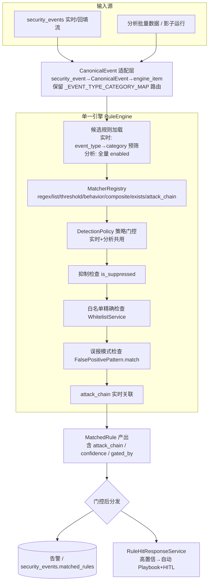
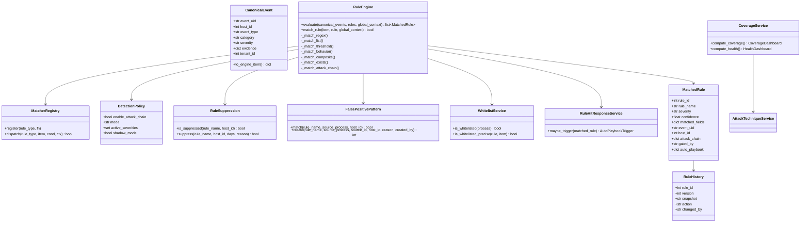
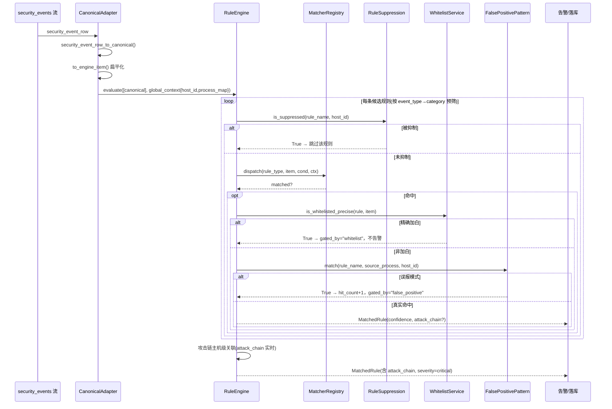
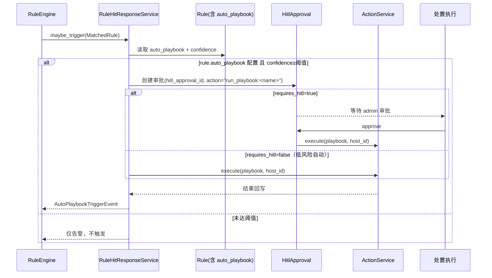
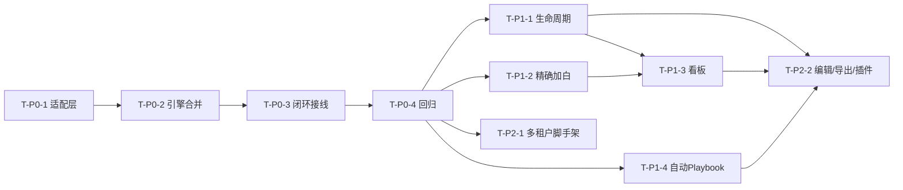

# IR 平台规则管理优化 — 实现设计文档（落地用 · P0→P2 全量）

> 输入：`docs/ir_rule_management_optimization_plan.md`（设计提案）+ 主理人代码审计事实 + 本机逐文件复核。
> 范围：全量落地 P0→P2；P0-2 **彻底合并双引擎**为单一 `RuleEngine`。
> 本文档为**实现设计 + 任务分解**，不含实现代码。所有结论基于真实代码，冲突处以代码为准并标注。

---

## 0. 代码审计复核（采信 + 本机新增发现）

审计事实（主理人提供）经本机 `Read`/`Grep` 复核，**全部属实**，补充如下关键事实，直接影响设计：

| 项 | 复核结论 | 证据 |
|---|---|---|
| P0-1 闭环断链 | 属实。`is_suppressed` 仅定义于 `models/rule_suppression.py:54` + `api/rule_suppression.py`(CRUD)；`FalsePositivePattern.match` 仅定义于 `models/false_positive.py:25`。**二者在 `rule_matcher`/`rule_engine` 内无任何调用点**。 | Grep 全仓 `is_suppressed`/`FalsePositivePattern` 仅命中定义与 CRUD |
| P0-2 双引擎分裂 | 属实。`services/rule_matcher.py`=函数式 `match_event(event_type→category 路由)`，仅 **6 类**（无 attack_chain、无策略门控）；`rules/rule_engine.py`=`RuleEngine.evaluate`，**7 类**（含 attack_chain、影子模式、动态 IOC、威胁情报回灌）。两处 matcher 实现彼此独立、字段约定不同（前者读 `evidence` 嵌套，后者读扁平 dict）。 | Read 两文件 |
| P1-1 白名单空实现 | 属实。`whitelist_service.py:137-139` `elif category=="signature" ... pass`。 | Read |
| P1-2 生命周期缺失 | 部分属实（比提案乐观）：`rules` 表基础列确有缺口，但**迁移已追加 `label`/`source`/`mitre_attack`**（`database.py:1027-1044`、`:1706-1718`），且 **`rule_audit_log` 表已存在**（`Rule._write_audit` 写 create/update/delete 审计）。缺口为：`owner/created_by/status/deprecated/archived/approved_by` 列、`version` 永不递增、无回滚、无审批闸门。 | Read `database.py`/`models/rule.py` |
| P1-3 看板缺失 | 属实。`attack_technique_service.py` 是**只读静态查表**（Enterprise 2024-06 快照 `mitre_attack_coverage.json`），无任何对 `rules.mitre_attack` 做差集的覆盖率聚合端点。注意：`rules.mitre_attack` 列**已存在**（迁移追加），`Rule._normalize_mitre` 会归一化读取。 | Read |
| P2 前端只读 | 属实。`RulesView.vue:160` 编辑按钮 `@click="showDetail(row)"` → `:185` 仅渲染 `规则详情` 弹窗，`condition` 以 `JSON.stringify` 只读展示（`:236`），无编辑表单。 | Grep/Read |
| **新增发现 A** | `services/canonical_event.py` **已实现 `CanonicalEvent` dataclass**（含 `evidence`/`matched_rules_str`/`host_id`/`event_type` 等）。适配层应**复用扩展**，而非另起炉灶。 | Read `canonical_event.py` |
| **新增发现 B** | 响应层**半成品已就绪**：`ActionService.execute`、`HitlApproval` 模型、`agent` 编排流水线（`triage→responder→waiting_hitl→approve→ActionService`）、`PlaybookDef`/`PlaybookStep` schema（`schemas/ai_advanced.py:112-129`）均存在且被测试。但它们**只服务于 AI agent 编排，未接规则命中**。 | Grep `action_service`/`hitl`/`PlaybookDef` |
| **新增发现 C** | 现有迁移范式统一为 `PRAGMA table_info` + `ALTER TABLE ... ADD COLUMN`（幂等、可重复执行）。本设计 DB 变更**严格沿用此范式**。 | Read `database.py:1706-1730` |
| **新增发现 D（设计决策点）** | 当前"实时"匹配**仅在 `/events/batch-match-rules` 回填接口**与 `RuleEngine.evaluate`（分析）两处发生；`api/events.py:ingest_events` 本身**不调用引擎**（仅落库）。统一引擎需把 ingest 实时链路也接到统一引擎，或明确"实时=回填+分析"的口径。见 §1 备注。 | Grep `match_event` 仅命中 `events.py:918/956` |

---

## 1. 总体架构（单一 RuleEngine）



**关键设计点**

1. **统一 event/evidence schema（CanonicalEvent 适配层）**
   - 复用现有 `CanonicalEvent`；新增 `to_engine_item()` 将嵌套 `evidence` **扁平化**为 `RuleEngine` 期望的扁平 dict（`name/path/ppid/command_line/remote_address/connections/...`），同时保留 `event_type`（供 category 路由）。
   - `security_event_row_to_canonical()`：将 `security_events` 行（`event_type/severity/evidence/host_id`）映射为 `CanonicalEvent`，作为实时与分析的**唯一输入契约**。
   - 旧 `rule_matcher._EVENT_TYPE_CATEGORY_MAP` 保留为适配器的"实时候选预筛"映射，降级开关可令其退回全部规则（保证与分析一致）。

2. **Matcher 注册表（7 类，插件式骨架）**
   - 新建 `rules/matchers/registry.py`：`MatcherRegistry` 以 `rule_type → 匹配函数` 的注册表，P0 期注册表直接委派 `RuleEngine` 既有静态方法；**P2 期改为可动态加载模块**（解决插件化）。
   - 7 类：`regex / list / threshold / behavior / composite / exists / attack_chain`。

3. **策略门控共用（DetectionPolicy）**
   - 单一 `DetectionPolicy` 结构同时作用于实时与分析：控制 `enable_attack_chain`、`mode`(realtime/analysis)、各 severity 是否参与、影子模式开关。消除"分析能看到攻击链、实时看不到"的漏报。

4. **attack_chain 实时化链路**
   - 实时事件按 `host_id` 分组，构建 `global_context = {host_id, process_map, all_items, connections}`；`RuleEngine.evaluate` 末尾的攻击链主机级关联（已有实现）对实时流同样执行，产出 `MatchedRule.attack_chain`。

5. **抑制 / 误报 / 白名单 统一接入点（P0-1 闭环）**
   - 在统一引擎**候选加载之后、逐条匹配之前**调用 `RuleSuppression.is_suppressed(rule_name, host_id)` 跳过被抑制规则；
   - 命中点调用 `WhitelistService.is_whitelisted_precise(rule, item)`（P1-1 精确豁免）与 `FalsePositivePattern.match(rule_name, source_process, host_id)` 自增 `hit_count` 并**不产告警**。
   - 判定顺序约定见 §8。

6. **实时=分析共用同一引擎实例（消除不一致）**
   - 两链路都调用 `RuleEngine.evaluate(canonical_events, ...)`；唯一差异是**候选范围**（实时按 category 预筛以保性能，分析全量），**门控逻辑（抑制/误报/白名单/策略）完全一致** → 结果一致性由构造保证。

> **备注（待主理人/工程师确认 D）**：当前 `ingest_events` 不调引擎。建议 T-P0-2 在 ingest 路径追加"实时评估"调用（与 batch-match-rules 共用入口）；若团队判定 ingest 实时评估有性能压力，则明确"实时=回填频率足够高"，分析链路作为权威，二者通过同一引擎保证逻辑一致。设计文档按"ingest 接引擎"实现，保留开关。

---

## 2. 数据库变更（SQLite，PRAGMA 守卫，沿用现有范式）

### 2.1 `rules` 表新增列（幂等 ALTER）
在 `database.py` 的迁移函数内追加（仿 `:1706-1718`）：

```python
# database.py — run_migrations() 内新增
def _migrate_rules_governance(conn):
    cols = [
        ("owner",            "TEXT"),                       # 责任人
        ("created_by",       "TEXT"),                       # 创建人（JWT）
        ("status",           "TEXT DEFAULT 'active'"),      # active/deprecated/archived
        ("approved_by",      "TEXT"),                       # 审批人
        ("approved_at",      "TEXT"),                       # 审批时间
        ("auto_playbook",    "TEXT"),                       # JSON: {"playbook":"name","confidence_threshold":0.9}
        ("tenant_id",        "INTEGER DEFAULT 0"),          # P2 多租户脚手架（默认 0=平台）
    ]
    cur = conn.execute("PRAGMA table_info(rules)")
    existing = {r[1] for r in cur.fetchall()}
    for name, typ in cols:
        if name not in existing:
            conn.execute(f"ALTER TABLE rules ADD COLUMN {name} {typ}")
```

### 2.2 新建 `rule_history` 表（版本快照 + 审批留痕，回滚用）
```python
conn.execute("""
CREATE TABLE IF NOT EXISTS rule_history (
    id          INTEGER PRIMARY KEY AUTOINCREMENT,
    rule_id     INTEGER NOT NULL,
    version     INTEGER NOT NULL,
    snapshot    TEXT,                 -- 该版本完整规则 JSON（含 condition/severity/category...）
    action      TEXT,                 -- create/update/rollback/approve/deprecate
    changed_by  TEXT,
    created_at  TEXT DEFAULT (datetime('now'))
)
""")
```

### 2.3 已存在表（确认，不新建）
- `rule_suppression`：列 `rule_name, host_id, suppressed_until, reason, created_at` 已存在，P0-1 直接接入。
- `false_positive_patterns`：列 `rule_name, source_process, source_ip, host_id, reason, created_by, hit_count, created_at` 已存在，P0-1 直接接入（并扩展"规则+实体"精确匹配辅助）。
- `rule_audit_log`：已存在（create/update/delete 审计），P1-2 复用，不再新建。

### 2.4 兼容性
所有变更走 `PRAGMA` 守卫，可重复执行；不删除任何现有列，不修改 `condition` 既有结构。旧规则 `version` 默认 1，迁移后首次 update 递增为 2 并写 `rule_history`。

---

## 3. 文件清单（新建 / 修改 → 映射三期）

### 一期 P0（P0-1 闭环 + P0-2 引擎合并）
| 路径 | 动作 | 对应任务 |
|---|---|---|
| `backend/app/services/canonical_event.py` | 修改 | 扩展 `CanonicalEvent` 实时字段 + 加 `to_engine_item()` / `security_event_row_to_canonical()` |
| `backend/app/rules/canonical_adapter.py` | **新建** | 适配器：security_events→CanonicalEvent→engine_item；封装 `_EVENT_TYPE_CATEGORY_MAP` 路由 |
| `backend/app/rules/rule_engine.py` | 修改 | 接入 抑制/误报/白名单 门控；新增实时候选按 category 预筛；attack_chain 实时化；统一 `evaluate(canonical_events,...)` 入口 |
| `backend/app/rules/matchers/__init__.py` | **新建** | 包初始化 |
| `backend/app/rules/matchers/registry.py` | **新建** | `MatcherRegistry`（7 类注册/分发，P0 委派 RuleEngine 方法，P2 改插件加载） |
| `backend/app/services/rule_matcher.py` | 修改 | `match_event` 改为委派 `RuleEngine`（保留壳 + 灰度开关），旧 6 类实现下线 |
| `backend/app/models/rule_suppression.py` | 修改 | 增加按规则批量查询辅助（供引擎候选期调用） |
| `backend/app/models/false_positive.py` | 修改 | 增加按 `rule+entity` 精确匹配辅助（供 P1-1 复用） |
| `backend/tests/test_unified_engine.py` | **新建** | 7 类 matcher + 门控 + attack_chain 回归；实时=分析一致性 |

### 二期 P1（治理）
| 路径 | 动作 | 对应任务 |
|---|---|---|
| `backend/app/database.py` | 修改 | `rules` 新列 + `rule_history`（§2） |
| `backend/app/models/rule.py` | 修改 | `update` 递增 `version` + 写 `rule_history`；`status/owner/approved_by`；删除改 `archived` 软退役；新增 `list_history`/`rollback` |
| `backend/app/api/rules.py` | 修改 | `update` 接版本/历史/审批；新增 `/{id}/history`、`/bulk-rollback`、`/coverage`、`/health` |
| `backend/app/services/whitelist_service.py` | 修改 | 实现 `signature` 精确加白 + "规则+实体"豁免 + 审计/审批钩子 |
| `backend/app/services/attack_technique_service.py` | 修改 | 新增覆盖率聚合 `compute_coverage()` / 质量聚合 `compute_health()` |
| `frontend/src/views/RulesView.vue` | 修改 | 新增"覆盖率/健康度"页签 + 卡片 |
| `backend/app/services/rule_hit_response.py` | **新建** | P1-4 自动 Playbook 触发 + HITL 接线 |

### 三期 P1-4 联动 + P2
| 路径 | 动作 | 对应任务 |
|---|---|---|
| `backend/app/api/rules.py` | 修改 | `/{id}/auto-playbook` 配置端点；tenant 过滤 |
| `backend/app/rules/export.py` | **新建** | 规则导出/导入（JSON/YAML） |
| `backend/app/rules/matchers/*` | 修改 | 改为插件式动态加载（P2 插件化） |
| `frontend/src/views/RulesView.vue` | 修改 | 编辑表单（复用 `validate_condition`）+ 导出/导入按钮 |
| `backend/app/database.py` | 修改 | `tenant_id` 查询隔离钩子（脚手架，非完整基建） |

---

## 4. 数据结构与接口（类图 + JSON schema）

### 4.1 类图


### 4.2 CanonicalEvent 扩展 schema（输入契约）
```json
{
  "event_uid": "ac:12345",
  "source": "ac",
  "host_id": 1,
  "event_type": "process_start",
  "category": "process",
  "severity": "medium",
  "evidence": { "name": "...", "path": "...", "ppid": 0, "command_line": "...", "connections": [], "start_time": "..." },
  "tenant_id": 0,
  "matched_rules_str": "[]"
}
```
`to_engine_item()` 产出扁平 dict：`{name, path, ppid, command_line, remote_address, connections, start_time, ...}`（供 matcher 直接读）。

### 4.3 Rule 统一 schema（治理后）
```json
{
  "id": 12, "name": "suspicious_powershell", "label": "可疑 PowerShell",
  "description": "...", "category": "execution", "rule_type": "regex",
  "condition": {"field":"command_line","pattern":"powershell.*-enc"},
  "severity": "high", "enabled": 1, "version": 3,
  "owner": "soc-team", "created_by": "alice", "status": "active",
  "approved_by": "admin", "approved_at": "2026-07-20T10:00:00",
  "auto_playbook": {"playbook":"isolate_host","confidence_threshold":0.9},
  "tenant_id": 0,
  "mitre_attack": "T1059.001",
  "hit_count": 42, "last_hit_at": "2026-07-19T...", "avg_risk_score": 3.1
}
```

### 4.4 MatchedRule（引擎产出）
```json
{
  "rule_id": 12, "rule_name": "suspicious_powershell", "rule_type": "regex",
  "category": "execution", "severity": "high", "confidence": 0.9,
  "matched_fields": {"command_line": "powershell -enc ..."},
  "event_uid": "ac:12345", "host_id": 1,
  "attack_chain": null,
  "gated_by": null,
  "auto_playbook": null
}
```
`gated_by` ∈ `null | "suppression" | "whitelist" | "false_positive"`（门控命中则不进告警，仅记录）。

### 4.5 RuleVersionSnapshot（rule_history.snapshot）
```json
{ "version": 3, "name": "...", "condition": {...}, "severity": "high",
  "category": "execution", "rule_type": "regex", "status": "active",
  "approved_by": "admin", "saved_at": "2026-07-20T10:00:00" }
```

### 4.6 AutoPlaybookTriggerEvent（P1-4）
```json
{
  "event_id": "pb:uuid", "rule_name": "suspicious_powershell", "host_id": 1,
  "confidence": 0.95, "playbook": "isolate_host",
  "requires_hitl": true, "hitl_approval_id": 123, "created_at": "2026-07-20T..."
}
```

### 4.7 CoverageDashboardResponse（P1-3）
```json
{
  "total_rules": 141, "covered_techniques": 64, "total_techniques": 197,
  "coverage_ratio": 0.32,
  "gaps": [{"tactic":"TA0002","technique":"T1053","name":"Scheduled Task/Job","rule_count":0}],
  "health": {
    "zombie_rules": [{"rule_name":"...","last_hit_at":null,"hit_count":0}],
    "high_fp_rules": [{"rule_name":"...","fp_hit_count":120}],
    "by_severity": {"critical":10,"high":30,"medium":80,"low":21}
  }
}
```

---

## 5. 程序调用流程（时序图）

### 5.1 实时事件 → 统一引擎 → 门控 → MatchedRule（含 attack_chain）


### 5.2 高置信命中 → 自动 Playbook（含 HITL）

> 说明：复用既有 `ActionService.execute` + `HitlApproval`（已服务 AI 编排），新建 `RuleHitResponseService` 仅做"规则命中→响应"的薄适配，不重新发明执行层。

---

## 6. 有序任务列表（按实现顺序，标注依赖）

> 命名：`T-P0-*` / `T-P1-*` / `T-P2-*`。验收点均要求可测试（pytest / API 契约）。

### P0 期
- **T-P0-1 统一输入层（CanonicalEvent 适配）**
  - 涉及文件：`canonical_event.py`(改)、`rules/canonical_adapter.py`(新)、`rules/matchers/__init__.py`(新)、`rules/matchers/registry.py`(新)
  - 依赖：无
  - 验收：① `security_event_row_to_canonical()` 可把真实 `security_events` 行转为 `CanonicalEvent`；② `to_engine_item()` 产出 `RuleEngine` 期望的扁平字段；③ `MatcherRegistry` 注册 7 类且 `dispatch` 委派现有方法返回与原逻辑一致。

- **T-P0-2 引擎合并（单一 RuleEngine + attack_chain 实时化）**
  - 涉及文件：`rules/rule_engine.py`(改)、`services/rule_matcher.py`(改)、`rules/matchers/registry.py`(改)
  - 依赖：T-P0-1
  - 验收：① `rule_matcher.match_event` 改为委派 `RuleEngine`，旧 6 类实现删除；② 实时候选按 `event_type→category` 预筛（保留映射，灰度开关可退回全量）；③ 实时流 `global_context` 带 `host_id/process_map`，`attack_chain` 实时命中产出 `severity=critical` 的 `MatchedRule`（与分析一致）。

- **T-P0-3 闭环接线（抑制/误报/白名单接入引擎）**
  - 涉及文件：`rules/rule_engine.py`(改)、`models/rule_suppression.py`(改)、`models/false_positive.py`(改)、`services/whitelist_service.py`(改，先接现有 `is_whitelisted` 钩子)
  - 依赖：T-P0-2
  - 验收：① 被抑制规则在实时与分析均不产生告警；② 标记误报模式后同类事件不再告警且 `hit_count` 自增；③ 白名单（path/process_name）命中不告警。

- **T-P0-4 P0 回归与验收测试**
  - 涉及文件：`tests/test_unified_engine.py`(新)、`tests/test_attack_chain.py`(改)
  - 依赖：T-P0-3
  - 验收：① 7 类 matcher 全绿；② 抑制/误报生效；③ **实时=分析**对同一批事件产出一致 `MatchedRule` 集合（除候选范围差异）；④ attack_chain 实时生效；⑤ 回归测试全绿（CI）。

### P1 期
- **T-P1-1 生命周期治理**
  - 涉及文件：`database.py`(改)、`models/rule.py`(改)、`api/rules.py`(改)
  - 依赖：T-P0-4（引擎稳定后再动规则写路径）
  - 验收：① `update` 递增 `version` 并写 `rule_history`；② 新增 `/{id}/history`、`/bulk-rollback`；③ 删除改为 `status='archived'`（默认规则拒绝物理删）；④ `owner/created_by/status/approved_by` 落库；⑤ 审批：severity≥high 或 `source='default'` 的修改需 admin 审批（见 §10 推荐），普通规则直接生效+记历史。

- **T-P1-2 精确加白**
  - 涉及文件：`services/whitelist_service.py`(改)、`models/false_positive.py`(改)、`api/rules.py`(改)
  - 依赖：T-P0-3（复用门控钩子）
  - 验收：① `signature` 类别按事件指纹（hash/命令行特征）加白，非路径模糊豁免；② 支持"规则+实体"精确豁免（复用 `false_positive_patterns` 结构）；③ 加白操作写审计/可选审批；④ 精确加白**不放开检测面**（仅豁免指定规则+实体）。

- **T-P1-3 覆盖率 / 质量看板**
  - 涉及文件：`services/attack_technique_service.py`(改)、`api/rules.py`(改)、`frontend/src/views/RulesView.vue`(改)
  - 依赖：T-P0-4、T-P1-1（需 version/mitre/hit_count）
  - 验收：① `/api/rules/coverage` 返回 `CoverageDashboardResponse`（对 `rules.mitre_attack` 与 ATT&CK 库做差集）；② `/api/rules/health` 返回僵尸规则/高误报/按 severity 分布；③ 前端新增"覆盖率/健康度"页签可见。

- **T-P1-4 自动 Playbook（高置信触发 + HITL）**
  - 涉及文件：`services/rule_hit_response.py`(新)、`api/rules.py`(改)、`rules` 表 `auto_playbook` 列（T-P1-1 已加）
  - 依赖：T-P0-4（门控稳定）、复用既有 `ActionService`/`HitlApproval`
  - 验收：① 规则配 `auto_playbook` 且命中 `confidence≥阈值` 时自动起 Playbook；② `requires_hitl=true` 经 `HitlApproval` 审批后由 `ActionService` 执行；③ 触发事件落 `AutoPlaybookTriggerEvent` 可查。

### P2 期
- **T-P2-1 多租户脚手架**
  - 涉及文件：`database.py`(改)、`api/rules.py`(改)、`rules/rule_engine.py`(改)
  - 依赖：T-P0-4
  - 验收：① `tenant_id` 列已随 T-P1-1 加；② 规则读写在 `tenant_id` 维度隔离（平台 `0` 为基线，租户可覆盖）；③ 仅脚手架+查询钩子，**不做完整多租户基建**（见 §10 推荐）。

- **T-P2-2 前端可编辑 + 导出/导入 + matcher 插件化**
  - 涉及文件：`frontend/src/views/RulesView.vue`(改)、`rules/export.py`(新)、`rules/matchers/*`(改)
  - 依赖：T-P1-1（编辑需版本/审批）、T-P1-3（导出范围）
  - 验收：① 编辑按钮打开条件编辑表单（复用 `validate_condition` 实时校验）；② 规则 JSON/YAML 导出/导入；③ `MatcherRegistry` 支持动态加载 matcher 模块（插件式）。

### 依赖图


---

## 7. 依赖包列表
- **无新增第三方重依赖**。全部复用现有栈（FastAPI / SQLite / Pydantic / PyYAML 若导出 YAML 可选，否则仅 JSON）。
- 若 P2 导出 YAML 需要：`pyyaml`（轻量，常见已装）；否则可纯 JSON 规避。
- 前端沿用现有 Vue3 + 现有 UI 组件，无新增框架。

---

## 8. 共享知识（跨文件约定）

1. **统一 matcher 接口签名**：`match(item: dict, condition: dict, global_context: Optional[dict]) -> bool`。所有 7 类 matcher 必须实现此签名，由 `MatcherRegistry.dispatch` 调用。`item` 为 `to_engine_item()` 扁平 dict。

2. **DetectionPolicy 数据结构**（共享门控）：
   ```python
   @dataclass
   class DetectionPolicy:
       enable_attack_chain: bool = True      # 实时+分析共用，消除漏报
       mode: str = "analysis"                # "realtime" | "analysis"
       active_severities: set = {"low","medium","high","critical"}
       shadow_mode: bool = False             # 影子模式仅计数
   ```
   引擎读取 `policy.enable_attack_chain` 决定是否跑攻击链；`mode` 仅影响候选范围（实时预筛 category），**不影响门控**。

3. **抑制 / 误报 / 加白 判定顺序约定**（引擎内固定）：
   ① 候选加载 → ② **抑制检查** `is_suppressed(rule,host)`（规则级，最宽，命中则整条规则跳过）→ ③ `match_rule` → ④ **白名单精确检查** `is_whitelisted_precise(rule,item)`（实体级）→ ⑤ **误报模式检查** `FalsePositivePattern.match(rule,entity,host)` → ⑥ 真实命中产 `MatchedRule`。顺序原则：抑制最宽先拦，匹配后做实体级精确豁免，最后误报模式收口。

4. **版本号递增规则**：`version` 从现有值（默认 1）起，每次 `update`（condition/severity/enabled 任一变更）递增 1，并把变更前完整快照写入 `rule_history`（action=`update`）。回滚 = 取 `rule_history` 某版本 snapshot 覆盖当前并 `version+1`（action=`rollback`）。**物理删除禁止**，改为 `status='archived'`。

5. **tenant 隔离查询约定（若纳入 P2）**：所有 `rules` 读路径追加 `WHERE (tenant_id = ? OR tenant_id = 0)`（`0`=平台基线，对所有租户可见）；租户写入新规则 `tenant_id=当前租户`。仅脚手架级隔离钩子，不做跨租户数据隔离基建。

6. **统一响应包装**：API 沿用 `{code, data, message}`，`code=0` 成功；规则命中告警沿用 `security_events.matched_rules` JSON 存储 + 新增 `MatchedRule` 结构化落库（如需独立告警表，由工程师在 T-P0-4 定）。

---

## 9. 风险与缓解

| 风险 | 等级 | 缓解 |
|---|---|---|
| 引擎合并迁移破坏存量匹配（两套 matcher 实现/字段约定不同） | 高 | ① 保留 `_EVENT_TYPE_CATEGORY_MAP` 适配；② 全量回归（`test_unified_engine.py` 覆盖 7 类+门控+attack_chain）；③ `rule_matcher.match_event` 保留壳+灰度开关，可一键回退旧实现 |
| 实时链路性能下降（attack_chain 实时化 + 逐事件门控） | 中 | ① 实时候选按 category 预筛，缩小候选集；② attack_chain 仅对有 `process_map` 的事件触发；③ 抑制/误报检查走索引查询（`rule_name+host_id`），并对 `is_suppressed` 结果做进程内短缓存（TTL 内复用） |
| 实时=分析不一致（merge 后行为漂移） | 中 | 两链路共用 `RuleEngine.evaluate` + 同一 `DetectionPolicy` 门控；`test_unified_engine.py` 断言同批事件两模式产出一致 `MatchedRule` 集合 |
| P1-4 响应层未就绪导致联动空转 | 低（实测已半就绪） | 实测 `ActionService`/`HitlApproval`/`PlaybookDef` 已存在；新建 `RuleHitResponseService` 仅做薄适配，复用既有执行+审批，避免重造 |
| P2 多租户改动面过大 | 中 | 本期仅做 `tenant_id` 列 + 查询隔离钩子脚手架，不做完整基建（见 §10） |
| 审批流影响改规则效率 | 低 | 仅 severity≥high / `source='default'` 需审批，普通规则免审直接生效+记历史 |
| 白名单精确匹配性能 | 低 | `signature` 类别按 hash/命令行特征做等值/前缀匹配，规模小，可内存索引 |

---

## 10. 对提案第 6 节 4 个开放问题的建议（供拍板）

1. **P1-4 响应层就绪度：建议本期纳入，但范围收敛。**
   - 探查现状：响应执行层**并非空白**——`ActionService.execute`、`HitlApproval` 模型、agent 编排 `waiting_hitl→approve→ActionService` 流水线、`PlaybookDef` schema 均已存在并通过测试。缺口仅是"**规则命中 → 自动触发**"的接线。
   - 推荐：本期做**薄适配** `RuleHitResponseService`，复用既有 `ActionService`+`HitlApproval`，**不引入 LLM agent 编排**（保持确定性）。即：高置信命中 → 建 `HitlApproval`（如配置需 HITL）→ 审批后 `ActionService.execute(playbook)`。避免重造执行层，风险可控。

2. **P2 多租户：建议本期仅做脚手架，不铺完整基建。**
   - 推荐：`rules` 表加 `tenant_id`（T-P1-1 已含），T-P2-1 仅补"查询隔离钩子 + 平台基线(0)对所有租户可见"的读写约定。**不做**跨租户数据隔离、租户管理 UI、配额等完整多租户系统——除非用户明确是 MSSP/多客户 SOC 场景。理由：改动面最大、收益最晚，且与检测能力主线无关。

3. **审批流强度：推荐"分级审批"。**
   - 推荐：仅 **severity≥high** 或 **source='default'（平台基线规则）** 的修改需 admin 双人复核；普通用户自建规则（severity≤medium, source='user'）**直接生效 + 记 `rule_history`**。既防"误改高危/基线规则导致大范围漏报"，又不拖累日常运营效率。

4. **分期节奏：建议接受三期拆分，但 P0 内部不另拆。**
   - 推荐：维持"P0 引擎合并→P1 治理→P2 联动/规模化"三期，与路线图均衡。每期内部任务粒度如上（T-P0-1~4 / T-P1-1~4 / T-P2-1~2）。若工程师反馈 P0 回归成本超预期，可在 T-P0-2 与 T-P0-3 间插入"灰度开关联调"子任务，但无需重组大期。

---

> 文档交付：`docs/ir_rule_management_implementation_design.md`（本文件）。工程师据此从 T-P0-1 按顺序开工；QA 以各任务"验收点"为测试用例来源。
