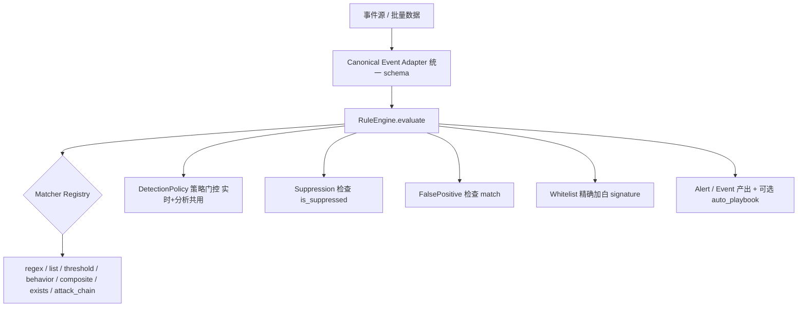

# IR 平台规则管理优化方案（设计稿 · 供审核）

> 依据：`E:/桌面/IR平台规则管理优化建议.md` + 当前代码逐行审计（2026-07-19）
> 范围确认：**全量 P0→P2**；P0-2 采用**彻底合并引擎**；交付形态为**设计文档**（评审通过后再走团队开发落地）；价值排序**按路线图均衡排期**。
> 本文档为设计稿，不含实现代码。所有结论均标注代码证据。

---

## 0. 审计结论：参考建议逐条核对

| 建议项 | 报告核心断言 | 代码核验结果 | 判定 |
|---|---|---|---|
| P0-1 闭环断链 | `is_suppressed()`/`FalsePositivePattern.match()` 全库无引擎调用点 | `rule_suppression.py:54` 仅定义；`models/false_positive.py` 的 `match()` 仅在 `ai_advanced.py` 的 CRUD API 出现；`rule_matcher`/`rule_engine` 均无调用 | ✅ 属实 |
| P0-2 双引擎分裂 | 实时 `rule_matcher`(6类,无attack_chain,不门控) vs 分析 `rule_engine`(7类,含attack_chain,门控) | `services/rule_matcher.py` 函数式 `match_event` + `_EVENT_TYPE_CATEGORY_MAP`；`rules/rule_engine.py` 类式 `RuleEngine.evaluate`，两套独立实现、字段约定不同 | ✅ 属实 |
| P1-1 白名单一刀切 | `signature` 类别空实现；按 path/进程名全局豁免 | `whitelist_service.py:137-138` 明确 `elif category=="signature"... # 暂不做匹配，预留扩展`（空 pass） | ✅ 属实 |
| P1-2 生命周期缺失 | `version` 永远=1；无历史/回滚/审批/责任人/退役 | `rules` 表（database.py:193-205）无 `owner/created_by/status/deprecated/archived/approved_by`；`update` 不递增 `version` | ✅ 属实 |
| P1-3 覆盖率/质量看板 | 141 条规则带 MITRE 但无覆盖率计算；`AttackTechniqueService` 未被用于覆盖率 | `attack_technique_service.py` 为静态库，未见对 `rules.mitre_attack` 做差集的覆盖率端点（API 层无对应计算） | ✅ 基本属实 |
| P1-4 命中→自动 Playbook | 命中只产告警，未与 Playbook/动作执行打通 | 当前尚无"规则命中→触发 Playbook"的接线；依赖响应执行层（action_service / HITL）就绪度待确认 | ⚠️ 部分属实（见 3.6） |
| P2 规模化 | 多租户缺 `tenant_id`；前端编辑只读；behavior 非插件式；无导出 | `RulesView.vue:160/188` 编辑=只读详情；`rules` 表无 `tenant_id` | ✅ 属实 |

**总评**：参考建议技术判断准确，非臆测。唯一需降预期的是 **P1-4**——它依赖"响应层骨架"，而当前响应执行链路（HITL/动作）是否足以支撑自动 Playbook，需在落地前单独确认（见 3.6）。

---

## 1. 需要优化 / 修改的地方（问题清单）

1. **闭环断链（最高优先级）**：抑制与误报模式已建数据模型与 API，但接不进匹配引擎，点了等于没用。
2. **双引擎行为不一致**：同一条规则在实时链路与分析链路可能得出不同结果；`attack_chain` 在实时链路失效，存在漏报盲区。
3. **白名单过度豁免**：`signature` 类别空实现；按路径/进程名全局豁免可能让真实攻击静默通过。
4. **规则不可治理**：无版本/历史/回滚/审批/责任人/退役状态，一次误改导致大范围漏报时无法追责与回滚。
5. **缺乏可见性**：ATT&CK 覆盖率、误报率、僵尸规则、高误报规则均无视图，防御差距靠人工翻表。
6. **响应未联动**：高置信命中无法自动触发处置 Playbook。
7. **规模化短板**：无多租户、前端无法编辑条件、匹配器不可插拔、无规则导出/共享。

---

## 2. 总体架构方案

### 2.1 主线：单一规则引擎（P0-2）

将 `rule_matcher`（实时）与 `rule_engine`（分析）合并为**单一 `RuleEngine`**，同时服务实时事件流与批量分析。

**关键设计**：
- **统一 event/evidence schema**：定义 `CanonicalEvent` 适配层，旧两套字段约定收敛为一份；实时与分析共用同一份输入规范。
- **Matcher 注册表（插件式）**：7 类匹配器注册到单一 registry，`behavior` 改为注册式插件（解决 P2 插件化），新增类型无需改核心。
- **策略门控共用**：`detection_policy` 同时作用于实时与分析链路，消除"分析能看到攻击链、实时看不到"的漏报。
- **attack_chain 接入实时链路**：实时事件流也跑攻击链关联。

**迁移策略（降风险）**：保留 `rule_matcher` 的 `event_type→category` 映射作为适配层；逐规则回归验证后下线旧 `match_event`。配套回归测试覆盖 7 类 matcher + 门控 + attack_chain。

### 2.2 闭环接线（P0-1）
- 在 `RuleEngine.evaluate`（统一后唯一入口）加载候选规则后、匹配前调用 `RuleSuppression.is_suppressed(rule_name, host_id)` 跳过被抑制规则。
- 在告警去重/创建环节调用 `FalsePositivePattern.match()` 抑制同类误报并自增 `hit_count`。
- 端到端测试：标记误报 → 同类事件不再告警。

### 2.3 精确加白（P1-1）
- 白名单支持"**规则 + 实体**"精确豁免，复用 `false_positive_patterns` 已有的 `(rule_name, source_process, host_id)` 结构。
- 实现 `signature` 类别：按事件指纹（hash/命令行特征）加白，而非路径模糊匹配。
- 加白操作接入 `rule_audit_log` + 可选审批。

### 2.4 生命周期治理（P1-2）
- `rules` 表新增：`owner TEXT`、`status TEXT(active/deprecated/archived)`、`approved_by TEXT`、`approved_at TEXT`。
- 新增 `rule_history` 表：每次修改写新版本 + 旧值快照 + 一键回滚接口。
- `update` 递增 `version`；默认规则支持 `archived` 而非物理删除。
- 审批流：severity≥high 或 source='default' 的修改需双人复核（复用 RBAC `admin/analyst`）。

### 2.5 覆盖率 / 质量看板（P1-3）
- 复用 `AttackTechniqueService`（静态 ATT&CK 库）对 `rules.mitre_attack` 做差集 → **确定性覆盖率矩阵**（哪些 tactic/technique 无规则）。
- 用 `hit_count`/`avg_risk_score`/`last_hit_at` 衍生：长期零命中（僵尸规则）、高误报率规则、趋势图。
- 新增后端端点 `/api/rules/coverage`、`/api/rules/health`；前端加"规则健康度"页。

### 2.6 命中 → 自动 Playbook（P1-4，依赖项）
- `rules` 表新增可选 `auto_playbook` 字段；命中且置信度达阈值时自动起对应 Playbook。
- **前置依赖**：需先确认响应执行层（action_service / HITL 审批闸门）是否已可支撑"自动触发 + 人工确认"。落地前单独审计此链路，若未就绪则本项顺延。

### 2.7 规模化生态（P2）
- 多租户：规则相关表加 `tenant_id`，基线规则继承 + 租户覆盖（末期权衡，改动面最大）。
- 前端条件编辑：`RulesView` 编辑按钮补条件编辑表单（复用 `validate_condition` 实时校验）。
- 插件式 matcher：behavior 等改为注册表插件。
- 规则导出/共享：JSON/YAML 导出 + 导入 + 社区基线。

---

## 3. 任务分解与分期（按路线图均衡排期）

| 期次 | 内容 | 预期涉及文件 | 验收 |
|---|---|---|---|
| **一期（P0）** | P0-1 闭环接线 + P0-2 引擎合并 | `rules/rule_engine.py`、`services/rule_matcher.py`、`rules/matchers/*`、`models/rule_suppression.py`、`models/false_positive.py` | 抑制/误报模式生效；实时=分析结果一致；attack_chain 实时生效；回归测试全绿 |
| **二期（P1 治理）** | P1-1 精确加白 + P1-2 生命周期 + P1-3 看板 | `services/whitelist_service.py`、`database.py`(rules/rule_history)、`api/rules.py`、`services/attack_technique_service.py`、`api/*`(coverage/health)、`frontend/RulesView.vue` | 精确加白不漏报；版本/回滚/审批可用；覆盖率与质量看板可见 |
| **三期（P1 联动 + P2）** | P1-4 自动 Playbook + P2 多租户/编辑UI/插件式/导出 | `database.py`(tenant_id)、`api/rules.py`、`RulesView.vue`、matcher 注册表、导出模块 | 高置信命中自动起 Playbook（含 HITL）；前端可编辑；可导出/导入；多租户隔离（若纳入） |

---

## 4. 风险与缓解

| 风险 | 等级 | 缓解 |
|---|---|---|
| 引擎合并迁移破坏存量匹配 | 高 | 适配层保留旧映射 + 全量回归测试 + 灰度切换 |
| 实时链路性能下降（attack_chain 实时化） | 中 | 匹配前预筛 + attack_chain 仅对高相关事件触发 |
| P1-4 响应层未就绪导致联动空转 | 中 | 落地前单独审计响应层；未就绪则顺延 |
| P2 多租户改动面过大 | 中 | 列为末期权衡，可拆为独立子项目 |
| 审批流引入影响现有改规则效率 | 低 | 仅 severity≥high / 默认规则需审批，普通规则免审 |

---

## 5. 总体验收标准

- [ ] 抑制/误报模式在实时与分析链路均生效（P0-1）
- [ ] 单一引擎产出实时=分析一致结果，attack_chain 实时生效（P0-2）
- [ ] 精确加白（规则+实体 / signature）不放开检测面（P1-1）
- [ ] 规则可版本化、可回滚、可审批、有责任人、可退役（P1-2）
- [ ] ATT&CK 覆盖率矩阵 + 命中质量看板可见（P1-3）
- [ ] 高置信命中可自动触发 Playbook（依赖响应层就绪，P1-4）
- [ ] 前端可编辑规则条件、规则可导出/导入、支持多租户（P2，按采纳范围）

---

## 6. 待你审核确认的开放问题

1. **P1-4 响应层**：是否要先花一轮单独审计"响应执行层（action_service / HITL）"的就绪度，再决定是否纳入本期？
2. **P2 多租户**：你的部署是否真需要多租户（MSSP/多客户 SOC）？还是单租户即可，P2 仅做编辑UI/导出/插件化？
3. **审批流强度**：是否所有规则修改都要审批，还是仅 high/默认规则？
4. **分期节奏**：上述三期是否可接受，还是希望把某一期再拆细？

> 审核通过后，我将按标准 SOP 组建团队（产品经理→架构师→工程师→QA）逐期落地；或你可指定从某一期先启动。
