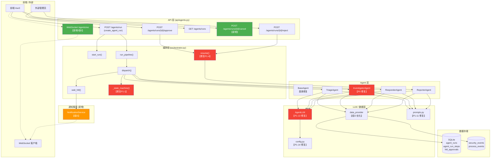
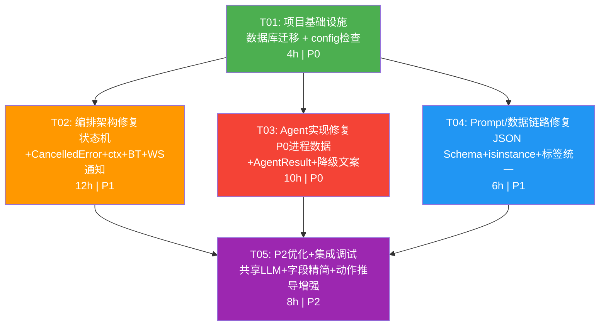

# 智能体编排功能模块 — 修复架构设计与任务分解

> **架构师**: 高见远 (Bob, Architect)  
> **版本**: v1.0  
> **日期**: 2025-07-06  
> **状态**: 交付工程师执行  

---

## 目录

- [Part A: 系统设计](#part-a-系统设计)
  - [1. 实现方案与总体架构图](#1-实现方案与总体架构图)
  - [2. 文件列表（按任务组分组）](#2-文件列表按任务组分组)
  - [3. 详细设计方案](#3-详细设计方案)
- [Part B: 任务分解](#part-b-任务分解)
  - [4. 依赖包列表](#4-依赖包列表)
  - [5. 任务列表](#5-任务列表)
  - [6. 共享知识](#6-共享知识)
  - [7. 待明确事项](#7-待明确事项)
  - [8. 任务依赖图](#8-任务依赖图)

---

# Part A: 系统设计

## 1. 实现方案与总体架构图

### 1.1 总体架构图



### 1.2 实现方案概述

| 任务组 | 核心挑战 | 方案 | 模式 |
|--------|---------|------|------|
| **组A** | 编排状态机语义错误、CancelledError 被吞、ctx 不持久、BackgroundTasks 阻塞 | 重构 `_state_machine` 多阶段语义；修复异常捕获顺序；增加 `ctx_json` 字段持久化；BackgroundTasks 异步执行 | 修复 |
| **组B** | process_events 为空时无数据、AgentResult 字段不全、LLM降级文案不统一、host_id=None 降级缺失 | 从 security_events 补充进程数据；扩展 AgentResult；优化文案；补全字段 | 修复+优化 |
| **组C** | Prompt 无结构化输出约束、错误映射用字符串包含、加密密钥无告警 | Prompt 追加 JSON Schema；改用 isinstance 判断；启动时检查 | 修复 |
| **组D** | Agent 层、数据链路层、API/Schema、WebSocket 多项 P2 优化 | BaseAgent 共享 LLM 实例、SELECT 字段精简、Schema 补全、通知机制 | 优化 |
| **组E** | wait_hitl 时无法通知管理员 | 新增 NotificationService，结合 FastAPI WebSocket 广播 | 新增 |

### 1.3 核心技术选型

| 技术 | 选型 | 理由 |
|------|------|------|
| WebSocket | FastAPI 原生 WebSocket + AlertWebSocketManager 复用 | 无需新增依赖，alert_ws.py 已有现成模式参考 |
| 异步任务 | FastAPI BackgroundTasks + asyncio.create_task | 轻量，不引入 Celery/RQ，后端重启后任务丢失（可接受） |
| 状态机 | 保留自建轻量状态机（不改框架） | 当前骨架满足需求，仅修复语义而非重写 |
| LLM 降级 | 保留数据驱动兜底 + 统一降级文案 | 已在各 Agent 实现，仅需文案优化 |

---

## 2. 文件列表（按任务组分组）

### 2.1 文件清单

| 任务组 | 涉及文件 | 改动类型 | 说明 |
|--------|---------|---------|------|
| **组A：编排架构修复** | `backend/app/services/agents/orchestrator.py` | 修改 | `_state_machine` 多阶段语义、dispatch CancelledError、ctx 持久化、resume 上下文重建 |
| | `backend/app/api/agents.py` | 修改 | create_agent_run 改为 BackgroundTasks 异步执行；新增 cancel 端点 |
| | `backend/app/models/agent_run.py` | 修改 | AgentRun.create 增加 `ctx_json` 字段 |
| | `backend/app/schemas/agent_run.py` | 修改 | AgentRunCreate/Pydantic 模型增加 `ctx_json` 相关字段 |
| | `backend/database/migrations/xxx_add_ctx_json.py` | 新增 | 数据库迁移脚本：agent_runs 表新增 ctx_json TEXT 列 |
| **组B：Agent实现修复** | `backend/app/services/agents/investigator_agent.py` | 修改 | P0: 从 security_events 补充进程数据；P1-9: 时间戳字段统一 |
| | `backend/app/services/agents/base_agent.py` | 修改 | P1-6: AgentResult 字段扩展（execution_duration_ms, llm_calls_count, usage, error, data_sources） |
| | `backend/app/services/agents/triage_agent.py` | 修改 | P1-8: host_id=None 降级提示；P1-7: 统一降级文案 |
| | `backend/app/services/agents/responder_agent.py` | 修改 | P1-7: 统一降级文案 |
| | `backend/app/services/agents/reporter_agent.py` | 修改 | P1-10: _sink_case() 字段补全（event_ids/run_id/severity/confidence）；P1-7: 统一降级文案 |
| **组C：Prompt/数据链路** | `backend/app/services/agents/prompts.py` | 修改 | P1-11: 四个 build_*_prompt 函数末尾指定 JSON Schema 输出格式 |
| | `backend/app/services/agent_llm.py` | 修改 | P1-13: 改用 isinstance 替代字符串包含检查错误类型 |
| | `backend/app/shared/ai_error_mapping.py` | 修改 | P1-13: 同上，增加 isinstance 判断 |
| | `backend/app/config.py` | 修改 | P1-14: 启动时检查 AI_ENCRYPTION_KEY 是否被覆盖 |
| | `backend/app/services/agents/data_provider.py` | 修改 | P1-12: 统一 labels 术语 |
| **组D：P2批量化优化** | `backend/app/services/agents/base_agent.py` | 修改 | 共享 LLM 实例；_build_prompt 改为 NotImplementedError |
| | `backend/app/services/agents/triage_agent.py` | 修改 | 多维优先级排序优化 |
| | `backend/app/services/agents/responder_agent.py` | 修改 | 动作推导增强 |
| | `backend/app/services/agents/reporter_agent.py` | 修改 | 报告深度优化 |
| | `backend/app/services/agents/data_provider.py` | 修改 | 加 LIMIT、SELECT 字段精简化、RAG 返回 score |
| | `backend/app/api/agents.py` | 修改 | Schema 补全类接口 |
| | `backend/app/schemas/agent_run.py` | 修改 | 补全字段、新增 AgentRunCancel Schema |
| **组E：通知机制** | `backend/app/services/notification_service.py` | **新增** | wait_hitl 时通知管理员的 WebSocket 广播服务 |
| | `backend/app/api/agents.py` | 修改 | 新增 WebSocket 端点 `/agents/ws` |
| | `backend/app/services/agents/orchestrator.py` | 修改 | wait_hitl 时触发通知 |
| | `backend/app/services/alert_ws.py` | 修改 | 复用/扩展 AlertWebSocketManager |

### 2.2 完整项目文件树（仅标注 Agent 编排相关）

```
backend/app/
├── config.py                                     # [C] P1-14: AI_ENCRYPTION_KEY 启动检查
├── shared/
│   └── ai_error_mapping.py                       # [C] P1-13: isinstance 判定
├── schemas/
│   └── agent_run.py                              # [A+D] 字段补全 + AgentRunCreate 扩展
├── models/
│   └── agent_run.py                              # [A] ctx_json 字段
├── api/
│   └── agents.py                                 # [A+D+E] BackgroundTasks异步/cancel/WS
├── services/
│   ├── agent_llm.py                              # [C] P1-13: 错误类型判断
│   ├── alert_ws.py                               # [E] AlertWebSocketManager 复用/扩展
│   ├── notification_service.py                   # [E★新增] WebSocket 通知服务
│   └── agents/
│       ├── orchestrator.py                       # [A+E] 状态机/CancelledError/ctx/通知
│       ├── base_agent.py                         # [B+D] AgentResult扩展/共享LLM/NotImplementedError
│       ├── triage_agent.py                       # [B+D] host_id降级/优先级优化/统一降级文案
│       ├── investigator_agent.py                 # [B] P0: 进程数据补充/时间戳统一
│       ├── responder_agent.py                    # [B+D] 降级文案/动作推导增强
│       ├── reporter_agent.py                     # [B+D] _sink_case补全/降级文案/报告优化
│       ├── prompts.py                            # [C] P1-11: JSON Schema 输出格式
│       └── data_provider.py                      # [C+D] labels术语/LIMIT/字段精简/RAG score
└── database/
    └── migrations/
        └── xxx_add_ctx_json.py                   # [A★新增] 数据库迁移
```

---

## 3. 详细设计方案

### 3.1 组A：编排架构核心修复

#### P1-1: `_state_machine` 多阶段状态语义修复

**问题**：当前 `_state_machine` 每次 dispatch 后设置 `status=completed`，但 pipeline 有 4 个 stage（triage/investigation/response/report）。

**修改思路**：
- `_state_machine` 仅当当前步骤为最终步骤时设置 `status=completed`
- 中间步骤只更新 `stage` 字段，不改变 `status`
- 引入 `_is_final_stage()` 辅助判断

**关键变更**（orchestrator.py）：

```python
# 新增：最终 stage 定义
_FINAL_STAGES = {"report"}

@staticmethod
def _is_final_stage(stage: str) -> bool:
    return stage in _FINAL_STAGES

def _state_machine(self, run_id: str, result: Optional[AgentResult] = None, failed: bool = False) -> None:
    if failed:
        AgentRun.update(run_id, status=self.STATUS_FAILED)
        return
    
    update_kwargs: dict[str, Any] = {}
    if result is not None:
        update_kwargs["confidence"] = result.confidence
        update_kwargs["result_json"] = _safe_json(result.to_dict())
        if result.stage in ("triage", "investigation", "response", "report"):
            update_kwargs["stage"] = result.stage
        # ✅ 仅最终阶段才置 completed
        if self._is_final_stage(result.stage):
            update_kwargs["status"] = self.STATUS_COMPLETED
        # 非最终阶段不修改 status（保持 running）
    AgentRun.update(run_id, **update_kwargs)
```

**向后兼容**：`_state_machine` 调用者（dispatch 成功路径 + _finish_with_reporter）行为不变，仅最终 reporter 写完才置 completed。单步测试用 dispatch 需 external 调用方自行置 completed。

#### P1-2: dispatch 吞掉 CancelledError

**问题**：`dispatch()` 中 `except Exception` 捕获了 `asyncio.CancelledError`（Python 3.8+ 中 CancelledError 继承自 BaseException，但在某些异常链中会被捕获）。

**修改思路**：
- 在 `except Exception` 之前先捕获 `asyncio.CancelledError` 并重新抛出
- 保持其他异常处理逻辑不变

**关键变更**（orchestrator.py）：

```python
try:
    result = await agent.run(ctx, task)
except asyncio.CancelledError:
    logger.warning("Agent %s 执行被取消: run_id=%s", step_agent, run_id)
    AgentRun.update(run_id, status=self.STATUS_CANCELLED)
    raise  # 重新抛出，不吞掉
except Exception as exc:
    # 原有异常处理逻辑
    ...
```

**向后兼容**：`asyncio.CancelledError` 重新抛出后由上层 `run_pipeline` 或 API 调用方处理。调用方若需捕获需加对应 try/except。

#### P1-4: ctx 持久化 — resume 时上下文重建

**问题**：`resume()` 方法中 `ctx` 仅包含 `run_id`/`event_id`/`user`，丢失了 triage/investigation 阶段的上下文数据。

**修改思路**：
- 在 `agent_runs` 表新增 `ctx_json TEXT` 字段
- `start_run` 时初始化 ctx_json
- `dispatch` 每次执行后回写 `ctx_json`（更新当前上下文快照）
- `resume` 时从 `ctx_json` 重建上下文

**关键变更**：

**models/agent_run.py** — AgentRun.create 新增 ctx_json 参数：

```python
@staticmethod
def create(run_id, ..., ctx_json: Optional[str] = None) -> dict:
    # 表新增 ctx_json TEXT 列
    # INSERT 包含 ctx_json
    ...
```

**AgentRun.update** 允许更新 ctx_json：

```python
allowed = {
    "event_id", "case_id", "title", "stage", "status", "priority",
    "current_agent", "confidence", "result_json", "ctx_json",  # ✅ 新增
}
```

**orchestrator.py** — dispatch 执行后持久化 ctx：

```python
# dispatch 末尾（成功时）
import json
ctx_snapshot = {k: v for k, v in ctx.items() if _is_json_safe(k, v)}
AgentRun.update(run_id, ctx_json=json.dumps(ctx_snapshot, ensure_ascii=False, default=str))
```

**orchestrator.py** — resume 从 ctx_json 重建：

```python
async def resume(self, run_id, approval, decided_by=None, user=None):
    run = AgentRun.get_by_run_id(run_id)
    # ✅ 从持久化的 ctx_json 重建上下文
    ctx_saved = _json_loads(run.get("ctx_json"), {})
    ctx = {
        "run_id": run_id,
        "event_id": run.get("event_id"),
        "user": user or {},
        **ctx_saved,  # 恢复 triage/investigation 等上下文
    }
    ...
```

**数据库迁移**（新增 `xxx_add_ctx_json.py`）：

```sql
ALTER TABLE agent_runs ADD COLUMN ctx_json TEXT DEFAULT NULL;
```

**向后兼容**：旧数据 `ctx_json` 为 NULL，`resume` 时 `ctx_saved` 为空 dict，行为退化为当前逻辑（仅含 run_id/event_id/user）。

#### P1-5: BackgroundTasks 异步执行

**问题**：`create_agent_run` 是 async 端点，但 `run_pipeline` 是同步等待的串行编排，阻塞 HTTP 请求直到整个 pipeline 完成（可能分钟级）。

**修改思路**：
- `create_agent_run` 改为使用 `asyncio.create_task` 后台执行 pipeline
- 立即返回 run_id + status=pending，前端通过 `GET /agents/runs/{run_id}` 轮询状态

**关键变更**（api/agents.py）：

```python
@router.post("/agents/run")
async def create_agent_run(
    body: AgentRunCreate,
    current_user: dict = Depends(get_current_user),
):
    event_id = body.event_id
    event_ids = body.event_ids or ([event_id] if event_id else [])
    case_id = body.case_id
    title = f"智能体闭环-{event_id or ...}"

    run = _orchestrator.start_run(
        event_id=event_id, case_id=case_id,
        title=title, priority="P2", user=current_user,
    )
    run_id = run["run_id"]
    ctx = {"event_id": event_id, "event_ids": event_ids, "case_id": case_id, "user": current_user}

    # ✅ 后台异步执行，不阻塞 HTTP
    asyncio.create_task(
        _orchestrator.run_pipeline(run_id, current_user, ctx)
    )

    return {"code": 0, "data": {"run_id": run_id, "status": "pending"}, "message": "已提交，后台执行中"}
```

**前端适配**：前端在收到 `status=pending` 后，通过已有 `GET /agents/runs/{run_id}` 轮询（每 3-5 秒），直到 `status` 变为 `completed`/`failed`/`waiting_hitl`。

**向后兼容**：API 返回结构从 `{data: outcome}` 变为 `{data: {run_id, status}}`。前端需适配轮询逻辑。旧调用方（如有）需更新。

---

### 3.2 组B：Agent 实现修复

#### P0: investigator_agent 从 security_events 补充进程数据

**问题**：当前 `get_process_events` 从 `process_events` 表查询，但该表为空。需要从 `security_events` 的 `process_start` 事件提取进程信息。

**修改思路**：
- 在 `data_provider.py` 新增 `get_processes_from_security_events(host_id)` 函数
- 从 `security_events` 表查询 `event_type='process_start'` 的记录
- 从 `evidence` 或 `_raw_extra` JSON 中提取 `name`/`pid`/`ppid`/`start_time`/`command_line`
- `investigator_agent.py` 中调用此函数作为 `process_events` 的补充

**关键变更**（data_provider.py）：

```python
def get_process_events(host_id: int, limit: int = 500) -> list[dict]:
    """获取主机的进程事件。优先从 process_events 表，其次从 security_events 补充。"""
    if not host_id:
        return []
    # 1) 先查 process_events 表
    with get_connection() as conn:
        rows = conn.execute(
            "SELECT * FROM process_events WHERE host_id = ? "
            "ORDER BY COALESCE(event_time, start_time) ASC LIMIT ?",
            (host_id, limit),
        ).fetchall()
    if rows:
        return [dict(r) for r in rows]
    
    # 2) 兜底：从 security_events 的 process_start 事件提取
    logger.info("process_events 表为空，从 security_events 补充进程数据: host_id=%d", host_id)
    return _get_processes_from_security_events(host_id, limit)


def _get_processes_from_security_events(host_id: int, limit: int = 500) -> list[dict]:
    """从 security_events 的 process_start 事件提取进程信息。"""
    with get_connection() as conn:
        rows = conn.execute(
            "SELECT id, event_type, timestamp, evidence, severity "
            "FROM security_events "
            "WHERE host_id = ? AND event_type = 'process_start' "
            "ORDER BY timestamp ASC LIMIT ?",
            (host_id, limit),
        ).fetchall()
    
    result = []
    for row in rows:
        row = dict(row)
        evidence = _json_loads(row.get("evidence"), {})
        raw_extra = _json_loads(evidence.get("_raw_extra"), {}) if isinstance(evidence, dict) else {}
        
        proc = {
            "id": row["id"],
            "host_id": host_id,
            "process_name": raw_extra.get("name") or evidence.get("Image") or "unknown",
            "pid": raw_extra.get("pid") or evidence.get("ProcessId"),
            "ppid": raw_extra.get("ppid") or evidence.get("ParentProcessId"),
            "start_time": row["timestamp"],
            "command_line": raw_extra.get("command_line") or evidence.get("CommandLine") or "",
            "parent_name": "",
            "severity": row.get("severity"),
            # 标记来源
            "_source": "security_events",
        }
        result.append(proc)
    return result
```

**investigator_agent.py** 中 `_build_timeline` / `_local_root_cause` 适配 `_source` 标识，无需大改。

**向后兼容**：`process_events` 表有数据时行为不变；无数据时自动降级到 security_events，调用方无感知。

#### P1-6: AgentResult 字段扩展

**问题**：AgentResult 当前只有 `stage/output/confidence/evidence/hitl` 五个字段，缺少执行耗时、LLM 调用次数、用量、错误信息、数据来源等关键指标。

**修改思路**（base_agent.py）：

```python
@dataclass
class AgentResult:
    stage: str = "triage"
    output: str = ""
    confidence: float = 0.0
    evidence: list[dict] = field(default_factory=list)
    hitl: bool = False
    # 新增字段
    execution_duration_ms: int = 0        # 执行耗时（毫秒）
    llm_calls_count: int = 0              # LLM 调用次数
    usage: dict = field(default_factory=dict)  # token 用量 {"prompt_tokens": N, "completion_tokens": N}
    error: Optional[str] = None           # 错误信息
    data_sources: list[str] = field(default_factory=list)  # 数据来源 ["security_events", "normalized_logs"]

    def to_dict(self) -> dict:
        return {
            "stage": self.stage,
            "output": self.output,
            "confidence": self.confidence,
            "evidence": self.evidence,
            "hitl": self.hitl,
            "execution_duration_ms": self.execution_duration_ms,
            "llm_calls_count": self.llm_calls_count,
            "usage": self.usage,
            "error": self.error,
            "data_sources": self.data_sources,
        }

    @classmethod
    def from_dict(cls, data: dict) -> "AgentResult":
        return cls(
            stage=data.get("stage", "triage"),
            output=data.get("output", ""),
            confidence=float(data.get("confidence", 0.0)),
            evidence=data.get("evidence", []) or [],
            hitl=bool(data.get("hitl", False)),
            execution_duration_ms=int(data.get("execution_duration_ms", 0)),
            llm_calls_count=int(data.get("llm_calls_count", 0)),
            usage=data.get("usage", {}) or {},
            error=data.get("error"),
            data_sources=data.get("data_sources", []) or [],
        )
```

**向后兼容**：新增字段有默认值，`from_dict` 读取旧数据时缺失字段走默认值。`to_dict` 新增字段不影响现有 JSON 解析。

#### P1-7/P1-8: 统一降级文案 + host_id=None 提示

**P1-7 修改思路**：四个 Agent 的 LLM 降级文案统一为标准格式。在 `base_agent.py` 或 `shared/ai_constants.py` 中定义常量，各 Agent 引用。

**新增常量**（shared/ai_constants.py）：

```python
DEGRADED_MESSAGE_TEMPLATE = (
    "[AI 摘要暂不可用]\n"
    "以下结论由实时数据直接驱动，未经过 AI 语言模型摘要。\n"
    "原因：{reason}\n"
    "数据可靠性：数据来源于真实采集，置信度由数据丰富度决定。"
)
```

**P1-8 修改思路**（triage_agent.py）：当 `host_id` 为 None 时，在输出中明确指出无法获取日志。

```python
if not host_id:
    logs = []
    ctx["host_id"] = None
    # 在 output 中标注
    no_host_msg = "\n[提示：无法确定关联主机（host_id=None），无法获取主机日志用于分诊分析]"
```

#### P1-9: 时间戳字段统一（investigator_agent.py）

**问题**：`_build_timeline` 中同时使用了 `event_time` 和 `start_time`，且从 security_events 补充的进程数据时间戳字段名为 `timestamp`。

**修改思路**：统一使用 `timestamp` 作为标准字段名，在数据提取阶段归一化。

```python
# data_provider._get_processes_from_security_events 中已用 timestamp
# investigator_agent._build_timeline 适配
for p in procs:
    ts = p.get("timestamp") or p.get("event_time") or p.get("start_time") or ""
    # ...构造时间线条目
```

#### P1-10: `_sink_case()` 字段补全

**问题**：ReporterAgent 写入 cases 表时仅写入了 `name`/`description`/`status`，缺少 `event_ids`/`run_id`/`severity`/`confidence`。

**修改思路**（reporter_agent.py）：

```python
@staticmethod
def _sink_case(run_id: Optional[str], report: str, ctx: dict) -> None:
    name = f"智能体处置案例-{run_id or 'unknown'}"
    triage = ctx.get("triage", {}) or {}
    investigation = ctx.get("investigation", {}) or {}
    
    event_ids = _safe_json_str(ctx.get("event_ids", []))
    severity = triage.get("priority", "P2")  # 以分诊优先级作为严重度参考
    confidence = triage.get("confidence", 0.0)
    
    try:
        with get_connection() as conn:
            conn.execute(
                "INSERT INTO cases (name, description, status, event_ids, run_id, "
                "severity, confidence, created_at, updated_at) "
                "VALUES (?, ?, 'closed', ?, ?, ?, ?, datetime('now'), datetime('now'))",
                (name, report[:4000], event_ids, run_id, severity, confidence),
            )
    except Exception as exc:
        logger.warning("写 cases 表失败: %s", exc)
    # RAG 索引刷新...
```

**向后兼容**：cases 表需要确保有 event_ids/run_id/severity/confidence 列。若无则需先迁移。通过 try/except 包裹，失败不影响主流程。

---

### 3.3 组C：Prompt / 数据链路修复

#### P1-11: Prompt 结构化输出

**问题**：四个 `build_*_prompt` 函数末尾没有指定输出格式，LLM 回复可能为任意格式，难以解析。

**修改思路**：在每个 prompt 末尾追加 JSON Schema 说明，要求 LLM 以指定 JSON 格式回复。

```python
# prompts.py 末尾追加：
_OUTPUT_FORMAT_SPEC = """

请严格按照以下 JSON Schema 格式输出（不要输出其他内容）：
```json
{
  "analysis": "你的分析结论文本",
  "confidence": 0.0-1.0,
  "key_findings": ["发现1", "发现2"],
  "evidence_refs": ["security_events.id=xxx", "normalized_logs.id=yyy"],
  "severity": "critical|high|medium|low|info",
  "recommendation": "建议（可选）"
}
```"""

def build_triage_prompt(event_summary, logs, rules_hit=""):
    # ...原有内容...
    return base_content + _OUTPUT_FORMAT_SPEC
```

**解析适配**：各 Agent 的 `_parse` 方法（或 LLM 响应处理处）尝试从 `resp["content"]` 提取 JSON 块，降级时走现有逻辑。

#### P1-12: 数据标签语义统一

**问题**：`data_provider.py` 及各 Agent 中 `labels` 术语不统一（有的用 `label`，有的用 `tags`，有的用 `category`）。

**修改思路**：统一使用 `label` 作为标准术语，在 data_provider.py 中做归一化映射。

#### P1-13: 错误映射改用 isinstance

**问题**：`agent_llm.py` 中错误类型判断使用字符串包含检查（如 `"ConnectError" in type(exc).__name__`），脆弱且不可靠。

**修改思路**：改用 `isinstance(exc, SpecificException)` 判断。

```python
# agent_llm.py
try:
    resp = await AiService.call_llm(...)
except httpx.ConnectError:
    mapped = "无法连接 AI 服务，请检查 API 地址"
except httpx.TimeoutException:
    mapped = "AI 服务调用超时"
except httpx.HTTPStatusError:
    mapped = map_http_error(exc)
    ...
```

同样修改 `ai_error_mapping.py`：确保 `map_http_error` 函数签名明确接受 `httpx.HTTPStatusError` 类型。

**向后兼容**：行为等价，仅判定方式更健壮。

#### P1-14: 加密密钥告警

**问题**：`config.py` 中 `AI_ENCRYPTION_KEY` 默认使用固定值（开发用），生产环境用户可能忘覆盖。

**修改思路**：在 `Settings.__init__` 或应用启动时检查，若 key 为默认值则打 WARNING 日志。

```python
class Settings:
    def __init__(self):
        # ...原有初始化...
        self._warn_default_encryption_key()
    
    @staticmethod
    def _warn_default_encryption_key():
        default_key = "QSLeoOZ1ZXDfBM0SrbJq1cBcRznji1L62SMCJae7nEo="
        current = os.environ.get("IR_AI_ENCRYPTION_KEY", "")
        if not current or current == default_key:
            import logging
            logging.getLogger(__name__).warning(
                "⚠ AI_ENCRYPTION_KEY 使用默认值！生产环境请通过环境变量 IR_AI_ENCRYPTION_KEY 设置。"
            )
```

---

### 3.4 组D：P2 批量化优化

#### Agent 层优化

**共享 LLM 实例**（base_agent.py）：
```python
class BaseAgent(abc.ABC):
    _shared_llm: Optional[AgentLLM] = None  # 类级别共享
    
    def _get_llm(self) -> AgentLLM:
        if self._shared_llm is None:
            self.__class__._shared_llm = AgentLLM()
        return self._shared_llm
```

**_build_prompt 改为 NotImplementedError**：
```python
def _build_prompt(self, ctx: dict, task: dict) -> str:
    raise NotImplementedError("子类必须实现 _build_prompt")
```

**triage 多维优先级**：`_data_driven` 中增加 mitre_attack 标签权重、事件数量权重。

**responder 动作推导增强**：`_derive_action` 增加更多动作类型（如 `terminate_process`、`quarantine_file`），匹配更多日志模式。

**reporter 报告深度优化**：`_build_report` 增加攻击链可视化（Mermaid 格式）、时间线表格。

#### 数据链路层优化

**data_provider.py**：
- 所有 `SELECT *` 改为明确的字段列表
- `get_logs_by_host` / `get_process_events` 已加 LIMIT ✅
- `retrieve_cases` 返回结果增加 `score` 字段（排序依据）

#### API/Schema 补全

**schemas/agent_run.py** 新增：
```python
class AgentRunCancel(BaseModel):
    reason: Optional[str] = Field(None, description="取消原因")

class AgentRunResponse(BaseModel):
    run_id: str
    event_id: Optional[str]
    case_id: Optional[int]
    title: str
    stage: str
    status: str
    priority: str
    confidence: float
    ctx_json: Optional[str] = None
    created_at: str
    updated_at: str
    steps: Optional[List[AgentRunStepResponse]] = None
```

**api/agents.py** 新增 cancel 端点：
```python
@router.post("/agents/runs/{run_id}/cancel")
async def cancel_agent_run(run_id: str, body: AgentRunCancel, ...):
    """取消正在执行的 agent_run。"""
    run = AgentRun.get_by_run_id(run_id)
    if not run:
        raise HTTPException(404, "run 不存在")
    if run["status"] not in ("pending", "running", "waiting_hitl"):
        raise HTTPException(409, f"当前状态 ({run['status']}) 不可取消")
    AgentRun.update(run_id, status="cancelled")
    return {"code": 0, "data": {"run_id": run_id, "status": "cancelled"}}
```

---

### 3.5 组E：通知机制（P1-3 WebSocket）

**问题**：`wait_hitl` 时 run 进入 `waiting_hitl` 状态，但没有通知机制告知管理员审批。

**修改思路**：
- 新增 `notification_service.py`，封装 WebSocket 广播逻辑
- 复用 `alert_ws.py` 中 `AlertWebSocketManager` 的模式
- `orchestrator.wait_hitl` 调用通知服务广播事件
- API 层新增 WebSocket 端点 `/agents/ws` 供管理员连接

**关键变更**：

**notification_service.py**（新增）：

```python
"""编排器 WebSocket 通知服务。"""
import logging
from typing import Optional
from fastapi import WebSocket
from app.services.alert_ws import alert_ws_manager

logger = logging.getLogger(__name__)


class NotificationService:
    """wait_hitl 等事件的通知广播服务。"""
    
    @staticmethod
    async def notify_hitl_pending(run_id: str, approval_id: int, action: str, reason: str):
        """当 run 进入 waiting_hitl 时广播通知所有管理员。"""
        payload = {
            "type": "hitl_pending",
            "run_id": run_id,
            "approval_id": approval_id,
            "action": action,
            "reason": reason[:200],
            "timestamp": __import__("time").strftime("%Y-%m-%d %H:%M:%S"),
        }
        await alert_ws_manager.broadcast(payload)
        logger.info("HITL 通知已广播: run_id=%s, action=%s", run_id, action)
    
    @staticmethod
    async def notify_run_update(run_id: str, status: str, stage: str):
        """通知 run 状态变更。"""
        payload = {
            "type": "run_update",
            "run_id": run_id,
            "status": status,
            "stage": stage,
            "timestamp": __import__("time").strftime("%Y-%m-%d %H:%M:%S"),
        }
        await alert_ws_manager.broadcast(payload)
```

**api/agents.py** 新增 WebSocket 端点：

```python
@router.websocket("/agents/ws")
async def agent_websocket(websocket: WebSocket):
    """管理员 WebSocket 连接，接收编排事件通知。"""
    await alert_ws_manager.connect(0, websocket)  # user_id=0 表示所有管理员
    try:
        while True:
            # 保持连接（接收心跳或等待断开）
            await websocket.receive_text()
    except WebSocketDisconnect:
        alert_ws_manager.disconnect(0, websocket)
    except Exception:
        alert_ws_manager.disconnect(0, websocket)
```

**orchestrator.py** — wait_hitl 中触发通知：

```python
def wait_hitl(self, run_id, action, ...):
    AgentRun.update(run_id, status=self.STATUS_WAITING_HITL)
    approval = HitlApproval.create(...)
    
    # ✅ 广播通知
    try:
        import asyncio
        asyncio.ensure_future(
            NotificationService.notify_hitl_pending(
                run_id=run_id, approval_id=approval.get("id"),
                action=action, reason=reason or "",
            )
        )
    except Exception as exc:
        logger.warning("HITL 通知发送失败（不影响流程）: %s", exc)
    
    return approval
```

**向后兼容**：通知失败 `try/except` 包裹，不影响核心流程。WebSocket 端点可选接入，前端不连接 WS 不影响 REST API 功能。

---

# Part B: 任务分解

## 4. 依赖包列表

无需新增第三方依赖。所有改动使用 Python 标准库 + 项目已有依赖：

| 依赖 | 用途 | 已存在 |
|------|------|--------|
| FastAPI `BackgroundTasks` | 异步任务执行 | ✅ `fastapi` |
| FastAPI `WebSocket` / `WebSocketDisconnect` | WebSocket 通知 | ✅ `fastapi` |
| `asyncio` | 异步控制（CancelledError、create_task） | ✅ 标准库 |
| `json` | JSON 序列化/反序列化 | ✅ 标准库 |

---

## 5. 任务列表

| 任务 ID | 任务名称 | 优先级 | 依赖 | 涉及文件 | 预估工时 |
|---------|---------|--------|------|---------|---------|
| **T01** | 项目基础设施 + 数据库迁移 | P0 | 无 | `models/agent_run.py`, `schemas/agent_run.py`, `database/migrations/xxx_add_ctx_json.py`, `config.py` | 4h |
| **T02** | 编排架构核心修复（组A + 组E） | P1 | T01 | `orchestrator.py`, `api/agents.py`, `notification_service.py`（新增）, `alert_ws.py` | 12h |
| **T03** | Agent 实现修复（组B — P0 + P1） | P0 | T01 | `investigator_agent.py`, `base_agent.py`, `triage_agent.py`, `responder_agent.py`, `reporter_agent.py`, `data_provider.py` | 10h |
| **T04** | Prompt / 数据链路修复（组C） | P1 | T01 | `prompts.py`, `agent_llm.py`, `ai_error_mapping.py`, `config.py`, `data_provider.py`, `shared/ai_constants.py` | 6h |
| **T05** | P2 批量化优化 + 集成调试（组D） | P2 | T02, T03, T04 | `base_agent.py`, `triage_agent.py`, `responder_agent.py`, `reporter_agent.py`, `data_provider.py`, `api/agents.py`, `schemas/agent_run.py` | 8h |

### 5.1 任务详情

#### T01: 项目基础设施 + 数据库迁移

| 项目 | 内容 |
|------|------|
| **任务编号** | T01 |
| **任务名称** | 项目基础设施 + 数据库迁移 |
| **优先级** | P0 |
| **依赖** | 无 |

**涉及文件**：
```
backend/app/models/agent_run.py            # 修改：AgentRun.create/update 增加 ctx_json
backend/app/schemas/agent_run.py            # 修改：AgentRunCreate/Response 增加 ctx_json 字段
backend/database/migrations/001_add_ctx_json.py  # 新增：ALTER TABLE agent_runs ADD COLUMN ctx_json
backend/app/config.py                       # 修改：P1-14 AI_ENCRYPTION_KEY 启动检查
```

**任务说明**：
1. **数据库迁移**：创建 `database/migrations/` 目录，编写 `001_add_ctx_json.py`，执行 `ALTER TABLE agent_runs ADD COLUMN ctx_json TEXT DEFAULT NULL`
2. **models/agent_run.py**：`AgentRun.create()` 增加 `ctx_json` 参数；`AgentRun.update()` 的 `allowed` 集合增加 `"ctx_json"`
3. **schemas/agent_run.py**：`AgentRunCreate` 可选增加 `ctx_json` 字段；新增 `AgentRunResponse` Pydantic 模型（含所有需要返回的字段）
4. **config.py**：`Settings` 类增加 `_warn_default_encryption_key()` 方法，启动时检查 `AI_ENCRYPTION_KEY`

---

#### T02: 编排架构核心修复（组A + 组E）

| 项目 | 内容 |
|------|------|
| **任务编号** | T02 |
| **任务名称** | 编排架构核心修复（状态机 + CancelledError + ctx持久化 + BackgroundTasks + WebSocket通知） |
| **优先级** | P1 |
| **依赖** | T01 |

**涉及文件**：
```
backend/app/services/agents/orchestrator.py  # 修改：P1-1/P1-2/P1-4/P1-3 通知
backend/app/api/agents.py                    # 修改：P1-5 BackgroundTasks + 新增 cancel 端点 + WebSocket 端点
backend/app/services/notification_service.py # 新增：WebSocket 通知服务
backend/app/services/alert_ws.py             # 修改：复用/扩展 AlertWebSocketManager
```

**任务说明**：
1. **orchestrator.py**：
   - **P1-1**：`_state_machine` 增加 `_is_final_stage` 判断，非最终 stage 不置 `completed`
   - **P1-2**：`dispatch` 中 `try` 块第一个 `except` 捕获 `asyncio.CancelledError` 并重新 `raise`
   - **P1-4**：`dispatch` 成功后回写 `ctx_json`；`resume` 从 `ctx_json` 重建上下文；`start_run` 初始化 ctx_json
   - **P1-3**：`wait_hitl` 中调用 `NotificationService.notify_hitl_pending`

2. **api/agents.py**：
   - **P1-5**：`create_agent_run` 改为 `asyncio.create_task` 后台执行，立即返回 `{run_id, status: "pending"}`
   - **新增** `POST /agents/runs/{run_id}/cancel` 端点
   - **新增** `WebSocket /agents/ws` 端点

3. **notification_service.py（新增）**：
   - `NotificationService` 类
   - `notify_hitl_pending()`：广播 HITL 待审批通知
   - `notify_run_update()`：广播 run 状态变更通知
   - 复用 `alert_ws_manager.broadcast()`

4. **alert_ws.py**：确保 `AlertWebSocketManager` 的 `broadcast` 方法稳定可用，增加异常处理

---

#### T03: Agent 实现修复（组B）

| 项目 | 内容 |
|------|------|
| **任务编号** | T03 |
| **任务名称** | Agent 实现修复（P0进程数据 + P1字段扩展/降级文案/host_id降级/时间戳统一/_sink_case补全） |
| **优先级** | P0 |
| **依赖** | T01 |

**涉及文件**：
```
backend/app/services/agents/investigator_agent.py  # 修改：P0 + P1-7 + P1-9
backend/app/services/agents/base_agent.py           # 修改：P1-6 AgentResult 字段扩展
backend/app/services/agents/triage_agent.py         # 修改：P1-7 + P1-8
backend/app/services/agents/responder_agent.py      # 修改：P1-7
backend/app/services/agents/reporter_agent.py       # 修改：P1-7 + P1-10
backend/app/services/agents/data_provider.py        # 修改：P0 新增 _get_processes_from_security_events
backend/app/shared/ai_constants.py                  # 修改：新增 DEGRADED_MESSAGE_TEMPLATE 常量
```

**任务说明**：
1. **base_agent.py**：
   - **P1-6**：`AgentResult` dataclass 增加 `execution_duration_ms`/`llm_calls_count`/`usage`/`error`/`data_sources` 字段
   - 同步更新 `to_dict()` / `from_dict()`

2. **investigator_agent.py**：
   - **P0**：`run()` 中调用 `data_provider.get_process_events()` 时，`data_provider` 已自动补充 security_events 数据
   - **P1-9**：`_build_timeline` 统一使用 `timestamp` 字段
   - **P1-7**：降级文案引用 `ai_constants.DEGRADED_MESSAGE_TEMPLATE`

3. **triage_agent.py**：
   - **P1-8**：`host_id=None` 时输出特殊提示
   - **P1-7**：统一降级文案

4. **responder_agent.py** + **reporter_agent.py**：
   - **P1-7**：统一降级文案
   - **P1-10**：`_sink_case()` 补全 `event_ids`/`run_id`/`severity`/`confidence` 字段写入

5. **data_provider.py**：
   - **P0**：新增 `_get_processes_from_security_events()` — 从 security_events 表的 process_start 事件提取进程信息
   - `get_process_events()` 兜底调用

6. **shared/ai_constants.py**：
   - 新增 `DEGRADED_MESSAGE_TEMPLATE` 常量供各 Agent 引用

---

#### T04: Prompt / 数据链路修复（组C）

| 项目 | 内容 |
|------|------|
| **任务编号** | T04 |
| **任务名称** | Prompt 结构化输出 + 错误映射修复 + 数据标签统一 + 加密密钥告警 |
| **优先级** | P1 |
| **依赖** | T01 |

**涉及文件**：
```
backend/app/services/agents/prompts.py       # 修改：P1-11 JSON Schema 追加
backend/app/services/agent_llm.py            # 修改：P1-13 isinstance 错误判断
backend/app/shared/ai_error_mapping.py       # 修改：P1-13 类型签名明确化
backend/app/services/agents/data_provider.py # 修改：P1-12 标签语义统一
```

**任务说明**：
1. **prompts.py**：
   - **P1-11**：定义 `_OUTPUT_FORMAT_SPEC` JSON Schema 字符串
   - 四个 `build_*_prompt` 函数末尾追加该 Schema 说明
   - Schema 包含 `analysis`/`confidence`/`key_findings`/`evidence_refs`/`severity`/`recommendation` 等字段

2. **agent_llm.py**：
   - **P1-13**：`except` 块改用 `isinstance(exc, httpx.ConnectError)` / `isinstance(exc, httpx.TimeoutException)` / `isinstance(exc, httpx.HTTPStatusError)` 替代字符串包含检查

3. **ai_error_mapping.py**：
   - **P1-13**：保持 `map_http_error` 签名不变（已接受 `httpx.HTTPStatusError`），文档注释强化类型要求

4. **data_provider.py**：
   - **P1-12**：统一 `label` 术语，将各处 `tags`/`category` 归一化为 `label`

---

#### T05: P2 批量化优化 + 集成调试（组D）

| 项目 | 内容 |
|------|------|
| **任务编号** | T05 |
| **任务名称** | P2 批量化优化 + 集成调试 |
| **优先级** | P2 |
| **依赖** | T02, T03, T04 |

**涉及文件**：
```
backend/app/services/agents/base_agent.py         # 修改：共享LLM实例 + _build_prompt NotImplementedError
backend/app/services/agents/triage_agent.py       # 修改：多维优先级排序
backend/app/services/agents/responder_agent.py    # 修改：动作推导增强
backend/app/services/agents/reporter_agent.py     # 修改：报告深度优化
backend/app/services/agents/data_provider.py      # 修改：SELECT字段精简化 + RAG返回score
backend/app/api/agents.py                         # 修改：Schema补全接口
backend/app/schemas/agent_run.py                  # 修改：AgentRunCancel/AgentRunResponse
```

**任务说明**：
1. **base_agent.py**：
   - `_shared_llm` 类变量共享 AgentLLM 实例
   - `_build_prompt` 改为 `raise NotImplementedError`

2. **triage_agent.py**：`_data_driven` 增加 mitre_attack 权重、事件数量权重

3. **responder_agent.py**：`_derive_action` 增加更多动作类型

4. **reporter_agent.py**：`_build_report` 增加 Mermaid 攻击链可视化

5. **data_provider.py**：`get_host` 等函数 `SELECT *` 改为明确字段；`retrieve_cases` 返回 `score`

6. **schemas/agent_run.py**：新增 `AgentRunCancel`、`AgentRunResponse`

7. **集成调试**：
   - 验证完整流程：create_agent_run → 轮询状态 → wait_hitl 通知 → approve/reject → resume → completed
   - 验证降级流程：AI 不可用时的数据驱动输出
   - 验证取消流程：cancel 端点行为
   - 验证 ctx 持久化：resume 时上下文完整恢复

---

## 6. 共享知识

### 6.1 ctx 持久化字段约定

```
agent_runs.ctx_json TEXT 格式：
{
  "event_id": "str",
  "event_ids": ["str"],
  "case_id": "int",
  "triage": {"priority": "str", "confidence": "float", "summary": "str", "evidence": [...]},
  "investigation": {"summary": "str", "timeline": [...], "root_cause": "str", "evidence": [...]},
  "responder_action": {"action": "str", "target": {...}, "auto_rollback_plan": {...}, "recommendation": "str"},
  "host_id": "int|null"
}
```

- 只存储 JSON-safe 数据（可通过 `_safe_json` 序列化的）
- 不存储 user 敏感信息（已由 auth 层管理）
- `resume` 时从 `ctx_json` 重建的 ctx 传递给 reporter_agent

### 6.2 Error Mapping 新逻辑

```python
# ✅ 正确做法：isinstance 判断
try:
    resp = await call_llm(...)
except httpx.ConnectError:
    mapped = "无法连接 AI 服务"
except httpx.TimeoutException:
    mapped = "AI 服务调用超时"
except httpx.HTTPStatusError as e:
    mapped = map_http_error(e)  # map_http_error 接收 httpx.HTTPStatusError
except Exception as e:
    mapped = f"未知错误: {e}"

# ❌ 禁止做法：字符串包含检查
# "ConnectError" in type(exc).__name__  ← 脆弱
```

### 6.3 Prompt JSON Schema 约定

四个 prompt 函数末尾追加统一的 JSON Schema 输出格式说明：

```json
{
  "analysis": "string — 分析结论文本",
  "confidence": "float — 0.0~1.0",
  "key_findings": ["string"],
  "evidence_refs": ["security_events.id=xxx", "normalized_logs.id=yyy"],
  "severity": "critical|high|medium|low|info",
  "recommendation": "string — 可选"
}
```

各 Agent 的 `_parse` 方法（或 LLM 响应处理逻辑）需尝试从 `resp["content"]` 中提取 JSON 块：
1. 尝试 `json.loads()` 解析
2. 若失败，尝试从 Markdown code block 中提取
3. 若仍失败，退化为当前字符串处理逻辑

### 6.4 通知机制接口约定

**WebSocket 消息格式**（server → client）：

```json
{
  "type": "hitl_pending | run_update",
  "run_id": "run_xxx",
  "approval_id": 123,       // 仅 hitl_pending
  "action": "block_ip",     // 仅 hitl_pending
  "status": "waiting_hitl", // 仅 run_update
  "stage": "response",      // 仅 run_update
  "reason": "string",
  "timestamp": "2025-07-06 12:00:00"
}
```

**WebSocket 端点**：`ws://{host}/api/agents/ws`

### 6.5 AgentResult 扩展字段

| 字段 | 类型 | 默认值 | 说明 |
|------|------|--------|------|
| `stage` | str | "triage" | 所属阶段 |
| `output` | str | "" | 文本化输出 |
| `confidence` | float | 0.0 | 置信度 0~1 |
| `evidence` | list[dict] | [] | 证据列表 |
| `hitl` | bool | False | 是否触发 HITL |
| `execution_duration_ms` | int | 0 | 执行耗时（毫秒） |
| `llm_calls_count` | int | 0 | LLM 调用次数 |
| `usage` | dict | {} | token 用量 `{prompt_tokens, completion_tokens}` |
| `error` | str\|None | None | 错误信息 |
| `data_sources` | list[str] | [] | 数据来源列表，如 `["security_events", "normalized_logs"]` |

### 6.6 统一降级文案模板

```python
DEGRADED_MESSAGE_TEMPLATE = (
    "[AI 摘要暂不可用]\n"
    "以下结论由实时数据直接驱动，未经过 AI 语言模型摘要。\n"
    "原因：{reason}\n"
    "数据可靠性：数据来源于真实采集，置信度由数据丰富度决定。"
)
```

### 6.7 stage 状态机语义

| Stage | 说明 | _state_machine 行为 |
|-------|------|-------------------|
| triage | 分诊 | 仅更新 stage，不改变 status |
| investigation | 调查 | 仅更新 stage，不改变 status |
| response | 处置 | 仅更新 stage，不改变 status |
| report | 报告 | 更新 stage + 置 status=completed |

---

## 7. 待明确事项

| # | 待明确事项 | 当前决策/假设 | 影响范围 |
|---|-----------|-------------|---------|
| 1 | **WebSocket 通知: 使用 FastAPI WebSocket 还是 SSE？** | 使用 **FastAPI WebSocket**。原因：alert_ws.py 已有现成的 `AlertWebSocketManager` 实现，复用成本最低。SSE 需要额外实现。 | `api/agents.py`, `notification_service.py` |
| 2 | **BackgroundTasks: 后端重启后正在运行的任务如何处理？** | 当前假设：**重启后正在运行的任务丢失，状态停留在 running**。可在下次启动时通过启动脚本将所有 `status=running` 的任务置为 `failed`。不引入 Celery/RQ。 | `orchestrator.py`, 启动逻辑 |
| 3 | **AgentResult 扩展后，现有 agent_run_steps 表中的数据如何兼容？** | `from_dict()` 对缺失字段走默认值。旧数据的 `output_json` 中不包含新增字段，`from_dict` 后新增字段为默认值。无需数据迁移。 | `base_agent.py` |
| 4 | **cases 表是否已有 event_ids/run_id/severity/confidence 列？** | 假设 **没有**。若没有，需要 DDL 迁移。通过 try/except 包裹 `_sink_case`，失败不影响主流程。需在实际实施时确认。 | `reporter_agent.py`, 数据库迁移 |
| 5 | **create_agent_run 改为 BackgroundTasks 后，前端如何适配？** | 前端通过已有 `GET /agents/runs/{run_id}` 轮询（建议间隔 3-5 秒），直到 status 变为 completed/failed/waiting_hitl。需更新前端轮询逻辑。 | 前端 |
| 6 | **WebSocket 是否需要鉴权？** | 当前通过 `alert_ws_manager.connect(0, ws)` 接入（user_id=0 表示所有管理员）。建议后续增加 Token 鉴权（通过查询参数传递 token）。 | `api/agents.py` |

---

## 8. 任务依赖图



**依赖关系说明**：

| 任务 | 依赖 | 并行建议 |
|------|------|---------|
| T01 | 无 | 最先启动 |
| T02 | T01 | 可与 T03/T04 并行（仅依赖 T01） |
| T03 | T01 | 可与 T02/T04 并行（仅依赖 T01） |
| T04 | T01 | 可与 T02/T03 并行（仅依赖 T01） |
| T05 | T02, T03, T04 | 最后执行，作为集成调试收尾 |

**执行建议**：
- T01 先行完成（预计 4h）
- T02 + T03 + T04 可并行开发（预计 10-12h）
- T05 最后集成调试（预计 8h）
- 总体预估：**30-34 工时**（4-5 人天）

---

> **架构师注**：本次修复聚焦"编排可靠性 + Agent 数据完备性 + 通知可观测性"三大方向。P0 项（进程数据补充）和 P1 项（状态机/CancelledError/ctx持久化）构成修复主骨架；P2 项为锦上添花的优化。任务分解为 5 个并行友好的模块，T02/T03/T04 可同步推进，T05 作为最终集成收尾。所有修改遵循"最小侵入、向后兼容、失败降级"原则。
