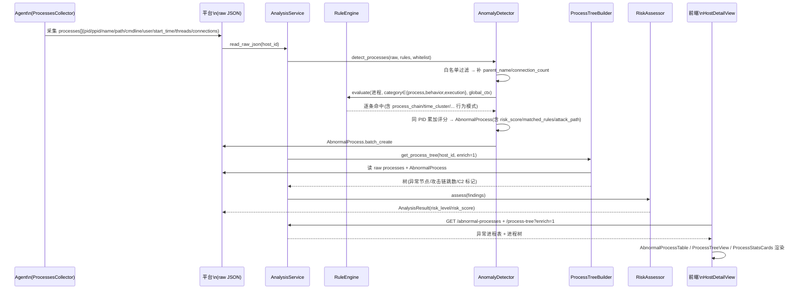

# 进程检测机制全景分析（基于真实代码）

> 调研目标：梳理 IR Platform 对个人/主机**进程**维度的检测能力，覆盖
> **采集维度 → 检测规则类别 → 风险评估 → 展示落点**，所有结论均来自源码事实，
> 并标注关键 `file:line` 与已发现的缺口/不一致。
>
> 调研基线：`backend/` + `agent/` + `frontend/` 当前工作区代码（2026-07-12）。

---

## 0. 系统定位与进程检测在数据流中的位置

IR Platform 是一个**本地部署、离线快照式**的个人应急响应平台。对进程的检测不依赖
实时 EDR/内核 hook，而是依赖 Agent 一次性采集的 JSON 快照，导入平台后由规则引擎做
离线分析。

完整数据流（进程视角）：

```mermaid
flowchart LR
    A[Agent 采集\nProcessesCollector] -->|psutil / wmic / tasklist\n原始 JSON: processes[]| B[平台导入\nImportService.read_raw_json]
    B --> C[AnalysisService.analyze]
    C --> D[白名单过滤\nWhitelistService]
    D --> E[RuleEngine.evaluate\n进程 + 规则]
    E --> F[AnomalyDetector 累加评分合并\n同一 PID 合并命中规则]
    F --> G[落库\nAbnormalProcess / SuspiciousConnection]
    G --> H[RiskAssessor 主机级评分\nrisk_level + risk_score]
    G --> I[ProcessTreeBuilder 构建进程树]
    H --> J[AnalysisResult 汇总]
    I --> J
    J --> K[前端展示\n进程树 / 异常进程 / 外连 / 时间线]
```

数据进入分析管线的入口：`backend/app/services/analysis_service.py:40` `AnalysisService.analyze(host_id)`。

---

## 1. 采集维度（采集端 Process 字段）

**源码**：`agent/collectors/processes.py`

`ProcessesCollector.collect()` 通过 `psutil.process_iter(...)` 主采集，失败回退 `wmic` /
`tasklist`（`_collect_fallback`，Windows 专用）。

每个进程采集到的字段（即后续所有检测可用的原始维度）：

| 字段 | 含义 | 类型 | 来源 |
| --- | --- | --- | --- |
| `pid` | 进程 ID | int | psutil |
| `ppid` | 父进程 ID | int | psutil |
| `name` | 进程名（含扩展名） | str | psutil |
| `path` | 可执行文件路径（exe） | str | psutil `exe` |
| `command_line` | 完整命令行 | str | psutil `cmdline` join |
| `user` | 运行用户 | str | psutil `username` |
| `start_time` | 启动时间（ISO 8601） | str | `create_time` → isoformat |
| `threads` | 线程数 | int | psutil `num_threads` |
| `connections` | 该进程的网络连接列表 | list | `_build_connection_map` |

`connections[]` 子结构（`processes.py:167`）：
`{protocol, local_address, local_port, remote_address, remote_port, state}`。

### 采集维度缺口（事实）
- **未采集**：工作目录(cwd)、环境变量、进程签名/数字签名状态、进程哈希(sha256)、
  `window_title`、会话(session)、内存占用、命令行参数拆分、PE 头信息。
- `threads` 在回退采集路径（`wmic`/`tasklist`）下被**写死为 0**（`processes.py:124,154`）。
  这曾导致"僵尸进程"误报，已在 `process_tree_builder.py:307-311` 改为仅当 `state ∈ {z,zombie,defunct}`
  才判"疑似僵尸"，不再用 `threads==0` 判定（见 §5）。
- 仅支持 Windows / Linux（`platform = ["windows","linux"]`，`processes.py:19`）。

---

## 2. 检测管线（进程检测的执行路径）

**源码**：`backend/app/analysis/anomaly_detector.py:41` `detect_processes()`

分步事实：

1. **白名单过滤**（`anomaly_detector.py:57`）：若传入 `whitelist_service`，先
   `filter_whitelisted(processes)` 剔除白名单进程。
2. **补充派生字段**（`anomaly_detector.py:69-75`）：
   - `parent_name`：由 `pid_to_proc[ppid]` 推导；
   - `connection_count`：`len(connections)`。
3. **构建全局上下文**（`anomaly_detector.py:79-85`）：
   - `process_map`：pid→进程 dict（供 `process_chain` / `anomalous_net_process` 跨进程回溯）；
   - `all_items`：进程列表（供 `time_cluster` 时间窗计数）；
   - `connections`：来自 `raw_data.network.connections`（供 `anomalous_net_process` 按 pid 关联）。
4. **规则筛选**（`anomaly_detector.py:78`）：仅取 `category ∈ {process, behavior, execution}` 的规则。
5. **RuleEngine.evaluate**（`anomaly_detector.py:87`）→ 返回逐条命中。
6. **累加评分合并**（`_apply_accumulated_scoring`，`anomaly_detector.py:104`）：
   同一 PID 的所有命中规则聚合，**累加 `risk_score`（上限 100）**，取最高 severity，
   提取 `attack_path`。

> 注意：进程检测只评估 `process/behavior/execution` 三类规则；`network/ioc`（外连）、
> `startup/persistence`（启动项）、`credential/lateral/...` 等由
> `detect_connections` / `detect_startup_items` 等独立入口评估（同一个 RuleEngine）。

---

## 3. 检测规则类别（针对进程的规则全集）

**规则目录事实**：`docs/rules-catalog.md`（自动生成自 `backend/app/rules/default_rules.json`，
共 **102 条**默认规则）。与进程直接或间接相关的类别：

| 类别 | 规则数 | 与进程的关系 |
| --- | --- | --- |
| `process` | 10 | **直接**：命令行正则匹配（PowerShell编码/绕过、certutil/bitsadmin下载、mshta/rundll32/regsvr32/wmic/cmd链、nc 后门） |
| `behavior` | 8 | **直接（进程行为模式）**：含 5 条 T1 新增专攻进程树/异常进程 |
| `execution` | 11 | 间接（命令行 LOLBin 执行特征） |
| `network` | 12 | 间接（进程外连的 C2 端口/域名/beaconing） |
| `credential` / `defense_evasion` / `lateral` / `impact` / `persistence` / ... | 其余 | 间接（命令行/进程名承载的攻击特征） |

### 6 种规则类型（`rule_engine.py:288` `RuleEngine`）
`regex`（字段正则）· `list`（黑名单值，可动态并入 `iocs` 表）· `threshold`（数值阈值）·
`behavior`（引擎内置行为模式）· `composite`（AND/OR 递归组合）· `exists`（字段存在性）。
另有**主机级** `attack_chain`（跨维度顺序+时间窗匹配，强制 severity=critical）。

### 进程专属规则种子（`docs/seed_rules_process.json`，5 条，均 `category=behavior`）
| name | label | 行为模式 | MITRE | 严重度 |
| --- | --- | --- | --- | --- |
| `process_name_spoof` | 进程名伪装（仿冒系统进程） | `process_name_spoof` | T1036/005 | high |
| `suspicious_process_path` | 可疑进程路径 | `suspicious_path` | T1036/004 | high |
| `hidden_or_spoofed_service_process` | 隐蔽/仿冒服务进程 | `hidden_process` | T1564/001 | high |
| `anomalous_network_process` | 异常网络连接进程 | `anomalous_net_process` | T1071 | high |
| `zombie_process_suspect` | 疑似僵尸/残留进程（待确认） | `zombie_process` | T1059 | high |

---

## 4. 进程专属检测能力清单（逐条行为模式）

引擎内置 **25 种行为模式**（`rule_engine.py:38` `BEHAVIOR_PATTERNS`），其中进程相关实现于
`_match_behavior`（`:832` 起）。下表聚焦**进程维度**可直接命中的模式：

| 行为模式 | 判定逻辑（代码事实） | 数据维度 | 误报控制 |
| --- | --- | --- | --- |
| `orphan_process` | 父 PID 不在本机进程列表（父已退出/伪造）；排除 ppid∈{0,1,4} | ppid + process_map | 排除 System/init/System |
| `suspicious_parent` | 父进程∈白名单(office/浏览器/PDF/压缩/IM) 且 子进程∈{powershell,cmd,wscript,cscript}；可由 condition 覆盖 | parent_name + name | 条件驱动 + 默认清单 |
| `unsigned_process` | path 非空且不在 system32/syswow64/usr/bin/usr/sbin | path | 仅系统目录白名单 |
| `process_chain` | 从当前进程回溯父链(≤10层)，链中≥min_chain_length 个进程命中可疑父/子模式，写入 `_attack_path` | process_map 跨进程 | 需同时有 suspicious_parent + suspicious_child |
| `time_cluster` | 同一时间窗(window_minutes)内 ≥min_count 个进程启动（预排序+二分，O(n log n)） | start_time + all_items | 时间窗+数量阈值 |
| `short_lived` | 目标解释器(默认 powershell/cmd) threads=0 或存活<max_alive_seconds 且 threads≤1 | name + threads + start_time | 仅目标进程 + 存活阈值 |
| `process_name_spoof` | 双扩展名 / 大小写混淆 / 编辑距离==1 相似名 / Unicode 同形，仿冒系统进程 | name | 系统进程白名单 + 严格阈值 |
| `suspicious_path` | temp/appdata/programdata/downloads/desktop/public/users 等用户可写目录，或伪装 system32，或用户目录 exe，或 ADS/UNC | path | Program Files/system32/SysWOW64 白名单 + AppData\Local\Programs 豁免 |
| `hidden_process` | 同名(svchost等)不同路径（仿冒服务）；或交互式进程无窗口标题+session>0 | name + path(+window_title/session) | 退化判定(无窗口字段时) |
| `anomalous_net_process` | 脚本解释器/非系统进程 发起非业务端口外连，或连 C2 端口(4444/8443/1337/31337/6667/9999/1080/5900) | connections + name + path | 业务端口白名单 + Program Files 豁免 |
| `zombie_process` | 线程==0 或完全孤立 且 启动>threshold_days(默认7) | threads + start_time + connections | 启发式，severity=high 且 reason 明示"待人工确认" |

此外，`credential_dump` / `uac_bypass` / `lateral_movement` / `ransomware_behavior` /
`webshell_activity` / `dll_sideload` / `defense_evasion` 等模式也以**进程命令行/进程名**
为主要输入，但归类于各自攻击战术，不在进程专属清单内。

**IPC/外连维度**：`detect_connections`（`anomaly_detector.py:206`）评估 `network/ioc` 规则，
输出 `SuspiciousConnection`（含 process_name/pid 回联）。

---

## 5. 风险评估（两级评分模型）

### 5.1 进程级累加评分（`anomaly_detector.py:12` `SEVERITY_SCORES`）
```
critical=35, high=20, medium=10, low=5, info=1
risk_score = min(Σ命中规则分值, 100)
severity   = 命中规则中最高的
```
合并逻辑：`_apply_accumulated_scoring`（`anomaly_detector.py:104`）。
`attack_path`：优先取 `process_chain` 命中写入的链；否则用 `parent_name → name` 兜底。

### 5.2 主机级整体评分（`risk_assessor.py` `RiskAssessor.assess`）
- 按类别累加（abnormal_processes / suspicious_connections / startup / persistence / ioc），
  每类 `_calculate_category_score` = `min(ΣSEVERITY_WEIGHTS, 100)`。
- `SEVERITY_WEIGHTS`（`risk_assessor.py:16`）= `critical:35, high:20, medium:10, low:5, info:1`
  （与进程级一致）。
- 总分 `min(score, 100)`，映射等级（`risk_assessor.py:25`）：
  `≥80 critical / ≥60 high / ≥40 medium / ≥20 low / 其余 info`。
- 生成 `summary` 文案（含"异常进程 N 项"等计数）与处置建议。
- **攻击链**命中单独记入 `details.attack_chains`，**不影响**主机总分（避免改变历史评估口径，
  `analysis_service.py:204-214`）。

### 5.3 代码事实中的不一致（需澄清）
- `anomaly_detector.py:110` 的 docstring 写"累加 risk_score：critical=40, high=25, medium=10,
  low=5, info=2"，但**实际常量**为 `critical=35/high=20/...( :12 )`，且累加用的是
  `SEVERITY_SCORES.get(severity, 2)`。即 docstring 与运行代码不一致（权重 40/25 vs 35/20）。
  建议以常量定义为准并修订注释。

---

## 6. 展示落点（前端 Display Landing Points）

**主入口**：`frontend/src/views/HostDetailView.vue`（主机详情页，Tab 布局）。

进程检测结果的展示落点：

| 落点 | 组件 | 展示内容（事实） |
| --- | --- | --- |
| 顶部主机画像区 | `HostDetailView.vue:23-50` | 风险等级(`RiskBadge`) + 风险分数 `analysis.risk_score/100` + 分析摘要(`analysis.summary`，含异常进程计数) |
| **进程树** Tab | `ProcessTreeView.vue` + `ProcessTreeChart.vue` | KPI 条(进程总数/高危/攻击链/C2外连)；树节点着色(severity)；详情面板(父进程/启动时间/状态/命中规则/外连情报/C2/攻击链跳数)；搜索+过滤(全部/高危及以上/仅攻击链) |
| **异常进程** Tab | `AbnormalProcessTable.vue` + `ProcessStatsCards.vue` | 统计卡(异常总数/Critical/High/平均风险评分) + 饼图(严重度分布) + 条形图(规则类别分布 Top15)；表格列(PID/进程名/路径/命令行/父进程/严重程度/风险评分进度条/命中规则可展开/原因/详情) |
| 进程详情面板 | `ProcessDetailPanel.vue` | 由异常进程表格"详情"按钮或进程树节点点击触发 |
| **可疑外连** Tab | `SuspiciousConnTable.vue` | `SuspiciousConnection`（含 process_name/pid 回联）；支持"一键威胁情报检测" |
| **网络连接** Tab | `NetworkConnectionTable.vue` | 原始网络连接(含外连情报) |
| **时间线** Tab | `EventTable.vue` / `TimelineChart.vue` / `KillChainView.vue` | `event_types=process` 维度事件；进程启动/命令行纳入时间线 |
| 攻击链 DAG | `AttackChainDag.vue` | 由 AI 报告攻击链渲染（当前 `HostDetailView` 的 `aiReportAttackChain` 返回 `null`，`HostDetailView.vue:736`，暂未接入真实数据） |

### 后端 API 落点（`backend/app/api/analysis.py`）
| 端点 | 用途 |
| --- | --- |
| `POST /hosts/{id}/analyze` | 触发分析（写入异常进程/外连/树/风险） |
| `GET /hosts/{id}/analysis` | 汇总（risk_level/risk_score/total_findings/summary/details） |
| `GET /hosts/{id}/abnormal-processes` | 异常进程列表（驱动"异常进程"Tab） |
| `GET /hosts/{id}/process-tree?enrich=1` | 进程树（enrich=1 返回 severity/parent_name/connections/attack_chain_step 等增强字段） |
| `GET /hosts/{id}/suspicious-connections` | 可疑外连（进程回联） |
| `GET /hosts/{id}/timeline?event_types=process` | 进程时间线事件 |
| `GET /hosts/{id}/network-connections` | 原始网络连接 |

前端 `HostDetailView.loadAllResults`（`HostDetailView.vue:477`）分 4 阶段拉取：
核心分析结果 → 进程树(enrich=1) → 采集类 Tab(users/services/usb/...) → 新增采集 Tab(network/filehash/wmi/registry)。

---

## 7. 完整进程检测数据流（Sequence）



---

## 8. 关键发现、缺口与待澄清项

### 8.1 能力边界（事实）
1. **离线快照式**：进程检测依赖一次性导入的 JSON，无实时/持续监控、无进程注入/无文件无进程
   (fileless) 的实时行为捕获。无法检测"采集时刻之后"发生的行为。
2. **检测以命令行/路径/父链为主**：绝大多数规则基于 `command_line` 正则或进程名/路径启发式，
   缺少二进制级特征（无 PE 哈希、无签名验证、无导入表/行为沙箱）。
3. **白名单前置**：白名单进程在 `detect_processes` 入口被整体剔除（`anomaly_detector.py:57`），
   可能漏掉"白名单进程派生的恶意子进程链"（除非子进程本身命中规则）。

### 8.2 数据维度缺口（§1）
- 缺 `cwd`、环境变量、数字签名、进程哈希、窗口标题/会话、内存。
- `threads` 回退采集写死 0 的副作用已由进程树侧修复，但 `zombie_process` 行为模式
  （`rule_engine.py:1717`）仍用 `threads==0` 作为"疑似残留"信号之一（启发式，severity=high
  且 reason 显式标注"待人工确认"）。

### 8.3 代码不一致（需澄清）
- `anomaly_detector.py` 进程级累加权重 docstring(40/25/...) 与常量(35/20/...) 不一致（§5.3）。
- 前端 `HostDetailView.aiReportAttackChain` 恒为 `null`（`HostDetailView.vue:736`），
  攻击链 DAG 组件已存在但未接入真实攻击链数据（攻击链仅在 `risk_result.details.attack_chains`
  中以文本步骤存在）。

### 8.4 评分口径
- 进程级（`min(Σ,100)`）与主机级（`min(Σ类别分,100)` 再映射等级）是两套独立累加，
  前者用于单进程排序/着色，后者用于主机风险定级；两者权重表一致(35/20/10/5/1)。

---

## 9. 关键代码索引（file:line）

| 关注点 | 位置 |
| --- | --- |
| 进程采集字段 | `agent/collectors/processes.py:59-69`（主采集）、`:158-186`（连接映射）、`:76-156`（回退） |
| 进程检测入口 | `backend/app/analysis/anomaly_detector.py:41` `detect_processes` |
| 进程累加评分 | `backend/app/analysis/anomaly_detector.py:104` `_apply_accumulated_scoring`；权重 `:12` |
| 规则引擎 | `backend/app/rules/rule_engine.py:288` `RuleEngine`；行为模式 `:38`；`_match_behavior` `:832` |
| 进程链检测 | `backend/app/rules/rule_engine.py:1293` `_match_process_chain` |
| 时间聚类 | `backend/app/rules/rule_engine.py:1369` `_match_time_cluster` |
| 进程名伪装 | `backend/app/rules/rule_engine.py:1514` `_match_process_name_spoof` |
| 可疑路径 | `backend/app/rules/rule_engine.py:1560` `_match_suspicious_path` |
| 隐蔽/仿冒服务 | `backend/app/rules/rule_engine.py:1616` `_match_hidden_process` |
| 异常网络进程 | `backend/app/rules/rule_engine.py:1658` `_match_anomalous_net_process` |
| 僵尸进程 | `backend/app/rules/rule_engine.py:1717` `_match_zombie_process` |
| 攻击链(主机级) | `backend/app/rules/rule_engine.py:1889` `_match_attack_chain` |
| 进程树构建 | `backend/app/analysis/process_tree_builder.py:33` `build`；增强字段 `:254` |
| 主机级风险 | `backend/app/analysis/risk_assessor.py:34` `assess`；权重 `:16`；等级 `:25` |
| 分析编排 | `backend/app/services/analysis_service.py:40` `analyze`；进程树 `:606` `get_process_tree` |
| 展示入口 | `frontend/src/views/HostDetailView.vue` |
| 进程树视图 | `frontend/src/components/ProcessTreeView.vue` |
| 异常进程表 | `frontend/src/components/AbnormalProcessTable.vue` |
| 进程统计卡 | `frontend/src/components/ProcessStatsCards.vue` |
| 进程详情 | `frontend/src/components/ProcessDetailPanel.vue` |
| 后端 API | `backend/app/api/analysis.py:133`(abnormal) `:140`(tree) `:18`(analyze) |
| 进程规则种子 | `docs/seed_rules_process.json`（5 条） |
| 规则目录 | `docs/rules-catalog.md`（102 条，含 process/behavior 分类） |

---

## 10. 小结

本系统的进程检测是一条**"采集(9 字段) → 白名单 → 规则引擎(6 类/25 行为模式) → 同 PID
累加评分 → 进程树 + 主机级定级 → 前端多 Tab 可视化"** 的完整离线链路。进程专属能力集中在
`behavior` 类别的 5 条 T1 种子规则（伪装/路径/仿冒服务/异常外连/僵尸）及 `process_chain`/
`time_cluster`/`orphan_process`/`short_lived`/`suspicious_parent` 等跨进程行为模式，并以
异常进程表、进程树（攻击链跳数 + C2 标记）、统计卡三类前端落点呈现。主要短板在于**离线快照
本质**与**二进制级特征缺失**，以及少量代码注释/接入不一致（见 §8）。
