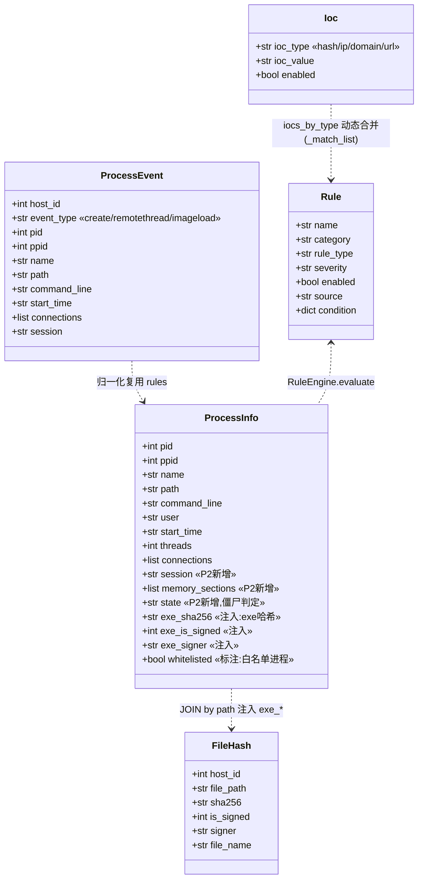
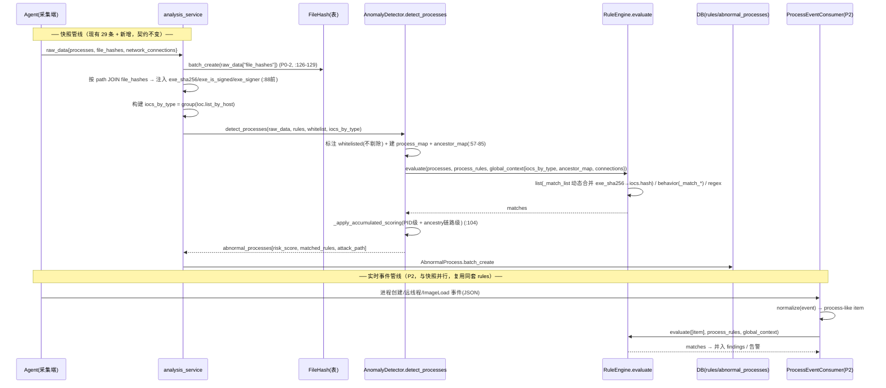
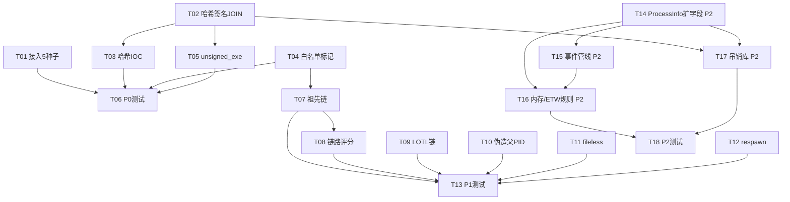

# 进程检测加强规则 — 实现方案与任务分解

> 架构师交付物（SOP）：基于 `docs/process_detection_enhancement_rules.md` 已批准的设计，产出
> 供工程师（寇豆码）按图施工的系统设计 + 任务分解。**纯设计，不改任何代码**，全部引用真实 `file:line`。
>
> 关键事实（已逐行核对当前代码，非早期设计文档）：
> - `process_tree_builder.py` 已存在多级进程树 + `attack_path` 解析（`process_tree_builder.py:331`），
>   `session` 字段已在前端展示但后端留空降级（`:313`），僵尸 `status` 由 `state` 字段判定（`:311`）。
> - `file_hashes` 已由 `analysis_service.py:126-129` 落库（`FileHash`），且 `analysis_service.py:141-180`
>   已做文件哈希 IOC 匹配（`TI_malware_hash`）。
> - `RuleEngine._match_list`（`rule_engine.py:658`）已支持**动态 IOC 合并**：`condition.field` 经
>   `FIELD_TO_IOC_TYPE`（`rule_engine.py:256`）映射到 ioc 类型，自动并入 `global_context["iocs_by_type"]`。
> - 5 条进程种子规则逻辑（`_match_*`）与 `BEHAVIOR_PATTERNS`（`rule_engine.py:60-64`）已就绪，仅未加载。
> - `detect_processes` 在 `analysis_service.py:88` 调用，白名单在 `:57-58` 整体剔除。

---

## 1. 实现方案 + 框架选型

**总体策略**：完全复用现有规则引擎，不做重写。
- **规则存储/加载**：复用 `rules` 表 + `RuleEngine.load_rules()`（`rule_engine.py:295`）+ `loader.load_default_rules()`
  （`loader.py:25`，glob `rules/*.json`）+ `database.py:544` 初始化入库。新增规则一律走同构 JSON，
  新增行为模式在 `BEHAVIOR_PATTERNS` 注册 + `_match_*` 实现。
- **匹配引擎**：复用 `RuleEngine.evaluate`（`rule_engine.py:491`）与既有 matcher（regex/list/threshold/
  exists/composite/behavior/attack_chain）。**不新增 matcher 类型**，仅新增 behavior pattern 与 list 规则。
- **进程哈希 IOC**：**不改动 `ioc_checker.py`**（其职责是 network/registry IOC）。进程 exe 哈希走
  `RuleEngine._match_list` 已有的动态 IOC 合并机制——把进程注入字段 `exe_sha256` 注册进
  `FIELD_TO_IOC_TYPE`（→ `"hash"`），由 `global_context["iocs_by_type"]` 自动并入主机 hash IOC。
- **快照管线**：`AnomalyDetector.detect_processes`（`anomaly_detector.py:41`）**保持不变的对外契约**，
  仅内部：①白名单由"整体剔除"改"标注 `whitelisted` 仍建树"；②增量注入 `exe_*` 字段；③扩 `global_context`
  （`ancestor_map` + `iocs_by_type`）。
- **实时事件管线（P2）**：新增 `process_event_consumer.py`，与 snapshot 管线**并行共存**——事件流把单条
  进程事件归一化为 process-like item，直接复用 `RuleEngine.evaluate`（同一套 `rules`），不影响现有 29 条。

**本期可实现 vs 需排期**：
- 【本期可实现（P0/P1）】= T01–T13（种子接入、哈希/签名 JOIN、白名单穿透、祖先链、链路评分、
  LOTL 链、伪造父 PID、fileless 快照版、respawn 快照近似、测试）。**无新依赖、无 Agent 改造**。
- 【需新数据源/架构演进、另行排期（P2）】= T14–T18（ProcessInfo 扩字段、process_events 表 + 事件消费、
  内存注入/ETW 类规则、签名吊销库、测试）。**需 Agent 端协同采集内存/ETW/session/事件**。

---

## 2. 文件清单（逐条标注改动点）

| 文件 | 批次 | 改动点 |
|---|---|---|
| `backend/app/rules/seed_rules_process.json` | P0 | **新建（从 `docs/seed_rules_process.json` 移入）**，被 `loader.load_default_rules()` 自动加载 |
| `backend/app/services/analysis_service.py` | P0 | `:88` 前：用 `raw_data["file_hashes"]` 按 `path` JOIN，给 `raw_data["processes"]` 注入 `exe_sha256/exe_is_signed/exe_signer`；构建 `iocs_by_type` 传给 `detect_processes` |
| `backend/app/analysis/anomaly_detector.py` | P0/P1 | `:57-58` 白名单改"标注 `whitelisted` 不剔除"；`:62-75` 增建 `ancestor_map`（多级祖先）；`:79-85` `global_context` 增 `iocs_by_type`+`ancestor_map`；`:104` `_apply_accumulated_scoring` 增链路级（ancestry）聚合 |
| `backend/app/rules/rule_engine.py` | P0/P1/P2 | `:256` `FIELD_TO_IOC_TYPE` 加 `"exe_sha256":"hash"`；`:38` `BEHAVIOR_PATTERNS` 注册新 pattern；新增 `_match_unsigned_exe`/`_match_whitelist_derived_chain`/`_match_ancestry_chain`/`_match_parent_pid_spoof`/`_match_fileless_residency`/`_match_process_respawn`（P1）+ 内存/ETW/跨会话类（P2） |
| `backend/app/rules/default_attack_chain.json` | P1 | 新增 `lotl_chain` 规则（process 维多 step：compress→decode→execute），复用 `_match_attack_chain`（`:1889`） |
| `backend/app/schemas/agent_data.py` | P2 | `:69-79` `ProcessInfo` 扩 `session` / `memory_sections` / `state`（规范化） |
| `backend/app/models/analysis.py` | P2 | 新增 `ProcessEvent` 模型（事件落库） |
| `backend/app/analysis/process_event_consumer.py` | P2 | **新建**：消费 Agent 事件 → 归一化 → `RuleEngine.evaluate`（复用 rules） |
| `backend/app/services/whitelist_service.py` | P0 | `:143` `filter_whitelisted` 改为"标注不剔除"（或 `detect_processes` 直接调用 `is_whitelisted` 标注）；`:137` `signature` stub 本期保持 |
| `backend/tests/test_process_detection.py` | P0/P1/P2 | 新增各批次用例（见 T06/T13/T18） |

> 注：`ioc_checker.py` **无需改动**（进程哈希 IOC 经 `_match_list` 动态合并实现，见 §1）。

---

## 3. 数据结构与接口



**注入字段约定（检测期计算，不落库）**：
- `exe_sha256`：来自 `FileHash.sha256`，按 `process.path == FileHash.file_path`（lower 归一）匹配。
- `exe_is_signed`：来自 `FileHash.is_signed`（0/1）。
- `exe_signer`：来自 `FileHash.signer`。
- `whitelisted`：`bool`，标记该进程命中白名单（保留在列表/树中，仅其子链可被 `whitelist_derived_chain` 评估）。

**ProcessEvent 表（P2）schema**：`id, host_id, event_type, pid, ppid, name, path, command_line,
start_time, connections(json), session, created_at`。消费端将其归一化为 ProcessInfo 形态入 `RuleEngine.evaluate`。

**事件管线适配接口（P2）**：`ProcessEventConsumer.consume(event: dict) -> normalize(event) -> item: dict`
（含 pid/ppid/name/path/command_line/start_time/connections），调用
`RuleEngine.evaluate([item], process_rules, global_context=build_context(host_id))`，命中并入 findings。

---

## 4. 程序调用流程（时序图）



---

## 5. 任务列表（有序、含依赖、分批次）

> 字段：TID / 名称 / 改哪个文件 / 加什么 / 依赖 / 验收点 / 优先级。

### 批次 1 — P0（本期可实现，零/低代码风险）

- **T01** 接入 5 条进程种子规则
  - 文件：`backend/app/rules/seed_rules_process.json`（新建，内容 = `docs/seed_rules_process.json`）
  - 加什么：5 条 `category=behavior` 规则（process_name_spoof / suspicious_process_path /
    hidden_or_spoofed_service_process / anomalous_network_process / zombie_process_suspect）；
    `_match_*` 与 `BEHAVIOR_PATTERNS` 已存在，仅差加载。
  - 依赖：无
  - 验收：重置/重启后 `RuleEngine.load_rules()` 返回该 5 条；合成进程数据可命中对应 `_match_*`
    （`rule_engine.py:1515/1561/1617/1659/1718`）。

- **T02** 进程 exe 哈希/签名 JOIN 注入
  - 文件：`backend/app/services/analysis_service.py`（`:88` 前）
  - 加什么：读 `raw_data["file_hashes"]` 建 `path→{sha256,is_signed,signer}` map，给
    `raw_data["processes"]` 每项注入 `exe_sha256/exe_is_signed/exe_signer`（纯内存 JOIN，
    不依赖 DB 时序）。
  - 依赖：无（FileHash 已由 `:126-129` 落库；raw_data 同源）
  - 验收：进程项含 `exe_sha256`；无对应 file_hash 时字段为 `None` 不报错。

- **T03** 进程维度哈希 IOC 匹配（malicious_hash_process）
  - 文件：`backend/app/rules/rule_engine.py`（`FIELD_TO_IOC_TYPE` 加 `"exe_sha256":"hash"`，`:256`）；
    `backend/app/analysis/anomaly_detector.py`（`:79-85` global_context 增 `iocs_by_type`）；
    `backend/app/rules/`（新增 list 规则 JSON，`field=exe_sha256, match_mode=exact`）
  - 加什么：注册映射 + list 规则；`detect_processes` 接受 `iocs_by_type` 并入 global_context
    （复用 `Ioc.list_by_host` 分组，同其它维度机制）。
  - 依赖：T02
  - 验收：进程 `exe_sha256` 命中主机 `iocs.hash` → `malicious_hash_process` 命中（critical）；
    未命中无副作用。

- **T04** 白名单标记化（不整体剔除）
  - 文件：`backend/app/analysis/anomaly_detector.py`（`detect_processes` `:57-58`）；
    `backend/app/services/whitelist_service.py`（`filter_whitelisted` `:143` 改标注）
  - 加什么：`detect_processes` 不再 `filter_whitelisted` 整体剔除，改为遍历 `proc["whitelisted"]=True`
    并保留建树；新增 behavior pattern `whitelist_derived_chain`（注册 + `_match_*`），当 whitelisted
    进程派生 script/LOLBin 子进程时命中；命中 whitelisted 进程本身时 reason 标 "[白名单进程]" 且评分不计入纯白名单误报。
  - 依赖：无
  - 验收：白名单进程不再从列表消失；其恶意子链被 `whitelist_derived_child` 捕获；纯白名单进程不误报。

- **T05** unsigned_executable 行为模式 + 规则
  - 文件：`backend/app/rules/rule_engine.py`（新增 `_match_unsigned_exe` + 注册 `unsigned_exe` `:38`）；
    `backend/app/rules/`（新增规则 JSON，`severity=high`）
  - 加什么：`_match_*` 读 `exe_is_signed == 0`（或 `exe_signer` 空）且 `path` 非系统目录。
  - 依赖：T02
  - 验收：无签名 exe 命中；系统目录签名进程不误报。

- **T06** 测试 — P0 批次
  - 文件：`backend/tests/test_process_detection.py`
  - 加什么：5 种子命中、JOIN 注入、malicious_hash 命中、白名单标 whitelisted + derived child、
    unsigned_executable 用例。
  - 依赖：T01–T05
  - 验收：全部通过，全局回归无退化。

### 批次 2 — P1（本期可实现，快照可支撑）

- **T07** ancestry 多级祖先回溯 + grandparent_chain_anomaly
  - 文件：`backend/app/analysis/anomaly_detector.py`（`detect_processes` `:62-75` 增建 `ancestor_map`）；
    `backend/app/rules/rule_engine.py`（新增 `_match_ancestry_chain` + 注册 `ancestry_chain`）；规则 JSON
  - 加什么：`ancestor_map[pid] = [ppid, grand_ppid, ...]`（沿 ppid 回溯，遇 0/1/4 或环停止）；
    行为模式读 ancestor_map 判定祖父可疑。
  - 依赖：T04
  - 验收：祖父为可疑服务/异常时命中；正常链不误报。

- **T08** behavior_chain_scoring（链路级评分）
  - 文件：`backend/app/analysis/anomaly_detector.py`（`_apply_accumulated_scoring` `:104`）
  - 加什么：从"按 PID 聚合"升级为"按 ancestry 链路聚合"——同祖先链多节点命中累加链路级 `risk_score`，
    并写入代表链路 `attack_path`。
  - 依赖：T07
  - 验收：同一祖先链 ≥2 节点命中时链路 risk_score 高于单 PID；attack_path 表示完整链。

- **T09** lotl_chain_combo（复用 attack_chain 框架）
  - 文件：`backend/app/rules/default_attack_chain.json`（新增 `lotl_chain`，process 维多 step：
    compress→decode→execute）
  - 加什么：新 attack_chain 规则；`_match_attack_chain`（`rule_engine.py:1889`）已支持 process 维
    （`default_attack_chain.json` 已有 step1 process 维先例）。
  - 依赖：无强依赖
  - 验收：依次出现 compress→decode→execute 命中；单步不命中。

- **T10** fabricated_parent_pid（字段级）
  - 文件：`backend/app/rules/rule_engine.py`（新增 `_match_parent_pid_spoof` + 注册 `parent_pid_spoof`）；规则 JSON
  - 加什么：字段级判定 `ppid == pid` 或 `ppid` 指向自身/不可能父（升级现有 `parent_pid_spoofing` 正则规则）。
  - 依赖：无
  - 验收：`ppid==pid` 命中；正常父不误报。

- **T11** fileless_memory_residency（快照可部分实现）
  - 文件：`backend/app/rules/rule_engine.py`（新增 `_match_fileless_residency` + 注册 `fileless_residency`）；规则 JSON
  - 加什么：`path` 空/UNC/内存 且 `connection_count>0` 或 `threads>0`（用现有 `path`/`connections`字段）。
  - 依赖：无
  - 验收：无磁盘 exe 有连接命中；正常有 path 进程不误报。

- **T12** process_respawn_loop（快照近似）
  - 文件：`backend/app/rules/rule_engine.py`（新增 `_match_process_respawn` + 注册 `process_respawn`）；规则 JSON
  - 加什么：同 `path`/`command_line` 在窗口内重复 ≥K（用现有 `start_time`/`command_line`）；精确计数版留待 P2 事件流增强。
  - 依赖：无
  - 验收：同 cmdline 重复 ≥K 命中；单次不误报。

- **T13** 测试 — P1 批次
  - 文件：`backend/tests/test_process_detection.py`
  - 加什么：ancestry、chain scoring、lotl、parent_pid_spoof、fileless、respawn 用例。
  - 依赖：T07–T12
  - 验收：全部通过。

### 批次 3 — P2（需新数据源/架构演进，另行排期）

- **T14** ProcessInfo 扩字段（session / memory_sections / state）
  - 文件：`backend/app/schemas/agent_data.py`（`ProcessInfo` `:69-79`）
  - 加什么：扩 `session`、`memory_sections`、`state`（僵尸判定字段，对齐 `process_tree_builder.py:311`）。
  - 依赖：无（schema 扩展，`extra="allow"` 兼容旧数据）
  - 验收：新字段被 Pydantic 解析；缺失时不报错。**需 Agent 端同步采集（跨团队）**。

- **T15** process_events 表 + 实时事件消费管线
  - 文件：`backend/app/models/analysis.py`（新增 `ProcessEvent`）；
    `backend/app/analysis/process_event_consumer.py`（新建）
  - 加什么：事件落库 + 消费归一化 → `RuleEngine.evaluate`（复用 rules，与 snapshot 并行）。
  - 依赖：T14
  - 验收：事件流触发规则命中；snapshot 管线结果不变。**需 Agent 端事件推送（跨团队）**。

- **T16** 内存注入/ETW 类规则
  - 文件：`backend/app/rules/rule_engine.py`（新增 `_match_memory_injection` / `_match_interpreter_mem_pe` /
    `_match_etw_amsi_tamper` / `_match_injection_window` / `_match_vanished_process` / `_match_cross_session`
    + 注册对应 pattern）；规则 JSON
  - 加什么：fileless_reflective_injection / script_interpreter_memory_pe / amsi_etw_tamper /
    injection_window_anomaly / process_vanished_between_snapshots / cross_session_parent_child。
  - 依赖：T14（memory_sections/session）、T15（事件流）
  - 验收：注入/跨会话/消失进程命中（需事件流 + 内存采集样本）。

- **T17** revoked_expired_signature（吊销库）
  - 文件：新增吊销库数据源（CRL/OCSP 离线缓存）+ `backend/app/rules/rule_engine.py`（`_match_revoked_sig`）
  - 加什么：校验 `exe_signer` 签发 CA 是否吊销/过期。
  - 依赖：T02/T14（exe_signer 已可用）
  - 验收：签名有效但 CA 吊销命中。

- **T18** 测试 — P2 批次
  - 文件：`backend/tests/`
  - 加什么：事件消费、内存注入、跨会话、吊销用例。
  - 依赖：T14–T17
  - 验收：全部通过。

### 任务依赖图



**任务总数**：18（P0=6 / P1=7 / P2=5）。

---

## 6. 依赖包列表

后端**无新增第三方依赖**：
- 实时事件消费（P2）仅复用现有 JSON/Pydantic 解析，事件由 Agent 推送（与现有 `raw_data` 同通道），
  后端无需 eBPF/ETW 库。
- eBPF（Linux）/ ETW（Windows）/ auditd 采集在 **Agent 端**实现，属跨团队职责，不在本仓库后端范围。
- 其余全部复用现有栈（pydantic / sqlite / 既有 `RuleEngine` / `psutil` 已在采集侧）。

```text
# 现有（无需新增）
pydantic        # schema 校验（ProcessInfo/ProcessEvent）
sqlite3         # 规则/异常进程落库
# P2 事件采集（Agent 端，非后端）
#   Windows: pywin32 / ETW 订阅（Agent 仓库）
#   Linux:   auditd 日志解析 / eBPF(bcc)（Agent 仓库）
```

---

## 7. 共享知识（跨文件约定）

- **注入字段命名**：`exe_sha256` / `exe_is_signed` / `exe_signer`（前缀 `exe_` 区分于 `FileHash` 的
  `sha256/is_signed/signer`，明确"进程 exe 的"），检测期注入、不落库。
- **whitelisted 标记约定**：进程项加 `whitelisted: bool`（True=命中白名单）；保留在列表/树中使子进程
  `parent_name` 可解析；仅 `whitelist_derived_chain` 可评估其派生子链；命中 whitelisted 进程本身时
  reason 标 "[白名单进程]" 且评分不计入纯白名单误报。
- **behavior pattern 命名与注册**：snake_case；**必须**注册进 `BEHAVIOR_PATTERNS`（`rule_engine.py:38`）
  并在 `_match_behavior`（`rule_engine.py:833`）加分支或新增专用 `_match_*` 调度；新增 matcher 类型需同步更新校验。
- **attack_path 序列化**：进程名链 `"A → B → C"`（分隔符兼容 `"->"`/`"=>"`，见
  `process_tree_builder.py:331-398`）；解析失败/空 → `None`（异常进程 `attack_path=None`）。
- **iocs_by_type**：`global_context["iocs_by_type"]` 由主机 IOC 按 `type` 分组（hash/ip/domain/url），
  供 `_match_list` 动态合并（`rule_engine.py:658`）；进程维度需 `detect_processes` 接收并并入。
- **ancestor_map**：`global_context["ancestor_map"][pid] = [ppid, grand_ppid, ...]`（沿 ppid 回溯，
  遇 0/1/4 或环停止）；供 `ancestry_chain` 与链路级评分使用。
- **僵尸判定对齐**：行为模式 `zombie_process_suspect` 用 threads/orphan/start_time 启发式（命中即异常，
  由 `is_abnormal` 驱动 tree `status`）；与 `process_tree_builder.py:311` 的 `state∈{z,zombie,defunct}`
  两种判定并存，异常标记优先。
- **向后兼容**：所有新增规则同构进 `rules` 表；新增 behavior pattern 不影响既有 29 条；realtime 与
  snapshot 并行，不动现有检测逻辑（契约保护，见 `process_detection_enhancement.md §5`）。

---

## 8. 待明确事项

1. **P2 实时管线是否本期真正落地？** 建议本期仅定义 `ProcessEvent` schema + `process_event_consumer`
   骨架（T15 前半），eBPF/ETW/auditd 采集排期另议（跨团队）。需主理人确认本期是否只做骨架。
2. **ProcessInfo 新字段是否需 Agent 端同步支持？** 是（`session`/`memory_sections`/`state` 需 Agent
   采集）。后端先扩 schema（`extra="allow"` 兼容），采集协同排期另议。
3. **fileless_reflective_injection 是否随批次3 内存采集一起做？** 是（依赖 T14/T15），不在本期 scope。
4. **ioc_checker.py 是否需要改？** 评估结论：**不需要**。进程哈希 IOC 走 `RuleEngine._match_list`
   动态 IOC 合并（T03），`ioc_checker.py` 维持 network/registry IOC 职责。
5. **signature 白名单类别 stub**（`whitelist_service.py:137`）是否随 `unsigned_executable` 一起启用？
   建议本期不做（需签名库）；仅做 `unsigned_exe` 行为模式 + `exe_is_signed` 注入即可。
6. **zombie 行为模式与 tree `status` 的语义一致性**：建议以"异常标记优先"统一（命中即异常，tree 标
   疑似），避免 threads==0 在回退采集环境误报（已见 `process_tree_builder.py:308-311` 注释）。
7. **LOTL 链 step 的 dimension 字段**：`default_attack_chain.json` 现有 step 用 `dimension: "process"`
   + `match.type: "regex"/"list"`，新增 `lotl_chain` 沿用此结构即可；是否要新增 `script_interpreter`
   等细分 dimension 待定。
