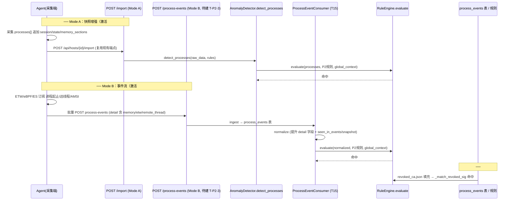
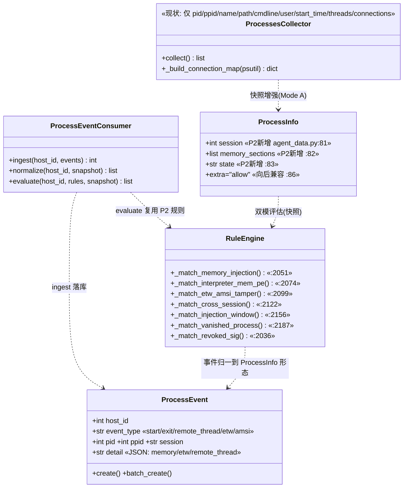

# P2 进程检测加强规则 — Agent 采集端方案 + 后端链路可行性评估

> 架构师交付物（SOP「架构设计 + 任务分解」阶段）。**纯设计文档 + PoC 验证计划，不修改任何业务代码。**
> 目标：补齐让 P2 真正激活的 **Agent 采集端方案**，并证明**后端半链路可跑通**（Agent 半链路为设计级，本沙箱不可运行）。
>
> 全部结论基于逐行读代码，引用真实 `file:line`。

---

## 0. 关键事实（已逐行核对，非早期设计）

- **P2 后端逻辑已全部就绪，处于「优雅降级休眠态」**：7 条 P2 规则的 `_match_*` 均已实现、已在 `BEHAVIOR_PATTERNS` 注册、已在 `RuleEngine._match_behavior` 调度（`rule_engine.py:1370-1383`），**缺数据时不命中、不崩溃**（每个 matcher 在缺字段时 `return False`）。
- **契约已落地**：`ProcessInfo` 已扩 `session`/`memory_sections`/`state`（`agent_data.py:80-83`，`extra="allow"` 向后兼容 `:86`）；`ProcessEvent` 模型已建（`process_event.py`）；`process_events` 表 DDL 已存在（`database.py:437-452`）；`ProcessEventConsumer` 已建（`process_event_consumer.py`，含 `ingest/normalize/evaluate`）。
- **当前 Agent 只做「快照」、不采集新字段、无事件订阅**：`ProcessesCollector.collect()` 仅产出 `pid/ppid/name/path/command_line/user/start_time/threads/connections`（`processes.py:59-69`），**无** `session/memory_sections/state`，**无** 任何进程事件；平台仅 `["windows","linux"]`（`processes.py:19`，**无 macOS**）。Agent 以**文件输出**方式采集（`agent.py` + `utils/output.py`），经 `POST /api/hosts/{host_id}/import`（`import_data.py:16`）入库。
- **唯一缺口在「数据供给」**：Agent 端未供给 → P2 规则永不命中。**本方案即定义 Agent 应如何供给这些数据**，并给出后端半链路 PoC。
- **已有 PoC 雏形**：`tests/test_process_enhancement_p2.py` 已对 7 条规则逐一做 `RuleEngine.match_rule(...)` 单测（含降级）。本方案 PoC 在其之上补**端到端集成层**（走 `RuleEngine.evaluate` / `ProcessEventConsumer.evaluate` + 真实 `global_context`）。

---

## 1. 范围与现状对账（7 条 P2 规则）

| # | P2 规则 | 后端状态 | 缺什么数据 | 数据由谁采集 | 激活模式 |
|---|---|---|---|---|---|
| 1 | `fileless_reflective_injection` | ✅ 就绪（`_match_memory_injection` `rule_engine.py:2051`，pattern 注册 `:74`） | `memory_sections` 含注入/内存 PE 痕迹 | **Agent**：快照 `memory_sections`（Mode A）或事件 `detail.memory_sections`（Mode B） | 双模（A/B） |
| 2 | `script_interpreter_memory_pe` | ✅ 就绪（`_match_interpreter_mem_pe` `:2074`，注册 `:75`，需 `name∈interpreters`） | `memory_sections` + 进程名为解释器 | **Agent**：同 #1 | 双模（A/B） |
| 3 | `amsi_etw_tamper` | ✅ 就绪（`_match_etw_amsi_tamper` `:2099`，注册 `:76`） | `etw_events`（ETW provider 禁用 / AMSI 内存修补） | **Agent**：仅事件流 `detail.etw_events`（Mode B） | 仅事件（B） |
| 4 | `cross_session_parent_child` | ✅ 就绪（`_match_cross_session` `:2122`，注册 `:77`，需父子 `session`） | 父子进程 `session` 字段 | **Agent**：快照 `session`（Mode A）或事件 `session`（Mode B） | 双模（A/B） |
| 5 | `injection_window_anomaly` | ✅ 就绪（`_match_injection_window` `:2156`，注册 `:78`） | `remote_thread_events` + `start_time` | **Agent**：仅事件流 `detail.remote_thread_events`（Mode B） | 仅事件（B） |
| 6 | `process_vanished_between_snapshots` | ✅ 就绪（`_match_vanished_process` `:2187`，注册 `:79`） | `seen_in_events/seen_in_snapshot` 重叠标注（事件流 vs 快照） | **Agent**：事件流（Mode B）+ 快照并存 | 仅事件（B） |
| 7 | `revoked_expired_signature` | ✅ 就绪（`_match_revoked_sig` `:2036`，注册 `:73`；读 `revoked_ca.json` `:164`） | 吊销库（`revoked_signers` 非空） | **运维/周期任务离线导入** `revoked_ca.json`（非 Agent 实时；后端侧数据源） | 后端侧数据源 |

**对账结论**：7 条规则的后端匹配逻辑**全部就绪**，本期激活的 100% 工作量在 **「数据供给」**——
- #1/#2/#4 可由**快照增强（Mode A）** 直接激活（Agent 在 `processes[]` 条目里补 `memory_sections`/`session` 即可，无需事件管线）；
- #3/#5/#6 必须靠**事件流（Mode B）**（ETW/远线程/进程生灭事件）；
- #7 靠**后端侧吊销库**填充（`revoked_ca.json` 当前为空库 `revoked_ca.json:1-4` → 降级不触发）。

---

## 2. Agent 采集端方案（核心）

### 2.1 需新增采集的字段 / 事件清单

**A. 快照增强字段（附加到现有 `processes[]` 每条，Mode A）**

| 字段 | 类型 | 来源（现状） | 说明 |
|---|---|---|---|
| `session` | int | 现状**未采集**（`processes.py` 无） | 会话 ID，用于 #4 跨会话父子 |
| `state` | str | 现状**未采集** | 进程状态（Running/Suspended/Zombie），僵尸判定 |
| `memory_sections` | list[dict] | 现状**未采集** | 内存节区，用于 #1/#2；结构见 §2.2 |

> 现有快照字段（`pid/ppid/name/path/command_line/user/start_time/threads/connections`，`processes.py:59-69`）已满足 #5/#6 所需的 `start_time`、#4 所需的 `ppid` 等，**无需改动**。

**B. 进程事件（新增事件流，Mode B）** — 映射到 `ProcessEvent` 模型（`process_event.py:20-73`）：

| 事件类型 (`event_type`) | 承载字段 | 激活规则 |
|---|---|---|
| `process_start` | pid/ppid/name/path/command_line/parent_name/session/start_time | #4/#6（经归一化） |
| `process_exit` | pid/start_time/event_time | #6 |
| `remote_thread` | target_pid + `detail.remote_thread_events` | #5 |
| `etw` / `amsi` | `detail.etw_events` | #3 |

**C. `memory_sections` 子结构（JSON schema 片段）** — 与 `_match_memory_injection` 读取的键对齐（`rule_engine.py:2057-2069`、`2084-2094`）：

```json
{
  "base_address": "0x00007ff...",
  "end_address":   "0x00007ff...",
  "size":          4096,
  "protection":    "RWX",
  "type":          "mem_image | image | heap | stack | mapped | pe",
  "is_non_image":  false,
  "pe_in_memory":  true,
  "injection":     true
}
```

**D. `etw_events` / `remote_thread_events` 子结构**（与 `_match_etw_amsi_tamper` `:2105-2117`、`_match_injection_window` `:2163` 对齐）：

```json
{ "etw_events": [ {"event_type":"etw","detail":"provider disable"} ] }
{ "remote_thread_events": [ {"timestamp":"2026-01-01T00:00:00","target_pid":999} ] }
```

### 2.2 上报契约

**Mode A（快照增强）— 复用现有端点，零契约变更**
- 端点：`POST /api/hosts/{host_id}/import`（`import_data.py:16` → `ImportService.import_json`）。
- Payload：现有 Agent JSON（`AgentData`，`agent_data.py:146-174`）的 `processes[]` 条目**就地追加** `session`/`state`/`memory_sections`。
- 兼容性已保证：`AgentData.processes` 为 `list[Any]`（`:154`），`ProcessInfo` 为 `extra="allow"`（`:86`）→ 老 Agent 无新字段时照常入库、P2 规则优雅降级。**无需新端点、无需改 schema。**

**Mode B（事件流）— 需新增 1 个端点（设计级，本仓库暂缺调用方）**
- 提议端点：`POST /api/hosts/{host_id}/process-events`，body = `[{event_type, pid, ppid, process_name, process_path, command_line, parent_name, session, start_time, event_time, detail}]`。
- 后端落库：`ProcessEventConsumer.ingest(host_id, events)`（`process_event_consumer.py:38`）→ `ProcessEvent.batch_create`（`process_event.py:76`）→ `process_events` 表（`database.py:437-452`）。
- 消费评估：`ProcessEventConsumer.evaluate(host_id, rules, snapshot_processes)`（`:134`）→ 归一化 + `RuleEngine.evaluate`（复用同套 P2 规则）。
- **兼容性**：事件字段与 `process_events` DDL 列一一对应（DDL `:437-452` = `ProcessEvent.create` 参数 `:60-65`），**无 schema diff**。

> ⚠️ 现状缺口：后端**已具备** `ProcessEvent` + `consumer` + 表 DDL，但**没有任何 API 路由调用 `ProcessEventConsumer.ingest`**（全仓 grep 仅 `process_event_consumer.py` 自身引用）。即 Mode B 的「入口端点」是本期需补的设计项（见任务分解 T-P2-3）。

### 2.3 采集频率 / 体积控制（避免 ETW 全量洪流）

| 手段 | 策略 | 说明 |
|---|---|---|
| 快照 cadence | 全量快照每 5–10 min 一次（现状节奏不改） | Mode A 低频、保底 |
| 事件缓冲批量上报 | Agent 侧 RingBuffer，每 N 秒（建议 5s）或满 M 条（建议 500）flush 一次到 `/process-events` | 降低 HTTP 次数 |
| ETW 选择性订阅 | 仅订阅 `Microsoft-Windows-Kernel-Process`（起止）、`Microsoft-Windows-Kernel-Audit-API-Calls`（远线程）、`Threat-Intelligence`/`Sysmon`（注入/AMSI 痕迹）**指定 provider+keyword**，不订阅无关 provider | 避免全量洪流 |
| 内存采集降采样 | 仅对「解释器/年轻进程(<60s)/无签名」进程采集 `memory_sections`；单进程区段上限 K（建议 64） | 控制体积与 ReadProcessMemory 开销 |
| 阈值/丢弃 | 丢弃低信号事件（如自身进程噪音）；`event_time` 陈旧（>1h）事件不入评估 | `_match_injection_window` 已过滤 >3600s `:2172` |

---

## 3. 跨平台可行性评估

评估对象 = §2.1 所需的 6 项能力：**① session ② memory_sections ③ etw_events(AMSI/ETW 篡改) ④ remote_thread ⑤ process start/exit ⑥ 吊销库**。
判定：✅可行 / ⚠️受限 / ❌不可行（附技术手段 + 风险/工作量）。

### 3.1 Windows

| 能力 | 结论 | 技术手段 | 权限/风险 |
|---|---|---|---|
| ① session | ✅ | `GetProcessSessionId`(kernel32) 或 WMI `Win32_Process.SessionId`；psutil 不直接暴露，需 `ctypes`/WMI 补充 | 普通用户可读自身；读他人需 Admin |
| ② memory_sections | ✅ | `VirtualQueryEx`/`NtQueryVirtualMemory` + `ReadProcessMemory` 读区段属性(base/end/size/protection/type)；注入/PE 痕迹由 ETW `Image`/`Thread` 事件辅助 | 需 **Admin + SeDebugPrivilege** 读他人进程 |
| ③ etw_events | ✅ | ETW Consumer Session 订阅 `Microsoft-Windows-Kernel-Audit-API-Calls`、`Threat-Intelligence`、`Microsoft-Windows-WMI-Activity`（AMSI/ETW provider 禁用/修补） | 需 Admin；**ETW 消费者 session 全局仅 1 个/provider**，需与 Sysmon 等协调 |
| ④ remote_thread | ✅ | ETW `Microsoft-Windows-Kernel-Audit-API-Calls`(ThreadCreated) 或内核回调 | 需 Admin |
| ⑤ process start/exit | ✅ | ETW `Microsoft-Windows-Kernel-Process`(ProcessStart/Stop)，或 WMI `__InstanceCreationEvent` | 建议 ETW（更低开销） |
| ⑥ 吊销库 | ✅ | 离线 CRL/OCSP 缓存（certutil/openssl 导出），写入 `revoked_ca.json`；与平台无关 | 运维侧周期任务，非实时 |

**结论：✅ 可行，价值最高**。瓶颈 = Admin/SeDebugPrivilege + ETW 消费者 session 限制（需独占式订阅、做好与 Sysmon 共存）。**建议最高优先级。**

### 3.2 Linux

| 能力 | 结论 | 技术手段 | 权限/风险 |
|---|---|---|---|
| ① session | ✅ | `/proc/PID/stat` 第 6 字段（session id）或 `os.getsid(pid)` | 读他人需 root |
| ② memory_sections | ⚠️ | `/proc/PID/maps` 提供地址/大小/权限(rwx)/映射路径；**无**「image/heap/stack」语义分类——靠启发式（匿名 `rwx` 无路径=疑似 shellcode）；PFN 细节需 `/proc/PID/pagemap` | 读他人需 root；PE 内存扫描较重 |
| ③ etw_events | ⚠️ | **无 AMSI/ETW 原生概念**；替代 = eBPF 检测 `ptrace`/`memfd_create`/`mprotect(PROT_EXEC)`、inode-less 可执行（Tracee/Falco 风格） | eBPF 需 **内核 ≥4.9 + CAP_BPF/CAP_SYS_ADMIN** |
| ④ remote_thread | ✅ | eBPF（`sched_process_fork`/syscalls）或 **process connector** `NETLINK_CONNECTOR`(`PROC_EVENT_FORK/EXEC`)、auditd `clone` 规则 | auditd 需 `auditd` 守护 + 规则加载 |
| ⑤ process start/exit | ✅ | auditd(`-a always,exit -F arch=b64 -S execve`)、eBPF(`execsnoop`)、process connector | auditd 需审计守护 |
| ⑥ 吊销库 | ✅ | 同 Windows（CRL/OCSP 离线） | 同 Windows |

**结论：⚠️ 受限可行**。eBPF 路径功能强但受内核版本/CAP_BPF 约束；auditd 路径最稳但需审计守护。内存 PE 检测为启发式、精度低于 Windows。内存区段语义分类需自研。**次优先级。**

### 3.3 macOS

| 能力 | 结论 | 技术手段 | 权限/风险 |
|---|---|---|---|
| ① session | ⚠️ | `getsid` / `proc_pidinfo` / audit session；ES 不直接给 session，需映射 | 普通用户可读自身 |
| ② memory_sections | ⚠️ | `proc_pidinfo`(`PROC_PIDREGIONINFO`/`PROC_PIDVNODEPATHINFO`) + `task_info`；**无**直接 PE-in-memory 扫描，靠 ES `mmap` 事件 + 区段属性推断 | 读他人需 root/entitlement |
| ③ etw_events | ✅ | **EndpointSecurity(ES)** `ES_EVENT_TYPE_NOTIFY_MMAP` + AMFI/ATS 近似 AMSI；`exec` 事件捕获 | 需 **entitlement(com.apple.endpointsecurity.client) + 全磁盘访问** |
| ④ remote_thread | ⚠️ | ES thread 事件 / `proc_pidinfo`；能力有限 | 同上 |
| ⑤ process start/exit | ✅ | ES `ES_EVENT_TYPE_NOTIFY_EXEC/FORK/EXIT` —— macOS 标准做法 | 需 entitlement + 全磁盘访问 |
| ⑥ 吊销库 | ✅ | 同 Windows/Linux | 同 |

**结论：⚠️ 受限可行**。进程生命周期（起/止/线程/mmap）走 ES 非常干净；但**内存注入 PE 检测能力弱于 Windows**，且受 entitlement/FDA 限制、ES 给的是 responsible PID 不总是 ppid（需额外映射父子）。**优先级：进程生命周期优于内存深度。**

### 3.4 最低可行平台优先级（建议）

1. **Windows（ETW + SeDebug）** —— 数据最丰富，7 条规则全覆盖潜力（#1/#2/#3/#4/#5/#6 均可），优先。
2. **macOS（EndpointSecurity）** —— 进程生命周期 + 线程/mmap 事件清晰，先覆盖 #4/#5/#6/#3（部分），内存 #1/#2 较弱。
3. **Linux（auditd + eBPF）** —— 次优先；受内核/eBPF 约束，先 auditd 起止 + eBPF 注入检测。

> 注：#7 `revoked_expired_signature` 与平台无关，任意平台 + 后端 `revoked_ca.json` 填充即可，应**最先**激活（零 Agent 改造）。

---

## 4. 后端链路可行性验证方案（PoC 计划，交付工程师实现）

### 4.1 PoC 目标（边界声明）

> **证明「只要数据到位，P2 规则能真实命中」—— 即后端半链路可行。**
> Agent 半链路（ETW/eBPF/ES 采集）为**设计级**，本沙箱无目标 OS/权限，**不可运行**，仅在 §3 做可行性论证。
> PoC 全部在沙箱内用**合成 ProcessInfo / 合成 process_events / 合成 etw_events** 注入后端已就绪的匹配链路。

### 4.2 已具备基础（勿重复造轮）

`tests/test_process_enhancement_p2.py` **已逐条**对 7 规则做 `RuleEngine.match_rule(...)` 单测（含降级）。本 PoC 在其之上补**集成层**：走 `RuleEngine.evaluate(...)` 与 `ProcessEventConsumer.evaluate(...)`，构造完整 `global_context`（process_map/ancestor_map/iocs_by_type），断言规则名出现在 `matched_rules` 且 `severity` 正确。

### 4.3 测试用例清单（每条 P2 规则一个正向用例 + 反向降级用例）

| 用例 | 注入数据 | 调用 | 断言 |
|---|---|---|---|
| E1 `fileless_reflective_injection` | 合成 ProcessInfo `{"memory_sections":[{"injection":true,"base_address":"0x1000"}]}` | `RuleEngine.evaluate([item],[rule],ctx)` 或 `ProcessEventConsumer.evaluate` | `matched_rules` 含该规则，`severity==critical` |
| E2 `script_interpreter_memory_pe` | 合成 `{"name":"powershell.exe","memory_sections":[{"pe_in_memory":true}]}` | 同上 | 命中，`severity==high` |
| E3 `amsi_etw_tamper` | 事件流 `detail.etw_events=[{"event_type":"amsi","detail":"memory patch tamper"}]` | `ProcessEventConsumer.evaluate` | 命中，`severity==high` |
| E4 `cross_session_parent_child` | 父 `{"pid":100,"session":0}` + 子 `{"pid":200,"ppid":100,"session":1}`，ctx 含 `process_map` | `RuleEngine.evaluate` | 命中，`severity==medium` |
| E5 `injection_window_anomaly` | `{"start_time":now-1s,"remote_thread_events":[{"timestamp":now-0.5s}]}` | `RuleEngine.evaluate` | 命中，`severity==critical` |
| E6 `process_vanished_between_snapshots` | 归一化项 `{"seen_in_events":true,"seen_in_snapshot":false}` | `RuleEngine.evaluate` | 命中，`severity==high` |
| E7 `revoked_expired_signature` | **先**向 `revoked_ca.json` 写入 `{"revoked_signers":["cn=fake malicious ca"]}` 并清 `_REVOKED_CA_CACHE`；注入 `{"exe_signer":"CN=Fake Malicious CA"}` | `RuleEngine.evaluate` | 命中，`severity==high`；**验证后还原 `revoked_ca.json` 为空库并清缓存** |
| R1–R7 反向降级 | 缺对应字段（无 memory_sections / 无 etw_events / 无 session / 无 remote_thread / 空吊销库 等） | 同正向 | 返回 `[]`（不命中、不抛异常） |

> 补充集成断言：E4/E5/E6 这类**依赖 `global_context`** 的规则，单测 `match_rule` 已覆盖，但 PoC 必须走 `evaluate`（自动构建 process_map/ancestor_map），验证「端到端」而非「孤立 matcher」。

### 4.4 反向路径（降级仍成立）

- 老 Agent（无新字段）→ 全量 P2 规则 `evaluate` 返回 `[]`、不崩（已有 `test_*_graceful_*` 覆盖，PoC 纳入回归套件）。
- `ProcessEventConsumer.evaluate(999, rules)`（无事件）→ `[]`（`:150` 早退）。

---

## 5. 任务分解（交给工程师的 PoC 任务列表）

> 区分 **「本沙箱可跑的 PoC（后端注入）」** 与 **「需 Agent 端排期（跨平台采集，设计级）」**。

### 5.1 本沙箱可跑（后端半链路 PoC）

| TID | 名称 | 文件 | 依赖 | 验收点 | 优先级 |
|---|---|---|---|---|---|
| T-P2-1 | P2 集成 PoC 测试套件 | `backend/tests/test_p2_agent_poc.py`（**新建**） | 无（复用 `test_process_enhancement_p2.py` 基础设施） | E1–E7 全命中且 severity 正确；R1–R7 降级返回 `[]` | P0 |
| T-P2-2 | `revoked_ca.json` 填充/还原 PoC | 复用 `backend/app/rules/revoked_ca.json`（仅 PoC 临时写，验证后还原为空 `{"revoked_signers":[]}`）+ 清 `_REVOKED_CA_CACHE` | T-P2-1 | E7 命中 + 还原后文件为空、缓存清空 | P0 |
| T-P2-3 | 事件流入口端点（Mode B） | `backend/app/api/`（**新建** `process_events.py` 路由 `POST /api/hosts/{host_id}/process-events` → `ProcessEventConsumer.ingest`） | 无（模型/表/consumer 已就绪） | 端点写入 `process_events` 并可被 `evaluate` 消费 | P1（设计级后端，非跨团队） |
| T-P2-4 | 快照双模集成验证 | `backend/tests/test_p2_agent_poc.py` 追加：合成 `raw_data["processes"]` 含 `memory_sections`/`session` → `AnomalyDetector.detect_processes` 触发 #1/#2/#4 | T-P2-1 | 证明 Mode A（快照增强）即激活 P2，无需事件管线 | P0 |

### 5.2 需 Agent 端排期（跨平台采集，设计级，不在本沙箱）

| TID | 名称 | 负责方 | 范围 | 优先级 |
|---|---|---|---|---|
| T-P2-5 | Windows 快照增强 + ETW 事件采集器 | Agent 团队 | `ProcessesCollector` 加 `session`/`state`/`memory_sections`（Mode A）；新增 ETW 事件采集器（process_start/exit/remote_thread/etw）→ 批量上报 `/process-events`（Mode B） | P0 |
| T-P2-6 | Linux 采集器（auditd + eBPF） | Agent 团队 | `session` 取 `/proc/PID/stat`；事件经 auditd/process connector/eBPF；内存区段经 `/proc/PID/maps` 启发式 | P2 |
| T-P2-7 | macOS EndpointSecurity 采集器 | Agent 团队 | 新增 `processes.py` macOS 分支 + ES EXEC/FORK/EXIT/MMAP 事件采集；`session` 映射 | P2 |
| T-P2-8 | 吊销库离线生成管道 | 运维/后端 | 周期 CRL/OCSP 导出 → 写入/刷新 `revoked_ca.json`（含签名校验） | P1 |

> **关键提醒**：T-P2-5（Windows）优先级最高——它单独即可激活 #1/#2/#3/#4/#5/#6 全部 6 条事件/内存类规则；#7 由 T-P2-8 独立激活、零 Agent 改造。

---

## 6. 待明确事项（需用户/主理人拍板）

1. **权限要求**：Windows 需 Admin/SeDebugPrivilege、ETW 消费者 session 独占；Linux 需 CAP_BPF/root；macOS 需 entitlement + 全磁盘访问。**是否要求在非管理员/受限环境下降级为「仅快照 Mode A」？**
2. **体积/性能预算**：ETW 批量上报周期（建议 5s/500 条）、内存采集降采样阈值（仅解释器/年轻/无签名进程、单进程 ≤64 区段）是否采纳？需确认单 Agent 上报带宽上限。
3. **与现有快照管线的并存策略**：Mode A（快照）与 Mode B（事件）**同时启用**时，同一进程可能双源告警——是否需要事件流增量去重 + 与快照结果合并去重（建议是）？
4. **Mode B 端点是否本期落地**（T-P2-3）？还是仅先做 Mode A 快照增强（T-P2-4 + T-P2-5）先行激活 #1/#2/#4，事件类 #3/#5/#6 待排期？**建议分批：先 #7 + #1/#2/#4 快照激活，再 #3/#5/#6 事件流。**
5. **`revoked_ca.json` 数据来源/更新机制**：离线 CRL/OCSP 由谁生成、周期、是否需签名校验（T-P2-8）？当前为空库 → #7 默认不触发。
6. **Agent 版本兼容**：老 Agent 无新字段时，已靠 `extra="allow"` + matcher 缺字段降级保证不崩；需确认老 Agent 仍可走 `import` 端点不受影响（结论：**是，向后兼容**）。
7. **macOS 工作量**：当前 `ProcessesCollector.platform=["windows","linux"]`（`processes.py:19`），**无 macOS collector**；是否纳入本期 scope（建议 P2 末位）。

---

## 附：程序调用流程（时序图）



## 附：数据结构与接口（类图）


