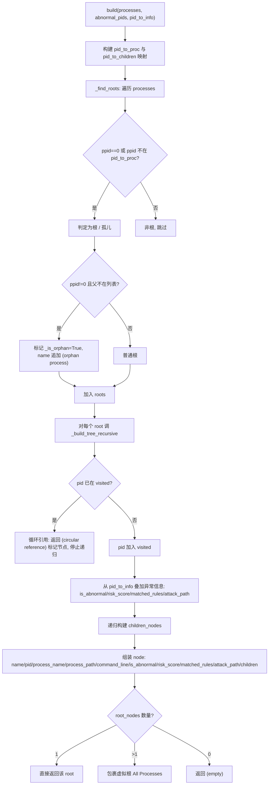
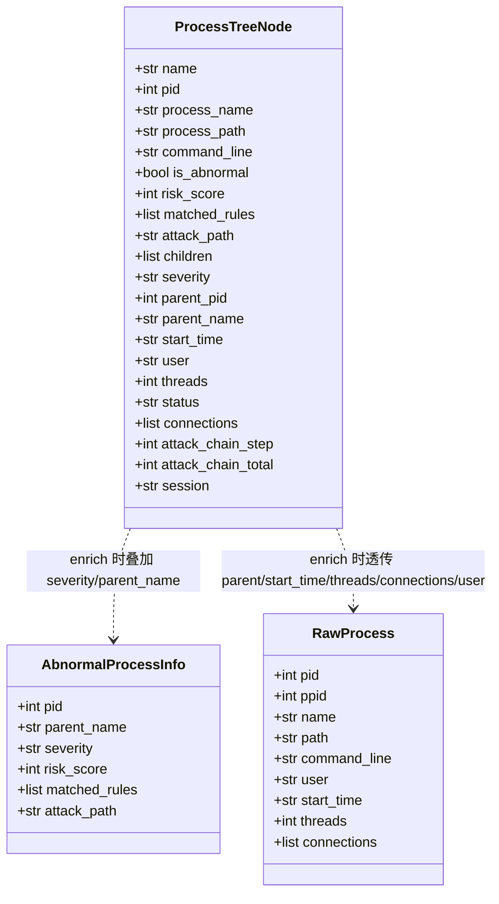
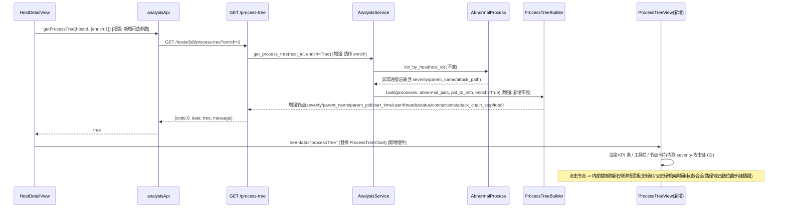
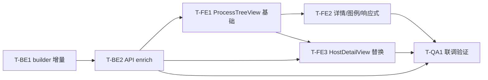

# 现网进程树模块：结构分析与优化改动点设计

> 作者：软件架构师（高见远）｜交付总监：齐活林（team-lead）
> 范围：**仅结构分析 + 优化方案设计，不含实现代码**。
> 所有结论严格基于已探查的现网代码事实，引用的关键文件/字段如下：
> - 后端构建：`backend/app/analysis/process_tree_builder.py`
> - 后端取数：`backend/app/services/analysis_service.py:607-638`（`get_process_tree`）
> - 异常表模型：`backend/app/models/analysis.py:89`（`AbnormalProcess`，含 `severity`/`parent_name`/`attack_path` 等字段）
> - API 契约：`backend/app/api/analysis.py:133`（abnormal-processes）、`:140`（process-tree）
> - 采集端：`agent/collectors/processes.py`（`collect()` 产出 `connections`/`start_time`/`threads`/`user`）
> - 前端渲染：`frontend/src/components/ProcessTreeChart.vue`、`frontend/src/views/HostDetailView.vue`、`frontend/src/components/ProcessDetailPanel.vue`
> - 目标原型：`docs/process_tree_view_v3.html`

> 📝 **修订记录（v1.1）**：据软件工程师在 T-BE1 实现阶段对代码铁证（`backend/app/rules/rule_engine.py:1362`、`backend/app/analysis/anomaly_detector.py:154-164`）的探查，现网 `attack_path` 真实序列化为**进程名以 `" → "` 连接的字符串**（非设计初稿假设的 `"N/M"`）。已据此更正第二部分的「约定 A」为进程名链格式，并将「约定 B」改为防御性兼容回退（`"N/M"`/list/JSON + 失败降级 `(None,None)`）。KPI"攻击链数"等其余契约不受影响。详见第二部分第 1 节与第五部分风险闭环。

---

# 第一部分：当前进程树结构分析

## 1. 数据模型：当前树节点字段清单与来源

后端 `ProcessTreeBuilder._build_tree_recursive`（process_tree_builder.py:185-196）当前产出的**每个节点 dict** 形状为：

```
{ name, pid, process_name, process_path, command_line,
  is_abnormal, risk_score, matched_rules, attack_path, children }
```

下表逐字段标注**来源**（采集端 `proc` vs 异常表 `AbnormalProcess`）与**是否在当前树节点中**，并对照 **v3 是否需要**。

| 字段 | 来源 | 当前是否进树节点 | v3 是否需要 | 备注 |
|------|------|:---:|:---:|------|
| `name` | 采集端 `proc["name"]`（孤儿追加 "(orphan process)"） | ✅ | ✅ | ECharts 节点标签 |
| `process_name` | 采集端 `proc["name"]` | ✅ | ✅ | 详情/tooltip |
| `pid` | 采集端 `proc["pid"]` | ✅ | ✅ | 主键 |
| `process_path` | 采集端 `proc["path"]` | ✅ | ✅ | 详情面板"路径" |
| `command_line` | 采集端 `proc["command_line"]` | ✅ | ✅ | tooltip/详情 |
| `ppid` | 采集端 `proc["ppid"]` | ❌（仅构建期用于分组） | ✅ | 父进程ID/详情面板 |
| `is_abnormal` | 异常表 PID 集合 `abnormal_pids` | ✅ | ✅ | 标红基础 |
| `risk_score` | 异常表 `pid_to_info[pid]["risk_score"]` | ✅ | ✅ | 风险进度条 |
| `matched_rules` | 异常表 `pid_to_info[pid]["matched_rules"]` | ✅ | ✅ | 命中规则 chips |
| `attack_path` | 异常表 `pid_to_info[pid]["attack_path"]` | ✅ | ✅（解析攻击链跳数来源） | 当前仅原样透传字符串 |
| `children` | builder 递归构建 | ✅ | ✅ | 子树 |
| `severity` | 异常表 `pid_to_info[pid]["severity"]`（critical/high/medium/low） | ❌ | ✅ | **异常表已有但未透传** |
| `parent_name` | 异常表 `parent_name`（异常进程）/ 应由 `pid_to_proc[ppid].name` 推导（普通进程） | ❌ | ✅ | **未透传** |
| `start_time` | 采集端 `proc["start_time"]`（ISO8601） | ❌ | ✅ | 节点/详情"启动时间" |
| `user` | 采集端 `proc["user"]` | ❌ | ✅（详情"会话/用户"） | 当前丢弃 |
| `threads` | 采集端 `proc["threads"]` | ❌ | 部分 | 用于推导 `status` |
| `status` | **派生字段**：`threads==0` → "疑似僵尸"，否则 "运行中" | ❌ | ✅ | 当前无 |
| `connections` | 采集端 `proc["connections"]`（含 protocol/local/remote/port/state） | ❌ | ✅ | **采集端已有却完全未用** |
| `session` | 无数据源 | ❌ | ✅（详情面板） | 需降级为空字符串 |

**结论**：v3 所需的核心信息中，`severity`、`parent_name`、`start_time`、`threads`、`connections`、`user` **数据源全部已经存在于后端可得数据里**——要么在异常表 `AbnormalProcess`（severity/parent_name），要么在采集端 `raw_data["processes"][i]`（start_time/threads/user/connections）。当前只是 `ProcessTreeBuilder` 没有把这些字段拼进节点 dict，且前端 `ProcessTreeChart` 没有渲染它们。

---

## 2. 后端构建逻辑：核心流程

涉及三个静态方法（`process_tree_builder.py`）：

- **`build(processes, abnormal_pids, pid_to_info)`**（:16-79）：
  1. 空列表 → 返回 `{"name":"(empty)","children":[]}`。
  2. 预扫描 `processes` 构建两映射：`pid_to_proc`（pid→原始 proc）、`pid_to_children`（ppid→子进程列表）。
  3. 调 `_find_roots` 得到根列表。
  4. 对每个根调 `_build_tree_recursive`（传入空 `visited` 集合检测循环引用）。
  5. 根数量：1 → 直接返回该根；>1 → 包裹虚拟根 `"All Processes"`；0 → `(empty)`。
- **`_find_roots(processes, pid_to_proc)`**（:82-107）：遍历进程，`ppid==0` 或 `ppid not in pid_to_proc` 视为根；其中 `ppid!=0 且父不在列表` 标 `_is_orphan=True` 并 name 追加 "(orphan process)"。
- **`_build_tree_recursive(...)`**（:110-198）：
  - 若 `pid in visited` → 返回 `"(circular reference)"` 标记节点并**停止递归**（防无限循环）。
  - 否则将 pid 并入 `visited`，从 `pid_to_info` 叠加 `is_abnormal/risk_score/matched_rules/attack_path`（非异常时置 0/[]/None）。
  - 递归构建 `children_nodes`，组装并返回节点 dict。



---

## 3. 前后端契约与前端渲染方式

### 3.1 API 响应形状（`GET /hosts/{host_id}/process-tree`，analysis.py:140-144）
统一信封：`{"code":0, "data": <tree>, "message":"success"}`。
- `data` 为单个根节点 dict（多根时被 `"All Processes"` 包裹）。
- 节点为递归 `children` 结构（见第 1 节字段表）。
- 鉴权：`Depends(get_current_user)`。

### 3.2 前端当前渲染（`ProcessTreeChart.vue`）
- 使用 `vue-echarts` 的 `TreeChart`（canvas 渲染）。`convertToEChartsData()`（:32-67）递归转换：仅用 `is_abnormal` 决定**红(#F56C6C)/灰(#909399)** 两色，节点 `label` 仅显示进程名。
- tooltip（:72-86）显示 PID/路径/命令行/风险/攻击路径。
- `roam:true` 可缩放拖拽，`initialTreeDepth:-1` 全展开，`expandAndCollapse:true`。
- 点击 emit `node-click`，携带 `_rawData`（:121-126），由 `HostDetailView.handleNodeClick` 打开 `ProcessDetailPanel` 抽屉。

### 3.3 ECharts canvas tree 的固有局限（对照 v3 需求）
| 能力 | 当前 ECharts 树 | v3 需求 | 缺口 |
|------|:---:|:---:|------|
| 节点信息密度 | 仅进程名 | 内联 进程名/PID/父进程/启动时间/状态/严重度徽标/攻击链徽标/C2徽标/规则chips | ❌ |
| 严重度分级着色 | 二档（异常/正常） | 四档（严重/高/中/低 四色） | ❌ |
| 攻击链高亮 | 无 | 第N跳/共M跳 蓝色徽标 | ❌ |
| C2 外连高亮 | 无 | C2 外连徽标 + 详情情报 | ❌ |
| KPI 条 | 无 | 进程总数/高危数/攻击链数/C2外连数 | ❌ |
| 工具栏 | 无 | 搜索 + 筛选(全部/高危+/仅攻击链) + 展开收起 | ❌ |
| 详情面板 | 依赖外部抽屉 | 右侧内联面板（含会话/外连情报） | ❌ |
| 图例 / 响应式 | 无 | 图例 + `@media(max-width:880px)` 堆叠 | ❌ |

---

## 4. 现状缺口（逐条对照 v3）

1. **`connections` 采集端已有却完全没用到**：`agent/collectors/processes.py:68` 已把 `conn_map[pid]` 写入 `proc["connections"]`，`get_process_tree` 读取的 `raw_data["processes"]` 中即含该字段，但 `ProcessTreeBuilder` 未透传 → C2 外连徽标/情报缺失。
2. **`severity` 异常表已有却没透传**：`AbnormalProcess` 记录含 `severity`（`models/analysis.py:127`），且 `get_process_tree` 已将整条记录放入 `pid_to_info`，但 builder 仅取 `risk_score/matched_rules/attack_path`，未取 `severity` → 四档着色缺失。
3. **`parent_name` 未透传**：异常进程有 `parent_name`；普通进程可由 `pid_to_proc[ppid]["name"]` 推导。当前节点无父进程名 → 节点卡片"父进程(含PID)"缺失。
4. **`start_time`/`threads`/`user` 采集端已有，未透传**：可支撑"启动时间""状态(疑似僵尸=threads==0)""会话/用户"字段。
5. **`attack_path` 仅原样透传字符串**，未解析为"第N跳/共M跳"结构化数据 → 攻击链徽标无法直接渲染。
6. **无 KPI 条 / 工具栏 / 详情面板 / 图例 / 响应式**：均为前端展现层缺失，根因是 ECharts canvas 树的信息密度与布局自由度不足。

---

# 第二部分：优化后的改动点设计（保持兼容）

## 1. 后端 builder 增强（纯增量，不破坏旧字段）

**原则**：在节点 dict 中**新增**字段，旧字段（`name/pid/process_name/process_path/command_line/is_abnormal/risk_score/matched_rules/attack_path/children`）**全部保留** → 旧前端 `ProcessTreeChart` 仍可正常工作。

新增字段取值来源与默认值：

| 新增字段 | 类型 | 取值来源 | 默认值/派生规则 |
|----------|------|----------|----------------|
| `severity` | `str` | `pid_to_info[pid].get("severity")` | 非异常 → `None`（前端按"无严重度"处理） |
| `parent_pid` | `int` | `proc.get("ppid", 0)`（构建期已有） | 0 |
| `parent_name` | `str` | 异常进程优先取 `pid_to_info[pid].get("parent_name")`；否则取 `pid_to_proc.get(ppid, {}).get("name","")` | `""` |
| `start_time` | `str` | `proc.get("start_time","")` | `""` |
| `user` | `str` | `proc.get("user","")` | `""` |
| `threads` | `int` | `proc.get("threads",0)` | 0 |
| `status` | `str` | 派生：`threads==0` → `"疑似僵尸"`，否则 `"运行中"` | `"运行中"` |
| `connections` | `list` | `proc.get("connections",[])`；当 `enrich=1` 时建议**仅保留外连**（remote_address 非私网且 state∈ESTABLISHED/SYN_SENT 等）以抑制体积 | `[]` |
| `attack_chain_step` | `int` | 解析 `attack_path`（见下） | `None` |
| `attack_chain_total` | `int` | 解析 `attack_path`（见下） | `None` |
| `session` | `str` | 当前**无数据源** → 留空 | `""`（并在前端标注"无数据"降级） |

**`attack_path` 解析约定（已据代码铁证对齐现网真实格式）**：
- **现网真实格式（代码铁证）**：`backend/app/rules/rule_engine.py:1362` 中 `_attack_path = " → ".join([p.name for p in chain])`；`backend/app/analysis/anomaly_detector.py:154-164` 将其作为 `attack_path` 落库，非命中 `process_chain` 时回退为 `"parent_name → name"`。即 `attack_path` 是**进程名以 `" → "` 连接的字符串**，例如 `"explorer.exe → WINWORD.EXE → powershell.exe → cmd.exe → certutil.exe"`。
- **约定 A（主，真实格式）**：按当前节点 `name` 在该链中**大小写不敏感**定位 `step`（1-based），`total`=链节点数。例：当前进程为 `powershell.exe` → `step=3, total=5`。
- **约定 B（兼容 / 防御性回退）**：为兼容 `rule_engine` 未来可能的格式变更，仍保留对 `"N/M"` 字符串（直接取 `N/M`）以及 list/JSON 数组（取当前节点位置 + 长度）的解析。
- 解析失败 / 非异常进程 → `step=None, total=None`，前端不渲染攻击链徽标。
- **实现已落地**：软件工程师在 T-BE1 中实现稳健解析（主格式定位 + `"N/M"`/list 兼容 + 失败降级 `(None,None)`），后端单测覆盖三种格式与失败降级，59 项测试全绿；**未改动任何检测/落库代码**。
- **兼容性红线**：解析逻辑只在 builder 内新增，不影响异常检测/落库；若格式变更由 `anomaly_detector` 负责，builder 仅消费。

**实现入口变更（不破坏签名兼容性）**：
- `build(processes, abnormal_pids, pid_to_info, enrich: bool = False)`：新增可选 `enrich` 参数，默认 `False` → 行为与现网完全一致（旧字段、旧结构），旧调用方零改动。
- `_build_tree_recursive(...)` 增加 `enrich` 透传，仅在 `enrich=True` 时拼装上述新增字段。
- `pid_to_proc` 在 `build` 中已构建，可直接用于 `parent_name`/`start_time`/`threads`/`connections`/`user` 解析，无需改采集端。



---

## 2. API 兼容性

- **`GET /hosts/{host_id}/process-tree`** 改为支持**可选查询参数 `?enrich=1`**（analysis.py:140）：
  - `enrich` 缺省/为 0 → 响应与现网**逐字节一致**（旧字段、旧结构、旧体积）→ 旧 `ProcessTreeChart` 100% 兼容。
  - `enrich=1` → 节点 dict 增量追加第 1 节新增字段（向后兼容：旧字段不变，仅多字段）。
  - 实现：`get_process_tree(host_id, enrich: bool = Query(False))` → 透传 `AnalysisService.get_process_tree(host_id, enrich)` → `ProcessTreeBuilder.build(..., enrich=enrich)`。
- **`GET /hosts/{host_id}/abnormal-processes`**（analysis.py:133）**完全不动**。
- 信封 `{code, data, message}` 与鉴权 `Depends(get_current_user)` **不变**。
- 兼容性红线确认：`agent/collectors/processes.py`、`AbnormalProcess` 落库逻辑、`abnormal_processes` 表与 `network_connections` 表 schema **均不修改**。

---

## 3. 前端优化（核心改动）

### 3.1 新增组件 `ProcessTreeView.vue`（实现 v3）
承载 v3 的全部新增展现能力：
- **KPI 条**：进程总数（遍历树计数）/ 高危数（severity∈{critical,high}）/ 攻击链数（attack_chain_total 非 None）/ C2 外连数（含外连节点数或外连总数）。
- **工具栏**：搜索（进程名/PID/路径，本地过滤）、筛选（全部 / 高危及以上 / 仅攻击链）、展开/收起。
- **树节点卡片**：内联 进程名·PID·父进程(含PID)·启动时间·状态徽标·severity 四色徽标(严重#A32D2D/高#993C1D/中#854F0B/低#5F5E5A)·攻击链蓝色徽标(第N跳/共M跳 #185FA5)·C2 外连徽标·命中规则 chips；肘形连接线；SVG 图标（系统/文档/终端/通用）。
- **右侧详情面板**：点击节点就地刷新，展示 进程ID/父进程ID/父进程/启动时间/状态/会话/路径/攻击链位置/命中规则/外连情报(C2 IP:端口 行为)；`@media(max-width:880px)` 时堆叠到下方。
- **图例**：severity 四色 + 攻击链 + C2 说明。

### 3.2 新旧组件职责边界
| 组件 | 职责 | 本次变更 |
|------|------|----------|
| `ProcessTreeChart.vue` | ECharts canvas 树（二档着色，低信息密度） | **保留不动**（兜底/兼容），新 tab 不再引用 |
| `ProcessTreeView.vue`（新增） | v3 富信息 HTML/CSS 树 + KPI/工具栏/详情面板 | 新增 |
| `AbnormalProcessTable.vue` | 异常进程表格（含父进程列=parent_name、严重度、风险进度条、规则展开） | **不动** |
| `ProcessStatsCards.vue` | 4 张统计卡 + 饼图 + 条形图 | **不动** |
| `ProcessDetailPanel.vue` | 现有详情抽屉（被 abnormal 表 & 旧树点击共用） | **保留**，继续服务异常进程表；新树改用自身内联面板以贴合 v3 响应式 |
| `HostDetailView.vue` | 取数编排 + tab 容器 | 仅"进程树"tab 替换组件 + 取数加 `enrich=1` |

### 3.3 `HostDetailView.vue` 改动点（最小化）
- `loadAllResults()` 的 **Phase 2**（当前 :503-509）改为 `analysisApi.getProcessTree(hostId, { enrich: 1 })`（前端 api 封装追加可选 `enrich` 查询参数；旧调用无参仍走默认兼容路径）。
- "进程树" tab（当前 :79-84）：将 `<ProcessTreeChart .../>` 替换为 `<ProcessTreeView :tree-data="processTree" />`；删除 `@node-click` 对旧 `ProcessDetailPanel` 的联动（详情改由 `ProcessTreeView` 内部处理）。
- `handleNodeClick`（:637-647）中来自树的 `detailPanelVisible` 分支可移除；`ProcessDetailPanel` 仍由异常表 `handleViewDetail`（:650-653）触发，无需改动。

### 3.4 ECharts 树 vs 自定义 HTML/CSS 树：取舍
| 维度 | ECharts canvas 树（现状） | 自定义 HTML/CSS 树（v3） |
|------|------|------|
| 信息密度 | 低（节点=圆点+名） | 高（卡片内联多字段/徽标） |
| 样式自由度 | 受限（canvas，难做复杂卡片） | 完全可控（CSS/Flex/SVG） |
| 响应式/图例/详情面板 | 需额外开发且笨重 | 原生支持 `@media` 与 DOM 布局 |
| 大数据量（数千节点） | 强（canvas 渲染高效） | 需虚拟化（本场景进程数通常数十~数百，无压力） |
| 交互（缩放/折叠） | 内置 roam/collapse | 需自实现展开收起（v3 工具栏已含） |

**决策**：采用 **自定义 HTML/CSS 树** 实现 v3（信息密度、四档着色、攻击链/C2 高亮、响应式均为硬需求，ECharts 难以低成本满足）；保留 `ProcessTreeChart` 作为兼容兜底，不删除。

---

## 4. 数据流（优化后）

下图标注 **[新增]** / **[增强]** / **[不变]** 环节：



> 注：abnormal-processes 端点与 AbnormalProcessTable / ProcessStatsCards 的数据流**完全不变**，并行存在。

---

## 5. 兼容性评估与风险

### 5.1 兼容性确认（逐条对红线）
| 红线对象 | 是否受影响 | 说明 |
|----------|:---:|------|
| 采集器 `agent/collectors/processes.py` | ❌ 不受影响 | 不改；`connections`/`start_time` 等字段本就产出 |
| 异常检测 / `AbnormalProcess` 落库逻辑 | ❌ 不受影响 | 不改；仅消费已有 `severity`/`parent_name` |
| `abnormal_processes` 表 schema | ❌ 不受影响 | 不改 |
| `network_connections` 表 schema | ❌ 不受影响 | 不改；C2 情报取自 `proc.connections`，不经此表 |
| 旧 API `process-tree`（enrich 缺省） | ❌ 不受影响 | 默认 `enrich=False`，响应与现网一致 |
| 旧 `ProcessTreeChart` / `ProcessDetailPanel` | ❌ 不受影响 | 保留；新 tab 不引用但组件仍在 |
| `AbnormalProcessTable` / `ProcessStatsCards` | ❌ 不受影响 | 不动 |
| `abnormal-processes` 端点 | ❌ 不受影响 | 不动 |

### 5.2 风险点与缓解
1. **`connections` 导致 payload 膨胀**：单进程可能数十外连，整树体积放大。
   - 缓解：① `enrich=1` 为**可选**，默认不返回；② builder 在 enrich 时仅保留**外连**（remote 非私网、state 活跃），过滤 LISTEN/本地回环；③ 前端 `ProcessTreeView` 仅在需要时读取，不进入旧链路。
2. **`attack_path` 解析规则已对齐现网真实格式（风险闭环）**：经代码铁证确认，现网 `attack_path` 为**进程名 `" → "` 链**（`rule_engine.py:1362` + `anomaly_detector.py:154-164`），非初稿假设的 `"N/M"`。
   - 闭环：T-BE1 已实现主格式（按 `name` 大小写不敏感定位 step + total=链长）+ `"N/M"`/list 兼容回退 + 失败降级 `(None,None)`；后端单测覆盖三种格式与失败降级，59 项全绿。设计文档「约定 A」已据此更正，联调无需再确认格式。
3. **`session` 字段缺失降级**：现网无会话数据源。
   - 缓解：节点 `session=""`，详情面板标注"无数据"，不阻塞其余功能。
4. **自定义 HTML/CSS 树大数据量性能**：极端主机数千进程时 DOM 节点过多。
   - 缓解：本场景量级通常安全；若需扩展，后续引入虚拟滚动/懒展开（不在本期）。
5. **旧前端 `${abnormalPidsForTree}` 标红逻辑**：旧组件依赖该数组；新组件改用节点内 `severity`/`is_abnormal` 自渲染，互不耦合，移除旧 prop 传递不影响其他 tab。

---

## 6. 分阶段任务清单（有序 + 依赖 + 可并行）

> 优先级：P0=阻塞主链路，P1=增强/联调。标注"可并行"项可在前置契约确认后并行启动。

| 任务 | 名称 | 涉及文件 | 依赖 | 优先级 | 并行性 |
|------|------|----------|------|:---:|------|
| T-BE1 | builder 增量字段（severity/parent_name/parent_pid/start_time/user/threads/status/connections/attack_chain_step/total） | `backend/app/analysis/process_tree_builder.py` | 无 | P0 | — |
| T-BE2 | process-tree API 新增可选 `?enrich=1` 并透传 builder | `backend/app/api/analysis.py:140`、`backend/app/services/analysis_service.py:607` | T-BE1 | P0 | 与 T-FE1 在契约确认后并行 |
| T-FE1 | 新增 `ProcessTreeView.vue`（KPI 条/工具栏/节点卡片/自定义 HTML 树，消费 enrich 字段） | `frontend/src/components/ProcessTreeView.vue`、`frontend/src/api/analysis.ts`(enrich 参数) | API 契约(T-BE2) | P0 | 与 T-BE2 并行（先冻结字段契约） |
| T-FE2 | `ProcessTreeView` 详情面板 + 图例 + 响应式(`@media`) | `frontend/src/components/ProcessTreeView.vue` | T-FE1 | P1 | 串行于 T-FE1 |
| T-FE3 | `HostDetailView` 替换"进程树"tab 组件 + 取数加 `enrich=1` | `frontend/src/views/HostDetailView.vue` | T-FE1, T-BE2 | P1 | 与 T-FE2 并行 |
| T-QA1 | 兼容性验证 + 新流程联调（旧组件/旧API/异常表/采集端不动；attack_path 解析对齐） | 测试脚本 + 手工验证 | T-BE2, T-FE2, T-FE3 | P1 | 末位，依赖全部完成 |

**依赖关系图**：


**可并行要点**：
- T-BE1 与 T-FE1 在**字段契约冻结**后可并行（后端加字段、前端按契约消费）。
- T-FE2（详情/响应式）与 T-FE3（宿主替换）可并行推进，互不阻塞。
- T-QA1 为收尾，需 T-BE2 + T-FE2 + T-FE3 全部就绪。

---

### 附：关键设计决策小结
1. **纯增量、零破坏**：旧字段/旧 API/旧组件全部保留，`enrich=1` 开关保证默认兼容。
2. **数据已齐备**：v3 所需 severity/parent_name/connections/start_time/threads 均已在后端可得，无需改采集端或表结构，仅做"透传 + 派生"。
3. **前端以自定义 HTML/CSS 树替代 ECharts 实现 v3 富信息密度与响应式**，ECharts 树保留兜底。
4. **唯一需跨模块对齐项**：`attack_path` 序列化格式（与 anomaly_detector/rule_engine），已在 builder 内做保守解析与降级。
