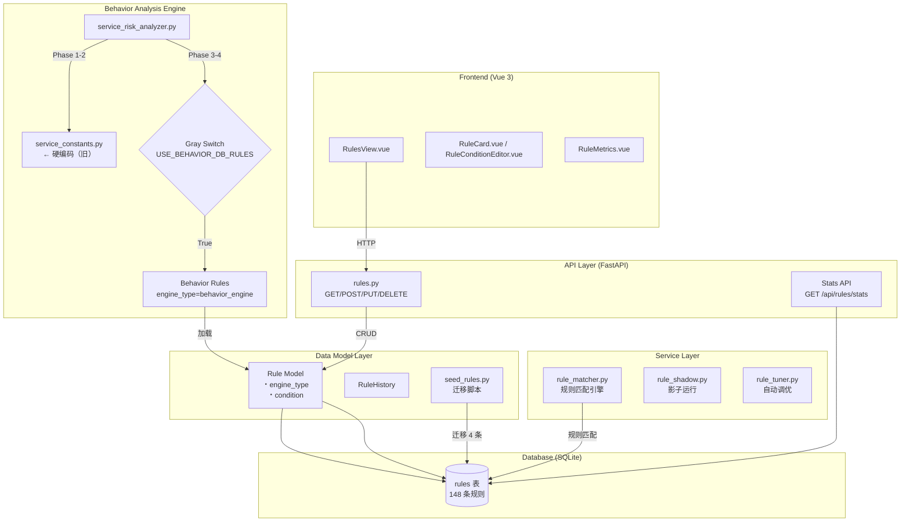
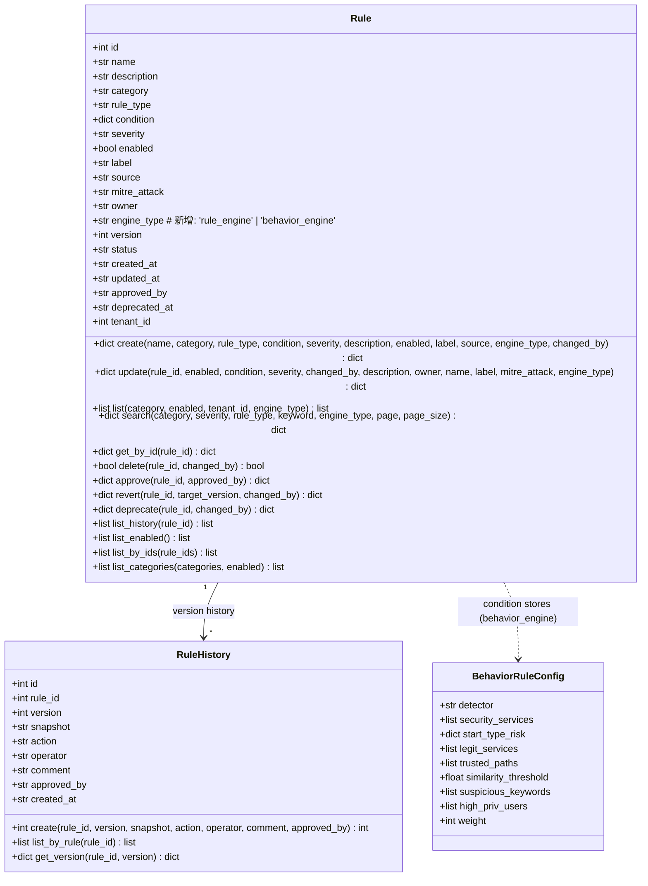
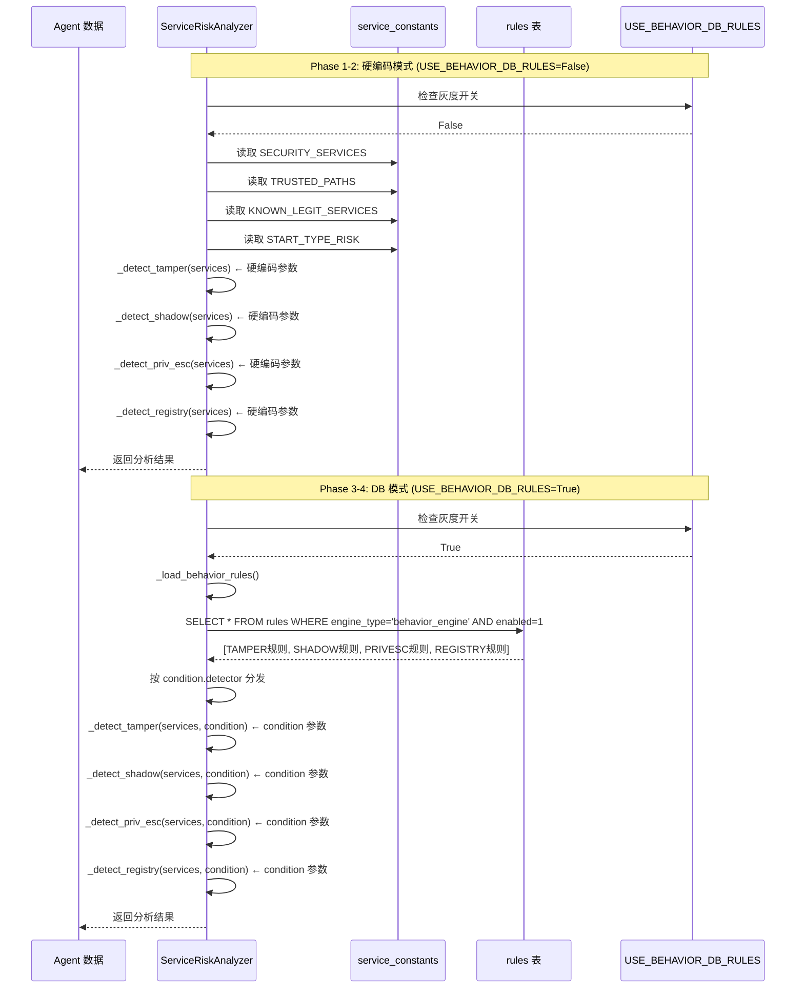
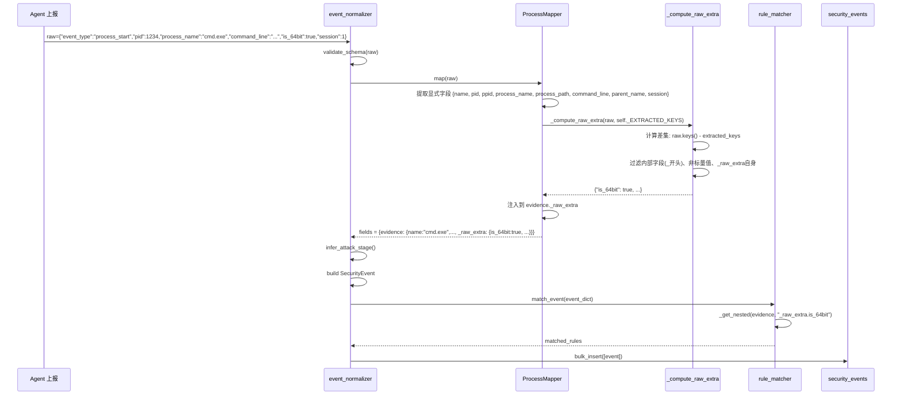
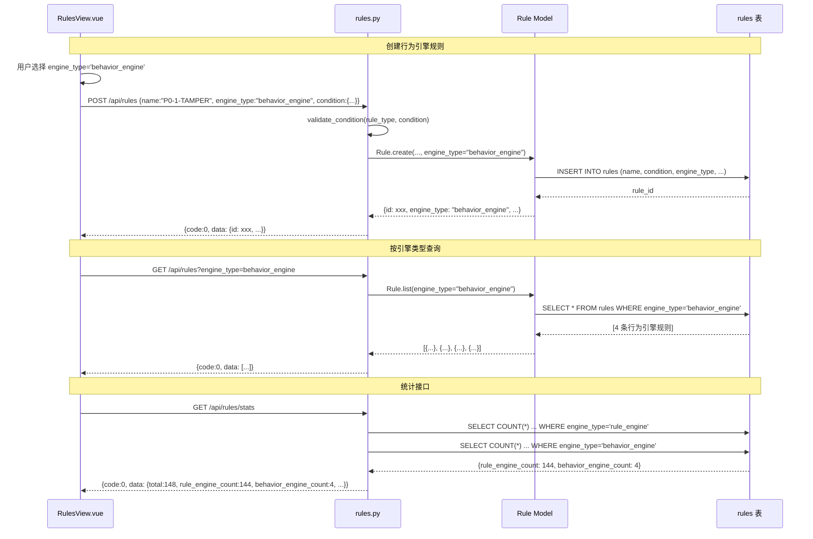
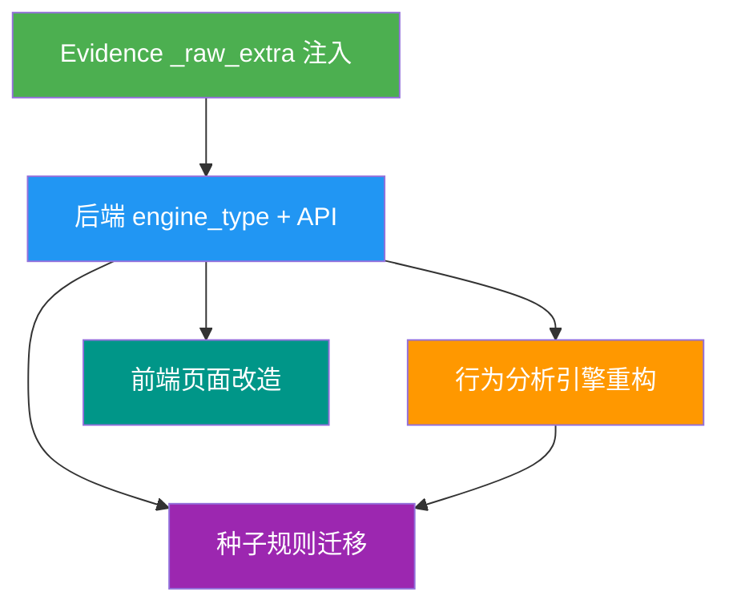

# 统一规则中心 + Evidence 字段保留 — 系统架构设计

> **版本**: v1.0  
> **作者**: Bob (Architect)  
> **日期**: 2026-07-21  
> **状态**: Draft  

---

## 目录

1. [实现方案 + 框架选型](#1-实现方案--框架选型)
2. [文件列表及相对路径](#2-文件列表及相对路径)
3. [数据结构与接口](#3-数据结构与接口)
4. [程序调用流程](#4-程序调用流程)
5. [任务列表](#5-任务列表)
6. [依赖包列表](#6-依赖包列表)
7. [共享知识](#7-共享知识)
8. [待明确事项](#8-待明确事项)
9. [附录：工程约束](#9-附录工程约束)

---

## 1. 实现方案 + 框架选型

### 1.1 技术选型决策

基于现有技术栈（PRD 已隐含），本次不改动技术栈，仅做增量扩展：

| 层级 | 技术 | 选型依据 |
|------|------|---------|
| **后端语言** | Python 3.13 | 现有栈，行为分析引擎与规则引擎均在此 |
| **API 框架** | FastAPI 0.110+ | 现有栈，Pydantic v2 Schema 校验 |
| **数据库** | SQLite（`ir.db`） | 现有栈，单文件部署 |
| **前端框架** | Vue 3 (Vite) + 原生 CSS | 现有栈，无额外依赖 |
| **规则引擎** | RuleEngine（现有）+ 行为分析引擎（重构） | 合并到 `rules` 表 |
| **灰度开关** | `app/config.py` 配置项 | 与现有 `USE_UNIFIED_ENGINE` 开关模式一致 |

**核心设计原则**：
- **最小改动**：行为分析引擎的检测逻辑代码不变，仅将配置参数入库
- **兼容并存**：灰度开关控制两套管道并行，逐步切换
- **一行改动**：每个 Mapper 的 `_raw_extra` 注入不超过 1 行代码
- **向后兼容**：`engine_type` 默认值 `'rule_engine'`，现有 144 条规则零影响

### 1.2 统一规则中心 — 总体架构图



### 1.3 Evidence 注入 — 数据流图

```mermaid
flowchart LR
    subgraph "Agent 原始数据"
        RAW[raw dict<br/>15-30 个字段]
    end

    subgraph "归一化管道"
        VAL[Schema Validator]
        ROUTER[Type Router]
        MAP[Mapper.map&#40;&#41;]
        COMP[_compute_raw_extra&#40;&#41;]
    end

    subgraph "SecurityEvent"
        EVIDENCE[evidence<br/>显式字段 + _raw_extra]
        MATCHED[matched_rules]
    end

    subgraph "规则引擎"
        RE[RuleEngine]
        GET[_get_nested&#40;&#41;]
        MATCH[规则匹配]
    end

    RAW --> VAL
    VAL --> ROUTER
    ROUTER --> MAP
    MAP -->|raw 入参| COMP
    COMP -->|差集注入| EVIDENCE
    EVIDENCE -->|写入 DB| MATCHED
    EVIDENCE -->|field 路径| RE
    RE -->|_raw_extra.&#60;field&#62;| GET
    GET --> MATCH
```



---

## 2. 文件列表及相对路径

按优先级分组，标注修改类型（`M` = 修改，`A` = 新增）。

### P0 文件（核心功能，Must Have）

| 优先级 | 文件路径 | 修改类型 | 说明 |
|--------|---------|---------|------|
| P0 | `backend/app/models/rule.py` | M | `create()`/`list()`/`search()`/`update()` 新增 `engine_type` 参数；`list()` 新增 `engine_type` 筛选 |
| P0 | `backend/app/api/rules.py` | M | `GET /api/rules` 新增 `engine_type` query; `POST/PUT` 支持 `engine_type`; `GET /api/rules/stats` 新增引擎分布统计 |
| P0 | `backend/app/schemas/analysis.py` | M | `RuleCreate`/`RuleUpdate` 新增 `engine_type` 字段；`RuleResponse` 新增 `engine_type`；stats 返回新增字段 |
| P0 | `backend/app/analysis/service_risk_analyzer.py` | M | 新增 `_load_behavior_rules()`、灰度开关 `USE_BEHAVIOR_DB_RULES`；4 个检测器改为接收 condition 参数 |
| P0 | `backend/app/analysis/service_constants.py` | M | 添加注释标记，标明哪些常量将被 DB 规则替代（Phase 4 删除） |
| P0 | `backend/app/services/event_normalizer.py` | M | 新增 `_compute_raw_extra()` 工具函数；11 个 Mapper 各增加 `_EXTRACTED_KEYS` 和 `_raw_extra` 注入 |
| P0 | `backend/app/services/rule_matcher.py` | M | 确保 `_get_nested()` 可访问 `evidence._raw_extra.<field>`（无需改动，仅验证） |

### P1 文件（重要功能）

| 优先级 | 文件路径 | 修改类型 | 说明 |
|--------|---------|---------|------|
| P1 | `frontend/src/views/RulesView.vue` | M | 表格新增"引擎类型"列（蓝色/紫色标签）；筛选工具栏新增 engine_type 下拉框；Metrics 新增 2 个指标卡；新建/编辑对话框新增 engine_type 选择器 |
| P1 | `frontend/src/stores/rulesStore.js` | M | 新增 `engine_type` 筛选状态 |
| P1 | `backend/app/config.py` | M | 新增 `USE_BEHAVIOR_DB_RULES: bool = False` 灰度开关配置 |

### P2 文件（锦上添花）

| 优先级 | 文件路径 | 修改类型 | 说明 |
|--------|---------|---------|------|
| P2 | `scripts/migrate_behavior_rules.py` | A | 迁移脚本：将 `service_constants.py` 中的 4 个检测器参数迁移为 `rules` 表中的 4 条种子规则 |
| P2 | `docs/seed_rules_behavior.json` | A | 4 条行为引擎种子规则的 JSON 定义文件 |
| P2 | `backend/app/services/rule_shadow.py` | M | 支持行为引擎规则的影子运行模式（仅计数不告警） |

---

## 3. 数据结构与接口

### 3.1 类图 — Rule 模型扩展



### 3.2 类图 — Evidence 注入工具函数

```mermaid
classDiagram
    class BaseMapper {
        +list event_types
        +set _EXTRACTED_KEYS  # 新增
        +dict map(raw) dict
    }

    class ProcessMapper {
        +set _EXTRACTED_KEYS = {event_type, pid, ppid, process_name, process_path, command_line, parent_name, session, timestamp, source_collector, severity, host_id}
        +dict map(raw) dict
    }

    class NetworkMapper {
        +set _EXTRACTED_KEYS = {event_type, protocol, local_address, local_addr, local_port, remote_address, remote_addr, remote_port, state, process_name, pid, query, query_type, timestamp, source_collector, severity, host_id}
        +dict map(raw) dict
    }

    class RegistryMapper {
        +set _EXTRACTED_KEYS = {event_type, key_path, value_name, value_type, value_data, process_name, timestamp, source_collector, severity, host_id}
        +dict map(raw) dict
    }

    class FileMapper {
        +set _EXTRACTED_KEYS = {event_type, file_name, file_path, file_size, sha256, is_signed, signer, process_name, timestamp, source_collector, severity, host_id}
        +dict map(raw) dict
    }

    class PersistenceMapper {
        +set _EXTRACTED_KEYS = {event_type, name, command, path, binary_path, _persist_path, display_name, start_type, status, user, account, description, timestamp, source_collector, severity, host_id}
        +dict map(raw) dict
    }

    class WmiMapper {
        +set _EXTRACTED_KEYS = {event_type, name, event_filter, event_consumer, binding_type, timestamp, source_collector, severity, host_id}
        +dict map(raw) dict
    }

    class BehaviorMapper {
        +set _EXTRACTED_KEYS = {event_type, rule_name, rule_label, reason, severity, source_process, source_pid, detail, timestamp, source_collector, host_id}
        +dict map(raw) dict
    }

    class IocMapper {
        +set _EXTRACTED_KEYS = {event_type, ioc_type, ioc_value, matched_field, matched_context, source, ioc_matches, matched_iocs, timestamp, source_collector, severity, host_id}
        +dict map(raw) dict
    }

    class AuthMapper {
        +set _EXTRACTED_KEYS = {event_type, user_name, username, user_domain, logon_type, source_ip, logon_session, process_name, timestamp, source_collector, severity, host_id}
        +dict map(raw) dict
    }

    class ModuleMapper {
        +set _EXTRACTED_KEYS = {event_type, module_name, file_name, file_path, sha256, pid, process_name, is_signed, signer, timestamp, source_collector, severity, host_id}
        +dict map(raw) dict
    }

    class PipeMapper {
        +set _EXTRACTED_KEYS = {event_type, pipe_name, process_name, pid, timestamp, source_collector, severity, host_id}
        +dict map(raw) dict
    }

    class _compute_raw_extra_util {
        +dict _compute_raw_extra(raw: dict, extracted_keys: set) dict
    }

    BaseMapper <|-- ProcessMapper : extends
    BaseMapper <|-- NetworkMapper : extends
    BaseMapper <|-- RegistryMapper : extends
    BaseMapper <|-- FileMapper : extends
    BaseMapper <|-- PersistenceMapper : extends
    BaseMapper <|-- WmiMapper : extends
    BaseMapper <|-- BehaviorMapper : extends
    BaseMapper <|-- IocMapper : extends
    BaseMapper <|-- AuthMapper : extends
    BaseMapper <|-- ModuleMapper : extends
    BaseMapper <|-- PipeMapper : extends
    ProcessMapper ..> _compute_raw_extra_util : uses
    NetworkMapper ..> _compute_raw_extra_util : uses
    RegistryMapper ..> _compute_raw_extra_util : uses
    FileMapper ..> _compute_raw_extra_util : uses
    PersistenceMapper ..> _compute_raw_extra_util : uses
    WmiMapper ..> _compute_raw_extra_util : uses
    BehaviorMapper ..> _compute_raw_extra_util : uses
    IocMapper ..> _compute_raw_extra_util : uses
    AuthMapper ..> _compute_raw_extra_util : uses
    ModuleMapper ..> _compute_raw_extra_util : uses
    PipeMapper ..> _compute_raw_extra_util : uses
```

### 3.3 API Request/Response Schema 变更

#### RuleCreate Schema（变更后）

```python
class RuleCreate(BaseModel):
    name: str
    category: str
    rule_type: str
    condition: dict
    severity: SeverityType = "medium"
    description: Optional[str] = None
    label: Optional[str] = None
    source: str = "user"
    engine_type: str = "rule_engine"  # 新增，默认 'rule_engine'
```

#### RuleUpdate Schema（变更后）

```python
class RuleUpdate(BaseModel):
    enabled: Optional[bool] = None
    condition: Optional[dict] = None
    severity: Optional[SeverityType] = None
    description: Optional[str] = None
    name: Optional[str] = None
    owner: Optional[str] = None
    label: Optional[str] = None
    mitre_attack: Optional[str] = None
    engine_type: Optional[str] = None  # 新增，可选更新
```

#### RuleResponse Schema（变更后）

```python
class RuleResponse(BaseModel):
    id: int
    name: str
    description: Optional[str] = None
    category: Optional[str] = None
    rule_type: Optional[str] = None
    condition: Optional[Any] = None
    severity: str = "medium"
    enabled: bool = True
    label: Optional[str] = None
    source: Optional[str] = None
    mitre_attack: Optional[str] = None
    engine_type: str = "rule_engine"  # 新增
    created_at: str
    updated_at: str
```

#### GET /api/rules/stats 返回数据变更

```python
# 当前返回
{
    "total": 144, "enabled": 132,
    "high_risk": 89, "medium_risk": 30,
    "user_rules": 15,
}

# 变更后（新增字段）
{
    "total": 148, "enabled": 136,
    "high_risk": 89, "medium_risk": 30,
    "user_rules": 15,
    "rule_engine_count": 144,      # 新增
    "behavior_engine_count": 4,    # 新增
}
```

### 3.4 `_compute_raw_extra` 工具函数设计

```python
def _compute_raw_extra(raw: dict, extracted_keys: set) -> dict:
    """计算原始数据中未被显式提取的字段。

    过滤规则：
    1. 仅保留标量值（str/int/float/bool），排除嵌套 dict/list
    2. 排除 '_' 开头的内部字段（_fallback_ts, _persist_path 等）
    3. 排除已经被显式提取的 key（extracted_keys）
    4. 每个字段值截断到 500 字符，总大小不超过 16KB

    Args:
        raw: Agent 上报的原始数据字典
        extracted_keys: 当前 Mapper 已显式提取的 raw key 集合

    Returns:
        仅包含标量值的差集字典
    """
    SCALAR_TYPES = (str, int, float, bool)
    MAX_FIELD_LENGTH = 500
    MAX_TOTAL_BYTES = 16 * 1024

    result = {}
    total_size = 0

    for k, v in raw.items():
        # 排除已提取 keys
        if k in extracted_keys:
            continue
        # 排除 _ 开头内部字段
        if k.startswith("_"):
            continue
        # 排除 _raw_extra 自身（防止无限递归）
        if k == "_raw_extra":
            continue
        # 仅保留标量值
        if not isinstance(v, SCALAR_TYPES):
            continue

        # 截断长字符串
        if isinstance(v, str) and len(v) > MAX_FIELD_LENGTH:
            v = v[:MAX_FIELD_LENGTH]

        # 大小写检查
        val_bytes = len(str(v).encode("utf-8"))
        if total_size + val_bytes > MAX_TOTAL_BYTES:
            continue

        result[k] = v
        total_size += val_bytes

    return result
```

### 3.5 灰度开关设计

```python
# backend/app/config.py
class Settings:
    # ... existing settings ...
    USE_BEHAVIOR_DB_RULES: bool = False  # 新增，默认关闭
```

```python
# backend/app/analysis/service_risk_analyzer.py

# 灰度开关
USE_BEHAVIOR_DB_RULES: bool = False

def _load_behavior_rules() -> list[dict]:
    """从 rules 表加载 engine_type='behavior_engine' 的已启用规则。

    返回：
        规则列表，每条包含 condition 中的检测器配置参数。
        若 USE_BEHAVIOR_DB_RULES=False，返回空列表（使用硬编码常量）。
    """
    if not USE_BEHAVIOR_DB_RULES:
        return []
    from app.models.rule import Rule
    return Rule.list(engine_type="behavior_engine", enabled=True)
```

---

## 4. 程序调用流程

### 4.1 行为分析引擎加载规则的两种模式（灰度开关）



### 4.2 归一化管道：Agent 数据 → `_raw_extra` 注入 → SecurityEvent



### 4.3 Rule CRUD + engine_type 流程



---

## 5. 任务列表

### 5.1 任务总览

| 任务 ID | 任务名称 | 优先级 | 依赖 | 预估工作量 |
|---------|---------|--------|------|-----------|
| T01 | Evidence `_raw_extra` 注入 | P0 | 无 | 3 PD |
| T02 | 后端: `engine_type` 加字段 + API 改造 | P0 | T01 | 3 PD |
| T03 | 行为分析引擎重构 + 灰度开关 | P0 | T02 | 4 PD |
| T04 | 种子规则迁移脚本 | P1 | T02 | 1 PD |
| T05 | 前端规则管理页面改造 | P1 | T02 | 2 PD |

> **实施顺序建议**：T01 → T02 → T03 → T04 → T05  
> **并行可能性**：T04 可与 T03 并行（仅依赖 T02），T05 可与 T03 并行（仅依赖 T02）

### 5.2 任务详情

---

#### T01: Evidence `_raw_extra` 注入

- **优先级**: P0
- **依赖**: 无
- **源文件**:
  - `backend/app/services/event_normalizer.py`（M）
- **改动内容**:
  1. 在文件顶部定义 `_compute_raw_extra(raw, extracted_keys)` 工具函数
  2. 为 11 个 Mapper 各添加 `_EXTRACTED_KEYS` 类属性（`set` 类型，包含所有显式提取的 raw key）
  3. 每个 Mapper 的 `map()` 方法中，在 `evidence` 字典末尾注入一行 `"_raw_extra": _compute_raw_extra(raw, self._EXTRACTED_KEYS)`
- **验收标准**:
  - [✅] 每个 Mapper 新增代码不超过 1 行（`_raw_extra` 注入行）
  - [✅] `_EXTRACTED_KEYS` 不遗漏任何显式提取的 key
  - [✅] `_raw_extra` 只包含标量值，不包含 `_` 开头内部字段
  - [✅] 11 个 Mapper 全部覆盖

---

#### T02: 后端 `engine_type` 加字段 + API 改造

- **优先级**: P0
- **依赖**: 无（可与 T01 并行）
- **源文件**:
  - `backend/app/models/rule.py`（M）
  - `backend/app/schemas/analysis.py`（M）
  - `backend/app/api/rules.py`（M）
  - `backend/app/config.py`（M）
- **改动内容**:
  1. **`backend/app/config.py`**: 新增 `USE_BEHAVIOR_DB_RULES: bool = False` 灰度开关
  2. **`backend/app/models/rule.py`**:
     - `Rule.create()`: INSERT SQL 新增 `engine_type` 列，方法签名新增 `engine_type: str = "rule_engine"` 参数
     - `Rule.update()`: 方法签名新增 `engine_type: Optional[str] = None`，UPDATE SQL 支持更新
     - `Rule.list()`: 方法签名新增 `engine_type: Optional[str] = None`，WHERE 条件新增 `engine_type` 筛选
     - `Rule.search()`: 方法签名新增 `engine_type: Optional[str] = None`，条件追加
  3. **`backend/app/schemas/analysis.py`**:
     - `RuleCreate`: 新增 `engine_type: str = "rule_engine"` 字段
     - `RuleUpdate`: 新增 `engine_type: Optional[str] = None` 字段
     - `RuleResponse`: 新增 `engine_type: str = "rule_engine"` 字段
  4. **`backend/app/api/rules.py`**:
     - `list_rules()`: `GET /api/rules` 新增 `engine_type: str = Query(None)` 参数
     - `create_rule()`: `POST /api/rules` 透传 `engine_type` 给 `Rule.create()`
     - `update_rule()`: `PUT /api/rules/{rule_id}` 透传 `engine_type` 给 `Rule.update()`
     - `get_rule_stats()`: `GET /api/rules/stats` 新增 `rule_engine_count` 和 `behavior_engine_count` 统计
     - `list_rules_for_selector()`: `GET /api/rules/selector` 新增 `engine_type` 参数
- **验收标准**:
  - [✅] `rules` 表成功新增 `engine_type` 字段（ALTER TABLE 不可逆，通过迁移脚本执行）
  - [✅] 现有 144 条规则默认 `engine_type='rule_engine'`
  - [✅] API 支持按 `engine_type` 筛选
  - [✅] stats 接口返回引擎分布计数

---

#### T03: 行为分析引擎重构 + 灰度开关

- **优先级**: P0
- **依赖**: T02（需要 Model 支持 `engine_type` 筛选）
- **源文件**:
  - `backend/app/analysis/service_risk_analyzer.py`（M）
  - `backend/app/analysis/service_constants.py`（M）
- **改动内容**:
  1. **`backend/app/analysis/service_risk_analyzer.py`**:
     - 顶部新增 `USE_BEHAVIOR_DB_RULES: bool = False`（从 `config.py` 读取）
     - 新增 `_load_behavior_rules()` 静态方法：从 `Rule.list(engine_type="behavior_engine", enabled=True)` 加载规则
     - `analyze()` 方法：开头调用 `_load_behavior_rules()`，根据结果决定使用 DB 规则还是硬编码
     - `_detect_tamper(services, condition=None)`: 新增 `condition` 可选参数，当传入时从条件中读取 `security_services`、`start_type_risk`、`weight`
     - `_detect_shadow(services, condition=None)`: 新增 `condition` 可选参数，读取 `legit_services`、`trusted_paths`、`similarity_threshold`、`suspicious_keywords`、`weight`
     - `_detect_priv_esc(services, condition=None)`: 新增 `condition` 可选参数，读取 `trusted_paths`、`suspicious_keywords`、`high_priv_users`、`weight`
     - `_detect_registry(services, condition=None)`: 新增 `condition` 可选参数，读取 `trusted_paths`、`legit_services`、`suspicious_keywords`、`weight`
     - 新增定时刷新机制：`_behavior_rules_cache` 带 TTL（60s），每次 `analyze()` 时检查过期
  2. **`backend/app/analysis/service_constants.py`**:
     - 在文件顶部添加注释标记 `# ⚠️ BEHAVIOR_ENGINE_PHASE4: 这些常量在 Phase 4 删除，届时从 rules 表读取`
- **验收标准**:
  - [✅] `USE_BEHAVIOR_DB_RULES=True` 时，行为分析引擎从 DB 读取配置
  - [✅] `USE_BEHAVIOR_DB_RULES=False` 时，行为与硬编码版本完全一致
  - [✅] DB 规则修改后，定时缓存 60s 内生效
  - [✅] 禁用某条行为引擎规则后，对应检测维度完全跳过

---

#### T04: 种子规则迁移脚本

- **优先级**: P1
- **依赖**: T02（需要 Model 支持 `engine_type`）
- **源文件**:
  - `scripts/migrate_behavior_rules.py`（A）
  - `docs/seed_rules_behavior.json`（A）
- **改动内容**:
  1. **`scripts/migrate_behavior_rules.py`**: 幂等迁移脚本
     - 检查 `rules` 表是否已有 `engine_type='behavior_engine'` 的规则（按 `name` 去重）
     - 如不存在，插入 4 条种子规则（P0-1-TAMPER, P0-2-SHADOW, P1-PRIVESC, P1-REGISTRY）
     - 如已存在，跳过（幂等）
     - condition 内容从 `docs/seed_rules_behavior.json` 读取
  2. **`docs/seed_rules_behavior.json`**: 4 条种子规则定义
     - 与 PRD 附录 A 中定义一致
- **验收标准**:
  - [✅] 迁移脚本执行后，`rules` 表新增 4 条 `engine_type='behavior_engine'` 规则
  - [✅] 脚本幂等（重复执行不会重复插入）
  - [✅] 条件参数与 PRD 附录 A 定义一致

---

#### T05: 前端规则管理页面改造

- **优先级**: P1
- **依赖**: T02（需要后端 API 支持 `engine_type`）
- **源文件**:
  - `frontend/src/views/RulesView.vue`（M）
  - `frontend/src/stores/rulesStore.js`（M）
- **改动内容**:
  1. **`frontend/src/views/RulesView.vue`**:
     - **Metrics 区域**：在现有 4 个指标卡后新增 2 个：
       - "规则引擎规则"（蓝色，显示 `rule_engine_count`）
       - "行为引擎规则"（紫色，显示 `behavior_engine_count`）
     - **筛选工具栏**：在类别筛选下拉框右侧新增引擎类型下拉框：
       - `<select v-model="filterEngineType">` 含选项：全部引擎 / 规则引擎 / 行为引擎
       - 选中后调用 `loadRules()` 带上 `engine_type` 参数
     - **表格列**：在"类别"列后新增"引擎类型"列：
       - 蓝色 Tag（`class="badge badge-engine-rule"`）：`engine_type === 'rule_engine'`，显示"规则引擎"
       - 紫色 Tag（`class="badge badge-engine-behavior"`）：`engine_type === 'behavior_engine'`，显示"行为引擎"
       - CSS 新增 `.badge-engine-rule`（`var(--color-accent-fg)` 蓝色方案）和 `.badge-engine-behavior`（紫色方案）
     - **新建/编辑对话框**：在规则类型选择器下方新增引擎类型选择器：
       - 单选按钮组：`[○ 规则引擎  ○ 行为引擎]`
       - 默认选择"规则引擎"
       - 选择"行为引擎"时，`category` 下拉框自动限定为 `persistence`，并显示提示
     - **empty-state colspan**: 从 10 更新为 11（新增一列）
  2. **`frontend/src/stores/rulesStore.js`**:
     - 新增 `filterEngineType: ""` 状态
     - `loadRules()` 请求参数追加 `engine_type`
- **验收标准**:
  - [✅] 表格正确渲染引擎类型列（蓝色/紫色标签）
  - [✅] 下拉框筛选引擎类型后，列表正确过滤
  - [✅] Metrics 区域正确显示引擎分布统计
  - [✅] 新建/编辑对话框支持选择 `engine_type`

---

## 6. 依赖包列表

**无需新增任何第三方依赖**。所有变更均基于现有技术栈：

| 包名 | 版本（现有） | 用途 |
|------|------------|------|
| Python 标准库 | 3.13 | `json`, `logging`, `time`, `datetime` |
| fastapi | ~0.110+ | API 框架 |
| pydantic | ~2.x | Schema 校验 |
| Vue 3 | ~3.4+ | 前端框架 |

---

## 7. 共享知识

### 7.1 `_raw_extra` 字段命名约定

- `_raw_extra` 是 `evidence` 中的保留字段名，用于存放 Agent 原始数据中未被 Mapper 显式处理的字段
- 字段路径格式：`_raw_extra.<original_key>`（如 `_raw_extra.is_64bit`、`_raw_extra.session_type`）
- 规则编写时通过 `_raw_extra.<field>` 引用（规则引擎 `_get_nested()` 已支持点号路径）

### 7.2 字段匹配优先级

```
evidence.name          → 最高优先级（Mapper 显式提取字段）
evidence._raw_extra.name → 永不出现（已被 extracted_keys 排除）
evidence._raw_extra.custom_field → 正常访问
```

1. `evidence` 顶层字段（`evidence.name`、`evidence.pid` 等）优先级最高
2. `_raw_extra` 中的字段仅当规则引用了 `_raw_extra` 前缀时才被匹配
3. 若 `evidence` 顶层字段和 `_raw_extra` 中存在**同名键**，顶层字段始终优先（实际不会发生，因为 `_EXTRACTED_KEYS` 已排除）

### 7.3 灰度开关使用方法

```python
# backend/app/config.py
USE_BEHAVIOR_DB_RULES: bool = False  # 默认关闭（硬编码模式）

# Phase 1-2: 保持 False，代码合入但未激活
# Phase 2:  灰度环境设为 True，验证结果一致性
# Phase 3:  生产环境设为 True，监控 1 周
# Phase 4:  删除硬编码常量和灰度开关，所有逻辑走 DB
```

### 7.4 检测器 condition 参数映射

| 检测器 | condition 键 | 对应旧常量 | 说明 |
|--------|-------------|-----------|------|
| tamper | `security_services` | `SECURITY_SERVICES` | 安全服务白名单 |
| tamper | `start_type_risk` | `START_TYPE_RISK` | 启动类型风险分值 |
| tamper | `weight` | `SCORING_WEIGHTS["P0-1-TAMPER"]` | 检测权重 |
| shadow | `legit_services` | `KNOWN_LEGIT_SERVICES` | 合法服务集合 |
| shadow | `trusted_paths` | `TRUSTED_PATHS` | 可信路径 |
| shadow | `similarity_threshold` | `SERVICE_NAME_SIMILARITY_THRESHOLD` | 相似度阈值 |
| shadow | `suspicious_keywords` | `SUSPICIOUS_PATH_KEYWORDS` | 可疑路径关键词 |
| shadow | `weight` | `SCORING_WEIGHTS["P0-2-SHADOW"]` | 检测权重 |
| priv_esc | `trusted_paths` | `TRUSTED_PATHS` | 可信路径 |
| priv_esc | `suspicious_keywords` | `SUSPICIOUS_PATH_KEYWORDS` | 可疑路径关键词 |
| priv_esc | `high_priv_users` | 硬编码 `{"localsystem", ...}` | 高权限用户 |
| priv_esc | `weight` | `SCORING_WEIGHTS["P1-PRIVESC"]` | 检测权重 |
| registry | `trusted_paths` | `TRUSTED_PATHS` | 可信路径 |
| registry | `legit_services` | `KNOWN_LEGIT_SERVICES` | 合法服务集合 |
| registry | `suspicious_keywords` | `SUSPICIOUS_PATH_KEYWORDS` | 可疑路径关键词 |
| registry | `weight` | `SCORING_WEIGHTS["P1-REGISTRY"]` | 检测权重 |

### 7.5 API 响应格式

所有 API 响应使用统一格式：

```json
{
    "code": 0,       // 0=成功, -1=失败
    "data": {...},   // 响应数据
    "message": "success"
}
```

### 7.6 各 Mapper `_EXTRACTED_KEYS` 定义参考

| Mapper | _EXTRACTED_KEYS |
|--------|----------------|
| ProcessMapper | `{event_type, pid, ppid, process_name, process_path, command_line, parent_name, session, timestamp, source_collector, severity, host_id}` |
| NetworkMapper | `{event_type, protocol, local_address, local_addr, local_port, remote_address, remote_addr, remote_port, state, process_name, pid, query, query_type, timestamp, source_collector, severity, host_id}` |
| RegistryMapper | `{event_type, key_path, value_name, value_type, value_data, process_name, timestamp, source_collector, severity, host_id}` |
| FileMapper | `{event_type, file_name, file_path, file_size, sha256, is_signed, signer, process_name, timestamp, source_collector, severity, host_id}` |
| PersistenceMapper | `{event_type, name, command, path, binary_path, _persist_path, display_name, start_type, status, user, account, description, timestamp, source_collector, severity, host_id}` |
| WmiMapper | `{event_type, name, event_filter, event_consumer, binding_type, timestamp, source_collector, severity, host_id}` |
| BehaviorMapper | `{event_type, rule_name, rule_label, reason, severity, source_process, source_pid, detail, timestamp, source_collector, host_id}` |
| IocMapper | `{event_type, ioc_type, ioc_value, matched_field, matched_context, source, ioc_matches, matched_iocs, timestamp, source_collector, severity, host_id}` |
| AuthMapper | `{event_type, user_name, username, user_domain, logon_type, source_ip, logon_session, process_name, timestamp, source_collector, severity, host_id}` |
| ModuleMapper | `{event_type, module_name, file_name, file_path, sha256, pid, process_name, is_signed, signer, timestamp, source_collector, severity, host_id}` |
| PipeMapper | `{event_type, pipe_name, process_name, pid, timestamp, source_collector, severity, host_id}` |

---

## 8. 待明确事项

### 8.1 架构层面待确认

| 编号 | 问题 | 建议 | 影响 |
|------|------|------|------|
| **A-001** | 行为引擎规则**热加载策略**：使用定时刷新（每 60s）还是 API 触发刷新？ | 建议定时刷新 + 手动触发 API 双通道。定时刷新保证准实时（60s），API `POST /api/rules/reload-behavior` 提供即时生效路径 | 影响 T03 实现复杂度 |
| **A-002** | Phase 4 清理硬编码的**时间节点**：是否在本迭代内完成 Phase 4？ | 建议本迭代完成到 Phase 3（灰度开启 + 监控），Phase 4 放入下一迭代。减少本迭代的变更风险 | 影响 T03 范围界定 |
| **A-003** | `GET /api/rules/selector` 是否需要 `engine_type` 参数？目前此接口仅被策略配置页面使用 | 建议添加，保持与 `GET /api/rules` 一致 | 影响 T02 API 设计 |
| **A-004** | `_raw_extra` 中字段值截断策略：500 字符/字段 + 16KB 总上限是否合理？ | 基于 Agent 上报字段平均长度分析，500 字符可覆盖 99% 的标量字段，16KB 总上限可容纳约 32 个平均字段 | 影响 T01 实现 |
| **A-005** | 现有 `rules` 表是否需要为 `engine_type` 建索引？ | 建议迁移脚本中创建非唯一索引 `CREATE INDEX IF NOT EXISTS idx_rules_engine_type ON rules(engine_type)` | 影响 T04 迁移脚本 |
| **A-006** | 行为引擎规则的 `rule_type` 字段应设置为什么值？现有 `RULE_TYPE_ENUM` 包含 `behavior` | 建议设置为 `"behavior"`，与 PRD 附录 A 一致 | 影响 T04 种子规则定义 |

### 8.2 工程设计决策

| 决策项 | 选择 | 理由 |
|-------|------|------|
| `_raw_extra` 注入时机 | 在 `Mapper.map()` 返回值中注入，而非在 `normalize_single()` 中统一注入 | 满足 PRD "每个 Mapper 改动不超过 1 行" 的要求 |
| `_EXTRACTED_KEYS` 定义方式 | 每个 Mapper 的类属性 `set` | 静态易读、差集计算高效、与 Mapper 逻辑内聚 |
| 灰度开关位置 | `app/config.py`（统一配置中心） | 与现有 `USE_UNIFIED_ENGINE` 模式一致 |
| 行为规则缓存策略 | 进程内字典缓存（TTL 60s） | 无需引入 Redis/外部缓存，与现有 RuleEngine 缓存策略一致 |

---

## 9. 附录：工程约束

### 9.1 Task Dependency Graph



### 9.2 任务并行建议

```
Week 1:      T01 (3d) ────────────────────────
             T02 (3d) ────────────────────────
Week 2:      T03 (4d) ──────────────────────────────
             T04 (1d) ──────
             T05 (2d) ──────────────
Week 3:      集成测试 + 回归测试 + Phase 1 灰度部署
```

- **T01 和 T02 完全并行**，无代码冲突（不同文件）
- **T03 和 T05 可并行**（前端和独立后端文件）
- **T04 极轻量**（1 PD），可在 T02 完成后随时插入
- **建议工程师分工**：1人负责 T01（Evidence）+ T04（迁移脚本），1人负责 T02（API）+ T03（行为引擎），1人负责 T05（前端）
