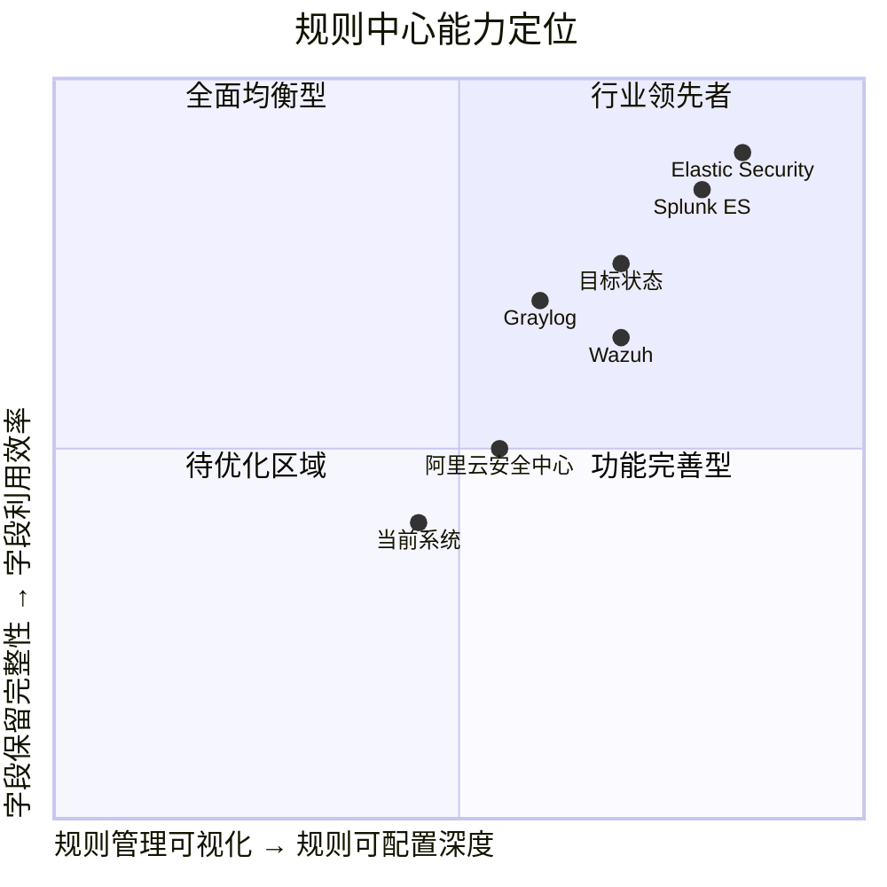

# 统一规则中心 + Evidence 字段保留 — 产品需求文档

> **版本**: v1.0  
> **作者**: Alice (Product Manager)  
> **日期**: 2026-07-20  
> **状态**: Draft

---

## 目录

1. [产品目标](#1-产品目标)
2. [用户故事](#2-用户故事)
3. [需求池](#3-需求池)
4. [UI 设计稿](#4-ui-设计稿)
5. [竞争分析](#5-竞争分析)
6. [技术规范](#6-技术规范)
7. [待确认问题](#7-待确认问题)
8. [验收标准](#8-验收标准)

---

## 1. 产品目标

### 需求一：统一规则中心

**要解决的问题**：当前系统存在两套独立的规则体系，互不互通：

| 维度 | 规则引擎 | 行为分析引擎 |
|------|---------|------------|
| 数据源 | `rules` 表，144 条规则 | 硬编码于 `service_risk_analyzer.py` 4 个检测器中 |
| 可管理性 | 规则管理页面 CRUD | 不可编辑，需改代码重启 |
| 规则类型 | regex/list/composite/behavior/threshold/exists/attack_chain | 4 类检测规则（tamper/shadow/priv_esc/registry） |
| 用户可见 | 规则列表可见、可配置 | 对用户不可见、不可配置 |

**核心目标**：将 `rules` 表改造为**统一的规则中心**，使两套引擎均从 `rules` 表读取规则，行为分析引擎的 4 个检测器实现可配置化。

### 需求二：保留原始字段到 evidence

**要解决的问题**：Mapper 在归一化时只保留了显式定义的字段到 `evidence` 中，Agent 上报的大量原始字段被丢弃。例如 Agent 发送的 `display_name`/`path`/`start_type`/`status`/`description` 等字段，在 `PersistenceMapper` 中虽有保留，但其他 Mapper（如 `ProcessMapper`）只保留 3-5 个字段，大量原始信息丢失。

**核心目标**：将 Agent 原始数据中未被 Mapper 明确处理的字段全部注入 `evidence` 中的 `_raw_extra` 字段，使规则匹配引擎可匹配的字段从当前 3-5 个扩展到 10-20 个。

---

## 2. 用户故事

### 统一规则中心

| ID | 用户故事 |
|----|---------|
| US-01 | 作为 **安全分析师**，我希望在规则管理页面能看到所有规则（包括行为分析引擎的 4 类检测规则），以便在一个页面完成所有规则的查看和管理 |
| US-02 | 作为 **安全分析师**，我希望在规则管理页面能通过 `engine_type` 筛选/标记区分"规则引擎"和"行为引擎"两类规则，以便快速定位特定类型的规则 |
| US-03 | 作为 **安全分析师**，我希望行为分析引擎的检测参数（如可信路径、安全服务白名单、相似度阈值）也能通过规则管理页面编辑，而不用改代码重启 |
| US-04 | 作为 **运维管理员**，我希望迁移期间两套管道能并存，逐步从硬编码切换到 DB 读取，以降低系统中断风险 |
| US-05 | 作为 **安全分析师**，我希望修改行为分析引擎的规则后，行为分析引擎能实时或准实时生效，不需要重启后端服务 |

### Evidence 字段保留

| ID | 用户故事 |
|----|---------|
| US-06 | 作为 **安全分析师**，我希望规则匹配引擎能匹配更多 evidence 字段（如 `raw_path`/`raw_status`/`raw_user`），以便针对未覆盖的 Agent 字段编写检测规则 |
| US-07 | 作为 **安全分析师**，我希望注入的原始字段不与 Mapper 已有字段冲突，且不影响现有规则的匹配逻辑 |
| US-08 | 作为 **开发工程师**，我希望在 Mapper 中注入原始字段的改动量不超过 1 行/每个 Mapper，以最小化代码变更风险 |

---

## 3. 需求池

### 3.1 优先级定义

| 等级 | 定义 |
|------|------|
| **P0** | Must have — 核心价值，无此功能则需求不可交付 |
| **P1** | Should have — 重要但可绕过的功能，有缓解方案 |
| **P2** | Nice to have — 锦上添花，可在后续迭代中交付 |

### 3.2 需求列表

#### P0 — 统一规则中心

| 编号 | 需求 | 涉及模块 |
|------|------|---------|
| R-001 | **rules 表增加 `engine_type` 字段**：`rules` 表新增 `engine_type TEXT NOT NULL DEFAULT 'rule_engine'` 列，枚举值 `'rule_engine'`（规则引擎）/ `'behavior_engine'`（行为引擎）。现有 144 条规则默认使用 `'rule_engine'` | `backend/app/models/rule.py` |
| R-002 | **行为分析引擎 4 个检测器重构为 rules 表读取**：将 `service_risk_analyzer.py` 中 4 个检测器（_detect_tamper / _detect_shadow / _detect_priv_esc / _detect_registry）的硬编码参数（白名单、阈值、路径等）迁移至 `rules` 表的 `condition` 字段，检测器逻辑改为从 DB 加载配置 | `backend/app/analysis/service_risk_analyzer.py`, `backend/app/analysis/service_constants.py` |
| R-003 | **API 支持 `engine_type` 筛选**：规则 CRUD API（`backend/app/api/rules.py`）的列表/搜索接口增加 `engine_type` 查询参数，支持按引擎类型筛选；创建/更新接口支持设置 `engine_type` | `backend/app/api/rules.py`, `backend/app/schemas/analysis.py` |
| R-004 | **迁移期间两套管道并存**：引入灰度开关 `USE_BEHAVIOR_DB_RULES`（类似现有的 `USE_UNIFIED_ENGINE`），控制行为分析引擎从 DB 读取还是继续使用硬编码。默认关闭，手动开启后逐步切换 | `backend/app/analysis/service_risk_analyzer.py` |

#### P0 — Evidence 字段保留

| 编号 | 需求 | 涉及模块 |
|------|------|---------|
| R-005 | **Mapper 注入 `_raw_extra` 字段**：在每个 `Mapper.map()` 方法中，计算原始 `raw` 字典中未被当前 Mapper 显式提取的字段集合，注入到 `evidence["_raw_extra"]` 中。每个 Mapper 改动不超过 1 行 | `backend/app/services/event_normalizer.py`（所有 11 个 Mapper） |
| R-006 | **规则匹配引擎兼容 `_raw_extra` 字段**：`rule_matcher.py` 中的 `_get_nested()` 函数需支持从 `evidence._raw_extra` 嵌套路径读取，且不影响已有规则的匹配优先级（已定义的 evidence 字段优先匹配） | `backend/app/services/rule_matcher.py` |
| R-007 | **`_raw_extra` 字段与已有 evidence 字段不冲突**：已定义的 evidence 字段（如 `name`/`pid` 等）保持最高优先级，`_raw_extra` 只注入未被显式处理的字段 | `backend/app/services/event_normalizer.py` |

#### P1

| 编号 | 需求 | 涉及模块 |
|------|------|---------|
| R-008 | **规则管理页面增加 `engine_type` 筛选/标签**：在规则列表中显示 `engine_type` 标签（"规则引擎" / "行为引擎"），支持按 `engine_type` 筛选和搜索 | `frontend/src/views/RulesView.vue` |
| R-009 | **规则管理页面 Metrics 区域增加引擎类型分布统计**：顶部指标卡增加"规则引擎规则数"和"行为引擎规则数"统计 | `frontend/src/views/RulesView.vue` |
| R-010 | **行为引擎规则在规则管理页面支持完整 CRUD**：行为引擎类规则（`engine_type='behavior_engine'`）在规则管理页面可正常编辑 `condition` 参数、启用/禁用、删除 | `frontend/src/views/RulesView.vue`, `backend/app/api/rules.py` |

#### P2

| 编号 | 需求 | 涉及模块 |
|------|------|---------|
| R-011 | **历史规则数据迁移脚本**：编写迁移脚本，将 `service_constants.py` 中的 4 个检测器参数（SECURITY_SERVICES, TRUSTED_PATHS, KNOWN_LEGIT_SERVICES, START_TYPE_RISK 等）迁移为 `rules` 表中的 4 条 engine_type='behavior_engine' 规则 | 新增脚本 |
| R-012 | **规则管理页面增加 `engine_type` 批量操作**：支持批量切换规则的 `engine_type` | `frontend/src/views/RulesView.vue` |
| R-013 | **行为引擎规则的影子运行（Shadow Run）支持**：对行为引擎类规则启用在影子模式下运行，仅计数不产生告警，便于用户评估新规则效果后再启用 | `backend/app/services/rule_shadow.py` |

---

## 4. UI 设计稿

### 4.1 规则管理页面变更概览

目前规则管理页面的布局为：Header（标题 / 操作按钮）→ Metrics 区域（4 个指标卡）→ 搜索/筛选工具栏 → 规则表格。

**新增/修改内容**：

#### 4.1.1 Metrics 区域（顶部指标卡）

在现有 4 个指标卡后新增：

| 指标 | 说明 |
|------|------|
| **规则引擎规则** | `count where engine_type='rule_engine'` |
| **行为引擎规则** | `count where engine_type='behavior_engine'` |

**布局示意**：两列并排新增，与前 4 个指标卡使用相同的卡片样式。

#### 4.1.2 筛选工具栏

在类别筛选（`filterCategory`）下拉框**右侧**增加 `engine_type` 筛选下拉框：

```
[搜索框] [类别筛选 v] [引擎类型筛选 v] [搜索按钮]
```

**引擎类型筛选选项**：

| 选项 | 值 | 说明 |
|------|----|------|
| 全部引擎 | "" | 默认，显示所有规则 |
| 规则引擎 | `rule_engine` | 仅显示规则引擎规则 |
| 行为引擎 | `behavior_engine` | 仅显示行为引擎规则 |

#### 4.1.3 规则表格

**新增列**：在「类别」列之后增加「引擎类型」列。

| 字段 | 渲染方式 |
|------|---------|
| 引擎类型 | Tag/Badge 渲染：**蓝色**标签 "规则引擎"（`engine_type='rule_engine'`），**紫色**标签 "行为引擎"（`engine_type='behavior_engine'`） |

**筛选高亮**：当引擎类型筛选激活时，表格中的对应标签可带有选中高亮状态。

**表格列顺序**：`序号 → 规则名称 → 中文名 → 类别 → 引擎类型 → 类型 → 严重度 → 状态 → 操作`

#### 4.1.4 新建/编辑规则对话框

**新增字段**：在新建/编辑规则对话框中，规则类型选择区域下方增加「引擎类型」选择器：

```
引擎类型: [○ 规则引擎  ○ 行为引擎]
```

- 默认为「规则引擎」
- 当选择「行为引擎」时，`category` 下拉框自动限定为 `persistence` 类别（行为分析引擎仅处理服务持久化数据）
- 提示信息：*"行为引擎规则适用于系统服务风险检测场景"*

### 4.2 页面原型文字描述

```
┌─────────────────────────────────────────────────────────────────┐
│  规则管理                                [重置为默认] [新增规则]   │
│  检测规则引擎 — 定义安全事件匹配与告警策略                       │
├─────────────────────────────────────────────────────────────────┤
│  ┌──────┐ ┌──────┐ ┌──────┐ ┌──────┐ ┌────────┐ ┌──────────┐  │
│  │总数   │ │已启用 │ │中高危 │ │用户   │ │规则引擎│ │行为引擎   │  │
│  │ 144   │ │ 132  │ │ 89   │ │ 15   │ │  144  │ │   4     │  │
│  └──────┘ └──────┘ └──────┘ └──────┘ └────────┘ └──────────┘  │
├─────────────────────────────────────────────────────────────────┤
│ [搜索...] [全部类别 ▼] [全部引擎 ▼] [搜索]                      │
├─────────────────────────────────────────────────────────────────┤
│ ☐ │ 名称       │ 中文名   │ 类别  │ 引擎类型   │ 类型 │ 状态  │
│ ☐ │ service... │ 服务提权 │ per.. │ 🏷 行为引擎 │ beh..│ 启用  │
│ ☐ │ process... │ 进程创建 │ proc.│ 🏷 规则引擎 │ regex│ 启用  │
│ ...                                                             │
└─────────────────────────────────────────────────────────────────┘
```

---

## 5. 竞争分析

### 5.1 竞品概览

| 竞品 | 规则中心架构 | 行为分析配置化 | Evidence 字段处理 | 评分 |
|------|------------|--------------|-----------------|------|
| **Elastic Security** | 统一规则中心（检测规则 + 机器学习规则统一管理） | 参数化规则模板 | 事件字段全量保留 | ⭐⭐⭐⭐⭐ |
| **Splunk ES** | 规则 + 基线的双层体系 | 可配置检测逻辑 | framework 自动捕获所有字段 | ⭐⭐⭐⭐⭐ |
| **Wazuh** | 单一规则引擎（decoders + rules） | 解码器链式匹配 | 日志字段全量解析 | ⭐⭐⭐⭐ |
| **Graylog** | Pipeline 规则处理器 | pipeline 方式 | 字段映射可配置 | ⭐⭐⭐⭐ |
| **OpenSearch (Security Analytics)** | 检测规则 + Sigma 导入 | Sigma 规则转换 | 通过 field mapping 保留 | ⭐⭐⭐⭐ |
| **IBM QRadar** | 单一规则引擎（规则 + 规则集） | 定制规则语言 | 全量日志字段可访问 | ⭐⭐⭐ |
| **阿里云安全中心** | 统一规则中心 | 部分可配置 | 暂未公开 | ⭐⭐⭐ |

### 5.2 竞争定位矩阵



---

## 6. 技术规范

### 6.1 统一规则中心

#### 6.1.1 数据库变更

**`rules` 表新增字段**：

```sql
ALTER TABLE rules ADD COLUMN engine_type TEXT NOT NULL DEFAULT 'rule_engine';
```

- `engine_type` 枚举值：`'rule_engine'`（规则引擎）、`'behavior_engine'`（行为引擎）
- 现有 144 条规则迁移后 `engine_type = 'rule_engine'`
- 迁移脚本新增 4 条 `engine_type = 'behavior_engine'` 的种子规则

#### 6.1.2 行为分析引擎重构方案

**当前架构**（硬编码）：

```
service_constants.py
  ├── SECURITY_SERVICES (白名单列表)
  ├── SCORING_WEIGHTS (评分权重)
  ├── TRUSTED_PATHS (可信路径列表)
  ├── KNOWN_LEGIT_SERVICES (合法服务集合)
  ├── START_TYPE_RISK (启动类型风险分值)
  ├── SERVICE_NAME_SIMILARITY_THRESHOLD (相似度阈值)
  └── SUSPICIOUS_PATH_KEYWORDS (可疑路径关键词)

service_risk_analyzer.py
  ├── _detect_tamper()     → 读取 SECURITY_SERVICES、START_TYPE_RISK
  ├── _detect_shadow()     → 读取 KNOWN_LEGIT_SERVICES、TRUSTED_PATHS、SUSPICIOUS_PATH_KEYWORDS、THRESHOLD
  ├── _detect_priv_esc()   → 读取 TRUSTED_PATHS、SUSPICIOUS_PATH_KEYWORDS
  └── _detect_registry()   → 读取 TRUSTED_PATHS、KNOWN_LEGIT_SERVICES、SUSPICIOUS_PATH_KEYWORDS
```

**目标架构**（DB 驱动）：

```
rules 表 (engine_type='behavior_engine')
  ├── rule_id="P0-1-TAMPER"    → condition: {security_services: [...], start_type_risk: {...}}
  ├── rule_id="P0-2-SHADOW"    → condition: {legit_services: [...], trusted_paths: [...], similarity_threshold: 0.85, suspicious_keywords: [...]}
  ├── rule_id="P1-PRIVESC"     → condition: {trusted_paths: [...], suspicious_keywords: [...]}
  └── rule_id="P1-REGISTRY"    → condition: {trusted_paths: [...], legit_services: [...], suspicious_keywords: [...]}

service_risk_analyzer.py
  ├── 启动时 / 定时从 rules 表加载 4 条 engine_type='behavior_engine' 规则
  ├── 4 个检测器改为接收 condition 参数
  └── 灰度开关 USE_BEHAVIOR_DB_RULES 控制 DB/硬编码切换
```

#### 6.1.3 Rule Model 变更

`Rule` 模型需在以下位置增加 `engine_type` 支持：

1. **`Rule.create()`** — 新增 `engine_type` 参数
2. **`Rule.update()`** — 新增 `engine_type` 可更新字段
3. **`Rule.list()`** — 新增 `engine_type` 筛选参数
4. **`Rule.search()`** — 新增 `engine_type` 筛选参数
5. **`Rule.get_by_id()`** — 返回 `engine_type` 字段

#### 6.1.4 API 变更

| API 接口 | 变更内容 |
|----------|---------|
| `GET /api/rules` | 新增 query param `engine_type` |
| `GET /api/rules/selector` | 新增 query param `engine_type` |
| `POST /api/rules` | Request body 新增 `engine_type` 字段 |
| `PUT /api/rules/{rule_id}` | Request body 新增 `engine_type` 字段（可改） |
| `GET /api/rules/stats` | 返回数据新增 `rule_engine_count`、`behavior_engine_count` |

**RuleCreate Schema 变更**：

```python
class RuleCreate(BaseModel):
    name: str
    category: str
    rule_type: str
    condition: dict
    severity: str = "medium"
    description: Optional[str] = None
    enabled: bool = True
    label: Optional[str] = None
    source: str = "user"
    engine_type: str = "rule_engine"  # 新增，默认 rule_engine
```

#### 6.1.5 灰度开关设计

```python
# 在 service_risk_analyzer.py 或 config 中
USE_BEHAVIOR_DB_RULES: bool = False  # 默认关闭

def _load_behavior_rules() -> list[dict]:
    """从 rules 表加载 engine_type='behavior_engine' 的已启用规则"""
    if not USE_BEHAVIOR_DB_RULES:
        return []  # 回退到硬编码常量
    return Rule.list(engine_type="behavior_engine", enabled=True)
```

**切换计划**：

| 阶段 | 动作 | 验证项 |
|------|------|--------|
| Phase 1 | USE_BEHAVIOR_DB_RULES=False（默认），新代码合入但未激活 | 回归测试通过 |
| Phase 2 | 灰度环境 USE_BEHAVIOR_DB_RULES=True | 行为分析结果与硬编码一致 |
| Phase 3 | 生产环境 USE_BEHAVIOR_DB_RULES=True，监控 1 周 | 无异常事件 |
| Phase 4 | 删除硬编码常量，移除灰度开关 | 所有逻辑走 DB |

### 6.2 Evidence 字段保留

#### 6.2.1 注入方案

**核心思路**：在每个 `Mapper.map()` 方法的返回值中，计算 `raw` 字典与已提取证据字段的差集，注入到 `_raw_extra` 中。

**单行改动模板**（以 ProcessMapper 为例）：

```python
# 改动前
def map(self, raw: dict) -> dict | None:
    return {
        "event_type": raw.get("event_type", "process_start"),
        "event_key": ...,
        "evidence": {
            "name": raw.get("process_name"),
            "pid": raw.get("pid"),
            # ... 显式提取的字段
        },
        ...
    }

# 改动后（仅增加一行）
def map(self, raw: dict) -> dict | None:
    return {
        "event_type": raw.get("event_type", "process_start"),
        "event_key": ...,
        "evidence": {
            "name": raw.get("process_name"),
            "pid": raw.get("pid"),
            # ... 显式提取的字段
            "_raw_extra": {k: v for k, v in raw.items() if k not in {显式提取的key集合}},
        },
        ...
    }
```

**每个 Mapper 的 `_raw_extra` 注入具体实现**：

每个 Mapper 需要定义其显式提取的 `raw` key 集合，然后将未被包含的键值注入 `_raw_extra`。建议使用 `set` 做差集运算。

**key 集合提取规则**：
- 收集所有通过 `raw.get()` / `raw.get(key)` 读取的 key 名称
- 排除 `raw.get()` 中作为 fallback 的 key（如 `raw.get("process_name", raw.get("name"))` 中，`"name"` 也应计入已提取集合）

**示例代码**（辅助函数复用）：

```python
def _compute_raw_extra(raw: dict, extracted_keys: set) -> dict:
    """计算原始数据中未被显式提取的字段"""
    return {k: v for k, v in raw.items() if k not in extracted_keys and k != "_raw_extra"}
```

#### 6.2.2 规则匹配引擎兼容

`rule_matcher.py` 的 `_get_nested()` 函数不需要改动，因为它已经通过 `_get_nested(evidence, field)` 以点号路径访问字段。规则编写者可以通过 `_raw_extra.<field>` 路径引用注入的原始字段。

**匹配优先级**：

1. `evidence` 顶层字段（如 `evidence.name`）优先级最高
2. `_raw_extra` 中的字段仅当规则引用了 `_raw_extra` 前缀时才被匹配
3. 若 `evidence` 顶层字段和 `_raw_extra` 中存在同名键，顶层字段始终优先

#### 6.2.3 各 Mapper 注入一览

| Mapper | 当前 evidence 字段数 | 注入后字段数（预估） | 原始 key 集合 |
|--------|---------------------|--------------------|------------|
| ProcessMapper | 7 | ~15-20 | process_name, pid, ppid, process_path, command_line, parent_name, session 等 |
| NetworkMapper | 10 | ~20-25 | protocol, local_address, remote_address, remote_port, state, process_name, pid, query 等 |
| RegistryMapper | 5 | ~15-20 | key_path, value_name, value_type, value_data, process_name 等 |
| FileMapper | 8 | ~15-20 | file_name, file_path, file_size, sha256, is_signed, signer, process_name 等 |
| PersistenceMapper | 7（已有 display_name, path, start_type 等） | ~15-20 | name, path, display_name, start_type, status, user, description 等 |
| WmiMapper | 4 | ~10-15 | name, event_filter, event_consumer, binding_type 等 |
| BehaviorMapper | 7 | ~15-20 | rule_name, rule_label, reason, severity, source_process, source_pid, detail 等 |
| IocMapper | 5 | ~10-15 | ioc_type, ioc_value, matched_field, matched_context, source 等 |
| AuthMapper | 6 | ~15-20 | user_name, user_domain, logon_type, source_ip, logon_session, process_name 等 |
| ModuleMapper | 7 | ~15-20 | module_name, file_path, sha256, pid, process_name, is_signed, signer 等 |
| PipeMapper | 3 | ~10-15 | pipe_name, process_name, pid 等 |

---

## 7. 待确认问题

### 7.1 需求一：统一规则中心

| 编号 | 问题 | 影响决策 | 建议 |
|------|------|---------|------|
| Q-001 | 行为分析引擎的 4 条规则是否需要支持**实时生效**（修改后立即重新加载）还是需要**重启引擎**？ | 影响 `Rule.update()` 后是否需要触发 `service_risk_analyzer` 热加载 | 建议使用定时刷新（如每 60s 重新加载 `engine_type='behavior_engine'` 的规则）或 API 触发刷新 |
| Q-002 | 当用户通过规则管理页面**禁用**某条行为引擎规则时，行为分析引擎应如何处理该检测维度？ | 影响检测完整性 | 建议：禁用后该检测维度完全跳过，不生成对应的检测结果 |
| Q-003 | 行为分析引擎的 4 个检测器除了 `condition` 参数外，**检测逻辑本身**是否需要放入 `rules` 表？ | 影响重构深度 | 建议仅将**配置参数**放入 `condition`，检测逻辑代码不变。如需完全可配置，需设计 DSL（P2 范围） |
| Q-004 | 迁移数据的种子规则 ID（P0-1-TAMPER 等）是否需要保持与现有代码中 `rule_id` 字符串一致？ | 影响后续告警关联 | 建议保持现有 `rule_id` 字符串完全一致，避免破坏告警和审计数据的关联性 |
| Q-005 | 现有 `rules` 表已有 144 条规则，`engine_type` 默认值设置为 `'rule_engine'` 是否会影响现有查询性能？ | 影响迁移兼容性 | 建议在建 `engine_type` 索引（非唯一索引）以确保筛选性能 |

### 7.2 需求二：Evidence 字段保留

| 编号 | 问题 | 影响决策 | 建议 |
|------|------|---------|------|
| Q-006 | `_raw_extra` 注入的是**完整原始字段**还是**仅标量值**（过滤掉嵌套对象/大字段）？ | 影响 evidence 存储大小 | 建议仅注入标量值（str/int/float/bool），跳过嵌套 dict/list 以避免证据体积膨胀 |
| Q-007 | `_raw_extra` 中是否包含 `_fallback_ts` 等内部字段？ | 影响 evidence 的干净度 | 建议排除 `_` 开头的内部字段（`_fallback_ts`、`_persist_path` 等），保持 evidence 干净 |
| Q-008 | 规则匹配引擎在匹配 `_raw_extra` 字段时，是否需要增加**额外的性能缓存**？ | 影响匹配性能 | `_raw_extra` 字段数量增大不影响规则匹配性能，因为规则只按需读取指定路径 |
| Q-009 | 是否需要限制 `_raw_extra` 的**最大字段数量**或**最大总大小**？ | 影响存储和传输 | 建议不限制字段数，但每个字段值截断到 500 字符，总大小不超过 16KB |

### 7.3 通用问题

| 编号 | 问题 | 影响决策 |
|------|------|---------|
| Q-010 | 两个需求的迭代顺序是什么？是否可以并行开发？ | 建议先完成 R-005/R-006（Evidence 字段保留，改动量小），再进行 R-001~R-004（统一规则中心，改动量大） |
| Q-011 | 统一规则中心和行为分析引擎重构的**测试策略**是什么？ | 建议：行为分析引擎的 4 个检测器保持 100% 测试覆盖率，新旧两套逻辑并行运行时对比输出结果 |

---

## 8. 验收标准

### 8.1 统一规则中心

| 验收项 | 验收标准 | 关联需求 |
|--------|---------|---------|
| AC-01 | `rules` 表成功新增 `engine_type` 字段，现有 144 条规则默认值为 `'rule_engine'` | R-001 |
| AC-02 | 4 条 `engine_type='behavior_engine'` 的种子规则成功插入 `rules` 表，condition 包含完整的检测器配置参数 | R-002 |
| AC-03 | `GET /api/rules?engine_type=behavior_engine` 仅返回行为引擎规则 | R-003 |
| AC-04 | `GET /api/rules/stats` 返回 `rule_engine_count` 和 `behavior_engine_count` 字段 | R-003 |
| AC-05 | 灰度开关 `USE_BEHAVIOR_DB_RULES=False` 时，行为分析引擎行为与硬编码版本完全一致（对比测试通过） | R-004 |
| AC-06 | `USE_BEHAVIOR_DB_RULES=True` 时，行为分析引擎从 `rules` 表读取的配置参数与硬编码结果一致 | R-004 |
| AC-07 | 修改行为引擎规则的 `condition` 后，行为分析引擎在下一个刷新周期（60s 内）使用新配置 | 基于 Q-001 决策 |
| AC-08 | 规则管理页面可正确渲染 engine_type 标签（蓝色"规则引擎"、紫色"行为引擎"） | R-008 |
| AC-09 | 规则管理页面新建规则时可选择 `engine_type` | R-010 |
| AC-10 | 迁移脚本可重复执行（幂等），seed_rules 不会重复插入 | R-011 |

### 8.2 Evidence 字段保留

| 验收项 | 验收标准 | 关联需求 |
|--------|---------|---------|
| AC-11 | 每个 Mapper 的 `map()` 方法改动不超过 1 行（新增 `_raw_extra` 注入行） | R-005 |
| AC-12 | 所有 11 个 Mapper 的 `map()` 返回值中 `evidence` 均包含 `_raw_extra` 字段 | R-005 |
| AC-13 | `_raw_extra` 中包含未被 Mapper 显式提取的所有标量字段（str/int/float/bool），不包含 `_` 开头内部字段 | R-005, Q-006, Q-007 |
| AC-14 | 规则匹配引擎可通过 `_raw_extra.<field>` 路径匹配 `_raw_extra` 中的字段 | R-006 |
| AC-15 | 现有规则的匹配结果不受 `_raw_extra` 注入影响（回归测试通过） | R-007 |
| AC-16 | 当 `evidence` 顶层字段与 `_raw_extra` 中存在同名键时，顶层字段优先匹配 | R-007 |
| AC-17 | `_raw_extra` 中不嵌套 `raw` 的 `_raw_extra` 自身（防止无限递归） | R-005 |
| AC-18 | 现有单元测试全部通过，无新增失败 | R-005, R-006 |

### 8.3 整合验收

| 验收项 | 验收标准 |
|--------|---------|
| AC-19 | 端到端测试：Agent 上报一条包含丰富字段的数据 → Mapper 注入 `_raw_extra` → 规则引擎匹配新字段 → 行为分析引擎从 DB 读取配置 → 结果正确 |
| AC-20 | 性能测试：`_raw_extra` 注入后，归一化管道 P99 延迟增加不超过 5ms |

---

## 附录

### A. 行为引擎种子规则定义（草案）

```json
[
  {
    "name": "P0-1-TAMPER",
    "label": "安全服务被篡改",
    "category": "persistence",
    "rule_type": "behavior",
    "engine_type": "behavior_engine",
    "severity": "critical",
    "enabled": true,
    "source": "default",
    "condition": {
      "detector": "tamper",
      "security_services": [
        "windefend", "msmpeng", "sense", "wdnisdrv", "wdfilter",
        "securityhealthservice", "wscsvc", "mpssvc",
        "avp", "kavfs", "klnagent",
        "hipsdaemon", "wsctrl", "zhudongfangyu",
        "csfalconservice", "csagent", "sentinelagent",
        "cavp", "cmdagent"
      ],
      "start_type_risk": {"disabled": 20, "manual": 5, "auto": 0},
      "weight": 40
    }
  },
  {
    "name": "P0-2-SHADOW",
    "label": "影子服务/名称伪装",
    "category": "persistence",
    "rule_type": "behavior",
    "engine_type": "behavior_engine",
    "severity": "critical",
    "enabled": true,
    "source": "default",
    "condition": {
      "detector": "shadow",
      "similarity_threshold": 0.85,
      "legit_services": ["dhcp", "dnscache", "eventlog", "..."],
      "trusted_paths": ["c:\\windows\\", "c:\\program files\\", "..."],
      "suspicious_keywords": ["temp", "tmp", "appdata", "downloads", "..."],
      "weight": 35
    }
  },
  {
    "name": "P1-PRIVESC",
    "label": "服务提权风险",
    "category": "persistence",
    "rule_type": "behavior",
    "engine_type": "behavior_engine",
    "severity": "high",
    "enabled": true,
    "source": "default",
    "condition": {
      "detector": "priv_esc",
      "trusted_paths": ["c:\\windows\\", "c:\\program files\\", "..."],
      "suspicious_keywords": ["temp", "tmp", "appdata", "downloads", "..."],
      "high_priv_users": ["localsystem", "nt authority\\system", "system"],
      "weight": 15
    }
  },
  {
    "name": "P1-REGISTRY",
    "label": "注册表关联风险",
    "category": "persistence",
    "rule_type": "behavior",
    "engine_type": "behavior_engine",
    "severity": "medium",
    "enabled": true,
    "source": "default",
    "condition": {
      "detector": "registry",
      "trusted_paths": ["c:\\windows\\", "c:\\program files\\", "..."],
      "legit_services": ["dhcp", "dnscache", "eventlog", "..."],
      "suspicious_keywords": ["temp", "tmp", "appdata", "downloads", "..."],
      "weight": 10
    }
  }
]
```

### B. Mapper `_raw_extra` 注入示例

以 `ProcessMapper` 为例：

```python
class ProcessMapper(BaseMapper):
    """进程事件映射器: process_start / process_terminate."""

    event_types = ["process_start", "process_terminate"]

    # 显式提取的 raw key 集合
    _EXTRACTED_KEYS = {
        "event_type", "pid", "ppid", "process_name", "process_path",
        "command_line", "parent_name", "session", "timestamp",
        "source_collector", "severity", "host_id",
    }

    def map(self, raw: dict) -> dict | None:
        extracted = {  # 显式提取的字段
            "name": raw.get("process_name"),
            "pid": raw.get("pid"),
            "ppid": raw.get("ppid"),
            "process_name": raw.get("process_name"),
            "process_path": raw.get("process_path"),
            "command_line": raw.get("command_line"),
            "parent_name": raw.get("parent_name"),
            "session": raw.get("session"),
        }
        return {
            "event_type": raw.get("event_type", "process_start"),
            "event_key": str(raw.get("pid", raw.get("process_name", "unknown"))),
            "timestamp": raw.get("timestamp", raw.get("start_time", raw.get("_fallback_ts", datetime.now(timezone.utc).isoformat()))),
            "source_collector": raw.get("source_collector", "osquery"),
            "evidence": {
                **extracted,
                "_raw_extra": _compute_raw_extra(raw, self._EXTRACTED_KEYS),
            },
            "severity": raw.get("severity", "medium"),
            "host_id": raw.get("host_id", 0),
        }
```

---

> **文档修订记录**
>
> | 版本 | 日期 | 修订内容 | 作者 |
> |------|------|---------|------|
> | v1.0 | 2026-07-20 | 初稿 | Alice |
