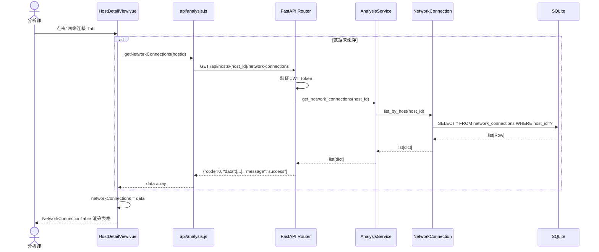
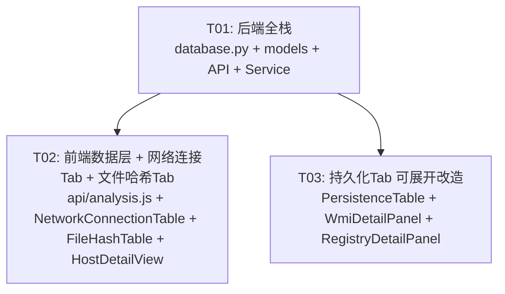

# SOC 平台「5 项数据采集增强」系统架构设计

> 架构师：高见远 | 日期：2026-07-06 | 技术栈：FastAPI + SQLite / Vue3 + Element Plus + Vite

---

## Part A：系统设计

### 1. 实现方案 + 框架选型

#### 1.1 核心结论

**不引入任何新框架/新依赖包。** 全部复用现有技术栈：
- 后端：FastAPI 路由 + SQLite（sqlite3 标准库）+ 现有 `get_connection()` 上下文管理器
- 前端：Vue3 Composition API + Element Plus 表格组件 + Axios

#### 1.2 关键设计决策

| 决策点 | 方案 | 理由 |
|--------|------|------|
| 网络连接表 | 新建 `network_connections`，与现有 `suspicious_connections` 独立 | 前者是原始采集数据（全量），后者是分析引擎标记的可疑子集，职责不同 |
| WMI Filter/Consumer | JSON TEXT 字段存储 | SQLite 无原生 JSON 类型，参照现有 `details` 字段模式，存 `json.dumps()` 序列化字符串 |
| 注册表值类型 | `value_type` 存字符串（REG_SZ/REG_DWORD/...） | 保留原始类型名，便于分析师直接识别 |
| 命令行字段 | **无需变更** — `command_line TEXT` 已存在于 DDL 中，前端 `AbnormalProcessTable.vue` 已展示该列 | P1-4 实际已实现，零工作量 |
| 文件签名 | `is_signed` 存 INTEGER 0/1，`signer` 存签名的证书主体名 | 简单布尔+文本即可满足分析师"判定文件是否合法"的需求 |

#### 1.3 架构模式

沿用现有 MVC 分层：
```
前端 Vue 组件 → api/analysis.js (Axios) → FastAPI Router → AnalysisService → Model (sqlite3)
```

---

### 2. 文件列表及相对路径

| 文件 | 操作 | 说明 |
|------|------|------|
| `backend/app/database.py` | **改** | 新增 4 条 DDL_STATEMENTS |
| `backend/app/models/analysis.py` | **改** | 新增 4 个模型类 + 更新 `clear_analysis_by_host()` |
| `backend/app/api/analysis.py` | **改** | 新增 4 个 GET 端点 |
| `backend/app/services/analysis_service.py` | **改** | 新增 4 个委托方法 |
| `frontend/src/api/analysis.js` | **改** | 新增 4 个 API 函数 |
| `frontend/src/views/HostDetailView.vue` | **改** | 新增 2 个 Tab + 调整持久化Tab数据联动 |
| `frontend/src/components/NetworkConnectionTable.vue` | **新增** | 网络连接表格组件 |
| `frontend/src/components/FileHashTable.vue` | **新增** | 文件哈希表格组件 |
| `frontend/src/components/WmiDetailPanel.vue` | **新增** | WMI Filter/Consumer JSON 展开面板 |
| `frontend/src/components/RegistryDetailPanel.vue` | **新增** | 注册表键值展开面板 |
| `frontend/src/components/PersistenceTable.vue` | **改** | 增加可展开行（WMI/注册表类型） |

---

### 3. 数据模型（简要 DDL）

#### 3.1 新表：`network_connections`（P0-1）

```sql
CREATE TABLE IF NOT EXISTS network_connections (
    id              INTEGER PRIMARY KEY AUTOINCREMENT,
    host_id         INTEGER NOT NULL REFERENCES hosts(id) ON DELETE CASCADE,
    protocol        TEXT,           -- TCP / UDP
    local_addr      TEXT,           -- 本地地址
    local_port      INTEGER,        -- 本地端口
    remote_addr     TEXT,           -- 远程地址
    remote_port     INTEGER,        -- 远程端口
    state           TEXT,           -- LISTEN / ESTABLISHED / CLOSE_WAIT ...
    pid             INTEGER,        -- 进程 ID
    process_name    TEXT,           -- 进程名
    collected_at    TEXT            -- 采集时间
)
```

#### 3.2 新表：`file_hashes`（P0-2）

```sql
CREATE TABLE IF NOT EXISTS file_hashes (
    id              INTEGER PRIMARY KEY AUTOINCREMENT,
    host_id         INTEGER NOT NULL REFERENCES hosts(id) ON DELETE CASCADE,
    file_path       TEXT,           -- 文件完整路径
    file_name       TEXT,           -- 文件名
    sha256          TEXT,           -- SHA256 哈希值
    is_signed       INTEGER DEFAULT 0,  -- 是否签名 (0/1)
    signer          TEXT,           -- 签名者（证书主体）
    file_size       INTEGER,        -- 文件大小（字节）
    product_name    TEXT,           -- 产品名（版本信息）
    product_version TEXT,           -- 产品版本
    collected_at    TEXT            -- 采集时间
)
```

#### 3.3 新表：`wmi_subscriptions`（P1-3）

```sql
CREATE TABLE IF NOT EXISTS wmi_subscriptions (
    id              INTEGER PRIMARY KEY AUTOINCREMENT,
    host_id         INTEGER NOT NULL REFERENCES hosts(id) ON DELETE CASCADE,
    name            TEXT,           -- 订阅名称
    event_filter    TEXT,           -- EventFilter 详情 (JSON 字符串)
    event_consumer  TEXT,           -- EventConsumer 详情 (JSON 字符串)
    binding_type    TEXT,           -- 绑定类型 (__FilterToConsumerBinding / ...)
    risk_level      TEXT,           -- 风险等级 high/medium/low
    collected_at    TEXT            -- 采集时间
)
```

#### 3.4 新表：`registry_keys`（P2-5）

```sql
CREATE TABLE IF NOT EXISTS registry_keys (
    id              INTEGER PRIMARY KEY AUTOINCREMENT,
    host_id         INTEGER NOT NULL REFERENCES hosts(id) ON DELETE CASCADE,
    key_path        TEXT,           -- 注册表键路径
    value_name      TEXT,           -- 值名称
    value_type      TEXT,           -- 值类型 (REG_SZ / REG_DWORD / REG_BINARY / ...)
    value_data      TEXT,           -- 值数据（文本表示）
    last_write_time TEXT,           -- 最后写入时间
    collected_at    TEXT            -- 采集时间
)
```

#### 3.5 已有变更确认：`abnormal_processes.command_line`（P1-4）

**无需变更。** 当前 DDL（`database.py` 行 100–113）已包含 `command_line TEXT`。前端 `AbnormalProcessTable.vue` 行 63 已渲染该列。`AnalysisService.analyze()` 在行 122 已写入 `item.get("command_line")`。

> ⚠️ 假设：采集数据源（Agent JSON）已提供 `command_line` 字段。若未提供，前端列会显示空白——这不属于本需求范围。

---

### 4. API 端点设计

所有端点均需 Bearer Token 认证（`Depends(get_current_user)`），统一响应格式 `{"code": 0, "data": ..., "message": "success"}`。

| 功能 | 方法 | 路径 | 参数 | 说明 |
|------|------|------|------|------|
| P0-1 网络连接 | GET | `/api/hosts/{host_id}/network-connections` | `host_id` (path) | 返回全量网络连接列表 |
| P0-2 文件哈希 | GET | `/api/hosts/{host_id}/file-hashes` | `host_id` (path) | 返回文件哈希及签名信息列表 |
| P1-3 WMI 订阅 | GET | `/api/hosts/{host_id}/wmi-subscriptions` | `host_id` (path) | 返回 WMI 订阅详情（含 JSON Filter/Consumer） |
| P2-5 注册表 | GET | `/api/hosts/{host_id}/registry-keys` | `host_id` (path) | 返回注册表键值列表 |

URL 命名遵循现有 kebab-case 规范（参照 `/suspicious-connections`、`/abnormal-processes`）。

**API 响应示例**（以网络连接为例）：

```json
{
  "code": 0,
  "data": [
    {
      "id": 1,
      "host_id": 5,
      "protocol": "TCP",
      "local_addr": "192.168.1.100",
      "local_port": 49152,
      "remote_addr": "203.0.113.50",
      "remote_port": 443,
      "state": "ESTABLISHED",
      "pid": 2840,
      "process_name": "chrome.exe",
      "collected_at": "2026-07-01 10:30:00"
    }
  ],
  "message": "success"
}
```

WMI 订阅的 `event_filter` 和 `event_consumer` 字段在返回时需做 `json.loads()` 解析，以 JSON 对象形式返回给前端，便于渲染。

---

### 5. 程序调用流程（P0-1 网络连接为例）



---

### 6. 待明确事项

| # | 待明确项 | 当前假设 | 影响 |
|---|---------|---------|------|
| A | P1-4 `command_line` 已存在于 DDL，前端已渲染。是否仍需要本需求的任何改动？ | **零工作量**，仅确认现状 | 若确实需要额外改动（如格式化/截断），需补充 PRD |
| B | 4 张新表的数据来源是什么？Agent 采集 JSON 是否已包含对应字段？ | 假设 Agent JSON 已包含 `network_connections`、`file_hashes`、`wmi_subscriptions`、`registry_keys` 对应字段，分析流程（`AnomalyDetector` 等）负责解析并调用 `batch_create` 写入 | 若 Agent 尚未采集，需额外 Agent 端开发（不在本需求范围） |
| C | WMI 订阅的 `risk_level` 如何判定？ | 假设分析引擎（`PersistenceFinder` 或 `AnomalyDetector`）已有判定逻辑或规则 | 若需新增判定规则，需在规则文件 (`backend/app/rules/`) 中补充 |
| D | 文件哈希采集范围是全盘还是指定路径？ | 不做假设，由 Agent 采集端决定；前端仅展示已有数据 | 不影响后端与前端实现 |
| E | 持久化Tab 中"WMI 行可展开"指的是 persistence_items 表中 `type='wmi'` 的行，还是指完全独立的 WMI Tab？ | 假设为：① 新增 WMI 独立 API；② PersistenceTable 对 `type='wmi'` 的行增加展开按钮，展开后通过 API 查询同 host 的 wmi_subscriptions 详情 | 若实际需要独立的 WMI Tab，前端需多一个 `el-tab-pane` |

---

## Part B：任务分解

### 7. 依赖包列表

**无需新增任何 pip/npm 包。**

- 后端：`sqlite3`（标准库）、`json`（标准库）、`fastapi`（已有）
- 前端：`vue`（已有）、`element-plus`（已有）、`axios`（已有）

---

### 8. 任务列表

| 任务 ID | 任务名称 | 源文件 | 依赖 | 优先级 |
|---------|---------|--------|------|--------|
| **T01** | 后端全栈：数据库 DDL + 模型 + API + Service | `backend/app/database.py`（改）<br>`backend/app/models/analysis.py`（改）<br>`backend/app/api/analysis.py`（改）<br>`backend/app/services/analysis_service.py`（改） | 无 | P0 |
| **T02** | 前端数据层 + 网络连接Tab + 文件哈希Tab | `frontend/src/api/analysis.js`（改）<br>`frontend/src/components/NetworkConnectionTable.vue`（新增）<br>`frontend/src/components/FileHashTable.vue`（新增）<br>`frontend/src/views/HostDetailView.vue`（改） | T01 | P0 |
| **T03** | 持久化Tab 可展开改造：WMI 详情 + 注册表详情 | `frontend/src/components/PersistenceTable.vue`（改）<br>`frontend/src/components/WmiDetailPanel.vue`（新增）<br>`frontend/src/components/RegistryDetailPanel.vue`（新增）<br>`frontend/src/views/HostDetailView.vue`（改） | T01 | P1 |

---

#### T01 详情：后端全栈（数据库 DDL + 模型 + API + Service）

**描述**：一次性完成后端所有变更：
1. 在 `database.py` 的 `DDL_STATEMENTS` 列表末尾追加 4 条 `CREATE TABLE IF NOT EXISTS` 语句（network_connections、file_hashes、wmi_subscriptions、registry_keys）
2. 在 `models/analysis.py` 中新增 4 个模型类（NetworkConnection、FileHash、WmiSubscription、RegistryKey），每个类含 `batch_create(host_id, items)`、`list_by_host(host_id)`、`delete_by_host(host_id)` 三个静态方法，完全参照现有 `PersistenceItem` 的模式
3. 更新 `clear_analysis_by_host()` 函数，增加清理这 4 张新表
4. 在 `api/analysis.py` 中新增 4 个 GET 端点，装饰器 `@router.get("/hosts/{host_id}/xxx")`，鉴权 `Depends(get_current_user)`
5. 在 `services/analysis_service.py` 中新增 4 个委托方法 `get_network_connections(host_id)` 等，直接调用对应模型的 `list_by_host`

**关键约定**：
- WMI 的 `event_filter`/`event_consumer` 在 `list_by_host` 返回时需 `json.loads()` 反序列化（参照 `AbnormalProcess.list_by_host` 的 `matched_rules` 处理模式）
- API 响应统一为 `{"code": 0, "data": list, "message": "success"}`
- `batch_create` 遵循现有模式：先 `DELETE FROM xxx WHERE host_id=?` 再逐条 `INSERT`

---

#### T02 详情：前端数据层 + 网络连接Tab + 文件哈希Tab

**描述**：实现两个 P0 级别的新 Tab：
1. 在 `api/analysis.js` 中新增 4 个 API 函数：`getNetworkConnections`、`getFileHashes`、`getWmiSubscriptions`、`getRegistryKeys`（虽然 T03 才用到后两个，但一次性注册完避免文件反复修改）
2. 创建 `NetworkConnectionTable.vue`：参照 `SuspiciousConnTable.vue` 模式，展示 10 列（协议、本地地址、本地端口、远程地址、远程端口、状态、PID、进程名、采集时间），纯数据展示，不含搜索/筛选
3. 创建 `FileHashTable.vue`：展示 9 列（文件路径、文件名、SHA256、签名状态、签名者、文件大小、产品名、产品版本、采集时间），SHA256 列用 `show-overflow-tooltip` + 等宽字体；签名状态列用 `el-tag`（绿色"已签名"/红色"未签名"）
4. 在 `HostDetailView.vue` 中：
   - 添加两个 `el-tab-pane`："网络连接"（name="network"）、"文件哈希"（name="filehash"）
   - 在 `<script setup>` 中新增 `networkConnections`、`fileHashes`、`wmiSubscriptions`、`registryKeys` 四个 ref
   - 在 `loadAllResults()` 中通过 `Promise.all` 并行加载新增数据（容错：单个失败不影响其他）
   - **P1-4 确认**：`abnormal_processes` 的 `command_line` 列已存在且前端已渲染——无需改动

---

#### T03 详情：持久化Tab 可展开改造（WMI 详情 + 注册表详情）

**描述**：对现有持久化痕迹 Tab 做展开能力增强：
1. 创建 `WmiDetailPanel.vue`：纯展示组件，接收 `hostId` prop，调用 `getWmiSubscriptions(hostId)` 获取数据，用 `el-table` 展示 WMI 订阅列表（名称、Filter JSON 格式化、Consumer JSON 格式化、绑定类型、风险等级），Filter/Consumer 用 `<pre>` 标签格式化展示 JSON
2. 创建 `RegistryDetailPanel.vue`：纯展示组件，接收 `hostId` prop，调用 `getRegistryKeys(hostId)` 获取数据，用 `el-table` 展示注册表键值（键路径、值名称、值类型、值数据、最后写入时间）
3. 修改 `PersistenceTable.vue`：
   - 在 `<el-table>` 上添加 `row-key="id"`，为 `type === 'wmi'` 和 `type === 'registry'` 的行添加 `el-table-column type="expand"`
   - 展开行内嵌入 `WmiDetailPanel` 或 `RegistryDetailPanel` 组件（通过 `v-if` + `type` 判断）
4. 在 `HostDetailView.vue` 的 `loadAllResults()` 中确保 WMI 和注册表数据已通过 T02 的 API 调用加载完毕，传递给 PersistenceTable 或通过组件内自行加载

---

### 9. 共享知识（跨文件约定）

```
# ── 命名规范 ──
- 数据库表名：snake_case 小写 + 下划线复数（network_connections, file_hashes, ...）
- API URL：kebab-case（/network-connections, /file-hashes, /wmi-subscriptions, /registry-keys）
- Vue 组件名：PascalCase（NetworkConnectionTable, FileHashTable, WmiDetailPanel, RegistryDetailPanel）
- 前端 ref 变量：camelCase（networkConnections, fileHashes, wmiSubscriptions, registryKeys）

# ── 模型模式 ──
- 所有模型类位于 backend/app/models/analysis.py，每个类含三个静态方法：
  - batch_create(host_id, items) → int (返回写入行数)
  - list_by_host(host_id) → list[dict]
  - delete_by_host(host_id) → None
- batch_create 内部先 DELETE 旧数据再 INSERT（"覆盖式导入"模式）

# ── API 响应格式 ──
- 统一 {"code": 0, "data": ..., "message": "success"}
- 列表为空时返回 [] 而非 null
- JSON 字段（WMI event_filter/event_consumer）在 API 层反序列化为对象

# ── 前端组件模式 ──
- 表格组件接收 data: Array prop
- 使用 el-table + border + stripe + size="small"
- show-overflow-tooltip 用于长文本列
- 使用 <script setup> + defineProps

# ── 数据库连接 ──
- 使用 get_connection() 上下文管理器
- PRAGMA foreign_keys = ON 自动开启
- row_factory = sqlite3.Row
```

---

### 10. 任务依赖图



> T02 和 T03 均依赖 T01（需要后端 API 就绪），但 T02 与 T03 之间无相互依赖，可并行开发。
