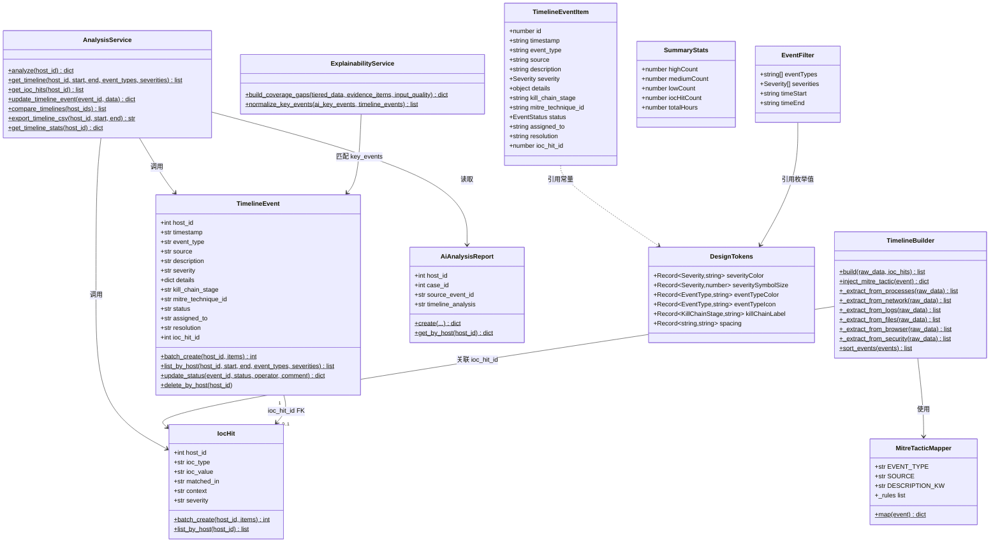
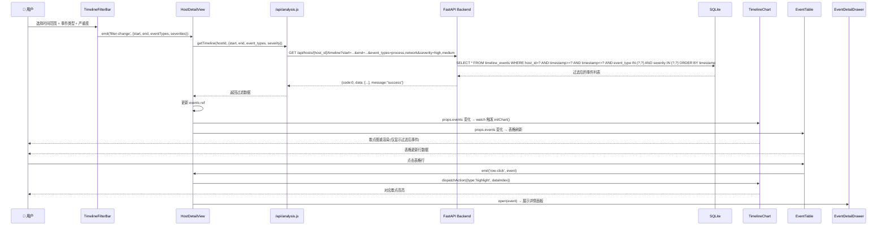
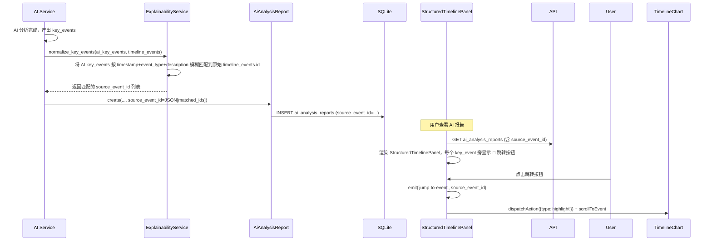
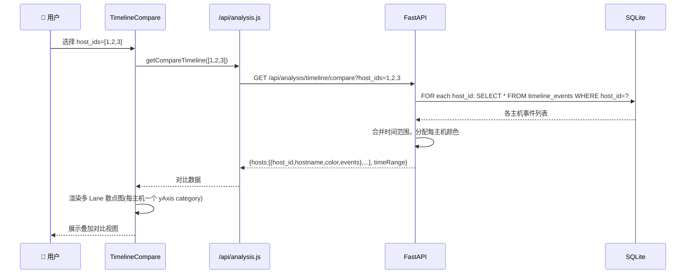
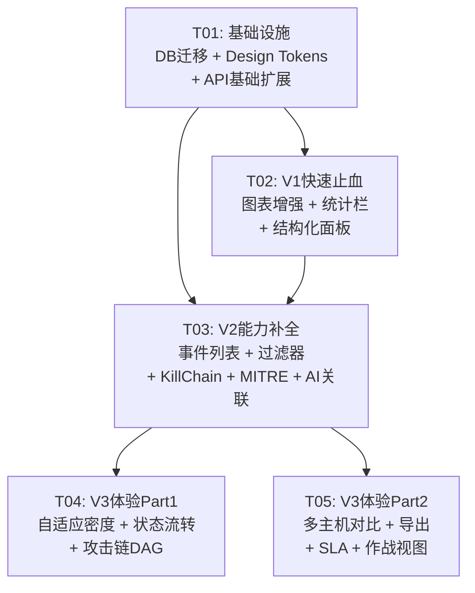

# IR Platform 时间线功能全面升级 — 系统架构设计

> **作者**: Bob (Architect)  
> **版本**: 1.0  
> **日期**: 2026-07-11

---

## Part A: 系统设计

### 1. 实现方案与框架选型

#### 1.1 核心技术栈（不变）

| 层 | 技术 | 版本 | 说明 |
|----|------|------|------|
| 后端框架 | FastAPI | 现有 | 保持不变 |
| 数据库 | SQLite | 现有 | 使用 ALTER TABLE 增量迁移 |
| 前端框架 | Vue 3 + Vite | 现有 | Composition API |
| UI 组件库 | Element Plus | ^2.7.6 | 已有 |
| 图表库 | ECharts | ^5.5.1 | 已有 |
| Vue-ECharts 桥接 | vue-echarts | ^7.0.3 | 已有 |

#### 1.2 无需新增依赖

- **前端**: 所有需求用 ECharts 内置能力实现（dataZoom、scatter、graph、custom series），无需额外图表库
- **后端**: 现有 FastAPI + SQLite 完全够用；V3 CSV 导出用 Python 标准库 `csv` 模块；PDF 导出复用已有 `PdfExportService`

#### 1.3 架构模式

- **后端**: 分层架构 — API 层(`api/analysis.py`) → Service 层(`services/analysis_service.py`) → Model 层(`models/analysis.py`) → DB
- **前端**: 组件化 — View(`HostDetailView.vue`) 编排子组件，子组件通过 props/emits 通信；新增共享 `design-tokens.js` 统一常量

#### 1.4 V1→V2→V3 依赖关系与实现策略

```
V1 (快速止血) ── 独立，无外部依赖，直接改现有文件
   │
   └── V2 (能力补全) ── 依赖 V1 的 DB 字段(V1-5)和 Design Tokens(V2-7)
         │
         └── V3 (体验升维) ── 依赖 V2 的 API 基础(V2-2/V2-6)和数据模型(V2-4)
```

**策略**: 严格按 V1→V2→V3 顺序实施。同阶段内：后端优先（数据基础先行），共享基础设施优先于独立功能。

---

### 2. 文件列表

#### 2.1 后端文件

```
backend/app/database.py                     # [修改] 新增 _alter_timeline_events_table() + DDL 更新
backend/app/models/analysis.py              # [修改] TimelineEvent/IocHit 模型扩展字段
backend/app/analysis/timeline_builder.py    # [修改] V2-5 MITRE 战术自动注入
backend/app/services/analysis_service.py    # [修改] 新增 compare/export/status 方法
backend/app/services/explainability_service.py # [修改] V2-6 AI key_events 关联
backend/app/api/analysis.py                 # [修改] 新增 PATCH/compare/export 端点
backend/app/models/ai_analysis.py           # [修改] V2-6 source_event_id 字段
```

#### 2.2 前端文件

```
frontend/src/
├── constants/
│   └── design-tokens.js                   # [新建] V2-7 统一 Design Tokens
├── components/
│   ├── TimelineChart.vue                  # [修改] V1-1/V1-2/V1-6 严重度+缩放+IOC标记
│   ├── SummaryStatsBar.vue                # [新建] V1-3 摘要统计栏
│   ├── timeline/
│   │   ├── EventTable.vue                 # [新建] V2-1 事件列表+排序筛选
│   │   ├── EventDetailDrawer.vue          # [新建] V2-3 事件详情侧边面板(含V3-2状态)
│   │   ├── TimelineFilterBar.vue          # [新建] V2-2 时间范围+类型过滤器
│   │   ├── KillChainView.vue              # [新建] V2-4 Kill Chain 泳道图
│   │   ├── AttackChainDag.vue             # [新建] V3-3 攻击链 DAG 可视化
│   │   ├── TimelineCompare.vue            # [新建] V3-4 多主机时间线叠加对比
│   │   ├── SlaOverlay.vue                 # [新建] V3-6 SLA 时效可视化
│   │   └── WarRoomMode.vue                # [新建] V3-7 作战视图模式
│   └── ai/
│       └── StructuredTimelinePanel.vue    # [修改] V1-4/V2-6 增强
├── api/
│   └── analysis.js                        # [修改] 新增 API 调用函数
└── views/
    └── HostDetailView.vue                 # [修改] 集成新组件(V2-1~V3-7)
```

---

### 3. 数据结构与接口设计

#### 3.1 数据库表结构变更

##### 3.1.1 timeline_events 表 ALTER（V1-5）

```sql
ALTER TABLE timeline_events ADD COLUMN kill_chain_stage TEXT;
ALTER TABLE timeline_events ADD COLUMN mitre_technique_id TEXT;
ALTER TABLE timeline_events ADD COLUMN status TEXT DEFAULT 'new';
ALTER TABLE timeline_events ADD COLUMN assigned_to TEXT;
ALTER TABLE timeline_events ADD COLUMN resolution TEXT;
ALTER TABLE timeline_events ADD COLUMN ioc_hit_id INTEGER REFERENCES ioc_hits(id);
```

##### 3.1.2 ai_analysis_reports 表 ALTER（V2-6）

```sql
ALTER TABLE ai_analysis_reports ADD COLUMN source_event_id TEXT;
-- source_event_id 存储 JSON 数组，如 '["event_uuid_1","event_uuid_2"]'
-- 将 AI key_events 与 timeline_events 建立关联
```

##### 3.1.3 timeline_events 处置审计表（V3-2）

```sql
CREATE TABLE IF NOT EXISTS timeline_event_audit (
    id              INTEGER PRIMARY KEY AUTOINCREMENT,
    event_id        INTEGER NOT NULL REFERENCES timeline_events(id) ON DELETE CASCADE,
    old_status      TEXT,
    new_status      TEXT,
    operator        TEXT,
    comment         TEXT,
    created_at      TEXT NOT NULL DEFAULT (datetime('now'))
);
```

#### 3.2 Mermaid 类图



#### 3.3 API 端点设计

##### 修改现有端点

| 方法 | 路径 | 变更说明 |
|------|------|----------|
| GET | `/api/hosts/{host_id}/timeline` | 扩展查询参数: `severity`(多值), `event_types`(逗号分隔多值), `ioc_hit`(bool); 响应增加 `ioc_hit_id`/`kill_chain_stage`/`mitre_technique_id`/`status` 字段 |

##### 新增端点

| 方法 | 路径 | 说明 | 阶段 |
|------|------|------|------|
| GET | `/api/hosts/{host_id}/timeline/stats` | 返回摘要统计 `{highCount, mediumCount, lowCount, iocHitCount, timeSpan}` | V1 |
| PATCH | `/api/analysis/timeline/{event_id}` | 更新事件状态 `{status, resolution, operator}` → 返回更新后事件 | V3 |
| GET | `/api/analysis/timeline/compare` | Query: `host_ids=1,2,3` → 返回 `{hosts: [{host_id, hostname, events}]}` | V3 |
| GET | `/api/analysis/timeline/{host_id}/export/csv` | 流式返回 CSV 文件 | V3 |
| GET | `/api/analysis/timeline/{host_id}/export/pdf` | 复用 PdfExportService 生成时间线 PDF 报告 | V3 |

**PATCH 请求体示例**:
```json
{
  "status": "contained",
  "resolution": "已隔离主机并阻断外连",
  "operator": "admin"
}
```

**compare 响应示例**:
```json
{
  "code": 0,
  "data": {
    "hosts": [
      {
        "host_id": 1,
        "hostname": "DESKTOP-A",
        "color": "#409EFF",
        "events": [...]
      },
      {
        "host_id": 2,
        "hostname": "DESKTOP-B",
        "color": "#E6A23C",
        "events": [...]
      }
    ],
    "timeRange": {"start": "...", "end": "..."}
  }
}
```

---

### 4. 程序调用流程

#### 4.1 关键场景：用户框选时间范围→API过滤→图表+表格联动刷新



#### 4.2 关键场景：AI分析完成→key_events与原始events关联→跳转



#### 4.3 关键场景：多主机时间线叠加对比



---

### 5. 待明确事项

| # | 问题 | 当前假设 | 影响范围 |
|---|------|----------|----------|
| 1 | IOC 命中事件如何与 timeline_events 关联？ioc_hit_id 写入时机？ | 在 TimelineBuilder.build() 中，IOC 命中检查结果匹配到对应 event 时写入 ioc_hit_id | V1-6 前端标记 + V1-3 统计 |
| 2 | MITRE 战术映射规则表的完整性和维护方式？ | 先内置硬编码规则表（约20条核心规则），后续可扩展为独立配置文件 | V2-5 |
| 3 | Kill Chain 泳道图中"事件点放置"逻辑：一个事件可能匹配多个战术阶段？ | 事件放置在其 kill_chain_stage 字段对应的唯一阶段，若为空则归入 "Unknown" | V2-4 |
| 4 | 多主机对比时，不同主机的时区如何处理？ | 全部按 UTC 存储和比较（当前架构已如此） | V3-4 |
| 5 | PDF 时间线报告是否需要包含图表截图？ | 使用文字+表格形式，不嵌入 ECharts 截图（技术复杂度可控） | V3-5 |

---

## Part B: 任务分解

### 6. 所需依赖包

**后端 (pip)** — 无需新增：

```
# 所有功能均使用现有依赖或Python标准库(csv模块)
```

**前端 (npm)** — 无需新增：

```
# ECharts 5.5.1 已包含 dataZoom/graph/scatter/custom series
# Element Plus 2.7.6 已包含 el-drawer/el-table/el-date-picker/el-select/el-tag/el-fullscreen
# dayjs 已存在，用于时间格式化
```

---

### 7. 任务列表

#### T01: 项目基础设施 — DB迁移 + Design Tokens + API基础扩展

| 属性 | 内容 |
|------|------|
| **任务ID** | T01 |
| **优先级** | P0 |
| **依赖** | 无 |
| **源文件** | |
| | `backend/app/database.py` — [修改] 新增 `_alter_timeline_events_table()` + `_create_timeline_event_audit_table()` |
| | `backend/app/models/analysis.py` — [修改] TimelineEvent 模型扩展字段 (kill_chain_stage, mitre_technique_id, status, assigned_to, resolution, ioc_hit_id) + 新增 TimelineEventAudit 模型 |
| | `backend/app/api/analysis.py` — [修改] 扩展 GET /timeline 端点参数 + 新增 GET /timeline/stats 端点 |
| | `backend/app/services/analysis_service.py` — [修改] get_timeline 扩展查询 + 新增 get_timeline_stats() |
| | `frontend/src/constants/design-tokens.js` — [新建] 统一 Design Tokens（severity颜色/symbolSize映射/event_type颜色图标/间距/kill_chain阶段标签） |
| | `frontend/src/api/analysis.js` — [修改] 新增 getTimelineStats() 函数 |
| **产出** | DB 迁移完成（6个新字段到位），stats API 上线，前端 Design Tokens 可供所有组件引用 |

#### T02: V1 快速止血 — 图表+面板+统计全面增强

| 属性 | 内容 |
|------|------|
| **任务ID** | T02 |
| **优先级** | P0 |
| **依赖** | T01 |
| **源文件** | |
| | `frontend/src/components/TimelineChart.vue` — [修改] V1-1 severity→symbolSize映射+描边/光晕 + V1-2 dataZoom启用 + V1-6 IOC命中星形标记 |
| | `frontend/src/components/SummaryStatsBar.vue` — [新建] V1-3 横向5列摘要统计卡片（高危X/中危Y/低危Z/IOC命中N/时间跨度H） |
| | `frontend/src/components/ai/StructuredTimelinePanel.vue` — [修改] V1-4 严重度颜色编码 + phase分组+divider + 事件类型图标 + significance折叠 |
| | `frontend/src/views/HostDetailView.vue` — [修改] 集成 SummaryStatsBar（在 TimelineChart 上方） |
| **产出** | 散点图可区分严重度/IOC命中、支持缩放平移、统计栏实时展示、结构化面板增强 |

#### T03: V2 能力补全 — 事件列表+详情+过滤器+KillChain+MITRE+AI关联

| 属性 | 内容 |
|------|------|
| **任务ID** | T03 |
| **优先级** | P1 |
| **依赖** | T01, T02 |
| **源文件** | |
| | `backend/app/analysis/timeline_builder.py` — [修改] V2-5 MITRE 战术自动注入 `inject_mitre_tactic()` 方法 + 新类 `MitreTacticMapper` |
| | `backend/app/services/explainability_service.py` — [修改] V2-6 `normalize_key_events()` 匹配 AI key_events 到原始 event |
| | `backend/app/models/ai_analysis.py` — [修改] V2-6 AiAnalysisReport.create() 支持 source_event_id |
| | `backend/app/database.py` — [修改] V2-6 ai_analysis_reports ALTER 加 source_event_id |
| | `frontend/src/components/timeline/TimelineFilterBar.vue` — [新建] V2-2 el-date-picker range + el-select 多选(event_type+severity) |
| | `frontend/src/components/timeline/EventTable.vue` — [新建] V2-1 el-table 事件列表（severity/event_type/source列排序筛选） |
| | `frontend/src/components/timeline/EventDetailDrawer.vue` — [新建] V2-3 el-drawer 事件详情面板（完整 details JSON + 元信息） |
| | `frontend/src/components/timeline/KillChainView.vue` — [新建] V2-4 横向泳道图（7个MITRE ATT&CK战术阶段） |
| | `frontend/src/components/ai/StructuredTimelinePanel.vue` — [修改] V2-6 key_event 旁加跳转按钮（emit jump-to-event） |
| | `frontend/src/views/HostDetailView.vue` — [修改] 集成 FilterBar + EventTable + EventDetailDrawer + KillChainView + 图表联动逻辑 |
| **产出** | 事件列表可排序筛选、图表联动、详情面板、Kill Chain 泳道、AI 关联跳转 |

#### T04: V3 体验升维 Part 1 — 自适应密度+状态流转+攻击链DAG

| 属性 | 内容 |
|------|------|
| **任务ID** | T04 |
| **优先级** | P2 |
| **依赖** | T03 |
| **源文件** | |
| | `backend/app/api/analysis.py` — [修改] V3-2 新增 `PATCH /api/analysis/timeline/{event_id}` 端点 |
| | `backend/app/services/analysis_service.py` — [修改] V3-2 `update_timeline_event()` 方法 |
| | `backend/app/models/analysis.py` — [修改] V3-2 TimelineEvent.update_status() + TimelineEventAudit 写入 |
| | `frontend/src/components/TimelineChart.vue` — [修改] V3-1 自适应 symbolSize + bubble aggregation（5分钟内同类型>5事件合并气泡） |
| | `frontend/src/components/timeline/EventDetailDrawer.vue` — [修改] V3-2 状态选择器(new→triaging→contained→closed) + 处置备注 + operator/timestamp 展示 |
| | `frontend/src/components/timeline/AttackChainDag.vue` — [新建] V3-3 ECharts graph 渲染有向无环图（进程→网络→文件→持久化） |
| | `frontend/src/views/HostDetailView.vue` — [修改] V3-1 自适应逻辑集成 + V3-3 DAG 切换按钮 |
| **产出** | 密集场景图表不重叠、事件状态可流转审计、攻击链可视化 |

#### T05: V3 体验升维 Part 2 — 多主机对比+导出+SLA+作战视图

| 属性 | 内容 |
|------|------|
| **任务ID** | T05 |
| **优先级** | P2 |
| **依赖** | T03（不依赖T04，可与T04并行） |
| **源文件** | |
| | `backend/app/api/analysis.py` — [修改] V3-4 GET /compare + V3-5 GET /export/csv + GET /export/pdf |
| | `backend/app/services/analysis_service.py` — [修改] V3-4 compare_timelines() + V3-5 export_csv() / export_pdf() |
| | `frontend/src/components/timeline/TimelineCompare.vue` — [新建] V3-4 多主机时间线叠加对比视图（每主机一条 lane） |
| | `frontend/src/components/timeline/SlaOverlay.vue` — [新建] V3-6 时效列(发现→当前elapsed) + 超时红色标记 + 响应时间线虚线叠加 |
| | `frontend/src/components/timeline/WarRoomMode.vue` — [新建] V3-7 全屏+暗色主题+实时统计滚动条 |
| | `frontend/src/components/timeline/EventTable.vue` — [修改] V3-6 时效列 + 导出按钮组 |
| | `frontend/src/views/HostDetailView.vue` — [修改] V3-4~V3-7 对比/导出/作战模式入口集成 |
| **产出** | 多主机对比、CSV/PDF导出、SLA时效监控、作战大屏模式 |

---

### 8. 共享知识（跨文件约定）

#### 8.1 Design Tokens 具体定义

```javascript
// frontend/src/constants/design-tokens.js

// ── Severity ──
export const SEVERITY = {
  COLOR: {
    high: '#F56C6C',      // 红色
    medium: '#E6A23C',     // 橙色
    low: '#909399',       // 灰色
    info: '#C0C4CC',      // 浅灰
    critical: '#FF0000',  // 深红（攻击链命中）
  },
  SYMBOL_SIZE: {
    high: 16,
    medium: 12,
    low: 8,
    info: 6,
    critical: 20,
  },
  LABEL: {
    high: '高危',
    medium: '中危',
    low: '低危',
    info: '信息',
    critical: '严重',
  },
}

// ── Event Type ──
export const EVENT_TYPE = {
  COLOR: {
    process: '#409EFF',     // 蓝色
    network: '#67C23A',     // 绿色
    file: '#E6A23C',       // 橙色
    log: '#909399',         // 灰色
    persistence: '#F56C6C', // 红色
    system: '#9B59B6',      // 紫色
    other: '#95A5A6',       // 暗灰
  },
  ICON: {
    process: 'Cpu',
    network: 'Connection',
    file: 'Document',
    log: 'Notebook',
    persistence: 'Lock',
    system: 'Setting',
    other: 'QuestionFilled',
  },
  LABEL: {
    process: '进程',
    network: '网络',
    file: '文件',
    log: '日志',
    persistence: '持久化',
    system: '系统',
    other: '其他',
  },
}

// ── Kill Chain Stages ──
export const KILL_CHAIN = {
  STAGES: [
    { key: 'reconnaissance', label: '侦查', ta_id: 'TA0043' },
    { key: 'resource_development', label: '武器化', ta_id: 'TA0042' },
    { key: 'initial_access', label: '初始访问', ta_id: 'TA0001' },
    { key: 'execution', label: '执行', ta_id: 'TA0002' },
    { key: 'persistence', label: '持久化', ta_id: 'TA0003' },
    { key: 'privilege_escalation', label: '提权', ta_id: 'TA0004' },
    { key: 'defense_evasion', label: '防御规避', ta_id: 'TA0005' },
    { key: 'credential_access', label: '凭据访问', ta_id: 'TA0006' },
    { key: 'discovery', label: '发现', ta_id: 'TA0007' },
    { key: 'lateral_movement', label: '横向移动', ta_id: 'TA0008' },
    { key: 'collection', label: '采集', ta_id: 'TA0009' },
    { key: 'command_and_control', label: 'C2', ta_id: 'TA0011' },
    { key: 'exfiltration', label: '数据渗出', ta_id: 'TA0010' },
    { key: 'impact', label: '影响', ta_id: 'TA0040' },
  ],
}

// ── 泳道图使用的7个核心阶段（简化版） ──
export const KILL_CHAIN_SWIMLANE = [
  { key: 'reconnaissance', label: '侦查', color: '#909399' },
  { key: 'weaponization', label: '武器化', color: '#E6A23C' },
  { key: 'delivery', label: '投递', color: '#F56C6C' },
  { key: 'exploitation', label: '利用', color: '#FF0000' },
  { key: 'installation', label: '安装', color: '#9B59B6' },
  { key: 'c2', label: 'C2通信', color: '#409EFF' },
  { key: 'actions', label: '目标行动', color: '#67C23A' },
]

// ── Spacing ──
export const SPACING = {
  xs: '4px',
  sm: '8px',
  md: '16px',
  lg: '24px',
  xl: '32px',
}

// ── Event Status ──
export const EVENT_STATUS = {
  new: { label: '新建', color: '#909399' },
  triaging: { label: '研判中', color: '#E6A23C' },
  contained: { label: '已遏制', color: '#409EFF' },
  closed: { label: '已关闭', color: '#67C23A' },
}

// ── SLA ──
export const SLA = {
  TIMEOUT_HOURS: 24,        // 24h 未处置视为超时
  WARNING_HOURS: 12,        // 12h 预警
}
```

#### 8.2 关键常量命名规范

- 所有 API 响应格式: `{code: 0, data: ..., message: "success"}`
- 时间戳统一: ISO 8601 UTC (`YYYY-MM-DDTHH:mm:ss`)
- severity 值域: `high | medium | low | info | critical`
- event_type 值域: `process | network | file | log | persistence | system | other`
- status 值域: `new | triaging | contained | closed`
- kill_chain_stage 值域: 上述 KILL_CHAIN.STAGES 中定义的 key 值

#### 8.3 前后端通信约定

- 多值查询参数使用逗号分隔: `?event_types=process,network&severity=high,medium`
- 时间参数使用 ISO 8601 格式: `?start=2026-07-03T00:00:00&end=2026-07-04T00:00:00`
- CSV 导出: `Content-Type: text/csv`, `Content-Disposition: attachment; filename="timeline_export.csv"`
- PDF 导出: `Content-Type: application/pdf`, 流式返回

---

### 9. 任务依赖图


