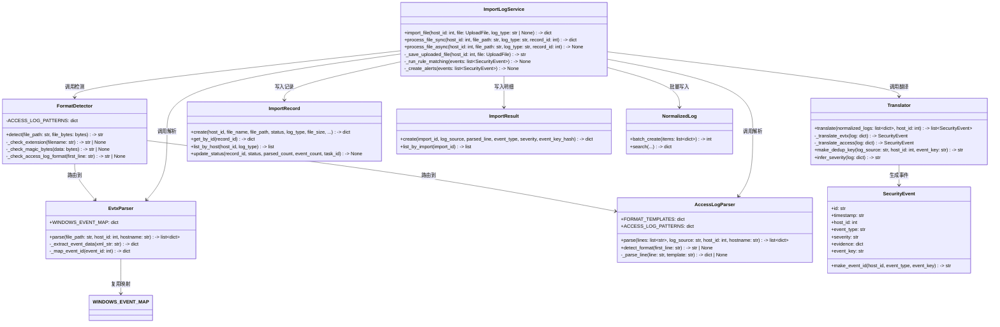
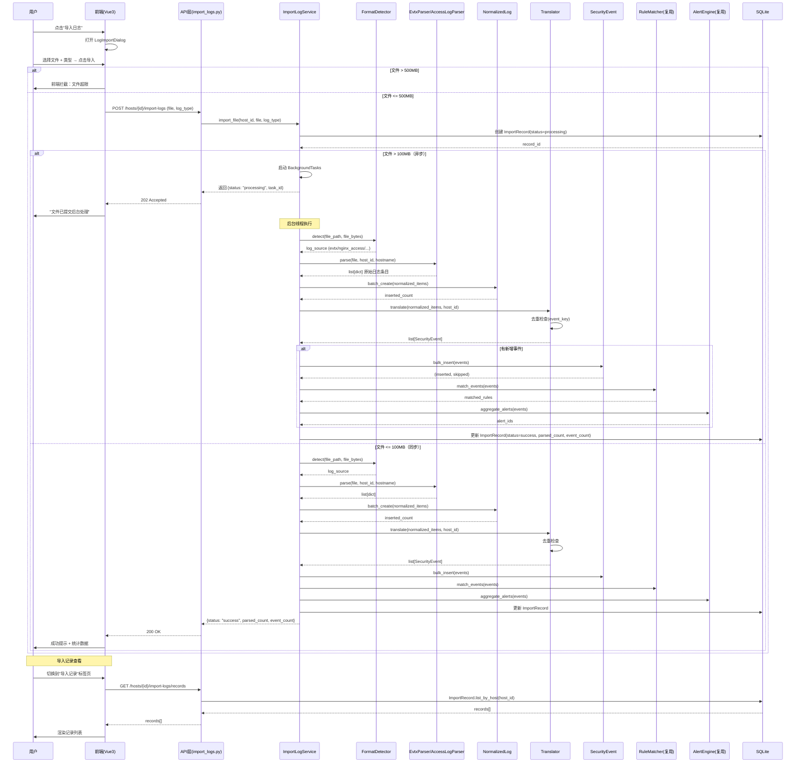
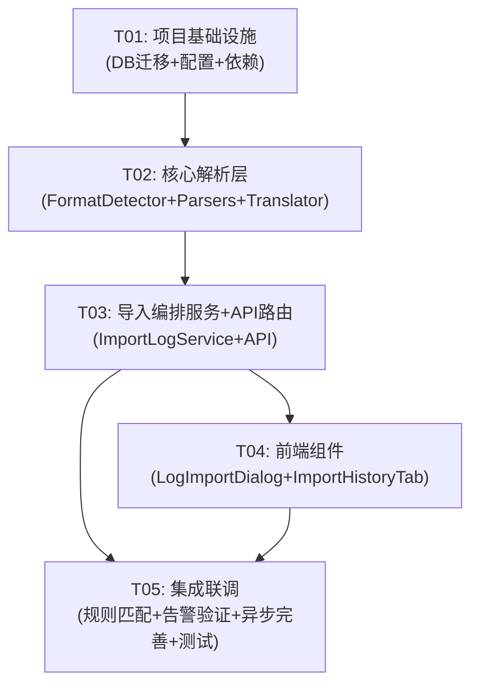

# 手工日志导入功能 — 系统架构设计 & 任务分解

> **架构师**：高见远（Bob）
> **PRD 版本**：v1.0
> **日期**：2025-07-16

---

## Part A：系统设计

---

### 1. 实现方案 & 框架选型

#### 1.1 核心技术挑战

| 挑战 | 说明 | 应对方案 |
|------|------|---------|
| **EVTX 二进制解析** | .evtx 是 Windows 二进制事件日志格式，需专用库解析 | 选用 `python-evtx`（纯 Python，零外部依赖） |
| **Access Log 多格式自动识别** | 需在无用户配置下区分 Nginx/Apache/IIS/Tomcat 共 6 种子格式 | 三级检测策略：扩展名 → Magic Bytes/首行特征 → 正则匹配 |
| **全链路复用现有模块** | 新导入数据需走完 normalized_logs → SecurityEvent → 规则匹配 → 告警 | 翻译层将手工日志格式映射为现有 SecurityEvent 结构，直接复用下游 |
| **大文件异步处理** | >100MB 文件不能阻塞请求 | FastAPI BackgroundTasks + 线程池，避免引入 Celery/Redis |
| **自动去重** | 同一文件重复上传不产生重复事件 | sha256(log_source:host_id:event_key)[:16] 作为唯一键 |

#### 1.2 框架与库选型

| 组件 | 选型 | 理由 |
|------|------|------|
| EVTX 解析 | `python-evtx` | 纯 Python、pip 一键安装、支持 Vista~Win11 全版本 EVTX 格式 |
| 正则引擎 | Python `re`（标准库） | Access Log 格式固定，无需第三方正则引擎 |
| 异步任务 | FastAPI `BackgroundTasks` | 轻量，不引入 Celery/Redis 等基础设施 |
| 后端框架 | FastAPI（已有） | 项目已使用，直接扩展 |
| 前端框架 | Vue 3 + Element Plus（已有） | 项目已使用，直接扩展 |

#### 1.3 架构模式

采用**分层架构**，在现有项目结构上新增 **Parser 解析层** + **Translator 翻译层**：

```
[用户上传] → API 层 → ImportLogService → 
  → FormatDetector → EvtxParser / AccessLogParser → NormalizedLogs
  → Translator (NormalizedLog → SecurityEvent)
  → 规则匹配 (复用现有 rule_matcher)
  → 告警聚合 (复用现有 alert_engine)
```

#### 1.4 WINDOWS_EVENT_MAP 复用策略

现有 `backend/app/analysis/log_normalizer.py` 中 `WINDOWS_EVENT_MAP`（60+ Event ID 映射）直接复用：

- **EVTX 解析路径**：解析出 EventID → 查 WINDOWS_EVENT_MAP → 取 event_type/event_label/severity/mitre
- **不新增映射**：直接 import 现有字典，保持单一数据源
- **扩展机制**：如需补充 Event ID，直接在 log_normalizer.py 中追加（不影响现有逻辑）

---

### 2. 文件列表

#### 2.1 后端新增文件

| 相对路径 | 说明 |
|----------|------|
| `backend/app/parsers/__init__.py` | 包初始化 |
| `backend/app/parsers/format_detector.py` | 格式识别器（三级检测） |
| `backend/app/parsers/evtx_parser.py` | EVTX 文件解析器 |
| `backend/app/parsers/access_log_parser.py` | Access Log 解析器（4 引擎 6 格式） |
| `backend/app/parsers/translator.py` | NormalizedLog → SecurityEvent 翻译层 |
| `backend/app/models/import_result.py` | import_results 表数据模型 |
| `backend/app/services/import_log_service.py` | 日志导入核心服务（编排解析→归一化→翻译全流程） |
| `backend/app/api/import_logs.py` | 导入日志 API 路由 |

#### 2.2 后端修改文件

| 相对路径 | 变更内容 |
|----------|---------|
| `backend/app/config.py` | 新增 `LOG_FILE_RETENTION_DAYS=7`、`MAX_LOG_FILE_SIZE_MB=500`、`ASYNC_THRESHOLD_MB=100` |
| `backend/app/database.py` | 新增 import_results 表 DDL；ALTER import_records 加 5 列；新增 `_migrate_import_records()` |
| `backend/app/models/import_record.py` | 扩展 create() 支持 log_type/file_size/parsed_count/event_count/task_id；新增 update_status() |
| `backend/app/main.py` | 注册 import_logs 路由 |
| `backend/requirements.txt` | 追加 `python-evtx>=0.1.1` |

#### 2.3 前端新增文件

| 相对路径 | 说明 |
|----------|------|
| `frontend/src/api/importLogs.js` | 导入日志 API 封装 |
| `frontend/src/components/LogImportDialog.vue` | 导入日志对话框组件 |
| `frontend/src/components/ImportHistoryTab.vue` | 导入记录标签页组件 |

#### 2.4 前端修改文件

| 相对路径 | 变更内容 |
|----------|---------|
| `frontend/src/views/HostDetailView.vue` | 操作栏新增"导入日志"按钮 + 标签页新增"导入记录" |

---

### 3. 数据结构和接口

#### 3.1 类图



#### 3.2 normalized_logs log_source 扩展

现有 `log_source` 取值：`system`, `security`, `application`, `syslog`  
新增取值（无 SQL 变更，仅语义扩展）：

| log_source | 含义 | 来源 |
|------------|------|------|
| `evtx` | 手工导入的 EVTX 文件 | EvtxParser |
| `nginx_access` | Nginx Access Log | AccessLogParser |
| `apache_access` | Apache Access Log | AccessLogParser |
| `iis_access` | IIS W3C Access Log | AccessLogParser |
| `tomcat_access` | Tomcat Access Log | AccessLogParser |

#### 3.3 import_records 表扩展

```sql
-- 在现有表基础上新增 5 列（通过 database.py 的 `_migrate_import_records()` 执行）
ALTER TABLE import_records ADD COLUMN log_type TEXT;        -- 'evtx' | 'access' | 'agent_json'
ALTER TABLE import_records ADD COLUMN file_size INTEGER;    -- 文件大小（字节）
ALTER TABLE import_records ADD COLUMN parsed_count INTEGER; -- 解析出的原始日志条数
ALTER TABLE import_records ADD COLUMN event_count INTEGER;  -- 映射出的安全事件条数
ALTER TABLE import_records ADD COLUMN task_id TEXT;         -- 异步任务 ID
```

#### 3.4 import_results 表（新增）

```sql
CREATE TABLE IF NOT EXISTS import_results (
    id              INTEGER PRIMARY KEY AUTOINCREMENT,
    import_id       INTEGER NOT NULL REFERENCES import_records(id) ON DELETE CASCADE,
    log_source      TEXT NOT NULL,         -- evtx / nginx_access / ...
    parsed_line     INTEGER NOT NULL,       -- 原始文件中的行号
    event_type      TEXT NOT NULL,          -- 映射后的事件类型
    severity        TEXT DEFAULT 'info',    -- 推断出的严重度
    event_key_hash  TEXT,                   -- 去重哈希（前 16 位）
    created_at      TEXT NOT NULL DEFAULT (datetime('now'))
);
CREATE INDEX IF NOT EXISTS idx_import_results_import_id ON import_results(import_id);
CREATE INDEX IF NOT EXISTS idx_import_results_key_hash ON import_results(event_key_hash);
```

#### 3.5 去重键设计

```
dedup_key = sha256(f"{log_source}:{host_id}:{event_key}")[:16]
```

| 日志类型 | event_key 生成规则 |
|----------|-------------------|
| EVTX | `{EventID}:{TimeCreated}:{description[:100]}` |
| Access Log | `{src_ip}:{timestamp}:{url}:{method}` |

- 去重检查在 `Translator.translate()` 中执行
- 查询 `security_events` 表是否存在相同 `event_key`（由 `make_event_id` 生成的 id 前缀）
- 若已存在则跳过生成该条 SecurityEvent

#### 3.6 SecurityEvent 映射结构

**EVTX 映射示例**：
```json
{
  "event_id": 4625,
  "event_label": "登录失败",
  "src_ip": "10.0.0.1",
  "user_name": "admin",
  "process_name": "",
  "description": "帐户登录失败...",
  "event_type": "failed_logon",
  "severity": "high",
  "mitre_attack": "T1110",
  "source_collector": "manual_import"
}
```

**Access Log 映射示例**：
```json
{
  "url": "/admin/login.php",
  "method": "POST",
  "status_code": 404,
  "user_agent": "Mozilla/5.0 ...",
  "referer": "-",
  "src_ip": "192.168.1.100",
  "event_type": "web_access",
  "severity": "medium",
  "source_collector": "manual_import"
}
```

---

### 4. 程序调用流程（时序图）



---

### 5. 未明确事项

| 问题 | 现状 | 建议方案 |
|------|------|---------|
| Q-01: EVTX EventData XML 映射 | PRD 建议存 raw_data 再按需提取 | ✅ 采纳：完整 XML 存入 raw_data，翻译层按需解析提取关键字段到 evidence JSON |
| Q-02: X-Forwarded-For 处理 | PRD 建议后续增加 | ✅ 采纳：当前仅取标准日志字段 src_ip |
| Q-03: 大文件队列选型 | PRD 建议 BackgroundTasks | ✅ 采纳：使用 FastAPI BackgroundTasks + 线程池，避免引入 Celery |
| Q-04: python-evtx 兼容性 | 需验证 Win10 21H2+ | 建议在测试环境用真实 .evtx 文件验证；备选 pyevtx（libevtx binding） |
| Q-05: 原始文件保留策略 | PRD 建议 7 天后清理 | ✅ 采纳：默认保留 7 天，config.py 中 LOG_FILE_RETENTION_DAYS=7 可配置 |
| Q-06: Access Log 404 归类 | 由下游规则引擎处理 | ✅ 采纳：翻译层保持独立性，后续可增加 P2 "Web 扫描检测"规则 |
| Q-07: WINDOWS_EVENT_MAP 扩展 | 直接复用现有 60+ 映射 | ✅ 采纳：直接 import 现有字典，不新增副本 |

---

## Part B：任务分解

---

### 6. 依赖包列表

```
# 新增依赖（追加到 backend/requirements.txt）
python-evtx>=0.1.1            # EVTX 二进制日志解析
# 以下为已有依赖（已在 requirements.txt 中）
fastapi>=0.104.0              # Web 框架
uvicorn[standard]             # ASGI 服务器
python-multipart              # 文件上传解析
sqlite3                       # 数据库（Python 标准库）
```

---

### 7. 任务列表（按实现顺序）

#### T01：项目基础设施 — 配置扩展 + 数据库迁移 + 依赖安装

| 属性 | 值 |
|------|-----|
| **任务 ID** | T01 |
| **任务名称** | 项目基础设施（DB 迁移 + 配置 + 依赖） |
| **负责人** | 后端工程师 |
| **预估代码行数** | ~150 行 |
| **优先级** | P0 |

**涉及文件**：
- `backend/requirements.txt` — 追加 `python-evtx>=0.1.1`
- `backend/app/config.py` — 新增 `LOG_FILE_RETENTION_DAYS=7`, `MAX_LOG_FILE_SIZE_MB=500`, `ASYNC_THRESHOLD_MB=100`
- `backend/app/database.py` — 新增 import_results 表 DDL + `_migrate_import_records()` + `_create_import_results_indexes()`, 在 `init_db()` 中调用
- `backend/app/models/import_record.py` — 扩展字段：`log_type`, `file_size`, `parsed_count`, `event_count`, `task_id`；新增 `update_status()` 方法
- `backend/app/models/import_result.py` — 新建模型：CRUD 方法（create, list_by_import, get_by_id）

**具体工作**：
1. `requirements.txt` 追加 `python-evtx>=0.1.1`
2. `config.py` 新增三个配置常量
3. `database.py` 在 DDL_STATEMENTS 末尾追加 import_results 建表语句 + 索引；新增 `_migrate_import_records()` ALTER TABLE 函数；在 `init_db()` 末尾调用
4. `import_record.py` 修改 `create()` 方法签名（支持新字段），新增 `update_status()` 静态方法
5. `import_result.py` 新建完整的 CRUD 模型类

**依赖**：无（基础设施任务，最先完成）

---

#### T02：核心解析层 — FormatDetector + EvtxParser + AccessLogParser + Translator

| 属性 | 值 |
|------|-----|
| **任务 ID** | T02 |
| **任务名称** | 核心解析层（格式识别 + 日志解析 + 翻译映射） |
| **负责人** | 后端工程师 |
| **预估代码行数** | ~450 行 |
| **优先级** | P0 |

**涉及文件**：
- `backend/app/parsers/__init__.py` — 包初始化
- `backend/app/parsers/format_detector.py` — 三级格式检测（扩展名 → Magic → 首行特征）
- `backend/app/parsers/evtx_parser.py` — 基于 python-evtx 的 EVTX 解析器；导入 WINDOWS_EVENT_MAP 做 EventID→事件类型映射
- `backend/app/parsers/access_log_parser.py` — 支持 6 种子格式的正则解析器（Nginx combined/common, Apache combined/common, IIS W3C, Tomcat）
- `backend/app/parsers/translator.py` — NormalizedLog → SecurityEvent 翻译；去重键生成；严重度推断

**具体工作**：
1. `format_detector.py`：
   - `_check_extension()`: `.evtx` → `evtx`；`.log`/`.txt` → 继续检测
   - `_check_magic_bytes()`: EVTX magic `ElfFile\x00` 检测
   - `_check_access_log_format()`: 首行匹配 IIS W3C（`#Fields:`）、Nginx/Apache common/combined 正则、Tomcat 正则
   - `detect()`: 三级调用，返回 `log_source` 或抛出 `UnsupportedFormatError`

2. `evtx_parser.py`：
   - `parse()`: 用 `EvtxFile(file_path)` 逐条读取，提取 EventID/TimeCreated/EventData XML
   - `_map_event_id()`: 查 WINDOWS_EVENT_MAP 获取 event_type/severity/mitre
   - 输出格式：`[{host_id, hostname, log_source, event_id, event_type, event_label, severity, timestamp, raw_data, ...}]`

3. `access_log_parser.py`：
   - `FORMAT_TEMPLATES`: 6 组命名正则（含 src_ip, timestamp, method, url, status_code, referer, user_agent 等组名）
   - `detect_format()`: 用每组的正则尝试匹配首行，匹配成功即判定为该格式
   - `parse()`: 逐行匹配，提取字段

4. `translator.py`：
   - `translate()`: 遍历 normalized_logs，对每条调用 `_translate_evtx()` / `_translate_access()`
   - `make_dedup_key()`: `sha256(f"{log_source}:{host_id}:{event_key}")[:16]`
   - `infer_severity()`: Access Log 5xx→high, 4xx→medium, 2xx→info；EVTX 直接从 WINDOWS_EVENT_MAP 取

**依赖**：T01（需要 DB 模型 + import_results 表已存在）

---

#### T03：核心业务服务 — ImportLogService（导入编排 + API 路由）

| 属性 | 值 |
|------|-----|
| **任务 ID** | T03 |
| **任务名称** | 导入编排服务 + API 路由 |
| **负责人** | 后端工程师 |
| **预估代码行数** | ~350 行 |
| **优先级** | P0 |

**涉及文件**：
- `backend/app/services/import_log_service.py` — **新建**：全流程编排（上传→保存→解析→归一化→翻译→去重→规则匹配→告警）
- `backend/app/api/import_logs.py` — **新建**：4 个 API 端点（POST /import-logs, GET /records, GET /records/{id}, GET /tasks/{id}）
- `backend/app/main.py` — **修改**：注册 `import_logs` 路由

**具体工作**：

1. `import_log_service.py`：
   - `_save_uploaded_file()`: 保存到 `settings.UPLOAD_DIR`，安全验证（路径穿越防护、MIME 校验）
   - `_run_rule_matching()`: 调用 `rule_matcher.match_events(events)` 复用现有规则匹配
   - `_create_alerts()`: 调用 `alert_engine` 复用告警聚合（5min 窗口）
   - `import_file()`: 主入口，检测文件大小决定同步/异步
   - `process_file_sync()`: 同步全流程
   - `process_file_async()`: 异步后台线程执行（调用 `process_file_sync` 内部逻辑）

2. `import_logs.py`（4 个端点）：
   - `POST /api/hosts/{host_id}/import-logs` — 上传文件
   - `GET /api/hosts/{host_id}/import-logs/records` — 记录列表（支持 `type` 筛选参数）
   - `GET /api/hosts/{host_id}/import-logs/records/{record_id}` — 单条详情（含 import_results 明细）
   - `GET /api/hosts/{host_id}/import-logs/tasks/{task_id}` — 异步任务状态查询

3. `main.py`：追加 `from app.api import import_logs` + `app.include_router(import_logs.router, prefix="/api", tags=["导入日志"])`

**依赖**：T02（需要解析器和翻译器已就绪）

---

#### T04：前端组件 — LogImportDialog + ImportHistoryTab + API 对接

| 属性 | 值 |
|------|-----|
| **任务 ID** | T04 |
| **任务名称** | 前端组件（导入对话框 + 导入记录标签页 + API 封装） |
| **负责人** | 前端工程师 |
| **预估代码行数** | ~400 行 |
| **优先级** | P1 |

**涉及文件**：
- `frontend/src/api/importLogs.js` — **新建**：封装 4 个 API 调用（upload, listRecords, getRecord, getTaskStatus）
- `frontend/src/components/LogImportDialog.vue` — **新建**：导入日志对话框（类型选择 + 文件拖拽 + 大小校验 + 反馈）
- `frontend/src/components/ImportHistoryTab.vue` — **新建**：导入记录表格（统计栏 + 列表 + 详情抽屉）
- `frontend/src/views/HostDetailView.vue` — **修改**：操作栏加"导入日志"按钮 + 标签页加"导入记录"

**具体工作**：

1. `importLogs.js`：
   - `upload(hostId, file, logType)` — POST multipart/form-data
   - `listRecords(hostId, params)` — GET 导入记录列表
   - `getRecord(hostId, recordId)` — GET 单条详情
   - `getTaskStatus(hostId, taskId)` — GET 任务状态

2. `LogImportDialog.vue`：
   - 文件类型下拉：EVTX / Access Log / 自动识别（默认）
   - Element Plus `<el-upload>` 拖拽区域，accept `.evtx`, `.log`, `.txt`
   - 前端大小校验：≤500MB，>100MB 提示"大文件将异步处理"
   - 导入成功后成功提示（显示解析条数、事件数）、失败后错误弹窗

3. `ImportHistoryTab.vue`：
   - 统计栏：总导入数 / 成功 / 失败 / 处理中（4 个统计卡片）
   - 表格：文件名 | 类型 | 大小 | 解析条数 | 事件数 | 状态 | 时间 | 操作（查看详情）
   - 侧边抽屉详情：解析详情、错误信息（失败时）
   - 按类型筛选下拉

4. `HostDetailView.vue`：
   - 操作栏新增 `<el-button type="warning">导入日志</el-button>`（在"导入 JSON"旁）
   - 标签页新增 `<el-tab-pane label="导入记录" name="import_logs">`

**依赖**：T03（需要 API 路由已就绪才能对接）

---

#### T05：集成联调 — 规则匹配打通 + 告警聚合验证 + 异步任务完善

| 属性 | 值 |
|------|-----|
| **任务 ID** | T05 |
| **任务名称** | 规则匹配打通 + 告警验证 + 异步完善 + 端到端测试 |
| **负责人** | 后端工程师 + 前端工程师 |
| **预估代码行数** | ~150 行 |
| **优先级** | P1 |

**涉及文件**：
- `backend/app/services/import_log_service.py` — **修改**：完善异步处理中的错误处理、重试、超时；增强去重检查的 DB 查询
- `backend/app/parsers/translator.py` — **修改**：根据端到端测试反馈调优映射规则
- `backend/app/services/rule_matcher.py` — **检查/微调**：确保手工导入的 SecurityEvent 能正常匹配规则（event_type 映射正确）
- `backend/app/services/alert_engine.py` — **检查**：验证 5 分钟聚合窗口对新导入的事件生效
- `frontend/src/components/LogImportDialog.vue` — **修改**：增加异步轮询 task 状态的逻辑
- `frontend/src/components/ImportHistoryTab.vue` — **修改**：处理异步任务的状态更新刷新

**具体工作**：

1. 异步任务补全：
   - 错误处理：`process_file_async` 中 try/except 捕获解析异常，将 record 状态更新为 failed
   - 超时保护：单次异步任务最长执行时间限制（如 30 分钟）
   - 并发控制：同一主机最多 3 个并发异步任务

2. 规则匹配验证：
   - 确保手工导入产生的 SecurityEvent 的 `event_type` 能被现有规则匹配
   - 对于 Access Log web_access 类型，确认规则引擎有对应规则或添加默认规则
   - 验证 `matched_rules` 字段正确回写到 security_events 表

3. 告警聚合验证：
   - 手动触发多次导入，验证 5 分钟窗口内相同规则命中的告警正确聚合
   - 验证 `alerts.count` 字段正确累加

4. 前端异步轮询：
   - LogImportDialog：上传大文件后显示"处理中"状态，每 5 秒轮询 task 状态
   - ImportHistoryTab：自动刷新"处理中"记录的状态

5. 端到端测试：
   - 上传 3 个真实 EVTX 文件（不同版本 Windows）
   - 上传 4 种 Access Log 各 1 个文件
   - 验证全链路：解析条数正确 → 归一化写入 → 翻译去重 → 规则匹配 → 告警产生 → 分析中心可见

**依赖**：T04（前端组件已就绪）

---

### 8. 任务依赖关系图



---

### 9. 共享知识

#### 9.1 log_source 取值规范

| 值 | 含义 | 生产者 |
|----|------|--------|
| `system` | Windows System 日志（Agent 采集） | Agent |
| `security` | Windows Security 日志（Agent 采集） | Agent |
| `application` | Windows Application 日志（Agent 采集） | Agent |
| `syslog` | Linux Syslog（Agent 采集） | Agent |
| `evtx` | 手工导入的 EVTX 文件 | EvtxParser |
| `nginx_access` | 手工导入的 Nginx Access Log | AccessLogParser |
| `apache_access` | 手工导入的 Apache Access Log | AccessLogParser |
| `iis_access` | 手工导入的 IIS Access Log | AccessLogParser |
| `tomcat_access` | 手工导入的 Tomcat Access Log | AccessLogParser |

#### 9.2 event_key 生成规则

| 日志类型 | 规则 | 示例 |
|----------|------|------|
| EVTX | `{EventID}:{TimeCreated}:{description[:100]}` | `4625:2025-07-16T10:30:15:帐户登录失败 来源IP:10.0.0.1...` |
| Access Log | `{src_ip}:{timestamp}:{url}:{method}` | `192.168.1.1:15/Jul/2025:10:30:15 +0800:/admin/login.php:POST` |

去重键：`sha256(f"{log_source}:{host_id}:{event_key}")[:16]`

#### 9.3 字段命名规范

- **全部使用 snake_case**（Python 后端、JSON 响应、DB 列名）
- `log_source` 统一小写字母 + 下划线
- `event_type` 使用现有 SecurityEvent 枚举值（见 `security_event.py` 的 `EVENT_TYPES`）
- `severity` 取值：`critical`, `high`, `medium`, `low`, `info`
- 时间戳格式：ISO 8601 UTC（如 `2025-07-16T10:30:00`）

#### 9.4 API 响应格式

所有 API 响应统一格式：
```json
{
  "code": 0,
  "data": { ... },
  "message": "success"
}
```
错误时 `code` 非 0，`message` 包含错误描述。

#### 9.5 文件上传安全

- 前端双重校验：扩展名 + 文件大小
- 后端再做文件头 Magic Bytes 校验
- 文件名过滤 `../`, `..\\` 等路径穿越字符
- 原始文件保存到 `settings.UPLOAD_DIR` 子目录（按 host_id 分目录）
- 解析完成后原始文件保留 7 天后自动清理（计划任务）

#### 9.6 跨文件引用路径

```python
# 翻译层引用 WINDOWS_EVENT_MAP
from app.analysis.log_normalizer import WINDOWS_EVENT_MAP

# 规则匹配复用
from app.services.rule_matcher import match_events

# 告警聚合复用
from app.services.alert_engine import aggregate_alerts
```
