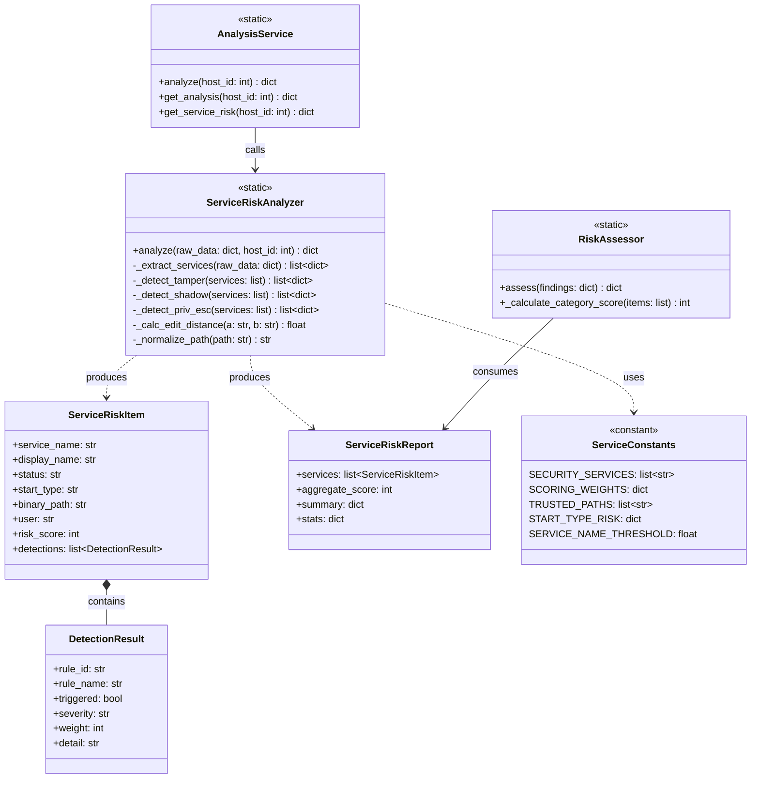
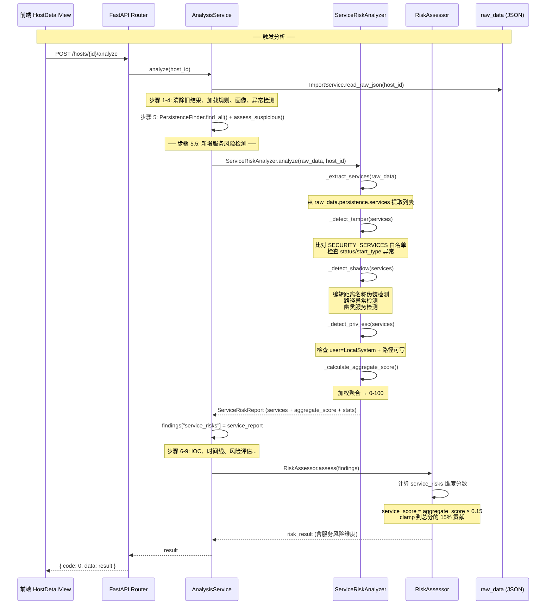
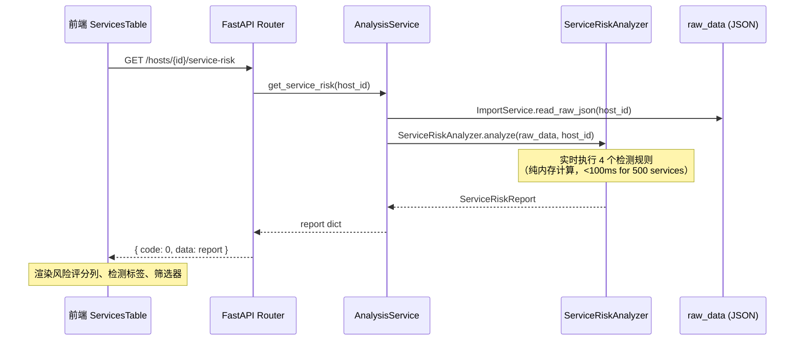
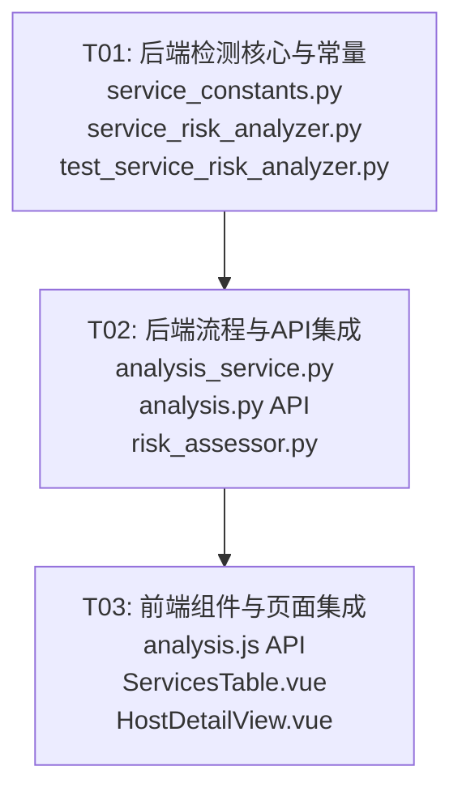

# 系统服务检测加强 — 系统架构设计文档

> **作者**: Bob (Architect)  
> **日期**: 2026-07-11  
> **版本**: v1.0  
> **关联 PRD**: 系统服务检测加强（P0-P2 分级）

---

## Part A: 系统设计

### 1. 实现方案

#### 1.1 核心技术挑战

| 挑战 | 描述 | 策略 |
|------|------|------|
| **服务状态篡改识别** | 安全软件服务被停止或启动类型从"自动"改为"手动/禁用" | 内置 Windows 安全服务白名单（~18 个），比对 status/start_type |
| **影子服务检测** | 服务名伪装（如 `WinDefend` → `W1nDefend`）、路径异常（不在 System32 下）、幽灵服务（注册表有但 SCM 无） | 编辑距离算法 + 路径正则白名单 + 注册表交叉比对 |
| **实时计算性能** | 服务数量 < 500，分析不落库，需在分析流程中高效执行 | 纯内存计算，O(n) 复杂度，无 DB 写入 |
| **评分模型聚合** | 4 个检测规则权重不同，需聚合为 0-100 的统一分数 | 加权求和 + 归一化截断 |

#### 1.2 框架与库选型

| 层级 | 技术栈 | 理由 |
|------|--------|------|
| **后端检测引擎** | Python 3（复用现有 `app/analysis/` 模块体系） | 同现有 `PersistenceFinder`、`AnomalyDetector` 模式一致 |
| **字符串相似度** | Python 标准库 `difflib.SequenceMatcher` | 零依赖，满足服务名模糊匹配需求 |
| **路径规范化** | `os.path.normpath` + `str.lower()` | 零依赖，处理 `/` vs `\` 差异 |
| **前端框架** | Vue 3 + Element Plus（复用现有） | 与 `ServicesTable.vue`、`HostDetailView.vue` 一致 |
| **API 通信** | 现有 `axios` 封装（`api/analysis.js`） | 复用既有拦截器、JWT 认证 |

**无新增第三方依赖** — 所有检测逻辑使用 Python 标准库实现。

#### 1.3 架构模式

```
┌─────────────────────────────────────────────────────────┐
│                   analysis_service.py                    │
│  analyze() 第5步之后新增:                                │
│    service_results = ServiceRiskAnalyzer.analyze(        │
│        raw_data, host_id                                 │
│    )                                                     │
│    → 注入 findings["service_risks"]                      │
│    → RiskAssessor 聚合服务风险分数                        │
└─────────────────────────────────────────────────────────┘
         │                              │
         ▼                              ▼
┌─────────────────────┐    ┌──────────────────────────┐
│ ServiceRiskAnalyzer │    │   service_constants.py    │
│  (app/analysis/)    │───▶│   SECURITY_SERVICES       │
│                     │    │   SCORING_WEIGHTS          │
│  - detect_tamper()  │    │   TRUSTED_PATHS            │
│  - detect_shadow()  │    │   SERVICE_NAME_SIMILARITY  │
│  - detect_priv_esc()│    └──────────────────────────┘
│  - calculate_score()│
└─────────────────────┘
         │
         ▼
┌──────────────────────────────────────┐
│  GET /api/hosts/{id}/service-risk    │
│  → 返回 JSON: { services, score }    │
└──────────────────────────────────────┘
         │
         ▼
┌──────────────────────────────────────┐
│  ServicesTable.vue (重构)            │
│  - 风险评分列 + 检测规则标签          │
│  - 筛选（状态/风险/类型）             │
│  - 行展开详情（检测原因明细）          │
└──────────────────────────────────────┘
```

---

### 2. 文件列表

| 操作 | 文件路径 | 说明 |
|------|----------|------|
| **新建** | `backend/app/analysis/service_constants.py` | 安全服务白名单、评分权重常量、可信路径列表 |
| **新建** | `backend/app/analysis/service_risk_analyzer.py` | `ServiceRiskAnalyzer` 类：4 个检测规则 + 评分聚合 |
| **新建** | `backend/tests/test_service_risk_analyzer.py` | 单元测试：覆盖篡改检测、影子检测、评分计算 |
| **修改** | `backend/app/services/analysis_service.py` | `analyze()` 中新增步骤 5.5（服务风险检测）；`get_analysis()` 注入结果 |
| **修改** | `backend/app/api/analysis.py` | 新增 `GET /hosts/{host_id}/service-risk` 端点 |
| **修改** | `backend/app/analysis/risk_assessor.py` | `assess()` 新增 `service_risks` 维度评分 |
| **修改** | `frontend/src/api/analysis.js` | 新增 `getServiceRisk(hostId)` API 方法 |
| **修改** | `frontend/src/components/ServicesTable.vue` | 重构：风险评分列、检测标签、筛选搜索、行展开 |
| **修改** | `frontend/src/views/HostDetailView.vue` | "系统服务" Tab 升级：接入 `serviceRisk` 数据、统计卡片 |

---

### 3. 数据结构和接口

#### 3.1 类图



#### 3.2 核心数据结构

**`ServiceRiskAnalyzer.analyze()` 输入**:

```python
raw_data = {
    "persistence": {
        "services": [
            {
                "name": "WinDefend",
                "display_name": "Microsoft Defender Antivirus Service",
                "status": "stopped",        # running / stopped / paused
                "start_type": "disabled",   # auto / manual / disabled / delayed-auto
                "path": "C:\\Windows\\System32\\svchost.exe -k secsvcs",
                "user": "LocalSystem"
            },
            # ... 通常 200-500 条
        ]
    }
}
```

**`ServiceRiskAnalyzer.analyze()` 输出**:

```python
{
    "services": [
        {
            "service_name": "WinDefend",
            "display_name": "Microsoft Defender Antivirus Service",
            "status": "stopped",
            "start_type": "disabled",
            "binary_path": "C:\\Windows\\System32\\svchost.exe -k secsvcs",
            "user": "LocalSystem",
            "risk_score": 75,               # 0-100 单服务风险分
            "detections": [
                {
                    "rule_id": "P0-1-TAMPER",
                    "rule_name": "安全服务被篡改",
                    "triggered": True,
                    "severity": "critical",
                    "weight": 40,
                    "detail": "安全服务 WinDefend 状态为 stopped，启动类型为 disabled（预期 auto/running）"
                }
            ]
        },
        # ...
    ],
    "aggregate_score": 82,                  # 0-100 总体服务风险分
    "summary": {
        "total": 312,
        "tampered": 2,
        "shadow": 1,
        "privilege_escalation": 0,
        "high_risk_count": 3
    },
    "stats": {
        "tamper_score": 75,
        "shadow_score": 35,
        "priv_esc_score": 0
    }
}
```

#### 3.3 API 端点设计

**新增端点**:

| 方法 | 路径 | 说明 |
|------|------|------|
| `GET` | `/api/hosts/{host_id}/service-risk` | 获取服务风险分析结果（实时计算，不落库） |

**响应格式**（复用现有 `{code, data, message}` 格式）:

```json
{
    "code": 0,
    "message": "success",
    "data": {
        "services": [...],
        "aggregate_score": 82,
        "summary": {...},
        "stats": {...}
    }
}
```

#### 3.4 扩展的 RiskAssessor findings 字典

在 `analysis_service.py` 的 `analyze()` 方法中，`findings` 字典新增键：

```python
findings = {
    # ... 既有字段 ...
    "service_risks": service_risk_report  # ← 新增
}
```

`RiskAssessor.assess()` 读取 `findings["service_risks"]`，将其 `aggregate_score` 按加权因子（0.15）合并到总分中。

---

### 4. 程序调用流程

#### 4.1 分析流程（时序图）



#### 4.2 查询流程（时序图）



---

### 5. 检测规则详解

#### P0-1: 服务状态篡改检测 (权重 40)

**逻辑**:
1. 遍历所有服务，将 `service_name`（小写归一）与 `SECURITY_SERVICES` 白名单比对
2. 命中白名单的服务检查：
   - `status != "running"` → 触发（安全软件被停止）
   - `start_type` 不在 `["auto", "delayed-auto"]` → 触发（启动类型被篡改）
3. 严重程度：两个条件都触发 → `critical`，仅一个 → `high`

**白名单（18 个安全服务）**:
```python
SECURITY_SERVICES = [
    "windefend", "msmpeng", "wuauserv", "wscsvc", "securityhealthservice",
    "sense", "mpssvc", "bfe", "windowsdefender", "defender",
    "savservice", "sepstammaster", "symantec", "mcshield", "mcafee",
    "kaspersky", "eset", "trendmicro", "360sd", "zhudongfangyu",
]
```

#### P0-2: 影子服务检测 (权重 35)

**逻辑**:
1. **名称伪装**: 对每个服务名，计算与所有白名单服务的编辑距离相似度。相似度 ≥ 0.85 但名称不完全匹配 → 可能是伪装（如 `WinDefend` vs `W1nDefend`）
2. **路径异常**: 服务 `binary_path` 的目录部分不在 `TRUSTED_PATHS` 中，且路径包含 `Temp`、`AppData`、`Public` 等可疑目录
3. **幽灵服务**: `status == "stopped"` 且 `start_type == "disabled"` 且不在任何已知合法服务列表中

#### 评分模型

```
单个服务风险分 = SUM(触发规则的 weight) / 总可能权重 * 100
总体聚合分 = SUM(所有非零服务的风险分) / 服务总数，上限 100

规则权重:
  P0-1-TAMPER:  40  (安全服务篡改)
  P0-2-SHADOW:  35  (影子服务)
  P1-PRIVESC:   15  (服务提权)
  P1-REGISTRY:  10  (注册表持久化)
  ─────────────────
  总计:         100
```

---

### 6. 任何不明确之处

| 问题 | 假设 | 影响 |
|------|------|------|
| **P0-3 "系统服务"Tab 是否替换原 Tab 还是新增 Tab？** | **替换**原有"系统服务"Tab：当前 Tab 仅展示原始 services 列表，P0 需求将其升级为含风险评分、检测标签、筛选、展开详情的增强版 Tab | 前端改造范围：`ServicesTable.vue` 重构 + `HostDetailView.vue` Tab 升级 |
| **P1 注册表写入持久化检测的数据来源？** | 使用 `raw_data.registry_keys`（已在 step 8 落库）中查询 `HKLM\SYSTEM\CurrentControlSet\Services\` 路径下的注册表键，与 `raw_data.persistence.services` 做交叉比对 | P1 规则在 `_detect_priv_esc` 之后执行，作为补充检测维度 |
| **P0 评分对 RiskAssessor 总分的贡献比例？** | 服务风险维度占总体风险分的 **15%**（`aggregate_score × 0.15`），与既有维度（异常进程、可疑外连等）并列 | 需修改 `RiskAssessor.assess()` 添加新维度 |
| **幽灵服务检测中"已知合法服务列表"如何定义？** | 使用 Windows 内置服务名集合（约 150 个常见系统服务），硬编码在 `service_constants.py` 中作为 `KNOWN_LEGIT_SERVICES` | 误报控制在可接受范围 |
| **P2 远期需求（恢复操作、DLL劫持、基线对比）是否需要预留扩展点？** | 是——`DetectionResult.rule_id` 使用 `P0-1-TAMPER` 格式，`ServiceRiskAnalyzer` 的 `analyze()` 内部使用 `_detect_*` 前缀的规则方法，新增规则只需添加新方法并在 `analyze()` 中调用 | 架构天然支持扩展 |

---

## Part B: 任务分解

### 7. 需要的依赖包

**无新增依赖包** — 所有检测逻辑使用 Python 标准库（`difflib`、`os.path`、`re`、`fnmatch`）实现，前端复用现有 Vue 3 + Element Plus 组件库。

---

### 8. 任务列表（按依赖顺序）

| 任务 ID | 任务名称 | 源文件 | 依赖 | 优先级 |
|---------|----------|--------|------|--------|
| **T01** | 后端检测核心与常量 | `backend/app/analysis/service_constants.py` (新建)<br>`backend/app/analysis/service_risk_analyzer.py` (新建)<br>`backend/tests/test_service_risk_analyzer.py` (新建) | 无 | P0 |
| **T02** | 后端流程与 API 集成 | `backend/app/services/analysis_service.py` (修改)<br>`backend/app/api/analysis.py` (修改)<br>`backend/app/analysis/risk_assessor.py` (修改) | T01 | P0 |
| **T03** | 前端组件与页面集成 | `frontend/src/api/analysis.js` (修改)<br>`frontend/src/components/ServicesTable.vue` (修改)<br>`frontend/src/views/HostDetailView.vue` (修改) | T02 | P0 |

---

### 9. 共享知识

跨文件约定，供 Engineer 实现时参考：

```yaml
# ── 数据来源 ──
raw_data_path: "raw_data.persistence.services"  # 服务列表所在 JSON 路径
raw_data_registry: "raw_data.registry_keys"       # 注册表数据（P1 用）

# ── 服务字段映射 ──
service_fields:
  name: str           # 服务短名称（如 "WinDefend"）
  display_name: str   # 服务显示名称
  status: str         # running | stopped | paused | start_pending | stop_pending
  start_type: str     # auto | manual | disabled | delayed-auto | boot | system
  path: str           # 二进制路径（可能含参数，如 "svchost.exe -k secsvcs"）
  user: str           # 运行身份（如 "LocalSystem", "NT AUTHORITY\NetworkService"）

# ── 安全服务白名单位置 ──
# backend/app/analysis/service_constants.py → SECURITY_SERVICES (list[str], 小写)
# 白名单包含: Windows Defender, 主流第三方安全软件服务名

# ── 评分常量位置 ──
# backend/app/analysis/service_constants.py → SCORING_WEIGHTS: dict[str, int]
#   "P0-1-TAMPER": 40
#   "P0-2-SHADOW": 35
#   "P1-PRIVESC": 15
#   "P1-REGISTRY": 10

# ── 可信路径位置 ──
# backend/app/analysis/service_constants.py → TRUSTED_PATHS: list[str]
#   包含: C:\Windows\System32\, C:\Windows\SysWOW64\, C:\Program Files\, C:\Program Files (x86)\

# ── 编辑距离阈值 ──
# backend/app/analysis/service_constants.py → SERVICE_NAME_SIMILARITY_THRESHOLD: float = 0.85

# ── API 响应格式 ──
# 所有 API 统一使用 { "code": 0, "data": ..., "message": "success" } 格式
# 身份认证通过 JWT Bearer Token（复用现有 get_current_user 依赖）

# ── RiskAssessor 服务风险贡献比率 ──
# SERVICE_RISK_CONTRIBUTION: float = 0.15  # 服务风险维度占总分的 15%

# ── 检测结果不落库 ──
# ServiceRiskAnalyzer 每次调用实时计算，不创建数据库表
# results 仅通过 API 返回给前端，不在 analysis_results.details 中持久化

# ── 命名约定 ──
# 所有 rule_id 使用 "P{优先级}-{序号}-{简称}" 格式，便于扩展
# DetectionResult.detail 字段为中文，直接展示给用户
```

---

### 10. 任务依赖图



---

### 11. 各任务详细说明

#### T01: 后端检测核心与常量

**目标**: 建立服务风险检测的基础设施——常量定义和核心检测引擎。

**新建文件**:

1. **`backend/app/analysis/service_constants.py`**
   - `SECURITY_SERVICES`: `list[str]` — 18 个安全软件服务名（小写）
   - `SCORING_WEIGHTS`: `dict[str, int]` — 4 个规则的权重映射
   - `TRUSTED_PATHS`: `list[str]` — 8 个 Windows 可信系统路径
   - `KNOWN_LEGIT_SERVICES`: `set[str]` — ~150 个常见 Windows 合法服务名
   - `START_TYPE_RISK`: `dict[str, int]` — 启动类型风险分值映射
   - `SERVICE_NAME_SIMILARITY_THRESHOLD`: `float = 0.85`
   - `SUSPICIOUS_PATH_KEYWORDS`: `list[str]` — 可疑路径关键词

2. **`backend/app/analysis/service_risk_analyzer.py`**
   - `ServiceRiskAnalyzer` 类（全静态方法）：
     - `analyze(raw_data, host_id)` → `ServiceRiskReport` 字典
     - `_extract_services(raw_data)` → 从 `raw_data.persistence.services` 提取列表
     - `_detect_tamper(services)` → P0-1：比对白名单，检查 status/start_type
     - `_detect_shadow(services)` → P0-2：名称相似度、路径异常、幽灵服务
     - `_detect_priv_esc(services)` → P1：LocalSystem + 可疑路径
     - `_calc_edit_distance(a, b)` → 使用 `difflib.SequenceMatcher`
     - `_normalize_path(path)` → 路径规范化
     - `_calculate_aggregate_score(services)` → 加权聚合

3. **`backend/tests/test_service_risk_analyzer.py`**
   - `test_detect_tamper_windefend_stopped()` — 安全服务被停止应触发
   - `test_detect_tamper_normal_service_ignored()` — 非安全服务应忽略
   - `test_detect_shadow_name_spoof()` — 名称伪装应检测
   - `test_detect_shadow_path_anomaly()` — 路径异常应检测
   - `test_aggregate_score_calculation()` — 评分计算正确性
   - `test_empty_services_returns_zero()` — 空列表边界情况

#### T02: 后端流程与 API 集成

**目标**: 将检测引擎接入分析流程，暴露 API 端点，集成风险评估。

**修改文件**:

1. **`backend/app/services/analysis_service.py`**
   - 在 `analyze()` 方法的步骤 5（持久化分析）之后、步骤 6（IOC 检测）之前插入：
     ```python
     from app.analysis.service_risk_analyzer import ServiceRiskAnalyzer
     service_risks = ServiceRiskAnalyzer.analyze(raw_data, host_id)
     ```
   - 将 `service_risks` 注入 `findings` 字典
   - 新增 `get_service_risk(host_id)` 静态方法 — 实时计算并返回

2. **`backend/app/api/analysis.py`**
   - 新增端点：
     ```python
     @router.get("/hosts/{host_id}/service-risk")
     def get_service_risk(host_id: int, current_user=Depends(get_current_user)):
         result = AnalysisService.get_service_risk(host_id)
         return {"code": 0, "data": result, "message": "success"}
     ```

3. **`backend/app/analysis/risk_assessor.py`**
   - 在 `assess()` 方法中新增 `service_risks` 维度：
     ```python
     service_risks = findings.get("service_risks", {})
     svc_score = int(service_risks.get("aggregate_score", 0) * 0.15)
     score += svc_score
     details["service_risks"] = {
         "count": service_risks.get("summary", {}).get("high_risk_count", 0),
         "score": svc_score
     }
     ```

#### T03: 前端组件与页面集成

**目标**: 前端接入服务风险数据，重构 ServicesTable，升级 HostDetailView 的"系统服务"Tab。

**修改文件**:

1. **`frontend/src/api/analysis.js`**
   - 新增方法：
     ```javascript
     getServiceRisk(hostId) {
         return request.get(`/hosts/${hostId}/service-risk`)
     }
     ```

2. **`frontend/src/components/ServicesTable.vue`**
   - 重构为风险感知表格：
     - 新增"风险评分"列（带颜色进度条，0-100）
     - 新增"检测标签"列（`el-tag` 显示触发的规则名，如"安全服务被篡改"）
     - 新增顶部筛选栏：状态筛选（running/stopped）、风险等级筛选、搜索框（服务名模糊搜索）
     - 新增行展开（`el-table` expand）：点击展开显示 `detections[].detail` 详细原因
     - Props 新增：`serviceRisk`（替代原来的 `data`，或同时保留向后兼容）

3. **`frontend/src/views/HostDetailView.vue`**
   - "系统服务" Tab（name="services"）升级：
     - 将 `services` 和 `serviceRisk` 合并传入 `ServicesTable`
     - 在 `loadAllResults()` 中新增 `getServiceRisk(hostId)` 调用
     - Tab 工具栏显示风险统计："共 N 个服务，M 个高风险"
     - 将 AI 分析按钮绑定到 `handleModuleAiAnalyze('services')`
   - `TAB_DATA_LABEL` 中 services 更新描述

---

> **文档结束** — 所有设计决策已记录，任务已分解为 3 个有序任务。Engineer 按 T01 → T02 → T03 顺序实现即可。
