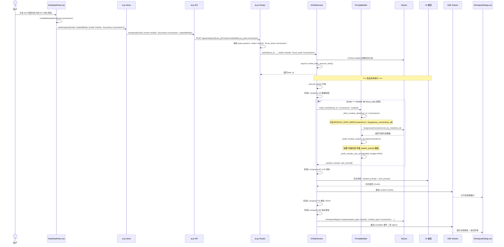
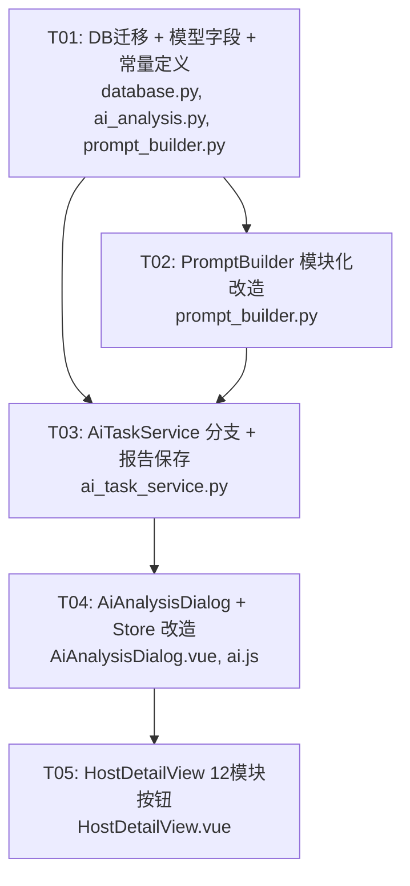

# 12 模块独立 AI 分析 — 系统架构设计 + 任务分解

> 架构师：高见远（Bob）
> 日期：2026-07-06

---

## Part A：系统设计

### 1. 实现方案 + 框架选型

#### 1.1 整体方案

**核心思路**：在现有 1 套全量分析链路上，通过新增 `mode="module"` + `focus_area="<module_name>"` 参数，在 `PromptBuilder` 层做数据过滤，实现 12 个模块各自只发送专属数据给 AI。

**不引入任何新框架/库**。所有改造在现有 FastAPI + SQLite + Vue3 + Element Plus + Vite 技术栈内完成。

#### 1.2 核心技术挑战与对策

| 挑战 | 对策 |
|------|------|
| `PromptBuilder._fetch_tiered_data()` 一次性拉取全部 12 类数据 | 新增 `_fetch_module_data()` 方法，按 `MODULE_DATA_MAP` 只拉对应子集 |
| 全量 system_prompt 模板（71 行通用模板）对单模块分析过于冗长 | 每个模块有专属精简 `system_prompt` 模板，聚焦该模块的研判逻辑 |
| 不同模块数据量差异大（进程树数据多、USB 记录少） | Token 预算分三档：重型 4000 / 中型 2000 / 轻型 1500 |
| 全量分析和模块分析可能互相覆盖报告 | `ai_analysis_reports` 新增 `analysis_type` + `module_type` 字段区分 |
| 前端弹窗标题和数据发送列表是硬编码的 | `AiAnalysisDialog` 接收 `mode`/`focusArea` props，动态渲染 |

#### 1.3 数据流总览

```
用户点击 tab 内 [AI 分析] 按钮
  → HostDetailView.handleModuleAiAnalyze('connections')
    → store.startAnalysis(hostId, maskedMode, { mode: 'module', focusArea: 'connections' })
      → POST /api/ai/analyze/{host_id}?mode=module&focus_area=connections
        → AiTaskService.submit(host_id, ..., mode='module', focus_area='connections')
          → AiTaskService._execute_task()
            → if mode == 'module':
                PromptBuilder.build_module(host_id, 'connections', masked)
                  → _fetch_module_data(host_id, 'connections')
                    → 只拉 suspicious_connections 数据
                  → _build_module_system_prompt('connections')
                    → 加载"可疑外连"专属 system_prompt 模板
                  → _build_module_user_prompt(..., budget=2000)
            → LLM 流式调用 → 解析 → 保存 AiAnalysisReport(
                analysis_type='module',
                module_type='connections'
              )
            → SSE 推送 → AiAnalysisDialog 展示
```

---

### 2. 文件列表

| 相对路径 | 改动性质 | 说明 |
|----------|----------|------|
| `backend/app/services/prompt_builder.py` | **改** | 新增 `MODULE_DATA_MAP`、`MODULE_SYSTEM_PROMPTS`、`TOKEN_BUDGET_MAP`、`build_module()`、`_fetch_module_data()`、`_build_module_system_prompt()`、`_build_module_user_prompt()` |
| `backend/app/services/ai_task_service.py` | **改** | `_execute_task()` 约 208-211 行新增 `mode == 'module'` 分支；`AiAnalysisReport.create()` 调用新增 `analysis_type`/`module_type` 参数 |
| `backend/app/models/ai_analysis.py` | **改** | `create()` 方法签名新增 `analysis_type`/`module_type` 参数；INSERT 语句新增对应列 |
| `backend/app/database.py` | **改** | `_alter_ai_analysis_reports_table()` 新增 `analysis_type`/`module_type` 两列 |
| `backend/app/api/ai.py` | **不改** | 已有 `mode`/`focus_area` 解析逻辑（第 318-321 行），无需改动 |
| `frontend/src/components/AiAnalysisDialog.vue` | **改** | 新增 `mode`/`focusArea` props；`dialogTitle` 动态化；`handleStartAnalysis()` 透传参数；数据发送列表按全量/模块动态展示 |
| `frontend/src/stores/ai.js` | **改** | `startAnalysis(hostId, maskedMode, options)` 签名扩展，透传 `{mode, focusArea}` 到 API |
| `frontend/src/views/HostDetailView.vue` | **改** | 12 个 tab-pane 各加工具栏区域 + `type="warning"` AI 分析按钮；新增 `handleModuleAiAnalyze(moduleType)` 方法 |

---

### 3. 数据结构和接口

#### 3.1 MODULE_DATA_MAP（模块名 → PromptBuilder 数据获取方式）

```python
# 位于 prompt_builder.py 顶部

MODULE_DATA_MAP: dict[str, list[str]] = {
    # 模块名            →  在 _fetch_module_data() 中需要拉取的数据键
    "profile":           ["host_basic", "analysis_result", "profile"],
    "process_list":      ["process_list"],           # 需新增进程树拉取
    "abnormal_processes":["abnormal_processes_all"],  # 不按严重度分层，全量给
    "connections":       ["suspicious_connections_all"],
    "persistence":       ["persistence_all"],
    "startup":           ["startup_items"],           # 需新增启动项拉取
    "ioc":               ["ioc_hits_all"],
    "timeline":          ["timeline_all"],
    "users":             ["users"],                   # 需新增用户账户拉取
    "services":          ["services"],                # 需新增系统服务拉取
    "usb":               ["usb_devices"],             # 需新增 USB 记录拉取
    "remote_control":    ["remote_tools"],            # 需新增远程工具拉取
}
```

**注意**：标记"需新增"的 6 个模块（进程树、启动项、用户账户、系统服务、USB 记录、远程工具），当前 `_fetch_tiered_data()` 未拉取这些数据。需在 `_fetch_module_data()` 中按需从对应 DB 表/API 拉取。这 6 个模块均属于**轻型数据**（Token 预算 1500）。

#### 3.2 Token 预算分档

```python
TOKEN_BUDGET_MAP: dict[str, int] = {
    # 重型（4000 tokens）— 数据量大、需要深层次分析
    "process_list":       4000,
    "abnormal_processes": 4000,
    "timeline":           4000,

    # 中型（2000 tokens）— 数据量中等
    "connections":  2000,
    "persistence":  2000,
    "ioc":          2000,
    "startup":      2000,
    "profile":      2000,

    # 轻型（1500 tokens）— 数据量小
    "users":         1500,
    "services":      1500,
    "usb":           1500,
    "remote_control":1500,
}
```

#### 3.3 数据库变更

在 `_alter_ai_analysis_reports_table()` 中新增两列：

```python
("analysis_type", "TEXT DEFAULT 'full'"),
("module_type",   "TEXT"),
```

- `analysis_type`: `'full'`（全量分析，默认值，兼容旧数据）或 `'module'`（模块分析）
- `module_type`: 当 `analysis_type='module'` 时记录模块名，如 `'connections'`

**ALTER 兼容性**：沿用现有 PRAGMA table_info 检测模式，保证可重复执行。

#### 3.4 AiAnalysisReport.create() 签名变更

在现有参数列表末尾新增：

```python
analysis_type: str = "full",
module_type: Optional[str] = None,
```

INSERT 语句新增对应列。

#### 3.5 API 不变

`POST /api/ai/analyze/{host_id}?mode=module&focus_area=connections`

现有路由（`ai.py` 第 297 行）已支持解析 `mode` 和 `focus_area` query params，无需新增路由。

---

### 4. 程序调用流程（Mermaid 时序图）



---

### 5. 待明确事项

| # | 事项 | 影响范围 | 建议 |
|---|------|----------|------|
| 1 | **进程树数据源**：`_fetch_tiered_data()` 当前不拉取进程树。`process_list` 模块需要从哪个表/API 获取进程树数据？ | `_fetch_module_data('process_list')` | 复用 `analysisApi.getProcessTree(hostId)` 的后端对应数据源，需确认是 DB 表还是 JSON 文件 |
| 2 | **用户/服务/USB/远程工具数据源**：这 4 个模块当前在 `_fetch_tiered_data()` 中也未拉取。需确认数据存储方式（DB 表？JSON 字段？） | `_fetch_module_data()` 的 4 个轻型模块 | 建议先确认 `analysisApi.getUsers()` / `getServices()` / `getUsb()` / `getRemoteControl()` 的后端实现 |
| 3 | **模块分析与全量分析的报告展示切换**：`AiAnalysisReport.get_by_host()` 取 `is_latest=1` 的记录，若先做全量再做模块分析，`is_latest` 会被模块分析覆盖，导致全量报告不再通过默认接口返回 | `AiAnalysisReport.get_by_host()` | 建议 `get_by_host()` 增加可选参数 `analysis_type`，或前端报告列表区分全量/模块 |
| 4 | **模块专属 system_prompt 模板内容**：需要安全分析师提供每个模块的 prompt 模板措辞 | `_build_module_system_prompt()` | 架构师先提供 12 个模板的通用骨架，待安全专家审查 |

---

## Part B：任务分解

### 6. 依赖包列表

**无需新增任何 pip/npm 包**。所有改造在现有依赖内完成。

---

### 7. 任务列表（共 5 个任务，按依赖顺序）

#### T01：数据库迁移 + 模型字段 + 常量定义

- **优先级**：P0
- **依赖**：无
- **涉及文件**：
  - `backend/app/database.py`（改）
  - `backend/app/models/ai_analysis.py`（改）
  - `backend/app/services/prompt_builder.py`（改 — 仅新增常量）
- **任务描述**：
  1. 在 `database.py` 的 `_alter_ai_analysis_reports_table()` 中新增 `analysis_type TEXT DEFAULT 'full'` 和 `module_type TEXT` 两列（PRAGMA 探测，可重复执行）
  2. 在 `ai_analysis.py` 的 `create()` 方法签名中新增 `analysis_type: str = "full"` 和 `module_type: Optional[str] = None` 参数，INSERT 语句新增对应列
  3. 在 `prompt_builder.py` 顶部新增三个常量字典：`MODULE_DATA_MAP`、`TOKEN_BUDGET_MAP`、`MODULE_SYSTEM_PROMPTS`（12 个模块的 prompt 模板骨架）

#### T02：PromptBuilder 模块化改造（build_module + _fetch_module_data + _build_module_system_prompt）

- **优先级**：P0
- **依赖**：T01
- **涉及文件**：
  - `backend/app/services/prompt_builder.py`（改）
- **任务描述**：
  1. 实现 `build_module(host_id, module_type, masked)` 静态方法：入口同 `build()`，参数精简（无 `include_knowledge`）
  2. 实现 `_fetch_module_data(host_id, module_type)`：按 `MODULE_DATA_MAP[module_type]` 只拉取对应数据键，不拉全量
  3. 实现 `_build_module_system_prompt(module_type)`：从 `MODULE_SYSTEM_PROMPTS` 取专属模板
  4. 实现 `_build_module_user_prompt(host, module_data, budget, masked)`：按 `TOKEN_BUDGET_MAP[module_type]` 预算组装数据
  5. 对于 6 个需新增数据源的模块（process_list, startup, users, services, usb, remote_control），在 `_fetch_module_data()` 中实现数据拉取逻辑（从对应 DB 表或现有 API 数据源）

#### T03：AiTaskService._execute_task() 分支 + 报告保存透传

- **优先级**：P0
- **依赖**：T01, T02
- **涉及文件**：
  - `backend/app/services/ai_task_service.py`（改）
- **任务描述**：
  1. 在 `_execute_task()` 约 211 行（`PromptBuilder.build()` 调用处），新增 `if mode == "module" and focus_area:` 分支，调用 `PromptBuilder.build_module(host_id, focus_area, masked)` 替代 `build()`
  2. 在约 370 行 `AiAnalysisReport.create()` 调用处，新增 `analysis_type` 和 `module_type` 参数透传：
     - 当 `mode == "module"`：`analysis_type="module"`, `module_type=focus_area`
     - 否则：`analysis_type="full"`, `module_type=None`（兼容旧行为）
  3. 模块分析场景跳过 knowledge_section 注入（`include_knowledge=False`），避免无关知识干扰

#### T04：前端 AiAnalysisDialog + ai.js Store 参数化改造

- **优先级**：P0
- **依赖**：T03
- **涉及文件**：
  - `frontend/src/components/AiAnalysisDialog.vue`（改）
  - `frontend/src/stores/ai.js`（改）
- **任务描述**：
  1. **AiAnalysisDialog.vue**：
     - 新增 props：`mode`（默认 `'standard'`）、`focusArea`（默认 `null`）
     - `dialogTitle` computed：当 `mode === 'module'` 时显示 `AI 分析 — ${MODULE_NAME_MAP[focusArea]}`
     - `show()` 方法扩展签名：`show(hostId, hostName = '', mode = 'standard', focusArea = null)`
     - 数据发送列表（`<ul>` 区域）：`mode === 'module'` 时只显示当前模块对应的数据项
     - `handleStartAnalysis()` 中透传 `mode` 和 `focusArea` 到 store
  2. **ai.js Store**：
     - `startAnalysis(hostId, maskedMode, options = {})` 签名扩展，解构 `{ mode, focusArea }`
     - 透传到 `aiAnalyze(hostId, { maskedMode, profileId, mode, focusArea })`

#### T05：HostDetailView 12 模块 AI 分析按钮

- **优先级**：P0
- **依赖**：T04
- **涉及文件**：
  - `frontend/src/views/HostDetailView.vue`（改）
- **任务描述**：
  1. 定义 `MODULE_TAB_MAP`：tab name → module_type 的映射常量
  2. 在每个 `<el-tab-pane>` 内部顶部添加工具栏区域（`class="tab-toolbar"`），内含：
     - 当前模块数据统计文本（如"共 5 条可疑外连"）
     - `<el-button type="warning" @click="handleModuleAiAnalyze('connections')">🤖 AI 分析</el-button>`
  3. 实现 `handleModuleAiAnalyze(moduleType)` 方法：
     - 调用 `aiDialogRef.value?.show(Number(hostId), host.value?.hostname || '', 'module', moduleType)`
  4. 按钮禁用逻辑：与现有全局 AI 分析按钮一致（`aiEnabled` 为 false 且 host status 非 pending）
  5. 为工具栏区域和按钮添加适当的 CSS 样式（flex-between 布局，按钮右对齐）

---

### 8. 共享知识（跨文件约定）

#### 8.1 模块名常量

所有地方使用以下统一模块名（与 tab name 一致）：

```python
VALID_MODULE_TYPES = [
    "profile",           # 主机画像
    "process_list",      # 进程树
    "abnormal_processes",# 异常进程
    "connections",       # 可疑外连
    "persistence",       # 持久化痕迹
    "startup",           # 可疑启动项
    "ioc",               # IOC 命中
    "timeline",          # 时间线
    "users",             # 用户账户
    "services",          # 系统服务
    "usb",               # USB 记录
    "remote_control",    # 远程工具
]
```

#### 8.2 Token 预算分档规则

| 档位 | Token 数 | 适用模块 |
|------|----------|----------|
| 重型 | 4000 | process_list, abnormal_processes, timeline |
| 中型 | 2000 | connections, persistence, ioc, startup, profile |
| 轻型 | 1500 | users, services, usb, remote_control |

**预算计算**：`module_budget = TOKEN_BUDGET_MAP[module_type]`，其中 system_prompt 固定消耗约 300-500 tokens，剩余为 user_prompt 预算。

#### 8.3 system_prompt 模板结构

每个模块的 system_prompt 遵循统一结构：

```
你是一个专业的网络安全应急响应分析专家。
请针对【{模块中文名}】数据进行专项分析。

## 分析要求
1. {模块专属分析要点1}
2. {模块专属分析要点2}
...

## 输出格式
严格按以下 JSON 格式输出：
{...精简 JSON Schema，只包含与当前模块相关的字段...}
```

#### 8.4 前端模块中文名映射

```javascript
// 位于 HostDetailView.vue 或共享常量文件
const MODULE_NAME_MAP = {
  profile: '主机画像',
  process_list: '进程树',
  abnormal_processes: '异常进程',
  connections: '可疑外连',
  persistence: '持久化痕迹',
  startup: '可疑启动项',
  ioc: 'IOC 命中',
  timeline: '时间线',
  users: '用户账户',
  services: '系统服务',
  usb: 'USB 记录',
  remote_control: '远程工具',
}
```

#### 8.5 模块分析数据发送列表（前端 AiAnalysisDialog 动态展示）

当 `mode === 'module'` 时，确认页只展示单条数据项，如：
- 可疑外连 → "可疑外连记录（含远程地址、端口、协议、关联进程）"

当 `mode === 'standard'`（全量）时，展示现有全部 5 项列表。

---

### 9. 任务依赖图



**依赖说明**：
- T01 是所有后端改造的前置（常量定义 + 模型字段）
- T02 和 T03 可部分并行（T03 的 PromptBuilder 调用依赖 T02 的方法签名）
- T04 依赖 T03 完成（API 链路贯通后才能测试前端交互）
- T05 依赖 T04（弹窗和 Store 接口稳定后才能接入按钮）

---

> **文档结束** — 提交给工程师（Eve）实现。
