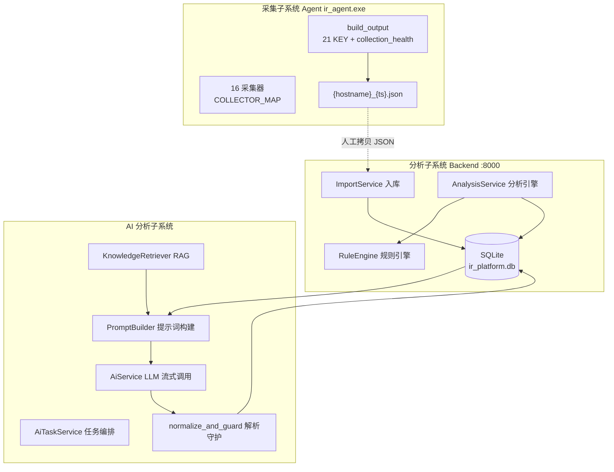
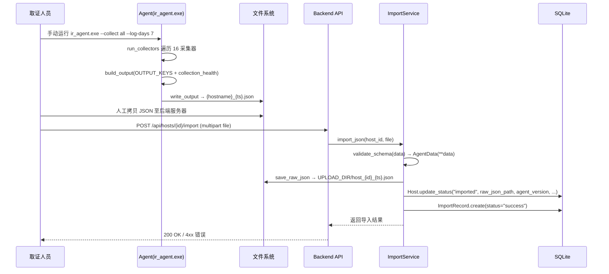
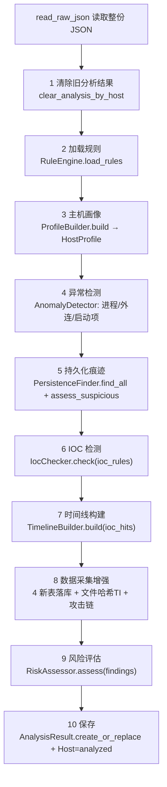
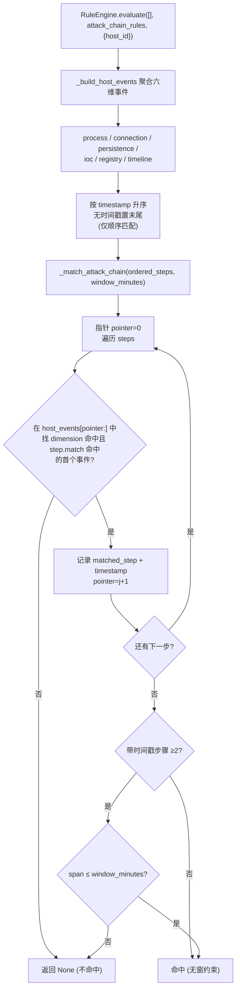
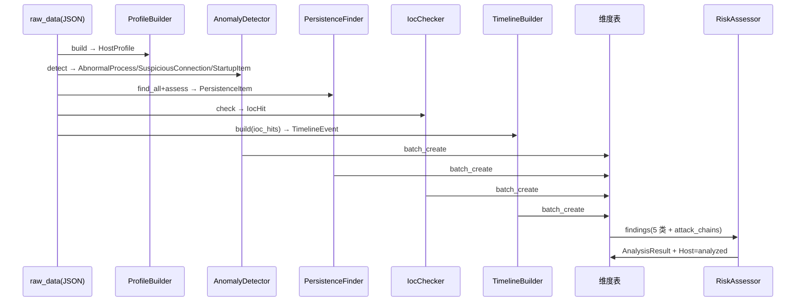
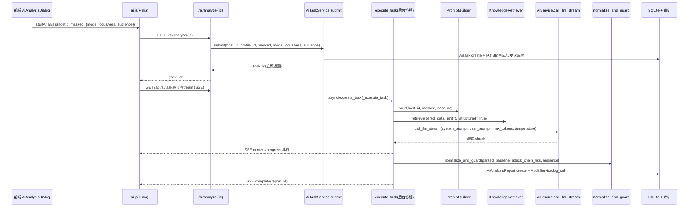
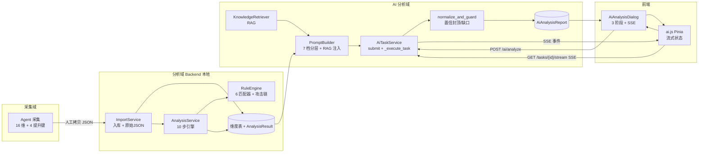

# IR Platform（应急响应平台）技术交底文档

> **文档生成说明：基于 2026-07-11 代码走查，覆盖采集/分析/AI 三域**

本文档面向具备安全研发与逆向基础的技术人员，目标是在**不阅读源码**的前提下，使读者完整理解 IR Platform 的：
（1）数据采集流程、（2）本地数据分析逻辑、（3）AI 分析模块的完整技术实现、（4）模块间交互与端到端数据流。
所有文件路径、函数名、参数名、默认值均来源于对 `/agent`、`/backend`、`/frontend` 三端源码的逐文件走查，与代码一致；凡涉及密钥/Token 的代码片段均已做脱敏处理。

---

## 0. 文档说明与系统概览

### 0.1 系统定位与部署形态

IR Platform 是一套**离线取证 + 本地规则分析 + 云端 LLM 辅助研判**的应急响应平台，由三个相互独立、通过「文件拷贝 + HTTP API」串联的子系统构成：

| 子系统 | 代码位置 | 形态 | 运行方式 | 对外依赖 |
| --- | --- | --- | --- | --- |
| **采集子系统（Agent）** | `agent/` | PyInstaller 单文件可执行 `ir_agent.exe` | 现场**一次性手动**运行，无守护进程、无心跳、无主动上报 | 无（纯本地采集） |
| **分析子系统（Backend）** | `backend/` | FastAPI + uvicorn（明文端口 8000，无 TLS） | 常驻服务 | SQLite（`backend/data/ir_platform.db`）、本地规则库 |
| **AI 分析子系统** | `backend/`（AI 部分） | 同 Backend 进程内的异步任务编排 | 常驻，按需触发 | 外部 OpenAI 兼容 LLM API、知识库 RAG（本地 embedding） |

**关键部署事实（交底重点）：**
- Agent 与 Backend **不存在实时通信链路**。Agent 仅产出 JSON 文件，由人工拷贝至服务器后通过 `POST /api/hosts/{id}/import` 上传。
- Backend 默认**明文 HTTP（端口 8000）**、JWT HS256 鉴权；AI 调用的 `api_key` 在 `AiConfigProfile` 中以 **Fernet 对称加密**落库，运行时解密，原文不在任何日志/接口明文返回。
- 本地分析（规则引擎）与 AI 分析（LLM）是**两条独立的触发链路**：前者由 `POST /api/hosts/{id}/analyze` 同步驱动，后者由 `POST /ai/analyze/{id}` 异步 SSE 流式驱动。

### 0.2 三子系统边界与数据流（总览）



### 0.3 文档阅读索引

| 章节 | 覆盖源码 | 核心对象 |
| --- | --- | --- |
| 1 数据采集 | `agent/agent.py`、`agent/collectors/*`、`agent/utils/output.py`、`backend/app/api/import_data.py`、`backend/app/services/import_service.py` | COLLECTOR_MAP、build_output、ImportService、AgentData |
| 2 数据分析 | `backend/app/services/analysis_service.py`、`backend/app/analysis/*`、`backend/app/rules/rule_engine.py` | AnalysisService、AnomalyDetector、IocChecker、PersistenceFinder、RiskAssessor、TimelineBuilder、ProcessTreeBuilder、RuleEngine |
| 3 AI 分析 | `backend/app/api/ai.py`、`backend/app/services/ai_task_service.py`、`prompt_builder.py`、`ai_service.py`、`ai_parse_guard.py`、`input_quality_service.py`、`knowledge_retriever.py`、`explainability_service.py` | AiTaskService、PromptBuilder、normalize_and_guard、RAG |
| 4 模块交互 | 上述全部 + `frontend/src/components/AiAnalysisDialog.vue`、`frontend/src/stores/ai.js` | SSE、Pinia store、端到端链路 |
| 5 风险交底 | 贯穿三域 | 脱敏、密钥、字段命名坑、攻击链窗口、置信封顶 |

---

## 1. 数据采集部分

### 1.1 采集器架构与运行模型

Agent 入口为 `agent/agent.py`，经 PyInstaller 打包为单文件 `ir_agent.exe`。其运行模型为**一次性取证**：

- **无调度、无心跳、无主动上报**：运行结束即退出，不产生常驻进程；唯一外部产物是落盘的 JSON 文件。
- 执行流程：`main()` → 构建 `metadata` → 调用 `run_collectors()` 遍历 `COLLECTOR_MAP` → 调用 `build_output()` 组装 → `write_output()` 写文件 → `print_summary()` 控制台摘要。

**CLI 参数表（来自 `parse_args`）**

| 参数 | 缩写 | 默认值 | 说明 |
| --- | --- | --- | --- |
| `--output` | `-o` | `{hostname}_{timestamp}.json` | 输出 JSON 路径，文件名含主机名与时间戳 |
| `--collect` | `-c` | `"all"` | 采集维度名称，映射 `COLLECTOR_MAP` 的 key；支持单维或列表 |
| `--log-days` | — | `7` | 采集最近 N 天的日志/事件数据，透传至各采集器 |
| `--verbose` | `-v` | 关闭 | 详细日志 |
| `--log-file` | — | 无 | 日志文件路径（否则仅控制台） |

`metadata` 结构（写入 JSON 顶层 `metadata`）：

```json
{
  "agent_version": "1.0.0",
  "collection_time": "2026-07-11T10:00:00",
  "platform": "windows",
  "hostname": "WIN-XXXX",
  "operator": "agent",
  "log_days": 7
}
```

### 1.2 16 个采集维度

`COLLECTOR_MAP` 注册了 16 个采集器，每个键对应一个 `collectors/` 下的类：

| # | key | 采集器类 | 采集内容 |
| --- | --- | --- | --- |
| 1 | `system_info` | SystemInfoCollector | OS 版本、CPU/内存/磁盘、补丁 |
| 2 | `users` | UsersCollector | 用户账户、组成员、特权 |
| 3 | `processes` | ProcessesCollector | 进程列表（pid/ppid/路径/命令行/用户/线程） |
| 4 | `services` | ServicesCollector | 系统服务 |
| 5 | `startup_items` | StartupItemsCollector | 启动项 |
| 6 | `network` | NetworkCollector | 连接、网卡、DNS 缓存、hosts、路由 |
| 7 | `files` | FilesCollector | 关键文件/目录哈希 |
| 8 | `registry` | RegistryCollector | 注册表取证键 |
| 9 | `logs` | LogsCollector | 系统/安全/应用日志 |
| 10 | `security` | SecurityCollector | 杀软、防火墙、安全策略 |
| 11 | `browser` | BrowserCollector | 浏览器历史/扩展 |
| 12 | `usb` | UsbCollector | USB 接入记录 |
| 13 | `remote_control` | RemoteControlCollector | 远程控制工具痕迹 |
| 14 | `persistence` | PersistenceCollector | 持久化（计划任务/服务/WMI/启动项/cron/systemd） |
| 15 | `ioc` | IocCollector | 本地 IOC 匹配（matched_items） |
| 16 | `timeline` | TimelineCollector | 综合时间线 |

`run_collectors()` 对每个采集器：`is_supported()` 判定平台支持，不支持或异常时返回 `{"error": ...}`，`build_output()` 据此降级为空结构，保证单个采集器失败不影响整体。

### 1.3 输出 JSON Schema（Agent → 后端契约）

`agent/utils/output.py` 定义了 **`OUTPUT_KEYS`（21 个固定顶层键）**，且 `build_output()` 额外注入 `collection_health` 作为第 22 个顶层键。更重要的是，它把 4 个**深层嵌套字段提升为顶层键（promotion）**，这是后端诸多表直接依赖的契约：

```json
{
  "metadata": { },
  "system_info": { }, "users": [], "processes": [], "services": [],
  "startup_items": [], "network": { }, "files": { }, "registry": { },
  "logs": { }, "security": { }, "browser": { }, "usb": [],
  "remote_control": [], "persistence": { }, "ioc": { }, "timeline": [],
  "network_connections": [],   "file_hashes": [],   "wmi_subscriptions": [],   "registry_keys": [],
  "collection_health": { }
}
```

**4 个「被提升的顶层键」（promotion 来源）：**

| 顶层键 | 来源采集器内部字段 | 提升逻辑 |
| --- | --- | --- |
| `network_connections` | `network` 采集器 `_build_network_connections` 扁平化结果（local_address→`local_addr`、remote_address→`remote_addr`） | `build_output` 遍历 `network` 结果内部提取 |
| `file_hashes` | `files` 采集器 | 同上 |
| `wmi_subscriptions` | `persistence` 采集器（`wmi_subscriptions` 列表，含 `__EventFilter`/`__EventConsumer`/`__FilterToConsumerBinding`，`risk_level:"medium"`） | 同上 |
| `registry_keys` | `registry` 采集器 | 同上 |

> **交底坑点（字段命名）：** `processes` 采集器输出使用 `local_address`/`remote_address`；而 `network` 采集器被提升出的 `network_connections` 使用 `local_addr`/`remote_addr`。后端 `NetworkConnection` 表、时间线 `TimelineBuilder`、攻击链 `_build_host_events` 统一以 **`local_addr`/`remote_addr`** 口径读取。这是一个易混淆点，写入自定义采集器时务必对齐。

### 1.4 采集 → 上报 → 入库（完整链路）



**关键实现细节（`import_service.py`）：**
- `validate_schema(data)`：直接 `AgentData(**data)`（Pydantic 模型），失败抛 `ValueError` → 创建 `status="failed"` 的 `ImportRecord`。
- `MAX_FILE_SIZE_MB` 大小校验（超限直接拒绝）。
- `json.loads` 解析失败 → 创建 failed `ImportRecord`，不落库。
- `read_raw_json(host_id)`：后续分析阶段读取整份原始 JSON 的唯一入口（`AnalysisService.analyze` 第 0 步）。
- `POST /api/hosts/{host_id}/import-records`（GET）可回溯该主机的导入历史。

### 1.5 入库配置与状态机

| 配置/状态 | 来源 | 值/语义 |
| --- | --- | --- |
| `MAX_FILE_SIZE_MB` | `settings` | JSON 上传大小上限 |
| `UPLOAD_DIR` | `settings` | 原始 JSON 落盘目录；命名 `host_{id}_{ts}.json` |
| Host 状态机 | `Host.update_status` | `pending` → `imported` → `analyzed` |
| 导入前置条件 | `analyze` 校验 | 仅 `imported`/`analyzed` 状态可触发本地分析 |

---

## 2. 数据分析部分

### 2.1 分析主流程（AnalysisService.analyze，10 步）

本地分析由 `POST /api/hosts/{host_id}/analyze` 触发，调用 `AnalysisService.analyze()`（要求 Host 状态 ∈ `imported`/`analyzed`）。其内部严格按 10 步执行：



**逐步骤说明：**

| 步 | 入口/产出 | 落库动作 | 关键逻辑 |
| --- | --- | --- | --- |
| 1 | `clear_analysis_by_host` | 删除该主机旧维度表 | 保证重分析幂等 |
| 2 | `RuleEngine.load_rules()` | — | 加载全部启用规则（含 ioc/attack_chain） |
| 3 | `ProfileBuilder.build(raw_data)` | `HostProfile.create_or_replace` | cpu/memory/disk/network/software/users/security/system_summary 均 JSON 字符串化存储 |
| 4 | `AnomalyDetector.detect_processes/connections/startup_items` | `AbnormalProcess`/`SuspiciousConnection`/`SuspiciousStartupItem` 各自 `batch_create` | 含白名单过滤（`WhitelistService`） |
| 5 | `PersistenceFinder.find_all` + `assess_suspicious` | `PersistenceItem.batch_create` | WMI 类型自动 `critical` |
| 6 | `IocChecker.check(raw_data, ioc_rules)` | `IocHit.batch_create` | ioc_rules = category=="ioc" |
| 7 | `TimelineBuilder.build(raw_data, ioc_hits)` | `TimelineEvent.batch_create` | 注入 MITRE 战术阶段 |
| 8 | 提取 `network_connections`/`file_hashes`/`wmi_subscriptions`/`registry_keys` 四表落库；文件哈希 TI 匹配（`IocHit.append`）；攻击链检测 | `NetworkConnection`/`FileHash`/`WmiSubscription`/`RegistryKey` `batch_create` | **注意 `IocHit.append` 而非 `batch_create`，避免清空 step6 命中** |
| 9 | `RiskAssessor.assess(findings)` | — | 攻击链写入 `details.attack_chains`（不影响分数口径） |
| 10 | `AnalysisResult.create_or_replace` + `Host.update_status("analyzed")` | 分析结果 + 主机状态 | — |

> **交底重点（step 8 的双写陷阱）：** 文件哈希 TI 命中与攻击链命中均向 `IocHit` 追加，但**必须使用 `IocHit.append`（仅 INSERT）**。若误用 `IocHit.batch_create`（DELETE + INSERT），会清空 step 6 已写入的常规 IOC 命中。源码中已有注释明确禁止此处用 `batch_create`。

### 2.2 各分析子模块职责

| 子模块 | 文件 | 职责 | 核心输出 |
| --- | --- | --- | --- |
| ProfileBuilder | `analysis/profile_builder.py` | 聚合系统画像 | 8 个字符串化字段 |
| AnomalyDetector | `analysis/anomaly_detector.py` | 异常进程/外连/启动项检测 | `SEVERITY_SCORES`: critical=40/high=25/medium=10/low=5/info=2 |
| IocChecker | `analysis/ioc_checker.py` | 本地 IOC 命中 | 从 `raw_data["ioc"]["matched_items"]` 校验 + 网络/进程/文件哈希规则 |
| PersistenceFinder | `analysis/persistence_finder.py` | 持久化痕迹聚合与可疑判定 | type_mapping 统一 8 类持久化 |
| RiskAssessor | `analysis/risk_assessor.py` | 风险评分汇总 | `SEVERITY_WEIGHTS`: critical=25/high=15/medium=8/low=3/info=0；级别 (80→critical),(60→high),(40→medium),(20→low) |
| TimelineBuilder | `analysis/timeline_builder.py` | 时间线归一与 MITRE 映射 | 28 条 `MitreTacticMapper.RULES`；8 种时间格式归一为 `YYYY-MM-DDTHH:mm:ss` |
| ProcessTreeBuilder | `analysis/process_tree_builder.py` | 进程树 | ECharts 树；孤儿进程 `_is_orphan`；visited 防环 |

**AnomalyDetector 累积评分（`_apply_accumulated_scoring`）：** 同一 pid 的多条命中合并，`risk_score` 累加（下限 100），取最高严重度，`attack_path` 由 `process_chain` 或 `父进程→子进程名` 推导。输出含 `matched_rules`、`details{user,start_time,threads}`。

**RiskAssessor 评分：** 5 类（异常进程/可疑外连/可疑启动项/可疑持久化/IOC 命中）各自 `_calculate_category_score`（每类下限 100），总分 `min(Σ, 100)`，再映射级别。

### 2.3 规则引擎（RuleEngine）

#### 2.3.1 六类单条件匹配器

`RuleEngine.evaluate()` 先把规则分为**逐条规则**（`rule_type != "attack_chain"`）与**攻击链规则**（主机级，单独处理）。逐条规则经 `match_rule()` 分发到下列匹配器：

| 匹配器 | 条件字段 | 语义 | 备注 |
| --- | --- | --- | --- |
| `regex` | `field`/`pattern`/`flags`(`ignorecase`\|`multiline`) | 正则搜索 | 编译结果 `_REGEX_CACHE` 缓存 |
| `list` | `field`/`values`/`match_mode`(`exact`/`contains`/`startswith`) | 黑名单 | `FIELD_TO_IOC_TYPE` 动态并入 iocs 表指标（如 `remote_address→ip`） |
| `threshold` | `field`/`operator`(`>`/`>=`/`<`/`<=`/`==`/`!=`)/`value` | 阈值比较 | float 化后比较 |
| `exists` | `field` | 字段非空存在 | 空串/空列表视为不存在 |
| `composite` | `logic`(`AND`/`OR`)/`sub_rules[]` | 组合递归 | 子规则可任意嵌套，类型含 regex/list/threshold/behavior/composite/exists |
| `behavior` | `pattern` ∈ `BEHAVIOR_PATTERNS` | 行为语义 | **20 种白名单模式**（orphan_process、suspicious_parent、credential_dump、ransomware_behavior、lateral_movement、persistence_wmi…），非法值写入前即被拒 |

**全局常量：**
- `_SEVERITY_RANK = {low:1, medium:2, high:3, critical:4}`
- `_C2_FRAMEWORK_SIGNATURES`：**32 条** C2 框架命令行特征（cobaltstrike/metasploit/empire/sliver/havoc/…/smokeloader）
- `BEHAVIOR_PATTERNS`：20 种行为模式集合（导入/创建规则时校验）
- 动态 IOC 引用：`global_context["iocs_by_type"]` 在 `evaluate` 入口一次性加载（非逐条），保证增删即时生效；`settings.ENABLE_THREAT_INTEL_ENRICHMENT` 开启才加载威胁情报平台回灌（`threat_level_by_value`）。

#### 2.3.2 攻击链：跨维度贪心顺序匹配

攻击链是**主机级**关联规则，需各维度取证数据已落库后，由 `_build_host_events()` 按 `host_id` 下钻聚合为统一时间线事件，再经 `_match_attack_chain()` 做**贪心顺序 + 时间窗**判定。



**攻击链参数表：**

| 参数 | 位置 | 默认值 | 约束 |
| --- | --- | --- | --- |
| `ordered_steps` | `condition` | 必填，空则 `None` | 每步含 `dimension` + `match`（复用 6 匹配器） |
| `window_minutes` | `condition` | **60** | 上限 **1440**（与前端/设计校验一致）；`max(1, min(v,1440))` 防御 |
| 事件维度 | `_build_host_events` | — | process/connection/persistence/ioc/registry/timeline |
| 时间戳来源 | 同上 | — | timeline 可信；registry 用 `last_write_time`→`collected_at`；其余维度无时间戳（仅顺序匹配） |
| 命中后果 | `evaluate` | — | `severity="critical"`，`reason` 含步骤明细；写入 `details.attack_chains` |

> 命中后在 `evaluate` 中产生一条 `{ "_attack_chain": True, "attack_chain_steps": [...] }` 匹配项，`reason` 以「步骤N:维度 摘要」链路拼接。

### 2.4 分析引擎内部数据流（维度表视角）



### 2.5 分析 API 与衍生端点

`backend/app/api/analysis.py` 暴露：`POST /hosts/{id}/analyze`（主触发）、`GET /hosts/{id}/analysis|profile|timeline|ioc-hits|persistence|suspicious-connections|abnormal-processes|process-tree|startup-items|users|services|usb|remote-control|network-connections|file-hashes|wmi-subscriptions|registry-keys`、`POST .../suspicious-connections/enrich` 与 `/network-connections/enrich`（威胁情报回灌）、`PATCH /analysis/timeline/{event_id}`（处置状态 V3-2）、`GET /analysis/timeline/compare`（≤5 主机 V3-4）、CSV/PDF 导出（V3-5）。

---

## 3. AI 分析部分

### 3.1 总体定位与两套触发链路

AI 分析子系统由 `backend/app/api/ai.py` + `backend/app/services/ai_task_service.py` + `prompt_builder.py` + `ai_service.py` + `ai_parse_guard.py` 等构成。它**不重复本地分析**，而是消费本地分析已落库的维度数据，经 LLM 产出作战化研判报告。

与本地分析（`/api/hosts/.../analyze` 同步）不同，AI 分析是**异步 + SSE 流式**：
- 触发：`POST /ai/analyze/{host_id}` → `AiTaskService.submit()`（参数 `masked_mode` 默认 1、`mode` 默认 `"standard"`，校验于 `AIMode.values()`）。
- 编排：`submit` 立即创建任务并返回 `task_id`，随后 `asyncio.create_task(_execute_task)` 后台执行。
- 消费：前端经 `GET /api/ai/tasks/{task_id}/stream`（SSE）逐步接收 `content`/`progress`/`complete`/`done` 事件。

**AI 基础设施事实：**
- LLM 接入：OpenAI 兼容 API，默认模型 `gpt-4o`，由 `AiConfigProfile` 多配置管理（`api_base_url`/`model_name`/`max_tokens`/`temperature`），`api_key` **Fernet 加密**落库。
- 知识库 RAG：embedding 模型 `all-MiniLM-L6-v2`（仅 RAG 检索用，不影响主分析）。
- 脱敏模式（`masked_mode`）：在 `PromptBuilder` 构建 user prompt 时对 IP/域名等敏感字段脱敏。

### 3.2 AI 分析调用链路（端到端）



### 3.3 13 步任务执行时序（`_execute_task`）

后台协程 `_execute_task` 是 AI 分析的核心，按 13 步推进，并伴随进度百分比与 SSE 阶段事件（`assembling`→`building`→`calling`→`parsing`→`saving`）。

```mermaid
gantt
    title AI 分析任务 _execute_task 13 步时序
    dateFormat  X
    axisFormat  %s
    section 进度
    1.校验取消/取任务与主机      :0, 1
    2.解析 AI Profile(激活/指定)  :1, 2
    3.Stage1 组装数据(10%)         :2, 3
    4.Stage2 构建提示词(20%)       :3, 4
    5.Stage3 调用 LLM(40%)         :4, 7
    6.流式 chunk 推送队列           :7, 8
    7.知识建议→KnowledgeDraft      :8, 9
    8.Token 统计(usage/tiktoken/估算):9, 10
    9.overview/remediation 分支    :10, 11
    10.standard 分支:取数/质量/RAG/证据 :11, 12
    11.保存 AiAnalysisReport         :12, 13
    12.审计日志(90%)               :13, 14
    13.完成100% + finally 清理      :14, 15
```



**13 步要点：**

| 步 | 动作 | 关键代码/产物 |
| --- | --- | --- |
| 1 | 检查取消标志；`AiTask.get_by_id`；`Host.get_by_id` | 取消 → `_fail_task(CANCELLED)` |
| 2 | 解析 Profile（`req_profile_id` 或 `AiConfigProfile.get_active()`） | 默认 `model_name="gpt-4o"` |
| 3 | Stage1 组装数据（progress=10，`assembling`） | 准备 host/profile/baseline/attack_chain_hits |
| 4 | Stage2 构建提示词（progress=20，`building`） | `PromptBuilder.build/module/overview/remediation`；读 `AgentBaseline.get_latest_by_host`（基线降噪）、`RuleEngine.get_attack_chain_hits`（攻击链叙述，不重判） |
| 5 | Stage3 调用 LLM（progress=40，`calling`） | `AiService.decrypt_api_key` 解密 → `call_llm_stream(api_base_url, api_key, model, system_prompt, user_prompt, max_tokens, temperature)` |
| 6 | 流式接收 chunk，逐个 `content` 事件推入队列 | `_push_event(task_id, "content", {...})` |
| 7 | 解析 JSON 后提取 `knowledge_suggestions` → `KnowledgeDraft.create` | 草稿落库，后续可转知识库 |
| 8 | Token 统计：`usage_info` 优先；缺失则 `tiktoken(cl100k_base)` 估算；再缺失则「字符数//3」估算 | 写入 `prompt_tokens`/`completion_tokens`/`total_tokens` |
| 9 | `mode ∈ {overview, remediation}` 分支：`normalize_and_guard` → 保存专属报告 | 含 `story_line`/`key_events` 或 `remediation_scripts` |
| 10 | `standard/module/deep_dive` 分支：`_fetch_tiered_data` → `InputQualityService.evaluate` → `KnowledgeRetriever.retrieve` → `_cross_validate_knowledge` → `ExplainabilityService.build_evidence_trace` → `normalize_*`（含 AI key_events 与原始 timeline 关联 `source_event_id`）→ `normalize_and_guard` | 主报告全字段产出 |
| 11 | 保存 `AiAnalysisReport.create`（risk/threat/timeline/recommendations/raw_response/audience/mitre_attack/attack_chain_hits/rare_high_signals/source_event_id 等） | `analysis_type`=`full`/`module`/`overview`/`remediation` |
| 12 | `AuditService.log_call`（progress=90，`saving` 后） | 记录模型/Token/时延/脱敏/原文 |
| 13 | `update_status(COMPLETED, 100)` + `complete` 事件；`finally` 推送 `done` 并 `asyncio.sleep(1.0)` 后 `cleanup_task` | 确保 SSE 消费者读到 done |

**取消机制：** `POST /api/ai/tasks/{id}/cancel` → `AiTask.cancel` 置 `cancel_event`，`_execute_task` 在各阶段前轮询该标志，命中即 `_fail_task(CANCELLED)` 并 `return`，不写报告。前端 `ai.js` 同时 `AbortController.abort()` SSE 连接。

### 3.4 提示词构建（PromptBuilder）

**分层数据（7 档优先级，预算超限截断）：**

| 档 | 键（TIER_*_KEYS） | 含义 |
| --- | --- | --- |
| TIER_1 | `host_basic` | 主机基础信息 |
| TIER_2 | `analysis_result` | 本地风险结论 |
| TIER_3 | `ioc_hits_high` / `abnormal_processes_high` / `suspicious_connections_high` | 高危证据 |
| TIER_4 | `*_medium` | 中危证据 |
| TIER_5 | `timeline_high` / `timeline_medium` | 高危/中危时间线 |
| TIER_6 | `persistence_suspicious` | 可疑持久化 |
| TIER_7 | `profile` / `*_low` / `persistence_all` | 低危与全量兜底 |

`_fetch_tiered_data()` 从各维度表拉取并按严重度分类，额外补入 `network_connections_all[:200]`、`wmi_subscriptions_all`、`startup_items`（v1.3.1 补强，避免 AI 误判缺失）。

**Token 预算：** `system_tokens = _count_tokens(system_prompt)`；`remaining = settings.AI_INPUT_BUDGET - system_tokens - 200`；user prompt 按 TIER 优先级填充，超出则截断；知识库段仅在 `user_tokens + knowledge_tokens ≤ AI_INPUT_BUDGET` 时注入。

**系统提示词契约（`SYSTEM_PROMPT_TEMPLATE` + `OUTPUT_JSON_SCHEMA`）：**

`OUTPUT_JSON_SCHEMA = {"type":"json_object","description":"AI 分析结果 JSON"}`。模型须输出四段式 JSON：

```json
{
  "risk_assessment": {
    "risk_level": "高危/中危/低危/安全",
    "risk_score": 0,
    "risk_summary": "≤100字",
    "threat_type": "挖矿/勒索/后门/APT/僵尸网络/网页后门/正常",
    "confidence": "高/中/低",
    "reason": "threat_type=正常 时必填",
    "score_breakdown": [{"signal":"malicious_behavior","contribution":30,"evidence":"","historical_known":false}],
    "escalation_conditions": [{"condition":"","if_true":"","target_level":""}],
    "mitre_attack": ["T1059.001"],
    "input_quality": {"score":0,"level":"","summary":"","evidence_counts":{}}
  },
  "threat_analysis": {
    "attack_vector": "",
    "malicious_behaviors": [{"name":"","confidence":"","evidence":"","evidence_chain":{"confirmed":[],"missing":[],"upgrade_path":""}}],
    "ioc_interpretation": "",
    "lateral_movement_indicators": "",
    "evidence_trace": {"knowledge_evidence":[],"local_evidence":[],"evidence_count":0,"explainability_labels":[]}
  },
  "timeline_analysis": {
    "attack_stage": "",
    "key_events": [{"timestamp":"","event":"","significance":"","phase":""}],
    "attack_chain": "",
    "phase_mapping": [{"timestamp":"","event":"","phase":""}],
    "timeline_summary": ""
  },
  "recommendations": {
    "immediate_actions": [], "eradication_steps": [], "hardening_suggestions": [],
    "remediation_priority": "高/中/低",
    "input_suggestions": [], "recommended_questions": []
  }
}
```

**契约硬约束（提示词中明确）：**
- `risk_score` **必须等于** `score_breakdown` 各项 `contribution` 之和（R1-2）。
- `threat_type=正常` 时 `risk_level` 不得高于「中」且必须给 `reason`（R1-1）。
- 高风险结论必带 `confidence`；`malicious_behaviors` 必须是**对象数组**且每条含 `evidence_chain`（R-EVIDENCE）。
- 顶层输出双受众：`audience = {"technical":{"commands":[],"iocs":[],"scripts":[]}, "executive":{"impact":"","recommendations":"","business_language":""}}`（R7-2）。
- 发现新知识模式时顶层附加 `knowledge_suggestions[]`（含 title/description/category/severity/mitre_attack/pattern/raw_ioc）。

### 3.5 知识库 RAG 双重接入与证据交叉校验

RAG 在本系统有**两条独立通路**：

1. **提示词注入（Prompt Injection）：** `_build_knowledge_section()`（`prompt_builder.py`）调用 `KnowledgeRetriever.retrieve(tiered_data, limit=5, structured=True)`，把命中知识（标题/摘要/置信度）+ 规则联动（`_build_actual_matches`）+ 历史案例（`_build_case_context`）拼为 `## 参考知识` 段注入 user prompt。
2. **证据追踪（Evidence Tracing）：** `AiTaskService._cross_validate_knowledge()` 对每条知识项提取 IOC（IP/域名/哈希/进程名/路径），在 `tiered_data` 实际证据中反查：
   - 命中 → `evidence_level="confirmed"` + `evidence_sources`；
   - 未命中 → `evidence_level="none"`，并生成 `recommended_collection`（建议补采验证）。
   随后 `ExplainabilityService.build_evidence_trace()` 把 `confirmed` 知识写入 `threat_analysis.evidence_trace.knowledge_evidence`，实现「AI 论断 ↔ 本地证据」可解释闭环。

### 3.6 解析守护（ai_parse_guard.normalize_and_guard）与 JSON 解析三策略

LLM 输出在落库前必经 `normalize_and_guard(parsed, baseline, attack_chain_hits, audience)`，它是一套**规则化兜底守护**，核心规则与阈值如下：

| 规则 | 动作 | 关键阈值 |
| --- | --- | --- |
| R1-1 正常威胁封顶 | `threat_type==正常` 且无恶意证据 → `risk_level` 封顶「中」 | — |
| R1-2 分数自洽 | `risk_score` 强制等于 `score_breakdown` 各项之和 | — |
| R1-3 置信兜底 | 缺失 `confidence` 时补默认 | — |
| R-EVIDENCE | 确保 `evidence_chain` 存在 | — |
| R2-1 缺口合并 | `coverage_gaps`/`miss_risk`/`evidence_insufficiency` → `data_gaps[]` | 来自 InputQualityService |
| R2-2 动作归一 | `recommended_actions` 按 `_VALID_ACTION_TYPES` 校验 | action_type 白名单 |
| R3-3 基线降噪 | 相对 `baseline`（主机差分基线）施加惩罚 | `_apply_baseline_penalty` × `BASELINE_PENALTY` |
| R4-1 ATT&CK 解析 | `mitre_attack` 经 `AttackTechniqueService.resolve`，未知 → `"待确认"` | — |
| R5 稀有高危提级 | `rare_high_signals` 命中 → **P0** 级告警 | — |
| R7-2 受众归一 | `audience` 归一为双受众结构 | technical/executive/both |

**置信度封顶（最关键的交底点）：**
- `confidence` 折算系数：high=1.0 / medium=0.85 / low=0.6。
- **全局风险封顶 85**（`_apply_confidence_penalty`）：无论模型给出多高分数，经守护后不超过 85。
- **无确认证据封顶 50**：当 `confirmed_knowledge` 为空（知识库命中但无行为证据）时，整体风险上限压到 **50**，强制进入「数据增强模式」横幅提示。

**JSON 解析三策略（`_parse_json_response`）：**
1. 提取 ` ```json ... ``` ` 代码块；
2. 退化提取裸 `{ ... }`（`content.find("{")` 到 `rfind("}")`）；
3. 全量回退：把整段内容当作 `risk_assessment.raw_analysis`。
> **流式细节：** SSE 流式调用**不传** `response_format: json_object`（避免与流式不兼容），因此策略 2/3 的容错解析是生产必需路径。

### 3.7 AI 模块相关 API 端点汇总

| 类别 | 端点 | 说明 |
| --- | --- | --- |
| Profile | `GET/POST/PUT/DELETE/activate /profiles`、`POST /test-connection` | 多配置管理、连通性测试 |
| 分析触发 | `POST /ai/analyze/{host_id}`、`POST /analyze/compare`、`GET /analyze/compare/{task_id}/stream` | 单主机/对比分析 |
| 只读派发(R2-3) | `POST /ai/analyze/{host_id}/dispatch-readonly`、`GET /dispatch/{task_id}` | 120s 超时，**绝不 kill/isolate** |
| 任务 | `GET/POST /tasks/{task_id}/cancel`、`GET /tasks`、`GET /tasks/{task_id}/stream`(SSE) | 任务生命周期 |
| 报告 | `GET /report/{host_id}`、`/versions`、`/versions/{version}`、`/diff`、`/pdf`、`DELETE` | 版本/对比/导出 |
| 审计 | `/audit-logs`、`/audit-logs/{log_id}` | 调用留痕 |
| 统计 | `/stats/tokens`、`/stats/summary` | Token 消耗 |
| 兼容配置 | `/config`、`/provider-options`(openai/azure/anthropic/ollama/deepseek/zhipu/qwen/moonshot/custom)、`POST /config`、`/toggle` | 后端旧版兼容 |
| 对话 | `POST /ai/analyze/{host_id}/chat` | 5 轮历史上限 |
| 提示词 | `POST /prompt/optimize`、`GET /prompt/versions/{profile_id}` | 提示词优化 |

---

## 4. 模块交互关系与端到端数据流

### 4.1 三域协作全景



### 4.2 端到端时序（从取证到作战报告）

1. **取证**：`ir_agent.exe` 采集 → `{hostname}_{ts}.json`。
2. **上报**：人工拷贝 → `POST /api/hosts/{id}/import` → `AgentData` 校验 → 原始 JSON 落 `UPLOAD_DIR` → Host=`imported`。
3. **本地分析**：`POST /api/hosts/{id}/analyze` → `AnalysisService.analyze` 10 步 → 维度表 + `AnalysisResult` → Host=`analyzed`。
4. **AI 研判**：`POST /ai/analyze/{id}` → `submit` 建任务 → `_execute_task`：取维度数据（`_fetch_tiered_data`）→ 输入质量评估（`InputQualityService`）→ RAG 检索 + 证据交叉校验 → 流式 LLM → `normalize_and_guard`（置信封顶 85 / 无证据封顶 50）→ `AiAnalysisReport` + 审计。
5. **消费**：前端 SSE 接收进度与流式文本，完成后加载报告，渲染双受众视图、ATT&CK 矩阵、攻击链叙述、缺口即动作卡片、稀有高危卡、多轮追问（≤5 轮）。

### 4.3 前端消费模型（`AiAnalysisDialog.vue` + `stores/ai.js`）

- **三阶段 UI**：`confirm`（数据安全提醒 + 脱敏开关）→ `analyzing`（终端式流式输出 + 5 阶段进度时间线 `assembling/building/calling/parsing/saving` + Token 统计 + 取消）→ `done`（报告结构化面板 + 双受众切换 + PDF 导出 + 历史版本 + 多轮对话）。
- **SSE 解析**（`ai.js connectStream`）：基于 `fetch` + `ReadableStream`，按 `event:`/`data:` 切分，分发 `chunk`/`content`/`progress`/`complete`/`done`/`heartbeat`/`error` 到 `processStreamEvent`。
- **取消守卫**：`_cancelled` 标志防止晚到的 `complete`/`done` 覆盖取消态；`resetStream` 释放 `AbortController`。
- **受众切换**：`selectedAudience ∈ {technical, executive, both}`，驱动技术视图（命令/IOC/脚本）与管理层视图（业务影响/建议/业务语言摘要）条件渲染。

---

## 5. 关键技术风险与交底注意事项

### 5.1 安全与合规风险

| 风险 | 位置 | 说明 | 交底建议 |
| --- | --- | --- | --- |
| 明文 HTTP | Backend `:8000` | 默认无 TLS，JWT 在链路中明文传输 | 前置反向代理启用 HTTPS；内网隔离部署 |
| API Key 管理 | `AiConfigProfile.api_key` | Fernet 加密落库，运行时解密；日志不打印明文 | 密钥轮换策略；禁止把 `api_key_masked` 误当明文 |
| 数据出境 | AI 分析 | 主机取证数据（进程/网络/注册表/IOC）发往外部 LLM | 默认开启 `masked_mode=1`；在确认弹窗明确告知 |
| 越权处置 | `dispatch-readonly` | R2-3 只读派发，120s 超时 | **绝不**在该链路执行 kill/isolate；仅回填证据 |

### 5.2 实现层“坑点”（交底重点）

1. **字段命名不一致（最大坑）：** `processes` 用 `local_address`/`remote_address`，而 `network_connections`（提升顶层键）用 `local_addr`/`remote_addr`；DB 表、`TimelineBuilder`、`_build_host_events` 统一 `local_addr`/`remote_addr`。自定义采集器务必对齐。
2. **IOC 双写陷阱：** step 8 文件哈希 TI 与攻击链命中 `IocHit` 必须用 `append`（仅 INSERT），误用 `batch_create`（DELETE+INSERT）会清空 step 6 常规 IOC。
3. **攻击链时间窗：** `window_minutes` 默认 60、上限 1440；仅当**≥2 个带时间戳步骤**时才生效，纯顺序维度（进程/外连/持久化/IOC）不参与时间约束。
4. **置信封顶：** 全局封顶 85；**无确认证据封顶 50**（触发数据增强模式横幅）。AI 给出高于此的分数在落库后被强制压低，解读报告时勿以原始 `raw_response` 分数为准。
5. **流式无 `response_format`：** SSE 流式不传 json_object，依赖 `_parse_json_response` 三策略容错；模型偶尔输出非 JSON 时退化为 `raw_analysis`。
6. **基线/攻击链透传：** `baseline`（差分基线）与 `attack_chain_hits`（引擎已判定，AI 仅叙述不重判）随任务注入，是 R3-3 降噪与叙述完整性的来源。
7. **输入质量阈值：** `InputQualityService` 多项扣分（无主机身份 -20、无本地摘要 -15、时间线<2 -15、无外连/进程/IOC/持久化各 -10、无 WMI/启动项各 -5）；得分 < `INPUT_QUALITY_THRESHOLD` 进入 `data_enhancement` 模式。

### 5.3 性能与扩展注意

- `RuleEngine.evaluate` 入口一次性加载 `iocs_by_type` 与（开启时）`threat_level_by_value`，并对 `all_items` 预排序（`_build_sorted_items`）使 `time_cluster` 由 O(n²) 降至 O(n log n)；正则 `_REGEX_CACHE` 防热路径重复编译。
- `PromptBuilder` 受 `AI_INPUT_BUDGET` 约束，知识库段超预算即跳过；`network_connections_all` 截断 `[:200]`。
- `AiTaskService` 任务状态/队列/取消标志存于**进程内存**（`_task_streams`/`_cancel_flags`/`_audience_map`），多 worker 部署时 SSE 需粘性路由或共享状态（当前为单进程 `uvicorn` 假设）。

### 5.4 文档与代码一致性声明

本文档所有路径、函数、参数、常量、默认值均来自 2026-07-11 对 `agent/`、`backend/`、`frontend/` 的逐文件走查。若走查报告与源码存在差异，**以源码为准**（例如攻击链默认窗口、置信封顶阈值、收集器字段提升键等均以 `rule_engine.py` / `ai_parse_guard.py` / `output.py` 实际代码为准）。任何后续代码变更，应以本文档第 0.3 节索引为核对清单进行同步修订。

---

*— 文档结束 —*
