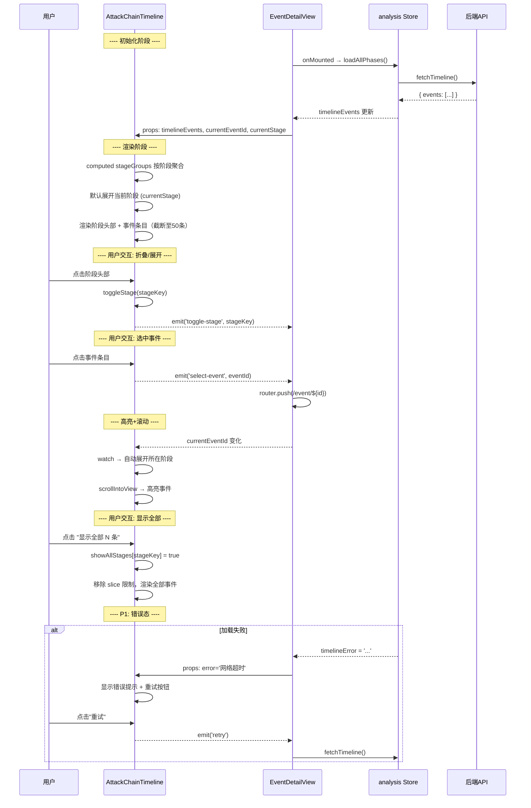
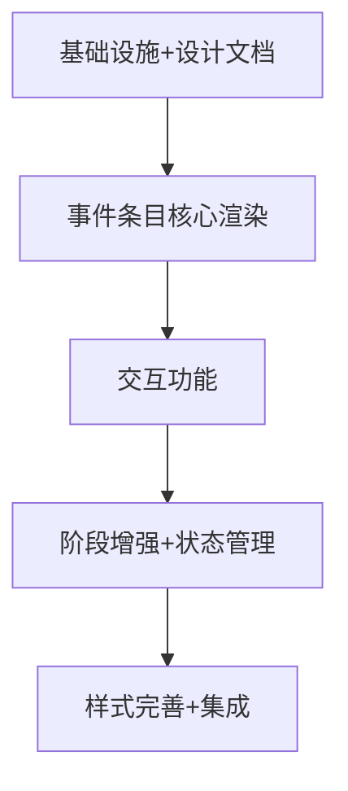

# 攻击链时间线优化 — 系统设计文档

> **版本**: v1.0  
> **作者**: 高见远（Bob），架构师  
> **日期**: 2026-07-24  
> **状态**: 定稿  
> **对应 PRD**: `docs/timeline_optimization_prd.md`

---

## 1. 实现方案概述

### 1.1 改造策略：增量改造（非重写）

当前 `AttackChainTimeline.vue` 已有合理的阶段聚合逻辑、阶段顺序和基本折叠机制。采用**增量改造策略**，在现有结构上做增强而非推倒重来：

| 维度 | 策略 |
|------|------|
| 模板结构 | 保留阶段循环、阶段头部、折叠容器；重写事件条目内部结构 |
| 脚本逻辑 | 保留 STAGE_ORDER / STAGE_LABELS / DOT_COLORS；新增事件字段提取、图标映射、自动滚动 |
| 样式 | 保留基础布局变量；重写事件条目样式、新增严重度标签等 |
| Props | 保持 `timelineEvents/currentEventId/currentStage` 兼容；P1 新增 `loading/error` |

### 1.2 技术选型确认

| 选项 | 选择 | 说明 |
|------|------|------|
| 组件框架 | Vue 3 Composition API (`<script setup>`) | 继承现有风格 |
| 样式方案 | Scoped CSS + CSS 变量 | 继承现有方案，不引入额外预处理器 |
| 事件类型图标 | Emoji | 轻量无依赖，见 PRD Q-03 确认 |
| 严重度配色 | 从 `design-tokens.js` 的 `SEVERITY.COLOR` 引用 | 与平台一致 |
| 状态管理 | Pinia (store) | 继承现有架构 |
| 新增依赖 | **无** | 所有功能利用现有框架能力 |

### 1.3 核心挑战与应对

| 挑战 | 应对方案 |
|------|----------|
| 单阶段事件数可达数百条 | 默认截断至 50 条 + 显示全部按钮，使用 `v-show` 而非 `v-if` 避免频繁 DOM 操作 |
| 事件类型繁多（15+），字段展示规则各异 | 定义统一的 `FIELD_EXTRACTORS` 映射表，按 `event_type` 匹配展示规则 |
| 当前事件高亮 + 自动滚动 | `watch` `currentEventId` 变化，使用 `scrollIntoView({ block: 'nearest' })` |
| 组件不感知外部数据加载状态 | P1 新增 `loading`/`error` props，由父组件 `EventDetailView.vue` 注入 |

---

## 2. 文件清单

### 2.1 需修改的文件

| 文件路径 | 改动量 | 说明 |
|----------|--------|------|
| `frontend/src/components/analysis/AttackChainTimeline.vue` | **大改** | 事件条目模板重写、新增字段提取、高亮滚动、截断、加载/空/错误态、箭头、严重度标记 |
| `frontend/src/views/EventDetailView.vue` | **微改** | P1：透传 `loading`/`error` props 给 AttackChainTimeline |
| `frontend/src/stores/analysis.js` | **微改** | P1：添加 `timelineLoading`/`timelineError` 响应式状态 |

### 2.2 无需新增文件

所有事件类型映射、字段提取规则、图标配置均在 `AttackChainTimeline.vue` 内部定义。已有 `design-tokens.js` 提供 `SEVERITY.COLOR` 基础配色，组件内部可直接引用或覆盖。

---

## 3. 数据结构与接口

### 3.1 Component Props（接口不变，P1 扩展）

```typescript
// 当前接口（兼容）
interface AttackChainTimelineProps {
  timelineEvents: EventItem[]    // 时间线事件列表（默认 []）
  currentEventId: string         // 当前选中事件 ID（默认 ''）
  currentStage: string           // 当前选中阶段（默认 ''）
  // P1 新增：
  loading?: boolean              // 加载态（默认 false）
  error?: string                 // 错误信息（默认 ''）
}

interface Emits {
  (e: 'select-event', eventId: string): void
  (e: 'toggle-stage', stage: string): void
}
```

### 3.2 事件数据模型（数据结构假设）

```typescript
interface EventItem {
  id: string
  event_type: string            // process_start, network_outbound 等
  attack_stage: string          // execution, persistence 等
  severity: string              // critical/high/medium/low/info
  timestamp: string             // ISO 8601 格式

  // 进程相关字段
  process_name?: string
  pid?: number
  ppid?: number
  hostname?: string

  // 网络相关字段
  remote_address?: string
  remote_port?: number
  local_address?: string
  local_port?: number

  // 文件相关字段
  file_name?: string
  file_path?: string

  // 注册表/持久化
  registry_key?: string

  // 其他
  summary?: string
  evidence?: Record<string, any>
}
```

### 3.3 组件内部状态

```typescript
// 各阶段展开状态。key = 阶段名（如 'execution'），value = 是否展开
const expandedStages: Ref<Record<string, boolean>>

// 每阶段默认显示事件数上限
const MAX_VISIBLE_EVENTS = 50   // 常量

// 各阶段是否已展开全部事件
const showAllStages: Ref<Record<string, boolean>>

// 当前高亮事件 DOM ref 映射
// 用于滚动到当前事件，key = event.id
const eventRefs: Record<string, HTMLElement>
```

### 3.4 事件类型 → 展示字段映射表

```typescript
const EVENT_TYPE_FIELDS: Record<string, {
  icon: string          // emoji
  label: string         // 中文标签
  display: (evt: EventItem) => string  // 动态字段格式化函数
}>
```

| 事件类型 | Emoji | 标签 | 展示内容 |
|----------|-------|------|----------|
| process_start | 🚀 | 进程启动 | `{process_name} (PID {pid})` |
| process_terminate | ⏹️ | 进程退出 | `{process_name} (PID {pid})` |
| network_outbound | 🌐 | 出站连接 | `{remote_address}:{remote_port}` ← `{process_name}` |
| network_listen | 🔊 | 端口监听 | `{local_address}:{local_port} ({process_name})` |
| registry_modify | 📝 | 注册表修改 | `{registry_key}` |
| registry_delete | 🗑️ | 注册表删除 | `{registry_key}` |
| file_create | 📁 | 文件创建 | `{file_path}` |
| file_modify | ✏️ | 文件修改 | `{file_path}` |
| persistence_register | 🔗 | 持久化注册 | `{summary}`（降级到服务名） |
| dns_query | 🔍 | DNS 查询 | `{remote_address}` ← `{process_name}` |
| behavior_alert | ⚠️ | 行为告警 | `{summary}` |
| ioc_match | 🎯 | IOC 命中 | `{summary}` |
| user_login | 👤 | 用户登录 | `{hostname} ({summary})` |
| module_load | 🔌 | 模块加载 | `{file_name} ({process_name})` |
| scheduled_task | ⏰ | 计划任务 | `{summary}` |
| driver_load | 🛠️ | 驱动加载 | `{file_name}` |
| *default* | ❓ | 其他 | `{summary}` |

### 3.5 严重度标签配色

| Severity | 色值（来自 SEVERITY.COLOR） | 背景色 | 文本色 |
|----------|---------------------------|--------|--------|
| critical | `#FF0000` | `rgba(255,0,0,0.1)` | `#FF0000` |
| high | `#F56C6C` | `rgba(245,108,108,0.1)` | `#F56C6C` |
| medium | `#E6A23C` | `rgba(230,162,60,0.1)` | `#E6A23C` |
| low | `#909399` | `rgba(144,147,153,0.1)` | `#909399` |
| info | `#C0C4CC` | `rgba(192,196,204,0.1)` | `#C0C4CC` |

### 3.6 阶段头部增强（P1）

阶段头部除当前内容外新增：
- **最高严重度标记**：统计该阶段中最高严重度，显示 `[N HIGH]` 或 `[1 CRITICAL]`
- 如果阶段内有 critical/high 事件，显示红底白字标签
- 如果阶段内全部为 info/low，不显示严重度标记

---

## 4. 组件调用关系

### 4.1 组件层级

```
EventDetailView.vue
 └─ AttackChainTimeline.vue          ← 改造对象
     └─ (内部: 按阶段循环渲染)
         ├─ .at-stage-header         ← 阶段头部（圆点+名称+事件数+严重度标记）
         ├─ .at-stage-arrow          ← P1: 阶段间箭头
         └─ .at-event-list           ← 事件列表（展开后）
             └─ .at-event-item       ← 单条事件
                 ├─ .ae-timestamp    ← HH:MM:SS
                 ├─ .ae-icon         ← Emoji 图标
                 ├─ .ae-content      ← 动态字段文本
                 └─ .ae-severity     ← 严重度标签
```

### 4.2 数据流

```
后端 API (/analysis/events/timeline)
  ↓ (HTTP GET)
analysis.js store (fetchTimeline → timelineEvents)
  ↓ (computed props)
EventDetailView.vue (timeline-events="store.timelineEvents")
  ↓ (props)
AttackChainTimeline.vue
  ↓ (内部 computed)
stageGroups → 按 attack_stage 聚合
  ↓ (内部 computed)
displayStages → 排序 + 过滤空阶段
  ↓ (模板渲染)
阶段 + 事件条目

交互反向流:
用户点击事件条目
  → emit('select-event', eventId)
  → EventDetailView.handleSelectEvent()
  → router.push(/analysis-center/event/${id})  // 跳转到事件详情
  → currentEventId 变化 → 组件内 Watch 触发高亮+滚动
```

### 4.3 关键操作序列

```
用户点击阶段头部:
  toggleStage(stageKey)
  → expandedStages[stageKey] = !expandedStages[stageKey]
  → emit('toggle-stage', stageKey)

currentEventId 变化:
  watch(currentEventId, (newId) => {
    → 找到 eventRefs[newId] DOM 元素
    → 找到该事件所在阶段并自动展开
    → element.scrollIntoView({ block: 'nearest', behavior: 'smooth' })
    → 添加高亮 class
  })

展开事件列表（超过 50 条）:
  用户点击 "显示全部 N 条"
  → showAllStages[stageKey] = true
  → 模板取消 slice(0, MAX_VISIBLE_EVENTS) 限制
```

### 4.4 序列图



---

## 5. 事件条目动态展示规则

### 5.1 动态字段提取函数

每个 `event_type` 对应一个固定的展示模式。前端根据事件顶层字段渲染，当顶层字段缺失时降级到 `evidence` 对象中的对应字段。

```
getEventFields(evt) => { primary: string, secondary?: string }
```

提取逻辑伪代码：

```
function extractEventFields(evt):
  switch evt.event_type:
    case 'process_start':
    case 'process_terminate':
      return { primary: `${evt.process_name} (PID ${evt.pid})` }

    case 'network_outbound':
      return { primary: `${evt.remote_address}:${evt.remote_port}`, secondary: `← ${evt.process_name}` }

    case 'network_listen':
      return { primary: `${evt.local_address}:${evt.local_port}`, secondary: `(${evt.process_name})` }

    case 'registry_modify':
    case 'registry_delete':
      return { primary: evt.registry_key || evt.summary }

    case 'file_create':
    case 'file_modify':
      return { primary: evt.file_path }

    case 'persistence_register':
      return { primary: evt.summary || evt.file_name }

    case 'dns_query':
      return { primary: evt.remote_address || evt.summary, secondary: `← ${evt.process_name}` }

    case 'user_login':
      return { primary: `${evt.hostname || ''}`, secondary: evt.summary }

    case 'module_load':
      return { primary: `${evt.file_name}`, secondary: `(${evt.process_name})` }

    case 'behavior_alert':
    case 'ioc_match':
    case 'scheduled_task':
      return { primary: evt.summary || evt.event_type }

    case 'driver_load':
      return { primary: evt.file_name || evt.summary }

    default:
      return { primary: evt.summary || evt.event_type }
```

### 5.2 时间戳格式化

```
formatTimestamp(isoString) => "HH:MM:SS"

逻辑:
  const d = new Date(isoString)
  return pad(d.getHours()) + ':' + pad(d.getMinutes()) + ':' + pad(d.getSeconds())
```

时间跨度统计中保留原有完整格式 `MM-DD HH:MM`。

### 5.3 阶段最高严重度计算（P1）

```
getStageMaxSeverity(events) => { severity: string, count: number } | null

优先级: critical > high > medium > low > info
- 遍历该阶段所有事件，取最高严重度
- 统计该严重度的事件数量
- 仅当最高严重度 >= 'medium' 时返回标记
- 示例: { severity: 'high', count: 5 } → 渲染 "[5 HIGH]"
```

---

## 6. 任务列表

| ID | 名称 | 源文件 | 依赖 | 优先级 |
|----|------|--------|------|--------|
| T01 | 基础设施与设计文档 | `docs/timeline_optimization_arch.md`, `stores/analysis.js`, `AttackChainTimeline.vue` | 无 | P0 |
| T02 | 事件条目核心渲染 | `AttackChainTimeline.vue`（映射表+字段提取+模板） | T01 | P0 |
| T03 | 交互功能（高亮/滚动/折叠/截断） | `AttackChainTimeline.vue` | T02 | P0 |
| T04 | 阶段增强与状态管理 | `AttackChainTimeline.vue`, `EventDetailView.vue`, `stores/analysis.js` | T03 | P1 |
| T05 | 样式完善与集成 | `AttackChainTimeline.vue`, `EventDetailView.vue` | T04 | P1 |

### 任务依赖图



---

## 7. 任务分解详细说明

### T01: 项目基础设施与设计文档

| 字段 | 值 |
|------|-----|
| **源文件** | `docs/timeline_optimization_arch.md`, `stores/analysis.js`, `AttackChainTimeline.vue` |
| **依赖** | 无 |
| **优先级** | P0 |

**具体工作：**

1. **`docs/timeline_optimization_arch.md`** — 创建本设计文档（已完成）
2. **`stores/analysis.js`** — 添加状态：
   - 新增 `timelineLoading` ref (默认 false)
   - 新增 `timelineError` ref (默认 '')
   - 增强 `fetchTimeline()` 方法，在请求开始设置 `timelineLoading = true`，完成后 `timelineLoading = false`，失败时设置 `timelineError = error.message`
   - 将新状态暴露在 store return 中
3. **`AttackChainTimeline.vue`** — Props 扩展声明：
   - `loading`: Boolean, default: false (P1 暂为可选)
   - `error`: String, default: '' (P1 暂为可选)
   - 保持 3 个现有 props 不变

---

### T02: 事件条目核心渲染

| 字段 | 值 |
|------|-----|
| **源文件** | `AttackChainTimeline.vue` |
| **依赖** | T01 |
| **优先级** | P0 |

**具体工作：**

1. **新增映射表常量**：
   - `EVENT_TYPE_ICONS` — event_type → emoji 映射
   - `EVENT_TYPE_FIELDS` — event_type → display 函数映射（含标签 label）
   - 保留现有 `EVENT_TYPE_LABELS` 兼容

2. **新增字段提取函数**：
   - `extractEventFields(evt)` — 按 event_type 提取主字段和副字段
   - `formatTimestamp(isoString)` — ISO 8601 → HH:MM:SS

3. **改造事件条目模板**（`.at-event-item` 内部）：
   - 新增时间戳列：`<span class="ae-timestamp">{{ formatTimestamp(evt.timestamp) }}</span>`
   - 新增图标列：`<span class="ae-icon">{{ EVENT_TYPE_ICONS[evt.event_type] || '❓' }}</span>`
   - 改造内容列：展示 `extractEventFields(evt).primary` + `.secondary`
   - 改造严重度标签：`<span class="ae-severity" :class="'sev-' + evt.severity">{{ severityLabel(evt.severity) }}</span>`

4. **改造阶段头部摘要**（折叠态）：
   - 保留前 3 条摘要展示，但使用新的字段提取内容而非 `evt.summary`

---

### T03: 交互功能（高亮/滚动/折叠/截断）

| 字段 | 值 |
|------|-----|
| **源文件** | `AttackChainTimeline.vue` |
| **依赖** | T02 |
| **优先级** | P0 |

**具体工作：**

1. **展开/折叠增强**：
   - 默认展开规则：仅当前阶段 (`currentStage`) 默认展开，其余折叠
   - 点击阶段头部切换 `expandedStages[stageKey]`
   - 当 `currentEventId` 变化时，自动展开该事件所在阶段

2. **当前事件高亮 + 自动滚动**：
   - 使用 `ref` 收集每个事件 DOM（`eventRefs`），通过 `:ref="el => eventRefs[evt.id] = el"` 或使用 `ref` 函数
   - `watch(currentEventId, ...)`：找到对应 DOM 元素，调用 `scrollIntoView({ block: 'nearest', behavior: 'smooth' })`
   - 高亮通过 class `at-event-current` 实现，当 `evt.id === currentEventId` 时添加

3. **事件数量截断**：
   - 定义常量 `MAX_VISIBLE_EVENTS = 50`
   - 展开后默认 `v-for` 使用 `slice(0, maxVisible)` 渲染，`v-show` 控制可见性
   - 当阶段事件数 > MAX_VISIBLE_EVENTS 时，在列表末尾显示"显示全部 N 条"按钮
   - 点击后设置 `showAllStages[stageKey] = true`，移除 slice 限制

---

### T04: 阶段增强与状态管理（P1）

| 字段 | 值 |
|------|-----|
| **源文件** | `AttackChainTimeline.vue`, `EventDetailView.vue`, `stores/analysis.js` |
| **依赖** | T03 |
| **优先级** | P1 |

**具体工作：**

1. **阶段间箭头连接**（`AttackChainTimeline.vue`）：
   - 在相邻阶段之间插入箭头元素 `<div class="at-stage-arrow">→</div>`
   - 箭头使用边框/线条样式（非 emoji），用 CSS border + 伪元素绘制一条垂直线 + 箭头

2. **阶段头部最高严重度标记**（`AttackChainTimeline.vue`）：
   - 新增 `getStageMaxSeverity(events)` 计算函数
   - 在阶段头部 `.at-stage-header` 中新增严重度标签区域
   - 样式：红底白字标签（`background: rgba(245,108,108,0.15)` + `color: #F56C6C` + `font-size: 10px` + `padding: 1px 5px` + `border-radius: 3px`）

3. **Loading 态**（`AttackChainTimeline.vue`）：
   - `v-if="loading && !timelineEvents.length"` 时显示骨架屏
   - 骨架屏：3-4 个灰色矩形块，模拟阶段头部 + 2-3 条事件线条
   - 使用 CSS 动画 `@keyframes shimmer` 实现加载闪烁效果

4. **空阶段处理**：
   - `stageGroups` computed 中直接过滤掉 `count === 0` 的阶段（已实现）
   - 当所有阶段均为空时，显示空状态 DOM

5. **空状态**（`AttackChainTimeline.vue`）：
   - 当前已有空状态显示 "暂无时间线数据"
   - 增强文案：补充 "请确认案件关联的事件是否存在"

6. **错误态 + 重试**（`AttackChainTimeline.vue` + `EventDetailView.vue`）：
   - 新增 emit: `'retry'`
   - 当 `error` prop 非空时，显示错误提示 + "重试"按钮
   - `EventDetailView.vue` 监听 `@retry` 事件，调用 `store.fetchTimeline()`
   - 空状态/错误状态互斥显示

7. **`EventDetailView.vue`**：
   - 向 `AttackChainTimeline` 传递 `loading` / `error` props
   - 监听 `@retry` 事件

8. **`stores/analysis.js`**：
   - 增强 `fetchTimeline()` 中的 loading/error 状态管理（已有 T01 基础）

---

### T05: 样式完善与集成

| 字段 | 值 |
|------|-----|
| **源文件** | `AttackChainTimeline.vue`, `EventDetailView.vue` |
| **依赖** | T04 |
| **优先级** | P1 |

**具体工作：**

1. **事件条目样式焕新**：
   - 布局：使用 CSS Grid 或 flexbox 实现时间戳-图标-内容-严重度标签的四列对齐
   - 时间戳列：`font-family: monospace`，`font-size: 11px`，`color: #888780`，`min-width: 60px`
   - 图标列：`font-size: 13px`，`width: 20px`，`text-align: center`
   - 内容列：`flex: 1`，主字段 `font-weight: 500`，副字段 `color: #888780`，`font-size: 11px`
   - 严重度标签：`font-size: 9px`，`padding: 0 5px`，`border-radius: 3px`，`font-weight: 600`
   - 事件条目 hover：浅灰背景 + 光晕过渡
   - 当前事件高亮：浅蓝背景 (`background: #eff6ff`)

2. **阶段箭头样式**：
   - 左侧连接线：`border-left: 2px dashed #d1d5db`，`height: 16px`，`margin-left: 18px`
   - 箭头：使用 CSS `::after` 伪元素 + border 实现三角形

3. **Loading 骨架屏样式**：
   - 3 个灰色方块，每个 40px 高，间隔 8px
   - 内部有 2 条浅灰色条纹
   - `background: linear-gradient(90deg, #f0f0f0 25%, #e0e0e0 50%, #f0f0f0 75%)`
   - `background-size: 200% 100%`
   - `animation: shimmer 1.5s infinite`

4. **集成验证**：
   - `EventDetailView.vue` 确认所有 props 正确传递
   - 检查 `@select-event` → `router.push` 链路畅通
   - 检查 `currentEventId` watch 触发正确

---

## 8. 依赖包

| 包名 | 版本 | 用途 | 变更类型 |
|------|------|------|----------|
| vue | ^3.3.0 | 组件框架 | 已有，无需变更 |
| pinia | ^2.1.0 | 状态管理 | 已有，无需变更 |

**无需新增任何第三方依赖**。所有改造均利用 Vue 3 Composition API 内置能力：
- `ref`/`computed`/`watch` — 响应式状态
- `v-if`/`v-show` — 条件渲染
- `:ref` — DOM 引用收集
- `scrollIntoView` — 自动滚动（Web API）
- Emoji — 事件类型图标（零依赖）

---

## 9. 共享知识

### 9.1 事件字段提取规则

每条事件根据 `event_type` 从顶层字段提取关键上下文。字段优先级：事件顶层字段 > `evidence` 对象。

| 事件类型 keywords | 展示内容 | 主字段 field | 副字段 field |
|-------------------|----------|-------------|-------------|
| process_* | `进程名 (PID)` | process_name | pid |
| network_outbound | `IP:端口 ← 进程名` | remote_address:remote_port | process_name |
| network_listen | `本地IP:端口 (进程名)` | local_address:local_port | process_name |
| file_* | `文件路径` | file_path | — |
| registry_* | `注册表路径` | registry_key | — |
| dns_query | `域名 ← 进程名` | remote_address | process_name |
| user_login | `主机名 (登录类型)` | hostname | summary |
| module_load | `模块名 (进程名)` | file_name | process_name |
| 其他 | `summary` | summary | — |

### 9.2 严重度配色系统

| Severity | 色值 | CSS Class | 标签文本 |
|----------|------|-----------|----------|
| critical | `#FF0000` | `sev-critical` | 严重 |
| high | `#F56C6C` | `sev-high` | 高危 |
| medium | `#E6A23C` | `sev-medium` | 中危 |
| low | `#909399` | `sev-low` | 低危 |
| info | `#C0C4CC` | `sev-info` | 信息 |

### 9.3 事件类型图标映射

参考 `design-tokens.js` 中的分类，按具体 event_type 而非大类使用 emoji：

```
process_start: 🚀       network_outbound: 🌐       file_create: 📁
process_terminate: ⏹️   network_listen: 🔊         file_modify: ✏️
                        dns_query: 🔍              registry_modify: 📝
                                                   registry_delete: 🗑️
persistence_register: 🔗  behavior_alert: ⚠️       user_login: 👤
scheduled_task: ⏰         ioc_match: 🎯            module_load: 🔌
service_operation: ⚙️     driver_load: 🛠️          default: ❓
```

### 9.4 组件事件契约

| 事件名 | 载荷 | 触发时机 | 父组件处理 |
|--------|------|----------|-----------|
| `select-event` | `eventId: string` | 用户点击事件条目 | `router.push(/analysis-center/event/${id})` |
| `toggle-stage` | `stage: string` | 用户点击阶段头部 | 无操作（由组件内部管理） |
| `retry` | 无 | 用户点击错误态重试按钮 | `store.fetchTimeline()` |

### 9.5 性能约定

| 规则 | 说明 |
|------|------|
| 事件截断 | 阶段内超过 50 条时默认只渲染前 50 条，多余通过"显示全部"按钮展开 |
| 使用 v-show | 展开/折叠使用 `v-show` 而非 `v-if`，避免展开时重新创建 DOM 子树 |
| scrollIntoView | 使用 `{ block: 'nearest' }` 避免不必要的页面级滚动 |
| 骨架屏 | 仅首次加载且数据为空时显示；数据已存在后重新加载不显示骨架屏 |

---

## 10. 实施建议

### 10.1 实施顺序

严格遵守任务依赖顺序：T01 → T02 → T03 → T04 → T05。每个任务完成后进行增量验证。

### 10.2 验证方式

| 阶段 | 验证方法 |
|------|----------|
| T02 完成后 | 在 EventDetailView 页面检查事件条目是否展示时间戳、图标、动态字段、严重度标签 |
| T03 完成后 | 点击事件列表中的事件，检查时间线是否自动滚动并高亮；检查折叠展开行为；检查事件截断 |
| T04 完成后 | 检查阶段间箭头、头部严重度标记、Loading/空/错误态 |
| T05 完成后 | 全流程验收：加载→展示→交互→各状态切换 |

### 10.3 风险点

| 风险 | 概率 | 影响 | 缓解措施 |
|------|------|------|----------|
| timeline 接口返回字段不足（如缺 process_name） | 低 | 高 | 字段提取函数增加降级逻辑：顶层字段 → evidence 子字段 → summary |
| 单阶段事件数过大导致渲染卡顿 | 中 | 中 | 截断至 50 条，P2 引入虚拟滚动 |
| 多个事件同时高亮（currentEventId 快速变化） | 低 | 低 | watch 使用 `immediate: false`，滚动加入短暂防抖 |

### 10.4 不在本轮范围（明确不实现）

- 虚拟滚动（见 PRD R-13，P2）
- 多攻击链切换（见 PRD Q-02，P2）
- 事件搜索/过滤（见 PRD R-14，P2）
- 复制事件信息（见 PRD R-15，P2）
- 事件标签/标记（见 PRD R-16，P2）
- 后端接口改造（假设现有 API 已提供所需字段）
