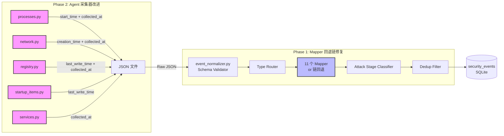
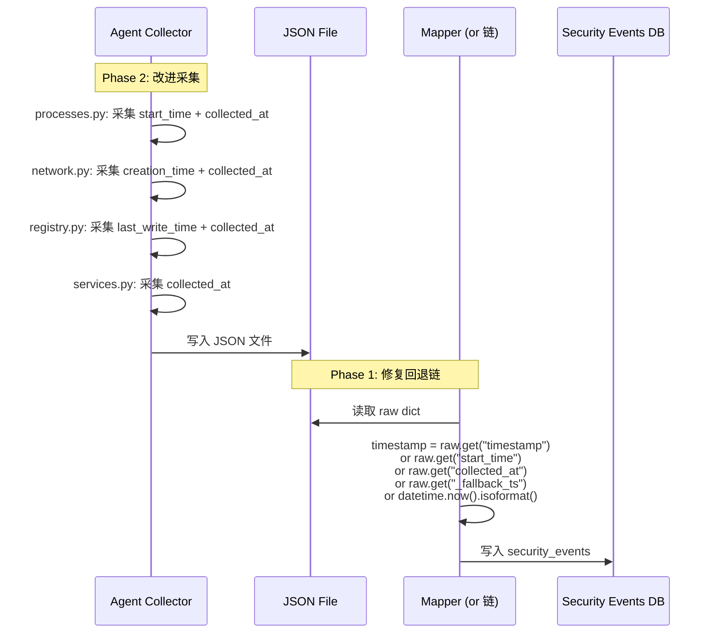
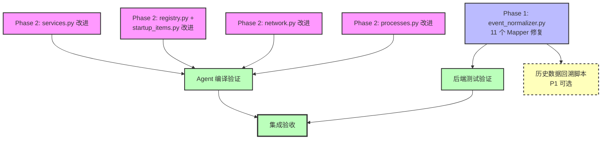

# 事件时间戳修复 — 系统设计文档

> **作者**: Bob (Architect)  
> **版本**: v1.0  
> **日期**: 2026-07-06  

---

## 目录

1. [实现方案 + 总体架构图](#1-实现方案--总体架构图)
2. [文件列表](#2-文件列表)
3. [详细设计方案](#3-详细设计方案)
   - [Phase 1: Mapper timestamp 回退链修复](#phase-1mapper-timestamp-回退链修复)
   - [Phase 2: Agent 采集器改进](#phase-2agent-采集器改进)
4. [任务列表](#4-任务列表)
5. [共享知识](#5-共享知识)
6. [待明确事项](#6-待明确事项)

---

## 1. 实现方案 + 总体架构图

### 1.1 问题根因

| 层面 | 问题 | 影响 |
|------|------|------|
| **Phase 1** - Mapper 层 | `dict.get()` 在 key 存在但值为 `""` 时返回空串，不会 fallback | 进程事件 53 条落地到 `datetime.now()`（导入时间）而非真实 `start_time` |
| **Phase 2** - Agent 层 | 采集器未充分收集真实时间戳 | 后端 Mapper 的 fallback 链没有足够的上游时间数据可用 |

### 1.2 总体架构与数据流



### 1.3 核心技术挑战

| 挑战 | 解决方案 |
|------|----------|
| `dict.get()` 不区分"key 不存在"和"key 存在但值为 falsy" | 改用 `or` 链：从左到右取第一个非空/非假值 |
| Agent 采集时有真实时间戳但未采集 | 补采 `start_time` / `creation_time` / `last_write_time`；统一添加 `collected_at` |
| 回退路径（wmic/tasklist/netstat）无时间戳 | 留空，由 `collected_at` 和 `_fallback_ts` 兜底 |

### 1.4 选择的技术方案

| 维度 | 决策 | 理由 |
|------|------|------|
| 时间戳回退策略 | `or` 链代替嵌套 `dict.get()` | 解决空串吞掉 fallback 的根本问题；代码更线性可读 |
| 采集时间字段命名 | 统一 `collected_at` | 跨采集器一致性；Mapper 可统一 fallback |
| Registry last_write_time | `winreg.QueryInfoKey()` | 系统原生 API，零依赖，性能开销可忽略 |

---

## 2. 文件列表

### Phase 1 — 后端 Mapper 层

| 文件路径 | 改动类型 | 说明 |
|----------|----------|------|
| `backend/app/services/event_normalizer.py` | 修改 | 11 个 Mapper 的 `map()` 方法中 timestamp 行 |

### Phase 2 — Agent 采集器层

| 文件路径 | 改动类型 | 说明 |
|----------|----------|------|
| `agent/collectors/processes.py` | 修改 | psutil 加 `collected_at`；wmic 路径读 `creationdate` |
| `agent/collectors/network.py` | 修改 | PowerShell TCP 加 `CreationTime`；psutil 路径加 `collected_at` |
| `agent/collectors/registry.py` | 修改 | `QueryInfoKey` 获取 `last_write_time` |
| `agent/collectors/startup_items.py` | 修改 | 注册表路径加 `last_write_time` |
| `agent/collectors/services.py` | 修改 | 加 `collected_at` 字段 |
| `agent/utils/platform.py` | 不改（阅读确认） | `get_timestamp()` 已存在，可复用 |

---

## 3. 详细设计方案

### Phase 1: Mapper timestamp 回退链修复

#### 3.1 核心改造模式

将每个 Mapper 的 timestamp 行从嵌套 `dict.get()` 改为 **`or` 链**：

```python
# ❌ 改前（嵌套 dict.get，空串会吞掉 fallback）
"timestamp": raw.get("timestamp", raw.get("start_time", raw.get("_fallback_ts", datetime.now(timezone.utc).isoformat()))),

# ✅ 改后（or 链，第一个非空/非假值胜出）
"timestamp": (
    raw.get("timestamp")
    or raw.get("start_time")
    or raw.get("collected_at")
    or raw.get("_fallback_ts")
    or datetime.now(timezone.utc).isoformat()
),
```

#### 3.2 11 个 Mapper 的 timestamp 行差异

| # | Mapper | 当前 timestamp 行 | start_time 支持 | collected_at 入链 | 特殊说明 |
|---|--------|-------------------|-----------------|-------------------|----------|
| 1 | **ProcessMapper** | `raw.get("timestamp", raw.get("start_time", ...))` | ✅ 已有 | ✅ 追加 | 唯一已有 `start_time` fallback 的 Mapper |
| 2 | **NetworkMapper** | `raw.get("timestamp", ...)` | ❌ 无 | ✅ 追加 | — |
| 3 | **RegistryMapper** | `raw.get("timestamp", ...)` | ❌ 无 | ✅ 追加 | — |
| 4 | **FileMapper** | `raw.get("timestamp", ...)` | ❌ 无 | ✅ 追加 | — |
| 5 | **PersistenceMapper** | `raw.get("timestamp", ...)` | ❌ 无 | ✅ 追加 | — |
| 6 | **WmiMapper** | `raw.get("timestamp", ...)` | ❌ 无 | ✅ 追加 | — |
| 7 | **BehaviorMapper** | `raw.get("timestamp", ...)` | ❌ 无 | ✅ 追加 | — |
| 8 | **IocMapper** | `raw.get("timestamp", ...)` | ❌ 无 | ✅ 追加 | — |
| 9 | **AuthMapper** | `raw.get("timestamp", ...)` | ❌ 无 | ✅ 追加 | — |
| 10 | **ModuleMapper** | `raw.get("timestamp", ...)` | ❌ 无 | ✅ 追加 | — |
| 11 | **PipeMapper** | `raw.get("timestamp", ...)` | ❌ 无 | ✅ 追加 | — |

#### 3.3 统一模板（适用于除 ProcessMapper 外的 10 个 Mapper）

```python
"timestamp": (
    raw.get("timestamp")
    or raw.get("collected_at")
    or raw.get("_fallback_ts")
    or datetime.now(timezone.utc).isoformat()
),
```

#### 3.4 ProcessMapper 模板（保留 start_time）

```python
"timestamp": (
    raw.get("timestamp")
    or raw.get("start_time")
    or raw.get("collected_at")
    or raw.get("_fallback_ts")
    or datetime.now(timezone.utc).isoformat()
),
```

#### 3.5 影响范围分析

| 维度 | 影响 |
|------|------|
| 向前兼容 | ✅ 新 `or` 链对所有已有数据行为一致（非空 timestamp 优先） |
| 空串修复 | ✅ `raw.get("start_time")` 返回 `""` → `or` 链继续 fallback 到下一级 |
| 新增字段支持 | ✅ `collected_at` 插入链中段，Agent 新数据可自动利用 |
| 性能影响 | ✅ 零额外 I/O，纯内存字符串比较 |
| 测试覆盖 | ✅ 需验证空串、None、缺失字段、正常值四种场景 |

---

### Phase 2: Agent 采集器改进

#### 3.6 processes.py 改动

##### 3.6.1 psutil 路径（`collect()` 方法）

**当前**：
```python
create_time = info.get("create_time")
start_time = ""
if create_time:
    try:
        start_time = datetime.fromtimestamp(create_time).isoformat()
    except:
        start_time = ""
# ... 在 process_data 字典中：
"start_time": start_time,
```

**改后**：加 `collected_at`
```python
"start_time": start_time,
# ... 在 process_data 字典末尾追加：
"collected_at": get_timestamp(),
```

##### 3.6.2 wmic 回退路径（`_collect_fallback()` 方法）

**当前**：
```python
"start_time": "",
```

**改后**：读取 wmic 输出的 `CreationDate` 字段
```python
# 在 CSV 表头解析后增加：
creationdate_idx = _find_col(headers, "CreationDate")
# ... 在每行处理中：
creationdate = row[creationdate_idx].strip() if creationdate_idx < len(row) else ""
start_time = ""
if creationdate:
    try:
        # wmic CreationDate 格式: YYYYMMDDHHMMSS.ffffff±ZZZ
        from datetime import datetime
        dt = datetime.strptime(creationdate.split(".")[0], "%Y%m%d%H%M%S")
        start_time = dt.isoformat()
    except (ValueError, IndexError):
        start_time = ""
# ... 在 pd 字典中：
"start_time": start_time,
"collected_at": get_timestamp(),
```

##### 3.6.3 tasklist 回退路径（`_collect_fallback()` 方法）

**当前**：
```python
"start_time": "",
```

**改后**：无法获取进程创建时间，仅加 `collected_at`
```python
"start_time": "",
"collected_at": get_timestamp(),
```

#### 3.7 network.py 改动

##### 3.7.1 PowerShell TCP 路径（`_collect_windows_connections()` 方法）

**当前**：
```powershell
Select-Object LocalAddress,LocalPort,RemoteAddress,RemotePort,State,OwningProcess
```

**改后**：
```powershell
Select-Object LocalAddress,LocalPort,RemoteAddress,RemotePort,State,OwningProcess,CreationTime
```

Python 端解析新增字段：
```python
"creation_time": conn.get("CreationTime", ""),
```

##### 3.7.2 psutil 路径（`_get_connections()` 方法）

**当前**：连接字典中无时间戳字段  
**改后**：在 `connections.append()` 中添加 `collected_at`：
```python
connections.append({
    # ... 现有字段 ...
    "collected_at": get_timestamp(),
})
```

##### 3.7.3 netstat 回退路径（`_get_connections_netstat()` 方法）

**当前**：无时间戳  
**改后**：加 `collected_at`：
```python
connections.append({
    # ... 现有字段 ...
    "collected_at": get_timestamp(),
})
```

##### 3.7.4 `_build_network_connections()` 方法

✅ **已确认 `collected_at` 存在**（第 185 行）：
```python
"collected_at": now,
```
无需修改。

#### 3.8 registry.py 改动

##### 3.8.1 `_build_registry_keys()` 方法

**当前**：`"last_write_time": ""`（3 处）
**改后**：需要从 `_get_run_keys()` 和 `_get_shell_extensions()` 传入 `last_write_time`。

##### 3.8.2 `_get_run_keys()` 方法

**当前**：`OpenKey` 后不调用 `QueryInfoKey`
**改后**：
```python
with winreg.OpenKey(hive, key_path) as key:
    try:
        # 新增：获取最后写入时间
        info = winreg.QueryInfoKey(key)
        # winreg.QueryInfoKey 返回 (num_keys, num_values, last_modified)
        # last_modified 是 Windows FILETIME（1601-01-01 以来的 100ns 间隔数）
        last_write = info[2]
        last_write_time = datetime.fromtimestamp(
            (last_write - 116444736000000000) / 10000000
        ).isoformat() if last_write else ""
    except Exception:
        last_write_time = ""
    # ... 枚举值 ...
    items.append({
        # ... 现有字段 ...
        "last_write_time": last_write_time,  # 新加
    })
```

##### 3.8.3 `_get_shell_extensions()` 方法

同样改法：在 `OpenKey` 后调用 `QueryInfoKey`，获取 `last_write_time` 并注入。

#### 3.9 startup_items.py 改动

##### 3.9.1 `_get_registry_run_keys()` 方法

**当前**：无时间戳字段  
**改后**：在 `OpenKey` 后调用 `QueryInfoKey` 获取 `last_write_time`：
```python
with winreg.OpenKey(hive, key_path) as key:
    try:
        info = winreg.QueryInfoKey(key)
        last_write = info[2]
        last_write_time = datetime.fromtimestamp(
            (last_write - 116444736000000000) / 10000000
        ).isoformat() if last_write else ""
    except Exception:
        last_write_time = ""
    
    index = 0
    while True:
        try:
            name, value, _ = winreg.EnumValue(key, index)
            items.append({
                # ... 现有字段 ...
                "last_write_time": last_write_time,
            })
            index += 1
        except OSError:
            break
```

#### 3.10 services.py 改动

##### 3.10.1 `_collect_windows()` 方法

**当前**：无 `collected_at` 字段  
**改后**：在收集到每条服务后添加 `collected_at`：
```python
# 在 services.append(current) 之前
current["collected_at"] = get_timestamp()
```

##### 3.10.2 `_collect_linux()` 方法

**当前**：无 `collected_at` 字段  
**改后**：同 Windows 路径
```python
services.append({
    # ... 现有字段 ...
    "collected_at": get_timestamp(),
})
```

### 3.11 Sequence Diagram: 单条事件处理流程



---

## 4. 任务列表

### 4.1 任务依赖关系



### 4.2 任务详情

| 任务 ID | 任务名称 | 源文件 | 依赖 | 优先级 | 预计工时 |
|---------|----------|--------|------|--------|----------|
| **T1** | Phase 1 — event_normalizer.py 11 个 Mapper 修复 | `backend/app/services/event_normalizer.py` | 无 | **P0** | 2h |
| **T2** | Phase 2 — processes.py 改进 | `agent/collectors/processes.py` | 无 | **P0** | 3h |
| **T3** | Phase 2 — network.py 改进 | `agent/collectors/network.py` | 无 | **P0** | 2h |
| **T4** | Phase 2 — registry.py + startup_items.py 改进 | `agent/collectors/registry.py`, `agent/collectors/startup_items.py` | 无 | **P0** | 3h |
| **T5** | Phase 2 — services.py 改进 | `agent/collectors/services.py` | 无 | **P0** | 1h |
| **T6** | 后端测试验证 | `backend/app/services/event_normalizer.py` | T1 | **P0** | 2h |
| **T7** | Agent 编译验证 | agent 全部采集器文件 | T2, T3, T4, T5 | **P0** | 1h |
| **T8** | 历史数据回溯脚本 | 新建脚本文件 | T1 | **P1** | 2h |
| **T9** | 集成验收 | 全链路 | T6, T7 | **P0** | 2h |

> **T1–T5 完全并行**，互不依赖，可分配给不同开发人员同时执行。

---

## 5. 共享知识

### 5.1 字段命名约定

| 字段名 | 含义 | 使用范围 | 来源 |
|--------|------|----------|------|
| `collected_at` | 采集时刻（ISO 8601） | 全部 Agent 采集器输出 | `utils.platform.get_timestamp()` |
| `start_time` | 进程创建时间（ISO 8601） | `processes.py` | psutil `create_time` 或 wmic `CreationDate` |
| `creation_time` | 网络连接创建时间 | `network.py` | PowerShell `Get-NetTCPConnection.CreationTime` |
| `last_write_time` | 注册表键最后修改时间 | `registry.py`, `startup_items.py` | `winreg.QueryInfoKey()` |
| `_fallback_ts` | 后端注入的兜底时间戳 | `event_normalizer.py` | 上层调用方注入 |

### 5.2 `or` 链行为规则

```python
# or 链的核心语义：从左到右取第一个 truthy 值
value = A or B or C or D
# 等价于：
value = A if A else (B if B else (C if C else D))
```

| 场景 | A | B | C | D | 结果 |
|------|---|---|---|---|------|
| 正常数据 | `"2026-07-06T10:00:00"` | — | — | — | `"2026-07-06T10:00:00"` |
| 空串回退 | `""` | `"2026-07-06T10:00:00"` | — | — | `"2026-07-06T10:00:00"` |
| None 回退 | `None` | `""` | `"2026-07-06T10:00:00"` | — | `"2026-07-06T10:00:00"` |
| 全缺 | `None` | `None` | `None` | `"2026-07-06T12:00:00"` | `"2026-07-06T12:00:00"` |

### 5.3 winreg.QueryInfoKey 的时间戳转换

Windows FILETIME → ISO 8601 的转换公式：

```python
from datetime import datetime, timezone

# QueryInfoKey 返回的 last_modified 是 FILETIME
# FILETIME epoch: 1601-01-01 UTC
# Unix epoch: 1970-01-01 UTC
# 差值: 11644473600 秒 = 116444736000000000 个 100ns 间隔

def filetime_to_iso(ft: int) -> str:
    """将 Windows FILETIME 转换为 ISO 8601 字符串."""
    if not ft:
        return ""
    # FILETIME 单位是 100ns，转换为秒
    unix_ts = (ft - 116444736000000000) / 10000000
    try:
        return datetime.fromtimestamp(unix_ts, tz=timezone.utc).isoformat()
    except (ValueError, OSError):
        return ""
```

### 5.4 wmic CreationDate 格式解析

wmic 输出的 `CreationDate` 格式为 `YYYYMMDDHHMMSS.ffffff±ZZZ`（例如 `20260706103045.123456+080`）。

```python
def parse_wmic_creationdate(raw: str) -> str:
    """解析 wmic CreationDate 为 ISO 8601."""
    if not raw:
        return ""
    try:
        # 取小数点前的部分
        dt_str = raw.split(".")[0]
        dt = datetime.strptime(dt_str, "%Y%m%d%H%M%S")
        return dt.isoformat()
    except (ValueError, IndexError):
        return ""
```

### 5.5 验证方式

| 验证层面 | 方法 | 覆盖范围 |
|----------|------|----------|
| 后端单元测试 | pytest | 每个 Mapper 的 or 链在空串/None/正常值下的行为 |
| Agent 语法验证 | `python -m py_compile *.py` | 所有修改过的采集器文件 |
| Agent 模拟 JSON 验证 | 构造样例 JSON 输入，验证输出字段 | 时间戳字段存在且格式正确 |
| 集成测试 | 端到端：Agent 输出 → JSON → Mapper → DB | 全链路时间戳正确性 |

---

## 6. 待明确事项

### 6.1 历史数据回溯

**问题**：Phase 1 修复后，新进入的数据时间戳正确，但已写入 DB 的 53 条进程事件时间戳仍然是 `datetime.now()`（导入时间）。

**选项**：

| 方案 | 优点 | 缺点 | 推荐 |
|------|------|------|------|
| **不回溯** | 零风险，不影响现有数据 | 旧数据时间戳不准确 | ❌ |
| **写回溯脚本**（T8） | 可修复历史记录 | 需要读取原始 JSON 文件；如 JSON 已删除则无法修复 | ✅ P1 |
| **全量重导入** | 最彻底 | 成本高，依赖原始 JSON 完好 | ❌ |

**建议**：T8 实现一个可选的回溯脚本，从 JSON 备份文件中重映射 timestamp。如果原始 JSON 已不存在，则在用户文档中说明"旧数据时间戳为导入时间"。

### 6.2 Agent 部署策略

**问题**：Agent 代码修改后，已部署到端点的 Agent 需要更新才能受益。

**选项**：

| 方案 | 优点 | 缺点 |
|------|------|------|
| 热更新推送 | 用户无感 | 需要 Agent 自更新机制 |
| 手动更新 | 可控 | 用户需主动操作 |
| 版本发布说明 | 透明 | 需要编写升级指引 |

**建议**：
- 本次修改全部**向后兼容**（新增字段不破坏旧格式）
- 未更新 Agent 的设备，后端 Mapper 的 `or` 链会自动 fallback 到 `collected_at` 或 `_fallback_ts`
- Agent 更新为非强制优化，在发布说明中标注即可

### 6.3 Windows FILETIME 边界情况

- 当 `QueryInfoKey` 因权限不足失败时：降级为 `""`，不抛出异常
- 当 `last_write` 为 `0` 或极小值时：判断为无效，返回 `""`
- 需要统一用 `try/except` 包裹所有 `QueryInfoKey` 调用

### 6.4 测试数据准备

需要准备以下测试数据以验证修复：

1. **正常数据**：timestamp 正常填写 → or 链走第一项
2. **空串数据**：timestamp="" 且 start_time="" → or 链走到 collected_at 或 _fallback_ts
3. **缺失字段数据**：timestamp 缺失 → 同空串行为
4. **全空数据**：所有时间字段为空 → 最终 fallback 到 `datetime.now()`
