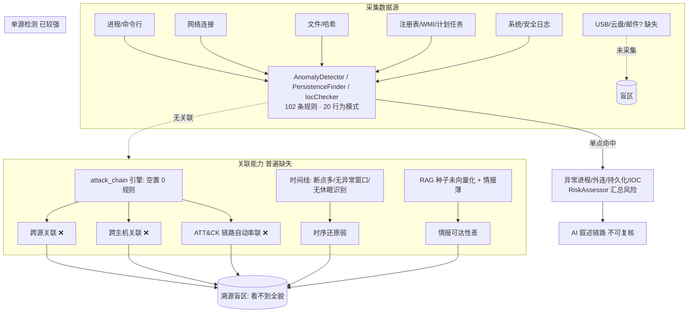

# 应急溯源规则缺口分析（IR Platform · 需求 #1）

> **视角**：应急响应专家（IR Platform 产品/溯源能力视角）
> **产出**：应急溯源规则缺失分析 + 新增规则候选清单（供架构师高见远做规则设计与落库）
> **范围**：仅做分析，不写代码、不设计具体匹配逻辑
> **依据代码**：`backend/app/rules/rule_engine.py`、`backend/app/rules/default_rules.json`、`docs/rules-catalog.md`、`backend/app/schemas/analysis.py`、`backend/app/analysis/{anomaly_detector,persistence_finder,ioc_checker,timeline_builder,process_tree_builder,risk_assessor}.py`、`backend/app/services/{knowledge_retriever,explainability_service}.py`、`docs/system_design.md`、`knowledge_base_architecture_review.md`

---

## 0. 分析口径与现状速览

### 0.1 现有溯源能力盘点（给架构师的基线）

| 能力项 | 现状 | 关键位置 |
|---|---|---|
| 规则引擎类型 | 7 类：`regex / list / threshold / behavior / composite / exists / attack_chain` | `schemas/analysis.py:RULE_TYPE_ENUM`、`rule_engine.py` |
| 内置默认规则 | **102 条**，14 类（behavior/credential/defense_evasion/discovery/execution/exfiltration/impact/ioc/lateral/network/persistence/privilege_escalation/process/startup） | `default_rules.json`、`docs/rules-catalog.md` |
| 行为模式白名单 | **20 种**（`BEHAVIOR_PATTERNS`，如 `credential_dump`/`lateral_movement`/`data_exfil`/`process_chain`/`time_cluster` 等） | `rule_engine.py:36` |
| C2 框架特征签名 | **30 种**（cobaltstrike/metasploit/empire/sliver…），仅关键词回退命中 | `rule_engine.py:_C2_FRAMEWORK_SIGNATURES` |
| 攻击链关联（跨维度顺序） | **引擎已支持但 0 条规则使用**（`attack_chain` 类型） | `schemas/analysis.py:ConditionModel.ordered_steps`、`rule_engine.py:_match_attack_chain` |
| 种子知识（RAG） | 10 条（5 MITRE + 3 C2 + 2 Malware），**但存在「未向量化」阻断 Bug** | `data/knowledge_seed.py`、`knowledge_base_architecture_review.md:§3` |
| MITRE 战术映射 | `MitreTacticMapper` 约 **27 条**硬编码规则（逐事件映射，非链式） | `timeline_builder.py:MitreTacticMapper` |
| 检测作用域 | **严格单主机、单数据源**（`_build_host_events` 按 `host_id`；`host_scope` 默认 `single`） | `rule_engine.py:_build_host_events` |
| 白名单/动态 IOC | 支持 `whitelist_service` 过滤进程；`FIELD_TO_IOC_TYPE` 动态并入 `iocs` 表 | `anomaly_detector.py:57`、`rule_engine.py:73` |
| 威胁情报回灌 | `threat_intel` 表 + 外部 Enrichment（默认 `auto_enrichment=false`） | `rule_engine.py:_load_threat_level_by_value` |

### 0.2 核心结论（一句话）

> 平台已具备**单主机、单数据源、单点的强检测能力**（102 条规则覆盖大量战术点），但**最缺的是「把孤立命中点串成溯源链」的关联能力**：`attack_chain` 引擎空置、跨主机/跨源无关联、外传与初始访问缺口大、且高价值情报因 RAG Bug 无法被检索——这正是应急溯源最需要的「从一点还原全貌」能力。

---

## 1. 应急溯源痛点与缺失环节分析

### 1.1 日志关联分析（多源 / 跨主机 / 维度）

**现状**：检测按数据类别切片执行——
- 进程/执行/行为规则 → `AnomalyDetector.detect_processes`（process/behavior/execution 类）；
- 网络/IOC 规则 → `detect_connections`（network/ioc 类）；
- 持久化 → `PersistenceFinder.assess_suspicious`（persistence/startup 类）；
- IOC → `IocChecker.check`（process/network/file 三类分别匹配）。

**缺失/薄弱点**：
1. **跨数据源关联为 0（除 `attack_chain` 引擎，而它无规则）**。例如「Web 进程写文件→该文件被执行→外连 C2」需要 process+file+connection 三源联动，目前只能在 AI 叙述里拼，没有确定性规则可输出证据链。
2. **跨主机关联缺失**。`_build_host_events` 限定 `host_id`；`host_scope` 仅预留 `single`。横向移动只在本机检测「发起动作」（psexec/wmi 命令行），**无法把 A 机的 `net use \\B` 与 B 机的异常服务创建/进程创建关联成一条移动链**。`docs/system_design.md:V3-4` 的 `TimelineCompare` 仅是可视化叠加，不是检测规则。
3. **注册表/WMI/计划任务被当作持久化「点」检测，未与进程/网络时间关联**。如 `WMI 事件订阅`（persistence 类）命中后，无法自动关联「随后哪个进程被该订阅触发、触发后干了什么」。
4. **日志源本身缺口**：DNS 缓存、安全事件摘要（`event_ids_summary`）在 `TimelineBuilder` 中因无时间戳被跳过，导致**域名解析链、登录统计类线索缺位**（`timeline_builder.py:_extract_from_network/_extract_from_security`）。

### 1.2 攻击链路还原（ATT&CK 自动串联）

**现状**：`attack_chain` 规则类型已完整实现——`ConditionModel` 支持 `ordered_steps`（每步含 `dimension ∈ {process,connection,registry,persistence,timeline,ioc}` + `match`）、`window_minutes`（默认 60，上限 1440）、`host_scope`；`RuleEngine._match_attack_chain` 做主机级贪心顺序匹配 + 时间窗判定，命中强制 `severity=critical`。前端 `AttackChainDag.vue`（V3-3）与 `RuleEngine.get_attack_chain_hits` 已就绪。

**缺失/薄弱点（最关键）**：
1. **`attack_chain` 规则为零条**（`default_rules.json` 全量 grep 无 `rule_type:"attack_chain"`）。即「初始访问→执行→持久化→提权→横向移动→收集→渗出」的自动串联**完全未被规则驱动**；`get_attack_chain_hits` 读 `AnalysisResult.details.attack_chains` 必然为空，DAG 图无数据。
2. **MITRE 映射是「逐事件」而非「链」**。`MitreTacticMapper` 给单事件打 `kill_chain_stage`/`mitre_technique_id`，但**没有规则把这些阶段按时间/因果串成完整 Kill Chain**，泳道图（V2-4 `KillChainView`）只能按事件散点归位，不能展示阶段间流向。
3. **AI 与规则职责割裂**：现有约定是「AI 只叙述、不重判」攻击链命中（`rule_engine.py:get_attack_chain_hits` 注释）。但当前**没有命中可供 AI 叙述**，AI 只能凭语义推断链路，确定性弱、不可复核。

### 1.3 威胁情报匹配（IoC / 恶意样本 / 攻击工具 / C2）

**现状**：
- `iocs` 表 + `FIELD_TO_IOC_TYPE` 支持 IP/域名/URL/哈希动态并入 `list` 规则匹配（`rule_engine.py:73`）。
- 内置 3 条硬编码恶意 IP（`known_bad_ip_1/2/3`）、C2 端口（4444/6667/1337/4443/5555/8888）、`suspicious_c2_domain`、`known_c2_framework`（30 个框架签名）。
- `threat_intel` 表 + 外部 Enrichment（威胁情报平台回灌，severity 升级）。

**缺失/薄弱点**：
1. **内置 C2 IP/域名情报极薄**（仅 3 个 IP + 1 个 C2 域名 list 规则，且域名依赖用户填 `iocs`）。缺少**可运营维护的 C2 情报清单**（IP/域名/证书/ASN/JA3）作为规则或种子。
2. **恶意样本/工具特征只有命令行关键词**，无文件哈希/签名维度规则。`IocChecker` 的哈希匹配依赖 Agent 侧 `known_bad_hashes`，**规则引擎侧没有 `file_hash` 维度的 `list` 规则**（尽管 `FIELD_TO_IOC_TYPE` 已映射 `file_hash/sha256/hash`）。
3. **C2 行为特征（网络侧）不足**：仅有 `dns_c2_beaconing`（阈值）、`dns_tunnel_exfil`、`icmp_tunnel_exfil`。缺少 **JA3/JA3S 指纹、Beacon 心跳间隔、TLS 签名/DoH、异常 User-Agent、大包外传体积**等网络特征检测（这些需要网络采集新增字段）。
4. **RAG 知识库 Bug 直接导致情报不可达**：种子知识（含 Cobalt Strike/Metasploit 行为描述）因 `knowledge_retriever.py` 的 `count()>0` 早退 **从未被向量化**，`reject/recall` 不触发重建 → 已拒绝条目仍会命中（`knowledge_base_architecture_review.md:§3`）。即「参考知识」侧的高价值情报目前基本失效。

### 1.4 时间线追踪（对齐 / 异常窗口 / 休眠与快速）

**现状**：`TimelineBuilder.build` 从 6 类源抽取事件、统一时间戳（`_normalize_timestamp`）、排序、注入 MITRE；`time_cluster` 行为模式做「时间窗内进程数爆发」检测。

**缺失/薄弱点**：
1. **时间序列对齐缺口大**：多源时间戳格式众多且**大量源无可靠时间**（DNS 缓存、事件摘要、空 time 的日志直接跳过），导致时间线「断点」，链路时间窗（`attack_chain.window_minutes`）在多数步骤无时间戳时退化为「仅顺序」（`_build_host_events` 注释：process/connection/persistence/ioc 时间戳为 None）。
2. **异常时间窗口无规则**：无「非工作时段（0–5 点 / 周末）突增」「节假日异常」检测。`time_cluster` 只数进程数量，不区分时段。
3. **休眠 vs 快速攻击无法区分**：无「长期静默植入（beacon 周期长、首现远晚于基线）」或「休眠后极短时间窗内完成全链路」的检测。前者需历史基线/跨分析对比（离线），后者需「多步骤跨度 << 正常运维跨度」的规则支持。

### 1.5 其他关键缺失（加密混淆 / 无文件 / LotL / 云与外部信道）

1. **加密/混淆对抗**：
   - 已有 `obfuscated_execution_evasion`（T1027）、`amsi_bypass`、`process_injection_indicator`。
   - **缺**：加密外传专用检测（`openssl enc`/`gpg -c`/`7z -p` 配合外连）、DoH/DoT 绕过 DNS 监控、恶意 TLS（JA3s）C2。
2. **无文件 / 内存驻留（Fileless）**：
   - 已有 `dotnet_inline_compilation`、`msbuild_inline_task`、`powershell_download_cradle`、`cscript_wscript_download`。
   - **缺**：`.NET CLR 注入`、`rundll32/regsvr32` 链式滥用、`WMI 部署 Agent` 的确定性关联。
3. **Living-off-the-Land（LotL）**：
   - `suspicious_parent_child`（办公软件→脚本）覆盖一类。
   - **缺**：「LOLBin 由 Web/邮件进程派生」「系统二进制组合做下载/执行」的复合规则。
4. **云盘 / 邮件 / USB 外传（最高频的真实外传信道）**：
   - **完全缺失**。`exfiltration` 类仅 3 条（压缩+C2、DNS 隧道、ICMP 隧道）。云盘（rclone/mega/onedrive/百度网盘）、邮件（SMTP/IMAP 大附件）、USB（可移动介质拷贝）无任何规则；USB 甚至无采集维度。

### 1.6 现状能力 — 缺失环节 全景图

---

## 2. 缺失规则候选清单（给架构师的设计输入）

**说明**
- **优先复用现有引擎能力**：绝大多数候选可用 `attack_chain` / `composite(AND/OR)` / `behavior`+`list`+`threshold` 组合实现，无需新增引擎类型。
- **标注 `【需新增采集/代码】`** 的，表示当前 Agent 未采集对应字段或引擎需扩展（见 §4 待确认）。
- **误报(FP)/漏报(FN)平衡** 贯穿每条：用 AND 复合条件、上下文限定（如 Web 进程上下文）、阈值、白名单、情报升级等手段控制。

### 2.1 攻击链路还原（P0，解锁已空置的 `attack_chain` 引擎）

| 规则名(暂定) | 场景 | 弥补缺失环节 | 预期能输出的溯源结论 | 优先级 | FP/FN 平衡 |
|---|---|---|---|---|---|
| `AC_webshell_to_c2` | Web 入侵 / C2 | 链路还原（执行→持久化→C2） | 「Web 进程落 WebShell 文件 → WebShell 进程活动 → 外连已知 C2」完整链 | P0 | `attack_chain`：step1 进程维度(web 名)+step2 file 维度(webshell 后缀)+step3 connection 维度(C2)；`window_minutes` 取长窗降低偶发 FP |
| `AC_lateral_to_cred` | 横向移动 / 凭据访问 | 链路还原（横向→凭据） | 「显式凭据登录(4648)/`net use \\` → psexec/wmi 远程 → 远程进程创建 → lsass dump」移动+窃取链 | P0 | 多步 AND + 远程执行关键字；允许 `psexec`/`wmiexec`/`schtasks /s` 任一(OR)防漏报 |
| `AC_collect_to_exfil` | 数据外泄 | 链路还原（收集→渗出→C2） | 「侦察(netstat/whoami) → 数据暂存压缩 → 上传外传 → C2 beacon」渗出链 | P0 | 收集≥2 侦察命令 + 压缩 + 外连三阶 AND |
| `AC_persist_to_beacon` | 持久化 / C2 | 链路还原（持久化→C2） | 「安装计划任务/服务 → 窗口内 beacon 外连已知 C2」持久化回连链 | P1 | 持久化 step + 外连 C2 step，`window_minutes` 放宽至数小时 |

### 2.2 数据外泄 / 渗出（最薄类别，必须补齐真实信道）

| 规则名(暂定) | 场景 | 弥补缺失环节 | 预期能输出的溯源结论 | 优先级 | FP/FN 平衡 |
|---|---|---|---|---|---|
| `EXF_cloud_drive` | 数据外泄（云盘） | 情报/链路（外传信道） | 检测到 `rclone`/`megacmd`/`onedrive`/百度网盘同步上传到外部云存储 | P0 | `regex` 命令行含 rclone/mega/onedrive + 上传动词；白名单排除正常备份软件 |
| `EXF_encrypted_archive` | 数据外泄（加密压缩） | 加密对抗/外传 | `7z -p`/`openssl enc`/`gpg -c` 生成加密包并外传 | P0 | **复合 AND**：压缩工具 + 加密参数 + 外连上传，三重命中才报，强降 FP |
| `EXF_email` | 数据外泄（邮件） | 外传信道 | `swaks`/`blat`/`sendmail` 大附件外发、IMAP 批量上传 | P0 | 邮件客户端/脚本 + 附件体积阈值；白名单排除正常邮件网关 |
| `EXF_c2_staging` | 数据外泄（C2 回传） | 链路/情报 | 暂存数据后回传至已知 C2 IP/域名（补充 ICMP/DNS 隧道之外的 HTTP/HTTPS 回传） | P1 | 复用 `FIELD_TO_IOC_TYPE` 动态 C2 情报 + 体积阈值；避免把正常业务大包误报（用 C2 名单限定的 OR） |
| `EXF_usb` | 数据外泄（USB） | 外传信道 | 大量文件拷贝至可移动介质 | P1 | **【需新增采集】** 需 Agent 采集可移动介质/USB 事件维度后做 `volume` 阈值 |

### 2.3 横向移动（扩展真实工具面）

| 规则名(暂定) | 场景 | 弥补缺失环节 | 预期能输出的溯源结论 | 优先级 | FP/FN 平衡 |
|---|---|---|---|---|---|
| `LAT_impacket` | 横向移动 | 情报/链路 | Impacket 工具链（`psexec`/`wmiexec`/`smbexec`/`atexec`/`secretsdump`）横向 | P0 | `regex` 命令行含 impacket 模块名；与现有 `psexec_lateral_movement` 互补覆盖脚本版 |
| `LAT_remote_service` | 横向移动 | 链路 | `sc \\host create` + `start` 远程服务创建 | P1 | 远程 UNC 主机名 + `create`/`start` 动词 AND |
| `LAT_dcom` | 横向移动 | 链路 | DCOM 横向（MMC20 / ShellWindows Scripting） | P1 | `regex` 含 MMC20.Application/ShellWindows + 远程对象 |
| `LAT_pass_the_ticket` | 横向移动 / 凭据 | 情报 | Kerberos PtT（`ticket`/`kerberos::ptt`/黄金票据） | P2 | 复用 `kerberoasting`/`dcsync` 同族，扩展票据复用检测 |

### 2.4 Web 入侵（初始访问落地）

| 规则名(暂定) | 场景 | 弥补缺失环节 | 预期能输出的溯源结论 | 优先级 | FP/FN 平衡 |
|---|---|---|---|---|---|
| `WEB_upload_exec` | Web 入侵（上传落马→执行） | 链路（投递→执行） | Web 进程（w3wp/httpd）向 Web 目录写出 `.php/.aspx/.jsp` 且随后被当作进程执行 | P0 | **复合**：file 维度写 Web 后缀 + process 维度同源执行，AND 防偶发 |
| `WEB_sqli_rce` | Web 入侵（SQLi 后续） | 情报/链路 | Web 上下文出现 SQL 报错 + 命令执行特征（union select/sql syntax error + cmd/powershell） | P1 | 限定 Web 进程父上下文 + ≥2 指示词（参考 `webshell_activity` 的双重命中思路） |
| `WEB_reverse_shell` | Web 入侵（反弹 Shell） | 链路 | Web 进程派生 `bash -i >& /dev/tcp`/nc 反弹 shell | P1 | `regex` 反弹 shell 特征 + Web 进程上下文 |

### 2.5 初始访问 / 凭据访问 / 提权

| 规则名(暂定) | 场景 | 弥补缺失环节 | 预期能输出的溯源结论 | 优先级 | FP/FN 平衡 |
|---|---|---|---|---|---|
| `IA_edge_exploit` | 初始访问（公网漏洞） | 情报 | 公网应用漏洞利用特征（Log4j/ProxyShell/Spring 等） | P0 | `regex` 已知漏洞指纹串；维护为可更新列表防过时 |
| `IA_brute_force` | 初始访问（爆破） | 情报/时间线 | `4625` 登录失败爆发 / `4648` 显式凭据高频 | P1 | `threshold` 失败计数 + 时间窗；白名单排除已知扫描器 IP |
| `CRED_browser_vault` | 凭据访问 | 情报 | 非浏览器进程读取浏览器凭据库（Login Data/Cookies） | P1 | 进程名 ≠ 浏览器 + 访问浏览器配置路径 AND |
| `PRIV_token_manip_chain` | 提权 | 链路 | Token 窃取/冒充后执行高权操作（补充单点 `token_theft_escalation`） | P2 | behavior `token_manipulation` + 高权子进程上下文 |

### 2.6 持久化扩展

| 规则名(暂定) | 场景 | 弥补缺失环节 | 预期能输出的溯源结论 | 优先级 | FP/FN 平衡 |
|---|---|---|---|---|---|
| `PER_linux_persist` | 持久化（Linux） | 情报 | systemd unit / `ld.so.preload` / `rc.local` 异常持久化 | P1 | `regex` 系统路径 + 可疑脚本；`cron` 已有，扩展 systemd/preload |
| `PER_bits_job` | 持久化 | 链路 | BITS 作业持久化（`bitsadmin` / `BITS` COM） | P2 | `regex` BITS 创建作业 + 本地/远程 Payload |
| `PER_office_template` | 持久化 | 情报 | Office 模板劫持（normal.dotm/VBA 全局模板） | P2 | `regex` 模板路径 + 宏特征 |

### 2.7 时间线 / 情报增强

| 规则名(暂定) | 场景 | 弥补缺失环节 | 预期能输出的溯源结论 | 优先级 | FP/FN 平衡 |
|---|---|---|---|---|---|
| `TL_off_hours` | 时间线（异常窗口） | 时间线 | 非工作时段（0–5 点/周末）进程或外连突增 | P1 | **【需时间解析支持】** 事件时间戳时段判定 + 阈值 |
| `TL_dormant_burst` | 时间线（休眠后快速攻击） | 时间线 | 多攻击步骤跨度远小于正常运维跨度（极快完成全链） | P2 | **【需基线/跨分析】** 离线对比历史首现时间 |
| `TI_malware_hash` | 威胁情报 | 情报 | 文件哈希命中恶意样本（`file_hash` 维度 `list`，复用 `iocs` 表 hash 类） | P0 | 引擎已支持 `FIELD_TO_IOC_TYPE` 的 hash 映射，落 `list` 规则即可 |
| `TI_c2_ja3` | 威胁情报（C2） | 情报 | JA3/JA3S 指纹匹配已知 C2（如 Cobalt Strike 默认 JA3） | P2 | **【需网络采集新增 JA3 字段】** 命中即 `severity` 升 critical |
| `TI_dns_tunnel_vol` | 威胁情报（C2） | 情报/时间线 | DNS 查询体积/频率异常（补充 `dns_c2_beaconing`） | P2 | **【需 DNS 查询计数采集】** 阈值 + 时间窗 |

---

## 3. 覆盖度矩阵

> 图例：✅ 现有较强 ｜ ⚠️ 部分覆盖 ｜ ❌ 缺失 ｜ 括号内为应补规则类（见 §2）
> 维度列：① 日志关联 ② 攻击链路还原 ③ 威胁情报匹配 ④ 时间线追踪

| 典型攻击场景 | ① 日志关联 | ② 攻击链路还原 | ③ 威胁情报匹配 | ④ 时间线追踪 |
|---|---|---|---|---|
| **Web 入侵**（落马/SQLi/反弹） | ⚠️ 单点有（webshell 类） | ❌ → `AC_webshell_to_c2` | ⚠️ → `WEB_sqli_rce` | ⚠️ |
| **横向移动**（PTH/Impacket/DCOM） | ⚠️ 本机有 → `LAT_*` | ❌ → `AC_lateral_to_cred` | ⚠️ → `LAT_impacket` | ⚠️ |
| **数据外泄**（C2/云盘/邮件/USB/加密） | ❌ → `EXF_*` | ❌ → `AC_collect_to_exfil` | ⚠️ → `TI_malware_hash`/`EXF_*` | ⚠️ |
| **持久化**（计划任务/服务/WMI/Linux） | ⚠️ 点检测 → `PER_*` | ❌ → `AC_persist_to_beacon` | ⚠️ | ⚠️ |
| **初始访问**（漏洞/爆破/钓鱼） | ⚠️ → `IA_*` | ❌ | ⚠️ → `IA_edge_exploit` | ⚠️ → `IA_brute_force` |
| **凭据访问**（LSASS/浏览器/票据） | ⚠️ → `CRED_*` | ❌（并入横向链） | ✅ 较强（credential 类 9 条） | ⚠️ |
| **提权**（UAC/Token/服务权限） | ✅ 较强 | ❌ → `PRIV_token_manip_chain` | ✅ | ⚠️ |
| **防御规避**（日志清除/AMSI/注入） | ✅ 较强 | ❌ | ✅ | ⚠️ |
| **发现/收集**（侦察/暂存） | ✅ 较强 | ❌（并入渗出链） | ✅ | ⚠️ |
| **C2 / 影响**（Beacon/勒索） | ✅ 较强 | ❌（各链终点） | ⚠️ → `TI_c2_ja3` | ⚠️ |

**矩阵读解**
- **② 攻击链路还原整列缺失**：根因是 `attack_chain` 引擎空置——补 §2.1 的 4 条链规则即可让全场景「从点到链」。
- **① 日志关联**只在单源内强，跨源/跨主机靠 §2.1 的 `attack_chain`（跨 `dimension`）补。
- **③ 威胁情报**整体偏薄，最该补的是 `TI_malware_hash`（零成本，引擎已支持）、`EXF_*` 信道类、`TI_c2_ja3`（需采集）。
- **④ 时间线**普遍 ⚠️，靠 `TL_*` 补时段/休眠识别（部分需新增采集或离线基线）。

---

## 4. 待确认问题（交架构师高见远 / 客户澄清）

1. **规则落库形态**：新增 `attack_chain` 与 `list`/`composite` 规则是否统一写入 `rules` 表（作为 `rule_*` 由 `RuleEngine` 实时匹配），还是部分（如可运营的 C2 情报清单）应作为新 **seed** 入库走 RAG？特别是——**「C2 IP/域名/哈希情报清单」该进 `iocs` 表（动态引用）还是 `rules` 表（list 规则）还是 `seed`（RAG 参考）**？
2. **是否需新增匹配维度 / 采集**：§2 中标注 `【需新增采集/代码】` 的规则（USB 介质、JA3 指纹、DNS 查询计数、文件哈希采集）是否本轮一并建设？还是先交付「纯引擎内可实现的规则」，采集类后置？
3. **跨主机关联是否本轮做**：`attack_chain.host_scope` 当前仅 `single`。是否需要扩展 `cluster` 级（跨主机按共享凭据/网段串联横向移动）？若做，是否需要新增 case 级关联数据模型？
4. **规则触发时机**：现有 `attack_chain` 在分析流水线 `RuleEngine.evaluate` 时实时匹配。**是否要对存量 timeline / 历史分析报告做离线批量重算**（让新链规则也能还原旧案）？
5. **RAG 知识库 Bug 是否先修**：`knowledge_base_architecture_review.md:§3` 的「种子未向量化 + reject/recall 不重建」若不修，任何新 seed 类情报仍不可检索。**建议规则类优先走 `rules` 表规避该 Bug**，情报类是否先修检索再补 seed？
6. **误报治理与证据强度**：新规则是否需要统一的**置信阈值 / 证据强度分级**（参考现有 `confidence: high/medium`、`evidence_level: confirmed/none`）？白名单（`whitelist_service`）是否覆盖新进程类规则？
7. **AI 与攻击链的关系**：现有约定「AI 只叙述、不重判」`attack_chain` 命中。新增链规则命中后，如何与 `AttackChainDag.vue`、`StructuredTimelinePanel`、AI 报告联动？是否需要让 AI 在链命中基础上**补充每一步的语义解释**而非自行推断链路？
8. **MITRE 映射扩展**：`MitreTacticMapper` 仅 27 条硬编码，新增场景（Web 入侵初始访问、云盘外传等）是否需要同步扩展映射，使时间线泳道图能正确归位？

---

## 附录 A：建议交付优先级汇总

- **P0（约 10 条，立即补，多为引擎内零成本可实现）**：
  `AC_webshell_to_c2`、`AC_lateral_to_cred`、`AC_collect_to_exfil`、`EXF_cloud_drive`、`EXF_encrypted_archive`、`EXF_email`、`LAT_impacket`、`WEB_upload_exec`、`IA_edge_exploit`、`TI_malware_hash`。
- **P1（约 10 条）**：`AC_persist_to_beacon`、`EXF_c2_staging`、`EXF_usb`、`LAT_remote_service`、`LAT_dcom`、`WEB_sqli_rce`、`WEB_reverse_shell`、`IA_brute_force`、`CRED_browser_vault`、`PER_linux_persist`、`TL_off_hours`。
- **P2（约 8 条，多需新增采集/离线基线）**：`PRIV_token_manip_chain`、`PER_bits_job`、`PER_office_template`、`TL_dormant_burst`、`TI_c2_ja3`、`TI_dns_tunnel_vol`、`LAT_pass_the_ticket` 等。

> **总计建议新增约 28 条候选规则**，覆盖：Web 入侵、横向移动、数据外泄（C2/云盘/邮件/USB/加密压缩）、持久化、初始访问、凭据访问、提权、防御规避、时间线、威胁情报 10 类场景；其中 **4 条 `attack_chain` 链规则**用于把全场景从「单点命中」升级为「可复核的溯源链」。
