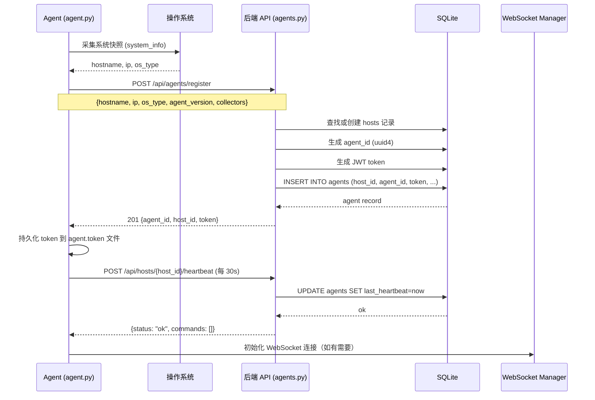
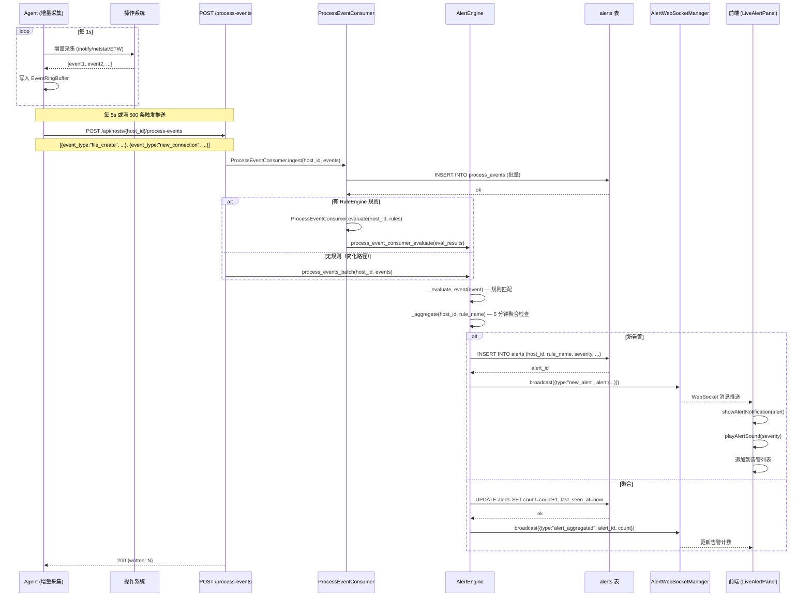
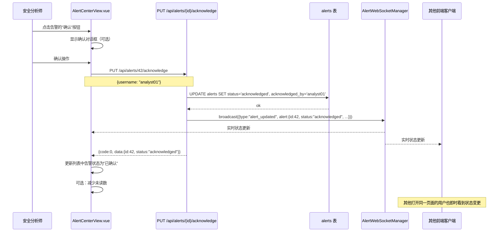

# 实时监控模块 — 详细设计方案

> **迭代版本**: v1.0  
> **架构师**: 高见远 (Gao)  
> **日期**: 2026-07-13  
> **状态**: 设计就绪  

---

## 目录

1. [Agent 端详细改动](#1-agent-端详细改动)
2. [后端实时告警引擎](#2-后端实时告警引擎)
3. [API 设计](#3-api-设计)
4. [前端改动](#4-前端改动)
5. [时序图](#5-时序图)
6. [文件变更清单](#6-文件变更清单)
7. [依赖清单](#7-依赖清单)

---

## 1. Agent 端详细改动

### 1.1 `agent.py` — 新增 `--daemon` 模式

#### 新增命令行参数

在 `parse_args()` 函数中追加三个参数：

```python
# ── 常驻模式参数 ──
parser.add_argument(
    "--daemon",
    action="store_true",
    help="以常驻模式运行（7×24 实时监控），配合 --server 和 --token",
)
parser.add_argument(
    "--server",
    default="http://127.0.0.1:8000",
    help="平台后端地址（常驻模式必需），默认 http://127.0.0.1:8000",
)
parser.add_argument(
    "--token",
    default=None,
    help="Agent 认证令牌（常驻模式必需，首次注册后获取）",
)
```

#### 函数签名: `run_daemon()`

```python
def run_daemon(
    server_url: str,
    agent_token: str,
    collect_names: list,
    log_days: int = 7,
    heartbeat_interval: int = 30,
    push_interval: float = 5.0,
    max_batch_size: int = 500,
) -> None:
    """以常驻模式运行 Agent：注册 → 事件循环 → 心跳 → 断开。

    Args:
        server_url: 平台后端基础 URL（如 http://平台:8000）。
        agent_token: Agent 认证令牌（用于 API 请求鉴权）。
        collect_names: 采集器名称列表。
        log_days: 传递各采集器的日志天数。
        heartbeat_interval: 心跳间隔（秒），默认 30s。
        push_interval: 事件推送间隔（秒），默认 5s。
        max_batch_size: 单次推送最大事件数，默认 500。

    Raises:
        SystemExit: 注册失败时立即退出。
        KeyboardInterrupt: 收到 SIGTERM/SIGINT 时触发断开流程。

    Note:
        事件循环内部每 1 秒轮询一次增量采集器，达到 push_interval
        或 buffer 满 max_batch_size 条时触发推送。
        心跳独立计时，每 heartbeat_interval 秒发送一次。
    """
```

#### 辅助函数

```python
def _register_agent(server_url: str, system_info: dict) -> dict:
    """向平台注册 Agent，返回 {host_id, agent_id, token}。

    Args:
        server_url: 平台后端 URL。
        system_info: 系统信息（hostname, ip, os_type 等）。

    Returns:
        {"host_id": int, "agent_id": str, "token": str}

    Raises:
        requests.ConnectionError: 平台不可达。
        requests.HTTPError: 注册被拒（HTTP 4xx/5xx）。
    """
```

```python
def _send_heartbeat(
    server_url: str, host_id: int, agent_token: str,
    cpu: float, memory: float,
) -> dict:
    """发送心跳到平台，返回平台下发的指令列表。

    Args:
        server_url: 平台 URL。
        host_id: 主机 ID。
        agent_token: 认证令牌。
        cpu: 当前 CPU 使用率（%）。
        memory: 当前内存使用率（%）。

    Returns:
        {"status": "ok", "commands": [...]} —— commands 为平台下发的指令列表。

    Raises:
        requests.ConnectionError: 平台不可达。
        requests.HTTPError: 心跳被拒。
    """
```

```python
def _push_events(
    server_url: str, host_id: int, agent_token: str,
    events: list,
) -> int:
    """批量推送增量事件到平台。

    Args:
        server_url: 平台 URL。
        host_id: 主机 ID。
        agent_token: 认证令牌。
        events: 事件列表，每项为 dict。

    Returns:
        int: 平台接收的事件数。

    Raises:
        requests.Timeout: 推送超时（5s 超时）。
        requests.HTTPError: 推送被拒。
    """
```

```python
def _collect_incremental_events(collect_names: list) -> list:
    """执行增量采集器，返回增量事件列表。

    只执行以下注册为 incr 模式的采集器：
    - process_events: 增量进程事件
    - file_watcher: 文件变更事件
    - network_watcher: 网络连接增量

    每个采集器返回 list[dict]，全部合并后返回。

    Args:
        collect_names: 采集器名称列表。

    Returns:
        list[dict]: 增量事件列表（可能为空）。
    """
```

```python
def _disconnect_agent(server_url: str, host_id: int, agent_token: str, reason: str = "shutdown") -> bool:
    """通知平台 Agent 即将断开。

    Args:
        server_url: 平台 URL。
        host_id: 主机 ID。
        agent_token: 认证令牌。
        reason: 断开原因（shutdown / upgrade / error）。

    Returns:
        True 表示通知成功，False 表示平台不可达或拒绝。
    """
```

#### `run_daemon()` 完整伪代码

```
def run_daemon(server_url, agent_token, collect_names, ...):
    # ── Phase 1: 注册 ──
    sys_info_collector = load_collector("system_info")
    system_info = sys_info_collector.collect()
    system_info["collectors"] = collect_names

    if not agent_token:
        reg = _register_agent(server_url, system_info)
        host_id = reg["host_id"]
        agent_token = reg["token"]
        token_file = Path("agent.token")
        token_file.write_text(agent_token)  # 持久化供下次使用
    else:
        host_id = load_host_id_from_token(agent_token)  # 从本地缓存读取

    # ── Phase 2: 初始快照采集 ──
    run_collectors(collect_names)  # 一次性采集，结果写入本地 JSON（兼容现有流程）

    # ── Phase 3: 增量采集器初始化 ──
    incr_collectors = []
    for name in ["file_watcher", "network_watcher", "process_events"]:
        if name in collect_names:
            c = load_collector(name)
            c.start()          # 采集器初始化（如启动 inotify watch）
            incr_collectors.append(c)

    # ── Phase 4: 事件循环 ──
    heartbeat_timer = time.time()
    last_push_time = time.time()
    buffer = EventRingBuffer(max_size=push_interval, max_count=max_batch_size)

    signal.signal(signal.SIGTERM, _handle_shutdown)
    signal.signal(signal.SIGINT, _handle_shutdown)
    running = True

    try:
        while running:
            now = time.time()

            # 4a) 增量采集
            for collector in incr_collectors:
                try:
                    events = collector.collect()   # 增量采集器.collect() 返回 list
                    for ev in events:
                        buffer.push(ev)
                except Exception as exc:
                    logger.warning("增量采集 [%s] 失败: %s", collector.__class__.__name__, exc)

            # 4b) 推送事件
            if buffer.should_flush(now, last_push_time):
                batch = buffer.flush()
                if batch:
                    try:
                        _push_events(server_url, host_id, agent_token, batch)
                    except Exception as exc:
                        logger.error("推送事件失败: %s，重新入队 %d 条", exc, len(batch))
                        buffer.repush(batch)
                last_push_time = now

            # 4c) 心跳
            if now - heartbeat_timer >= heartbeat_interval:
                cpu = psutil.cpu_percent()
                memory = psutil.virtual_memory().percent
                try:
                    resp = _send_heartbeat(server_url, host_id, agent_token, cpu, memory)
                    commands = resp.get("commands", [])
                    for cmd in commands:
                        _execute_remote_command(cmd)
                except Exception as exc:
                    logger.warning("心跳失败: %s", exc)
                heartbeat_timer = now

            time.sleep(1)

    except (KeyboardInterrupt, SystemExit):
        logger.info("收到退出信号，执行断开流程...")

    finally:
        # ── Phase 5: 断开 ──
        remaining = buffer.flush()
        if remaining:
            try:
                _push_events(server_url, host_id, agent_token, remaining)
            except Exception as exc:
                logger.error("断开前推送剩余事件失败: %s", exc)
        _disconnect_agent(server_url, host_id, agent_token, "shutdown")
        for collector in incr_collectors:
            collector.stop()
        logger.info("Agent 已断开")
```

#### `main()` 函数改动

```python
def main() -> None:
    """Agent 主入口函数。"""

    # ... 现有参数解析、日志初始化、权限检查 ...

    # ── 判断是否以常驻模式运行 ──
    if args.daemon:
        logger.info("=== Agent 常驻模式启动 ===")

        if args.collect == "all":
            collect_names = list(COLLECTOR_MAP.keys())
        else:
            collect_names = [c.strip() for c in args.collect.split(",") if c.strip()]

        # 确保增量采集器包含在内
        required_incr = {"process_events", "file_watcher", "network_watcher"}
        missing = required_incr - set(collect_names)
        if missing:
            logger.warning("常驻模式推荐启用增量采集器: %s", ", ".join(missing))

        # 读取本地缓存的 token
        token = args.token
        if not token:
            try:
                token_file = Path("agent.token")
                if token_file.exists():
                    token = token_file.read_text().strip()
            except Exception:
                pass

        run_daemon(
            server_url=args.server,
            agent_token=token,
            collect_names=collect_names,
            log_days=args.log_days,
        )
        return  # 常驻模式不会走到后续一次性采集逻辑

    # ── 原有一次性采集逻辑保持不变 ──
    # ...
```

---

### 1.2 新增 `collectors/file_watcher.py`

```python
"""文件变更监控采集器 — 增量采集文件创建/修改/删除事件.

平台适配:
- Linux: 通过 pyinotify 或 select.poll 监听 inotify 事件.
- Windows: 通过 ctypes 调用 ReadDirectoryChangesW API.

重点关注目录:
- Web 目录: /var/www, /usr/share/nginx/html, C:\inetpub\wwwroot
- 系统目录: /etc, /etc/cron*, /tmp, C:\Windows\System32
- 用户目录: ~/.ssh, ~/.config

线程安全: BaseCollector.start()/stop() 控制监控线程生命周期.
"""

import os
import platform
import threading
import time
from datetime import datetime
from typing import Optional

from collectors.base_collector import BaseCollector


class FileWatcherCollector(BaseCollector):
    """文件变更监控采集器.

    属性:
        _watch_thread: 后台监控线程.
        _running: 线程运行标志.
        _buffer: 线程安全的事件缓冲区 list + Lock.
        _watch_dirs: 要监控的目录列表（自动按平台选择）.
        _poll_interval: 轮询/等待间隔（秒），默认 1.0.
    """

    def __init__(self, log_days: int = 7):
        super().__init__(log_days=log_days)
        self._watch_thread: Optional[threading.Thread] = None
        self._running = False
        self._buffer: list = []
        self._lock = threading.Lock()
        self._poll_interval = 1.0

    def is_supported(self) -> bool:
        """Windows 和 Linux 均支持。"""
        return platform.system() in ("Windows", "Linux")

    def collect(self) -> list:
        """返回自上次 collect 以来累积的文件变更事件，并清空内部缓冲区。

        Returns:
            list[dict]: 事件列表，每项格式:
                {
                    "event_type": "file_create" | "file_modify" | "file_delete",
                    "file_path": "/absolute/path/to/file",
                    "file_name": "file.ext",
                    "file_extension": ".ext",
                    "file_size": 1024,
                    "process_pid": 1234,       # 可能为空
                    "process_name": "vim",      # 可能为空
                    "timestamp": "2026-07-13T10:30:00"
                }
        """
        with self._lock:
            events = list(self._buffer)
            self._buffer.clear()
        return events

    def start(self) -> None:
        """启动后台监控线程。"""
        if self._running:
            return
        self._running = True
        self._watch_dirs = self._get_watch_dirs()
        self._watch_thread = threading.Thread(target=self._watch_loop, daemon=True)
        self._watch_thread.start()
        logger.info("FileWatcherCollector 已启动，监控 %d 个目录", len(self._watch_dirs))

    def stop(self) -> None:
        """停止后台监控线程。"""
        self._running = False
        if self._watch_thread and self._watch_thread.is_alive():
            self._watch_thread.join(timeout=3)

    # ── 内部方法 ──

    def _get_watch_dirs(self) -> list:
        """根据平台返回要监控的目录列表。

        Returns:
            list[str]: 目录绝对路径列表（仅包含确实存在的目录）。
        """
        dirs = []
        if platform.system() == "Linux":
            candidates = [
                "/etc", "/tmp", "/var/www", "/var/www/html",
                "/usr/share/nginx/html", "/etc/ssh", "/etc/cron.d",
                "/etc/cron.daily", "/etc/cron.hourly",
                os.path.expanduser("~/.ssh"),
                os.path.expanduser("~/.config"),
            ]
        elif platform.system() == "Windows":
            candidates = [
                "C:\\Windows\\System32",
                "C:\\Windows\\SysWOW64",
                "C:\\inetpub\\wwwroot",
                os.path.expanduser("~\\.ssh"),
                os.path.expanduser("~\\.config"),
                os.path.expanduser("~\\AppData\\Roaming"),
                os.path.expanduser("~\\AppData\\Local\\Temp"),
            ]
        else:
            return []

        for d in candidates:
            if os.path.isdir(d):
                dirs.append(d)
        return dirs

    def _watch_loop(self) -> None:
        """监控主循环 — 根据平台选择底层实现。"""
        if platform.system() == "Linux":
            self._watch_linux_inotify()
        elif platform.system() == "Windows":
            self._watch_windows_readdir()

    def _watch_linux_inotify(self) -> None:
        """Linux: 使用 pyinotify 监控文件变更。

        降级方案: 若 pyinotify 不可用，回退到每隔 poll_interval 秒
        用 os.listdir + stat 做前后对比（性能较差但可行）。
        """
        try:
            import pyinotify  # type: ignore
            self._run_pyinotify(pyinotify)
        except ImportError:
            logger.warning("pyinotify 未安装，降级为轮询对比模式")
            self._polling_watch()

    def _run_pyinotify(self, pyinotify) -> None:
        """使用 pyinotify 库进行实时文件监控。

        注册 IN_CREATE | IN_MODIFY | IN_DELETE | IN_MOVED_FROM | IN_MOVED_TO 事件。
        """
        class _EventHandler(pyinotify.ProcessEvent):
            def __init__(self, collector):
                self.collector = collector

            def process_IN_CREATE(self, event):
                self.collector._enqueue("file_create", event.pathname)

            def process_IN_MODIFY(self, event):
                self.collector._enqueue("file_modify", event.pathname)

            def process_IN_DELETE(self, event):
                self.collector._enqueue("file_delete", event.pathname)

            def process_IN_MOVED_TO(self, event):
                self.collector._enqueue("file_create", event.pathname)

            def process_IN_MOVED_FROM(self, event):
                self.collector._enqueue("file_delete", event.pathname)

        wm = pyinotify.WatchManager()
        handler = _EventHandler(self)
        notifier = pyinotify.Notifier(wm, handler)
        mask = (
            pyinotify.IN_CREATE | pyinotify.IN_MODIFY | pyinotify.IN_DELETE
            | pyinotify.IN_MOVED_FROM | pyinotify.IN_MOVED_TO
        )
        for watch_dir in self._watch_dirs:
            try:
                wm.add_watch(watch_dir, mask, rec=True, auto_add=True)
            except pyinotify.WatchManagerError as exc:
                logger.warning("无法监控目录 %s: %s", watch_dir, exc)

        # 阻塞事件循环，每 1s 检查一次 running 标志
        while self._running:
            notifier.process(timeout=1000)

    def _polling_watch(self) -> None:
        """降级方案: 轮询对比目录快照。"""
        snapshots = {d: self._snapshot_dir(d) for d in self._watch_dirs}
        while self._running:
            time.sleep(self._poll_interval)
            for watch_dir in self._watch_dirs:
                try:
                    current = self._snapshot_dir(watch_dir)
                    old = snapshots.get(watch_dir, {})
                    # 检测新增和修改
                    for path, mtime in current.items():
                        if path not in old:
                            self._enqueue("file_create", path)
                        elif old[path] != mtime:
                            self._enqueue("file_modify", path)
                    # 检测删除
                    for path in old:
                        if path not in current:
                            self._enqueue("file_delete", path)
                    snapshots[watch_dir] = current
                except Exception as exc:
                    logger.warning("轮询目录 %s 失败: %s", watch_dir, exc)

    def _watch_windows_readdir(self) -> None:
        """Windows: 使用 ReadDirectoryChangesW API (ctypes)。

        降级方案: 若 ctypes 调用失败，回退到轮询对比模式。
        """
        try:
            self._run_readdirectorychangesw()
        except Exception as exc:
            logger.warning("ReadDirectoryChangesW 初始化失败: %s，降级为轮询", exc)
            self._polling_watch()

    def _run_readdirectorychangesw(self) -> None:
        """Windows 原生 API 实现 — 通过 ctypes 调用 kernel32 的 ReadDirectoryChangesW。"""
        import ctypes
        from ctypes import wintypes

        # 常量定义
        FILE_LIST_DIRECTORY = 0x0001
        INVALID_HANDLE_VALUE = ctypes.c_void_p(-1).value

        # 每个目录独立线程
        threads = []
        for watch_dir in self._watch_dirs:
            t = threading.Thread(
                target=self._readdir_thread,
                args=(watch_dir,),
                daemon=True,
            )
            t.start()
            threads.append(t)

        for t in threads:
            t.join()

    def _readdir_thread(self, watch_dir: str) -> None:
        """单个目录的 ReadDirectoryChangesW 监控线程。"""
        import ctypes
        from ctypes import wintypes

        # 动态定义所需结构体和函数
        kernel32 = ctypes.windll.kernel32  # type: ignore

        # 打开目录句柄
        handle = kernel32.CreateFileW(
            watch_dir,
            0x0001,  # FILE_LIST_DIRECTORY
            0x00000003,  # FILE_SHARE_READ | FILE_SHARE_WRITE
            None,
            0x00000003,  # OPEN_EXISTING
            0x02000000,  # FILE_FLAG_BACKUP_SEMANTICS
            None,
        )
        if handle in (INVALID_HANDLE_VALUE, -1, 0):
            logger.warning("无法打开目录 %s 的监控句柄", watch_dir)
            return

        buf_size = 1024 * 64
        buf = (ctypes.c_byte * buf_size)()
        bytes_returned = wintypes.DWORD()

        FILE_ACTION_ADDED = 1
        FILE_ACTION_MODIFIED = 3
        FILE_ACTION_REMOVED = 2
        FILE_ACTION_RENAMED_OLD_NAME = 4
        FILE_ACTION_RENAMED_NEW_NAME = 5

        while self._running:
            ret = kernel32.ReadDirectoryChangesW(
                handle,
                buf,
                buf_size,
                True,  # bWatchSubtree
                0x00000001 | 0x00000002 | 0x00000004,  # FILE_NOTIFY_CHANGE_FILE_NAME | DIR_NAME | LAST_WRITE
                ctypes.byref(bytes_returned),
                None,
                None,
            )
            if not ret:
                break
            if bytes_returned.value == 0:
                continue

            offset = 0
            while offset < bytes_returned.value:
                action = ctypes.c_int.from_buffer(buf, offset + 12).value
                name_len = ctypes.c_int.from_buffer(buf, offset + 16).value
                name_offset = offset + 20
                if name_len > 0:
                    raw_name = (ctypes.c_wchar * (name_len // 2)).from_buffer(buf, name_offset)
                    file_name = "".join(raw_name).rstrip("\x00")
                    full_path = os.path.join(watch_dir, file_name)

                    event_type_map = {
                        FILE_ACTION_ADDED: "file_create",
                        FILE_ACTION_MODIFIED: "file_modify",
                        FILE_ACTION_REMOVED: "file_delete",
                        FILE_ACTION_RENAMED_NEW_NAME: "file_create",
                        FILE_ACTION_RENAMED_OLD_NAME: "file_delete",
                    }
                    event_type = event_type_map.get(action, "file_modify")
                    self._enqueue(event_type, full_path)

                offset += 20 + ((name_len + 3) & ~3)

        kernel32.CloseHandle(handle)

    def _snapshot_dir(self, directory: str) -> dict:
        """对目录做一次快照: {相对路径: mtime}。"""
        snapshot = {}
        try:
            for root, dirs, files in os.walk(directory, topdown=True):
                # 跳过隐藏目录
                dirs[:] = [d for d in dirs if not d.startswith(".")]
                for fname in files:
                    if fname.startswith("."):
                        continue
                    full = os.path.join(root, fname)
                    try:
                        st = os.stat(full)
                        snapshot[full] = st.st_mtime
                    except OSError:
                        continue
        except PermissionError:
            pass
        return snapshot

    def _enqueue(self, event_type: str, file_path: str) -> None:
        """将文件事件加入内部缓冲区。

        Args:
            event_type: 事件类型（file_create / file_modify / file_delete）。
            file_path: 文件绝对路径。
        """
        timestamp = datetime.now().strftime("%Y-%m-%dT%H:%M:%S")
        event = {
            "event_type": event_type,
            "file_path": file_path,
            "file_name": os.path.basename(file_path),
            "file_extension": os.path.splitext(file_path)[1].lower(),
            "file_size": os.path.getsize(file_path) if os.path.exists(file_path) else 0,
            "process_pid": None,    # inotify/ReadDir 无法直接获取 PID
            "process_name": None,
            "timestamp": timestamp,
            "collected_at": timestamp,
        }
        with self._lock:
            self._buffer.append(event)
```

---

### 1.3 新增 `collectors/network_watcher.py`

```python
"""网络连接增量监控采集器.

每 30s 轮询当前 TCP 连接状态，与上次快照对比，输出新增/断开连接事件。

事件结构:
    {
        "event_type": "new_connection" | "closed_connection",
        "local": "192.168.1.1:54321",
        "remote": "10.0.0.1:443",
        "pid": 1234,
        "process_name": "chrome.exe",
        "state": "ESTABLISHED",
        "timestamp": "2026-07-13T10:30:00"
    }

线程安全: BaseCollector.collect() 返回增量后清空内部缓冲区.
"""

import platform
import subprocess
import threading
import time
from datetime import datetime
from typing import Optional, Set

from collectors.base_collector import BaseCollector


class NetworkWatcherCollector(BaseCollector):
    """网络连接增量监控采集器.

    属性:
        _previous_conns: 上次快照的连接唯一 key 集合.
        _buffer: 线程安全的增量事件缓冲区.
        _lock: 线程锁.
        _poll_interval: 轮询间隔（秒），默认 30.
    """

    def __init__(self, log_days: int = 7):
        super().__init__(log_days=log_days)
        self._previous_conns: Set[str] = set()
        self._buffer: list = []
        self._lock = threading.Lock()
        self._poll_interval = 30
        self._last_collect_time: float = 0
        self._pid_name_cache: dict = {}  # pid → process_name 缓存

    def is_supported(self) -> bool:
        """所有平台均支持（依赖 netstat/ss 或 Get-NetTCPConnection）。"""
        return True

    def collect(self) -> list:
        """轮询当前 TCP 连接，返回与上次采集的增量事件。

        每 30s 执行一次实际的系统命令调用；在间隔内调用返回空列表。

        Returns:
            list[dict]: 增量网络连接事件列表。
        """
        now = time.time()
        if now - self._last_collect_time < self._poll_interval:
            return []

        self._last_collect_time = now
        current_conns, conn_details = self._get_current_connections()
        events = []

        # 新增连接
        for key in current_conns - self._previous_conns:
            detail = conn_details.get(key, {})
            events.append({
                "event_type": "new_connection",
                "local": detail.get("local", ""),
                "remote": detail.get("remote", ""),
                "pid": detail.get("pid"),
                "process_name": detail.get("process_name", ""),
                "state": detail.get("state", ""),
                "protocol": "tcp",
                "timestamp": datetime.now().strftime("%Y-%m-%dT%H:%M:%S"),
            })

        # 断开连接
        for key in self._previous_conns - current_conns:
            events.append({
                "event_type": "closed_connection",
                "local": key.split("→")[0] if "→" in key else "",
                "remote": key.split("→")[1] if "→" in key else "",
                "pid": None,
                "process_name": None,
                "state": "CLOSED",
                "protocol": "tcp",
                "timestamp": datetime.now().strftime("%Y-%m-%dT%H:%M:%S"),
            })

        self._previous_conns = current_conns
        with self._lock:
            self._buffer.extend(events)
        return events

    # ── 内部方法 ──

    def _get_current_connections(self) -> tuple:
        """获取当前 TCP 连接快照。

        Returns:
            (keys_set, details_dict):
                keys_set: Set[str]，每条连接的唯一 key（"local→remote"）。
                details_dict: dict，key → {local, remote, pid, process_name, state}。
        """
        if platform.system() == "Linux":
            return self._get_linux_connections()
        elif platform.system() == "Windows":
            return self._get_windows_connections()
        else:
            return set(), {}

    def _get_linux_connections(self) -> tuple:
        """Linux: 执行 `ss -tunap` 解析 TCP/UDP 连接。"""
        keys: Set[str] = set()
        details: dict = {}

        try:
            # 优先使用 ss（更快，不需要 root）
            output = subprocess.check_output(
                ["ss", "-tunap"],
                stderr=subprocess.DEVNULL,
                timeout=10,
            ).decode("utf-8", errors="replace")
        except (subprocess.SubprocessError, FileNotFoundError):
            try:
                # 降级到 netstat
                output = subprocess.check_output(
                    ["netstat", "-tunap"],
                    stderr=subprocess.DEVNULL,
                    timeout=10,
                ).decode("utf-8", errors="replace")
            except (subprocess.SubprocessError, FileNotFoundError):
                return set(), {}

        for line in output.splitlines():
            parts = line.split()
            if len(parts) < 4:
                continue
            state = parts[0] if parts[0] in (
                "LISTEN", "ESTAB", "TIME-WAIT", "CLOSE-WAIT", "SYN-SENT"
            ) else ""

            # 根据命令输出格式跳过标题行
            if state == "State" or (state == "" and "Recv-Q" in line):
                continue

            # ss 输出: State Recv-Q Send-Q Local:Port Peer:Port
            # netstat 输出: Proto Recv-Q Send-Q Local Address Foreign Address State
            local_field = ""
            remote_field = ""
            pid_field = None
            proc_name = ""

            try:
                if "LISTEN" in line or "ESTAB" in line:
                    # ss 格式
                    idx = 0
                    for i, p in enumerate(parts):
                        if ":" in p and "." in p:
                            idx = i
                            break
                    if idx > 0 and idx + 1 < len(parts):
                        local_field = parts[idx]
                        remote_field = parts[idx + 1]
                    # 尝试提取 pid
                    for part in parts:
                        if "pid=" in part or "users:((" in part:
                            # ss 格式: users:(("chrome",pid=1234,fd=5))
                            import re
                            m = re.search(r'pid=(\d+)', part)
                            if m:
                                pid_field = int(m.group(1))
                            m2 = re.search(r'"([^"]+)"', part)
                            if m2:
                                proc_name = m2.group(1)
                else:
                    # netstat 格式: tcp 0 0 0.0.0.0:22 0.0.0.0:* LISTEN
                    if len(parts) >= 6:
                        local_field = parts[3]
                        remote_field = parts[4]
                        state = parts[5] if len(parts) > 5 else state
                    # netstat 中 pid 信息在末尾: 1234/sshd
                    last_part = parts[-1] if parts else ""
                    if "/" in last_part:
                        try:
                            pid_field = int(last_part.split("/")[0])
                            proc_name = last_part.split("/", 1)[1]
                        except ValueError:
                            pass
            except (IndexError, ValueError):
                continue

            if local_field and remote_field:
                key = f"{local_field}→{remote_field}"
                keys.add(key)
                details[key] = {
                    "local": local_field,
                    "remote": remote_field,
                    "pid": pid_field,
                    "process_name": proc_name,
                    "state": state,
                }

        return keys, details

    def _get_windows_connections(self) -> tuple:
        """Windows: 执行 PowerShell Get-NetTCPConnection。"""
        keys: Set[str] = set()
        details: dict = {}

        try:
            script = (
                "Get-NetTCPConnection | Select-Object "
                "LocalAddress,LocalPort,RemoteAddress,RemotePort,State,OwningProcess "
                "| ConvertTo-Json -Compress"
            )
            output = subprocess.check_output(
                ["powershell", "-NoProfile", "-Command", script],
                stderr=subprocess.DEVNULL,
                timeout=15,
            ).decode("utf-8", errors="replace").strip()
        except subprocess.SubprocessError:
            return set(), {}

        if not output or output == "[]":
            return set(), {}

        import json
        try:
            conns = json.loads(output)
            if isinstance(conns, dict):
                conns = [conns]
            for conn in conns:
                local = f"{conn.get('LocalAddress', '')}:{conn.get('LocalPort', '')}"
                remote = f"{conn.get('RemoteAddress', '')}:{conn.get('RemotePort', '')}"
                pid = conn.get("OwningProcess")
                # 解析 OwningProcess 为 int
                if pid is not None:
                    try:
                        pid = int(pid)
                    except (ValueError, TypeError):
                        pid = None
                proc_name = self._resolve_windows_process_name(pid) if pid else ""

                key = f"{local}→{remote}"
                keys.add(key)
                details[key] = {
                    "local": local,
                    "remote": remote,
                    "pid": pid,
                    "process_name": proc_name,
                    "state": conn.get("State", ""),
                }
        except (json.JSONDecodeError, TypeError):
            pass

        return keys, details

    def _resolve_windows_process_name(self, pid: int) -> str:
        """通过 pid 解析进程名（带缓存）。"""
        if pid in self._pid_name_cache:
            return self._pid_name_cache[pid]
        try:
            import ctypes
            # 使用 wmic 或 tasklist 查询进程名
            output = subprocess.check_output(
                ["tasklist", "/FI", f"PID eq {pid}", "/NH", "/FO", "CSV"],
                timeout=5,
            ).decode("utf-8", errors="replace")
            if '"' in output:
                name = output.split('"')[1] if '"' in output else str(pid)
                self._pid_name_cache[pid] = name
                return name
        except (subprocess.SubprocessError, IndexError):
            pass
        self._pid_name_cache[pid] = str(pid)
        return str(pid)

    def start(self) -> None:
        """初始化：采集首轮快照。"""
        self._previous_conns, _ = self._get_current_connections()
        logger.info("NetworkWatcherCollector 已启动，初始连接数: %d", len(self._previous_conns))

    def stop(self) -> None:
        """清理资源。"""
        self._pid_name_cache.clear()
        logger.info("NetworkWatcherCollector 已停止")
```

---

### 1.4 `agent.py` 的 `COLLECTOR_MAP` 和 `_LIST_COLLECTORS` 改动

```python
# ── COLLECTOR_MAP 追加 ──
COLLECTOR_MAP.update({
    "file_watcher": "collectors.file_watcher.FileWatcherCollector",
    "network_watcher": "collectors.network_watcher.NetworkWatcherCollector",
})

# ── _LIST_COLLECTORS 追加 ──
_LIST_COLLECTORS.update({"file_watcher", "network_watcher"})
```

---

## 2. 后端实时告警引擎

### 2.1 `alerts` 表 DDL（完整建表语句）

```sql
-- ================================================================
-- alerts — 实时告警表
--
-- 告警生命周期:
--   open → acknowledged → resolved
--                     → dismissed
--
-- 聚合规则:
--   同一 host + 同一 rule_name + status='open' + last_seen_at > 当前时间-5分钟
--   => 视为重复告警，count+1, last_seen_at 更新
-- ================================================================
CREATE TABLE IF NOT EXISTS alerts (
    id              INTEGER PRIMARY KEY AUTOINCREMENT,
    host_id         INTEGER NOT NULL REFERENCES hosts(id) ON DELETE CASCADE,
    case_id         INTEGER REFERENCES cases(id),          -- 关联案件（可选）
    rule_name       TEXT    NOT NULL,                       -- 命中规则唯一标识
    rule_label      TEXT,                                   -- 规则可读标签（如"可疑 certutil 下载"）
    severity        TEXT    NOT NULL DEFAULT 'medium'       -- critical / high / medium / low
        CHECK(severity IN ('critical','high','medium','low')),
    status          TEXT    NOT NULL DEFAULT 'open'         -- open / acknowledged / resolved / dismissed
        CHECK(status IN ('open','acknowledged','resolved','dismissed')),
    title           TEXT    NOT NULL,                       -- 告警标题（摘要）
    detail          TEXT,                                   -- 告警详情（JSON，含上下文信息）
    source_pid      INTEGER,                                -- 触发事件的 PID
    source_process  TEXT,                                   -- 触发事件的进程名
    source_path     TEXT,                                   -- 触发事件的路径
    source_ip       TEXT,                                   -- 触发事件的 IP 地址
    count           INTEGER DEFAULT 1,                      -- 聚合计数
    first_seen_at   TEXT    NOT NULL DEFAULT (datetime('now')),  -- 首次触发时间
    last_seen_at    TEXT    NOT NULL DEFAULT (datetime('now')),   -- 最近触发时间
    acknowledged_by TEXT,                                   -- 确认人用户名
    acknowledged_at TEXT,                                   -- 确认时间
    resolved_at     TEXT,                                   -- 解决时间
    dismissed_reason TEXT                                   -- 忽略原因
);

CREATE INDEX IF NOT EXISTS idx_alerts_host_id ON alerts(host_id);
CREATE INDEX IF NOT EXISTS idx_alerts_status ON alerts(status);
CREATE INDEX IF NOT EXISTS idx_alerts_severity ON alerts(severity);
CREATE INDEX IF NOT EXISTS idx_alerts_rule_name ON alerts(rule_name);
CREATE INDEX IF NOT EXISTS idx_alerts_last_seen ON alerts(last_seen_at);
CREATE INDEX IF NOT EXISTS idx_alerts_host_status ON alerts(host_id, status);
```

---

### 2.2 `agents` 表 DDL

```sql
-- ================================================================
-- agents — Agent 注册表
--
-- 每个主机只有一个活跃 Agent（由 agent_id 唯一标识）。
-- last_heartbeat 用于检测在线状态（超过 90s 未收到心跳视为离线）。
-- ================================================================
CREATE TABLE IF NOT EXISTS agents (
    id              INTEGER PRIMARY KEY AUTOINCREMENT,
    host_id         INTEGER NOT NULL REFERENCES hosts(id) ON DELETE CASCADE,
    agent_id        TEXT    NOT NULL UNIQUE,                -- Agent UUID（如 "agent-uuid-xxxx"）
    agent_version   TEXT    NOT NULL,                       -- Agent 版本号
    token           TEXT    NOT NULL,                       -- 认证令牌（Bearer token）
    collectors      TEXT,                                   -- 注册的采集器列表（JSON array）
    ip_address      TEXT,                                   -- Agent 出口 IP
    hostname        TEXT,                                   -- Agent 主机名
    os_type         TEXT,                                   -- 操作系统类型
    last_heartbeat  TEXT,                                   -- 上次心跳时间
    cpu_usage       REAL    DEFAULT 0.0,                    -- 最近一次 CPU 使用率
    memory_usage    REAL    DEFAULT 0.0,                    -- 最近一次内存使用率
    connected_at    TEXT    NOT NULL DEFAULT (datetime('now')),  -- 首次连接时间
    disconnected_at TEXT,                                   -- 断开时间
    status          TEXT    NOT NULL DEFAULT 'online'       -- online / offline
        CHECK(status IN ('online', 'offline')),
    created_at      TEXT    NOT NULL DEFAULT (datetime('now')),
    updated_at      TEXT    NOT NULL DEFAULT (datetime('now'))
);

CREATE UNIQUE INDEX IF NOT EXISTS idx_agents_host_id ON agents(host_id);
CREATE INDEX IF NOT EXISTS idx_agents_status ON agents(status);
CREATE INDEX IF NOT EXISTS idx_agents_heartbeat ON agents(last_heartbeat);
```

---

### 2.3 `AlertEngine` 类设计

```python
"""实时告警引擎 — 事件 → 规则匹配 → 聚合 → WebSocket 广播.

职责链:
    ProcessEventConsumer.evaluate() 或增量事件 → AlertEngine.process_event()
        → _evaluate_event() 复用 RuleEngine
        → _aggregate() 5 分钟内同规则聚合
        → WebSocket 广播新告警
        → 写入 alerts 表
"""

import json
import logging
from datetime import datetime, timedelta
from typing import Optional

from app.database import get_connection
from app.models.alert import Alert
from app.rules.rule_engine import RuleEngine

logger = logging.getLogger(__name__)

# 聚合窗口（秒）
AGGREGATION_WINDOW_SECONDS = 300  # 5 分钟


class AlertEngine:
    """实时告警引擎.

    处理平台收到的事件流，按规则评估 → 聚合 → 持久化 → WebSocket 广播。
    单例模式，在 Application 启动时初始化。

    属性:
        ws_manager: AlertWebSocketManager 实例，用于广播告警。
        rules: 缓存的实时规则列表（定期刷新）。
        _rule_last_refresh: 规则缓存刷新时间戳。
    """

    def __init__(self, ws_manager: "AlertWebSocketManager"):
        """初始化告警引擎。

        Args:
            ws_manager: WebSocket 连接管理器，用于广播新告警。
        """
        self.ws_manager = ws_manager
        self.rules: list = []
        self._rule_last_refresh: float = 0.0

    def process_event(self, host_id: int, event: dict) -> Optional[dict]:
        """处理单条事件，返回新创建的告警 dict 或 None（已聚合）。

        流程:
            1. 用 RuleEngine 评估事件是否有告警价值
            2. 对命中结果做告警聚合检查
            3. 新告警写入 alerts 表
            4. 通过 WebSocket 广播新告警

        Args:
            host_id: 主机 ID.
            event: 原始事件 dict（含 event_type、pid、process_name 等字段）.

        Returns:
            新创建的告警 dict（聚合场景返回 None）.
        """
        # 1. 规则评估
        matched_alerts = self._evaluate_event(event)
        if not matched_alerts:
            return None

        created_alert = None

        for alert_data in matched_alerts:
            rule_name = alert_data.get("rule_name", "unknown")
            severity = alert_data.get("severity", "medium")
            title = alert_data.get("title", "")
            detail = alert_data.get("detail", {})

            # 2. 聚合检查
            if self._aggregate(host_id, rule_name):
                logger.debug("告警已聚合: host_id=%s rule=%s", host_id, rule_name)
                continue

            # 3. 创建新告警
            alert_dict = Alert.create(
                host_id=host_id,
                rule_name=rule_name,
                rule_label=alert_data.get("rule_label"),
                severity=severity,
                title=title,
                detail=json.dumps(detail, ensure_ascii=False) if detail else None,
                source_pid=event.get("pid"),
                source_process=event.get("process_name") or event.get("name"),
                source_path=event.get("process_path") or event.get("path") or event.get("file_path"),
                source_ip=event.get("remote", "").split(":")[0] if event.get("remote") else None,
            )

            # 4. WebSocket 广播
            broadcast_data = {
                "type": "new_alert",
                "alert": alert_dict,
                "host_id": host_id,
            }
            self.ws_manager.broadcast(broadcast_data)

            created_alert = alert_dict
            logger.info("新告警: host_id=%s rule=%s severity=%s", host_id, rule_name, severity)

        return created_alert

    def process_events_batch(self, host_id: int, events: list) -> list:
        """批量处理事件，返回新创建的告警列表。

        Args:
            host_id: 主机 ID.
            events: 事件列表.

        Returns:
            新创建的告警 dict 列表（已完成的聚合不包含）。.
        """
        self._refresh_rules_if_needed()
        results = []
        for event in events:
            alert = self.process_event(host_id, event)
            if alert:
                results.append(alert)
        return results

    def process_event_consumer_evaluate(
        self,
        host_id: int,
        eval_results: list,
    ) -> list:
        """处理 ProcessEventConsumer.evaluate() 的批量评估结果。

        evaluate() 返回的是异常进程列表（每个含 rule_name 等），
        这里将其转为告警。

        Args:
            host_id: 主机 ID.
            eval_results: evaluate() 输出列表（每项含 rule_name, severity 等）.

        Returns:
            新创建的告警列表.
        """
        alerts_created = []
        for result in eval_results or []:
            if not isinstance(result, dict):
                continue
            rule_name = result.get("rule_name") or result.get("matched_rule", "unknown")
            severity = result.get("severity", "medium")
            title = result.get("reason") or result.get("title", "")
            process_name = result.get("name") or result.get("process_name", "")
            pid = result.get("pid")

            if self._aggregate(host_id, rule_name):
                continue

            alert_dict = Alert.create(
                host_id=host_id,
                rule_name=rule_name,
                rule_label=None,
                severity=severity,
                title=title,
                detail=json.dumps(result, ensure_ascii=False, default=str),
                source_pid=pid,
                source_process=process_name,
                source_path=None,
                source_ip=None,
            )

            broadcast_data = {
                "type": "new_alert",
                "alert": alert_dict,
                "host_id": host_id,
            }
            self.ws_manager.broadcast(broadcast_data)
            alerts_created.append(alert_dict)

        return alerts_created

    def _aggregate(self, host_id: int, rule_name: str) -> bool:
        """检查是否需要聚合（5 分钟内已有相同未处理告警）。

        Args:
            host_id: 主机 ID.
            rule_name: 规则名称.

        Returns:
            True 表示已聚合（已更新 count+1），False 表示无匹配需新建。
        """
        cutoff = (datetime.now() - timedelta(seconds=AGGREGATION_WINDOW_SECONDS)).strftime(
            "%Y-%m-%dT%H:%M:%S"
        )
        with get_connection() as conn:
            row = conn.execute(
                """
                SELECT id, count FROM alerts
                WHERE host_id = ? AND rule_name = ? AND status = 'open'
                  AND last_seen_at > ?
                ORDER BY id DESC LIMIT 1
                """,
                (host_id, rule_name, cutoff),
            ).fetchone()

            if row:
                conn.execute(
                    """
                    UPDATE alerts SET count = count + 1, last_seen_at = datetime('now')
                    WHERE id = ?
                    """,
                    (row["id"],),
                )
                # 广播聚合更新
                self.ws_manager.broadcast({
                    "type": "alert_aggregated",
                    "alert_id": row["id"],
                    "count": row["count"] + 1,
                    "host_id": host_id,
                })
                return True
        return False

    def _evaluate_event(self, event: dict) -> list:
        """用 RuleEngine 评估单条事件，返回命中的告警描述列表。

        Args:
            event: 原始事件 dict.

        Returns:
            list[dict]: 告警描述列表（未命中返回 []）。
                每项: {
                    "rule_name": str,
                    "rule_label": str,
                    "severity": str,
                    "title": str,
                    "detail": dict,
                }
        """
        self._refresh_rules_if_needed()
        # 将事件包装为 RuleEngine 接受的格式
        items = [event]
        global_context = {
            "all_items": items,
            "iocs_by_type": RuleEngine._load_iocs_by_type(),
        }
        matches = RuleEngine.evaluate(items, self.rules, global_context=global_context)
        results = []
        for match in matches or []:
            results.append({
                "rule_name": match.get("rule_name") or match.get("matched_rule", "unknown"),
                "rule_label": match.get("rule_label"),
                "severity": match.get("severity", "medium"),
                "title": match.get("reason") or match.get("title", "事件触发告警"),
                "detail": match,
            })
        if not results:
            # 内置规则：事件速率分析、异常行为检测等
            results = self._builtin_rules(event)
        return results

    def _builtin_rules(self, event: dict) -> list:
        """内置规则 — 对事件进行通用异常检测。

        当前内置规则:
        - high_value_connection: 连接到高危端口/已知恶意 IP（简化版）
        - suspicious_file_change: 在敏感目录的文件变更
        - unknown_process_connection: 未知进程建立外连

        Args:
            event: 事件 dict.

        Returns:
            list[dict]: 命中的告警（可扩展）.
        """
        results = []
        event_type = event.get("event_type", "")

        # 网络连接类事件
        if "connection" in event_type:
            remote = event.get("remote", "")
            if remote:
                ip_part = remote.split(":")[0]
                if ip_part and not ip_part.startswith(("10.", "172.16.", "172.17.", "172.18.",
                    "172.19.", "172.20.", "172.21.", "172.22.", "172.23.",
                    "172.24.", "172.25.", "172.26.", "172.27.", "172.28.",
                    "172.29.", "172.30.", "172.31.", "192.168.", "127.",
                    "0.", "::")):
                    results.append({
                        "rule_name": "external_connection",
                        "rule_label": "非内网 IP 外连",
                        "severity": "medium",
                        "title": f"主机连接外部 IP: {ip_part}",
                        "detail": event,
                    })

        # 文件变更类事件
        if event_type.startswith("file_"):
            file_path = event.get("file_path", "")
            if file_path and any(s in file_path.lower() for s in (
                "cron", "system32", "syswow64", "startup", "ssh",
                ".exe", ".dll", ".ps1", ".vbs", ".jar",
            )):
                results.append({
                    "rule_name": "sensitive_file_change",
                    "rule_label": "敏感文件变更",
                    "severity": "high",
                    "title": f"敏感目录文件变更: {event.get('file_name', '')}",
                    "detail": event,
                })

        return results

    def _refresh_rules_if_needed(self) -> None:
        """按需刷新规则缓存（每 60s 重新加载一次）。"""
        import time
        now = time.time()
        if now - self._rule_last_refresh > 60:
            try:
                from app.rules.loader import load_all_rules
                self.rules = load_all_rules()
                self._rule_last_refresh = now
                logger.debug("规则缓存已刷新: %d 条", len(self.rules))
            except Exception as exc:
                logger.warning("刷新规则缓存失败: %s", exc)
```

```python
# ── 告警引擎 UML（PlantUML 格式）──

' ┌──────────────────┐       ┌─────────────────────┐
' │  AlertEngine     │       │  AlertWebSocket      │
' │                  │       │  Manager             │
' │  +process_event()│──────>│  +broadcast()        │
' │  +process_batch()│       │  +connect()          │
' │  -_aggregate()   │       │  +disconnect()       │
' │  -_evaluate()    │       └─────────────────────┘
' │  -_builtin_rules()│              │
' └────────┬─────────┘              │ uses
'          │ uses                   ▼
'          ▼               ┌─────────────────────┐
'  ┌──────────────┐        │  WebSocket (FastAPI)│
'  │  RuleEngine  │        └─────────────────────┘
'  │  +evaluate() │
'  └──────────────┘
'          │
'          ▼
'  ┌──────────────┐
'  │  Alert       │ (Model)
'  │  +create()   │
'  │  +acknowledge│
'  │  +resolve()  │
'  │  +dismiss()  │
'  └──────────────┘
```

---

### 2.4 `AlertWebSocketManager` 类设计

```python
"""WebSocket 连接管理器 — 负责告警/事件的实时推送.

支持两类 WebSocket 连接:
1. /api/ws/alerts — 全局告警推送（所有用户接收）
2. /api/ws/events — 指定主机事件流（需 host_id 参数）

用户认证通过 query parameter token 进行.
"""

import json
import logging
from typing import Dict, List, Optional

from fastapi import WebSocket, WebSocketDisconnect

logger = logging.getLogger(__name__)


class AlertWebSocketManager:
    """WebSocket 连接管理器.

    每个用户可建立多条 WebSocket 连接（多 tab 场景），
    广播时遍历所有连接发送；发送失败自动清理断连.

    属性:
        _connections: user_id → list[WebSocket]，多连接支持.
        _host_subscriptions: host_id → set[user_id]，按主机订阅.
    """

    def __init__(self):
        self._connections: Dict[int, List[WebSocket]] = {}
        self._host_subscriptions: Dict[int, set] = {}

    async def connect(self, user_id: int, websocket: WebSocket) -> None:
        """接受 WebSocket 连接.

        Args:
            user_id: 用户 ID（通过 token 解析）.
            websocket: FastAPI WebSocket 实例.

        Raises:
            WebSocketDisconnect: 在 accept 阶段客户端断开.
        """
        await websocket.accept()
        self._connections.setdefault(user_id, []).append(websocket)
        logger.info("WebSocket 连接: user_id=%s 当前连接数=%d",
                     user_id, len(self._connections[user_id]))

    def disconnect(self, user_id: int, websocket: WebSocket) -> None:
        """断开 WebSocket 连接并清理.

        Args:
            user_id: 用户 ID.
            websocket: 要移除的 WebSocket 实例.
        """
        conns = self._connections.get(user_id, [])
        if websocket in conns:
            conns.remove(websocket)
        if not conns:
            self._connections.pop(user_id, None)
        # 清理主机订阅
        for host_id in list(self._host_subscriptions.keys()):
            subs = self._host_subscriptions.get(host_id, set())
            subs.discard(user_id)
            if not subs:
                self._host_subscriptions.pop(host_id, None)

    async def broadcast(self, message: dict) -> None:
        """广播消息到所有连接的 WebSocket 客户端.

        Args:
            message: 要广播的消息 dict（自动 JSON 序列化）.
        """
        payload = json.dumps(message, ensure_ascii=False, default=str)
        disconnected: list = []
        for user_id, conns in list(self._connections.items()):
            for ws in conns:
                try:
                    await ws.send_text(payload)
                except Exception:
                    disconnected.append((user_id, ws))

        for user_id, ws in disconnected:
            self.disconnect(user_id, ws)

    async def broadcast_to_host(self, host_id: int, message: dict) -> None:
        """向订阅了指定主机的用户广播.

        Args:
            host_id: 主机 ID.
            message: 消息 dict.
        """
        subscribers = self._host_subscriptions.get(host_id, set())
        payload = json.dumps(message, ensure_ascii=False, default=str)
        for user_id in subscribers:
            conns = self._connections.get(user_id, [])
            for ws in conns:
                try:
                    await ws.send_text(payload)
                except Exception:
                    self.disconnect(user_id, ws)

    def subscribe_host(self, user_id: int, host_id: int) -> None:
        """用户订阅指定主机的事件流.

        Args:
            user_id: 用户 ID.
            host_id: 主机 ID.
        """
        self._host_subscriptions.setdefault(host_id, set()).add(user_id)

    def unsubscribe_host(self, user_id: int, host_id: int) -> None:
        """用户取消订阅主机事件流.

        Args:
            user_id: 用户 ID.
            host_id: 主机 ID.
        """
        subs = self._host_subscriptions.get(host_id, set())
        subs.discard(user_id)


# 全局单例（Application 层持有）
alert_ws_manager = AlertWebSocketManager()
alert_engine = AlertEngine(alert_ws_manager)


async def authenticate_websocket(websocket: WebSocket) -> Optional[int]:
    """从 WebSocket query param 中解析 token 并返回 user_id.

    Args:
        websocket: FastAPI WebSocket 实例.

    Returns:
        user_id (int) 或 None（认证失败）.
    """
    token = websocket.query_params.get("token", "")
    if not token:
        return None
    try:
        from app.services.auth_service import verify_token
        user = verify_token(token)
        if user:
            return user.get("id")
    except Exception:
        pass
    return None


# ── WebSocket 端点路由（在 api/alerts.py 中注册）──

@router.websocket("/ws/alerts")
async def alert_websocket(websocket: WebSocket):
    """告警实时推送 WebSocket 端点.

    客户端连接: ws://host/api/ws/alerts?token=xxx
    认证失败返回 4001 状态码后关闭.

    推送消息格式:
        {"type": "new_alert", "alert": {...}, "host_id": N}
        {"type": "alert_aggregated", "alert_id": N, "count": N, "host_id": N}
        {"type": "alert_updated", "alert": {...}}
    """
    user_id = await authenticate_websocket(websocket)
    if user_id is None:
        await websocket.close(code=4001)
        return

    await alert_ws_manager.connect(user_id, websocket)
    try:
        while True:
            # 保持连接存活（接收 ping/pong 或客户端关闭）
            data = await websocket.receive_text()
            # 支持客户端发送订阅消息
            try:
                msg = json.loads(data)
                if msg.get("type") == "subscribe_host":
                    alert_ws_manager.subscribe_host(
                        user_id, msg.get("host_id")
                    )
                elif msg.get("type") == "unsubscribe_host":
                    alert_ws_manager.unsubscribe_host(
                        user_id, msg.get("host_id")
                    )
            except json.JSONDecodeError:
                pass
    except WebSocketDisconnect:
        alert_ws_manager.disconnect(user_id, websocket)


@router.websocket("/ws/events")
async def host_event_websocket(websocket: WebSocket, host_id: int):
    """指定主机事件流 WebSocket 端点.

    客户端连接: ws://host/api/ws/events?host_id=N&token=xxx
    """
    user_id = await authenticate_websocket(websocket)
    if user_id is None:
        await websocket.close(code=4001)
        return

    await alert_ws_manager.connect(user_id, websocket)
    alert_ws_manager.subscribe_host(user_id, host_id)
    try:
        while True:
            await websocket.receive_text()
    except WebSocketDisconnect:
        alert_ws_manager.disconnect(user_id, websocket)
        alert_ws_manager.unsubscribe_host(user_id, host_id)
```

---

### 2.5 `Alert` Model — 完整 CRUD

```python
"""Alert 数据模型 — alerts 表的 CRUD.

告警生命周期: open → acknowledged → resolved
                               → dismissed
"""

import json
import logging
from datetime import datetime
from typing import Optional

from app.database import get_connection

logger = logging.getLogger(__name__)


class Alert:
    """告警数据模型."""

    # ─────────────── CREATE ───────────────

    @staticmethod
    def create(
        host_id: int,
        rule_name: str,
        severity: str = "medium",
        title: str = "",
        rule_label: Optional[str] = None,
        detail: Optional[str] = None,
        source_pid: Optional[int] = None,
        source_process: Optional[str] = None,
        source_path: Optional[str] = None,
        source_ip: Optional[str] = None,
        case_id: Optional[int] = None,
    ) -> dict:
        """创建新告警.

        Args:
            host_id: 主机 ID.
            rule_name: 规则唯一标识.
            severity: 严重度 (critical/high/medium/low).
            title: 告警标题.
            rule_label: 规则可读标签.
            detail: 告警详情 JSON.
            source_pid: 触发 PID.
            source_process: 触发进程名.
            source_path: 触发路径.
            source_ip: 触发 IP.
            case_id: 关联案件 ID（可选）.

        Returns:
            dict: 完整告警记录.
        """
        now = datetime.now().strftime("%Y-%m-%dT%H:%M:%S")
        with get_connection() as conn:
            cursor = conn.execute(
                """
                INSERT INTO alerts
                    (host_id, case_id, rule_name, rule_label, severity, title,
                     detail, source_pid, source_process, source_path, source_ip,
                     first_seen_at, last_seen_at)
                VALUES (?, ?, ?, ?, ?, ?, ?, ?, ?, ?, ?, ?, ?)
                """,
                (
                    host_id, case_id, rule_name, rule_label, severity, title,
                    detail, source_pid, source_process, source_path, source_ip,
                    now, now,
                ),
            )
            alert_id = cursor.lastrowid

        return Alert.get_by_id(alert_id)

    # ─────────────── READ ───────────────

    @staticmethod
    def get_by_id(alert_id: int) -> Optional[dict]:
        """根据 ID 获取告警详情.

        Args:
            alert_id: 告警 ID.

        Returns:
            dict 或 None.
        """
        with get_connection() as conn:
            row = conn.execute(
                """
                SELECT a.*, h.hostname, h.ip_address
                FROM alerts a
                LEFT JOIN hosts h ON a.host_id = h.id
                WHERE a.id = ?
                """,
                (alert_id,),
            ).fetchone()
            return dict(row) if row else None

    @staticmethod
    def list(
        host_id: Optional[int] = None,
        status: Optional[str] = None,
        severity: Optional[str] = None,
        rule_name: Optional[str] = None,
        page: int = 1,
        page_size: int = 20,
        order_by: str = "last_seen_at DESC",
    ) -> dict:
        """告警列表查询（支持分页和筛选）.

        Args:
            host_id: 按主机筛选.
            status: 按状态筛选 (open/acknowledged/resolved/dismissed).
            severity: 按严重度筛选 (critical/high/medium/low).
            rule_name: 按规则名筛选.
            page: 页码（从 1 开始）.
            page_size: 每页条数.
            order_by: 排序字段.

        Returns:
            {"total": int, "page": int, "page_size": int, "items": list[dict]}.
        """
        conditions = []
        params = []

        if host_id is not None:
            conditions.append("a.host_id = ?")
            params.append(host_id)
        if status:
            conditions.append("a.status = ?")
            params.append(status)
        if severity:
            conditions.append("a.severity = ?")
            params.append(severity)
        if rule_name:
            conditions.append("a.rule_name = ?")
            params.append(rule_name)

        where = " AND ".join(conditions) if conditions else "1=1"

        with get_connection() as conn:
            # 总数
            total_row = conn.execute(
                f"SELECT COUNT(*) as cnt FROM alerts a WHERE {where}",
                params,
            ).fetchone()
            total = total_row["cnt"] if total_row else 0

            # 分页数据
            offset = (page - 1) * page_size
            rows = conn.execute(
                f"""
                SELECT a.*, h.hostname, h.ip_address
                FROM alerts a
                LEFT JOIN hosts h ON a.host_id = h.id
                WHERE {where}
                ORDER BY {order_by}
                LIMIT ? OFFSET ?
                """,
                params + [page_size, offset],
            ).fetchall()

        return {
            "total": total,
            "page": page,
            "page_size": page_size,
            "items": [dict(r) for r in rows],
        }

    @staticmethod
    def count_by_status(host_id: Optional[int] = None) -> dict:
        """按状态统计告警数量.

        Args:
            host_id: 可选，按主机筛选.

        Returns:
            {"open": int, "acknowledged": int, "resolved": int, "dismissed": int}.
        """
        result = {"open": 0, "acknowledged": 0, "resolved": 0, "dismissed": 0}
        params = []
        where = "WHERE host_id = ?" if host_id else ""
        if host_id:
            params.append(host_id)

        with get_connection() as conn:
            rows = conn.execute(
                f"SELECT status, COUNT(*) as cnt FROM alerts {where} GROUP BY status",
                params,
            ).fetchall()
        for r in rows:
            result[r["status"]] = r["cnt"]
        return result

    # ─────────────── UPDATE ───────────────

    @staticmethod
    def acknowledge(alert_id: int, username: str) -> Optional[dict]:
        """确认告警（acknowledged）。

        Args:
            alert_id: 告警 ID.
            username: 确认人用户名.

        Returns:
            更新后的告警 dict 或 None（告警不存在）。
        """
        now = datetime.now().strftime("%Y-%m-%dT%H:%M:%S")
        with get_connection() as conn:
            conn.execute(
                """
                UPDATE alerts
                SET status = 'acknowledged',
                    acknowledged_by = ?,
                    acknowledged_at = ?
                WHERE id = ? AND status = 'open'
                """,
                (username, now, alert_id),
            )
        return Alert.get_by_id(alert_id)

    @staticmethod
    def resolve(alert_id: int) -> Optional[dict]:
        """解决告警（resolved）。

        Args:
            alert_id: 告警 ID.

        Returns:
            更新后的告警 dict 或 None.
        """
        now = datetime.now().strftime("%Y-%m-%dT%H:%M:%S")
        with get_connection() as conn:
            conn.execute(
                """
                UPDATE alerts
                SET status = 'resolved', resolved_at = ?
                WHERE id = ? AND status IN ('open', 'acknowledged')
                """,
                (now, alert_id),
            )
        return Alert.get_by_id(alert_id)

    @staticmethod
    def dismiss(alert_id: int, reason: str = "") -> Optional[dict]:
        """忽略告警（dismissed）。

        Args:
            alert_id: 告警 ID.
            reason: 忽略原因.

        Returns:
            更新后的告警 dict 或 None.
        """
        with get_connection() as conn:
            conn.execute(
                """
                UPDATE alerts
                SET status = 'dismissed', dismissed_reason = ?
                WHERE id = ? AND status = 'open'
                """,
                (reason, alert_id),
            )
        return Alert.get_by_id(alert_id)

    @staticmethod
    def batch_update_status(
        alert_ids: list,
        status: str,
        username: Optional[str] = None,
    ) -> int:
        """批量更新告警状态.

        Args:
            alert_ids: 告警 ID 列表.
            status: 目标状态 (acknowledged/resolved/dismissed).
            username: 确认人（仅 acknowledged 需要）.

        Returns:
            更新的记录数.
        """
        if not alert_ids:
            return 0
        now = datetime.now().strftime("%Y-%m-%dT%H:%M:%S")
        placeholders = ",".join("?" * len(alert_ids))

        with get_connection() as conn:
            if status == "acknowledged":
                cursor = conn.execute(
                    f"""
                    UPDATE alerts SET status = 'acknowledged',
                        acknowledged_by = ?, acknowledged_at = ?
                    WHERE id IN ({placeholders}) AND status = 'open'
                    """,
                    [username, now] + alert_ids,
                )
            elif status == "resolved":
                cursor = conn.execute(
                    f"""
                    UPDATE alerts SET status = 'resolved', resolved_at = ?
                    WHERE id IN ({placeholders}) AND status IN ('open', 'acknowledged')
                    """,
                    [now] + alert_ids,
                )
            elif status == "dismissed":
                cursor = conn.execute(
                    f"""
                    UPDATE alerts SET status = 'dismissed'
                    WHERE id IN ({placeholders}) AND status = 'open'
                    """,
                    alert_ids,
                )
            else:
                return 0
            return cursor.rowcount

    # ─────────────── DELETE ───────────────

    @staticmethod
    def delete_old(older_than_days: int = 90) -> int:
        """清理超过指定天数的已处理告警.

        Args:
            older_than_days: 保留天数（默认 90 天）.

        Returns:
            删除的记录数.
        """
        with get_connection() as conn:
            cursor = conn.execute(
                """
                DELETE FROM alerts
                WHERE status IN ('resolved', 'dismissed')
                  AND last_seen_at < datetime('now', ?)
                """,
                (f"-{older_than_days} days",),
            )
            deleted = cursor.rowcount
            if deleted:
                logger.info("清理旧告警 %d 条", deleted)
            return deleted
```

---

## 3. API 设计

### 3.1 Agent 注册/心跳/断开 API

所有 Agent 相关 API 均位于 `backend/app/api/agents.py`（新建文件）。

---

#### `POST /api/agents/register` — Agent 注册

**请求体：**

```json
{
    "hostname": "WEB-SRV-01",
    "ip_address": "192.168.1.100",
    "os_type": "linux",
    "os_version": "Ubuntu 22.04",
    "agent_version": "1.0.0",
    "collectors": ["process_events", "network_watcher", "file_watcher"]
}
```

**响应体（201 Created）：**

```json
{
    "code": 0,
    "data": {
        "agent_id": "agent-uuid-a1b2c3d4",
        "host_id": 42,
        "token": "eyJhbGciOiJIUzI1NiIs..."
    },
    "message": "Agent registered successfully"
}
```

**异常响应：**

```json
{"code": 4001, "data": null, "message": "Hostname already registered with different agent"}
```

**函数签名：**

```python
@router.post("/agents/register", status_code=201)
def register_agent(payload: AgentRegisterRequest) -> dict:
    """注册 Agent。

    1. 根据 hostname + ip 查找或创建 hosts 表记录
    2. 生成 agent_id (uuid4) 和 token (JWT)
    3. 写入 agents 表
    4. 返回 agent_id + host_id + token
    """
```

**请求体 Pydantic 模型：**

```python
class AgentRegisterRequest(BaseModel):
    hostname: str
    ip_address: str = ""
    os_type: str = ""
    os_version: str = ""
    agent_version: str = ""
    collectors: list = []
```

---

#### `POST /api/hosts/{host_id}/heartbeat` — Agent 心跳

**请求体：**

```json
{
    "agent_id": "agent-uuid-a1b2c3d4",
    "timestamp": "2026-07-13T06:50:00",
    "cpu": 12.3,
    "memory": 45.6
}
```

**响应体（200 OK）：**

```json
{
    "code": 0,
    "data": {
        "status": "ok",
        "commands": [
            {"type": "collect", "target": "webshells"},
            {"type": "upgrade", "version": "1.1.0", "url": "..."}
        ]
    },
    "message": "Heartbeat received"
}
```

**函数签名：**

```python
@router.post("/hosts/{host_id}/heartbeat")
def heartbeat(host_id: int, payload: HeartbeatRequest, authorization: str = Header(...)) -> dict:
    """接收 Agent 心跳。

    1. 校验 Authorization Bearer token
    2. 更新 agents 表的 last_heartbeat、cpu_usage、memory_usage
    3. 检查 host_id 是否存在，不存在返回 404
    4. 返回确认 + 平台下发的指令列表（目前为空，扩展用）
    """
```

**请求体 Pydantic 模型：**

```python
class HeartbeatRequest(BaseModel):
    agent_id: str
    timestamp: str = ""
    cpu: float = 0.0
    memory: float = 0.0
```

---

#### `POST /api/hosts/{host_id}/disconnect` — Agent 断开

**请求体：**

```json
{
    "agent_id": "agent-uuid-a1b2c3d4",
    "reason": "shutdown"
}
```

**响应体（200 OK）：**

```json
{
    "code": 0,
    "data": {"status": "disconnected"},
    "message": "Agent disconnected"
}
```

**函数签名：**

```python
@router.post("/hosts/{host_id}/disconnect")
def disconnect_agent(
    host_id: int,
    payload: DisconnectRequest,
    authorization: str = Header(...),
) -> dict:
    """Agent 断开。

    1. 校验 token
    2. 更新 agents 表的 status='offline'、disconnected_at=now
    3. 广播 WebSocket: {"type": "agent_offline", "host_id": N}
    """
```

**请求体 Pydantic 模型：**

```python
class DisconnectRequest(BaseModel):
    agent_id: str
    reason: str = "shutdown"
```

---

### 3.2 告警管理 API

所有告警管理 API 均位于 `backend/app/api/alerts.py`（新建文件）。

---

#### `GET /api/alerts` — 告警列表

**Query 参数：**

| 参数 | 类型 | 默认 | 说明 |
|------|------|------|------|
| `page` | int | 1 | 页码 |
| `page_size` | int | 20 | 每页条数 |
| `status` | str | — | 筛选：open/acknowledged/resolved/dismissed |
| `severity` | str | — | 筛选：critical/high/medium/low |
| `host_id` | int | — | 按主机筛选 |
| `rule_name` | str | — | 按规则名筛选 |
| `order_by` | str | last_seen_at DESC | 排序 |

**响应体：**

```json
{
    "code": 0,
    "data": {
        "total": 156,
        "page": 1,
        "page_size": 20,
        "items": [
            {
                "id": 1,
                "host_id": 42,
                "hostname": "WEB-SRV-01",
                "rule_name": "certutil_download",
                "rule_label": "可疑 certutil 下载",
                "severity": "high",
                "status": "open",
                "title": "certutil 从远程 URL 下载文件",
                "detail": "{...}",
                "source_pid": 1234,
                "source_process": "certutil.exe",
                "source_ip": null,
                "count": 3,
                "first_seen_at": "2026-07-13T10:30:00",
                "last_seen_at": "2026-07-13T10:32:00",
                "acknowledged_by": null,
                "acknowledged_at": null,
                "resolved_at": null,
                "dismissed_reason": null
            }
        ]
    },
    "message": "success"
}
```

---

#### `GET /api/alerts/{alert_id}` — 告警详情

**路径参数：** `alert_id`: int

**响应体：**

```json
{
    "code": 0,
    "data": {
        "id": 1,
        "host_id": 42,
        "hostname": "WEB-SRV-01",
        "case_id": null,
        "rule_name": "certutil_download",
        "rule_label": "可疑 certutil 下载",
        "severity": "high",
        "status": "open",
        "title": "certutil 从远程 URL 下载文件",
        "detail": "{\"pid\": 1234, \"command_line\": \"certutil -urlcache -split http://...\"}",
        "source_pid": 1234,
        "source_process": "certutil.exe",
        "source_path": "C:\\Windows\\System32\\certutil.exe",
        "source_ip": null,
        "count": 3,
        "first_seen_at": "2026-07-13T10:30:00",
        "last_seen_at": "2026-07-13T10:32:00",
        "acknowledged_by": null,
        "acknowledged_at": null,
        "resolved_at": null,
        "dismissed_reason": null
    },
    "message": "success"
}
```

---

#### `PUT /api/alerts/{alert_id}/acknowledge` — 确认告警

**请求体：**

```json
{
    "username": "analyst01"
}
```

**响应体：**

```json
{
    "code": 0,
    "data": {"id": 1, "status": "acknowledged"},
    "message": "Alert acknowledged"
}
```

**函数签名：**

```python
@router.put("/alerts/{alert_id}/acknowledge")
def acknowledge_alert(
    alert_id: int,
    payload: AcknowledgeRequest,
) -> dict:
    """确认告警。

    内部调用 Alert.acknowledge()，成功后广播 WebSocket:
    {"type": "alert_updated", "alert": {...}}
    """
```

---

#### `PUT /api/alerts/{alert_id}/resolve` — 解决告警

**请求体：** 空

**函数签名：**

```python
@router.put("/alerts/{alert_id}/resolve")
def resolve_alert(alert_id: int) -> dict:
    """解决告警（status → resolved）。
    
    内部调用 Alert.resolve()，成功后广播 WebSocket.
    """
```

---

#### `PUT /api/alerts/{alert_id}/dismiss` — 忽略告警

**请求体：**

```json
{
    "reason": "误报，certutil 是系统更新任务"
}
```

**函数签名：**

```python
@router.put("/alerts/{alert_id}/dismiss")
def dismiss_alert(alert_id: int, payload: DismissRequest) -> dict:
    """忽略告警（status → dismissed）。
    
    Args:
        alert_id: 告警 ID.
        payload: {reason: str} 忽略原因.
    """
```

---

#### `POST /api/alerts/batch` — 批量操作告警

**请求体：**

```json
{
    "alert_ids": [1, 2, 3, 4, 5],
    "action": "acknowledge",
    "username": "analyst01"
}
```

**响应体：**

```json
{
    "code": 0,
    "data": {"updated": 5},
    "message": "Batch action completed"
}
```

---

#### `GET /api/hosts/{host_id}/online-status` — 主机在线状态

**响应体：**

```json
{
    "code": 0,
    "data": {
        "host_id": 42,
        "hostname": "WEB-SRV-01",
        "status": "online",
        "last_heartbeat": "2026-07-13T10:35:00",
        "seconds_since_last_heartbeat": 12,
        "agent_version": "1.0.0",
        "cpu_usage": 12.3,
        "memory_usage": 45.6
    },
    "message": "success"
}
```

**也可提供批量查询：`GET /api/hosts/online-status`**

```json
{
    "code": 0,
    "data": [
        {"host_id": 42, "hostname": "WEB-SRV-01", "status": "online", "last_heartbeat": "..."},
        {"host_id": 43, "hostname": "DB-SRV-01", "status": "offline", "last_heartbeat": null}
    ],
    "message": "success"
}
```

---

### 3.3 WebSocket 端点

#### `WS /api/ws/alerts?token=xxx`

**用途：** 接收所有实时告警推送。

**客户端连接：**
```javascript
const ws = new WebSocket(`ws://${location.host}/api/ws/alerts?token=${token}`)
```

**服务端推送消息格式：**

| type | 说明 |
|------|------|
| `new_alert` | 新告警（含完整 alert 对象） |
| `alert_aggregated` | 已有告警聚合（含 alert_id, count） |
| `alert_updated` | 告警状态变更（acknowledge/resolve/dismiss） |
| `agent_offline` | Agent 离线通知（含 host_id） |
| `agent_online` | Agent 上线通知（含 host_id） |

**客户端发送消息（可选）：**
```json
{"type": "subscribe_host", "host_id": 42}
{"type": "unsubscribe_host", "host_id": 42}
```

#### `WS /api/ws/events?host_id=N&token=xxx`

**用途：** 订阅指定主机的原始事件流。

**服务端推送：**
```json
{"type": "raw_event", "event": {...}, "host_id": 42}
```

---

## 4. 前端改动

### 4.1 `LiveAlertPanel.vue` — 实时告警浮窗组件（新建）

**文件路径：** `frontend/src/components/LiveAlertPanel.vue`

**功能设计：**

```
┌──────────────────────────────────────┐
│  🚨 实时告警 [3]      [关闭全部] [X] │
├──────────────────────────────────────┤
│  🔴 [高危] certutil 远程下载         │
│     WEB-SRV-01 · 刚刚                │
│     certutil -urlcache -split http:// │
├──────────────────────────────────────┤
│  🟡 [中危] 异常外连 · 5.5.5.5:443   │
│     WEB-SRV-01 · 2 分钟前            │
├──────────────────────────────────────┤
│  🔵 [低危] 文件变更 /tmp/evil.sh    │
│     WEB-SRV-01 · 5 分钟前            │
└──────────────────────────────────────┘
```

**组件 Props / Emits / Data 设计：**

```javascript
// ── Props ──
props: {
  maxVisible: { type: Number, default: 5 },        // 最大可见告警数
  autoDismissMs: { type: Number, default: 5000 },  // 自动缩小为图标时间（ms）
}

// ── Data ──
data() {
  return {
    alerts: [],              // 当前显示的告警列表（先进先出）
    isMinimized: false,      // 是否已缩小为图标
    unreadCount: 0,          // 未读数
    ws: null,                // WebSocket 实例
    wsReconnectTimer: null,  // 重连定时器
  }
}

// ── Emits ──
emits: ['view-alert', 'view-host']
```

**生命周期：**

```javascript
onMounted(() => {
  connectWebSocket()
})

onUnmounted(() => {
  disconnectWebSocket()
})

function connectWebSocket() {
  const token = localStorage.getItem('ir_token')
  if (!token) return
  ws = new WebSocket(`ws://${location.host}/api/ws/alerts?token=${token}`)

  ws.onmessage = (event) => {
    const msg = JSON.parse(event.data)
    if (msg.type === 'new_alert') {
      showAlertNotification(msg.alert)
      playAlertSound(msg.alert.severity)
    } else if (msg.type === 'alert_aggregated') {
      updateAlertCount(msg.alert_id, msg.count)
    } else if (msg.type === 'alert_updated') {
      updateAlertStatus(msg.alert)
    }
  }

  ws.onclose = () => {
    // 3 秒后自动重连
    wsReconnectTimer = setTimeout(connectWebSocket, 3000)
  }
}
```

**声音提醒（基于 Web Audio API）：**

```javascript
function playAlertSound(severity) {
  const audioCtx = new (window.AudioContext || window.webkitAudioContext)()
  const oscillator = audioCtx.createOscillator()
  const gainNode = audioCtx.createGain()

  oscillator.connect(gainNode)
  gainNode.connect(audioCtx.destination)

  // 不同严重度不同音调
  const frequencies = {
    critical: 880,  // A5 — 高频急促
    high: 660,      // E5
    medium: 440,    // A4
    low: 330,       // E4
  }
  oscillator.frequency.value = frequencies[severity] || 440
  oscillator.type = 'square'  // 方波更刺耳

  gainNode.gain.setValueAtTime(0.3, audioCtx.currentTime)
  gainNode.gain.exponentialRampToValueAtTime(0.01, audioCtx.currentTime + 0.3)

  oscillator.start(audioCtx.currentTime)
  oscillator.stop(audioCtx.currentTime + 0.3)
}
```

---

### 4.2 `AlertCenterView.vue` — 告警管理中心页面（新建）

**文件路径：** `frontend/src/views/AlertCenterView.vue`

**功能设计：**

```
┌─────────────────────────────────────────────────────────────────────────┐
│  🚨 告警中心                                              [刷新] [设置]  │
├─────────────────────────────────────────────────────────────────────────┤
│  [状态: 全部 ▼] [严重度: 全部 ▼] [主机: 全部 ▼] [时间: 最近24小时 ▼]    │
├──┬──────────────┬──────────┬──────────┬──────┬──────────┬───────────────┤
│严│ 告警标题      │ 主机      │ 规则     │ 次数 │ 最后触发  │ 操作          │
├──┼──────────────┼──────────┼──────────┼──────┼──────────┼───────────────┤
│🔴│ certutil下载 │ WEB-01   │ #IR-006  │ 3    │ 5 分钟前  │ [确认] [解决] │
│🟡│ 异常外连     │ WEB-01   │ #NET-001 │ 12   │ 12 分钟前 │ [确认] [忽略] │
│🔵│ 文件变更     │ DB-02    │ #FILE-03 │ 1    │ 1 小时前  │ [确认]       │
├──┴──────────────┴──────────┴──────────┴──────┴──────────┴───────────────┤
│                                                    [批量确认] [批量解决] │
│            ◀ 1 2 3 ... 8 ▶                                           │
└─────────────────────────────────────────────────────────────────────────┘
```

**页面设计要点：**

- 高级筛选栏：状态、严重度、主机（下拉选择，从 API `/api/hosts` 加载）、时间范围
- 告警表格：按 `last_seen_at DESC` 排序，支持多选
- 严重度列使用颜色圆点标记（`critical=#E74C3C` `high=#E67E22` `medium=#F1C40F` `low=#3498DB`）
- 行点击打开详情抽屉（右滑出的 `el-drawer`）
- 批量操作：选中多条 → 批量确认/解决/忽略
- 实时更新：WebSocket 接收新告警后自动追加到表格顶部（保留分页状态）
- 未读数角标在导航栏同步更新

---

### 4.3 `CaseDetailView.vue` / `HostDetailView.vue` 改动

**主机卡片增加在线状态：**

```vue
<!-- HostDetailView.vue — 头部增加 -->
<div class="online-status">
  <span class="status-dot" :class="hostOnline ? 'online' : 'offline'" />
  <span class="status-text">
    {{ hostOnline ? '在线' : '离线' }}
    · 上次心跳 {{ lastHeartbeatAgo }}
  </span>
</div>
```

**未读告警数角标：**

```vue
<!-- 主机列表/详情卡片 -->
<el-badge :value="alertCount" :hidden="alertCount === 0" class="alert-badge">
  <el-button size="small" @click="goToAlerts(host.id)">
    查看告警
  </el-button>
</el-badge>
```

**"查看告警" 入口：**
```vue
<el-button @click="router.push(`/alerts?host_id=${host.id}`)">查看告警</el-button>
```

---

### 4.4 `AppLayout.vue` 导航改动

**新增"告警"导航项 + 未读数角标：**

```javascript
// ── navItems 中追加 ──
{ index: '/alerts', label: '实时告警', icon: Warning }
```

**使用 `el-badge` 包裹导航项显示未读告警数：**

```vue
<el-tooltip content="实时告警" placement="right" effect="dark" :show-after="300">
  <el-menu-item index="/alerts">
    <el-badge :value="alertStore.unreadCount" :hidden="alertStore.unreadCount === 0" class="nav-badge">
      <el-icon><Warning /></el-icon>
    </el-badge>
    <span>实时告警</span>
  </el-menu-item>
</el-tooltip>
```

**新增告警 Store（`stores/alerts.js`）：**

```javascript
// stores/alerts.js
import { defineStore } from 'pinia'
import { ref } from 'vue'

export const useAlertStore = defineStore('alerts', () => {
  const unreadCount = ref(0)
  const latestAlert = ref(null)

  function incrementUnread() { unreadCount.value++ }
  function resetUnread() { unreadCount.value = 0 }
  function setUnread(count) { unreadCount.value = count }

  return { unreadCount, latestAlert, incrementUnread, resetUnread, setUnread }
})
```

**菜单路由元信息扩展：**

```javascript
const routeMeta = {
  // ... 已有 ...
  'AlertCenter': { title: '实时告警', subtitle: '告警监控与处置中心' },
  'HostDetail': { title: '主机详情', subtitle: '' },
}
```

---

## 5. 时序图

### 5.1 Agent 注册时序



### 5.2 事件处理 → 告警 → WebSocket 广播 → 前端弹出



### 5.3 告警确认流程



---

## 6. 文件变更清单

### 新增文件

| 文件路径 | 说明 |
|----------|------|
| `agent/collectors/file_watcher.py` | 文件变更监控采集器（inotify / ReadDirectoryChangesW） |
| `agent/collectors/network_watcher.py` | 网络连接增量监控采集器（ss / Get-NetTCPConnection） |
| `backend/app/api/agents.py` | Agent 注册/心跳/断开 API + WebSocket 端点 |
| `backend/app/api/alerts.py` | 告警 CRUD + WebSocket 端点 |
| `backend/app/models/alert.py` | Alert 数据模型（完整 CRUD） |
| `backend/app/models/agent.py` | Agent 数据模型（注册/心跳/状态管理） |
| `backend/app/services/alert_engine.py` | 实时告警引擎（AlertEngine + AlertWebSocketManager） |
| `frontend/src/components/LiveAlertPanel.vue` | 实时告警浮窗组件（右下角悬浮） |
| `frontend/src/views/AlertCenterView.vue` | 告警管理中心页面 |
| `frontend/src/stores/alerts.js` | 告警 Pinia store（未读数、最新告警） |
| `frontend/src/api/alerts.js` | 告警 API 封装 |

### 修改文件

| 文件路径 | 改动内容 |
|----------|----------|
| `agent/agent.py` | `parse_args()` 新增 `--daemon`/`--server`/`--token` 参数；`main()` 新增常驻模式分支；新增 `run_daemon()`/`_register_agent()`/`_send_heartbeat()`/`_push_events()`/`_collect_incremental_events()`/`_disconnect_agent()` 函数；`COLLECTOR_MAP` 追加 `file_watcher`/`network_watcher`；`_LIST_COLLECTORS` 追加两个新采集器 |
| `backend/app/database.py` | `DDL_STATEMENTS` 新增 `alerts` 表和 `agents` 表的建表语句；`init_db()` 中新增迁移逻辑（可选） |
| `backend/app/main.py` | 注册 `agents.router`、`alerts.router`；初始化 `AlertEngine` 单例和 `AlertWebSocketManager`；启动时加载实时规则到引擎 |
| `backend/app/api/process_events.py` | `ingest_process_events()` 在 `ProcessEventConsumer.ingest()` 后调用 `alert_engine.process_events_batch()` 触发告警 |
| `backend/app/analysis/process_event_consumer.py` | `evaluate()` 中调用 `alert_engine.process_event_consumer_evaluate()` 将评估结果转为告警（可选，可独立调用） |
| `frontend/src/components/AppLayout.vue` | 导航栏新增"实时告警"菜单项；头部增加未读告警角标；导入 `useAlertStore` |
| `frontend/src/router/index.js` | 新增 `/alerts` 路由指向 `AlertCenterView.vue`；新增 `/alerts` 的路由元信息 |
| `frontend/src/views/CaseDetailView.vue` | 主机卡片增加在线状态指示器（绿/红点）；增加未读告警角标和入口 |
| `frontend/src/views/HostDetailView.vue` | 同上：在线状态 + 告警入口 |

### 删除文件

无。

---

## 7. 依赖清单

| 依赖 | 版本 | 用途 | 安装位置 |
|------|------|------|----------|
| `pyinotify` | >=0.9.6 | Linux 文件 inotify 监控（可选，降级为轮询） | Agent |
| `websockets` | （FastAPI 内置依赖） | WebSocket 协议支持 | Backend |
| `psutil` | >=5.9.0 | CPU/内存使用率采集（Agent 端已有） | Agent |
| `PyJWT` | >=2.8.0 | Agent JWT token 生成与验签 | Backend |
| `apscheduler` | >=3.10.0 | 后台定时任务（已有） | Backend |

### 安装命令

```bash
# Agent 端（新增依赖）
pip install pyinotify>=0.9.6

# Backend 端（新增依赖）
pip install PyJWT>=2.8.0
```

> **注意：** `pyinotify` 仅 Linux 平台使用，Windows/macOS 不安装。Agent 端通过 `try/except ImportError` 优雅降级。

---

## 附录 A: 数据库变更 SQL 汇总

```sql
-- ================================================================
-- 执行以下 SQL 将 alerts 和 agents 表附加到已有数据库
-- 已在 DDL_STATEMENTS 中登记，启动时 init_db() 自动执行
-- ================================================================

CREATE TABLE IF NOT EXISTS alerts (
    id              INTEGER PRIMARY KEY AUTOINCREMENT,
    host_id         INTEGER NOT NULL REFERENCES hosts(id) ON DELETE CASCADE,
    case_id         INTEGER REFERENCES cases(id),
    rule_name       TEXT    NOT NULL,
    rule_label      TEXT,
    severity        TEXT    NOT NULL DEFAULT 'medium'
        CHECK(severity IN ('critical','high','medium','low')),
    status          TEXT    NOT NULL DEFAULT 'open'
        CHECK(status IN ('open','acknowledged','resolved','dismissed')),
    title           TEXT    NOT NULL,
    detail          TEXT,
    source_pid      INTEGER,
    source_process  TEXT,
    source_path     TEXT,
    source_ip       TEXT,
    count           INTEGER DEFAULT 1,
    first_seen_at   TEXT    NOT NULL DEFAULT (datetime('now')),
    last_seen_at    TEXT    NOT NULL DEFAULT (datetime('now')),
    acknowledged_by TEXT,
    acknowledged_at TEXT,
    resolved_at     TEXT,
    dismissed_reason TEXT
);

CREATE INDEX IF NOT EXISTS idx_alerts_host_id ON alerts(host_id);
CREATE INDEX IF NOT EXISTS idx_alerts_status ON alerts(status);
CREATE INDEX IF NOT EXISTS idx_alerts_severity ON alerts(severity);
CREATE INDEX IF NOT EXISTS idx_alerts_rule_name ON alerts(rule_name);
CREATE INDEX IF NOT EXISTS idx_alerts_last_seen ON alerts(last_seen_at);
CREATE INDEX IF NOT EXISTS idx_alerts_host_status ON alerts(host_id, status);

CREATE TABLE IF NOT EXISTS agents (
    id              INTEGER PRIMARY KEY AUTOINCREMENT,
    host_id         INTEGER NOT NULL REFERENCES hosts(id) ON DELETE CASCADE,
    agent_id        TEXT    NOT NULL UNIQUE,
    agent_version   TEXT    NOT NULL,
    token           TEXT    NOT NULL,
    collectors      TEXT,
    ip_address      TEXT,
    hostname        TEXT,
    os_type         TEXT,
    last_heartbeat  TEXT,
    cpu_usage       REAL    DEFAULT 0.0,
    memory_usage    REAL    DEFAULT 0.0,
    connected_at    TEXT    NOT NULL DEFAULT (datetime('now')),
    disconnected_at TEXT,
    status          TEXT    NOT NULL DEFAULT 'online'
        CHECK(status IN ('online', 'offline')),
    created_at      TEXT    NOT NULL DEFAULT (datetime('now')),
    updated_at      TEXT    NOT NULL DEFAULT (datetime('now'))
);

CREATE UNIQUE INDEX IF NOT EXISTS idx_agents_host_id ON agents(host_id);
CREATE INDEX IF NOT EXISTS idx_agents_status ON agents(status);
CREATE INDEX IF NOT EXISTS idx_agents_heartbeat ON agents(last_heartbeat);
```

---

## 附录 B: 实施检查清单

- [ ] P0 — Agent `--daemon` 模式：`agent.py` 新增常驻模式参数和 `run_daemon()` 函数
- [ ] P0 — 注册/心跳/断开 API：`backend/app/api/agents.py` 新建
- [ ] P0 — alerts + agents 表 DDL：`backend/app/database.py` 追加
- [ ] P0 — Alert model CRUD：`backend/app/models/alert.py` 新建
- [ ] P0 — Agent model：`backend/app/models/agent.py` 新建
- [ ] P0 — AlertEngine 引擎：`backend/app/services/alert_engine.py` 新建
- [ ] P0 — WebSocket 管理器 + 端点
- [ ] P0 — `LiveAlertPanel.vue` 告警浮窗
- [ ] P0 — `alert_store` 全局状态
- [ ] P1 — `AlertCenterView.vue` 告警管理页面
- [ ] P1 — 告警路由注册
- [ ] P1 — 告警声音提醒（Web Audio API）
- [ ] P1 — 导航栏未读数角标
- [ ] P1 — HostDetailView 在线状态 + 告警入口
- [ ] P2 — `file_watcher.py` 文件监控采集器
- [ ] P2 — `network_watcher.py` 网络连接监控采集器
- [ ] P2 — `process_event_consumer.py` 集成 AlertEngine
- [ ] P2 — 告警批量操作 API
- [ ] P2 — 告警历史清理任务
