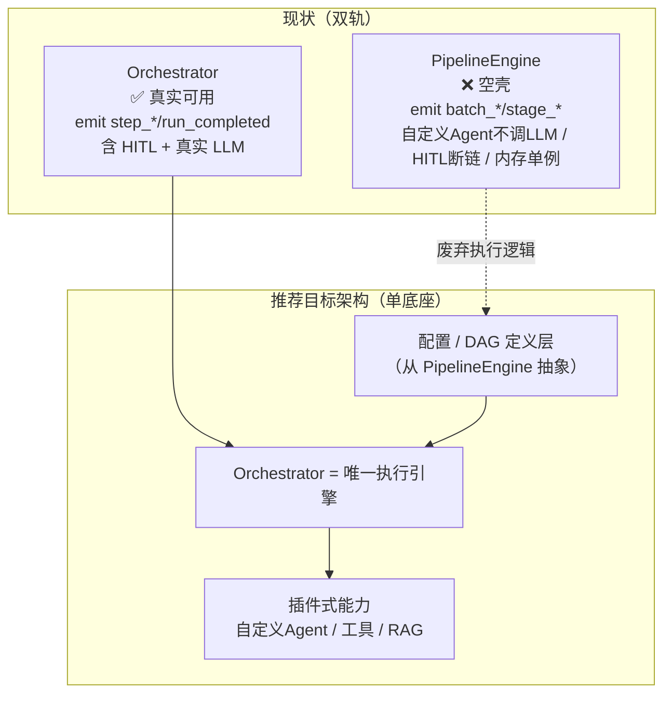
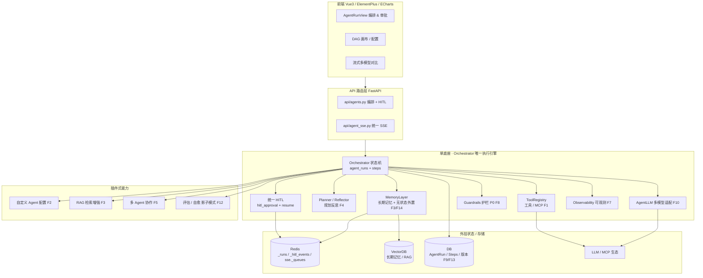

# 智能体编排管理功能 — 前沿能力补充方案与可行性分析（优化后修正版）

> 修订人：软件架构师（高见远）
> 修订依据：基于原方案《智能体编排管理功能 — 前沿能力补充方案与可行性分析》的**独立可行性评审**（实际读取仓库代码核实关键断言）后重写。
> 适用平台：IR 安全事件响应平台（FastAPI + SQLite / Vue 3 + Element Plus + ECharts）
> 修订性质：非简单批注，而是**修订后的全文**——可直接独立阅读。

---

## 1. 文档导读（本版相对原方案的关键修正）

本版在保留原方案框架与主体内容的基础上，依据独立代码核实结论，做了以下 5 条关键修正：

1. **推翻"双底座 / 以 PipelineEngine 为统一底座"主张** → 改为**单底座策略**：以已实测可用的 **Orchestrator** 为唯一执行引擎，PipelineEngine 降级为"配置 / DAG 定义层"并最终删除其执行代码。
2. **SSE 协议错位精确化** → 不再是"全局错位"，而是**仅 PipelineEngine 空壳路径**错位（Orchestrator 路径 `step_*` 与前端 `useSSE.js` 完全匹配，是真实可用路径）。
3. **F1–F14 可行性评级重估** → 按独立研判的 B1 表修正：F1 高→中、F4 中→中-低（风险偏高）、F8 中→中-高并**升 P0**、F9 中→中-高、F14 中→高并**进 M0**、其余维持或微调。
4. **M0 范围扩充为硬前置** → 从"仅修空心化"扩充为"修空心化（自定义 Agent 空壳 + PipelineEngine HITL 断链）+ 无状态化（`_runs`/`_hitl_events`/`sse_manager._queues`/`cache_manager` 外置 Redis/DB）+ SSE/HITL 协议统一对齐"。
5. **整体可行性总评由"高"改为"基本可行但有前提"** → 并补充 TOP3 真实风险（架构债引爆 / LLM 规划失控运维代价 / MCP"二代空壳"陷阱）与"反空壳"端到端验收门槛。

> 其余章节（真实可用能力清单、差距矩阵、各功能痛点/对标/价值/技术方案、路线图目标态）主体沿用原方案，仅对评级、周期、风险与架构图做上述修正。

---

## 2. 审计结论摘要（修正版）

> 本摘要的"空心化清单"经独立代码核实：抽查 5 项核心断言全部属实（其中 SSE 项属实但需精确化为"仅 PipelineEngine 路径"），足以支撑主轴判断——**固定闭环 Orchestrator 真实可用 / 自定义 Pipeline 路径是演示型空壳**。

### 2.1 真实可用的能力（已验证）

| 能力 | 代码证据 | 说明 |
|---|---|---|
| 固定闭环 Orchestrator | `backend/app/services/agents/orchestrator.py:109-510` | 真实 LLM 调用（`root_cause` 分支 `await llm.call(...)`），emit `step_update/step_completed/run_completed` |
| SSE 流式（Orchestrator 路径） | `api/agent_sse.py:16` + 前端 `useSSE.js:362-371` | 后端推 `step_*` 与前端监听**完全匹配**，实时性可用 |
| HITL 框架（Orchestrator 侧） | `hitl_approval` 表 + `resume` API | 审批态 + 恢复接口齐备 |
| Agent 运行持久化基础 | `AgentRun` / `AgentRunStep` 落库 | 为"续跑/版本管理"提供基础 |
| DAG 画布 UI | `frontend/src/components/agents/GraphPanel.vue` | 前端可视化基础在 |

### 2.2 部分实现 / 待收敛

| 能力 | 现状 | 收敛方向 |
|---|---|---|
| 多模型 | `AgentLLM` 支持多 profile | 加适配层即可（F10） |
| 自定义 Agent 配置 | 配置文件有 `display_name/data_sources/depends_on` 字段 | 需接入真实 LLM 通道（F2 修空壳部分） |
| 工具 / MCP | 无 tool-calling loop 框架 | 需从零搭建（F1） |

### 2.3 空心化清单（8 项，含核实结论）

| # | 问题 | 代码位置 | 核实结论 |
|---|---|---|---|
| 1 | 自定义 Agent 的 `else` 分支不调 LLM，仅返回静态 markdown 摘要 | `pipeline_engine.py:681-693` | ✅ 属实（对比 `602-634` 的 `root_cause` 分支确有 `await llm.call`） |
| 2 | HITL 的 `asyncio.Event` 创建后直接 `return` 未 `await`，事件成孤儿 | `pipeline_engine.py:259-275` | ✅ 属实且更严重（resume 时 `.set()` 无人等待） |
| 3 | `hitl_manager.py` 是死代码（仅 import 未调用） | `hitl_manager.py` + `agent_management.py:13` | ✅ 属实（全 `backend/app` 无 `hitl_manager.` 调用点） |
| 4 | SSE 协议错位 | 后端 `pipeline_engine.py:147/157`（batch_*）vs 前端 `useSSE.js`（step_*） | ⚠️ 方向属实但**仅限 PipelineEngine 空壳路径**；Orchestrator 路径匹配正常 |
| 5 | 内存单例无法跨 worker | `pipeline_engine.py:46-48`、`sse_manager.py:19/78`、`cache_manager.py:39/119` | ✅ 属实且为**架构级硬伤** |
| 6 | 持久化续跑断点缺失 | `AgentRun` 落库但无断点恢复逻辑 | 文档列项，本次未逐条核实（建议补核） |
| 7 | 前端 DAG 画布未接后端执行 | `GraphPanel.vue` 仅可视化 | 文档列项，本次未逐条核实（建议补核） |
| 8 | Orchestrator 与 PipelineEngine 双轨重复实现 | 两处各有一套 LLM/HITL/SSE | 文档列项，本次未逐条核实（建议补核） |

### 2.4 总评（修正）

**双轨并存是当前最大的技术债。** Orchestrator 是实测可用路径，PipelineEngine 是演示型空壳；原方案主张"以 PipelineEngine 为底座收敛 Orchestrator"会把坏代码继承下来、放大风险。正确做法是**以 Orchestrator 为唯一执行引擎，PipelineEngine 降级为配置/DAG 定义层并最终删除执行代码**（见 §5）。

---

## 3. 与前沿差距矩阵 G1–G14

> 对比对象：AutoGPT / LangGraph / MetaGPT / CrewAI / 主流 Agent 平台（如 Dify、Coze）的前沿能力。差距等级：高（代差明显）/ 中（部分具备）/ 低（接近前沿）/ 部署级硬伤（影响上线而非功能本身）。

| 编号 | 能力维度 | 当前状态 | 前沿对标 | 差距等级 |
|---|---|---|---|---|
| G1 | 工具调用 / MCP | 无 tool-calling loop 框架 | 标准 Function Calling + MCP 生态 | 中（原估高，实际从零搭建工作量被低估） |
| G2 | 可配置 Agent | 配置字段在，但自定义分支不调 LLM | 可视化编排 + 真实执行 | 中（修空壳后可达成） |
| G3 | 长期记忆 / RAG | 有 `knowledge_retriever`（ChromaDB） | 多模态长期记忆 + 自动进化 | 中（隐性成本被低估） |
| G4 | 规划 / 反思 | 无 | ReAct/Plan-and-Execute + 自我反思 | 中-低（IR 场景失控风险偏高） |
| G5 | 多 Agent 协作 | 单 Agent 闭环 | 多角色协作 + 任务委派 | 中（强耦合 F4） |
| G6 | 统一 HITL | Orchestrator 侧有，Pipeline 侧断链 | 统一审批中台 | 中（收敛后达标，属 M0 修空心化） |
| G7 | 可观测性 | 基础日志 | trace + 评估面板 | 中-低（成本可控、ROI 高） |
| G8 | 护栏安全 | 无 action 治理 | action 白名单 + 确认 + 回滚 | 中-高（**应升 P0**，IR 动作破坏性强） |
| G9 | 持久化续跑 | runs/steps 落库 | 断点续跑 + 回放 | 中-高（基础在，补续跑逻辑即可） |
| G10 | 流式多模型 | Orchestrator 流式 + 多 profile | 多模型路由 + 对比 | 中 |
| G11 | DAG 画布 | UI 已存在但未接执行 | 可视化编排即执行 | 中（接后端即可） |
| G12 | 评估 / 自愈 | 无 | 自动评估 + 自我改进 | 低-中（需标注集，建议影子模式） |
| G13 | 版本管理 | 有 report versions/diff | Agent 配置版本 + 回滚 | 中 |
| G14 | 无状态部署 | 内存单例（`_runs`/`_hitl_events`/`sse`/`cache`） | 水平扩展无状态 | **高 + 部署级硬伤**（应进 M0，原方案严重后置） |

---

## 4. 建议补充功能 F1–F14（修正版）

> 保留原方案的"痛点 / 对标 / 价值 / 技术方案"主体；**可行性评级按独立研判 B1 表修正**，并在 F8 标注 **P0**、F14 标注 **进 M0**。

### F1 工具调用 / MCP
- **痛点**：当前无任何 tool-calling loop 框架，Agent 无法调用外部工具完成取证动作（查进程、拉日志、查情报）。
- **对标**：LangChain / AutoGPT 的 Function Calling 标准模式；MCP 作为工具生态接入标准。
- **价值**：让 Agent 从"只会聊天"升级为"能动手操作"，是编排管理落地的前提。
- **技术方案**：在 Orchestrator 内搭建 `LLM → tool → observe` 循环；引入 MCP Python SDK（stdio/SSE transport），封装 `ToolRegistry`；为每个工具定义 schema、幂等键、超时与重试。
- **可行性（修正）**：**中**（原评高，被高估）。当前完全没有循环框架需从零搭；MCP SDK 仍在快速演进，transport/auth/retry 细节多；"让 LLM 可靠解析并执行工具结果"的工作量被轻看。

### F2 可配置 Agent
- **痛点**：内置 Agent 写死，业务方无法按场景自定义"数据来源 / 依赖 / 提示词"。
- **对标**：Dify / Coze 的可视化 Agent 配置。
- **价值**：降低定制门槛，复用同一执行引擎服务多场景。
- **技术方案**：保留配置层（`display_name/data_sources/depends_on` 等字段），将自定义分支接入 Orchestrator 已有的 `AgentLLM` 真实调用通道。
- **可行性（修正）**：**高**（但须拆出"修空壳"部分归 M0）。技术不难，接上 `AgentLLM` 即可；"修空壳"不应当 F2 新功能计费，应归入 M0 硬前置。

### F3 长期记忆 / RAG
- **痛点**：单次对话无长期记忆，跨案件经验无法沉淀。
- **对标**：RAG + 向量库长期记忆。
- **价值**：提升复案研判效率，减少重复取证。
- **技术方案**：复用现有 `knowledge_retriever`（ChromaDB + sentence-transformers），加 Agent 长期记忆索引与检索增强。
- **可行性（修正）**：**中**（隐性成本被低估）。向量库部署（pgvector/Chroma）、嵌入模型选型与**持续成本**、chunk 策略、检索质量调优是最大隐性成本之一，需量化。

### F4 规划 / 反思
- **痛点**：复杂多步取证依赖人工拆解，缺乏自动规划与自我纠错。
- **对标**：Plan-and-Execute / ReAct + Reflection。
- **价值**：自动化多步调查，缩短响应时间。
- **技术方案**：在 Orchestrator 上叠加 `Planner` + `Reflector`；引入预算上限（步数 / token / 动作数）与强护栏。
- **可行性（修正）**：**中-低（风险偏高）**（原评中，被高估）。IR 多步取证场景下 LLM **规划失控概率显著高于文档描述**（循环、跑飞、幻觉操作）。必须有强护栏 + 预算上限，否则不应上线；上线前 F8 护栏必须就位。

### F5 多 Agent 协作
- **痛点**：单 Agent 难以覆盖分诊 / 调查 / 处置 / 报告全链路。
- **对标**：多角色协作（CrewAI / MetaGPT）。
- **价值**：分工专业化，提升端到端自动化。
- **技术方案**：以 Orchestrator 为中枢做任务委派；多 Agent 通过统一 HITL 与共享记忆协作。
- **可行性（修正）**：**中**。与 F4 强耦合；无可靠规划则多 Agent 易死锁 / 重复劳动。

### F6 统一 HITL
- **痛点**：Orchestrator 有 HITL 框架，PipelineEngine 路径 HITL 断链，双轨不一致。
- **对标**：统一审批中台。
- **价值**：所有高风险动作统一审批，审计闭环。
- **技术方案**：废弃 PipelineEngine 的坏 HITL，全部收敛到 Orchestrator 已有的 `hitl_approval` + `resume` 实现（修空心化，属 M0/M1）。
- **可行性（修正）**：**高**（属 M0/M1 修空心化）。Orchestrator 框架已具备，主要是收敛而非从零。

### F7 可观测性
- **痛点**：运行过程黑盒，难以排查 Agent 跑飞 / 工具失败。
- **对标**：trace + 评估面板（LangSmith 类）。
- **价值**：可观测即可治理，ROI 高。
- **技术方案**：结构化日志 + 运行链路 trace，挂到 Observability 层。
- **可行性（修正）**：**中-高**。成本可控，收益明确。

### F8 护栏安全 ⚠️ P0（升优先级）
- **痛点**：IR 平台动作有真实破坏力（隔离主机、阻断、删数），当前无 action 治理。
- **对标**：action 白名单 + 强制确认 + 回滚预案。
- **价值**：防止 LLM 幻觉 / 规划失控造成真实损失，是上线**硬前提**。
- **技术方案**：`Guardrails` 层做 action 白名单 + 高危动作确认 + 自动回滚预案；与 HITL 联动。
- **可行性（修正）**：**中-高，升 P0**（原评中，被低估）。IR 动作破坏性强，护栏不是可选项——F4/F5 上线前 F8 必须就位。

### F9 持久化续跑
- **痛点**：长任务中断后无法从断点恢复，重跑成本高。
- **对标**：断点续跑 + 回放。
- **价值**：提升长任务鲁棒性。
- **技术方案**：在已有 `AgentRun`/`AgentRunStep` 落库基础上补"断点记录 + 恢复"逻辑。
- **可行性（修正）**：**中-高**（原评中，被低估）。基础已在，续跑可达成。

### F10 流式多模型
- **痛点**：用户无法直观对比不同模型在同一任务上的表现。
- **对标**：多模型路由 + 流式对比。
- **价值**：便于模型选型与质量评估。
- **技术方案**：复用 Orchestrator SSE 流式 + `AgentLLM` 多 profile，加路由 / 对比适配层。
- **可行性（修正）**：**中**。已有流式与多 profile，适配层工作量可控。

### F11 DAG 画布
- **痛点**：编排过程不可视化，业务方参与门槛高。
- **对标**：可视化编排即执行（Dify）。
- **价值**：降低编排门槛，所见即所得。
- **技术方案**：将已有 `GraphPanel.vue` 真正接入后端执行（配置/DAG 定义层 → Orchestrator）。
- **可行性（修正）**：**中**。UI 基础在，主要是接后端执行。

### F12 评估 / 自愈
- **痛点**：缺乏自动化评估，Agent 质量靠人工。
- **对标**：自动评估 + 自我改进。
- **价值**：持续质量提升（长期）。
- **技术方案**：建评估集 + 影子模式（只建议不执行），逐步过渡到自愈。
- **可行性（修正）**：**低-中**。需高质量标注集，短期难；建议影子模式，放最后。

### F13 版本管理
- **痛点**：Agent 配置 / 提示词变更无版本与回滚。
- **对标**：配置版本管理 + diff。
- **价值**：变更可追溯、可回滚。
- **技术方案**：复用已有 report versions/diff 接口，扩展到 Agent 配置。
- **可行性（修正）**：**中**。基础接口在。

### F14 无状态部署 ⚠️ 应进 M0（原方案严重后置）
- **痛点**：内存单例（`_runs` / `_hitl_events` / `sse_manager._queues` / `cache_manager._cache`）无法跨 worker，多副本下 SSE 丢事件、HITL 卡死、缓存不一致。
- **对标**：水平扩展无状态服务。
- **价值**：从"单 worker 演示"走向"生产可扩展"，是后续一切的地基。
- **技术方案**：将四类内存状态外置到 Redis（运行态 / HITL 事件 / SSE 队列）/ DB（持久化缓存）；引入 `MemoryLayer` 抽象。
- **可行性（修正）**：**高（阻碍项，应前置）**（原评中，被严重后置）。这是当前最大架构债；不先外置，M1+ 任何多 worker 功能都会再出 SSE/HITL 故障，**必须进 M0**。

---

## 5. 整体技术架构演进（修正版：单底座策略）

> **核心修正**：原方案主张"以 PipelineEngine 为统一底座，收敛 Orchestrator 重复实现"。独立研判结论相反——**以已验证可用的 Orchestrator 为唯一执行引擎，PipelineEngine 降级为"配置 / DAG 定义层"并最终删除其执行代码**。理由：Orchestrator 实测可用（真实 LLM + HITL + 持久化 + SSE 匹配前端），PipelineEngine 是空壳（不调 LLM / HITL 断链 / SSE 错位 / 内存单例）。"以空壳为底座"会继承坏代码、放大风险。

### 5.1 收敛架构图（双轨 → 单底座）

### 5.2 目标态单底座架构图

### 5.3 关键设计点

- **单执行引擎**：所有运行（内置 + 自定义）统一走 Orchestrator，消除双轨重复与 SSE 错位。
- **配置 / DAG 定义层**：保留 PipelineEngine 的"自定义配置"语义，但只作为 Orchestrator 的输入定义，不再有独立执行路径。
- **无状态外置（F14）**：四类内存状态统一外置 Redis/DB，Orchestrator 自身无进程内单例。
- **统一 HITL + 护栏（F6/F8）**：所有动作经统一审批与白名单，高危动作强制确认 + 回滚预案。
- **插件式能力**：工具（MCP）、RAG、多 Agent、评估作为插件挂载，便于独立验收（反空壳门槛）。

---

## 6. 落地路线图（修正版）

> **M0 是硬前置，不可省略也不可后移。** 周期重估：单人 14–18 周 / 小团队 9–12 周（原方案 10–12 / 6–8 偏乐观，低估了无状态化、RAG 成本、规划护栏三块隐性工期）。前提：RAG 用现成向量库、多模型仅适配层、1 人兼顾前后端与 LLM 调优（或小团队分工）。

### M0 — 修空心化 + 无状态化 + SSE/HITL 统一（约 3 周，硬前置）

| 子项 | 内容 | 对应修正 |
|---|---|---|
| 修自定义 Agent 空壳 | 自定义分支接入 Orchestrator 的 `AgentLLM` 真实调用 | F2 的"修空壳"部分（非新功能） |
| 修 PipelineEngine HITL 断链 | 废弃坏 HITL，收敛到统一实现 | F6 修空心化 |
| 无状态化 | `_runs`/`_hitl_events`/`sse_manager._queues`/`cache_manager._cache` 外置 Redis/DB | **F14 进 M0（原方案严重后置）** |
| SSE / HITL 协议统一对齐 | 全平台统一 `step_*` + 统一审批协议，前端无错位 | 修正 SSE 错位为"仅 PipelineEngine 路径"后的收口 |

> 可并行低风险高收益项：SSE 协议与 HITL 统一对齐（直接修复前端实时性体验）。

### M1 — 单底座收敛 + 配置/DAG 定义层（约 3–4 周）

- 删除 PipelineEngine 执行代码，配置层挂到 Orchestrator。
- 自定义 Agent 配置（F2）真正可用；DAG 画布（F11）接后端执行。
- 统一 HITL（F6）收口完成。

### M2 — 工具 / MCP + 护栏 + 可观测（约 3–4 周，F8 必须就位）

- 工具调用 / MCP（F1）+ `ToolRegistry`。
- **护栏安全（F8，P0）就位**：action 白名单 + 确认 + 回滚。
- 可观测性（F7）接入。
- 持久化续跑（F9）补断点恢复。

> **硬约束**：F4/F5（规划/多 Agent）上线前，本阶段 F8 护栏必须已就位。

### M3 — 规划反思 + 多 Agent 协作 + 长期记忆（约 3–4 周）

- 规划 / 反思（F4，中-低风险，强护栏 + 预算上限）。
- 多 Agent 协作（F5）。
- 长期记忆 / RAG（F3，用现成向量库）。
- 流式多模型（F10）对比适配。

### M4 — 评估自愈 + 版本管理打磨（约 2–3 周）

- 评估 / 自愈（F12，影子模式，只建议不执行）。
- 版本管理（F13）扩展到 Agent 配置。
- 全量"反空壳"验收 + 生产压测。

### 周期对照

| 口径 | 原方案估计 | 本版估计 | 前提 |
|---|---|---|---|
| 单人 | 10–12 周 | **14–18 周** | M0 含无状态化；RAG 用现成库；多模型仅适配层 |
| 小团队(2–3人) | 6–8 周 | **9–12 周** | 同上；RAG(F3)+规划(F4)做到生产可用再加 3–4 周 |

---

## 7. 综合可行性评估（修正版）

### 7.1 总评（修正）

**基本可行但有前提。** 前提有三：
1. M0 真先修空心化（自定义 Agent 空壳 + PipelineEngine HITL 断链）；
2. **M0 必须同时包含无状态化（F14）**——原方案把 F14 后置是错误，不先外置则 M1+ 多 worker 功能会再爆 SSE/HITL 故障；
3. F4/F5 上线前 F8 护栏（P0）必须就位。

若跳过 M0 直接叠 F1–F14，会建立在空壳 + 内存单例之上，重演本次审计发现的"演示型空壳"悲剧。

### 7.2 TOP3 真实风险（独立判断，非复述原文档表）

| 排名 | 风险 | 说明 | 缓解 |
|---|---|---|---|
| 1 | **架构债引爆（最前置硬风险）** | 内存单例致无法水平扩展；M1–M3 在单 worker 能跑，一上生产多副本就 SSE 丢事件、HITL 卡死 | F14 无状态化进 M0，外置 Redis/DB 后再叠多 worker 功能 |
| 2 | **LLM 规划失控的运维代价** | F4/F5 一旦失控，IR 破坏性动作的误操作真实损失 + 回滚成本远超开发成本 | F8 护栏(P0) 绑定 F4/F5 上线；强护栏 + 预算上限 + 影子模式先行 |
| 3 | **MCP"二代空壳"陷阱** | 为赶进度搭了工具框架但工具质量/鉴权/幂等不到位，出现"看起来能调工具、其实调错/重复调"的二代空壳 | 反空壳验收门槛；工具强制 schema + 幂等键 + 鉴权；不为赶进度牺牲质量 |

### 7.3 "反空壳"验收门槛（强制）

> 每个 F 功能上线前，须通过端到端验收，避免重演本次"演示型空壳"：

- ✅ **真实 LLM 调用链路**：非 mock，走真实 `AgentLLM` 调用；
- ✅ **真实工具执行**：工具/MCP 实际执行并返回结果，非静态兜底；
- ✅ **跨 worker SSE 不丢事件**：多副本部署下 SSE 事件完整、HITL 可正常 resume；
- ✅ **护栏生效**（F4/F5 类）：高危动作经白名单 + 确认 + 回滚预案。

### 7.4 文档未提及的隐性成本（补充）

1. **MCP 客户端生态成熟度**：Python MCP SDK 仍在快速变化，多 provider/auth/transport 细节多，易"接上了但不可靠"。
2. **向量库 + 嵌入模型持续成本**：RAG 的 token/存储/算力，检索质量调优人力，原方案仅标"中"未量化。
3. **Redis/外部状态引入后的运维负担**：多 worker 化必然引入 Redis/消息队列，带来监控、故障转移、容量规划新负担。
4. **LLM 规划失控的实际代价**：IR 场景动作破坏性强，F4 失控的误操作损失 + 回滚成本远超开发成本（原方案弱化）。
5. **测试与标注成本**：F12 评估/自愈需高质量标注集；多模型一致性测试成本高。
6. **提示词/技能工程长期负债**：LLM 行为随模型版本漂移，需持续维护，原方案未计入长期运维。

---

## 8. 结论与推荐起点（修正版）

1. **采纳单底座策略**：以已验证可用的 **Orchestrator** 为唯一执行引擎，PipelineEngine 降级为"配置 / DAG 定义层"并最终删除其执行代码（推翻原方案"以 PipelineEngine 为底座"主张）。
2. **扩充 M0 为硬前置**：M0 = 修空心化（自定义 Agent 空壳 + PipelineEngine HITL 断链）+ **无状态化（F14）** + SSE/HITL 协议统一对齐。这是后续一切的地基，不可省略也不能后移。
3. **F8 护栏升 P0**：与 F4/F5 绑定上线；IR 动作破坏性强，没有 action 白名单 + 确认 + 回滚就不允许规划类智能体执行真实动作。
4. **RAG / 规划采用"最小可用 + 持续调优"**：用成熟向量库（pgvector）与现有嵌入服务，避免自研；F12 评估/自愈放最后且用**影子模式（只建议不执行）**。
5. **设"反空壳"验收门槛**：每个 F 功能上线前须过端到端验收（真实 LLM 调用 + 真实工具执行 + 跨 worker SSE 不丢事件），避免重演空壳悲剧。

**推荐起点**：先启动 **M0**（修空心化 + 无状态化 + SSE/HITL 统一），并行补齐审计剩余 3 项空心化清单的逐条核实；M0 完成并过反空壳门槛后，再进入 M1 单底座收敛。整体工期按本版重估（单人 14–18 周 / 小团队 9–12 周）规划，不沿用原方案偏乐观的估计。

---

> 附：本版所有代码级断言均来自独立评审时实际读取的仓库文件（`pipeline_engine.py`、`hitl_manager.py`、`sse_manager.py`、`cache_manager.py`、`orchestrator.py`、`agent_sse.py`、`agent_management.py`、`useSSE.js`、`GraphPanel.vue`），核实路径与行号见《独立可行性评审报告_架构师.md》。
