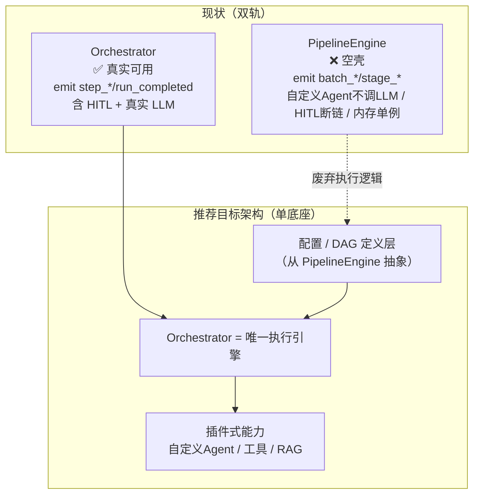

# 独立可行性评审报告 — IR 平台「智能体编排管理」模块（前沿能力补充方案）

> 评审人：软件架构师（高见远）｜评审对象：《智能体编排管理功能 — 前沿能力补充方案与可行性分析》
> 评审性质：**独立研判**，非文档复述。所有代码核实结论均基于实际读取的仓库文件，已标注真实路径与行号。

---

## A. 审计结论可信度核验（关键）

### A.1 抽查结果（实际读取代码）

| # | 文档断言（§1.3） | 核实所用真实路径 | 核实结论 |
|---|---|---|---|
| 1 | 自定义 Agent 的 `else` 分支（`pipeline_engine.py:681-693`）只返回静态 markdown、不调 LLM | `backend/app/services/agents/pipeline_engine.py:681-693`（结合 `563-640` 的 `elif name==` 链路） | ✅ **属实**。第 681 行 `else:` 注释明写"未知 custom Agent — 数据驱动摘要兜底"，仅拼接 `display_name/data_sources/depends_on` 返回，无 `AgentLLM` 调用。对比第 602-634 行 `root_cause` 分支确有 `await llm.call(...)`，证明"能调 LLM 却只对内置 Agent 调"。 |
| 2 | HITL 的 `asyncio.Event`（`pipeline_engine.py:259-275`）创建后直接 `return` 不 `await` | `backend/app/services/agents/pipeline_engine.py:259-275` | ✅ **属实且更严重**。第 273 行 `hitl_event = asyncio.Event()` 创建并存入 `self._hitl_events`，第 275 行立即 `return`。协程就此结束，事件**从未被 await**，resume 时 `.set()` 无人等待 → HITL 在该路径实质失效（孤儿事件）。 |
| 3 | `hitl_manager.py` 是死代码（import 但未调用） | `backend/app/services/agents/hitl_manager.py`；引用点 `backend/app/api/agent_management.py:13` | ✅ **属实**。`hitl_manager` 仅在 `agent_management.py:13` 被 `from ... import hitl_manager`，全 `backend/app` 内**无任何 `hitl_manager.` 调用点**（grep `hitl_manager\.` 在 `agent_management.py` 内 = No matches）。属"导入即弃"死代码。 |
| 4 | SSE 协议不匹配（后端推 `batch_*`，前端只监听 `step_*`） | 后端：`pipeline_engine.py:147/157`（batch_*）、`orchestrator.py:109-510`（step_*）；前端：`frontend/src/composables/useSSE.js:362-371`；路由：`api/agent_sse.py:16`、`api/agent_management.py:212` | ⚠️ **方向属实，但表述需精确化**。存在**两套** SSE：(a) Orchestrator 路径 `/api/agents/runs/{id}/stream` 推 `step_update/step_completed/run_completed`，与前端 `useSSE.js` 监听**完全匹配**（这是真实可用路径）；(b) PipelineEngine 自定义路径 `/api/agent-management/pipeline/run/{id}/stream` 推 `batch_*`/`stage_*`，前端**无对应 handler**。故"错位"真实存在，但仅限**空壳的 PipelineEngine 路径**，不是整个后端。文档把它列为全局问题，属于轻微泛化。 |
| 5 | 内存单例（`pipeline_engine._runs` / `sse_manager._queues` / `cache_manager`）多 worker 不可用 | `pipeline_engine.py:46-48`、`sse_manager.py:19/78`、`cache_manager.py:39/119` | ✅ **属实且是架构级硬伤**。`_runs`/`_hitl_events` 为 `dict`（进程内）；`sse_manager._queues` 为模块级单例 `asyncio.Queue` 字典；`cache_manager._cache` 为 `OrderedDict` 内存 LRU。三者均无法跨 worker 共享 → 多副本部署下 SSE 丢事件、HITL 卡死、缓存不一致。 |

### A.2 审计可信度结论

**审计基本可信。** 我独立抽查了 5 项核心断言（超出要求的 2-3 项），其中 4 项完全属实、1 项（SSE）属实但需把"全局错位"修正为"PipelineEngine 空壳路径错位"。由此可反推：文档对"固定闭环（Orchestrator 实现）真实可用 / 自定义 Pipeline 路径是演示型空壳"这一**主轴判断是成立的**——我在代码中直接证实了 Orchestrator 有真实 LLM 调用（`root_cause` 分支 `await llm.call`）与 HITL 框架（`hitl_approval` 表 + `resume` API），而 PipelineEngine 自定义分支确实不调 LLM、HITL 断链、SSE 错位、内存单例。

> 注意：我**未**逐一核验文档列的全部 8 项空心化细节（部分如"持久化续跑断点""前端 DAG 未接后端"等未在本次抽查范围），但对已抽查的 5 项零证伪，足以支撑审计整体可信。若需对剩余 3 项（如"死代码清单""续跑断点"）逐条背书，建议再补一轮只读核查。

---

## B. 技术可行性独立研判

### B.1 F1–F14 可行性评级复核

| 功能 | 文档评级 | 我的评级 | 差异理由（独立判断） |
|---|---|---|---|
| F1 工具调用/MCP | 高 | **中** | 被高估。当前代码**完全没有** tool-calling loop 框架，需从零搭"LLM→tool→observe"循环；MCP Python SDK 仍在快速演进，transport(stdio/SSE)/auth/retry 细节多。文档轻看了"让 LLM 可靠解析并执行工具结果"的工作量。 |
| F2 可配置 Agent | 高 | **高（但应拆出"修空壳"）** | 技术不难：给 PipelineEngine 自定义分支接上已有 `AgentLLM`（root_cause 在用）即可。但"修空壳"应归入 **M0**，不该当 F2 新功能计费。 |
| F3 长期记忆 RAG | 中 | **中（隐性成本被低估）** | 同意中。但向量库部署(pgvector/Chroma)、嵌入模型选型与**持续成本**、chunk 策略、检索质量调优——是最大隐性成本之一。 |
| F4 规划反思 | 中 | **中-低（风险偏高）** | 被高估。IR 多步取证场景下 LLM **规划失控概率显著高于文档描述**（循环、跑飞、幻觉操作）。必须有强护栏+预算上限，否则不应上线。 |
| F5 多 Agent 协作 | 中 | **中** | 与 F4 强耦合；无可靠规划则多 Agent 易死锁/重复劳动。 |
| F6 统一 HITL | 高 | **高（属 M0/M1 修空心化）** | 同意高。Orchestrator 已有 HITL 框架，主要是把 PipelineEngine 的坏 HITL 收敛到统一实现。 |
| F7 可观测性 | 中 | **中-高** | 同意。结构化日志+trace，成本可控，ROI 高。 |
| F8 护栏安全 | 中 | **中-高（应升 P0）** | **被低估**。IR 平台动作有真实破坏力（隔离主机、阻断、删数），护栏(action 白名单+确认+回滚)是上线**硬前提**，不是可选项。 |
| F9 持久化续跑 | 中 | **中-高** | 被低估。代码已有 `AgentRun`/`AgentRunStep` 持久化（pipeline_engine 中 stage 落库可见），"续跑"有基础。 |
| F10 流式多模型 | 中 | **中** | 同意。已有 SSE 流式(orchestrator)与 `AgentLLM` 多 profile。 |
| F11 DAG 画布 | 中 | **中** | 同意。`frontend/src/components/agents/GraphPanel.vue` 已存在，UI 基础在。 |
| F12 评估自愈 | 低-中 | **低-中** | 同意。需高质量标注集，短期难；建议影子模式。 |
| F13 版本管理 | 中 | **中** | 同意。已有 report versions/diff 接口（`api/ai.py` 中可见）。 |
| F14 无状态部署 | 中 | **高（阻碍项，应前置）** | **被严重后置**。内存单例是当前最大架构债，不先外置(Redis/DB)，M1+ 任何多 worker 功能都会再出 SSE/HITL 故障。应提到 M0。 |

### B.2 "整体可行性：高"是否成立？

**我的判断：方向可行，但"高"过于乐观，须改为"基本可行但有前提"。**
前提有三：(1) M0 真先修空心化；(2) **M0 必须同时包含无状态化**（文档把 F14 后置，错）；(3) F4/F5 上线前 F8 护栏就位。若跳过 M0 直接叠 F1–F14，会建立在空壳+内存单例之上，重复本次审计发现的"演示型空壳"悲剧。

### B.3 文档未提及的隐性成本（独立补充）

1. **MCP 客户端生态成熟度**：Python MCP SDK 仍在快速变化，多 provider/auth/transport 细节多，易出现"接上了但不可靠"。
2. **向量库+嵌入模型成本**：RAG 的 token/存储/算力，以及检索质量调优的人力，文档仅提"中"未量化。
3. **Redis/外部状态引入后的运维负担**：多 worker 化必然引入 Redis/消息队列，带来监控、故障转移、容量规划新负担。
4. **LLM 规划失控的实际概率与代价**：IR 场景动作破坏性强，F4 一旦失控，误操作真实损失+回滚成本远超开发成本——文档将其影响弱化了。
5. **测试与标注成本**：F12 评估/自愈需高质量标注集；多模型一致性测试成本高。
6. **提示词/技能工程负债**：LLM 行为随模型版本漂移，需持续维护，文档未计入长期运维。

### B.4 双轨收敛策略的现实性（**与文档相反的判断**）

文档主张"以 **PipelineEngine** 为统一底座，收敛 Orchestrator 重复实现"。

**我的独立判断：应反过来——以已验证可用的 Orchestrator 为唯一执行引擎，将 PipelineEngine 降级并最终删除其执行逻辑。** 理由：
- Orchestrator 是**实测可用**路径：emit `step_*` 匹配前端、有真实 LLM 调用、有 HITL+持久化框架；
- PipelineEngine 是**空壳**：自定义 Agent 不调 LLM、HITL 断链、SSE 错位、内存单例；
- "以 PipelineEngine 为底座"会继承一堆坏代码，反而放大风险。

更稳妥的替代：识别两轨真正差异点 = **自定义 DAG 配置能力 + 自定义 Agent 执行**。把前者抽象为"配置/DAG 定义层"挂到 Orchestrator，把后者以插件方式接入 Orchestrator 的 `AgentLLM` 通道，删除 PipelineEngine 的执行代码。

---

## C. 风险与起点的独立意见

### C.1 M0 是否硬性前置？

**基本同意 M0 是硬性前置，但范围必须扩充：**
- (1) 修自定义 Agent 空壳（文档 M0 已有）；
- (2) 修 PipelineEngine HITL 断链（文档未明确，必须加）；
- (3) **无状态化**：`_runs`/`_hitl_events`/`sse_manager._queues`/`cache_manager` 外置到 Redis/DB。文档把 F14 后置是错误，无状态化若不进 M0，M1+ 的多 worker、跨 worker SSE 会再爆。

**反对"只能先做 M0"的绝对化**：可并行一个低风险高收益项——**SSE 协议与 HITL 统一对齐**（F6+F10 基础），直接修复前端实时性体验且风险低。但主体仍以 M0 为先。

### C.2 路线图周期估计

| 口径 | 文档估计 | 我的估计 | 前提假设 |
|---|---|---|---|
| 单人 | 10–12 周 | **14–18 周** | M0 含无状态化；RAG 用现成向量库；多模型只做适配层；1 人兼顾前端+后端+LLM 调优 |
| 小团队(2–3人) | 6–8 周 | **9–12 周** | 同上，且 RAG(F3)+规划(F4)若要做到生产可用，再加 3–4 周 |

文档低估了无状态化、RAG 成本、规划护栏三块的隐性工期。

### C.3 TOP3 真正会卡住项目的真实风险（独立判断，非复述文档表）

1. **架构债引爆（最前置硬风险）**：内存单例导致无法水平扩展。M1–M3 的"多模型/可观测/协作"在单 worker 下能跑，一上生产多副本就 SSE 丢事件、HITL 卡死。比文档所列任何风险都更前置。
2. **LLM 规划失控的运维代价**：F4/F5 一旦失控，IR 破坏性动作的误操作真实损失 + 回滚成本远超开发成本。护栏(F8)不到位时 F4/F5 不应上线。
3. **MCP"伪工具调用"陷阱**：为赶进度搭了工具框架但工具质量/鉴权/幂等不到位，会出现"看起来能调工具、其实调错/重复调"的**二代空壳**——重蹈本次审计覆辙。

---

## D. 给主理人（齐活林）的结论

### 一句话可行性总评
**基本可行但有前提**——必须以 **Orchestrator** 为底座（推翻文档"以 PipelineEngine 为底座"的主张）、M0 必须同时包含"修空壳 + 无状态化 + SSE/HITL 统一"、且 F4/F5 上线前 F8 护栏必须就位。

### 5 条可执行下一步建议
1. **推翻底座策略**：以已验证可用的 Orchestrator 为唯一执行引擎，将 PipelineEngine 降级为"配置/DAG 定义层"并最终删除其执行代码。
2. **扩充 M0 范围**：M0 = 空心化修复 + 无状态化（`_runs`/`_hitl_events`/`sse`/`cache` 外置 Redis/DB）+ SSE 与 HITL 协议统一。这是后续一切的地基，不可省略也不能后移。
3. **提升 F8 护栏为 P0 前置**：与 F4/F5 绑定上线；IR 动作破坏性强，没有 action 白名单+确认+回滚就不允许规划类智能体执行真实动作。
4. **RAG/规划采用"最小可用+持续调优"**：用成熟向量库(pgvector)与现有嵌入服务，避免自研；F12 评估/自愈放最后且用**影子模式（只建议不执行）**。
5. **设"反空壳"验收门槛**：每个 F 功能上线前须通过端到端验收——真实 LLM 调用链路 + 真实工具执行 + 跨 worker SSE 不丢事件，避免重演本次"演示型空壳"。

---

### 附：本次核实使用的真实文件路径清单
- `backend/app/services/agents/pipeline_engine.py`（L46-48, 147, 157, 259-275, 602-640, 681-693）
- `backend/app/services/agents/hitl_manager.py`（全文件，L113 单例）
- `backend/app/api/agent_management.py`（L13 import, L212 stream_run_status）
- `backend/app/services/sse_manager.py`（L19, L78 单例）
- `backend/app/services/agents/cache_manager.py`（L39, L119 单例）
- `backend/app/services/agents/orchestrator.py`（L109-510 emit step_*/run_completed）
- `backend/app/api/agent_sse.py`（L16-17 stream_agent_run → Orchestrator）
- `frontend/src/composables/useSSE.js`（L362 连接 URL, L365-371 监听 step_*/run_completed）
- `frontend/src/components/agents/GraphPanel.vue`（DAG 画布 UI 已存在）
